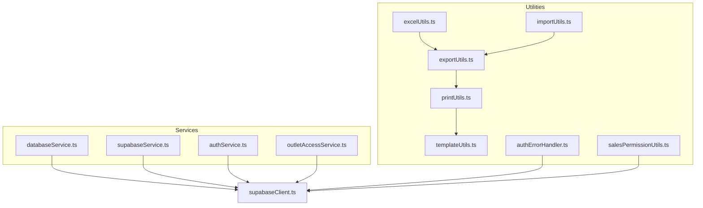
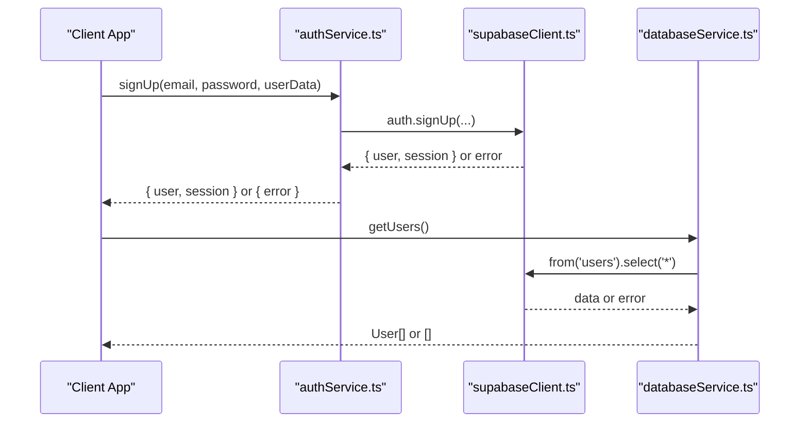
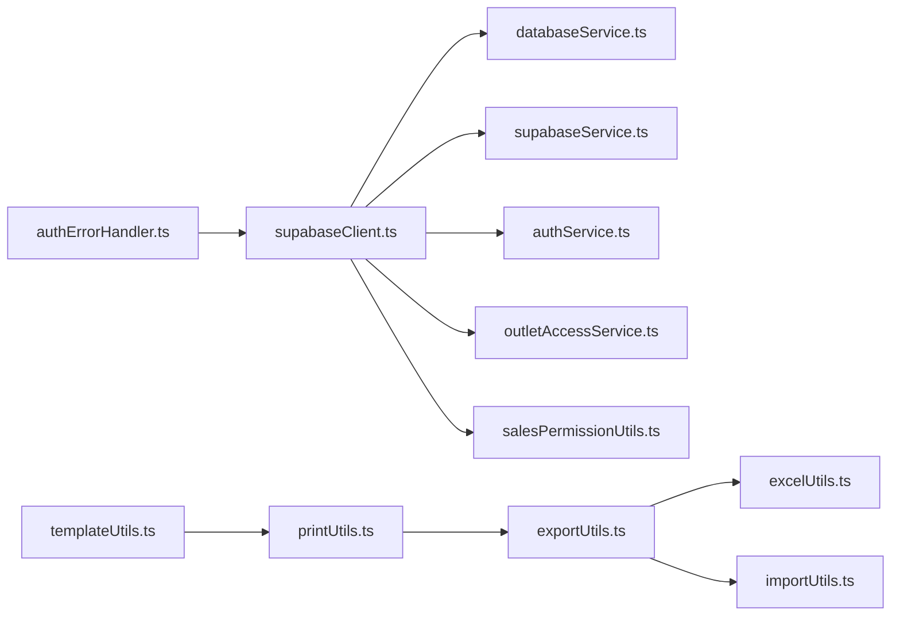

# API Reference

<cite>
**Referenced Files in This Document**
- [databaseService.ts](file://src/services/databaseService.ts)
- [supabaseService.ts](file://src/services/supabaseService.ts)
- [authService.ts](file://src/services/authService.ts)
- [supabaseClient.ts](file://src/lib/supabaseClient.ts)
- [printUtils.ts](file://src/utils/printUtils.ts)
- [exportUtils.ts](file://src/utils/exportUtils.ts)
- [templateUtils.ts](file://src/utils/templateUtils.ts)
- [excelUtils.ts](file://src/utils/excelUtils.ts)
- [importUtils.ts](file://src/utils/importUtils.ts)
- [authErrorHandler.ts](file://src/utils/authErrorHandler.ts)
- [outletAccessService.ts](file://src/services/outletAccessService.ts)
- [salesPermissionUtils.ts](file://src/utils/salesPermissionUtils.ts)
- [README.md](file://README.md)
</cite>

## Table of Contents
1. [Introduction](#introduction)
2. [Project Structure](#project-structure)
3. [Core Components](#core-components)
4. [Architecture Overview](#architecture-overview)
5. [Detailed Component Analysis](#detailed-component-analysis)
6. [Dependency Analysis](#dependency-analysis)
7. [Performance Considerations](#performance-considerations)
8. [Troubleshooting Guide](#troubleshooting-guide)
9. [Conclusion](#conclusion)
10. [Appendices](#appendices)

## Introduction
This API reference documents the complete backend and utility APIs used by the Royal POS Modern application. It covers:
- Database service API for CRUD operations and queries
- Supabase service integration for authentication, real-time subscriptions, and database operations
- Utility APIs for printing receipts, exporting data, and dynamic template rendering
- Authentication service API for user management, sessions, and permissions
- Practical usage examples, error handling patterns, and performance guidance

The APIs are implemented using TypeScript and Supabase, with modular utilities for exports, printing, and templates.

## Project Structure
The API surface is organized into services and utilities:
- Services: databaseService, supabaseService, authService, outletAccessService
- Utilities: printUtils, exportUtils, templateUtils, excelUtils, importUtils, authErrorHandler, salesPermissionUtils
- Supabase client configuration in supabaseClient

**Diagram sources**
- [databaseService.ts:1-5409](file://src/services/databaseService.ts#L1-L5409)
- [supabaseService.ts:1-60](file://src/services/supabaseService.ts#L1-L60)
- [authService.ts:1-127](file://src/services/authService.ts#L1-L127)
- [supabaseClient.ts:1-33](file://src/lib/supabaseClient.ts#L1-L33)
- [printUtils.ts:1-4330](file://src/utils/printUtils.ts#L1-L4330)
- [exportUtils.ts:1-785](file://src/utils/exportUtils.ts#L1-L785)
- [templateUtils.ts:1-584](file://src/utils/templateUtils.ts#L1-L584)
- [excelUtils.ts:1-36](file://src/utils/excelUtils.ts#L1-L36)
- [importUtils.ts:1-114](file://src/utils/importUtils.ts#L1-L114)
- [authErrorHandler.ts:1-92](file://src/utils/authErrorHandler.ts#L1-L92)
- [outletAccessService.ts:1-98](file://src/services/outletAccessService.ts#L1-L98)
- [salesPermissionUtils.ts:1-171](file://src/utils/salesPermissionUtils.ts#L1-L171)

**Section sources**
- [README.md:1-207](file://README.md#L1-L207)

## Core Components
- Database Service: Provides typed CRUD and query helpers for Supabase tables (users, products, customers, suppliers, outlets, sales, purchase orders, expenses, debts, discounts, returns, inventory audits, access logs, tax records, damaged products, reports, customer settlements, supplier settlements).
- Supabase Service: Lightweight wrappers for testing connectivity and generic table operations.
- Authentication Service: User registration, login, logout, session management, password reset/update, and metadata updates.
- Utility Services:
  - Print Utilities: Receipt generation and printing for sales and purchase transactions, QR code generation, and mobile/desktop print flows.
  - Export Utilities: CSV, JSON, PDF, and plain-text receipt exports; purchase and settlement PDF exports; GRN export.
  - Template Utilities: Dynamic receipt templates with configurable sections and layout.
  - Import/Export Utilities: CSV/JSON parsing and validation for products, customers, and suppliers.
  - Auth Error Handler: Graceful handling of authentication errors and session refresh.
  - Outlet Access Service: User-to-outlet assignment and access checks.
  - Sales Permission Utils: Role-based sales creation permissions and module access checks.

**Section sources**
- [databaseService.ts:1-5409](file://src/services/databaseService.ts#L1-L5409)
- [supabaseService.ts:1-60](file://src/services/supabaseService.ts#L1-L60)
- [authService.ts:1-127](file://src/services/authService.ts#L1-L127)
- [printUtils.ts:1-4330](file://src/utils/printUtils.ts#L1-L4330)
- [exportUtils.ts:1-785](file://src/utils/exportUtils.ts#L1-L785)
- [templateUtils.ts:1-584](file://src/utils/templateUtils.ts#L1-L584)
- [excelUtils.ts:1-36](file://src/utils/excelUtils.ts#L1-L36)
- [importUtils.ts:1-114](file://src/utils/importUtils.ts#L1-L114)
- [authErrorHandler.ts:1-92](file://src/utils/authErrorHandler.ts#L1-L92)
- [outletAccessService.ts:1-98](file://src/services/outletAccessService.ts#L1-L98)
- [salesPermissionUtils.ts:1-171](file://src/utils/salesPermissionUtils.ts#L1-L171)

## Architecture Overview
The system integrates Supabase for authentication and database operations. Services encapsulate Supabase calls, while utilities provide specialized functionality for printing, exporting, and templating.

**Diagram sources**
- [authService.ts:1-127](file://src/services/authService.ts#L1-L127)
- [supabaseClient.ts:1-33](file://src/lib/supabaseClient.ts#L1-L33)
- [databaseService.ts:416-429](file://src/services/databaseService.ts#L416-L429)

## Detailed Component Analysis

### Database Service API
Provides typed CRUD and query helpers for multiple entities. Each entity has a dedicated TypeScript interface and a set of functions for operations.

Key entities and operations:
- Users: getUsers, getUserById, createUser, updateUser, deleteUser
- Products: getProducts, getProductById, getProductByBarcode, getProductBySKU, createProduct, updateProduct, deleteProduct, incrementProductStock, decrementProductStock, bulkDeleteProducts
- Customers, Suppliers, Outlets, Sales, Purchase Orders, Expenses, Debts, Discounts, Returns, Inventory Audits, Access Logs, Tax Records, Damaged Products, Reports, Customer Settlements, Supplier Settlements

Common patterns:
- Error handling: catches exceptions and logs errors; returns safe defaults (empty arrays, nulls) on failure
- Validation: pre-validate inputs (e.g., prices >= 0, stock >= 0) before database calls
- Supabase integration: uses supabase.from(table).select/update/insert/delete with ordering and filtering

Return types:
- Entity arrays for list operations
- Single entity or null for single-entity operations
- Boolean for delete operations

Error handling:
- Throws and logs errors; returns null/false on failure
- Specific validations raise explicit errors for invalid inputs

Example usage paths:
- [Users CRUD:416-494](file://src/services/databaseService.ts#L416-L494)
- [Products CRUD:496-809](file://src/services/databaseService.ts#L496-L809)
- [Bulk delete:787-809](file://src/services/databaseService.ts#L787-L809)

**Section sources**
- [databaseService.ts:1-5409](file://src/services/databaseService.ts#L1-L5409)

### Supabase Service API
Lightweight helpers for connectivity and generic table operations.

Endpoints:
- testSupabaseConnection: health check against a table
- fetchDataFromTable: generic select
- insertDataIntoTable: generic insert

Parameters:
- tableName: string
- data: any

Return values:
- testSupabaseConnection: boolean
- fetchDataFromTable: any[]
- insertDataIntoTable: any[]

Error handling:
- Catches and logs errors; throws for upstream failures

**Section sources**
- [supabaseService.ts:1-60](file://src/services/supabaseService.ts#L1-L60)

### Authentication Service API
Handles user lifecycle and session management.

Endpoints:
- signUp(email, password, userData?): Creates a new user with optional metadata
- signIn(email, password): Authenticates user
- signOut(): Ends current session
- getCurrentUser(): Retrieves current user
- getCurrentUserRole(): Retrieves user role from metadata
- onAuthStateChange(callback): Subscribes to auth state changes
- resetPassword(email): Initiates password reset
- updatePassword(password): Updates password
- updateEmail(email): Updates email

Parameters:
- email: string
- password: string
- userData: any (optional)
- callback(event, session): function

Return values:
- Objects with user/session or error
- Boolean for signOut success
- Current user object or null
- Role string or default 'user'

Error handling:
- Catches and logs errors; returns error object
- Auth state subscription returns a subscription handle

**Section sources**
- [authService.ts:1-127](file://src/services/authService.ts#L1-L127)

### Print Utilities API
Generates and prints receipts for sales and purchase transactions, with QR code generation and template customization.

Key functions:
- generateReceiptQRCode(transaction, type): Generates QR code URL for sales/purchase
- printReceipt(transaction): Desktop/mobile receipt printing with QR code
- printPurchaseReceipt(transaction): Purchase receipt printing
- printCustomerSettlement(settlement): Settlement receipt printing
- isMobileDevice(): Device detection helper

Parameters:
- transaction: object containing receipt/purchase data
- settlement: object containing settlement data
- type: 'sales' | 'purchase'

Return values:
- QR code URL string
- Asynchronous printing completion

Error handling:
- QR code generation errors are caught and reported
- Mobile vs desktop print flows are separated
- Loading indicators and fallback cleanup

**Section sources**
- [printUtils.ts:1-4330](file://src/utils/printUtils.ts#L1-L4330)

### Export Utilities API
Exports data to CSV, JSON, PDF, and plain-text receipts. Includes specialized exports for purchase settlements, GRNs, and receipts.

Key functions:
- exportToCSV(data, filename)
- exportToJSON(data, filename)
- exportToPDF(data, filename, title)
- exportReceiptAsPDF(transaction, filename)
- exportCustomerSettlementAsPDF(settlement, filename)
- exportSupplierSettlementAsPDF(settlement, filename)
- exportGRNAsPDF(grn, filename)
- exportReceipt(transaction, filename): Plain text receipt
- showPreviewNotification(message): Mobile notification

Parameters:
- data: any[]
- filename: string
- title: string
- transaction/settlement/grn: objects
- message: string

Return values:
- Downloads initiated via blob URLs

Error handling:
- Validates non-empty data
- Mobile-specific save behavior with notifications
- Graceful handling of missing data

**Section sources**
- [exportUtils.ts:1-785](file://src/utils/exportUtils.ts#L1-L785)

### Template Utilities API
Manages dynamic receipt templates with configurable sections and layout.

Key functions:
- getTemplateConfig(): Loads receipt template config from localStorage or defaults
- getPurchaseTemplateConfig(): Loads purchase receipt template config
- saveTemplateConfig(config): Saves receipt template config
- savePurchaseTemplateConfig(config): Saves purchase receipt template config
- generateCustomReceipt(transaction, config): Renders receipt HTML with custom template
- generateCustomPurchaseReceipt(transaction, config): Renders purchase receipt HTML

Template config fields:
- customTemplate: boolean
- templateHeader: string
- templateFooter: string
- showBusinessInfo: boolean
- showTransactionDetails: boolean
- showItemDetails: boolean
- showTotals: boolean
- showPaymentInfo: boolean
- fontSize: string
- paperWidth: string

Return values:
- Template configuration objects
- Rendered HTML strings

**Section sources**
- [templateUtils.ts:1-584](file://src/utils/templateUtils.ts#L1-L584)

### Import/Export Utilities API
Parsing and validation utilities for CSV and JSON data.

Key functions:
- parseCSV(csvText): Converts CSV text to array of objects
- parseJSON(jsonText): Parses JSON text to array/object
- validateProducts(data): Validates product structure
- validateCustomers(data): Validates customer structure
- validateSuppliers(data): Validates supplier structure

Parameters:
- csvText/jsonText: strings
- data: any[]

Return values:
- Parsed arrays/objects
- Validation result with errors

Error handling:
- CSV parsing handles quoted values and escapes
- JSON parsing wraps errors
- Validation returns structured errors

**Section sources**
- [importUtils.ts:1-114](file://src/utils/importUtils.ts#L1-L114)
- [excelUtils.ts:1-36](file://src/utils/excelUtils.ts#L1-L36)

### Auth Error Handler API
Graceful handling of authentication errors and session refresh.

Key functions:
- handleAuthError(error): Formats user-friendly messages
- clearInvalidSession(): Clears session data
- isSessionInvalid(error): Checks if session is invalid
- refreshSession(): Attempts manual session refresh

Return values:
- Formatted error messages
- Boolean success/failure for refresh

**Section sources**
- [authErrorHandler.ts:1-92](file://src/utils/authErrorHandler.ts#L1-L92)

### Outlet Access Service API
Manages user-to-outlet assignments and access checks.

Key functions:
- getUserOutlet(userId): Fetches active outlet assignment with outlet details
- hasOutletAccess(userId, outletId): Checks if user has access to outlet

Return values:
- OutletUser object or null
- Boolean access result

**Section sources**
- [outletAccessService.ts:1-98](file://src/services/outletAccessService.ts#L1-L98)

### Sales Permission Utils API
Role-based sales creation permissions and module access checks.

Key functions:
- canCreateSales(): Determines if current user can create sales
- getCurrentUserRole(): Retrieves user role from Supabase
- hasModuleAccess(role, module): Checks module access by role

Return values:
- Boolean permission flags
- Role string or null

**Section sources**
- [salesPermissionUtils.ts:1-171](file://src/utils/salesPermissionUtils.ts#L1-L171)

## Dependency Analysis
The services depend on the Supabase client for database and auth operations. Utilities depend on each other to provide cohesive functionality.

**Diagram sources**
- [supabaseClient.ts:1-33](file://src/lib/supabaseClient.ts#L1-L33)
- [databaseService.ts:1-5409](file://src/services/databaseService.ts#L1-L5409)
- [supabaseService.ts:1-60](file://src/services/supabaseService.ts#L1-L60)
- [authService.ts:1-127](file://src/services/authService.ts#L1-L127)
- [outletAccessService.ts:1-98](file://src/services/outletAccessService.ts#L1-L98)
- [salesPermissionUtils.ts:1-171](file://src/utils/salesPermissionUtils.ts#L1-L171)
- [templateUtils.ts:1-584](file://src/utils/templateUtils.ts#L1-L584)
- [printUtils.ts:1-4330](file://src/utils/printUtils.ts#L1-L4330)
- [exportUtils.ts:1-785](file://src/utils/exportUtils.ts#L1-L785)
- [excelUtils.ts:1-36](file://src/utils/excelUtils.ts#L1-L36)
- [importUtils.ts:1-114](file://src/utils/importUtils.ts#L1-L114)
- [authErrorHandler.ts:1-92](file://src/utils/authErrorHandler.ts#L1-L92)

**Section sources**
- [supabaseClient.ts:1-33](file://src/lib/supabaseClient.ts#L1-L33)
- [databaseService.ts:1-5409](file://src/services/databaseService.ts#L1-L5409)
- [supabaseService.ts:1-60](file://src/services/supabaseService.ts#L1-L60)
- [authService.ts:1-127](file://src/services/authService.ts#L1-L127)
- [outletAccessService.ts:1-98](file://src/services/outletAccessService.ts#L1-L98)
- [salesPermissionUtils.ts:1-171](file://src/utils/salesPermissionUtils.ts#L1-L171)
- [templateUtils.ts:1-584](file://src/utils/templateUtils.ts#L1-L584)
- [printUtils.ts:1-4330](file://src/utils/printUtils.ts#L1-L4330)
- [exportUtils.ts:1-785](file://src/utils/exportUtils.ts#L1-L785)
- [excelUtils.ts:1-36](file://src/utils/excelUtils.ts#L1-L36)
- [importUtils.ts:1-114](file://src/utils/importUtils.ts#L1-L114)
- [authErrorHandler.ts:1-92](file://src/utils/authErrorHandler.ts#L1-L92)

## Performance Considerations
- Use select projections and filters to minimize payload sizes (e.g., order by, limit).
- Batch operations where possible (bulk deletes).
- Avoid unnecessary logging in production builds.
- Use mobile-friendly export/print flows to reduce DOM manipulation overhead.
- Cache template configurations in localStorage to avoid repeated parsing.

## Troubleshooting Guide
Common issues and resolutions:
- Authentication failures: Use Auth Error Handler to format messages and clear invalid sessions.
- Session expiration: Attempt manual refresh or prompt user to re-login.
- Supabase connectivity: Use testSupabaseConnection to verify database availability.
- Printing issues: Verify QR code URL generation and fallback error handling.
- Export failures: Ensure data is non-empty and validate CSV/JSON parsing.

**Section sources**
- [authErrorHandler.ts:1-92](file://src/utils/authErrorHandler.ts#L1-L92)
- [supabaseService.ts:1-60](file://src/services/supabaseService.ts#L1-L60)
- [printUtils.ts:1-4330](file://src/utils/printUtils.ts#L1-L4330)
- [exportUtils.ts:1-785](file://src/utils/exportUtils.ts#L1-L785)
- [importUtils.ts:1-114](file://src/utils/importUtils.ts#L1-L114)

## Conclusion
Royal POS Modern’s API stack provides a robust foundation for POS operations with Supabase-backed authentication and data persistence, plus comprehensive utilities for printing, exporting, and templating. The modular design enables easy integration and maintenance.

## Appendices

### API Versioning and Compatibility
- No explicit API versioning is implemented in the referenced files.
- Backward compatibility is maintained by returning safe defaults (null, empty arrays) on errors and preserving function signatures.

### Deprecation Policies
- No deprecation notices were identified in the referenced files.
- Maintain backward compatibility by avoiding breaking changes to function signatures and return types.

### Practical Usage Patterns
- Authentication: Use authService for sign-up/sign-in, onAuthStateChange for reactive UI updates, and Auth Error Handler for graceful error messaging.
- Database Operations: Use databaseService for CRUD operations with strong typing and validation.
- Printing and Exporting: Use printUtils for receipts and exportUtils for reports; customize templates via templateUtils.
- Permissions: Use salesPermissionUtils for sales creation checks and module access verification.

[No sources needed since this section summarizes without analyzing specific files]