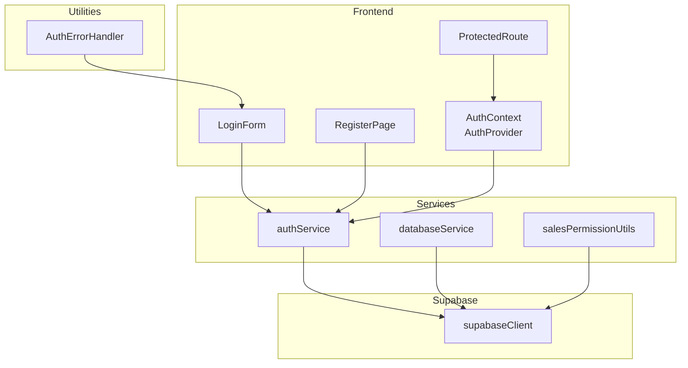
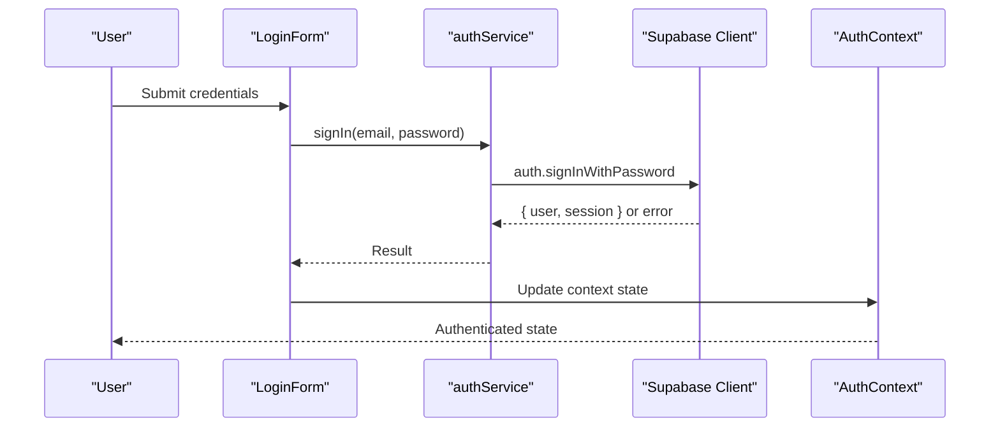
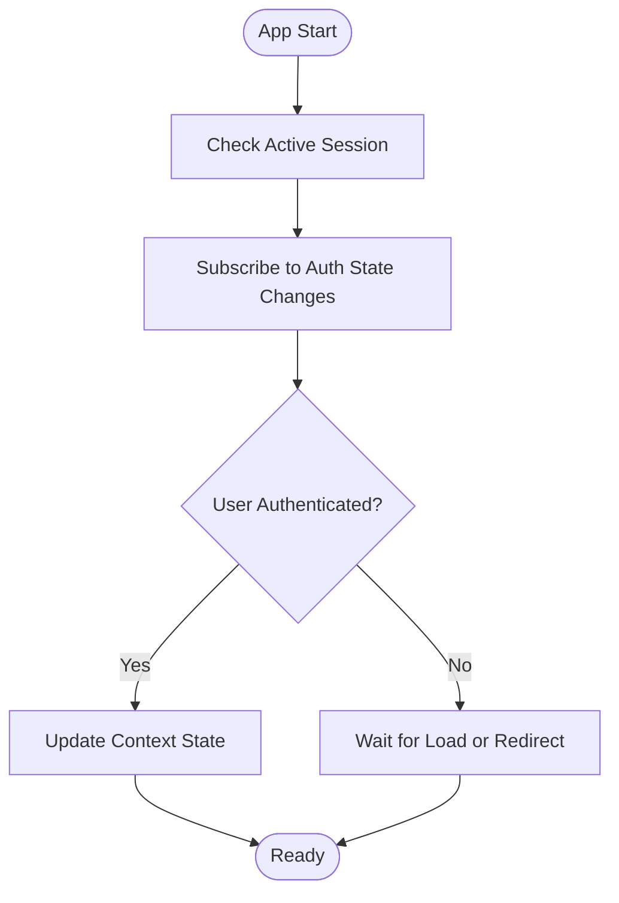
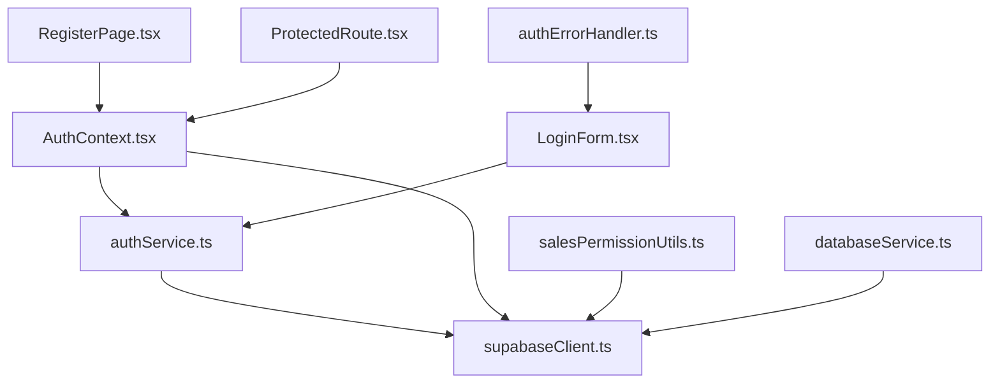

# Authentication Service API

<cite>
**Referenced Files in This Document**
- [authService.ts](file://src/services/authService.ts)
- [AuthContext.tsx](file://src/contexts/AuthContext.tsx)
- [LoginForm.tsx](file://src/components/LoginForm.tsx)
- [RegisterPage.tsx](file://src/pages/RegisterPage.tsx)
- [authErrorHandler.ts](file://src/utils/authErrorHandler.ts)
- [supabaseClient.ts](file://src/lib/supabaseClient.ts)
- [ProtectedRoute.tsx](file://src/components/ProtectedRoute.tsx)
- [databaseService.ts](file://src/services/databaseService.ts)
- [salesPermissionUtils.ts](file://src/utils/salesPermissionUtils.ts)
- [README.md](file://README.md)
- [SALES_PERMISSION_IMPLEMENTATION.md](file://SALES_PERMISSION_IMPLEMENTATION.md)
</cite>

## Table of Contents
1. [Introduction](#introduction)
2. [Project Structure](#project-structure)
3. [Core Components](#core-components)
4. [Architecture Overview](#architecture-overview)
5. [Detailed Component Analysis](#detailed-component-analysis)
6. [Dependency Analysis](#dependency-analysis)
7. [Performance Considerations](#performance-considerations)
8. [Troubleshooting Guide](#troubleshooting-guide)
9. [Conclusion](#conclusion)

## Introduction
This document provides comprehensive API documentation for the Authentication Service of the POS system. It covers user authentication methods (login, logout, register, forgot password, reset password), session management, user profile operations, role-based access control, protected route guards, authentication middleware, and session persistence. It also documents authentication state management, JWT token handling via Supabase, user permission validation, and security best practices.

## Project Structure
The authentication system is implemented using Supabase for backend authentication and session management, with React context for frontend state management and protected routing.

**Diagram sources**
- [AuthContext.tsx:16-110](file://src/contexts/AuthContext.tsx#L16-L110)
- [authService.ts:1-127](file://src/services/authService.ts#L1-L127)
- [LoginForm.tsx:10-114](file://src/components/LoginForm.tsx#L10-L114)
- [RegisterPage.tsx:27-177](file://src/pages/RegisterPage.tsx#L27-L177)
- [ProtectedRoute.tsx:10-30](file://src/components/ProtectedRoute.tsx#L10-L30)
- [databaseService.ts:447-461](file://src/services/databaseService.ts#L447-L461)
- [salesPermissionUtils.ts:8-86](file://src/utils/salesPermissionUtils.ts#L8-L86)
- [authErrorHandler.ts:8-92](file://src/utils/authErrorHandler.ts#L8-L92)
- [supabaseClient.ts:20-31](file://src/lib/supabaseClient.ts#L20-L31)

**Section sources**
- [README.md:74-87](file://README.md#L74-L87)
- [supabaseClient.ts:20-31](file://src/lib/supabaseClient.ts#L20-L31)

## Core Components
- Authentication Service: Provides sign-up, sign-in, sign-out, current user retrieval, role retrieval, auth state change listener, password reset, and user updates.
- Authentication Context: Manages global authentication state, handles session persistence, and exposes login/logout/sign-up functions.
- Login Form: Validates credentials, authenticates via Supabase, and displays user-friendly error messages.
- Registration Page: Handles user registration, creates user metadata, and persists user records in the database.
- Protected Route: Guards routes by checking authentication state and redirecting unauthenticated users.
- Permission Utilities: Checks user roles and module access for role-based access control.
- Error Handler: Centralized error handling for authentication failures and session invalidation.

**Section sources**
- [authService.ts:6-127](file://src/services/authService.ts#L6-L127)
- [AuthContext.tsx:16-110](file://src/contexts/AuthContext.tsx#L16-L110)
- [LoginForm.tsx:32-114](file://src/components/LoginForm.tsx#L32-L114)
- [RegisterPage.tsx:29-177](file://src/pages/RegisterPage.tsx#L29-L177)
- [ProtectedRoute.tsx:10-30](file://src/components/ProtectedRoute.tsx#L10-L30)
- [salesPermissionUtils.ts:8-171](file://src/utils/salesPermissionUtils.ts#L8-L171)
- [authErrorHandler.ts:8-92](file://src/utils/authErrorHandler.ts#L8-L92)

## Architecture Overview
The authentication architecture integrates Supabase for secure authentication and session management, React context for state synchronization, and utility functions for permission checks and error handling.

**Diagram sources**
- [LoginForm.tsx:67-104](file://src/components/LoginForm.tsx#L67-L104)
- [authService.ts:26-39](file://src/services/authService.ts#L26-L39)
- [AuthContext.tsx:56-85](file://src/contexts/AuthContext.tsx#L56-L85)
- [supabaseClient.ts:20-31](file://src/lib/supabaseClient.ts#L20-L31)

## Detailed Component Analysis

### Authentication Service API
Provides core authentication operations backed by Supabase.

- signUp(email, password, userData?)
  - Purpose: Registers a new user with optional metadata.
  - Behavior: Calls Supabase sign-up with user metadata; returns user/session or error.
  - Errors: Propagates Supabase errors; caller should handle display.
  - Persistence: Supabase manages session persistence per client configuration.

- signIn(email, password)
  - Purpose: Authenticates user credentials.
  - Behavior: Uses Supabase password-based auth; returns user/session or error.
  - Errors: Includes credential and confirmation errors; caller should handle UX.

- signOut()
  - Purpose: Ends current session.
  - Behavior: Calls Supabase sign-out; clears local state on success.

- getCurrentUser()
  - Purpose: Retrieves current user from Supabase.
  - Behavior: Uses Supabase getUser; returns user or null.

- getCurrentUserRole()
  - Purpose: Returns user role from metadata.
  - Behavior: Reads role from user metadata; defaults to 'user'.

- onAuthStateChange(callback)
  - Purpose: Subscribes to auth state changes.
  - Behavior: Listens for events and updates context state.

- resetPassword(email)
  - Purpose: Initiates password reset flow.
  - Behavior: Sends reset email with redirect to reset-password page.

- updatePassword(password)
  - Purpose: Updates current user's password.
  - Behavior: Requires existing session; returns updated user or error.

- updateEmail(email)
  - Purpose: Updates current user's email.
  - Behavior: Requires existing session; returns updated user or error.

**Section sources**
- [authService.ts:6-127](file://src/services/authService.ts#L6-L127)

### Authentication Context (State Management)
Manages global authentication state and session lifecycle.

- State
  - user: Current authenticated user or null.
  - isLoading: Indicates initialization and auth state checks.

- Methods
  - login(email, password): Signs in via Supabase; sets user state; handles email confirmation errors.
  - logout(): Signs out via Supabase; clears user state.
  - signUp(email, password, userData?): Registers user via Supabase; returns user/session or error.

- Effects
  - Initializes by checking active session and subscribing to auth state changes.
  - Clears invalid sessions when refresh token errors occur.

**Section sources**
- [AuthContext.tsx:16-110](file://src/contexts/AuthContext.tsx#L16-L110)

### Login Form Component
Handles user input validation, authentication flow, and error messaging.

- Validation
  - Email presence and format.
  - Password presence and minimum length.

- Flow
  - Calls signIn from authService.
  - Handles session invalid errors via AuthErrorHandler.
  - Handles email confirmation required errors.
  - Displays user-friendly toasts for all errors.

- Navigation
  - Supports navigation to registration page.

**Section sources**
- [LoginForm.tsx:32-114](file://src/components/LoginForm.tsx#L32-L114)
- [authErrorHandler.ts:14-38](file://src/utils/authErrorHandler.ts#L14-L38)

### Registration Page
Implements user registration with metadata and database record creation.

- Validation
  - First name, last name, email, password, and password confirmation.

- Flow
  - Calls signUp from AuthContext (which uses Supabase).
  - On success, creates user record in database with default role and active status.
  - Shows success toast and redirects to login after delay.

**Section sources**
- [RegisterPage.tsx:29-177](file://src/pages/RegisterPage.tsx#L29-L177)
- [databaseService.ts:447-461](file://src/services/databaseService.ts#L447-L461)

### Protected Route Guard
Ensures only authenticated users can access protected areas.

- Behavior
  - Uses AuthContext to check user and loading state.
  - Redirects to login if not authenticated.
  - Renders splash screen while loading.

**Section sources**
- [ProtectedRoute.tsx:10-30](file://src/components/ProtectedRoute.tsx#L10-L30)

### Role-Based Access Control
Checks user roles and module access for authorization.

- canCreateSales()
  - Determines if current user can create sales (currently returns true for any authenticated user).

- getCurrentUserRole()
  - Fetches user role from Supabase and database; creates user record if missing.

- hasModuleAccess(role, module)
  - Defines role-to-module access mapping for navigation and feature gating.

**Section sources**
- [salesPermissionUtils.ts:8-171](file://src/utils/salesPermissionUtils.ts#L8-L171)

### Session Management and Persistence
Supabase client configuration controls session behavior.

- Configuration
  - autoRefreshToken: true
  - persistSession: true
  - detectSessionInUrl: true
  - flowType: 'implicit'

- Implications
  - Automatic token refresh.
  - Local storage persistence.
  - OAuth implicit flow support.

**Section sources**
- [supabaseClient.ts:20-31](file://src/lib/supabaseClient.ts#L20-L31)

### Authentication State Management Flow

**Diagram sources**
- [AuthContext.tsx:20-54](file://src/contexts/AuthContext.tsx#L20-L54)

## Dependency Analysis
The authentication system exhibits clear separation of concerns with minimal coupling.

**Diagram sources**
- [authService.ts:1-3](file://src/services/authService.ts#L1-L3)
- [AuthContext.tsx:2-4](file://src/contexts/AuthContext.tsx#L2-L4)
- [LoginForm.tsx:10-11](file://src/components/LoginForm.tsx#L10-L11)
- [RegisterPage.tsx:8-9](file://src/pages/RegisterPage.tsx#L8-L9)
- [ProtectedRoute.tsx:2-3](file://src/components/ProtectedRoute.tsx#L2-L3)
- [salesPermissionUtils.ts:1-2](file://src/utils/salesPermissionUtils.ts#L1-L2)
- [databaseService.ts:1](file://src/services/databaseService.ts#L1)
- [authErrorHandler.ts:6](file://src/utils/authErrorHandler.ts#L6)

**Section sources**
- [authService.ts:1-127](file://src/services/authService.ts#L1-L127)
- [AuthContext.tsx:16-110](file://src/contexts/AuthContext.tsx#L16-L110)
- [LoginForm.tsx:10-114](file://src/components/LoginForm.tsx#L10-L114)
- [RegisterPage.tsx:27-177](file://src/pages/RegisterPage.tsx#L27-L177)
- [ProtectedRoute.tsx:10-30](file://src/components/ProtectedRoute.tsx#L10-L30)
- [salesPermissionUtils.ts:8-171](file://src/utils/salesPermissionUtils.ts#L8-L171)
- [authErrorHandler.ts:8-92](file://src/utils/authErrorHandler.ts#L8-L92)
- [supabaseClient.ts:20-31](file://src/lib/supabaseClient.ts#L20-L31)

## Performance Considerations
- Minimize repeated auth queries by leveraging the AuthContext state and Supabase client caching.
- Debounce or throttle authentication UI interactions to avoid excessive network requests.
- Use lazy loading for heavy components behind authentication to reduce initial load.
- Keep session persistence enabled for better UX, but monitor token refresh frequency.

## Troubleshooting Guide
Common authentication issues and resolutions:

- Session Expired
  - Symptom: Refresh token errors during authentication.
  - Resolution: AuthErrorHandler detects invalid sessions and clears persisted tokens; users must re-authenticate.

- Email Not Confirmed
  - Symptom: Login attempts fail with confirmation required.
  - Resolution: Prompt users to check email and click confirmation link; LoginForm provides specific messaging.

- Invalid Credentials
  - Symptom: Login fails due to incorrect email/password.
  - Resolution: Display friendly error message; ensure validation passes before attempting login.

- Registration Failures
  - Symptom: Duplicate email or validation errors.
  - Resolution: RegisterPage validates inputs and shows user-friendly messages; databaseService handles record creation.

- Protected Route Access
  - Symptom: Unauthorized users redirected to login.
  - Resolution: ProtectedRoute checks AuthContext state and redirects appropriately.

**Section sources**
- [authErrorHandler.ts:14-38](file://src/utils/authErrorHandler.ts#L14-L38)
- [LoginForm.tsx:69-100](file://src/components/LoginForm.tsx#L69-L100)
- [RegisterPage.tsx:121-130](file://src/pages/RegisterPage.tsx#L121-L130)
- [ProtectedRoute.tsx:14-19](file://src/components/ProtectedRoute.tsx#L14-L19)

## Conclusion
The Authentication Service provides a robust, scalable foundation for user authentication, session management, and role-based access control. By leveraging Supabase for secure authentication and React context for state management, the system offers a seamless user experience with strong security practices. The modular design enables easy maintenance and extension of authentication features as the application evolves.