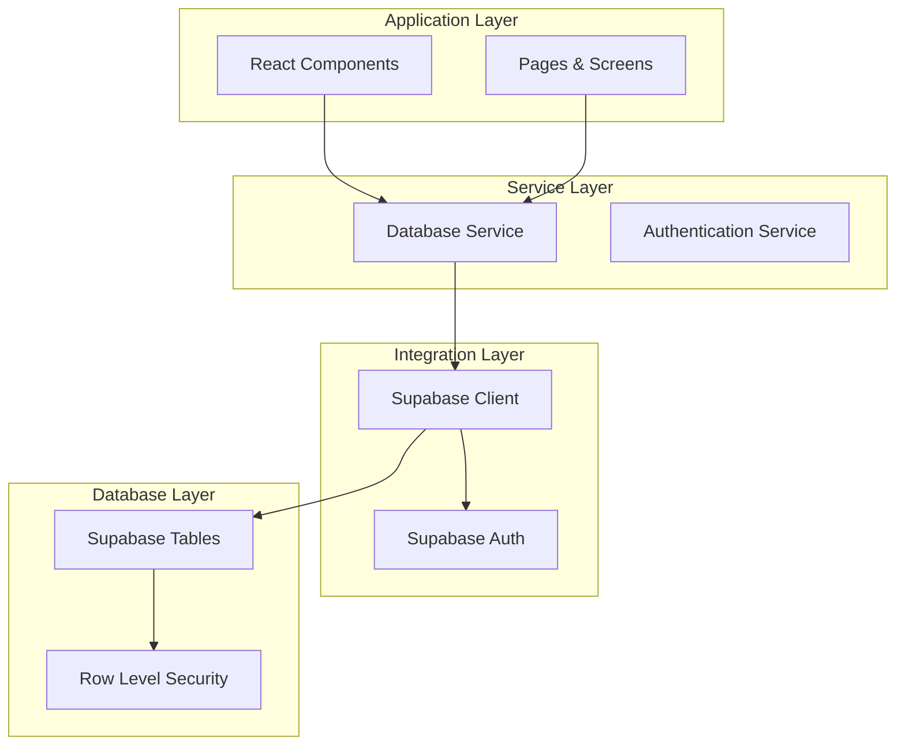
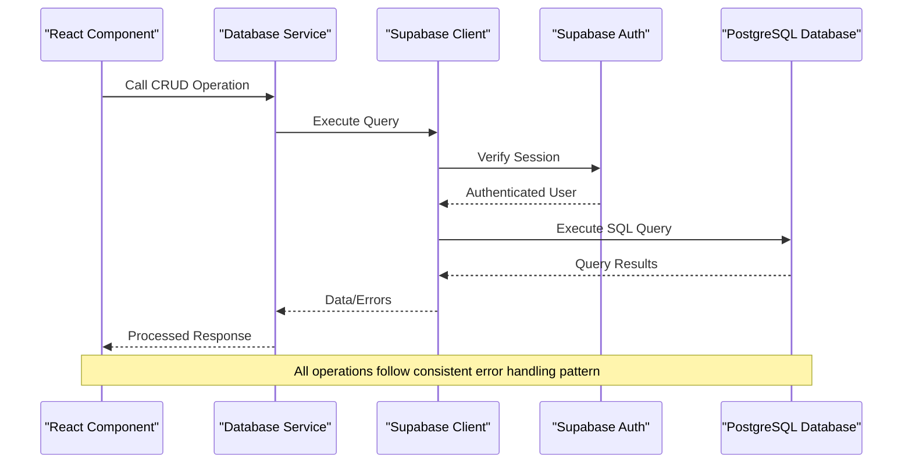
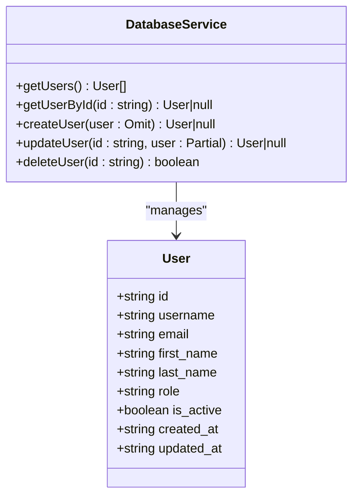
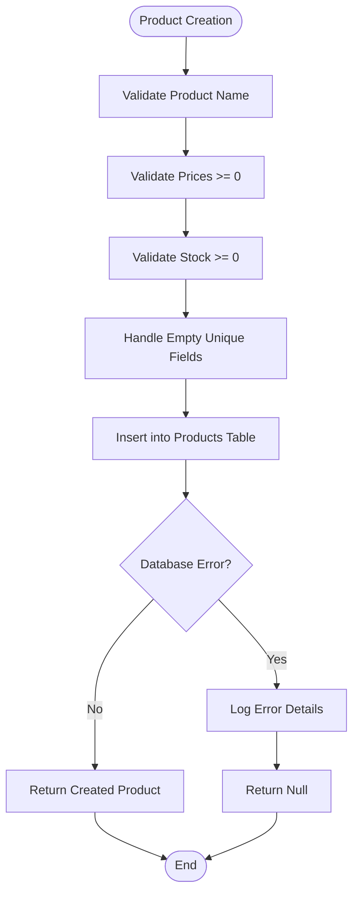
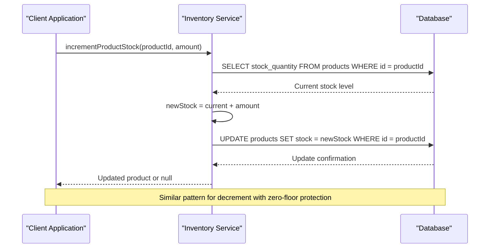
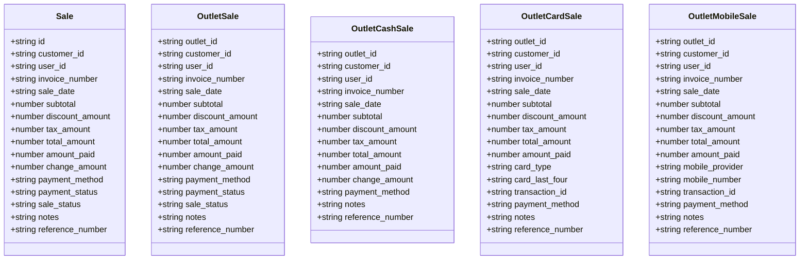
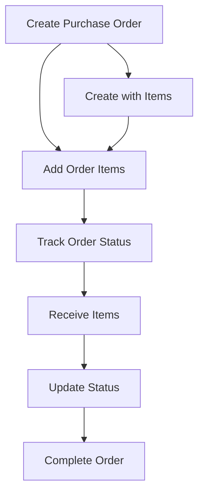
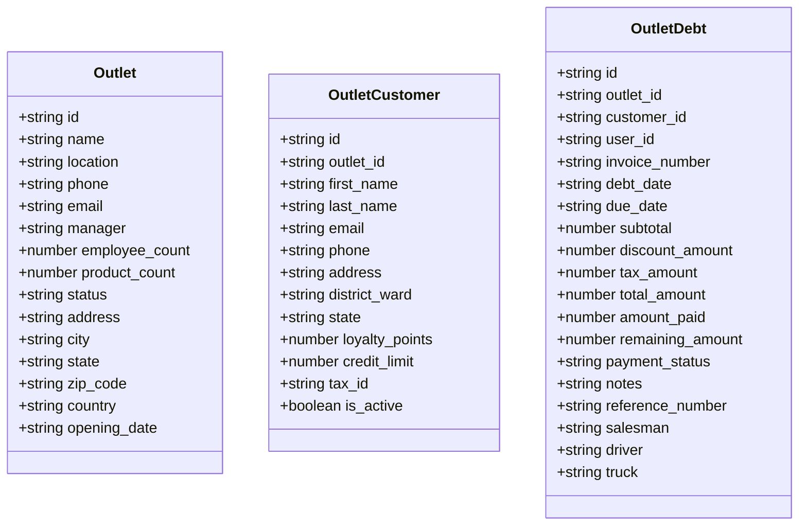

# Database Service API

<cite>
**Referenced Files in This Document**
- [databaseService.ts](file://src/services/databaseService.ts)
- [supabaseClient.ts](file://src/lib/supabaseClient.ts)
- [supabaseService.ts](file://src/services/supabaseService.ts)
- [ProductManagement.tsx](file://src/pages/ProductManagement.tsx)
- [EmployeeManagement.tsx](file://src/pages/EmployeeManagement.tsx)
- [OutletCustomers.tsx](file://src/pages/OutletCustomers.tsx)
- [OutletSalesManagement.tsx](file://src/pages/OutletSalesManagement.tsx)
- [SUPABASE_COMPLETE_SCHEMA.sql](file://SUPABASE_COMPLETE_SCHEMA.sql)
- [REMOVE_ALL_RLS.sql](file://REMOVE_ALL_RLS.sql)
</cite>

## Table of Contents
1. [Introduction](#introduction)
2. [Project Structure](#project-structure)
3. [Core Components](#core-components)
4. [Architecture Overview](#architecture-overview)
5. [Detailed Component Analysis](#detailed-component-analysis)
6. [Dependency Analysis](#dependency-analysis)
7. [Performance Considerations](#performance-considerations)
8. [Troubleshooting Guide](#troubleshooting-guide)
9. [Conclusion](#conclusion)

## Introduction
This document provides comprehensive API documentation for the Database Service, covering all CRUD operations for users, products, inventory, sales, purchase orders, expenses, debts, discounts, returns, inventory audits, access logs, tax records, damaged products, reports, and outlet-specific features. It details parameter schemas, return value formats, error handling patterns, and Supabase integration specifics. Practical usage examples, common query patterns, and performance optimization techniques are included to help developers integrate and optimize database operations effectively.

## Project Structure
The Database Service is implemented as a centralized module that abstracts Supabase interactions for the entire POS application. It defines TypeScript interfaces for all domain entities and exposes a comprehensive set of CRUD functions mapped to Supabase tables. The service integrates with Supabase client configuration and provides helper functions for connection testing and RLS policy management.



**Diagram sources**
- [databaseService.ts:1-50](file://src/services/databaseService.ts#L1-50)
- [supabaseClient.ts:1-33](file://src/lib/supabaseClient.ts#L1-33)

**Section sources**
- [databaseService.ts:1-50](file://src/services/databaseService.ts#L1-50)
- [supabaseClient.ts:1-33](file://src/lib/supabaseClient.ts#L1-33)

## Core Components

### Supabase Client Configuration
The Supabase client is configured with environment variables for URL and anonymous key, with automatic session management and persistence. The client validates environment configuration and provides a singleton instance for all database operations.

### Database Service Interface Definitions
The service defines comprehensive TypeScript interfaces for all domain entities including:
- User management (users table)
- Product management (products table)
- Category management (categories table)
- Customer management (customers and outlet_customers tables)
- Supplier management (suppliers table)
- Outlet management (outlets table)
- Sales operations (sales, sale_items, outlet_sales, outlet_sale_items)
- Purchase orders (purchase_orders, purchase_order_items)
- Expense management (expenses table)
- Debt tracking (debts, outlet_debts, outlet_debt_items, outlet_debt_payments)
- Discount systems (discounts, discount_categories, discount_products)
- Returns and inventory audits
- Access logs and tax records
- Damaged products and reports
- Asset management (assets, asset_transactions)
- Outlet-specific sales variants (cash, card, mobile sales)

### CRUD Operation Categories
The service provides standardized CRUD operations across multiple domains:

**User Management Operations**
- `getUsers()`: Retrieve all users with username ordering
- `getUserById(id: string)`: Fetch user by unique identifier
- `createUser(user: Omit<User, 'id'>)`: Create new user with timestamps
- `updateUser(id: string, user: Partial<User>)`: Partial user updates with timestamp
- `deleteUser(id: string)`: Remove user by ID

**Product Management Operations**
- `getProducts()`: List all products ordered by name
- `getProductById(id: string)`: Single product lookup
- `getProductByBarcode(barcode: string)`: Barcode-based product retrieval
- `getProductBySKU(sku: string)`: SKU-based product retrieval
- `createProduct(product: Omit<Product, 'id'>)`: Enhanced validation with price and quantity checks
- `updateProduct(id: string, product: Partial<Product>)`: Validation-aware updates
- `deleteProduct(id: string)`: Safe deletion with error handling
- `bulkDeleteProducts(ids: string[])`: Multi-product deletion
- `bulkUpdateProducts(updates: { id: string; data: Partial<Product> }[])`: Batch updates

**Inventory Operations**
- `incrementProductStock(productId: string, incrementAmount: number)`: Stock increase with validation
- `decrementProductStock(productId: string, decrementAmount: number)`: Stock decrease with zero-floor protection
- `updateProductStock(id: string, quantity: number)`: Direct stock quantity update
- `getLowStockProducts(threshold: number = 10)`: Low inventory identification
- `getOutOfStockProducts()`: Out-of-stock product listing

**Sales Operations**
- `getSales()`: Complete sales history
- `getSaleById(id: string)`: Individual sale retrieval
- `createSale(sale: Omit<Sale, 'id'>)`: Sale creation with user context
- `updateSale(id: string, sale: Partial<Sale>)`: Sale modifications
- `deleteSale(id: string)`: Sale removal
- `getSaleItems(saleId: string)`: Associated sale items
- `getSaleItemsWithProducts(saleId: string)`: Sale items with product details

**Outlet-Specific Operations**
- `getOutletCustomers(outletId: string)`: Customer management per outlet
- `createOutletCustomer(customer: Omit<OutletCustomer, 'id'>)`: Outlet-specific customer creation
- `getOutletSalesByOutletId(outletId: string)`: Outlet sales aggregation
- `createOutletSale(sale: Omit<OutletSale, 'id'>)`: Outlet sale creation
- `getOutletDebtsByOutletId(outletId: string)`: Outlet debt tracking
- `createOutletDebt(debt: Omit<OutletDebt, 'id'>)`: Outlet debt creation

**Advanced Features**
- `searchProducts(query: string, filters?: ProductSearchFilters)`: Full-text search with filters
- `getInventoryStats()`: Aggregate inventory metrics
- `getSalesAnalytics(days: number = 30)`: Sales trend analysis
- `getDailySales(days: number = 30)`: Daily sales reporting
- `getCategoryPerformance()`: Category-wise sales performance
- `getProductPerformance(limit: number = 10)`: Top-performing products

**Section sources**
- [databaseService.ts:416-494](file://src/services/databaseService.ts#L416-494)
- [databaseService.ts:496-784](file://src/services/databaseService.ts#L496-784)
- [databaseService.ts:1683-1767](file://src/services/databaseService.ts#L1683-1767)
- [databaseService.ts:1779-1885](file://src/services/databaseService.ts#L1779-1885)
- [databaseService.ts:4024-4438](file://src/services/databaseService.ts#L4024-4438)

## Architecture Overview



**Diagram sources**
- [databaseService.ts:416-494](file://src/services/databaseService.ts#L416-494)
- [supabaseClient.ts:20-31](file://src/lib/supabaseClient.ts#L20-31)

The architecture follows a layered approach with clear separation of concerns:
- **Interface Layer**: React components and pages
- **Service Layer**: Centralized database operations
- **Integration Layer**: Supabase client with authentication
- **Data Layer**: PostgreSQL tables with Row Level Security

**Section sources**
- [databaseService.ts:1-50](file://src/services/databaseService.ts#L1-50)
- [supabaseClient.ts:1-33](file://src/lib/supabaseClient.ts#L1-33)

## Detailed Component Analysis

### User Management API

#### User CRUD Operations
The user management system provides complete CRUD functionality with comprehensive error handling and validation.



**Diagram sources**
- [databaseService.ts:4-14](file://src/services/databaseService.ts#L4-14)
- [databaseService.ts:416-494](file://src/services/databaseService.ts#L416-494)

**API Endpoints and Parameters:**
- `GET /users`: No parameters, returns array of User objects
- `GET /users/:id`: Path parameter `id` (string), returns single User object
- `POST /users`: Request body requires `username`, `first_name`, `last_name`, `role`
- `PUT /users/:id`: Path parameter `id`, request body accepts partial User fields
- `DELETE /users/:id`: Path parameter `id`

**Return Values:**
- Success: User object or boolean (for delete operations)
- Error: Empty array or null with console logging

**Error Handling:**
- Validation errors thrown with descriptive messages
- Network errors caught and logged
- Database constraint violations handled gracefully

**Section sources**
- [databaseService.ts:416-494](file://src/services/databaseService.ts#L416-494)
- [EmployeeManagement.tsx:92-132](file://src/pages/EmployeeManagement.tsx#L92-132)

### Product Management API

#### Enhanced Product Operations
The product management system includes advanced validation, search capabilities, and inventory tracking.



**Diagram sources**
- [databaseService.ts:581-640](file://src/services/databaseService.ts#L581-640)

**API Endpoints:**
- `GET /products`: Returns all products ordered by name
- `GET /products/:id`: Fetch by product ID
- `GET /products/barcode/:barcode`: Lookup by barcode
- `GET /products/sku/:sku`: Lookup by SKU
- `POST /products`: Create new product with validation
- `PUT /products/:id`: Update existing product
- `DELETE /products/:id`: Remove product
- `DELETE /products/bulk`: Bulk deletion by array of IDs

**Enhanced Features:**
- Price validation (non-negative values)
- Stock quantity validation
- Unique field handling (empty strings converted to null)
- Barcode and SKU lookup capabilities
- Bulk operations for efficiency

**Section sources**
- [databaseService.ts:496-784](file://src/services/databaseService.ts#L496-784)
- [ProductManagement.tsx:77-103](file://src/pages/ProductManagement.tsx#L77-103)

### Inventory Management API

#### Stock Operations
The inventory system provides atomic stock manipulation with safety checks.



**Diagram sources**
- [databaseService.ts:643-709](file://src/services/databaseService.ts#L643-709)

**Key Operations:**
- `incrementProductStock(productId, amount)`: Increases stock safely
- `decrementProductStock(productId, amount)`: Decreases stock with zero-floor protection
- `updateProductStock(id, quantity)`: Direct stock replacement
- `getLowStockProducts(threshold)`: Identifies low inventory items
- `getOutOfStockProducts()`: Lists out-of-stock items

**Validation Rules:**
- Stock amounts cannot be negative
- Decrement operations protect against underflow
- Zero stock level maintained as minimum

**Section sources**
- [databaseService.ts:642-709](file://src/services/databaseService.ts#L642-709)
- [databaseService.ts:2609-2658](file://src/services/databaseService.ts#L2609-2658)

### Sales Operations API

#### Multi-Variant Sales System
The sales system supports multiple payment methods and outlet-specific implementations.



**Diagram sources**
- [databaseService.ts:151-183](file://src/services/databaseService.ts#L151-183)
- [databaseService.ts:4025-4220](file://src/services/databaseService.ts#L4025-4220)
- [databaseService.ts:4116-4220](file://src/services/databaseService.ts#L4116-4220)

**Sales Variants:**
- Standard sales: General POS sales tracking
- Outlet sales: Outlet-specific sales with outlet_id
- Cash sales: Direct cash transactions
- Card sales: Credit/debit card payments
- Mobile sales: Mobile money transactions

**Section sources**
- [databaseService.ts:1779-1885](file://src/services/databaseService.ts#L1779-1885)
- [databaseService.ts:4222-4438](file://src/services/databaseService.ts#L4222-4438)

### Purchase Orders API

#### Order Management System
The purchase order system handles supplier orders with item tracking and status management.



**Diagram sources**
- [databaseService.ts:1944-2058](file://src/services/databaseService.ts#L1944-2058)

**Operations:**
- `getPurchaseOrders()`: List all purchase orders
- `getPurchaseOrderById(id: string)`: Single order retrieval
- `getPurchaseOrderWithItems(id: string)`: Order with associated items
- `createPurchaseOrder(purchaseOrder: Omit<PurchaseOrder, 'id'>)`: Create new order
- `createPurchaseOrderWithItems(order, items)`: Create order with items
- `updatePurchaseOrder(id, updates)`: Modify order details
- `updatePurchaseOrderWithItems(id, order, items)`: Update order with items
- `deletePurchaseOrder(id)`: Remove order
- `deletePurchaseOrderWithItems(id)`: Remove order and items

**Section sources**
- [databaseService.ts:1944-2158](file://src/services/databaseService.ts#L1944-2158)

### Outlet Management API

#### Outlet-Specific Features
The outlet management system provides isolated data management for different business locations.



**Diagram sources**
- [databaseService.ts:80-98](file://src/services/databaseService.ts#L80-98)
- [databaseService.ts:3900-3916](file://src/services/databaseService.ts#L3900-3916)
- [databaseService.ts:4065-4087](file://src/services/databaseService.ts#L4065-4087)

**Outlet Operations:**
- `getOutlets()`: List all registered outlets
- `getOutletById(id: string)`: Fetch specific outlet
- `createOutlet(outlet: Omit<Outlet, 'id'>)`: Register new outlet
- `updateOutlet(id, updates)`: Modify outlet information
- `deleteOutlet(id: string)`: Remove outlet
- `getOutletCustomers(outletId: string)`: Customer management per outlet
- `getOutletDebtsByOutletId(outletId: string)`: Outlet debt tracking

**Section sources**
- [databaseService.ts:1377-1486](file://src/services/databaseService.ts#L1377-1486)
- [databaseService.ts:3918-4004](file://src/services/databaseService.ts#L3918-4004)
- [databaseService.ts:4440-4529](file://src/services/databaseService.ts#L4440-4529)

### Advanced Analytics API

#### Business Intelligence Features
The system provides comprehensive analytics and reporting capabilities.

**Analytics Operations:**
- `getSalesAnalytics(days: number = 30)`: Combined sales, items, and category data
- `getDailySales(days: number = 30)`: Time-series sales data
- `getCategoryPerformance()`: Category-wise sales performance
- `getProductPerformance(limit: number = 10)`: Top-selling products
- `getInventoryStats()`: Aggregate inventory metrics
- `getInventoryTotalsByOutlet(outletId: string)`: Outlet-specific inventory summary

**Section sources**
- [databaseService.ts:2756-2962](file://src/services/databaseService.ts#L2756-2962)
- [databaseService.ts:1611-1681](file://src/services/databaseService.ts#L1611-1681)

## Dependency Analysis

```mermaid
graph TB
subgraph "External Dependencies"
SupabaseJS[@supabase/supabase-js]
React[React Framework]
Lucide[Lucide Icons]
end
subgraph "Internal Dependencies"
DatabaseService[Database Service]
AuthService[Authentication Service]
Utils[Utility Functions]
end
subgraph "Configuration"
SupabaseClient[Supabase Client]
Environment[Environment Variables]
end
DatabaseService --> SupabaseJS
DatabaseService --> SupabaseClient
DatabaseService --> AuthService
DatabaseService --> Utils
SupabaseClient --> Environment
React --> DatabaseService
Lucide --> React
```

**Diagram sources**
- [databaseService.ts](file://src/services/databaseService.ts#L1)
- [supabaseClient.ts:1-33](file://src/lib/supabaseClient.ts#L1-33)

**Key Dependencies:**
- **@supabase/supabase-js**: Core database connectivity and authentication
- **React**: UI framework for component integration
- **Lucide Icons**: UI iconography for interface elements
- **Environment Variables**: Supabase configuration management

**Section sources**
- [databaseService.ts:1-50](file://src/services/databaseService.ts#L1-50)
- [supabaseClient.ts:1-33](file://src/lib/supabaseClient.ts#L1-33)

## Performance Considerations

### Database Optimization Strategies

**Indexing Strategy**
Based on the schema definition, optimal indexing should include:
- Primary key indexes on all tables
- Foreign key indexes for relationship tables
- Searchable column indexes (name, email, phone)
- Date-based indexes for temporal queries
- Composite indexes for frequently queried combinations

**Query Optimization Patterns**
- Use selective filters early in queries
- Leverage ORDER BY clauses with indexed columns
- Implement pagination for large datasets
- Use LIMIT clauses for top-N queries
- Minimize JOIN operations when possible

**Caching Strategies**
- Implement client-side caching for frequently accessed data
- Use optimistic updates for immediate UI feedback
- Cache user sessions and authentication state
- Store computed analytics data temporarily

**Connection Management**
- Reuse Supabase client instances
- Implement connection pooling
- Handle connection timeouts gracefully
- Monitor query execution times

**Section sources**
- [SUPABASE_COMPLETE_SCHEMA.sql:350-359](file://SUPABASE_COMPLETE_SCHEMA.sql#L350-359)

## Troubleshooting Guide

### Common Issues and Solutions

**Supabase Connection Problems**
- Verify environment variables are properly set
- Check network connectivity to Supabase endpoint
- Validate API keys and authentication tokens
- Review RLS policy configurations

**Data Validation Errors**
- Ensure required fields are provided during creation
- Validate numeric fields are non-negative
- Check unique constraints for barcode and SKU
- Verify foreign key relationships exist

**Performance Issues**
- Implement proper indexing on frequently queried columns
- Use pagination for large result sets
- Optimize complex JOIN queries
- Monitor query execution plans

**RLS Policy Conflicts**
- Review Row Level Security configurations
- Test policies with test data
- Implement proper user role assignments
- Validate policy expressions

**Error Handling Patterns**
The service follows consistent error handling patterns:
- Try-catch blocks around all database operations
- Descriptive error logging with stack traces
- Graceful degradation to empty results
- User-friendly error messages through toast notifications

**Section sources**
- [databaseService.ts:838-891](file://src/services/databaseService.ts#L838-891)
- [supabaseService.ts:4-23](file://src/services/supabaseService.ts#L4-23)

## Conclusion

The Database Service provides a comprehensive, type-safe abstraction layer for the POS application's data operations. With over 150+ API functions covering all major business domains, it offers consistent error handling, validation, and Supabase integration. The modular design supports both general and outlet-specific operations, while advanced analytics capabilities enable business intelligence insights.

Key strengths include:
- **Comprehensive Coverage**: Complete CRUD operations across all business entities
- **Type Safety**: Full TypeScript interface definitions with strict validation
- **Performance Optimization**: Efficient query patterns and caching strategies
- **Scalability**: Modular design supporting future feature additions
- **Maintainability**: Consistent patterns and error handling across all operations

The service serves as the foundation for the entire POS application, enabling reliable data management and business operation support across multiple business locations and operational contexts.