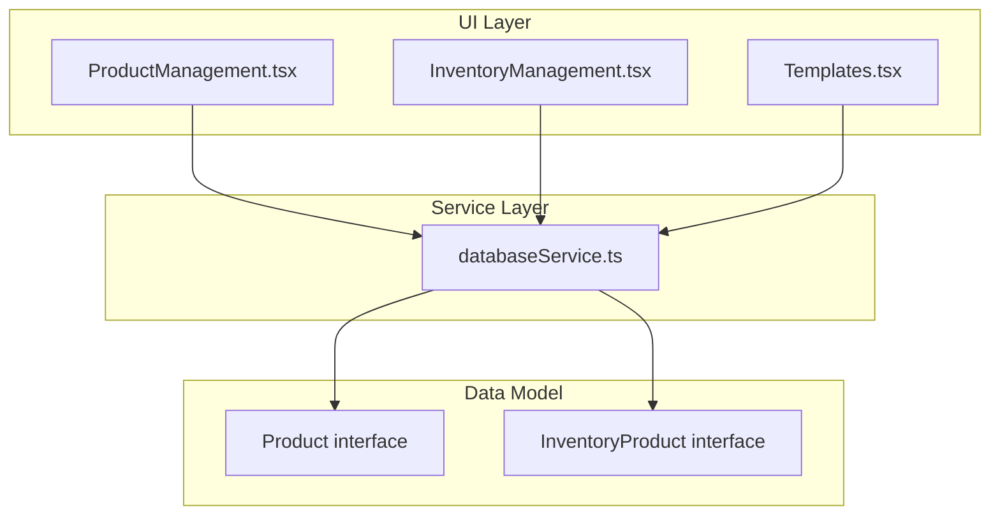
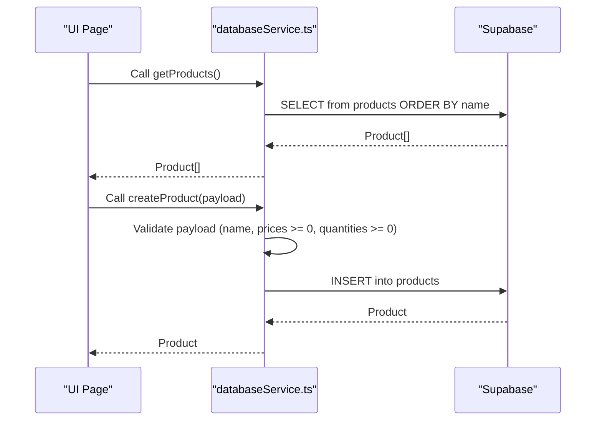
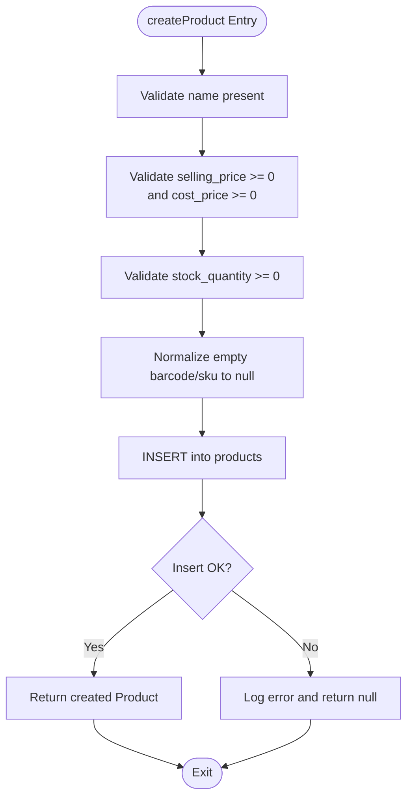
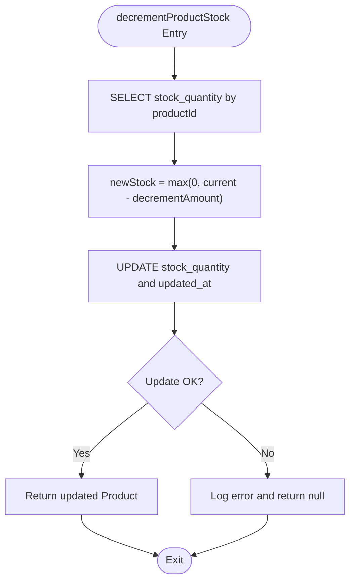
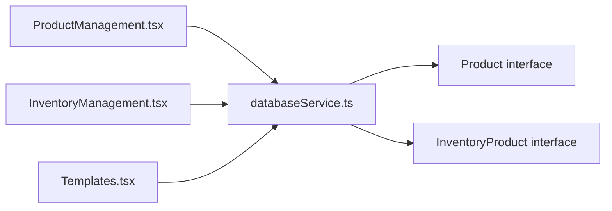

# Product and Inventory API

<cite>
**Referenced Files in This Document**
- [README.md](file://README.md)
- [databaseService.ts](file://src/services/databaseService.ts)
- [ProductManagement.tsx](file://src/pages/ProductManagement.tsx)
- [InventoryManagement.tsx](file://src/pages/InventoryManagement.tsx)
- [Templates.tsx](file://src/pages/Templates.tsx)
- [PRODUCT_CRUD_OPERATIONS.md](file://PRODUCT_CRUD_OPERATIONS.md)
- [ENHANCED_PRODUCT_CRUD_OPERATIONS.md](file://ENHANCED_PRODUCT_CRUD_OPERATIONS.md)
</cite>

## Table of Contents
1. [Introduction](#introduction)
2. [Project Structure](#project-structure)
3. [Core Components](#core-components)
4. [Architecture Overview](#architecture-overview)
5. [Detailed Component Analysis](#detailed-component-analysis)
6. [Dependency Analysis](#dependency-analysis)
7. [Performance Considerations](#performance-considerations)
8. [Troubleshooting Guide](#troubleshooting-guide)
9. [Conclusion](#conclusion)
10. [Appendices](#appendices)

## Introduction
This document provides detailed API documentation for Product and Inventory management operations in the POS system. It covers:
- Product CRUD operations: getProducts, getProductById, getProductByBarcode, getProductBySKU, createProduct, updateProduct, deleteProduct, plus bulk operations.
- Inventory operations: incrementProductStock and decrementProductStock with safety checks.
- Parameter schemas, validation constraints, return value formats, and error handling.
- Practical workflows for barcode scanning integration and stock adjustment scenarios.

The system integrates with Supabase for data persistence and authentication, and exposes a clean service layer for product and inventory operations.

## Project Structure
The relevant parts of the project for Product and Inventory management include:
- Service layer for database operations and data models
- UI pages that orchestrate product management and inventory workflows
- Documentation files that describe product CRUD operations and enhancements

**Diagram sources**
- [ProductManagement.tsx:1-1293](file://src/pages/ProductManagement.tsx#L1-L1293)
- [InventoryManagement.tsx:1-121](file://src/pages/InventoryManagement.tsx#L1-L121)
- [Templates.tsx:5853-5878](file://src/pages/Templates.tsx#L5853-L5878)
- [databaseService.ts:16-34](file://src/services/databaseService.ts#L16-L34)
- [databaseService.ts:129-149](file://src/services/databaseService.ts#L129-L149)

**Section sources**
- [README.md:55-73](file://README.md#L55-L73)
- [databaseService.ts:16-34](file://src/services/databaseService.ts#L16-L34)
- [databaseService.ts:129-149](file://src/services/databaseService.ts#L129-L149)
- [ProductManagement.tsx:1-1293](file://src/pages/ProductManagement.tsx#L1-L1293)
- [InventoryManagement.tsx:1-121](file://src/pages/InventoryManagement.tsx#L1-L121)
- [Templates.tsx:5853-5878](file://src/pages/Templates.tsx#L5853-L5878)

## Core Components
- Product interface: Defines product fields including identifiers, pricing, stock quantities, and metadata.
- InventoryProduct interface: Represents inventory records with outlet linkage, quantities, and status.
- Database service functions: Provide CRUD and inventory operations against Supabase tables.

Key responsibilities:
- Product CRUD: create, read (by id, barcode, SKU), update, delete, and bulk operations.
- Inventory operations: increment and decrement stock with safety checks.
- Validation: Enforces non-negative prices and quantities; handles empty string normalization for unique identifiers.

**Section sources**
- [databaseService.ts:16-34](file://src/services/databaseService.ts#L16-L34)
- [databaseService.ts:129-149](file://src/services/databaseService.ts#L129-L149)
- [databaseService.ts:496-784](file://src/services/databaseService.ts#L496-L784)
- [databaseService.ts:642-709](file://src/services/databaseService.ts#L642-L709)

## Architecture Overview
The Product and Inventory API follows a layered architecture:
- UI pages trigger operations via service functions.
- Service functions interact with Supabase to perform database operations.
- Data models define the shape of requests and responses.

**Diagram sources**
- [databaseService.ts:496-640](file://src/services/databaseService.ts#L496-L640)
- [ProductManagement.tsx:83-103](file://src/pages/ProductManagement.tsx#L83-L103)

## Detailed Component Analysis

### Product CRUD API

#### getProducts
- Purpose: Retrieve all products sorted by name.
- Parameters: None.
- Returns: Product[].
- Behavior: Queries the products table and orders results by name.
- Error handling: Returns an empty array on error.

**Section sources**
- [databaseService.ts:496-510](file://src/services/databaseService.ts#L496-L510)

#### getProductById
- Purpose: Retrieve a single product by its unique identifier.
- Parameters: id (string).
- Returns: Product | null.
- Behavior: Single-row query by id; logs and returns null on error.
- Error handling: Returns null on error.

**Section sources**
- [databaseService.ts:514-532](file://src/services/databaseService.ts#L514-L532)

#### getProductByBarcode
- Purpose: Retrieve a product by barcode.
- Parameters: barcode (string).
- Returns: Product | null.
- Behavior: Single-row query by barcode; treats empty input as null.
- Error handling: Returns null on error.

**Section sources**
- [databaseService.ts:534-555](file://src/services/databaseService.ts#L534-L555)

#### getProductBySKU
- Purpose: Retrieve a product by SKU.
- Parameters: sku (string).
- Returns: Product | null.
- Behavior: Single-row query by sku; treats empty input as null.
- Error handling: Returns null on error.

**Section sources**
- [databaseService.ts:557-578](file://src/services/databaseService.ts#L557-L578)

#### createProduct
- Purpose: Create a new product with validation.
- Parameters: Omit<Product, 'id'> (payload excluding id).
- Returns: Product | null.
- Validation:
  - name is required.
  - selling_price, cost_price must be >= 0.
  - stock_quantity must be >= 0.
  - Empty strings for barcode and sku are normalized to null.
- Behavior: Inserts into products table and returns created product.
- Error handling: Throws and logs errors; returns null on failure.

**Diagram sources**
- [databaseService.ts:580-640](file://src/services/databaseService.ts#L580-L640)

**Section sources**
- [databaseService.ts:580-640](file://src/services/databaseService.ts#L580-L640)
- [PRODUCT_CRUD_OPERATIONS.md:7-16](file://PRODUCT_CRUD_OPERATIONS.md#L7-L16)
- [ENHANCED_PRODUCT_CRUD_OPERATIONS.md:7-16](file://ENHANCED_PRODUCT_CRUD_OPERATIONS.md#L7-L16)

#### updateProduct
- Purpose: Update an existing product with validation.
- Parameters: id (string), product (Partial<Product>).
- Returns: Product | null.
- Validation:
  - id is required.
  - selling_price, cost_price must be >= 0 if provided.
  - stock_quantity must be >= 0 if provided.
  - Empty strings for barcode and sku are normalized to null.
- Behavior: Updates product row and returns updated product.
- Error handling: Throws and logs errors; returns null on failure.

**Section sources**
- [databaseService.ts:711-760](file://src/services/databaseService.ts#L711-L760)
- [PRODUCT_CRUD_OPERATIONS.md:67-74](file://PRODUCT_CRUD_OPERATIONS.md#L67-L74)
- [ENHANCED_PRODUCT_CRUD_OPERATIONS.md:67-74](file://ENHANCED_PRODUCT_CRUD_OPERATIONS.md#L67-L74)

#### deleteProduct
- Purpose: Permanently remove a product by id.
- Parameters: id (string).
- Returns: boolean.
- Validation: id is required.
- Behavior: Deletes product row.
- Error handling: Returns false on error.

**Section sources**
- [databaseService.ts:762-784](file://src/services/databaseService.ts#L762-L784)
- [PRODUCT_CRUD_OPERATIONS.md:94-99](file://PRODUCT_CRUD_OPERATIONS.md#L94-L99)
- [ENHANCED_PRODUCT_CRUD_OPERATIONS.md:99-104](file://ENHANCED_PRODUCT_CRUD_OPERATIONS.md#L99-L104)

#### Bulk Operations
- bulkDeleteProducts(ids: string[]): boolean
  - Validates array of ids; deletes multiple rows.
  - Returns false on error.

**Section sources**
- [databaseService.ts:786-806](file://src/services/databaseService.ts#L786-L806)
- [ENHANCED_PRODUCT_CRUD_OPERATIONS.md:105-109](file://ENHANCED_PRODUCT_CRUD_OPERATIONS.md#L105-L109)

### Inventory Operations API

#### incrementProductStock
- Purpose: Increase product stock quantity safely.
- Parameters: productId (string), incrementAmount (number).
- Returns: Product | null.
- Behavior:
  - Fetch current stock.
  - Compute new stock = current + incrementAmount.
  - Update stock_quantity and updated_at.
- Safety: No negative stock; relies on caller to pass positive incrementAmount.

**Section sources**
- [databaseService.ts:642-674](file://src/services/databaseService.ts#L642-L674)
- [ProductManagement.tsx:495-521](file://src/pages/ProductManagement.tsx#L495-L521)

#### decrementProductStock
- Purpose: Decrease product stock quantity safely.
- Parameters: productId (string), decrementAmount (number).
- Returns: Product | null.
- Behavior:
  - Fetch current stock.
  - Compute new stock = max(0, current - decrementAmount).
  - Update stock_quantity and updated_at.
- Safety: Prevents negative stock.

**Diagram sources**
- [databaseService.ts:676-709](file://src/services/databaseService.ts#L676-L709)

**Section sources**
- [databaseService.ts:676-709](file://src/services/databaseService.ts#L676-L709)
- [ProductManagement.tsx:495-521](file://src/pages/ProductManagement.tsx#L495-L521)

### Product Interface Schema
Fields and constraints:
- Required:
  - name: string
  - selling_price: number (>= 0)
  - cost_price: number (>= 0)
  - stock_quantity: number (>= 0)
- Optional:
  - id, category_id, description, barcode, sku, unit_of_measure, wholesale_price, min_stock_level, max_stock_level, is_active, image_url, created_at, updated_at
- Unique constraints:
  - barcode and sku are unique; empty strings are normalized to null before insert/update.

Validation rules enforced by service:
- Non-negative prices and quantities.
- Empty barcode/sku normalized to null to avoid unique constraint violations.

**Section sources**
- [databaseService.ts:16-34](file://src/services/databaseService.ts#L16-L34)
- [databaseService.ts:580-640](file://src/services/databaseService.ts#L580-L640)
- [databaseService.ts:711-760](file://src/services/databaseService.ts#L711-L760)
- [PRODUCT_CRUD_OPERATIONS.md:10-16](file://PRODUCT_CRUD_OPERATIONS.md#L10-L16)
- [ENHANCED_PRODUCT_CRUD_OPERATIONS.md:10-16](file://ENHANCED_PRODUCT_CRUD_OPERATIONS.md#L10-L16)

### InventoryProduct Interface Schema
Fields:
- outlet_id, name, sku, category, quantity, sold_quantity, available_quantity, min_stock, max_stock, unit_cost, selling_price, total_cost, total_price, status, delivery_note_number, last_updated, created_at, updated_at

Used for inventory tracking and reporting.

**Section sources**
- [databaseService.ts:129-149](file://src/services/databaseService.ts#L129-L149)

### UI Orchestration and Workflows

#### Product Management Page
- Loads products and categories.
- Supports search, filter, sort, add/edit/view/delete.
- Uses createProduct, updateProduct, deleteProduct, and bulk operations.

**Section sources**
- [ProductManagement.tsx:45-121](file://src/pages/ProductManagement.tsx#L45-L121)
- [ProductManagement.tsx:123-273](file://src/pages/ProductManagement.tsx#L123-L273)
- [ProductManagement.tsx:388-521](file://src/pages/ProductManagement.tsx#L388-L521)

#### Inventory Management Page
- Provides tabs for Products and GRN management.
- Triggers refresh and navigation.

**Section sources**
- [InventoryManagement.tsx:10-121](file://src/pages/InventoryManagement.tsx#L10-L121)

#### Barcode Scanning Integration
- getProductByBarcode enables point-of-sale scanning workflows.
- getProductBySKU supports SKU-based lookups.

**Section sources**
- [databaseService.ts:534-555](file://src/services/databaseService.ts#L534-L555)
- [databaseService.ts:557-578](file://src/services/databaseService.ts#L557-L578)

#### Stock Adjustment Scenarios
- Template-driven quantity changes trigger decrementProductStock when quantities increase during template edits.
- Reverse adjustment uses incrementProductStock when quantities decrease.

**Section sources**
- [Templates.tsx:5853-5878](file://src/pages/Templates.tsx#L5853-L5878)

## Dependency Analysis
- UI pages depend on databaseService for all product and inventory operations.
- databaseService depends on Supabase client for database access.
- Product and InventoryProduct interfaces define the contract for data exchange.

**Diagram sources**
- [ProductManagement.tsx:18-19](file://src/pages/ProductManagement.tsx#L18-L19)
- [InventoryManagement.tsx:1-121](file://src/pages/InventoryManagement.tsx#L1-L121)
- [Templates.tsx:5860-5861](file://src/pages/Templates.tsx#L5860-L5861)
- [databaseService.ts:16-34](file://src/services/databaseService.ts#L16-L34)
- [databaseService.ts:129-149](file://src/services/databaseService.ts#L129-L149)

**Section sources**
- [ProductManagement.tsx:18-19](file://src/pages/ProductManagement.tsx#L18-L19)
- [InventoryManagement.tsx:1-121](file://src/pages/InventoryManagement.tsx#L1-L121)
- [Templates.tsx:5860-5861](file://src/pages/Templates.tsx#L5860-L5861)
- [databaseService.ts:16-34](file://src/services/databaseService.ts#L16-L34)
- [databaseService.ts:129-149](file://src/services/databaseService.ts#L129-L149)

## Performance Considerations
- Efficient queries: Sorting by name for getProducts; single-row lookups by id, barcode, and sku.
- Pagination: Not implemented in current code; consider pagination for large catalogs.
- Indexing: Ensure database indexes exist on id, barcode, sku, and name for optimal lookup performance.
- Transactions: Use Supabase transactions for related updates when extending functionality.

[No sources needed since this section provides general guidance]

## Troubleshooting Guide
Common issues and resolutions:
- Validation failures on createProduct/updateProduct:
  - Ensure name is provided and prices/quantities are non-negative.
  - Empty barcode/sku are normalized to null; verify uniqueness constraints.
- Negative stock after decrementProductStock:
  - The function enforces a floor of zero; verify decrementAmount is positive and current stock is sufficient.
- Error logging:
  - Functions log detailed errors; check console for error messages and Supabase error details.

**Section sources**
- [databaseService.ts:580-640](file://src/services/databaseService.ts#L580-L640)
- [databaseService.ts:711-760](file://src/services/databaseService.ts#L711-L760)
- [databaseService.ts:676-709](file://src/services/databaseService.ts#L676-L709)

## Conclusion
The Product and Inventory API provides a robust foundation for managing product catalogs and stock levels. It emphasizes validation, safety checks, and clear error handling while integrating seamlessly with Supabase. The documented workflows enable efficient barcode scanning, template-driven stock adjustments, and scalable product management.

[No sources needed since this section summarizes without analyzing specific files]

## Appendices

### API Reference Summary

- getProducts: Returns Product[].
- getProductById(id): Returns Product | null.
- getProductByBarcode(barcode): Returns Product | null.
- getProductBySKU(sku): Returns Product | null.
- createProduct(payload): Returns Product | null; validates non-negative prices and quantities; normalizes empty barcode/sku.
- updateProduct(id, partial): Returns Product | null; validates non-negative prices and quantities if provided.
- deleteProduct(id): Returns boolean.
- bulkDeleteProducts(ids): Returns boolean.
- incrementProductStock(productId, amount): Returns Product | null.
- decrementProductStock(productId, amount): Returns Product | null; prevents negative stock.

**Section sources**
- [databaseService.ts:496-784](file://src/services/databaseService.ts#L496-L784)
- [databaseService.ts:642-709](file://src/services/databaseService.ts#L642-L709)
- [PRODUCT_CRUD_OPERATIONS.md:25-99](file://PRODUCT_CRUD_OPERATIONS.md#L25-L99)
- [ENHANCED_PRODUCT_CRUD_OPERATIONS.md:25-120](file://ENHANCED_PRODUCT_CRUD_OPERATIONS.md#L25-L120)