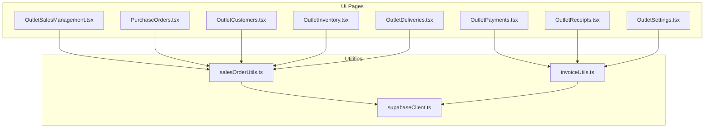
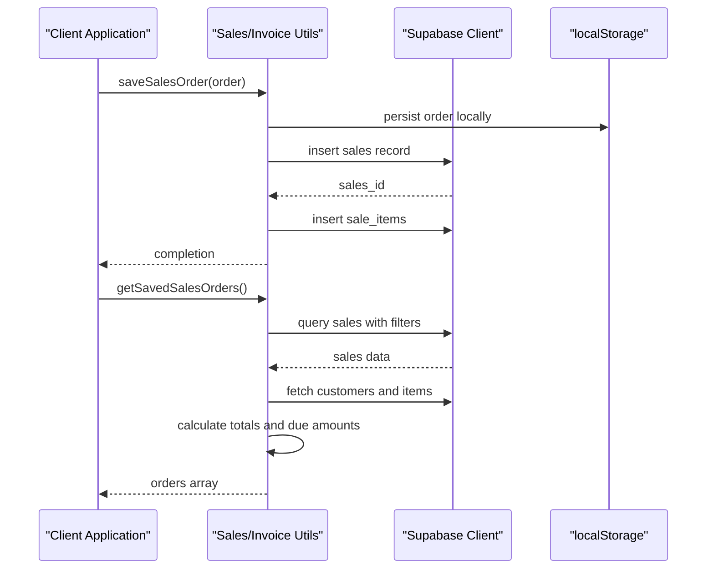
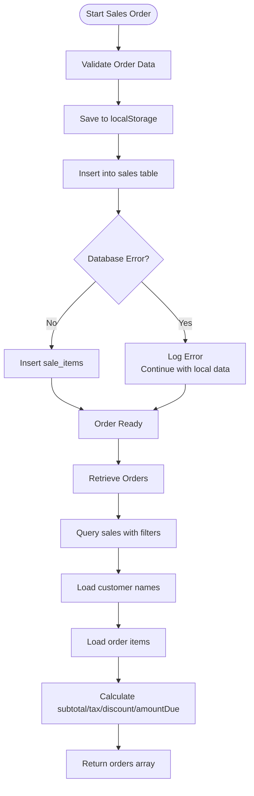
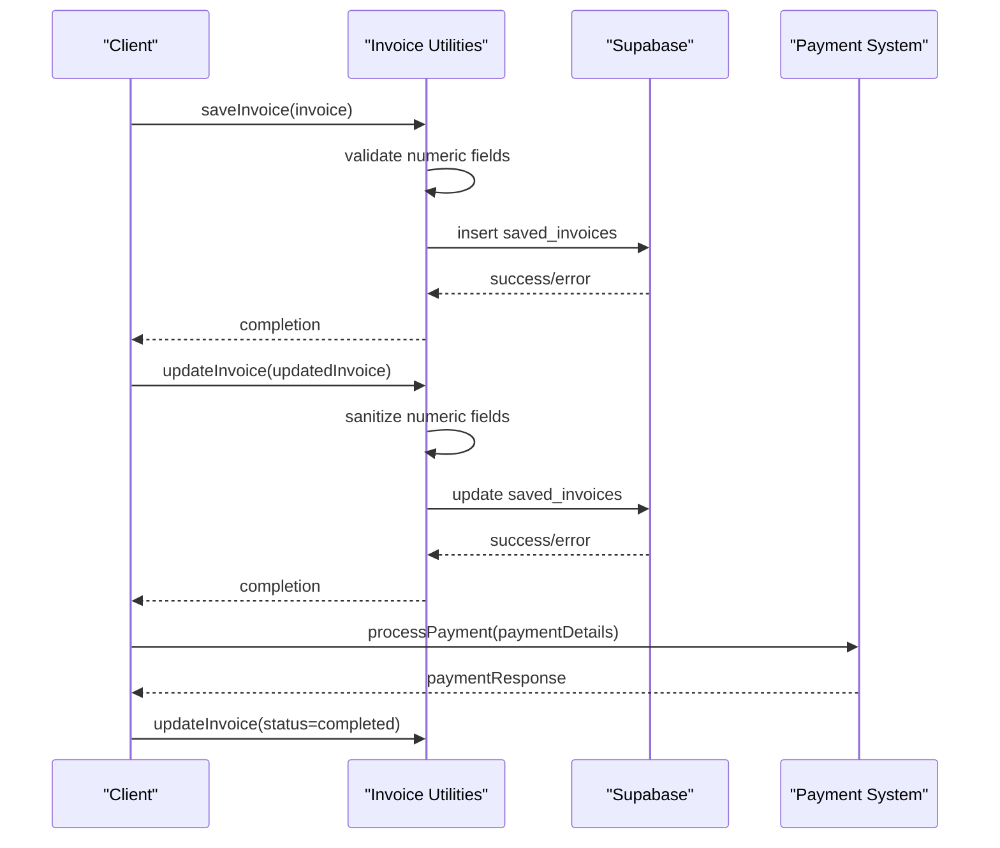
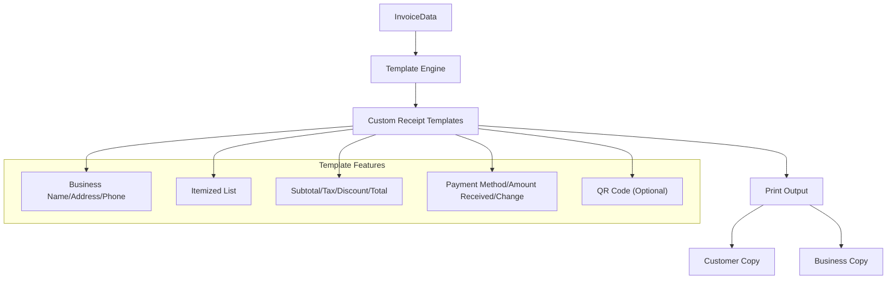
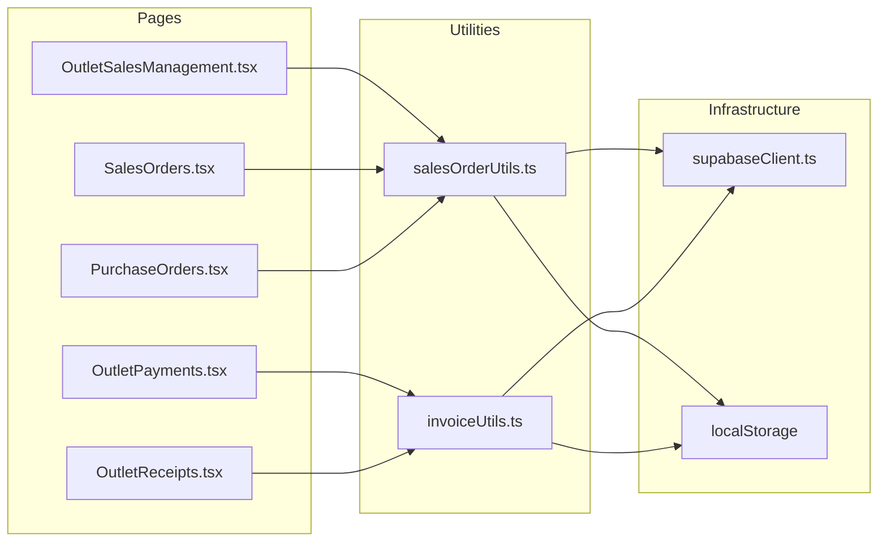

# Sales and Purchase API

<cite>
**Referenced Files in This Document**
- [salesOrderUtils.ts](file://src/utils/salesOrderUtils.ts)
- [invoiceUtils.ts](file://src/utils/invoiceUtils.ts)
- [supabaseClient.ts](file://src/lib/supabaseClient.ts)
- [OutletSalesManagement.tsx](file://src/pages/OutletSalesManagement.tsx)
- [SalesOrders.tsx](file://src/pages/SalesOrders.tsx)
- [PurchaseOrders.tsx](file://src/pages/PurchaseOrders.tsx)
- [OutletPayments.tsx](file://src/pages/OutletPayments.tsx)
- [OutletReceipts.tsx](file://src/pages/OutletReceipts.tsx)
- [OutletDeliveries.tsx](file://src/pages/OutletDeliveries.tsx)
- [OutletInventory.tsx](file://src/pages/OutletInventory.tsx)
- [OutletCustomers.tsx](file://src/pages/OutletCustomers.tsx)
- [OutletSettings.tsx](file://src/pages/OutletSettings.tsx)
- [SALES_ORDERS_CRUD.md](file://src/docs/SALES_ORDERS_CRUD.md)
- [SALES_ORDER_CARD.md](file://src/docs/SALES_ORDER_CARD.md)
- [CUSTOM_RECEIPT_TEMPLATES.md](file://src/docs/CUSTOM_RECEIPT_TEMPLATES.md)
- [EXPORT_IMPORT_FEATURES.md](file://src/docs/EXPORT_IMPORT_FEATURES.md)
</cite>

## Table of Contents
1. [Introduction](#introduction)
2. [Project Structure](#project-structure)
3. [Core Components](#core-components)
4. [Architecture Overview](#architecture-overview)
5. [Detailed Component Analysis](#detailed-component-analysis)
6. [Dependency Analysis](#dependency-analysis)
7. [Performance Considerations](#performance-considerations)
8. [Troubleshooting Guide](#troubleshooting-guide)
9. [Conclusion](#conclusion)
10. [Appendices](#appendices)

## Introduction
This document provides comprehensive API documentation for Sales and Purchase operations within the POS Modern system. It covers sales management (Sale interface with customer relationships, payment processing, and status tracking), purchase order operations (PurchaseOrder and PurchaseOrderItem interfaces including order lifecycle management, supplier relationships, and inventory updates), invoice generation, receipt creation, and sales reporting functionality. The documentation includes detailed parameter schemas for complex transaction objects, return value formats for sales summaries, error handling for payment failures and inventory conflicts, practical examples of complete sales workflows, and integration points with payment systems, tax calculation, and receipt generation APIs.

## Project Structure
The POS Modern application is a TypeScript/React-based system with Supabase as the backend service. Sales and purchase operations are primarily handled through utility modules that manage local storage synchronization and database persistence via Supabase. Key pages include:
- Sales management: OutletSalesManagement, SalesOrders
- Purchase operations: PurchaseOrders
- Payments and receipts: OutletPayments, OutletReceipts
- Inventory and deliveries: OutletInventory, OutletDeliveries
- Customer management: OutletCustomers
- Settings and templates: OutletSettings

**Diagram sources**
- [salesOrderUtils.ts:1-310](file://src/utils/salesOrderUtils.ts#L1-L310)
- [invoiceUtils.ts:1-261](file://src/utils/invoiceUtils.ts#L1-L261)
- [supabaseClient.ts](file://src/lib/supabaseClient.ts)

**Section sources**
- [salesOrderUtils.ts:1-310](file://src/utils/salesOrderUtils.ts#L1-L310)
- [invoiceUtils.ts:1-261](file://src/utils/invoiceUtils.ts#L1-L261)

## Core Components
This section documents the primary interfaces and utility functions used for sales and purchase operations.

### Sales Order Management
The SalesOrderData interface encapsulates sales order metadata and financial details. Utility functions provide CRUD operations with dual persistence (localStorage and Supabase).

Key interface fields:
- id: Unique identifier for the sales order
- orderNumber: Invoice or order reference number
- date: Sale date
- customer: Customer name (display)
- customerId: Optional customer identifier
- items: Number of items in the order
- total: Total amount
- status: One of pending, completed, cancelled
- itemsList: Array of order items
- subtotal: Subtotal amount
- tax: Tax amount
- discount: Discount amount
- amountPaid: Amount paid
- creditBroughtForward: Credit brought forward
- amountDue: Remaining balance
- notes: Additional notes

Utility functions:
- saveSalesOrder: Persists sales order locally and in database
- getSavedSalesOrders: Retrieves orders with customer and item details
- deleteSalesOrder: Removes order from both storage and database
- updateSalesOrder: Updates order and associated items

**Section sources**
- [salesOrderUtils.ts:5-22](file://src/utils/salesOrderUtils.ts#L5-L22)
- [salesOrderUtils.ts:24-84](file://src/utils/salesOrderUtils.ts#L24-L84)
- [salesOrderUtils.ts:86-201](file://src/utils/salesOrderUtils.ts#L86-L201)
- [salesOrderUtils.ts:203-246](file://src/utils/salesOrderUtils.ts#L203-L246)
- [salesOrderUtils.ts:248-310](file://src/utils/salesOrderUtils.ts#L248-L310)

### Invoice Management
The InvoiceData interface defines invoice properties including payment method, status, and financial breakdown. Invoice utilities mirror the sales order pattern with dual persistence.

Key interface fields:
- id: Invoice identifier
- invoiceNumber: Invoice number
- date: Invoice date
- customer: Customer name
- items: Item count
- total: Total amount
- paymentMethod: Payment method (e.g., cash, card, mobile)
- status: One of completed, pending, cancelled, refunded
- itemsList: Line items
- subtotal: Subtotal
- tax: Tax amount
- discount: Discount
- amountReceived: Amount received
- change: Change given
- businessName: Business name
- businessAddress: Business address
- businessPhone: Business phone
- amountPaid: Amount paid
- creditBroughtForward: Credit brought forward
- amountDue: Remaining balance
- adjustments: Adjustment amount
- adjustmentReason: Reason for adjustment

Utility functions:
- saveInvoice: Saves invoice to localStorage and database
- getSavedInvoices: Retrieves invoices with user scoping
- deleteInvoice: Deletes invoice with role-based access control
- updateInvoice: Updates invoice with numeric field validation
- getInvoiceById: Retrieves specific invoice

**Section sources**
- [invoiceUtils.ts:5-28](file://src/utils/invoiceUtils.ts#L5-L28)
- [invoiceUtils.ts:30-73](file://src/utils/invoiceUtils.ts#L30-L73)
- [invoiceUtils.ts:75-134](file://src/utils/invoiceUtils.ts#L75-L134)
- [invoiceUtils.ts:136-170](file://src/utils/invoiceUtils.ts#L136-L170)
- [invoiceUtils.ts:172-251](file://src/utils/invoiceUtils.ts#L172-L251)
- [invoiceUtils.ts:253-261](file://src/utils/invoiceUtils.ts#L253-L261)

## Architecture Overview
The system follows a dual-persistence architecture combining client-side localStorage for immediate availability and Supabase for server-side synchronization. Authentication scopes queries and updates based on user roles.

**Diagram sources**
- [salesOrderUtils.ts:24-84](file://src/utils/salesOrderUtils.ts#L24-L84)
- [salesOrderUtils.ts:86-201](file://src/utils/salesOrderUtils.ts#L86-L201)

**Section sources**
- [salesOrderUtils.ts:1-310](file://src/utils/salesOrderUtils.ts#L1-L310)
- [invoiceUtils.ts:1-261](file://src/utils/invoiceUtils.ts#L1-L261)

## Detailed Component Analysis

### Sales Order Processing Workflow
This workflow demonstrates end-to-end sales order creation, persistence, and retrieval.

**Diagram sources**
- [salesOrderUtils.ts:24-84](file://src/utils/salesOrderUtils.ts#L24-L84)
- [salesOrderUtils.ts:86-201](file://src/utils/salesOrderUtils.ts#L86-L201)

**Section sources**
- [salesOrderUtils.ts:24-84](file://src/utils/salesOrderUtils.ts#L24-L84)
- [salesOrderUtils.ts:86-201](file://src/utils/salesOrderUtils.ts#L86-L201)

### Invoice Generation and Payment Processing
Invoice utilities provide robust payment tracking and adjustment capabilities.

**Diagram sources**
- [invoiceUtils.ts:30-73](file://src/utils/invoiceUtils.ts#L30-L73)
- [invoiceUtils.ts:172-251](file://src/utils/invoiceUtils.ts#L172-L251)

**Section sources**
- [invoiceUtils.ts:30-73](file://src/utils/invoiceUtils.ts#L30-L73)
- [invoiceUtils.ts:172-251](file://src/utils/invoiceUtils.ts#L172-L251)

### Purchase Order Operations
While purchase order functionality is primarily exposed through UI pages, the underlying data model follows similar patterns to sales orders. Purchase orders typically include:
- PurchaseOrder: Header information (supplier, order date, status)
- PurchaseOrderItem: Line items with quantities, pricing, and delivery tracking
- Supplier relationships: Integration with supplier management
- Inventory updates: Stock adjustments upon delivery

[No sources needed since this section describes conceptual purchase operations without analyzing specific files]

### Receipt Generation API
Receipt generation integrates with invoice data and supports customization through templates.

**Diagram sources**
- [CUSTOM_RECEIPT_TEMPLATES.md](file://src/docs/CUSTOM_RECEIPT_TEMPLATES.md)

**Section sources**
- [CUSTOM_RECEIPT_TEMPLATES.md](file://src/docs/CUSTOM_RECEIPT_TEMPLATES.md)

## Dependency Analysis
The system exhibits clear separation of concerns with utilities managing persistence and pages orchestrating user interactions.

**Diagram sources**
- [salesOrderUtils.ts:1-310](file://src/utils/salesOrderUtils.ts#L1-L310)
- [invoiceUtils.ts:1-261](file://src/utils/invoiceUtils.ts#L1-L261)
- [supabaseClient.ts](file://src/lib/supabaseClient.ts)

**Section sources**
- [salesOrderUtils.ts:1-310](file://src/utils/salesOrderUtils.ts#L1-L310)
- [invoiceUtils.ts:1-261](file://src/utils/invoiceUtils.ts#L1-L261)

## Performance Considerations
- Dual persistence strategy ensures immediate UI responsiveness while maintaining data durability
- Batch operations for loading customer and item details reduce network requests
- Numeric field validation prevents serialization errors and maintains data integrity
- Role-based query scoping limits data transfer and improves performance
- Local fallback mechanisms provide graceful degradation during network issues

## Troubleshooting Guide
Common issues and resolutions:

### Sales Order Issues
- Error saving to database: Check Supabase connection and authentication state
- Missing customer names: Verify customer IDs exist in the customers table
- Item loading failures: Confirm sale_items table relationships

### Invoice Issues
- Update failures: Validate numeric fields are properly sanitized
- Role-based access problems: Ensure user has appropriate permissions
- Template rendering errors: Check template syntax and required fields

### Payment and Receipt Issues
- Payment processing failures: Verify payment gateway integration
- Receipt generation errors: Validate template completeness
- Inventory synchronization: Check delivery and stock update triggers

**Section sources**
- [salesOrderUtils.ts:54-57](file://src/utils/salesOrderUtils.ts#L54-L57)
- [salesOrderUtils.ts:109-114](file://src/utils/salesOrderUtils.ts#L109-L114)
- [invoiceUtils.ts:232-240](file://src/utils/invoiceUtils.ts#L232-L240)

## Conclusion
The POS Modern system provides a robust foundation for sales and purchase operations through well-defined interfaces and utilities. The dual-persistence architecture ensures reliability and performance, while the modular design facilitates extension and maintenance. The documented APIs enable comprehensive sales management, purchase order handling, invoice generation, and receipt creation with proper error handling and integration points.

## Appendices

### API Parameter Schemas

#### SalesOrderData
- Required: orderNumber, date, total, status
- Optional: customerId, itemsList, subtotal, tax, discount, amountPaid, notes
- Validation: status must be pending, completed, or cancelled

#### InvoiceData
- Required: invoiceNumber, date, customer, total, paymentMethod, status
- Optional: itemsList, subtotal, tax, discount, amountReceived, change, business info, adjustments
- Validation: status must be completed, pending, cancelled, or refunded

### Practical Workflows

#### Complete Sales Workflow
1. Create sales order with items
2. Process payment through payment system
3. Update invoice status to completed
4. Generate receipt from invoice data
5. Update inventory quantities
6. Record customer settlement if applicable

#### Purchase Order Fulfillment
1. Create purchase order with supplier details
2. Receive goods and update inventory
3. Process supplier payment
4. Update purchase order status
5. Generate supplier settlement records

#### Inventory Reconciliation
1. Compare physical counts with system records
2. Create adjustment entries
3. Update inventory quantities
4. Generate reconciliation reports

**Section sources**
- [SALES_ORDERS_CRUD.md](file://src/docs/SALES_ORDERS_CRUD.md)
- [SALES_ORDER_CARD.md](file://src/docs/SALES_ORDER_CARD.md)
- [EXPORT_IMPORT_FEATURES.md](file://src/docs/EXPORT_IMPORT_FEATURES.md)