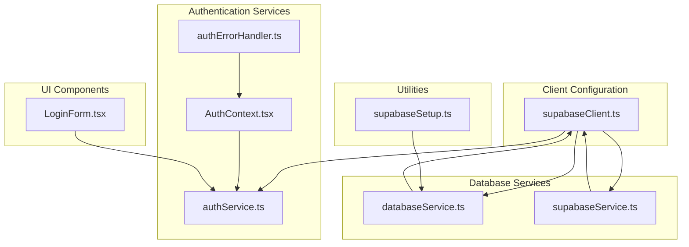
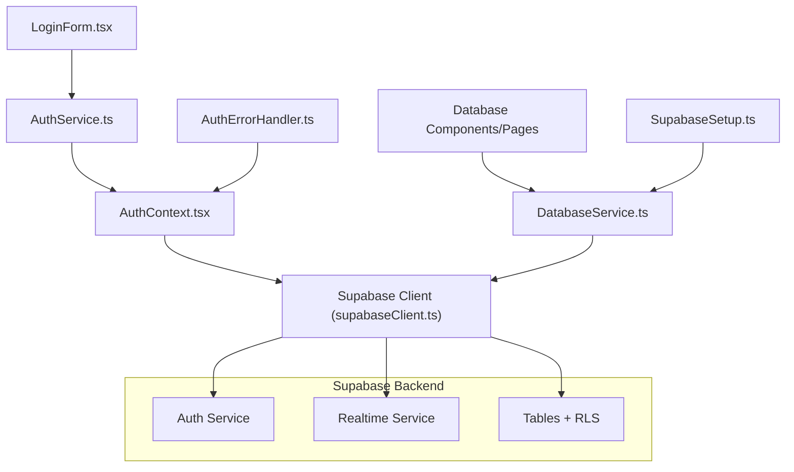
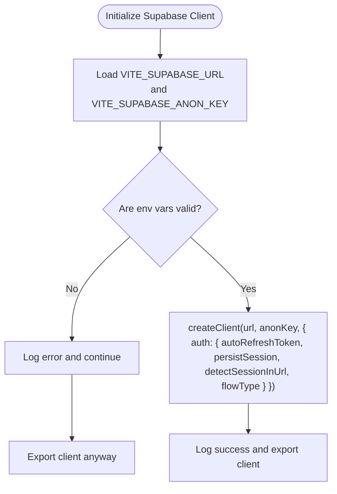
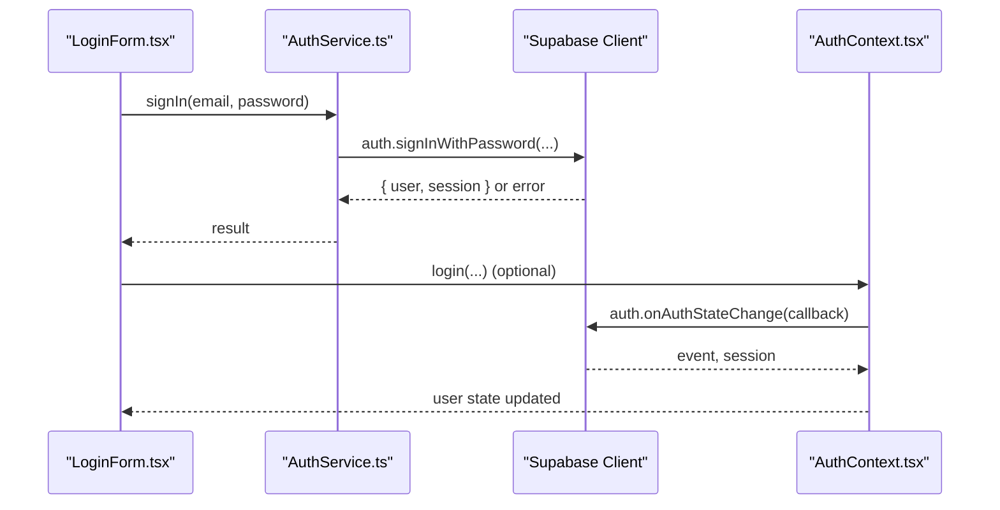
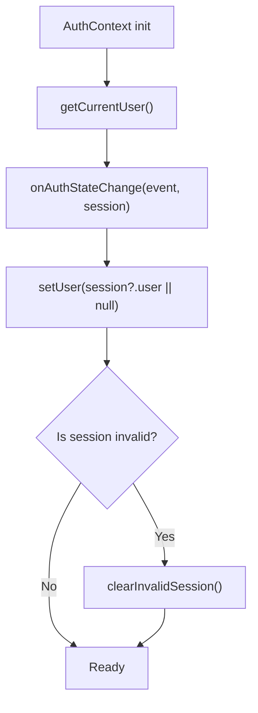
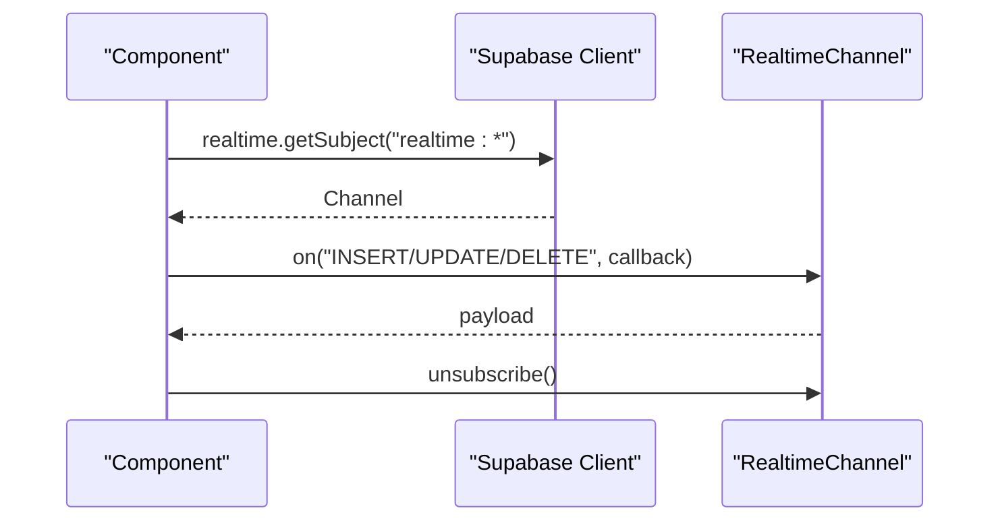
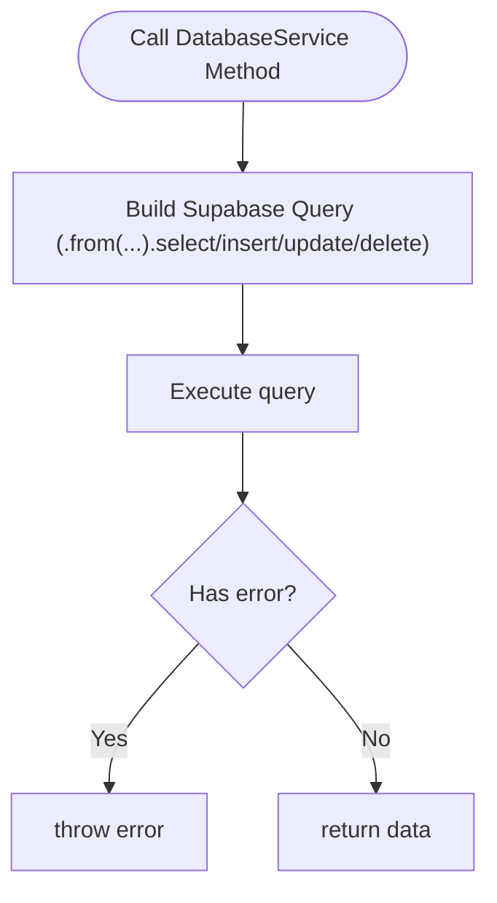
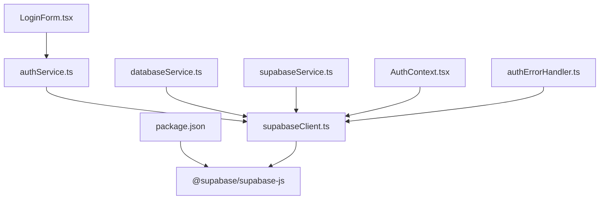

# Supabase Service API

<cite>
**Referenced Files in This Document**
- [supabaseClient.ts](file://src/lib/supabaseClient.ts)
- [authService.ts](file://src/services/authService.ts)
- [supabaseService.ts](file://src/services/supabaseService.ts)
- [databaseService.ts](file://src/services/databaseService.ts)
- [AuthContext.tsx](file://src/contexts/AuthContext.tsx)
- [authErrorHandler.ts](file://src/utils/authErrorHandler.ts)
- [supabaseSetup.ts](file://src/utils/supabaseSetup.ts)
- [LoginForm.tsx](file://src/components/LoginForm.tsx)
- [package.json](file://package.json)
</cite>

## Table of Contents
1. [Introduction](#introduction)
2. [Project Structure](#project-structure)
3. [Core Components](#core-components)
4. [Architecture Overview](#architecture-overview)
5. [Detailed Component Analysis](#detailed-component-analysis)
6. [Dependency Analysis](#dependency-analysis)
7. [Performance Considerations](#performance-considerations)
8. [Troubleshooting Guide](#troubleshooting-guide)
9. [Conclusion](#conclusion)

## Introduction
This document provides comprehensive API documentation for the Supabase Service integration used in the POS system. It covers authentication methods (login, logout, signup, password reset, and session management), real-time subscription APIs for live data updates, database operation wrappers, and Supabase client configuration. It also documents authentication state management, JWT token handling, and user session persistence. Additional topics include database connection pooling, query optimization, error handling strategies, examples of authenticated requests, real-time data synchronization, offline-first data handling patterns, security considerations, rate limiting, and performance monitoring.

## Project Structure
The Supabase integration is organized around a central client configuration, service modules for authentication and database operations, a React context for state management, and utility modules for error handling and schema setup.

**Diagram sources**
- [supabaseClient.ts:1-33](file://src/lib/supabaseClient.ts#L1-L33)
- [authService.ts:1-127](file://src/services/authService.ts#L1-L127)
- [AuthContext.tsx:1-118](file://src/contexts/AuthContext.tsx#L1-L118)
- [authErrorHandler.ts:1-92](file://src/utils/authErrorHandler.ts#L1-L92)
- [databaseService.ts:1-800](file://src/services/databaseService.ts#L1-L800)
- [supabaseService.ts:1-60](file://src/services/supabaseService.ts#L1-L60)
- [supabaseSetup.ts:1-188](file://src/utils/supabaseSetup.ts#L1-L188)
- [LoginForm.tsx:1-331](file://src/components/LoginForm.tsx#L1-L331)

**Section sources**
- [supabaseClient.ts:1-33](file://src/lib/supabaseClient.ts#L1-L33)
- [authService.ts:1-127](file://src/services/authService.ts#L1-L127)
- [AuthContext.tsx:1-118](file://src/contexts/AuthContext.tsx#L1-L118)
- [authErrorHandler.ts:1-92](file://src/utils/authErrorHandler.ts#L1-L92)
- [databaseService.ts:1-800](file://src/services/databaseService.ts#L1-L800)
- [supabaseService.ts:1-60](file://src/services/supabaseService.ts#L1-L60)
- [supabaseSetup.ts:1-188](file://src/utils/supabaseSetup.ts#L1-L188)
- [LoginForm.tsx:1-331](file://src/components/LoginForm.tsx#L1-L331)

## Core Components
- Supabase Client: Centralized client initialization with auto-refresh, session persistence, and URL detection.
- Authentication Service: Wrappers for sign-up, sign-in, sign-out, password reset, and user metadata retrieval.
- Database Service: Typed CRUD operations and specialized queries for business entities.
- Supabase Service: Basic connectivity checks and generic table operations.
- Auth Context: React provider managing authentication state and session lifecycle.
- Auth Error Handler: Utilities for handling refresh token failures and session invalidation.
- Supabase Setup: SQL schema definitions and RLS policies for tables.

**Section sources**
- [supabaseClient.ts:19-31](file://src/lib/supabaseClient.ts#L19-L31)
- [authService.ts:5-127](file://src/services/authService.ts#L5-L127)
- [databaseService.ts:415-784](file://src/services/databaseService.ts#L415-L784)
- [supabaseService.ts:4-60](file://src/services/supabaseService.ts#L4-L60)
- [AuthContext.tsx:16-110](file://src/contexts/AuthContext.tsx#L16-L110)
- [authErrorHandler.ts:8-92](file://src/utils/authErrorHandler.ts#L8-L92)
- [supabaseSetup.ts:4-188](file://src/utils/supabaseSetup.ts#L4-L188)

## Architecture Overview
The system follows a layered architecture:
- Presentation Layer: UI components (e.g., LoginForm) trigger authentication actions.
- Service Layer: AuthService encapsulates Supabase auth operations; DatabaseService provides typed data access.
- Infrastructure Layer: Supabase client configured with auto-refresh and persistent sessions.
- Utility Layer: AuthErrorHandler manages session invalidation; SupabaseSetup defines schema and policies.

**Diagram sources**
- [LoginForm.tsx:10-11](file://src/components/LoginForm.tsx#L10-L11)
- [authService.ts:1-127](file://src/services/authService.ts#L1-L127)
- [AuthContext.tsx:1-118](file://src/contexts/AuthContext.tsx#L1-L118)
- [supabaseClient.ts:1-33](file://src/lib/supabaseClient.ts#L1-L33)
- [databaseService.ts:1-800](file://src/services/databaseService.ts#L1-L800)
- [authErrorHandler.ts:1-92](file://src/utils/authErrorHandler.ts#L1-L92)
- [supabaseSetup.ts:1-188](file://src/utils/supabaseSetup.ts#L1-L188)

## Detailed Component Analysis

### Supabase Client Configuration
- Initializes the Supabase client with environment variables for URL and anon key.
- Enables auto-refresh token, persistent session storage, URL session detection, and implicit OAuth flow.
- Validates environment variables and logs client creation status.

**Diagram sources**
- [supabaseClient.ts:4-31](file://src/lib/supabaseClient.ts#L4-L31)

**Section sources**
- [supabaseClient.ts:1-33](file://src/lib/supabaseClient.ts#L1-L33)

### Authentication API
- Login: Uses password-based authentication and returns user/session on success.
- Logout: Calls sign-out and clears local state.
- Signup: Registers a new user with optional metadata and returns user/session.
- Password Reset: Initiates password reset with redirect URL.
- Update Password/Email: Updates user attributes.
- Current User: Retrieves the currently authenticated user.
- Role Retrieval: Reads role from user metadata.
- Auth State Change Listener: Subscribes to auth events.

**Diagram sources**
- [LoginForm.tsx:67-104](file://src/components/LoginForm.tsx#L67-L104)
- [authService.ts:26-39](file://src/services/authService.ts#L26-L39)
- [AuthContext.tsx:43-49](file://src/contexts/AuthContext.tsx#L43-L49)

**Section sources**
- [authService.ts:5-127](file://src/services/authService.ts#L5-L127)
- [AuthContext.tsx:16-110](file://src/contexts/AuthContext.tsx#L16-L110)
- [LoginForm.tsx:56-114](file://src/components/LoginForm.tsx#L56-L114)

### Session Management and JWT Handling
- Auto-refresh token enabled to maintain sessions.
- Persistent session storage ensures continuity across browser sessions.
- Auth state listener updates React context and clears invalid sessions when refresh token errors occur.
- AuthErrorHandler provides manual refresh attempts and session cleanup.

**Diagram sources**
- [AuthContext.tsx:20-54](file://src/contexts/AuthContext.tsx#L20-L54)
- [authErrorHandler.ts:43-91](file://src/utils/authErrorHandler.ts#L43-L91)

**Section sources**
- [AuthContext.tsx:16-54](file://src/contexts/AuthContext.tsx#L16-L54)
- [authErrorHandler.ts:8-92](file://src/utils/authErrorHandler.ts#L8-L92)

### Real-time Subscription APIs
- Supabase Realtime is integrated via the Supabase JS client. The project imports the client and uses channel subscriptions for live updates.
- Typical usage involves creating channels, listening to table changes, and unsubscribing when components unmount.

**Diagram sources**
- [package.json:42](file://package.json#L42)

**Section sources**
- [package.json:42](file://package.json#L42)

### Database Operation Wrappers
- Generic connectivity test and table operations demonstrate basic patterns for select/insert.
- Typed CRUD operations for entities (users, products, categories, customers, suppliers, outlets, sales, purchase orders, expenses, debts, discounts, returns, inventory audits, access logs, tax records, damaged products, reports, customer settlements, supplier settlements) provide consistent error handling and data shaping.

**Diagram sources**
- [supabaseService.ts:26-60](file://src/services/supabaseService.ts#L26-L60)
- [databaseService.ts:416-494](file://src/services/databaseService.ts#L416-L494)

**Section sources**
- [supabaseService.ts:4-60](file://src/services/supabaseService.ts#L4-L60)
- [databaseService.ts:415-784](file://src/services/databaseService.ts#L415-L784)

### Supabase Client Configuration
- Environment variable validation and logging for URL and anon key.
- Auto-refresh and persistence settings for seamless user experience.

**Section sources**
- [supabaseClient.ts:10-31](file://src/lib/supabaseClient.ts#L10-L31)

### Authentication State Management
- React context maintains user state and loading status.
- Auth state listener keeps state synchronized with backend.
- Error handling distinguishes between refresh token issues and other auth errors.

**Section sources**
- [AuthContext.tsx:16-110](file://src/contexts/AuthContext.tsx#L16-L110)
- [authErrorHandler.ts:14-38](file://src/utils/authErrorHandler.ts#L14-L38)

### JWT Token Handling
- Supabase client auto-refreshes tokens; manual refresh attempts are supported via AuthErrorHandler.
- On invalid refresh token, sessions are cleared from both Supabase and localStorage.

**Section sources**
- [supabaseClient.ts:21-30](file://src/lib/supabaseClient.ts#L21-L30)
- [authErrorHandler.ts:74-91](file://src/utils/authErrorHandler.ts#L74-L91)

### User Session Persistence
- Session persistence enabled; URL session detection supports OAuth flows.
- AuthErrorHandler clears cached tokens when refresh fails.

**Section sources**
- [supabaseClient.ts:23-29](file://src/lib/supabaseClient.ts#L23-L29)
- [authErrorHandler.ts:43-56](file://src/utils/authErrorHandler.ts#L43-L56)

### Database Connection Pooling
- Supabase JS client manages connection pooling internally; no explicit configuration is exposed in the codebase.
- Best practices: reuse the singleton client, minimize concurrent long-running queries, and leverage Supabase’s built-in pooling.

**Section sources**
- [supabaseClient.ts:19-31](file://src/lib/supabaseClient.ts#L19-L31)

### Query Optimization
- Use selective field queries and appropriate ordering.
- Leverage indexes defined in SupabaseSetup for improved performance.
- Batch operations where feasible to reduce round-trips.

**Section sources**
- [databaseService.ts:416-494](file://src/services/databaseService.ts#L416-L494)
- [supabaseSetup.ts:120-131](file://src/utils/supabaseSetup.ts#L120-L131)

### Error Handling Strategies
- Centralized error handling in services with try/catch blocks.
- AuthErrorHandler provides formatted messages and session cleanup.
- UI components surface errors via toast notifications.

**Section sources**
- [authService.ts:6-23](file://src/services/authService.ts#L6-L23)
- [authErrorHandler.ts:14-38](file://src/utils/authErrorHandler.ts#L14-L38)
- [LoginForm.tsx:93-112](file://src/components/LoginForm.tsx#L93-L112)

### Examples of Authenticated Requests
- Login flow: LoginForm triggers AuthService.signIn, which calls Supabase auth service and updates context.
- Password reset: AuthService.resetPassword initiates reset with redirect URL.

**Section sources**
- [LoginForm.tsx:67-104](file://src/components/LoginForm.tsx#L67-L104)
- [authService.ts:85-97](file://src/services/authService.ts#L85-L97)

### Real-time Data Synchronization
- Use Supabase Realtime channels to listen for INSERT/UPDATE/DELETE events on relevant tables.
- Subscribe in components’ effect hooks and unsubscribe on unmount to prevent leaks.

**Section sources**
- [package.json:42](file://package.json#L42)

### Offline-first Data Handling Patterns
- Local storage utilities exist for temporary data (e.g., syncing sold quantities and selling prices).
- Strategy: queue operations locally and sync to Supabase when online; clear local queues upon successful sync.

**Section sources**
- [syncSoldQuantities.ts](file://src/utils/syncSoldQuantities.ts)
- [syncSellingPrices.ts](file://src/utils/syncSellingPrices.ts)

### Security Considerations
- Row Level Security (RLS) policies are defined for all tables in SupabaseSetup.
- Policies enable read/write access; adjust according to roles and business logic.
- Keep anon key secure and avoid exposing it in client-side code.

**Section sources**
- [supabaseSetup.ts:132-187](file://src/utils/supabaseSetup.ts#L132-L187)

### Rate Limiting and Performance Monitoring
- Supabase enforces backend rate limits; implement client-side throttling for frequent polling.
- Monitor network tab for latency; consider caching frequently accessed data.
- Use Supabase logs and dashboard metrics for backend performance insights.

[No sources needed since this section provides general guidance]

## Dependency Analysis
The following diagram shows key dependencies among modules involved in Supabase integration.

**Diagram sources**
- [package.json:42](file://package.json#L42)
- [supabaseClient.ts:1](file://src/lib/supabaseClient.ts#L1)
- [authService.ts:1](file://src/services/authService.ts#L1)
- [databaseService.ts:1](file://src/services/databaseService.ts#L1)
- [supabaseService.ts:1](file://src/services/supabaseService.ts#L1)
- [AuthContext.tsx:2](file://src/contexts/AuthContext.tsx#L2)
- [authErrorHandler.ts:6](file://src/utils/authErrorHandler.ts#L6)
- [LoginForm.tsx:10](file://src/components/LoginForm.tsx#L10)

**Section sources**
- [package.json:42](file://package.json#L42)
- [supabaseClient.ts:1](file://src/lib/supabaseClient.ts#L1)
- [authService.ts:1](file://src/services/authService.ts#L1)
- [databaseService.ts:1](file://src/services/databaseService.ts#L1)
- [supabaseService.ts:1](file://src/services/supabaseService.ts#L1)
- [AuthContext.tsx:2](file://src/contexts/AuthContext.tsx#L2)
- [authErrorHandler.ts:6](file://src/utils/authErrorHandler.ts#L6)
- [LoginForm.tsx:10](file://src/components/LoginForm.tsx#L10)

## Performance Considerations
- Reuse the singleton Supabase client to benefit from internal pooling.
- Prefer selective field queries and limit results where possible.
- Use indexes defined in SupabaseSetup to optimize lookups.
- Debounce or throttle frequent UI-triggered queries.
- Monitor backend performance via Supabase dashboard and logs.

[No sources needed since this section provides general guidance]

## Troubleshooting Guide
- Environment Variables: Ensure VITE_SUPABASE_URL and VITE_SUPABASE_ANON_KEY are set correctly; the client logs warnings if missing.
- Refresh Token Issues: AuthErrorHandler detects “Refresh Token Not Found” and clears sessions; manual refresh is available.
- Email Confirmation: Specific messaging guides users to confirm their email before login.
- UI Feedback: LoginForm displays toast notifications for authentication errors and redirects users appropriately.

**Section sources**
- [supabaseClient.ts:10-17](file://src/lib/supabaseClient.ts#L10-L17)
- [authErrorHandler.ts:14-38](file://src/utils/authErrorHandler.ts#L14-L38)
- [LoginForm.tsx:70-112](file://src/components/LoginForm.tsx#L70-L112)

## Conclusion
The Supabase Service integration provides a robust foundation for authentication, real-time updates, and database operations. By leveraging the centralized client configuration, typed service wrappers, and React context for state management, the system achieves reliable session handling, scalable data access, and maintainable error handling. Adhering to security best practices (RLS, token handling) and performance guidelines (optimized queries, pooling) ensures a responsive and secure application.