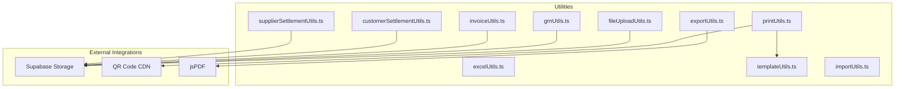
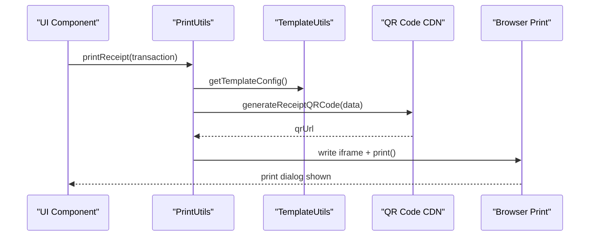
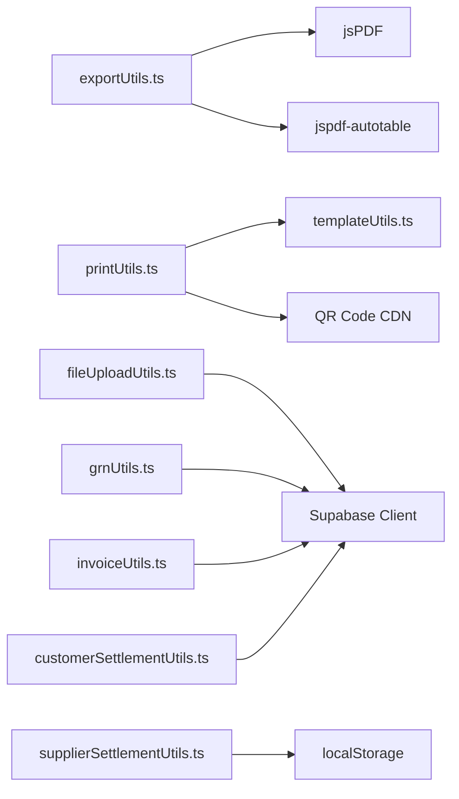

# Utility Service API

<cite>
**Referenced Files in This Document**
- [printUtils.ts](file://src/utils/printUtils.ts)
- [exportUtils.ts](file://src/utils/exportUtils.ts)
- [excelUtils.ts](file://src/utils/excelUtils.ts)
- [templateUtils.ts](file://src/utils/templateUtils.ts)
- [fileUploadUtils.ts](file://src/utils/fileUploadUtils.ts)
- [importUtils.ts](file://src/utils/importUtils.ts)
- [grnUtils.ts](file://src/utils/grnUtils.ts)
- [invoiceUtils.ts](file://src/utils/invoiceUtils.ts)
- [customerSettlementUtils.ts](file://src/utils/customerSettlementUtils.ts)
- [supplierSettlementUtils.ts](file://src/utils/supplierSettlementUtils.ts)
</cite>

## Table of Contents
1. [Introduction](#introduction)
2. [Project Structure](#project-structure)
3. [Core Components](#core-components)
4. [Architecture Overview](#architecture-overview)
5. [Detailed Component Analysis](#detailed-component-analysis)
6. [Dependency Analysis](#dependency-analysis)
7. [Performance Considerations](#performance-considerations)
8. [Troubleshooting Guide](#troubleshooting-guide)
9. [Conclusion](#conclusion)

## Introduction
This document provides comprehensive API documentation for the Utility Service functions that power printing, exporting, templating, file uploads, and data transformation across the POS system. It covers:
- Print utilities for receipts, purchase receipts, customer settlements, and mobile print flows
- Export utilities for CSV, JSON, PDF, and plain-text receipts
- Template utilities for dynamic receipt generation and customization
- Excel utilities for spreadsheet exports
- File upload utilities for Supabase Storage with robust fallbacks
- Import utilities for CSV and JSON parsing and validation
- Document management utilities for GRNs, invoices, and settlements

The goal is to enable developers to integrate, customize, and troubleshoot utility functions effectively while maintaining performance and reliability.

## Project Structure
The utility services are organized under the `src/utils/` directory, grouped by domain:
- Printing and receipts: printUtils.ts
- Exporting data: exportUtils.ts, excelUtils.ts
- Templates: templateUtils.ts
- File uploads: fileUploadUtils.ts
- Imports: importUtils.ts
- Documents: grnUtils.ts, invoiceUtils.ts, customerSettlementUtils.ts, supplierSettlementUtils.ts

**Diagram sources**
- [printUtils.ts:1-800](file://src/utils/printUtils.ts#L1-L800)
- [exportUtils.ts:1-785](file://src/utils/exportUtils.ts#L1-L785)
- [excelUtils.ts:1-36](file://src/utils/excelUtils.ts#L1-L36)
- [templateUtils.ts:1-584](file://src/utils/templateUtils.ts#L1-L584)
- [fileUploadUtils.ts:1-146](file://src/utils/fileUploadUtils.ts#L1-L146)
- [grnUtils.ts:1-436](file://src/utils/grnUtils.ts#L1-L436)
- [invoiceUtils.ts:1-261](file://src/utils/invoiceUtils.ts#L1-L261)
- [customerSettlementUtils.ts:1-430](file://src/utils/customerSettlementUtils.ts#L1-L430)
- [supplierSettlementUtils.ts:1-121](file://src/utils/supplierSettlementUtils.ts#L1-L121)

**Section sources**
- [printUtils.ts:1-800](file://src/utils/printUtils.ts#L1-L800)
- [exportUtils.ts:1-785](file://src/utils/exportUtils.ts#L1-L785)
- [excelUtils.ts:1-36](file://src/utils/excelUtils.ts#L1-L36)
- [templateUtils.ts:1-584](file://src/utils/templateUtils.ts#L1-L584)
- [fileUploadUtils.ts:1-146](file://src/utils/fileUploadUtils.ts#L1-L146)
- [importUtils.ts:1-114](file://src/utils/importUtils.ts#L1-L114)
- [grnUtils.ts:1-436](file://src/utils/grnUtils.ts#L1-L436)
- [invoiceUtils.ts:1-261](file://src/utils/invoiceUtils.ts#L1-L261)
- [customerSettlementUtils.ts:1-430](file://src/utils/customerSettlementUtils.ts#L1-L430)
- [supplierSettlementUtils.ts:1-121](file://src/utils/supplierSettlementUtils.ts#L1-L121)

## Core Components
This section summarizes the primary utility APIs and their responsibilities.

- Print Utilities
  - Mobile detection and QR code generation via CDN
  - Desktop and mobile receipt printing with custom templates
  - Purchase receipt printing and customer settlement printing

- Export Utilities
  - CSV, JSON, and PDF exports
  - Receipt, customer settlement, supplier settlement, and GRN PDF exports
  - Mobile-friendly notifications for PDF saves

- Excel Utilities
  - CSV export with Excel-compatible escaping and UTF-8 BOM

- Template Utilities
  - Receipt and purchase receipt template configuration
  - LocalStorage-backed customization with defaults
  - Dynamic HTML generation for receipts

- File Upload Utilities
  - Supabase Storage upload with bucket discovery and fallback
  - File deletion with bucket existence checks

- Import Utilities
  - CSV and JSON parsing
  - Validation for products, customers, suppliers

- Document Management Utilities
  - GRN, invoice, customer settlement, and supplier settlement persistence
  - LocalStorage fallback with Supabase integration

**Section sources**
- [printUtils.ts:1-800](file://src/utils/printUtils.ts#L1-L800)
- [exportUtils.ts:1-785](file://src/utils/exportUtils.ts#L1-L785)
- [excelUtils.ts:1-36](file://src/utils/excelUtils.ts#L1-L36)
- [templateUtils.ts:1-584](file://src/utils/templateUtils.ts#L1-L584)
- [fileUploadUtils.ts:1-146](file://src/utils/fileUploadUtils.ts#L1-L146)
- [importUtils.ts:1-114](file://src/utils/importUtils.ts#L1-L114)
- [grnUtils.ts:1-436](file://src/utils/grnUtils.ts#L1-L436)
- [invoiceUtils.ts:1-261](file://src/utils/invoiceUtils.ts#L1-L261)
- [customerSettlementUtils.ts:1-430](file://src/utils/customerSettlementUtils.ts#L1-L430)
- [supplierSettlementUtils.ts:1-121](file://src/utils/supplierSettlementUtils.ts#L1-L121)

## Architecture Overview
The utility services integrate with external systems and local storage to provide resilient functionality:
- Printing relies on CDN-generated QR codes and template-driven HTML
- Exporting leverages jsPDF for PDF generation and native Blob APIs for CSV/JSON
- File uploads use Supabase Storage with automatic bucket discovery and fallback
- Document management persists data locally and synchronizes with Supabase when authenticated

**Diagram sources**
- [printUtils.ts:48-418](file://src/utils/printUtils.ts#L48-L418)
- [templateUtils.ts:59-79](file://src/utils/templateUtils.ts#L59-L79)

**Section sources**
- [printUtils.ts:1-800](file://src/utils/printUtils.ts#L1-L800)
- [templateUtils.ts:1-584](file://src/utils/templateUtils.ts#L1-L584)

## Detailed Component Analysis

### Print Utilities
Responsibilities:
- Detect mobile vs desktop environments
- Generate QR codes via CDN for receipts
- Render receipts using custom templates or default HTML
- Print receipts via hidden iframes on desktop and mobile-specific flows

Key APIs:
- `isMobileDevice()`: Detects mobile devices
- `generateReceiptQRCode(transaction, type)`: Generates QR code URL for sales/purchase
- `printReceipt(transaction)`: Prints sales receipts with QR and custom templates
- `printPurchaseReceipt(transaction)`: Prints purchase receipts with QR and custom templates
- `printCustomerSettlement(settlement)`: Prints customer settlement receipts
- Internal helpers for mobile printing and loading indicators

Integration patterns:
- Uses `templateUtils.getTemplateConfig()` and `generateCustomReceipt()` for custom templates
- Uses CDN QR code endpoint to avoid build-time dependencies
- Desktop prints via hidden iframe; mobile uses device-specific flows

Examples:
- Print a sales receipt with QR code and custom template
- Print a purchase receipt with supplier details and totals
- Print a customer settlement with payment summary

**Section sources**
- [printUtils.ts:1-800](file://src/utils/printUtils.ts#L1-L800)
- [templateUtils.ts:59-79](file://src/utils/templateUtils.ts#L59-L79)

### Export Utilities
Responsibilities:
- Export arrays of data to CSV, JSON, and PDF
- Export formatted receipts, customer settlements, supplier settlements, and GRNs as PDF
- Provide mobile-friendly notifications for PDF saves

Key APIs:
- `exportToCSV(data, filename)`
- `exportToJSON(data, filename)`
- `exportToPDF(data, filename, title)`
- `exportReceiptAsPDF(transaction, filename)`
- `exportCustomerSettlementAsPDF(settlement, filename)`
- `exportSupplierSettlementAsPDF(settlement, filename)`
- `exportGRNAsPDF(grn, filename)`
- `showPreviewNotification(message)`: Mobile notification for PDF saves
- `exportReceipt(transaction, filename)`: Plain text receipt export

Processing logic:
- CSV: escape commas and quotes, join with newlines
- JSON: stringify with indentation
- PDF: construct jsPDF with autoTable for tabular data; adjust sizes for receipts

Examples:
- Export sales data to CSV for reconciliation
- Export a receipt as a PDF for customer delivery
- Export a customer settlement as a PDF for audit trails

**Section sources**
- [exportUtils.ts:1-785](file://src/utils/exportUtils.ts#L1-L785)

### Excel Utilities
Responsibilities:
- Export data to Excel-compatible CSV with UTF-8 BOM for correct character encoding

Key APIs:
- `exportToExcel(data, filename)`: Creates CSV with BOM and triggers download

Processing logic:
- Header row from first object keys
- Value escaping for commas and quotes
- BOM prepended for Excel recognition

Examples:
- Export product inventory to Excel for spreadsheets
- Export sales summaries to Excel for reporting

**Section sources**
- [excelUtils.ts:1-36](file://src/utils/excelUtils.ts#L1-L36)

### Template Utilities
Responsibilities:
- Manage receipt and purchase receipt template configurations
- Persist and retrieve configurations from localStorage
- Generate HTML receipts from templates and transaction data

Key APIs:
- `getTemplateConfig()`: Load receipt template config with defaults
- `getPurchaseTemplateConfig()`: Load purchase receipt template config with defaults
- `saveTemplateConfig(config)`: Save receipt template config
- `savePurchaseTemplateConfig(config)`: Save purchase receipt template config
- `generateCustomReceipt(transaction, config)`: Build receipt HTML from template
- `generateCustomPurchaseReceipt(transaction, config)`: Build purchase receipt HTML from template

Template configuration fields:
- Enable/disable sections (business info, transaction details, items, totals, payment info, supplier info)
- Font size and paper width
- Custom header/footer text

Examples:
- Customize receipt layout and branding
- Toggle visibility of totals and payment info
- Generate purchase receipts with supplier details

**Section sources**
- [templateUtils.ts:1-584](file://src/utils/templateUtils.ts#L1-L584)

### File Upload Utilities
Responsibilities:
- Upload files to Supabase Storage with bucket discovery and fallback
- Delete files from Supabase Storage with safety checks
- Provide public URLs for uploaded assets

Key APIs:
- `uploadFile(file, bucket?, folder?)`: Upload file with unique naming and bucket fallback
- `deleteFile(filePath, bucket?)`: Delete file with bucket existence verification

Processing logic:
- Authenticate user via Supabase
- List available buckets and attempt upload to specified bucket
- If bucket not found, iterate available buckets to upload
- Generate public URL upon success
- Log errors and return null on failure

Examples:
- Upload product images to assets bucket
- Upload attachments to a specific folder within a bucket
- Delete unused files to free storage

**Section sources**
- [fileUploadUtils.ts:1-146](file://src/utils/fileUploadUtils.ts#L1-L146)

### Import Utilities
Responsibilities:
- Parse CSV and JSON data into arrays
- Validate product, customer, and supplier data structures

Key APIs:
- `parseCSV(csvText)`: Split lines, parse headers, map values, handle quoted strings
- `parseJSON(jsonText)`: Parse JSON with array normalization
- `validateProducts(data)`: Validate product entries
- `validateCustomers(data)`: Validate customer entries
- `validateSuppliers(data)`: Validate supplier entries

Processing logic:
- CSV: trim whitespace, unescape quotes, convert numeric values
- JSON: wrap single objects into arrays
- Validation: check required fields and formats

Examples:
- Import product catalog from CSV
- Validate customer data before bulk insertion
- Parse supplier settlement JSON for batch processing

**Section sources**
- [importUtils.ts:1-114](file://src/utils/importUtils.ts#L1-L114)

### Document Management Utilities

#### Goods Received Note (GRN)
Responsibilities:
- Save, retrieve, update, and delete GRNs
- LocalStorage fallback with Supabase synchronization
- Calculate totals from items

Key APIs:
- `saveGRN(grn)`: Save to localStorage and Supabase
- `getSavedGRNs()`: Retrieve from Supabase or localStorage
- `deleteGRN(id)`: Remove from localStorage and Supabase
- `updateGRN(updatedGRN)`: Update localStorage and Supabase

Processing logic:
- Validate required fields before saving
- Calculate total from items
- Fallback to localStorage on database errors

Examples:
- Save a newly received GRN with items and receiving costs
- Retrieve recent GRNs for dashboard display
- Update GRN status after quality check

**Section sources**
- [grnUtils.ts:1-436](file://src/utils/grnUtils.ts#L1-L436)

#### Invoice
Responsibilities:
- Persist invoices with user scoping and admin visibility
- LocalStorage fallback for offline availability

Key APIs:
- `saveInvoice(invoice)`: Save to localStorage and Supabase
- `getSavedInvoices()`: Retrieve with role-based filtering
- `deleteInvoice(id)`: Remove from localStorage and Supabase
- `updateInvoice(updatedInvoice)`: Update localStorage and Supabase
- `getInvoiceById(id)`: Fetch invoice by ID

Processing logic:
- Admins see all invoices; non-admins see only their own
- Numeric fields sanitized to prevent NaN serialization

Examples:
- Save a completed sale as an invoice
- Retrieve invoices for a specific user
- Update invoice status after refund

**Section sources**
- [invoiceUtils.ts:1-261](file://src/utils/invoiceUtils.ts#L1-L261)

#### Customer Settlement
Responsibilities:
- Manage customer payment settlements with UUID validation
- LocalStorage fallback and Supabase synchronization
- Event dispatch for UI refresh

Key APIs:
- `saveCustomerSettlement(settlement)`
- `getSavedSettlements()`: Combine DB and localStorage, deduplicate
- `deleteCustomerSettlement(id)`
- `updateCustomerSettlement(updatedSettlement)`
- `getCustomerSettlementById(id)`
- `getSavedCustomerSettlementById(id)`: Direct DB retrieval with role-based access

Processing logic:
- Validate UUID for customer ID
- Dispatch refresh events on successful DB operations
- Combine DB and localStorage to avoid data loss

Examples:
- Record a customer payment settlement
- Retrieve a settlement by ID for PDF generation
- Update settlement notes after reconciliation

**Section sources**
- [customerSettlementUtils.ts:1-430](file://src/utils/customerSettlementUtils.ts#L1-L430)

#### Supplier Settlement
Responsibilities:
- Lightweight localStorage-based persistence for supplier settlements
- Formatting utilities and reference number generation

Key APIs:
- `saveSupplierSettlement(settlementData)`
- `getSavedSupplierSettlements()`
- `deleteSupplierSettlement(settlementId)`
- `updateSupplierSettlement(settlementId, updatedData)`
- `generateSupplierSettlementReference()`
- `formatSupplierSettlement(settlement)`

Processing logic:
- Automatic ID assignment and time stamping
- Storage event dispatch for cross-tab synchronization
- Currency formatting and date/time formatting helpers

Examples:
- Save a supplier payment settlement
- Generate a unique reference number
- Format settlement data for display

**Section sources**
- [supplierSettlementUtils.ts:1-121](file://src/utils/supplierSettlementUtils.ts#L1-L121)

## Dependency Analysis
Utility services depend on:
- External libraries: jsPDF and jspdf-autotable for PDF exports
- Supabase client for authentication and storage operations
- Browser APIs: Blob, URL.createObjectURL, localStorage, navigator.userAgent
- CDN for QR code generation

**Diagram sources**
- [exportUtils.ts:1-10](file://src/utils/exportUtils.ts#L1-L10)
- [printUtils.ts:1-7](file://src/utils/printUtils.ts#L1-L7)
- [templateUtils.ts:1-1](file://src/utils/templateUtils.ts#L1-L1)
- [fileUploadUtils.ts:1-1](file://src/utils/fileUploadUtils.ts#L1-L1)
- [grnUtils.ts:1-1](file://src/utils/grnUtils.ts#L1-L1)
- [invoiceUtils.ts:1-1](file://src/utils/invoiceUtils.ts#L1-L1)
- [customerSettlementUtils.ts:1-1](file://src/utils/customerSettlementUtils.ts#L1-L1)
- [supplierSettlementUtils.ts:1-1](file://src/utils/supplierSettlementUtils.ts#L1-L1)

**Section sources**
- [exportUtils.ts:1-10](file://src/utils/exportUtils.ts#L1-L10)
- [printUtils.ts:1-7](file://src/utils/printUtils.ts#L1-L7)
- [templateUtils.ts:1-1](file://src/utils/templateUtils.ts#L1-L1)
- [fileUploadUtils.ts:1-1](file://src/utils/fileUploadUtils.ts#L1-L1)
- [grnUtils.ts:1-1](file://src/utils/grnUtils.ts#L1-L1)
- [invoiceUtils.ts:1-1](file://src/utils/invoiceUtils.ts#L1-L1)
- [customerSettlementUtils.ts:1-1](file://src/utils/customerSettlementUtils.ts#L1-L1)
- [supplierSettlementUtils.ts:1-1](file://src/utils/supplierSettlementUtils.ts#L1-L1)

## Performance Considerations
- Printing
  - Use CDN QR code generation to avoid bundling heavy libraries
  - Desktop printing via hidden iframes minimizes UI disruption
  - Mobile flows avoid iframe overhead and rely on device print dialogs

- Exporting
  - CSV/JSON exports use native Blob APIs for memory efficiency
  - PDF generation uses jsPDF with autoTable; limit table size for mobile performance

- File uploads
  - Bucket discovery reduces hard-coded dependencies
  - Fallback to alternative buckets prevents single-point failures

- Document management
  - LocalStorage provides immediate availability; Supabase updates asynchronously
  - Role-based queries limit result sets for better performance

[No sources needed since this section provides general guidance]

## Troubleshooting Guide
Common issues and resolutions:
- QR code generation fails
  - Verify network connectivity to the CDN endpoint
  - Check transaction data shape passed to QR generation

- PDF export not opening on mobile
  - Ensure mobile save flow is triggered; check preview notification
  - Confirm jsPDF and autotable are properly imported

- File upload errors
  - Confirm Supabase credentials and bucket existence
  - Review bucket listing logs for available buckets

- Template configuration not applying
  - Check localStorage for malformed JSON
  - Validate template fields and defaults

- Document persistence inconsistencies
  - Verify user authentication state
  - Check role-based access for admin vs non-admin queries

**Section sources**
- [printUtils.ts:1-800](file://src/utils/printUtils.ts#L1-L800)
- [exportUtils.ts:1-785](file://src/utils/exportUtils.ts#L1-L785)
- [fileUploadUtils.ts:1-146](file://src/utils/fileUploadUtils.ts#L1-L146)
- [templateUtils.ts:1-584](file://src/utils/templateUtils.ts#L1-L584)
- [grnUtils.ts:1-436](file://src/utils/grnUtils.ts#L1-L436)
- [invoiceUtils.ts:1-261](file://src/utils/invoiceUtils.ts#L1-L261)
- [customerSettlementUtils.ts:1-430](file://src/utils/customerSettlementUtils.ts#L1-L430)
- [supplierSettlementUtils.ts:1-121](file://src/utils/supplierSettlementUtils.ts#L1-L121)

## Conclusion
The Utility Service APIs provide a robust foundation for printing, exporting, templating, file handling, and document management. They balance resilience with performance by leveraging CDN-based QR generation, native browser APIs, and Supabase integration with sensible fallbacks. Developers can extend these utilities to meet evolving business needs while maintaining reliability and user experience.