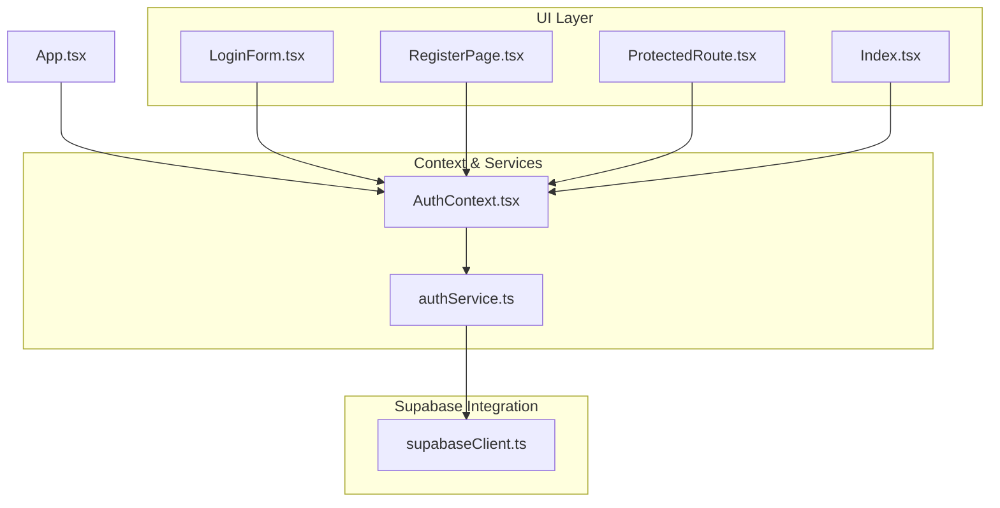
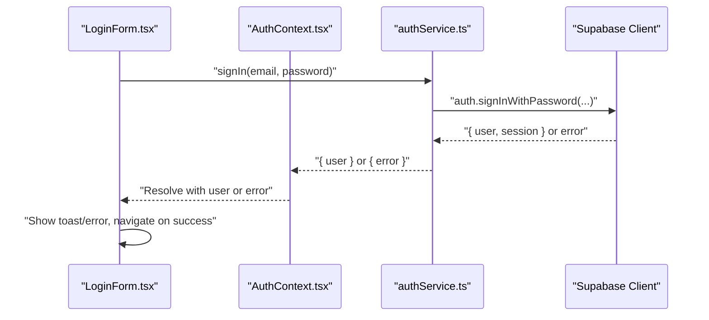
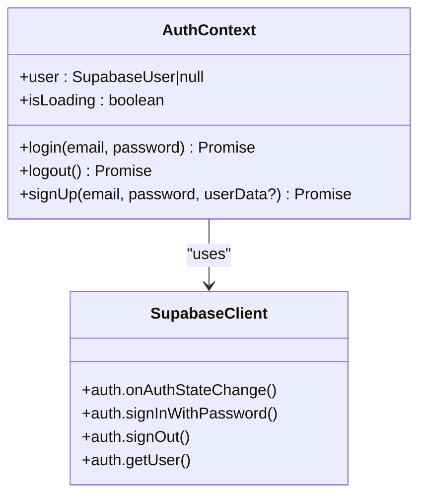
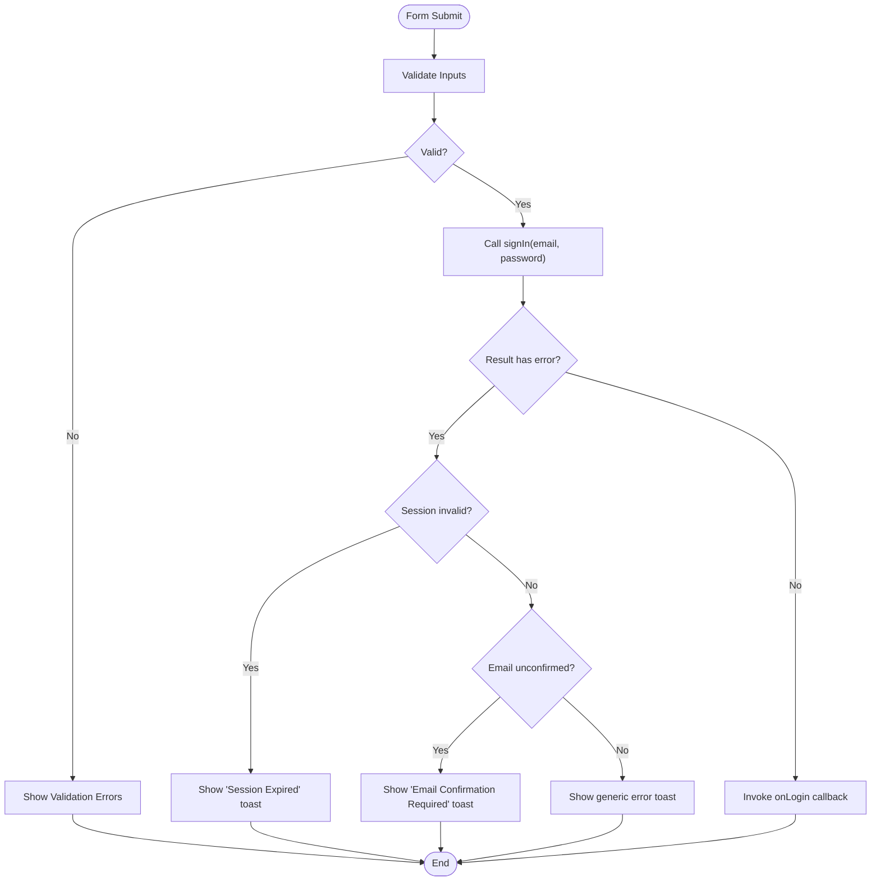
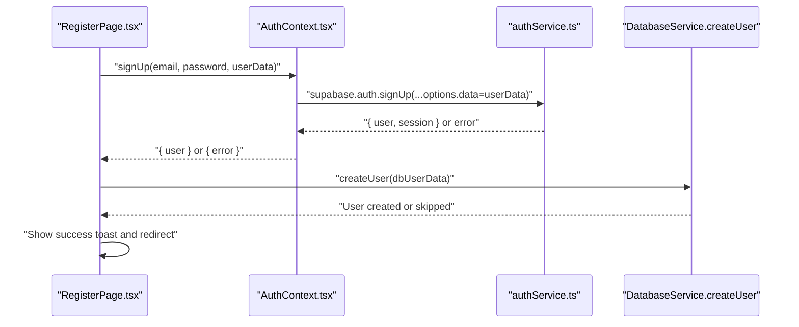
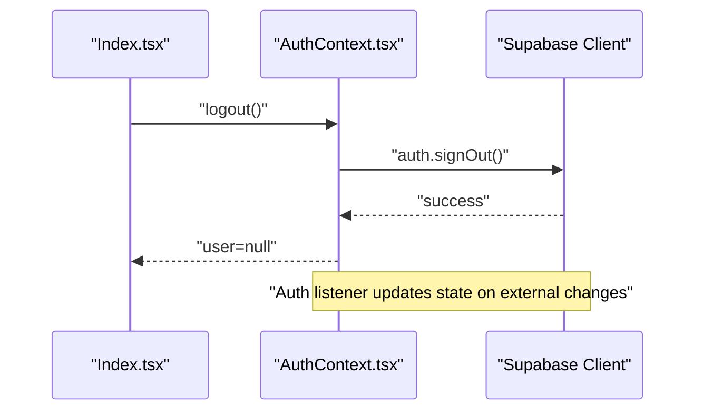
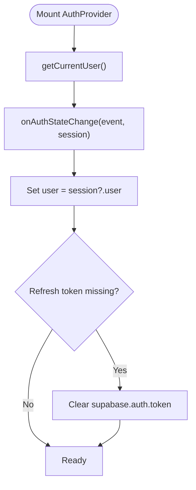
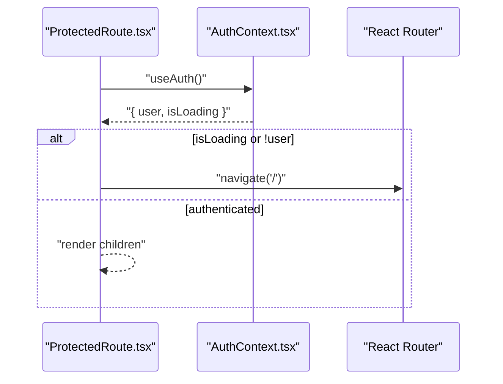
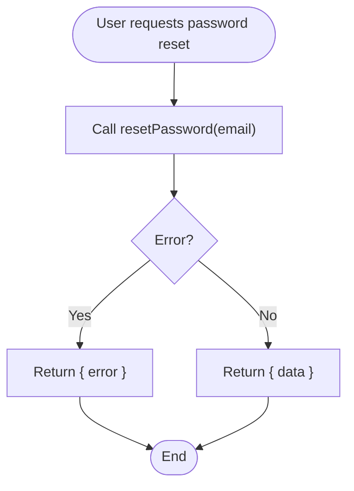
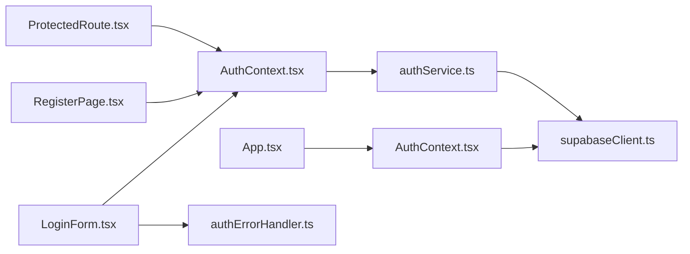

# Authentication Mechanisms

<cite>
**Referenced Files in This Document**
- [AuthContext.tsx](file://src/contexts/AuthContext.tsx)
- [authService.ts](file://src/services/authService.ts)
- [supabaseClient.ts](file://src/lib/supabaseClient.ts)
- [LoginForm.tsx](file://src/components/LoginForm.tsx)
- [RegisterPage.tsx](file://src/pages/RegisterPage.tsx)
- [ProtectedRoute.tsx](file://src/components/ProtectedRoute.tsx)
- [App.tsx](file://src/App.tsx)
- [authErrorHandler.ts](file://src/utils/authErrorHandler.ts)
- [Index.tsx](file://src/pages/Index.tsx)
</cite>

## Table of Contents
1. [Introduction](#introduction)
2. [Project Structure](#project-structure)
3. [Core Components](#core-components)
4. [Architecture Overview](#architecture-overview)
5. [Detailed Component Analysis](#detailed-component-analysis)
6. [Dependency Analysis](#dependency-analysis)
7. [Performance Considerations](#performance-considerations)
8. [Troubleshooting Guide](#troubleshooting-guide)
9. [Conclusion](#conclusion)

## Introduction
This document explains the authentication mechanisms in Royal POS Modern, focusing on Supabase integration, user lifecycle, session management, and UI flows. It covers:
- User registration and sign-up
- Login and logout
- Session persistence and auto-refresh
- Authentication state listener and automatic logout handling
- Protected routes and guards
- Error handling for common scenarios (email confirmation, refresh token issues)
- Practical guidance for implementing authentication guards and protected routes

## Project Structure
Authentication spans three layers:
- Provider and state management: AuthContext
- Service layer: authService wrapping Supabase client
- UI layer: LoginForm, RegisterPage, ProtectedRoute, and route wiring in App/Index

**Diagram sources**
- [App.tsx:75-125](file://src/App.tsx#L75-L125)
- [AuthContext.tsx:16-110](file://src/contexts/AuthContext.tsx#L16-L110)
- [authService.ts:1-127](file://src/services/authService.ts#L1-L127)
- [supabaseClient.ts:20-31](file://src/lib/supabaseClient.ts#L20-L31)
- [LoginForm.tsx:10-114](file://src/components/LoginForm.tsx#L10-L114)
- [RegisterPage.tsx:27-177](file://src/pages/RegisterPage.tsx#L27-L177)
- [ProtectedRoute.tsx:10-29](file://src/components/ProtectedRoute.tsx#L10-L29)
- [Index.tsx:96-341](file://src/pages/Index.tsx#L96-L341)

**Section sources**
- [App.tsx:75-125](file://src/App.tsx#L75-L125)
- [AuthContext.tsx:16-110](file://src/contexts/AuthContext.tsx#L16-L110)
- [authService.ts:1-127](file://src/services/authService.ts#L1-L127)
- [supabaseClient.ts:20-31](file://src/lib/supabaseClient.ts#L20-L31)
- [LoginForm.tsx:10-114](file://src/components/LoginForm.tsx#L10-L114)
- [RegisterPage.tsx:27-177](file://src/pages/RegisterPage.tsx#L27-L177)
- [ProtectedRoute.tsx:10-29](file://src/components/ProtectedRoute.tsx#L10-L29)
- [Index.tsx:96-341](file://src/pages/Index.tsx#L96-L341)

## Core Components
- AuthContext: Provides user state, login, logout, sign-up, and loading state. Subscribes to Supabase auth state changes and persists sessions.
- authService: Thin wrapper around Supabase auth APIs for sign-up, sign-in, sign-out, current user retrieval, role lookup, password reset/update, and auth state listener.
- LoginForm: Validates credentials, calls signIn via authService, displays user-friendly errors, and navigates on success.
- RegisterPage: Collects user metadata, invokes AuthContext.signUp, and creates a local user record.
- ProtectedRoute: Guards routes by checking AuthContext user and isLoading state.
- Supabase client: Configured with auto-refresh, session persistence, and URL session detection.

Key responsibilities:
- Session persistence: Supabase client stores session in localStorage and auto-refreshes tokens.
- Auth listener: AuthContext listens to Supabase auth events and updates user state accordingly.
- Error handling: Centralized via AuthErrorHandler and service-layer wrappers.

**Section sources**
- [AuthContext.tsx:6-118](file://src/contexts/AuthContext.tsx#L6-L118)
- [authService.ts:5-127](file://src/services/authService.ts#L5-L127)
- [supabaseClient.ts:20-31](file://src/lib/supabaseClient.ts#L20-L31)
- [LoginForm.tsx:32-114](file://src/components/LoginForm.tsx#L32-L114)
- [RegisterPage.tsx:29-177](file://src/pages/RegisterPage.tsx#L29-L177)
- [ProtectedRoute.tsx:10-29](file://src/components/ProtectedRoute.tsx#L10-L29)
- [authErrorHandler.ts:8-92](file://src/utils/authErrorHandler.ts#L8-L92)

## Architecture Overview
The authentication flow integrates UI components, context, services, and Supabase. The Supabase client is configured for auto-refresh and persistence. AuthContext initializes session state and subscribes to auth events. Services encapsulate Supabase calls and expose typed functions. UI components consume context and services to drive user actions.

**Diagram sources**
- [LoginForm.tsx:67-104](file://src/components/LoginForm.tsx#L67-L104)
- [authService.ts:26-39](file://src/services/authService.ts#L26-L39)
- [supabaseClient.ts:20-31](file://src/lib/supabaseClient.ts#L20-L31)

**Section sources**
- [LoginForm.tsx:67-104](file://src/components/LoginForm.tsx#L67-L104)
- [authService.ts:26-39](file://src/services/authService.ts#L26-L39)
- [supabaseClient.ts:20-31](file://src/lib/supabaseClient.ts#L20-L31)

## Detailed Component Analysis

### AuthContext Provider Pattern
AuthContext centralizes authentication state and exposes:
- user: current user or null
- login(email, password): Supabase sign-in
- logout(): Supabase sign-out
- signUp(email, password, userData?): Supabase sign-up with metadata
- isLoading: initialization/loading state

Behavior highlights:
- On mount, checks current user and subscribes to Supabase auth state changes.
- Handles refresh token invalidation by clearing session and setting user to null.
- Exposes a hook useAuth() to consume context safely.

**Diagram sources**
- [AuthContext.tsx:6-118](file://src/contexts/AuthContext.tsx#L6-L118)
- [supabaseClient.ts:20-31](file://src/lib/supabaseClient.ts#L20-L31)

**Section sources**
- [AuthContext.tsx:16-110](file://src/contexts/AuthContext.tsx#L16-L110)
- [supabaseClient.ts:20-31](file://src/lib/supabaseClient.ts#L20-L31)

### Login Form Implementation
LoginForm validates inputs, calls signIn via authService, and handles:
- Email confirmation requirement
- Session invalidation (refresh token issues)
- Generic authentication errors
- Navigation callback on success

**Diagram sources**
- [LoginForm.tsx:32-114](file://src/components/LoginForm.tsx#L32-L114)
- [authErrorHandler.ts:62-68](file://src/utils/authErrorHandler.ts#L62-L68)

**Section sources**
- [LoginForm.tsx:32-114](file://src/components/LoginForm.tsx#L32-L114)
- [authErrorHandler.ts:14-38](file://src/utils/authErrorHandler.ts#L14-L38)

### Sign-Up Process
RegisterPage collects user metadata, calls AuthContext.signUp, and:
- Creates a local user record in the database upon success
- Shows success and redirects to login after a delay

**Diagram sources**
- [RegisterPage.tsx:109-177](file://src/pages/RegisterPage.tsx#L109-L177)
- [authService.ts:6-23](file://src/services/authService.ts#L6-L23)

**Section sources**
- [RegisterPage.tsx:109-177](file://src/pages/RegisterPage.tsx#L109-L177)
- [authService.ts:6-23](file://src/services/authService.ts#L6-L23)

### Logout and Session Management
- AuthContext.logout delegates to Supabase sign-out and clears local user state.
- Supabase client is configured with autoRefreshToken and persistSession enabled.
- AuthContext also listens to auth state changes and updates user state reactively.

**Diagram sources**
- [Index.tsx:330-341](file://src/pages/Index.tsx#L330-L341)
- [AuthContext.tsx:78-85](file://src/contexts/AuthContext.tsx#L78-L85)
- [supabaseClient.ts:20-31](file://src/lib/supabaseClient.ts#L20-L31)

**Section sources**
- [Index.tsx:330-341](file://src/pages/Index.tsx#L330-L341)
- [AuthContext.tsx:78-85](file://src/contexts/AuthContext.tsx#L78-L85)
- [supabaseClient.ts:20-31](file://src/lib/supabaseClient.ts#L20-L31)

### Authentication State Change Listener
AuthContext subscribes to Supabase auth state changes and:
- Updates user state on events
- Clears invalid sessions when refresh token is missing
- Sets isLoading to false after initial check

**Diagram sources**
- [AuthContext.tsx:20-54](file://src/contexts/AuthContext.tsx#L20-L54)

**Section sources**
- [AuthContext.tsx:20-54](file://src/contexts/AuthContext.tsx#L20-L54)

### Protected Routes and Guards
ProtectedRoute enforces authentication:
- Uses AuthContext.user and isLoading
- Redirects to login when not authenticated
- Renders a splash while loading

**Diagram sources**
- [ProtectedRoute.tsx:10-29](file://src/components/ProtectedRoute.tsx#L10-L29)

**Section sources**
- [ProtectedRoute.tsx:10-29](file://src/components/ProtectedRoute.tsx#L10-L29)

### Password Reset Functionality
authService exposes resetPassword and updatePassword:
- resetPassword triggers Supabase password reset with a redirect URL
- updatePassword updates the current user’s password

**Diagram sources**
- [authService.ts:84-97](file://src/services/authService.ts#L84-L97)
- [authService.ts:100-112](file://src/services/authService.ts#L100-L112)

**Section sources**
- [authService.ts:84-97](file://src/services/authService.ts#L84-L97)
- [authService.ts:100-112](file://src/services/authService.ts#L100-L112)

## Dependency Analysis
- App.tsx wraps the app with AuthProvider, ensuring all components can access authentication state.
- AuthContext depends on Supabase client configuration for auto-refresh and persistence.
- LoginForm and RegisterPage depend on AuthContext for authentication actions.
- ProtectedRoute depends on AuthContext for guarding routes.
- AuthErrorHandler provides centralized error handling utilities.

**Diagram sources**
- [App.tsx:75-125](file://src/App.tsx#L75-L125)
- [AuthContext.tsx:16-110](file://src/contexts/AuthContext.tsx#L16-L110)
- [supabaseClient.ts:20-31](file://src/lib/supabaseClient.ts#L20-L31)
- [LoginForm.tsx:10-114](file://src/components/LoginForm.tsx#L10-L114)
- [RegisterPage.tsx:27-177](file://src/pages/RegisterPage.tsx#L27-L177)
- [ProtectedRoute.tsx:10-29](file://src/components/ProtectedRoute.tsx#L10-L29)
- [authErrorHandler.ts:8-92](file://src/utils/authErrorHandler.ts#L8-L92)

**Section sources**
- [App.tsx:75-125](file://src/App.tsx#L75-L125)
- [AuthContext.tsx:16-110](file://src/contexts/AuthContext.tsx#L16-L110)
- [supabaseClient.ts:20-31](file://src/lib/supabaseClient.ts#L20-L31)
- [LoginForm.tsx:10-114](file://src/components/LoginForm.tsx#L10-L114)
- [RegisterPage.tsx:27-177](file://src/pages/RegisterPage.tsx#L27-L177)
- [ProtectedRoute.tsx:10-29](file://src/components/ProtectedRoute.tsx#L10-L29)
- [authErrorHandler.ts:8-92](file://src/utils/authErrorHandler.ts#L8-L92)

## Performance Considerations
- Supabase auto-refresh reduces manual refresh overhead; ensure network conditions are stable to avoid frequent refresh attempts.
- Persisted sessions improve UX but require careful error handling for invalid tokens.
- Debounce or throttle repeated login attempts to prevent rate limiting.
- Keep error toast messages concise to avoid UI thrashing during repeated failures.

## Troubleshooting Guide
Common issues and resolutions:
- Email confirmation required: LoginForm detects “Email not confirmed” and prompts the user to check their inbox.
- Session expired or invalid refresh token: AuthErrorHandler identifies invalid sessions and clears stored tokens; AuthContext reacts by setting user to null.
- Generic authentication failure: LoginForm displays a user-friendly message and prevents fallback to mock authentication.
- Multi-device conflicts: Supabase auth state listener updates user state; if a session becomes invalid externally, AuthContext clears local state and logs the user out.

Practical steps:
- Verify environment variables for Supabase URL and anonymous key.
- Confirm auto-refresh and persistence are enabled in the Supabase client configuration.
- Use AuthErrorHandler.isSessionInvalid to detect and handle refresh token issues programmatically.
- Implement ProtectedRoute to guard sensitive routes and redirect unauthenticated users.

**Section sources**
- [LoginForm.tsx:69-100](file://src/components/LoginForm.tsx#L69-L100)
- [authErrorHandler.ts:14-38](file://src/utils/authErrorHandler.ts#L14-L38)
- [AuthContext.tsx:26-37](file://src/contexts/AuthContext.tsx#L26-L37)
- [ProtectedRoute.tsx:14-19](file://src/components/ProtectedRoute.tsx#L14-L19)

## Conclusion
Royal POS Modern’s authentication relies on a clean provider pattern (AuthContext), a thin service layer (authService), and Supabase client configuration for seamless session persistence and auto-refresh. LoginForm and RegisterPage provide robust UI flows with clear error messaging. ProtectedRoute ensures guarded access to authenticated views. Together, these components deliver a reliable, user-friendly authentication experience with strong error handling and session resilience.