# Authentication and User Management

<cite>
**Referenced Files in This Document**
- [AuthContext.tsx](file://src/contexts/AuthContext.tsx)
- [authService.ts](file://src/services/authService.ts)
- [supabaseClient.ts](file://src/lib/supabaseClient.ts)
- [LoginForm.tsx](file://src/components/LoginForm.tsx)
- [ProtectedRoute.tsx](file://src/components/ProtectedRoute.tsx)
- [RegisterPage.tsx](file://src/pages/RegisterPage.tsx)
- [authErrorHandler.ts](file://src/utils/authErrorHandler.ts)
- [outletAccessService.ts](file://src/services/outletAccessService.ts)
- [salesPermissionUtils.ts](file://src/utils/salesPermissionUtils.ts)
- [databaseService.ts](file://src/services/databaseService.ts)
- [AccessLogs.tsx](file://src/pages/AccessLogs.tsx)
- [RESTRICTED_SALES_ACCESS.md](file://RESTRICTED_SALES_ACCESS.md)
- [REMOVE_ALL_RLS.sql](file://REMOVE_ALL_RLS.sql)
- [FIX_RLS_POLICIES.sql](file://FIX_RLS_POLICIES.sql)
</cite>

## Table of Contents
1. [Introduction](#introduction)
2. [Project Structure](#project-structure)
3. [Core Components](#core-components)
4. [Architecture Overview](#architecture-overview)
5. [Detailed Component Analysis](#detailed-component-analysis)
6. [Dependency Analysis](#dependency-analysis)
7. [Performance Considerations](#performance-considerations)
8. [Troubleshooting Guide](#troubleshooting-guide)
9. [Conclusion](#conclusion)
10. [Appendices](#appendices)

## Introduction
This document explains the authentication and user management system for Royal POS Modern, focusing on Supabase integration, session lifecycle, role-based access control (RBAC), and database-level security via Row Level Security (RLS). It covers user registration, login/logout, protected routing, role-based UI and module access, restricted sales access, password reset, user profile management, and access logs. It also provides security best practices, session timeout handling, multi-device session management, and practical examples for implementing authentication guards and role-based UI components.

## Project Structure
The authentication system is organized around a React context provider, Supabase client configuration, service utilities, and UI components. Key areas:
- Context and providers: authentication state and lifecycle
- Services: Supabase wrappers for auth and database operations
- Utilities: error handling and permission checks
- Pages and components: login, registration, protected routes, access logs
- Database and RLS: Supabase policies for sales and related tables

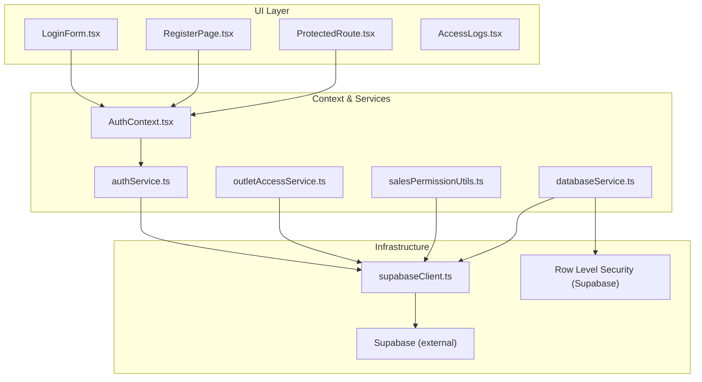

**Diagram sources**
- [AuthContext.tsx:1-118](file://src/contexts/AuthContext.tsx#L1-L118)
- [authService.ts:1-127](file://src/services/authService.ts#L1-L127)
- [supabaseClient.ts:1-33](file://src/lib/supabaseClient.ts#L1-L33)
- [LoginForm.tsx:1-331](file://src/components/LoginForm.tsx#L1-L331)
- [ProtectedRoute.tsx:1-30](file://src/components/ProtectedRoute.tsx#L1-L30)
- [RegisterPage.tsx:1-334](file://src/pages/RegisterPage.tsx#L1-L334)
- [outletAccessService.ts:1-98](file://src/services/outletAccessService.ts#L1-L98)
- [salesPermissionUtils.ts:1-171](file://src/utils/salesPermissionUtils.ts#L1-L171)
- [databaseService.ts:1-800](file://src/services/databaseService.ts#L1-L800)
- [AccessLogs.tsx:1-334](file://src/pages/AccessLogs.tsx#L1-L334)

**Section sources**
- [AuthContext.tsx:1-118](file://src/contexts/AuthContext.tsx#L1-L118)
- [supabaseClient.ts:1-33](file://src/lib/supabaseClient.ts#L1-L33)

## Core Components
- Authentication Context Provider: centralizes user state, login/logout/sign-up, and auth state subscription.
- Supabase Client: configured with auto-refresh, persisted sessions, and URL detection.
- Auth Services: wrappers for Supabase auth operations, password reset/update, and current user retrieval.
- UI Components: login form, registration page, protected route guard.
- Permission Utilities: role-based module access and sales creation permissions.
- Outlet Access Service: per-user outlet assignment and access checks.
- Access Logs Page: displays user activity logs.

**Section sources**
- [AuthContext.tsx:6-118](file://src/contexts/AuthContext.tsx#L6-L118)
- [authService.ts:54-127](file://src/services/authService.ts#L54-L127)
- [supabaseClient.ts:20-31](file://src/lib/supabaseClient.ts#L20-L31)
- [LoginForm.tsx:18-126](file://src/components/LoginForm.tsx#L18-L126)
- [RegisterPage.tsx:15-177](file://src/pages/RegisterPage.tsx#L15-L177)
- [ProtectedRoute.tsx:10-30](file://src/components/ProtectedRoute.tsx#L10-L30)
- [salesPermissionUtils.ts:8-86](file://src/utils/salesPermissionUtils.ts#L8-L86)
- [outletAccessService.ts:22-97](file://src/services/outletAccessService.ts#L22-L97)
- [AccessLogs.tsx:25-334](file://src/pages/AccessLogs.tsx#L25-L334)

## Architecture Overview
The system uses Supabase for authentication and session management, with a React context provider to expose user state across the app. UI components trigger auth actions via service functions, while database operations leverage Supabase client configuration and optional RLS policies.

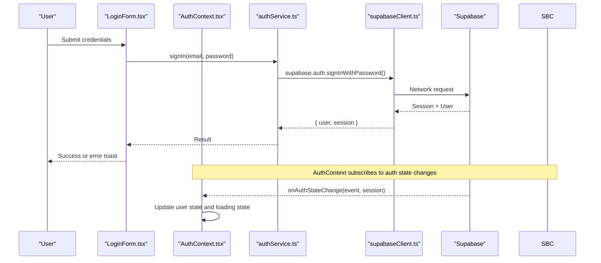

**Diagram sources**
- [LoginForm.tsx:56-114](file://src/components/LoginForm.tsx#L56-L114)
- [authService.ts:26-39](file://src/services/authService.ts#L26-L39)
- [supabaseClient.ts:20-31](file://src/lib/supabaseClient.ts#L20-L31)
- [AuthContext.tsx:43-49](file://src/contexts/AuthContext.tsx#L43-L49)

## Detailed Component Analysis

### Authentication Context Provider
The provider initializes session state, listens for auth changes, and exposes login, logout, and sign-up functions. It handles refresh token errors by clearing invalid sessions and local storage entries.

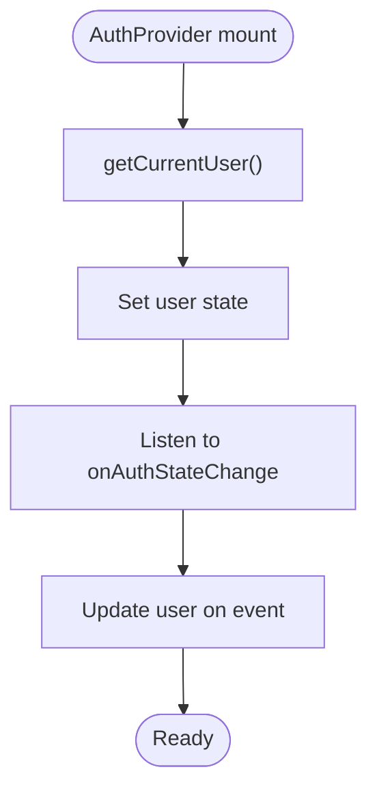

**Diagram sources**
- [AuthContext.tsx:20-54](file://src/contexts/AuthContext.tsx#L20-L54)

**Section sources**
- [AuthContext.tsx:16-118](file://src/contexts/AuthContext.tsx#L16-L118)

### Supabase Client Configuration
Configures auto-refresh, persisted sessions, URL detection, and implicit flow. Validates environment variables and logs client creation.

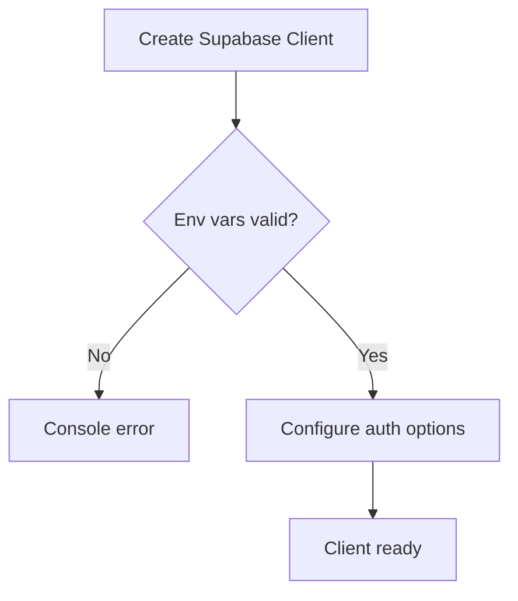

**Diagram sources**
- [supabaseClient.ts:10-31](file://src/lib/supabaseClient.ts#L10-L31)

**Section sources**
- [supabaseClient.ts:1-33](file://src/lib/supabaseClient.ts#L1-L33)

### Login and Registration Workflows
- Login: form validates inputs, calls service, handles refresh token and email confirmation errors, shows toasts, and triggers parent callback.
- Registration: validates form, signs up via Supabase, creates user record in database with default role, and navigates to login.

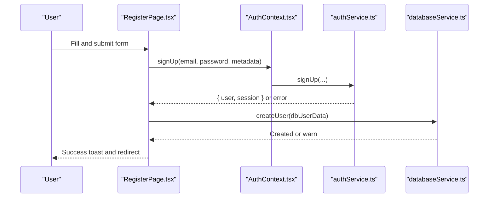

**Diagram sources**
- [RegisterPage.tsx:97-177](file://src/pages/RegisterPage.tsx#L97-L177)
- [authService.ts:6-23](file://src/services/authService.ts#L6-L23)
- [databaseService.ts:447-461](file://src/services/databaseService.ts#L447-L461)

**Section sources**
- [LoginForm.tsx:56-114](file://src/components/LoginForm.tsx#L56-L114)
- [RegisterPage.tsx:97-177](file://src/pages/RegisterPage.tsx#L97-L177)

### Protected Routes and Guards
ProtectedRoute checks authentication state and either renders children or redirects to login. It uses splash screen while loading.

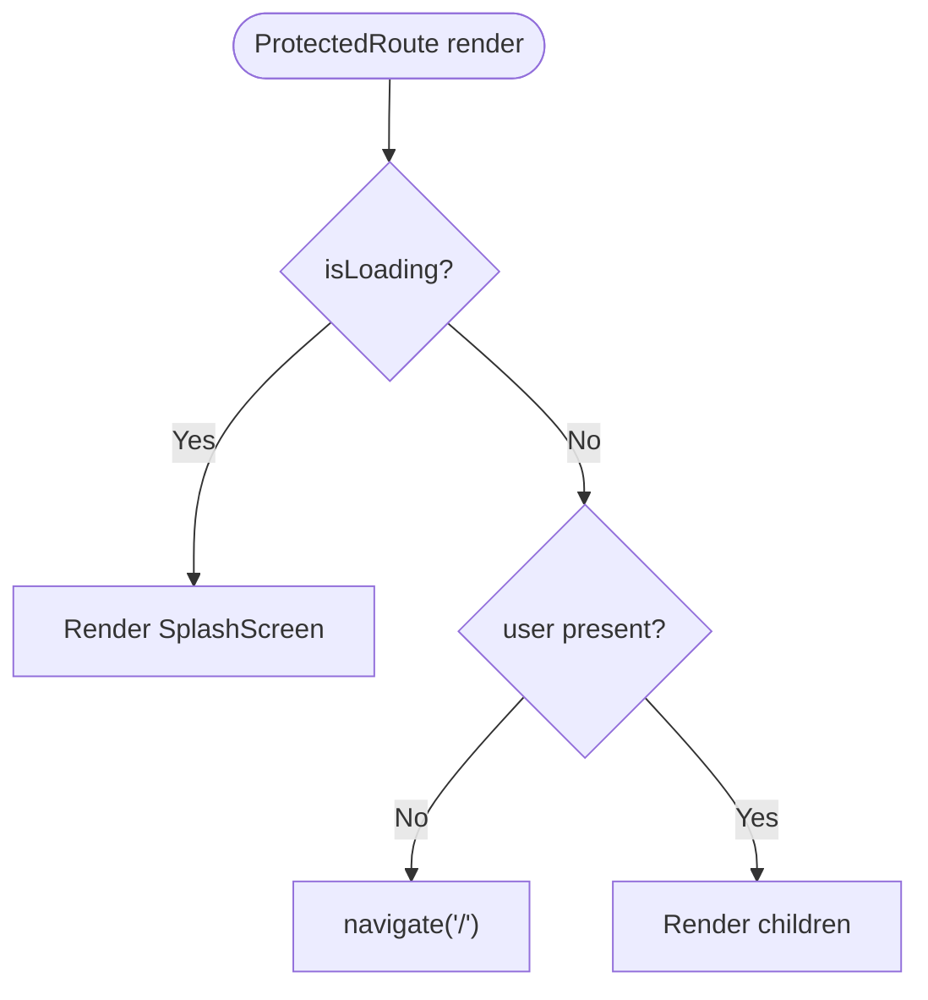

**Diagram sources**
- [ProtectedRoute.tsx:10-30](file://src/components/ProtectedRoute.tsx#L10-L30)

**Section sources**
- [ProtectedRoute.tsx:1-30](file://src/components/ProtectedRoute.tsx#L1-L30)

### Role-Based Access Control (RBAC)
- Role retrieval: service fetches current user and role from user metadata or database.
- Module access: utility defines module permissions per role and checks access.
- Sales permissions: simplified check allows any authenticated user to create sales (after removing restrictive RLS).

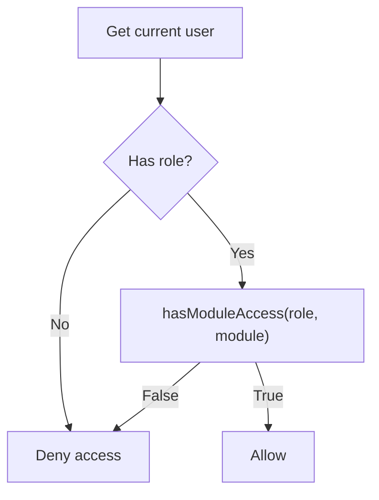

**Diagram sources**
- [salesPermissionUtils.ts:26-86](file://src/utils/salesPermissionUtils.ts#L26-L86)
- [salesPermissionUtils.ts:94-171](file://src/utils/salesPermissionUtils.ts#L94-L171)

**Section sources**
- [salesPermissionUtils.ts:26-86](file://src/utils/salesPermissionUtils.ts#L26-L86)
- [salesPermissionUtils.ts:94-171](file://src/utils/salesPermissionUtils.ts#L94-L171)

### Restricted Sales Access and RLS
- RLS policies restrict sales operations to specific roles and active users.
- Application ensures sales are associated with the authenticated user.
- Utility functions support permission checks and role-based UI.

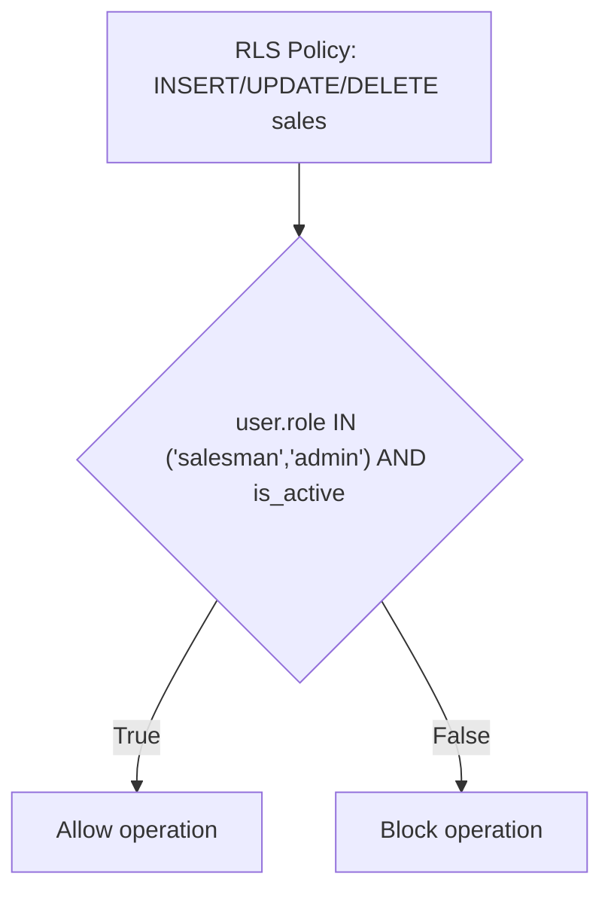

**Diagram sources**
- [RESTRICTED_SALES_ACCESS.md:17-103](file://RESTRICTED_SALES_ACCESS.md#L17-L103)

**Section sources**
- [RESTRICTED_SALES_ACCESS.md:11-171](file://RESTRICTED_SALES_ACCESS.md#L11-L171)
- [databaseService.ts:117-148](file://src/services/databaseService.ts#L117-L148)

### Outlet Assignment and Multi-Device Sessions
- Outlet access service retrieves user’s assigned outlet and checks access.
- Supabase client persists sessions across browser reloads and supports auto-refresh.

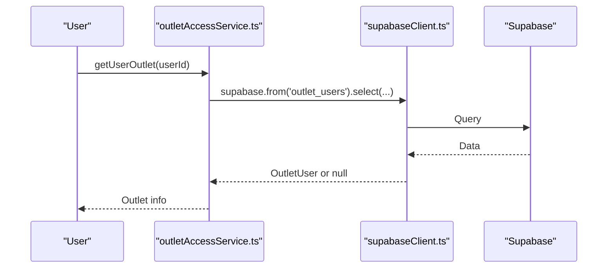

**Diagram sources**
- [outletAccessService.ts:22-70](file://src/services/outletAccessService.ts#L22-L70)
- [supabaseClient.ts:20-31](file://src/lib/supabaseClient.ts#L20-L31)

**Section sources**
- [outletAccessService.ts:22-97](file://src/services/outletAccessService.ts#L22-L97)
- [supabaseClient.ts:20-31](file://src/lib/supabaseClient.ts#L20-L31)

### Password Reset and Profile Management
- Password reset: service sends reset email with redirect URL.
- Profile updates: service supports updating email and password via Supabase.

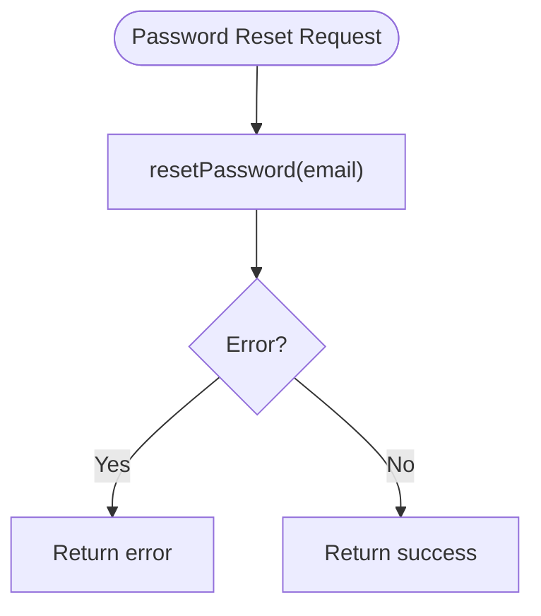

**Diagram sources**
- [authService.ts:84-97](file://src/services/authService.ts#L84-L97)

**Section sources**
- [authService.ts:84-127](file://src/services/authService.ts#L84-L127)

### Access Logs
- Access logs page displays user activity with filters and summaries.
- Logs include action, module, timestamp, IP, user agent, and status.

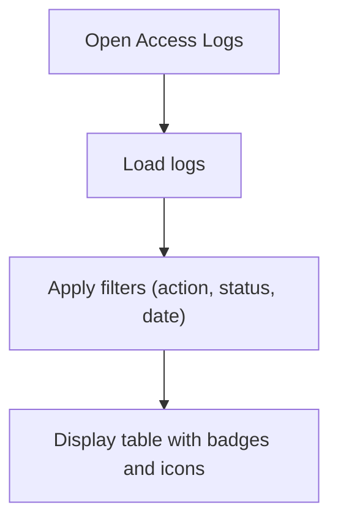

**Diagram sources**
- [AccessLogs.tsx:25-334](file://src/pages/AccessLogs.tsx#L25-L334)

**Section sources**
- [AccessLogs.tsx:25-334](file://src/pages/AccessLogs.tsx#L25-L334)

## Dependency Analysis
Key dependencies and relationships:
- AuthContext depends on Supabase client and auth service.
- LoginForm and RegisterPage depend on AuthContext and auth service.
- ProtectedRoute depends on AuthContext.
- SalesPermissionUtils and OutletAccessService depend on Supabase client.
- DatabaseService encapsulates CRUD operations and interacts with Supabase and RLS.

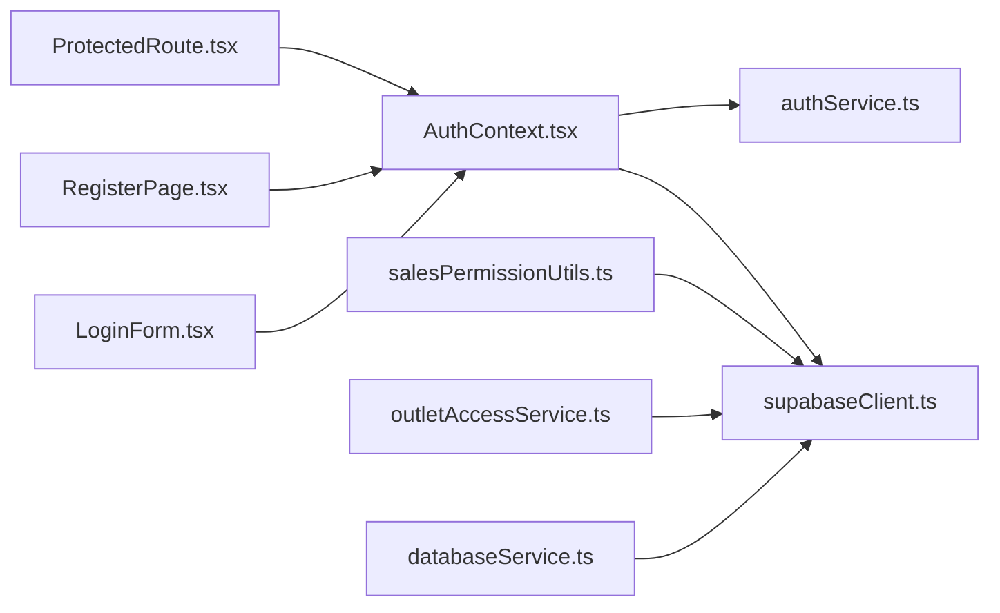

**Diagram sources**
- [AuthContext.tsx:1-118](file://src/contexts/AuthContext.tsx#L1-L118)
- [supabaseClient.ts:1-33](file://src/lib/supabaseClient.ts#L1-L33)
- [authService.ts:1-127](file://src/services/authService.ts#L1-L127)
- [LoginForm.tsx:1-331](file://src/components/LoginForm.tsx#L1-L331)
- [RegisterPage.tsx:1-334](file://src/pages/RegisterPage.tsx#L1-L334)
- [ProtectedRoute.tsx:1-30](file://src/components/ProtectedRoute.tsx#L1-L30)
- [salesPermissionUtils.ts:1-171](file://src/utils/salesPermissionUtils.ts#L1-L171)
- [outletAccessService.ts:1-98](file://src/services/outletAccessService.ts#L1-L98)
- [databaseService.ts:1-800](file://src/services/databaseService.ts#L1-L800)

**Section sources**
- [AuthContext.tsx:1-118](file://src/contexts/AuthContext.tsx#L1-L118)
- [supabaseClient.ts:1-33](file://src/lib/supabaseClient.ts#L1-L33)
- [authService.ts:1-127](file://src/services/authService.ts#L1-L127)
- [salesPermissionUtils.ts:1-171](file://src/utils/salesPermissionUtils.ts#L1-L171)
- [outletAccessService.ts:1-98](file://src/services/outletAccessService.ts#L1-L98)
- [databaseService.ts:1-800](file://src/services/databaseService.ts#L1-L800)

## Performance Considerations
- Minimize repeated auth queries by leveraging the context provider’s cached user state.
- Use Supabase’s auto-refresh to avoid frequent re-authentication.
- Debounce or batch UI updates when reacting to auth state changes.
- Keep RLS policies efficient; avoid overly complex conditions on large datasets.

## Troubleshooting Guide
Common issues and resolutions:
- Refresh token errors: clear invalid session and local storage entries; trigger manual refresh if needed.
- Email confirmation required: prompt user to confirm email before login.
- Invalid credentials: show user-friendly messages and prevent retries until corrected.
- RLS blocking operations: verify user role and active status; ensure policies are applied correctly.

Practical debugging steps:
- Inspect Supabase client initialization and environment variables.
- Monitor auth state changes and console logs for error messages.
- Validate RLS policies using provided SQL scripts and test helpers.

**Section sources**
- [authErrorHandler.ts:14-92](file://src/utils/authErrorHandler.ts#L14-L92)
- [AuthContext.tsx:26-38](file://src/contexts/AuthContext.tsx#L26-L38)
- [LoginForm.tsx:69-114](file://src/components/LoginForm.tsx#L69-L114)
- [databaseService.ts:843-891](file://src/services/databaseService.ts#L843-L891)

## Conclusion
Royal POS Modern integrates Supabase for robust authentication and session management, with a React context provider ensuring consistent user state across the app. RBAC is enforced both at the application level and via Supabase RLS policies for sales operations. The system supports password reset, profile management, protected routes, and access logs. Following the outlined best practices and troubleshooting steps will help maintain secure, reliable, and scalable authentication and user management.

## Appendices

### Security Best Practices
- Enforce HTTPS and secure cookies in Supabase.
- Use strong password policies and enforce MFA where possible.
- Regularly review and audit RLS policies.
- Implement rate limiting for authentication endpoints.
- Rotate secrets and monitor failed login attempts.

### Session Timeout and Multi-Device Management
- Supabase auto-refresh handles token renewal; ensure persistent sessions are enabled.
- On logout, clear local storage and invalidate sessions server-side.
- Consider device-specific session tracking and forced re-auth for sensitive operations.

### Practical Examples
- Authentication Guard: wrap routes with ProtectedRoute to block unauthenticated users.
- Role-Based UI: use hasModuleAccess(role, module) to conditionally render menu items and features.
- Sales Permissions: use canCreateSales() to enable/disable sales creation UI.