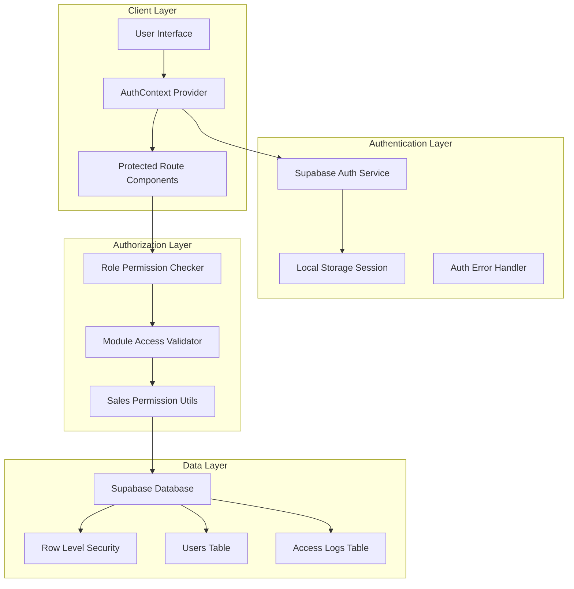
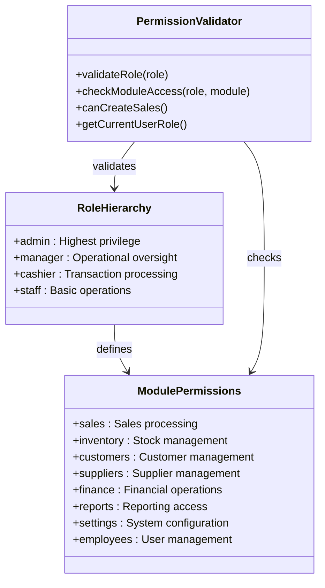
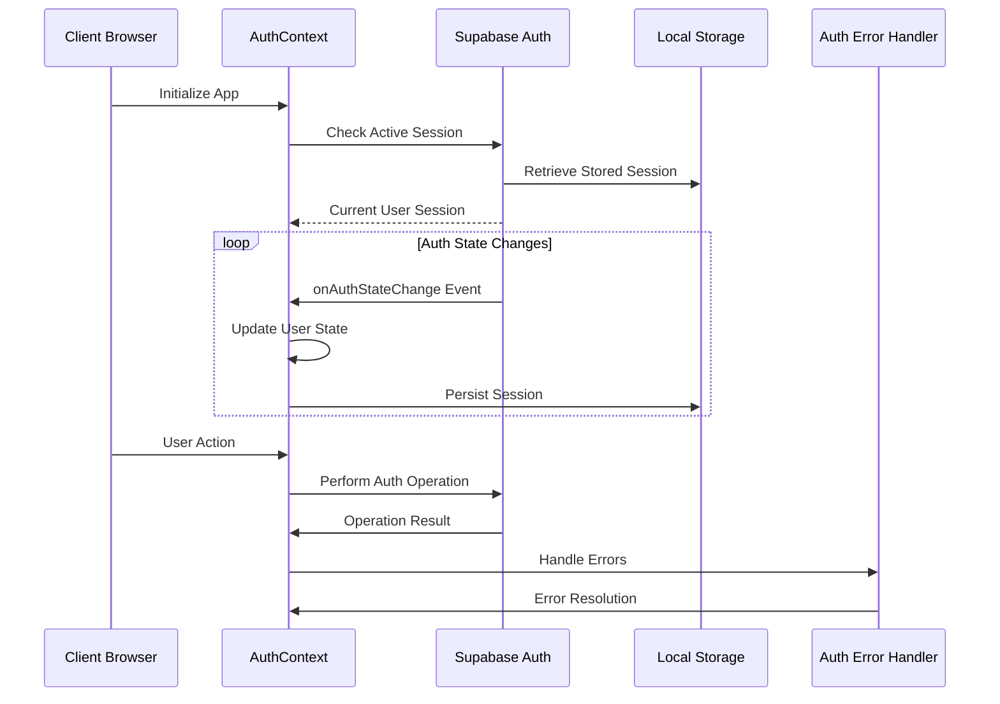
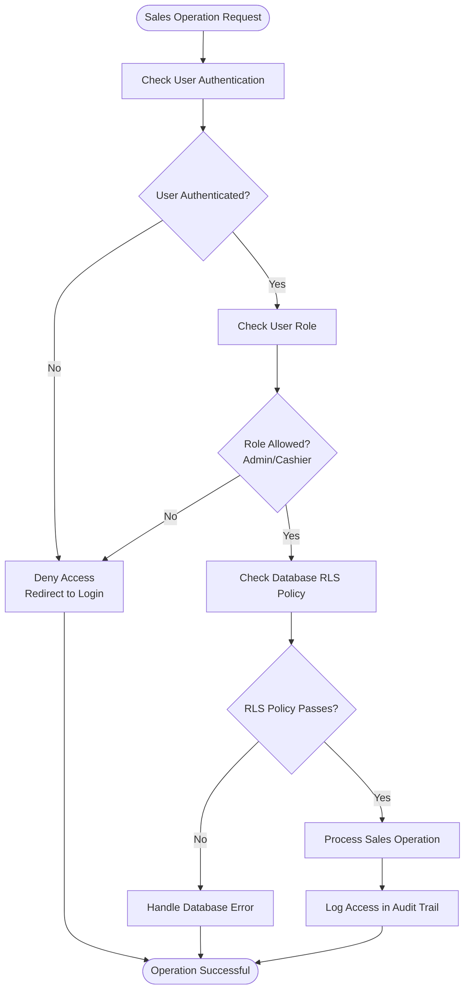
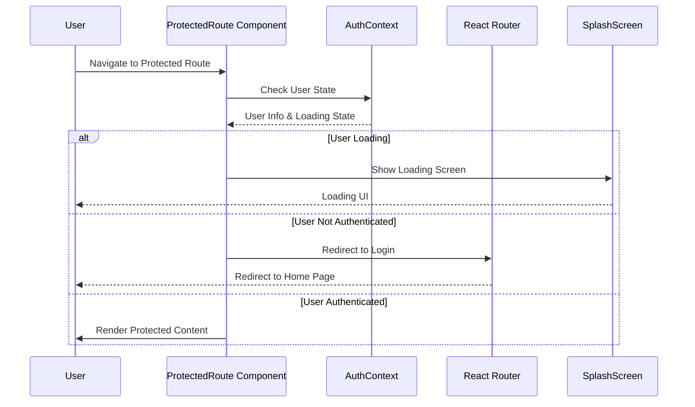
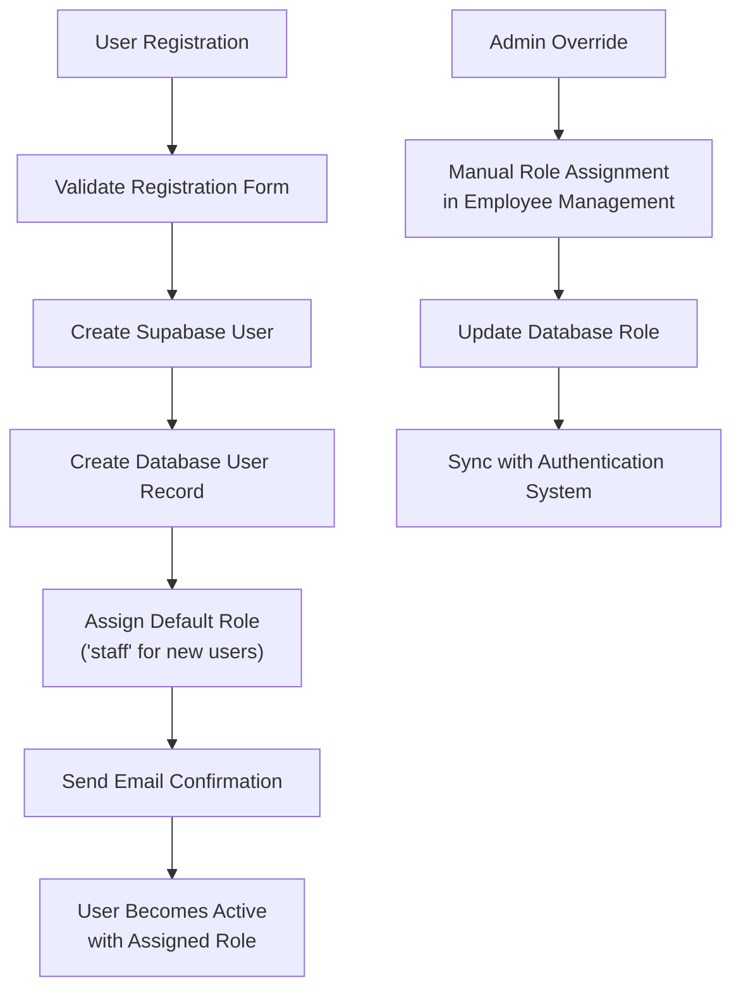
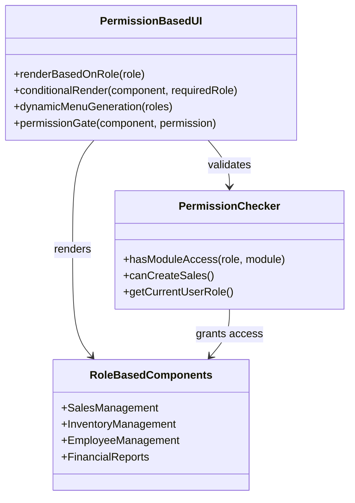
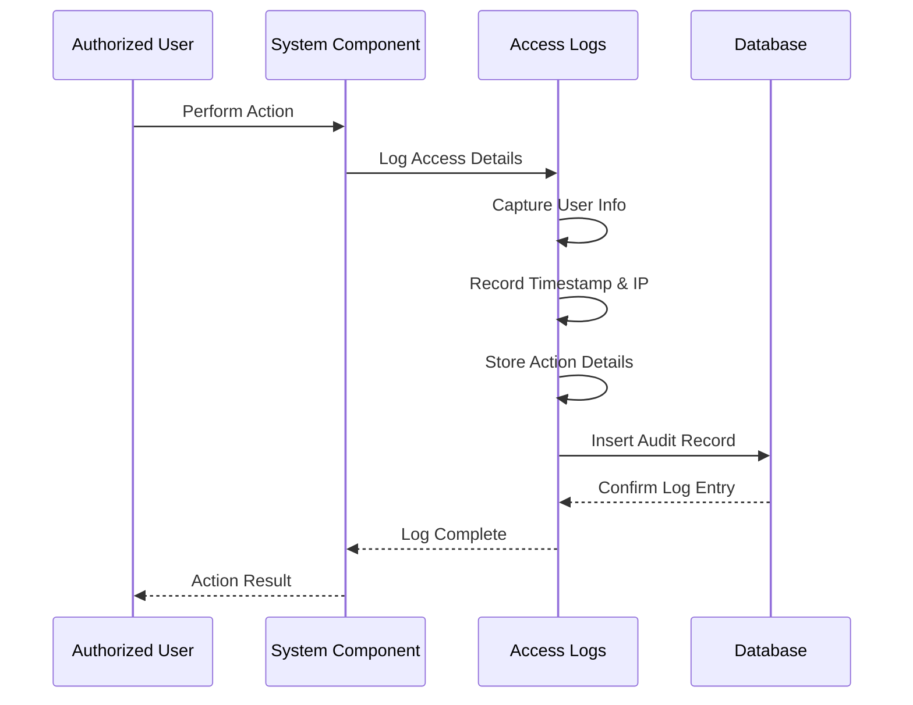
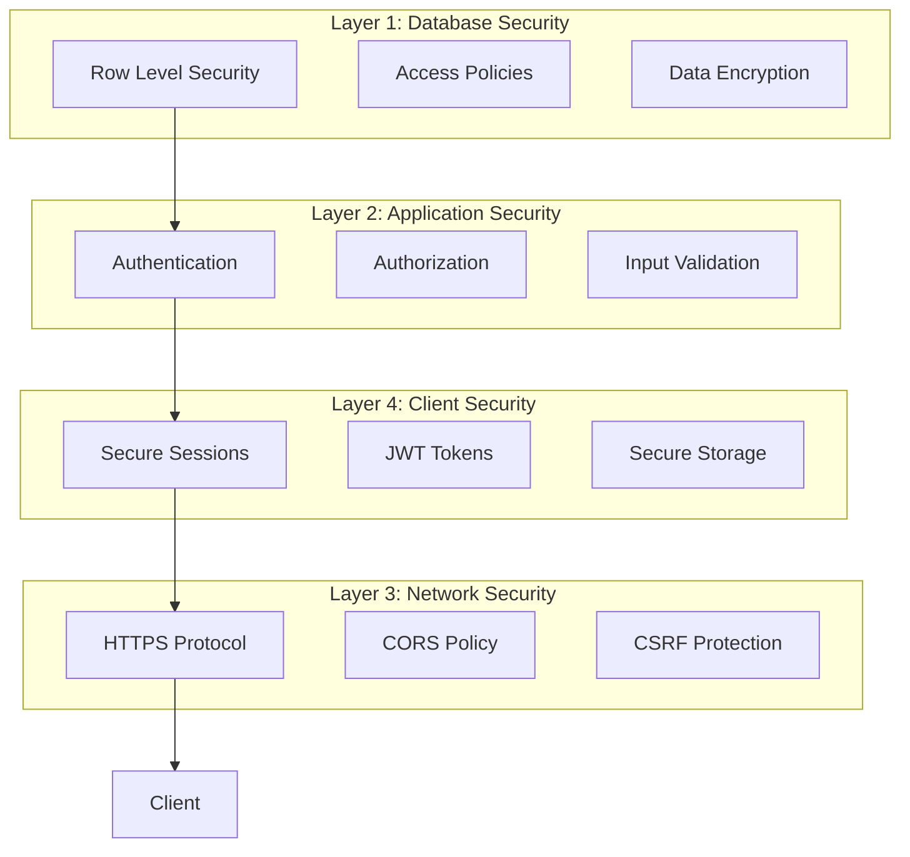
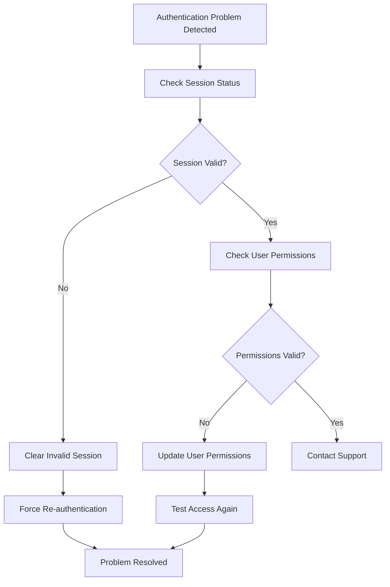

# Role-Based Access Control (RBAC) System

<cite>
**Referenced Files in This Document**
- [AuthContext.tsx](file://src/contexts/AuthContext.tsx)
- [authService.ts](file://src/services/authService.ts)
- [salesPermissionUtils.ts](file://src/utils/salesPermissionUtils.ts)
- [ProtectedRoute.tsx](file://src/components/ProtectedRoute.tsx)
- [EmployeeManagement.tsx](file://src/pages/EmployeeManagement.tsx)
- [supabaseClient.ts](file://src/lib/supabaseClient.ts)
- [authErrorHandler.ts](file://src/utils/authErrorHandler.ts)
- [RegisterPage.tsx](file://src/pages/RegisterPage.tsx)
- [databaseService.ts](file://src/services/databaseService.ts)
- [AccessLogs.tsx](file://src/pages/AccessLogs.tsx)
- [RESTRICTED_SALES_ACCESS.md](file://RESTRICTED_SALES_ACCESS.md)
- [SALES_PERMISSION_IMPLEMENTATION.md](file://SALES_PERMISSION_IMPLEMENTATION.md)
</cite>

## Table of Contents
1. [Introduction](#introduction)
2. [System Architecture](#system-architecture)
3. [Role Structure and Permissions](#role-structure-and-permissions)
4. [Authentication and Session Management](#authentication-and-session-management)
5. [Sales Permission System](#sales-permission-system)
6. [Protected Routes Implementation](#protected-routes-implementation)
7. [Role Assignment and Management](#role-assignment-and-management)
8. [Sales Restriction Policies](#sales-restriction-policies)
9. [UI Implementation Patterns](#ui-implementation-patterns)
10. [Audit Trail and Monitoring](#audit-trail-and-monitoring)
11. [Security Considerations](#security-considerations)
12. [Troubleshooting Guide](#troubleshooting-guide)

## Introduction

Royal POS Modern implements a comprehensive Role-Based Access Control (RBAC) system that provides granular security controls across all system modules. The system supports four primary user roles: Administrator, Manager, Cashier/Salesman, and Staff, each with distinct permissions and capabilities.

The RBAC system combines database-level Row Level Security (RLS) policies with application-level authorization checks to ensure robust security enforcement. This dual-layer approach provides both operational efficiency and strong security guarantees.

## System Architecture

The RBAC system follows a multi-tiered architecture that separates concerns between authentication, authorization, and resource access control:

**Diagram sources**
- [AuthContext.tsx:16-110](file://src/contexts/AuthContext.tsx#L16-L110)
- [supabaseClient.ts:20-31](file://src/lib/supabaseClient.ts#L20-L31)
- [salesPermissionUtils.ts:94-171](file://src/utils/salesPermissionUtils.ts#L94-L171)

## Role Structure and Permissions

### Hierarchical Role Design

The system implements a clear role hierarchy with increasing permissions:

| Role | Level | Primary Responsibilities | Allowed Modules |
|------|-------|-------------------------|-----------------|
| **Administrator** | 1 | Full system control, user management, system configuration | All modules |
| **Manager** | 2 | Operational oversight, sales management, staff supervision | All modules except user management |
| **Cashier/Salesman** | 3 | Sales processing, customer transactions | Sales, customers, products, transactions |
| **Staff** | 4 | Limited operational support | Inventory, customers, products |

### Permission Matrix

Each role has predefined access permissions across system modules:

**Diagram sources**
- [salesPermissionUtils.ts:94-171](file://src/utils/salesPermissionUtils.ts#L94-L171)

**Section sources**
- [salesPermissionUtils.ts:94-171](file://src/utils/salesPermissionUtils.ts#L94-L171)

## Authentication and Session Management

### Session Lifecycle Management

The authentication system manages user sessions through Supabase's built-in authentication service with automatic session refresh capabilities:

**Diagram sources**
- [AuthContext.tsx:20-54](file://src/contexts/AuthContext.tsx#L20-L54)
- [authErrorHandler.ts:14-38](file://src/utils/authErrorHandler.ts#L14-L38)

### Session Persistence and Security

The system implements secure session management with automatic refresh and error handling:

- **Automatic Session Refresh**: Configured through Supabase client settings
- **Local Storage Persistence**: Secure session storage with proper cleanup
- **Error Recovery**: Automatic session cleanup for invalid refresh tokens
- **Real-time Updates**: Auth state monitoring with immediate UI updates

**Section sources**
- [supabaseClient.ts:20-31](file://src/lib/supabaseClient.ts#L20-L31)
- [AuthContext.tsx:20-54](file://src/contexts/AuthContext.tsx#L20-L54)
- [authErrorHandler.ts:43-56](file://src/utils/authErrorHandler.ts#L43-L56)

## Sales Permission System

### Sales Authorization Logic

The sales permission system provides granular control over sales operations through a combination of database policies and application-level checks:

**Diagram sources**
- [salesPermissionUtils.ts:8-20](file://src/utils/salesPermissionUtils.ts#L8-L20)
- [SALES_PERMISSION_IMPLEMENTATION.md:24-34](file://SALES_PERMISSION_IMPLEMENTATION.md#L24-L34)

### Database-Level Security Enforcement

The system enforces sales restrictions through Supabase's Row Level Security policies:

- **Sales Table Policies**: Restrict create/update/delete operations to authorized roles
- **Sales Items Table Policies**: Enforce same restrictions for sale items
- **User Validation**: Ensure only active users can perform sales operations
- **Role-Based Access**: Allow 'admin' and 'cashier' roles for sales operations

**Section sources**
- [RESTRICTED_SALES_ACCESS.md:18-103](file://RESTRICTED_SALES_ACCESS.md#L18-L103)
- [SALES_PERMISSION_IMPLEMENTATION.md:14-34](file://SALES_PERMISSION_IMPLEMENTATION.md#L14-L34)

## Protected Routes Implementation

### Route Protection Mechanism

The protected routes system ensures that unauthorized users cannot access restricted areas of the application:

**Diagram sources**
- [ProtectedRoute.tsx:10-29](file://src/components/ProtectedRoute.tsx#L10-L29)

### Route Protection Strategy

The system implements comprehensive route protection through:

- **Authentication Gates**: Prevent access to unauthenticated users
- **Loading States**: Graceful handling of authentication state transitions
- **Immediate Redirection**: Automatic redirect to login for unauthorized access
- **Content Rendering**: Conditional rendering based on user authorization

**Section sources**
- [ProtectedRoute.tsx:10-29](file://src/components/ProtectedRoute.tsx#L10-L29)

## Role Assignment and Management

### User Registration and Role Assignment

The system provides flexible user registration with role assignment capabilities:

**Diagram sources**
- [RegisterPage.tsx:132-151](file://src/pages/RegisterPage.tsx#L132-L151)
- [EmployeeManagement.tsx:184-250](file://src/pages/EmployeeManagement.tsx#L184-L250)

### Administrative Role Management

Administrators can manage user roles through the Employee Management interface:

- **Role Assignment**: Assign roles during user creation
- **Role Updates**: Modify user roles through admin interface
- **Status Management**: Activate/deactivate user accounts
- **Permission Validation**: Real-time permission checking

**Section sources**
- [RegisterPage.tsx:132-151](file://src/pages/RegisterPage.tsx#L132-L151)
- [EmployeeManagement.tsx:184-250](file://src/pages/EmployeeManagement.tsx#L184-L250)

## Sales Restriction Policies

### Database Security Implementation

The system implements comprehensive sales restriction policies through Supabase's Row Level Security:

| Policy | Purpose | Allowed Roles | Restrictions |
|--------|---------|---------------|--------------|
| `Enable read access for all users` | View sales data | All roles | Full read access |
| `Enable insert access for salesmen only` | Create sales | 'cashier', 'admin' | User association validation |
| `Enable update access for salesmen only` | Modify sales | 'cashier', 'admin' | Ownership verification |
| `Enable delete access for salesmen only` | Delete sales | 'cashier', 'admin' | Active user requirement |

### Application-Level Enforcement

The application complements database security with runtime permission checks:

- **Pre-Operation Validation**: Verify user permissions before sales operations
- **Real-time Access Control**: Dynamic permission checking for UI elements
- **Error Handling**: Graceful handling of permission violations
- **Audit Logging**: Comprehensive tracking of sales operations

**Section sources**
- [RESTRICTED_SALES_ACCESS.md:18-103](file://RESTRICTED_SALES_ACCESS.md#L18-L103)
- [salesPermissionUtils.ts:8-20](file://src/utils/salesPermissionUtils.ts#L8-L20)

## UI Implementation Patterns

### Conditional UI Rendering

The system implements dynamic UI rendering based on user permissions:

**Diagram sources**
- [salesPermissionUtils.ts:94-171](file://src/utils/salesPermissionUtils.ts#L94-L171)
- [EmployeeManagement.tsx:76-90](file://src/pages/EmployeeManagement.tsx#L76-L90)

### Dynamic Menu Generation

The system generates menus dynamically based on user roles:

- **Role-Specific Menus**: Different menu items for different roles
- **Conditional Visibility**: Hide/show menu items based on permissions
- **Module Access Validation**: Ensure users can only access permitted modules
- **Real-time Updates**: Menu updates when user roles change

**Section sources**
- [salesPermissionUtils.ts:94-171](file://src/utils/salesPermissionUtils.ts#L94-L171)
- [EmployeeManagement.tsx:76-90](file://src/pages/EmployeeManagement.tsx#L76-L90)

## Audit Trail and Monitoring

### Access Logging Implementation

The system maintains comprehensive audit trails for all user activities:

**Diagram sources**
- [AccessLogs.tsx:25-85](file://src/pages/AccessLogs.tsx#L25-L85)

### Audit Trail Features

The audit system provides comprehensive monitoring capabilities:

- **Activity Tracking**: Complete record of user actions
- **Access Monitoring**: Login/logout and module access tracking
- **Error Logging**: Failed access attempts and system errors
- **Export Capabilities**: CSV/PDF export of audit logs
- **Filtering & Search**: Advanced filtering by user, action, module, date

**Section sources**
- [AccessLogs.tsx:25-85](file://src/pages/AccessLogs.tsx#L25-L85)

## Security Considerations

### Multi-Layered Security Approach

The RBAC system implements comprehensive security measures:

### Security Best Practices

The system follows industry security best practices:

- **Defense in Depth**: Multiple security layers working together
- **Principle of Least Privilege**: Users have minimal necessary permissions
- **Audit Logging**: Comprehensive tracking of all security-relevant events
- **Error Handling**: Secure error handling without information leakage
- **Session Management**: Secure session handling and automatic cleanup

## Troubleshooting Guide

### Common Authentication Issues

| Issue | Symptoms | Solution |
|-------|----------|----------|
| **Session Expired** | Redirect to login, error messages | Clear invalid session, automatic refresh |
| **Permission Denied** | Access blocked to modules | Verify user role, check module permissions |
| **Sales Operation Failed** | Cannot create sales | Check role restrictions, verify active status |
| **Email Confirmation Issues** | Registration requires confirmation | Check email settings, resend confirmation |

### Debugging Authentication Problems

### Support Resources

- **Authentication Error Handler**: Built-in error handling and recovery
- **Session Management**: Automatic session refresh and cleanup
- **Permission Validation**: Real-time permission checking
- **Audit Logs**: Comprehensive activity tracking for troubleshooting

**Section sources**
- [authErrorHandler.ts:14-38](file://src/utils/authErrorHandler.ts#L14-L38)
- [AuthContext.tsx:26-35](file://src/contexts/AuthContext.tsx#L26-L35)