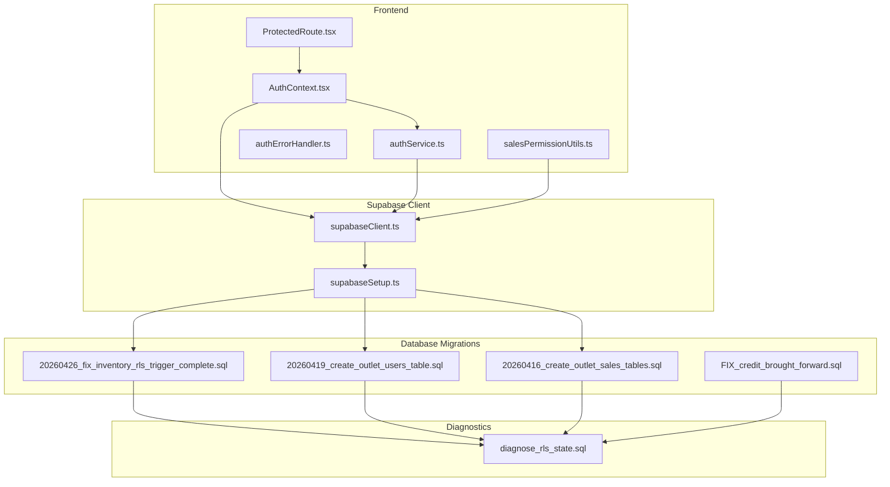
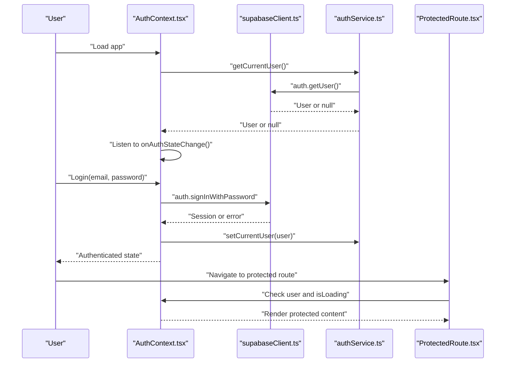
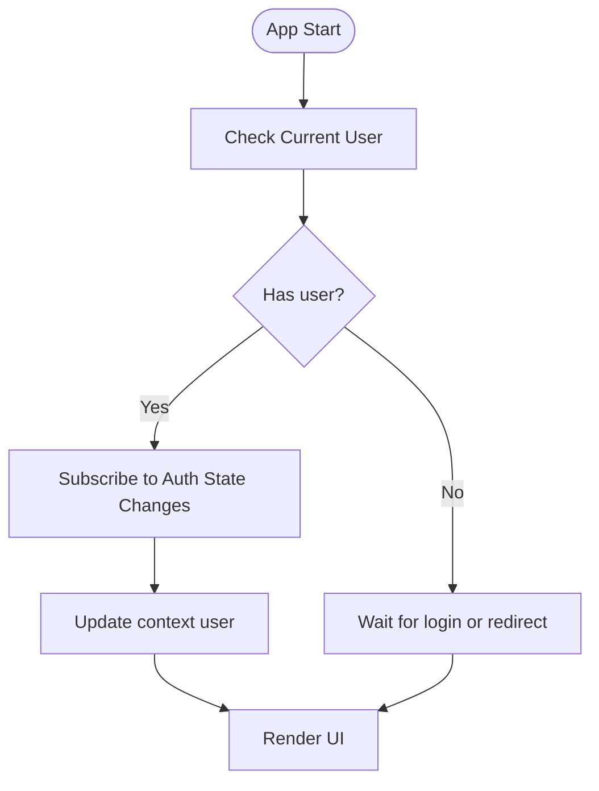
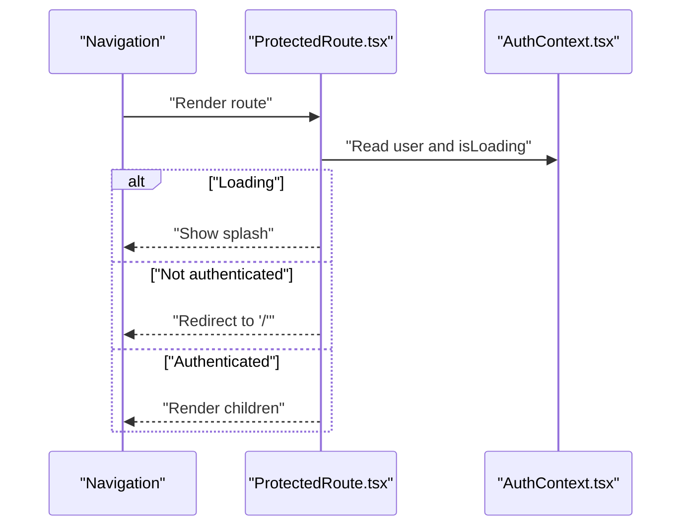
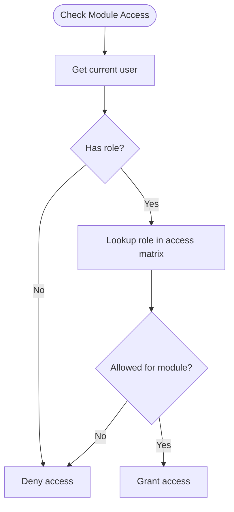
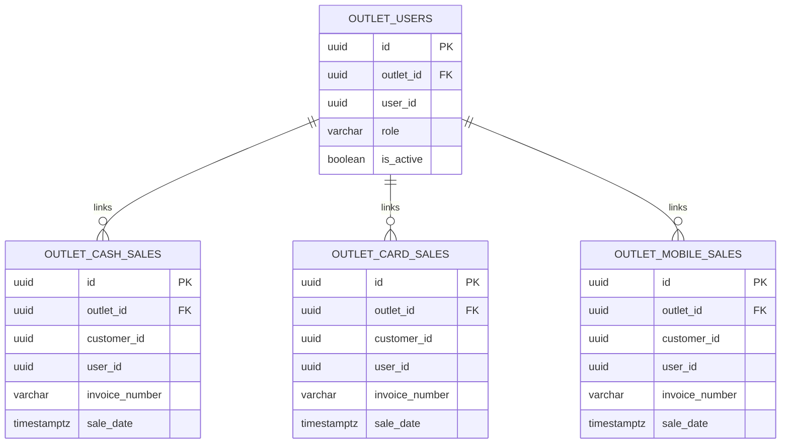
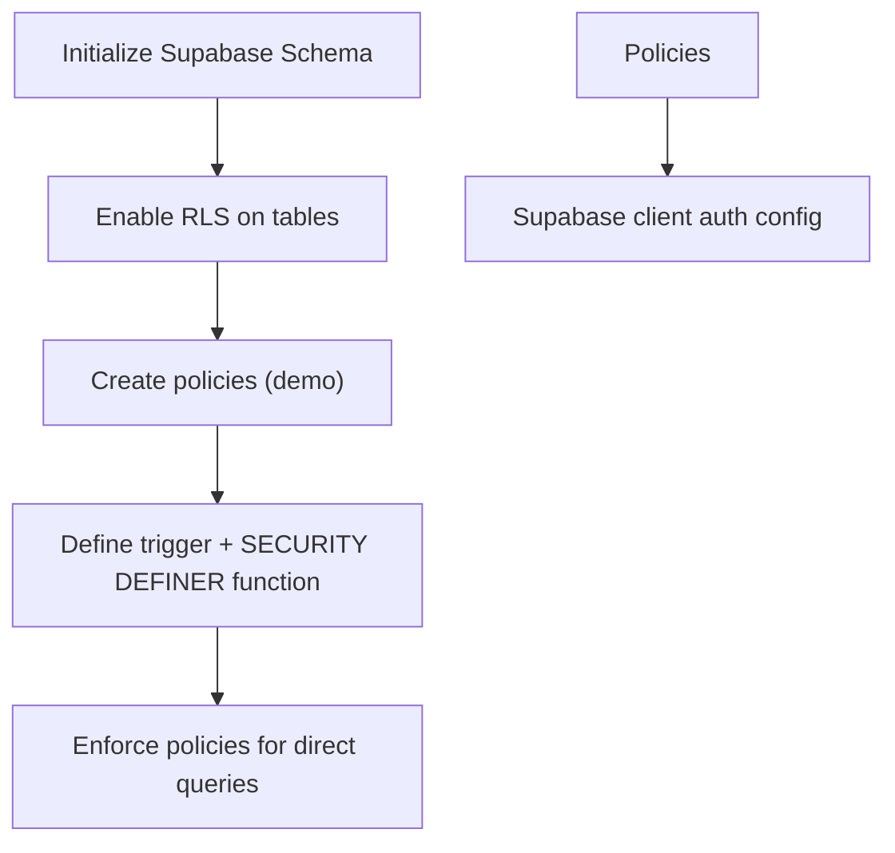
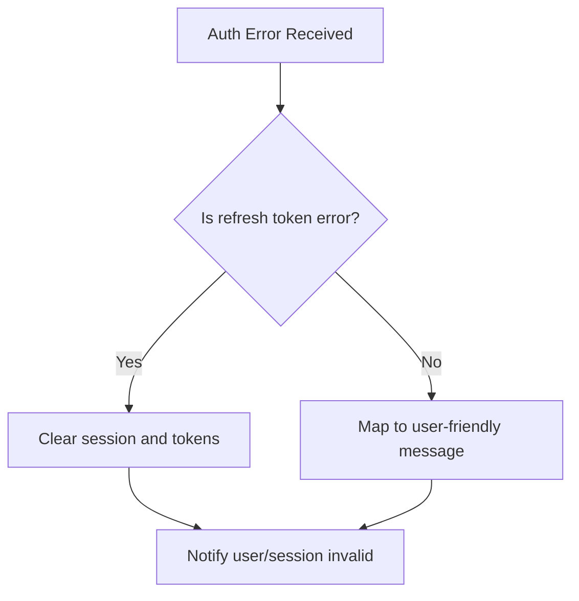
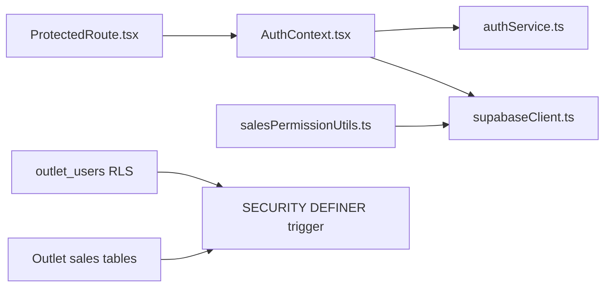

# Security Features and Best Practices

<cite>
**Referenced Files in This Document**
- [AuthContext.tsx](file://src/contexts/AuthContext.tsx)
- [authService.ts](file://src/services/authService.ts)
- [authErrorHandler.ts](file://src/utils/authErrorHandler.ts)
- [supabaseClient.ts](file://src/lib/supabaseClient.ts)
- [ProtectedRoute.tsx](file://src/components/ProtectedRoute.tsx)
- [salesPermissionUtils.ts](file://src/utils/salesPermissionUtils.ts)
- [supabaseSetup.ts](file://src/utils/supabaseSetup.ts)
- [20260416_create_outlet_sales_tables.sql](file://migrations/20260416_create_outlet_sales_tables.sql)
- [20260426_fix_inventory_rls_trigger_complete.sql](file://migrations/20260426_fix_inventory_rls_trigger_complete.sql)
- [20260419_create_outlet_users_table.sql](file://migrations/20260419_create_outlet_users_table.sql)
- [diagnose_rls_state.sql](file://scripts/diagnose_rls_state.sql)
- [FIX_credit_brought_forward.sql](file://migrations/FIX_credit_brought_forward.sql)
</cite>

## Table of Contents
1. [Introduction](#introduction)
2. [Project Structure](#project-structure)
3. [Core Components](#core-components)
4. [Architecture Overview](#architecture-overview)
5. [Detailed Component Analysis](#detailed-component-analysis)
6. [Dependency Analysis](#dependency-analysis)
7. [Performance Considerations](#performance-considerations)
8. [Troubleshooting Guide](#troubleshooting-guide)
9. [Conclusion](#conclusion)
10. [Appendices](#appendices)

## Introduction
This document explains the security features and best practices implemented in Royal POS Modern, focusing on:
- Row Level Security (RLS) for multi-outlet environments
- Session management, including automatic logout and session timeout handling
- Secure token storage and Supabase client configuration
- Authentication error handling and logging/reporting of security violations
- Supabase security setup: database policies, function security, and API access controls
- Password security, encryption practices, and data protection
- Practical examples for security middleware, permission validation, and security event handling
- Mitigation strategies for common POS vulnerabilities, monitoring, backups, audits, and compliance

## Project Structure
Security-related code spans several areas:
- Authentication context and services
- Supabase client configuration and schema utilities
- Route protection and permission utilities
- Database-level RLS policies and triggers
- Diagnostic and maintenance scripts

**Diagram sources**
- [AuthContext.tsx:1-118](file://src/contexts/AuthContext.tsx#L1-L118)
- [authService.ts:1-127](file://src/services/authService.ts#L1-L127)
- [authErrorHandler.ts:1-92](file://src/utils/authErrorHandler.ts#L1-L92)
- [ProtectedRoute.tsx:1-30](file://src/components/ProtectedRoute.tsx#L1-L30)
- [salesPermissionUtils.ts:1-171](file://src/utils/salesPermissionUtils.ts#L1-L171)
- [supabaseClient.ts:1-33](file://src/lib/supabaseClient.ts#L1-L33)
- [supabaseSetup.ts:1-188](file://src/utils/supabaseSetup.ts#L1-L188)
- [20260419_create_outlet_users_table.sql:1-40](file://migrations/20260419_create_outlet_users_table.sql#L1-L40)
- [20260416_create_outlet_sales_tables.sql:1-216](file://migrations/20260416_create_outlet_sales_tables.sql#L1-L216)
- [20260426_fix_inventory_rls_trigger_complete.sql:1-98](file://migrations/20260426_fix_inventory_rls_trigger_complete.sql#L1-L98)
- [diagnose_rls_state.sql:1-38](file://scripts/diagnose_rls_state.sql#L1-L38)
- [FIX_credit_brought_forward.sql:1-45](file://migrations/FIX_credit_brought_forward.sql#L1-L45)

**Section sources**
- [AuthContext.tsx:1-118](file://src/contexts/AuthContext.tsx#L1-L118)
- [authService.ts:1-127](file://src/services/authService.ts#L1-L127)
- [supabaseClient.ts:1-33](file://src/lib/supabaseClient.ts#L1-L33)
- [ProtectedRoute.tsx:1-30](file://src/components/ProtectedRoute.tsx#L1-L30)
- [salesPermissionUtils.ts:1-171](file://src/utils/salesPermissionUtils.ts#L1-L171)
- [supabaseSetup.ts:1-188](file://src/utils/supabaseSetup.ts#L1-L188)
- [20260419_create_outlet_users_table.sql:1-40](file://migrations/20260419_create_outlet_users_table.sql#L1-L40)
- [20260416_create_outlet_sales_tables.sql:1-216](file://migrations/20260416_create_outlet_sales_tables.sql#L1-L216)
- [20260426_fix_inventory_rls_trigger_complete.sql:1-98](file://migrations/20260426_fix_inventory_rls_trigger_complete.sql#L1-L98)
- [diagnose_rls_state.sql:1-38](file://scripts/diagnose_rls_state.sql#L1-L38)
- [FIX_credit_brought_forward.sql:1-45](file://migrations/FIX_credit_brought_forward.sql#L1-L45)

## Core Components
- Authentication context and providers manage session lifecycle, user state, and error handling.
- Supabase client configuration enables auto-refresh tokens, persistent sessions, and implicit OAuth flow.
- Route protection enforces authentication before rendering protected views.
- Permission utilities validate user roles and module access.
- Database-level RLS policies and triggers enforce outlet-scoped access and controlled updates.

Key implementation references:
- [AuthContext.tsx:16-54](file://src/contexts/AuthContext.tsx#L16-L54)
- [supabaseClient.ts:20-31](file://src/lib/supabaseClient.ts#L20-L31)
- [ProtectedRoute.tsx:10-29](file://src/components/ProtectedRoute.tsx#L10-L29)
- [salesPermissionUtils.ts:8-20](file://src/utils/salesPermissionUtils.ts#L8-L20)

**Section sources**
- [AuthContext.tsx:16-54](file://src/contexts/AuthContext.tsx#L16-L54)
- [supabaseClient.ts:20-31](file://src/lib/supabaseClient.ts#L20-L31)
- [ProtectedRoute.tsx:10-29](file://src/components/ProtectedRoute.tsx#L10-L29)
- [salesPermissionUtils.ts:8-20](file://src/utils/salesPermissionUtils.ts#L8-L20)

## Architecture Overview
The security architecture combines frontend authentication guards, Supabase-managed sessions, and database-level access control.

**Diagram sources**
- [AuthContext.tsx:20-54](file://src/contexts/AuthContext.tsx#L20-L54)
- [authService.ts:54-62](file://src/services/authService.ts#L54-L62)
- [supabaseClient.ts:20-31](file://src/lib/supabaseClient.ts#L20-L31)
- [ProtectedRoute.tsx:14-29](file://src/components/ProtectedRoute.tsx#L14-L29)

## Detailed Component Analysis

### Authentication and Session Management
- Auto-refresh and persistence: Supabase client is configured to auto-refresh tokens and persist sessions in localStorage.
- Auth state listener: The context listens for auth state changes and updates the user state accordingly.
- Login/logout/sign-up: Frontend handlers call Supabase auth APIs and surface errors via a dedicated error handler.
- Error handling: Specific handling for refresh token failures, invalid credentials, unconfirmed emails, and registration conflicts.

**Diagram sources**
- [AuthContext.tsx:20-54](file://src/contexts/AuthContext.tsx#L20-L54)
- [supabaseClient.ts:20-31](file://src/lib/supabaseClient.ts#L20-L31)

**Section sources**
- [AuthContext.tsx:20-54](file://src/contexts/AuthContext.tsx#L20-L54)
- [supabaseClient.ts:20-31](file://src/lib/supabaseClient.ts#L20-L31)
- [authErrorHandler.ts:14-38](file://src/utils/authErrorHandler.ts#L14-L38)

### Route Protection and Middleware
- ProtectedRoute enforces authentication by checking user state and isLoading, redirecting unauthenticated users to the login page.
- Typical usage wraps routes that require authentication.

**Diagram sources**
- [ProtectedRoute.tsx:10-29](file://src/components/ProtectedRoute.tsx#L10-L29)
- [AuthContext.tsx:10-12](file://src/contexts/AuthContext.tsx#L10-L12)

**Section sources**
- [ProtectedRoute.tsx:10-29](file://src/components/ProtectedRoute.tsx#L10-L29)
- [AuthContext.tsx:10-12](file://src/contexts/AuthContext.tsx#L10-L12)

### Permission Validation and Role-Based Access
- Sales creation permission: After removing blanket RLS, authenticated users can create sales.
- Role retrieval: Fetches user metadata and ensures a user record exists in the users table, assigning a default role if missing.
- Module access matrix: Defines allowed modules per role (admin, manager, cashier, staff).

**Diagram sources**
- [salesPermissionUtils.ts:8-20](file://src/utils/salesPermissionUtils.ts#L8-L20)
- [salesPermissionUtils.ts:26-86](file://src/utils/salesPermissionUtils.ts#L26-L86)
- [salesPermissionUtils.ts:94-171](file://src/utils/salesPermissionUtils.ts#L94-L171)

**Section sources**
- [salesPermissionUtils.ts:8-20](file://src/utils/salesPermissionUtils.ts#L8-L20)
- [salesPermissionUtils.ts:26-86](file://src/utils/salesPermissionUtils.ts#L26-L86)
- [salesPermissionUtils.ts:94-171](file://src/utils/salesPermissionUtils.ts#L94-L171)

### Row Level Security (RLS) Implementation for Multi-Outlets
- Outlet-aware tables: Dedicated outlet-specific sales tables (cash, card, mobile) include outlet_id to segment data by location.
- RLS policies: Policies are defined to restrict access to rows based on outlet membership or admin privileges.
- Trigger security: A function with SECURITY DEFINER bypasses RLS for internal updates triggered by delivery events, while still enforcing policies for direct queries.
- Outlet-user mapping: The outlet_users table links users to outlets with roles and enforces RLS so only admins can manage assignments.

**Diagram sources**
- [20260419_create_outlet_users_table.sql:1-40](file://migrations/20260419_create_outlet_users_table.sql#L1-L40)
- [20260416_create_outlet_sales_tables.sql:20-133](file://migrations/20260416_create_outlet_sales_tables.sql#L20-L133)

**Section sources**
- [20260416_create_outlet_sales_tables.sql:177-198](file://migrations/20260416_create_outlet_sales_tables.sql#L177-L198)
- [20260419_create_outlet_users_table.sql:20-39](file://migrations/20260419_create_outlet_users_table.sql#L20-L39)
- [20260426_fix_inventory_rls_trigger_complete.sql:7-27](file://migrations/20260426_fix_inventory_rls_trigger_complete.sql#L7-L27)
- [20260426_fix_inventory_rls_trigger_complete.sql:42-89](file://migrations/20260426_fix_inventory_rls_trigger_complete.sql#L42-L89)

### Supabase Security Setup: Policies, Functions, and API Controls
- Schema initialization: The schema utility defines tables and indexes, then enables RLS and creates broad policies for demonstration.
- Function security: A trigger function uses SECURITY DEFINER to bypass RLS for internal operations while preserving external policy enforcement.
- API access controls: Supabase client configuration manages token auto-refresh, persistence, and OAuth flow type.

**Diagram sources**
- [supabaseSetup.ts:132-187](file://src/utils/supabaseSetup.ts#L132-L187)
- [20260426_fix_inventory_rls_trigger_complete.sql:7-27](file://migrations/20260426_fix_inventory_rls_trigger_complete.sql#L7-L27)
- [supabaseClient.ts:20-31](file://src/lib/supabaseClient.ts#L20-L31)

**Section sources**
- [supabaseSetup.ts:132-187](file://src/utils/supabaseSetup.ts#L132-L187)
- [20260426_fix_inventory_rls_trigger_complete.sql:7-27](file://migrations/20260426_fix_inventory_rls_trigger_complete.sql#L7-L27)
- [supabaseClient.ts:20-31](file://src/lib/supabaseClient.ts#L20-L31)

### Authentication Error Handling and Logging
- Centralized error handler: Formats messages for invalid credentials, unconfirmed emails, registration conflicts, and refresh token failures.
- Session cleanup: Clears invalid sessions and refresh tokens from localStorage when refresh fails.
- Manual refresh attempts: Provides a mechanism to refresh sessions programmatically and fall back to cleanup on failure.

**Diagram sources**
- [authErrorHandler.ts:14-38](file://src/utils/authErrorHandler.ts#L14-L38)
- [authErrorHandler.ts:43-56](file://src/utils/authErrorHandler.ts#L43-L56)
- [authErrorHandler.ts:74-91](file://src/utils/authErrorHandler.ts#L74-L91)

**Section sources**
- [authErrorHandler.ts:14-38](file://src/utils/authErrorHandler.ts#L14-L38)
- [authErrorHandler.ts:43-56](file://src/utils/authErrorHandler.ts#L43-L56)
- [authErrorHandler.ts:74-91](file://src/utils/authErrorHandler.ts#L74-L91)

### Password Security, Encryption, and Data Protection
- Supabase handles password hashing and cryptographic operations server-side; client-side code should avoid storing raw passwords.
- Environment variables: Supabase URL and anonymous key are loaded from environment variables with validation checks.
- Token storage: Sessions are persisted in localStorage; ensure HTTPS and secure cookies are configured at the platform level to protect tokens.

Practical references:
- [supabaseClient.ts:10-17](file://src/lib/supabaseClient.ts#L10-L17)
- [supabaseClient.ts:20-31](file://src/lib/supabaseClient.ts#L20-L31)

**Section sources**
- [supabaseClient.ts:10-17](file://src/lib/supabaseClient.ts#L10-L17)
- [supabaseClient.ts:20-31](file://src/lib/supabaseClient.ts#L20-L31)

### Practical Examples
- Implementing security middleware: Wrap routes with ProtectedRoute to enforce authentication.
- Validating user permissions: Use canCreateSales and hasModuleAccess to gate features based on roles.
- Handling security events: Subscribe to auth state changes and react to session invalidity via the error handler.

References:
- [ProtectedRoute.tsx:10-29](file://src/components/ProtectedRoute.tsx#L10-L29)
- [salesPermissionUtils.ts:8-20](file://src/utils/salesPermissionUtils.ts#L8-L20)
- [salesPermissionUtils.ts:94-171](file://src/utils/salesPermissionUtils.ts#L94-L171)
- [AuthContext.tsx:43-49](file://src/contexts/AuthContext.tsx#L43-L49)
- [authErrorHandler.ts:74-91](file://src/utils/authErrorHandler.ts#L74-L91)

**Section sources**
- [ProtectedRoute.tsx:10-29](file://src/components/ProtectedRoute.tsx#L10-L29)
- [salesPermissionUtils.ts:8-20](file://src/utils/salesPermissionUtils.ts#L8-L20)
- [salesPermissionUtils.ts:94-171](file://src/utils/salesPermissionUtils.ts#L94-L171)
- [AuthContext.tsx:43-49](file://src/contexts/AuthContext.tsx#L43-L49)
- [authErrorHandler.ts:74-91](file://src/utils/authErrorHandler.ts#L74-L91)

## Dependency Analysis
- AuthContext depends on Supabase client and authService for session management.
- ProtectedRoute depends on AuthContext for user state.
- salesPermissionUtils depends on Supabase client and a users table to resolve roles.
- Database policies depend on outlet_users and outlet-specific sales tables.

**Diagram sources**
- [AuthContext.tsx:1-12](file://src/contexts/AuthContext.tsx#L1-L12)
- [authService.ts:1-3](file://src/services/authService.ts#L1-L3)
- [ProtectedRoute.tsx:1-8](file://src/components/ProtectedRoute.tsx#L1-L8)
- [salesPermissionUtils.ts:1-2](file://src/utils/salesPermissionUtils.ts#L1-L2)
- [20260419_create_outlet_users_table.sql:20-39](file://migrations/20260419_create_outlet_users_table.sql#L20-L39)
- [20260426_fix_inventory_rls_trigger_complete.sql:7-27](file://migrations/20260426_fix_inventory_rls_trigger_complete.sql#L7-L27)
- [20260416_create_outlet_sales_tables.sql:177-198](file://migrations/20260416_create_outlet_sales_tables.sql#L177-L198)

**Section sources**
- [AuthContext.tsx:1-12](file://src/contexts/AuthContext.tsx#L1-L12)
- [authService.ts:1-3](file://src/services/authService.ts#L1-L3)
- [ProtectedRoute.tsx:1-8](file://src/components/ProtectedRoute.tsx#L1-L8)
- [salesPermissionUtils.ts:1-2](file://src/utils/salesPermissionUtils.ts#L1-L2)
- [20260419_create_outlet_users_table.sql:20-39](file://migrations/20260419_create_outlet_users_table.sql#L20-L39)
- [20260426_fix_inventory_rls_trigger_complete.sql:7-27](file://migrations/20260426_fix_inventory_rls_trigger_complete.sql#L7-L27)
- [20260416_create_outlet_sales_tables.sql:177-198](file://migrations/20260416_create_outlet_sales_tables.sql#L177-L198)

## Performance Considerations
- RLS overhead: Enabling RLS adds policy evaluation per query; ensure indexes exist on frequently filtered columns (e.g., outlet_id, invoice_number).
- Triggers and SECURITY DEFINER: Internal updates bypass RLS, minimizing policy checks during automated operations.
- Auth state subscriptions: Keep listeners minimal and unsubscribe on component unmount to avoid memory leaks.

[No sources needed since this section provides general guidance]

## Troubleshooting Guide
- Diagnosing RLS state: Use the diagnostic script to check RLS enablement, policies, trigger function attributes, and outlet_users structure.
- Session invalidation: On refresh token errors, the error handler clears sessions and tokens; verify localStorage keys are removed.
- Credit brought forward updates: Use the migration script to add and index the credit_brought_forward column for performance.

**Section sources**
- [diagnose_rls_state.sql:1-38](file://scripts/diagnose_rls_state.sql#L1-L38)
- [authErrorHandler.ts:43-56](file://src/utils/authErrorHandler.ts#L43-L56)
- [FIX_credit_brought_forward.sql:1-45](file://migrations/FIX_credit_brought_forward.sql#L1-L45)

## Conclusion
Royal POS Modern integrates Supabase-managed authentication with database-level RLS to secure multi-outlet operations. The frontend enforces route protection and permission checks, while backend policies and SECURITY DEFINER triggers maintain data isolation and integrity. Robust error handling and diagnostics support ongoing security maintenance and incident response.

[No sources needed since this section summarizes without analyzing specific files]

## Appendices
- Backup and Recovery: Regularly export Supabase schemas and data; test restoration procedures in isolated environments.
- Audit Logging: Track authentication events and sensitive operations; monitor for anomalies in access logs.
- Compliance: Align RLS policies with data residency and retention requirements; ensure secure transport and storage of personal data.

[No sources needed since this section provides general guidance]