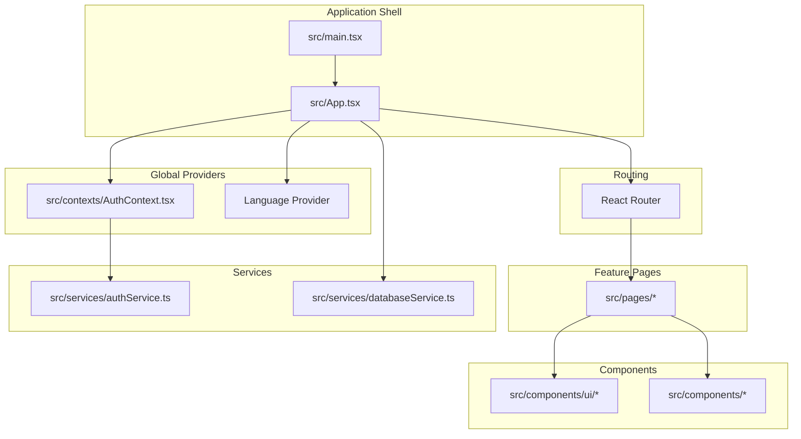
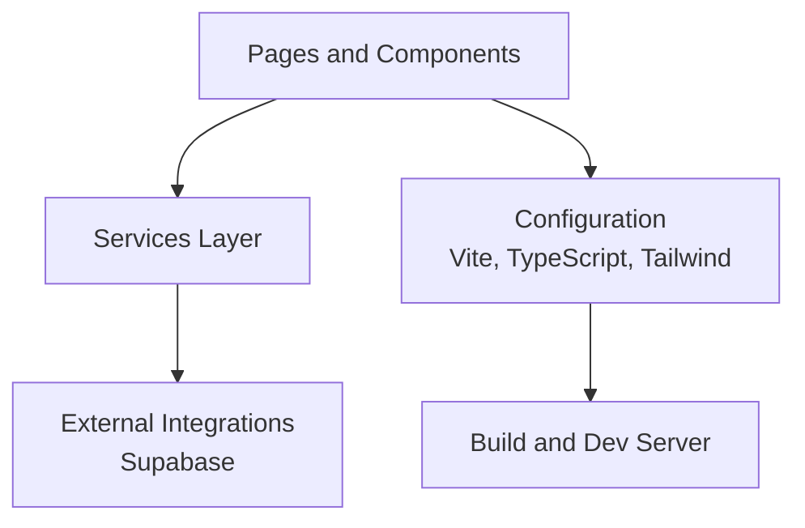
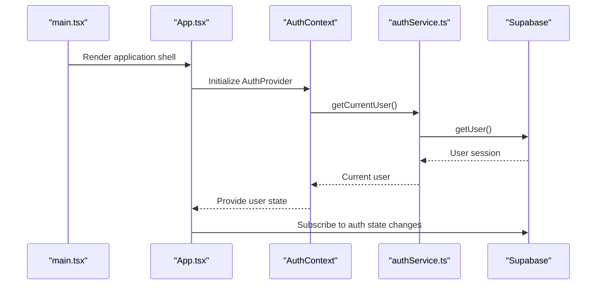
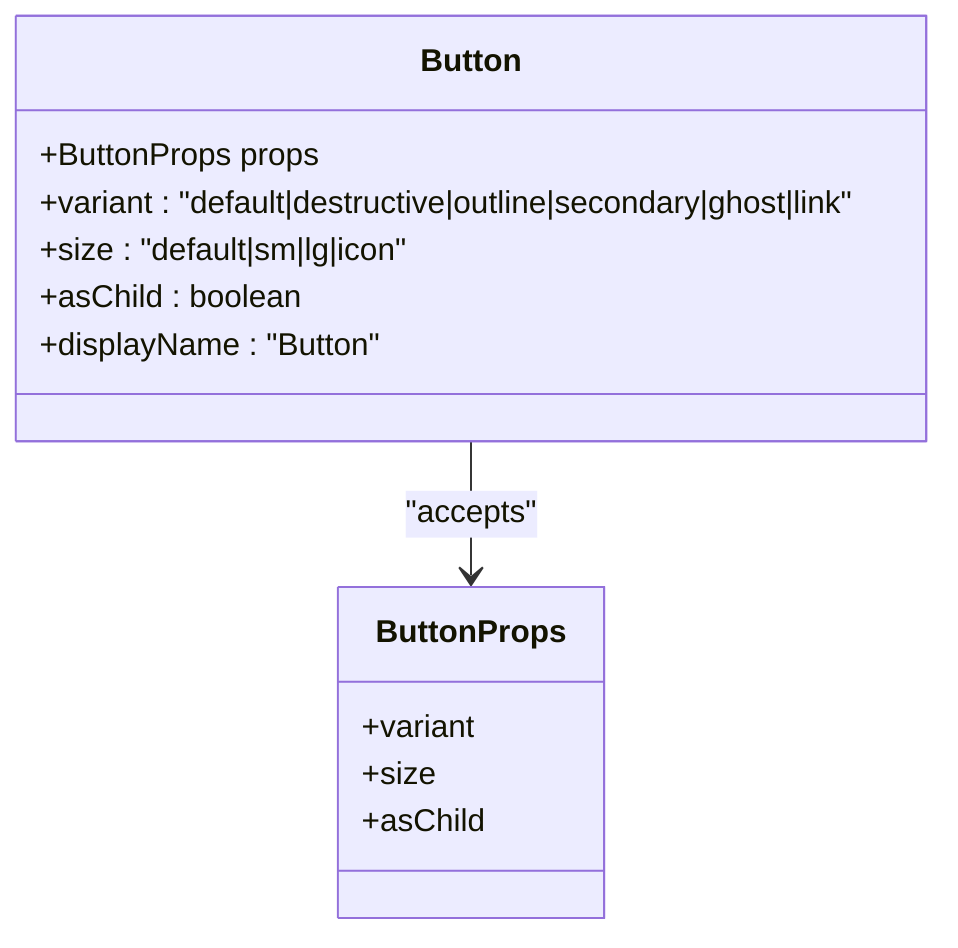
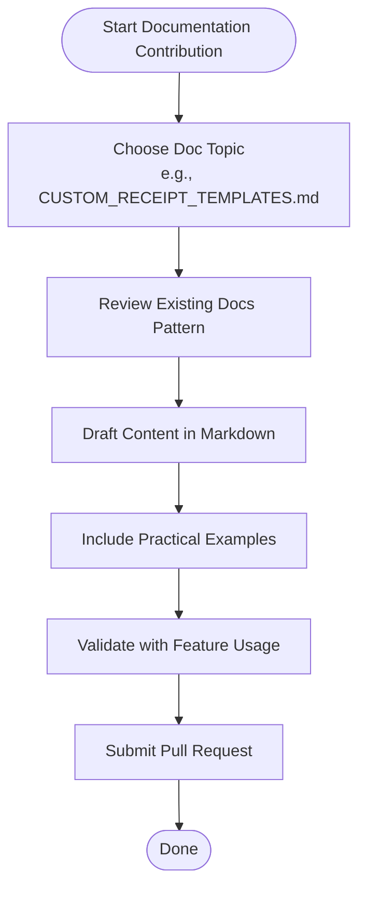
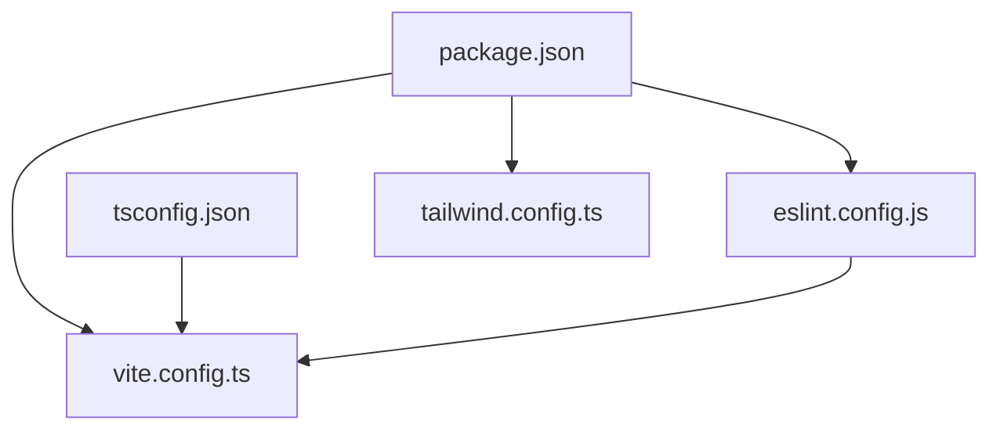

# Contributing Guidelines

<cite>
**Referenced Files in This Document**
- [package.json](file://package.json)
- [eslint.config.js](file://eslint.config.js)
- [tsconfig.json](file://tsconfig.json)
- [tsconfig.app.json](file://tsconfig.app.json)
- [vite.config.ts](file://vite.config.ts)
- [tailwind.config.ts](file://tailwind.config.ts)
- [components.json](file://components.json)
- [README.md](file://README.md)
- [src/App.tsx](file://src/App.tsx)
- [src/main.tsx](file://src/main.tsx)
- [src/contexts/AuthContext.tsx](file://src/contexts/AuthContext.tsx)
- [src/services/authService.ts](file://src/services/authService.ts)
- [src/docs/CUSTOM_RECEIPT_TEMPLATES.md](file://src/docs/CUSTOM_RECEIPT_TEMPLATES.md)
- [src/docs/EXPORT_IMPORT_FEATURES.md](file://src/docs/EXPORT_IMPORT_FEATURES.md)
- [src/components/ui/button.tsx](file://src/components/ui/button.tsx)
</cite>

## Table of Contents
1. [Introduction](#introduction)
2. [Development Setup](#development-setup)
3. [Project Structure](#project-structure)
4. [Core Components](#core-components)
5. [Architecture Overview](#architecture-overview)
6. [Detailed Component Analysis](#detailed-component-analysis)
7. [Dependency Analysis](#dependency-analysis)
8. [Code Style Guidelines](#code-style-guidelines)
9. [Testing Requirements](#testing-requirements)
10. [Pull Request Process](#pull-request-process)
11. [Documentation Contribution Process](#documentation-contribution-process)
12. [Community Guidelines and Communication](#community-guidelines-and-communication)
13. [Troubleshooting Guide](#troubleshooting-guide)
14. [Conclusion](#conclusion)

## Introduction
Thank you for contributing to Royal POS Modern. This document provides a comprehensive guide to setting up your development environment, understanding the project structure, adhering to code style and testing standards, and following the contribution workflow. It is designed to help both new and experienced contributors make impactful contributions efficiently and consistently.

## Development Setup
Follow these steps to prepare your local environment for development:

- Prerequisites
  - Install Node.js and npm. The project uses modern tooling compatible with recent LTS releases.
  - Ensure you have a code editor with TypeScript and ESLint extensions enabled for a smooth development experience.

- Local environment configuration
  - Clone the repository and navigate to the project directory.
  - Install dependencies using the package manager.
  - Start the development server to verify your setup.

- Dependency installation
  - The project uses Vite for the build toolchain and development server, React for UI, TypeScript for type safety, and Tailwind CSS for styling.
  - Dependencies and devDependencies are declared in the package manifest.

- Development workflow
  - Use the development server for iterative development.
  - Run linting to ensure code quality before committing.
  - Build the project for production verification.

- Environment variables for Supabase
  - Create a `.env` file at the project root with your Supabase project URL and anonymous key.
  - These variables are required for authentication and database connectivity.

- Deployment preparation
  - The project supports deployment to Netlify via CLI or scripts.
  - Ensure environment variables are configured in your hosting platform for production builds.

**Section sources**
- [README.md:136-150](file://README.md#L136-L150)
- [README.md:57-72](file://README.md#L57-L72)
- [README.md:88-121](file://README.md#L88-L121)
- [package.json:1-95](file://package.json#L1-L95)

## Project Structure
Royal POS Modern follows a feature-centric structure with clear separation of concerns:

- src/
  - components/: Reusable UI components and feature-specific components
  - contexts/: React context providers for global state (authentication, language)
  - docs/: Markdown documentation for features and user guides
  - hooks/: Custom React hooks
  - lib/: Shared libraries and utilities (e.g., Supabase client)
  - pages/: Page-level components routed by the application shell
  - services/: Service layer for external integrations (e.g., authentication, database)
  - utils/: Utility functions for business logic and helpers
  - types/: Type declarations for third-party libraries
  - main.tsx and App.tsx: Application bootstrap and routing

- Configuration files
  - vite.config.ts: Vite build and dev server configuration
  - tsconfig.json and related TS configs: TypeScript compiler options and path aliases
  - eslint.config.js: ESLint configuration for TypeScript and React
  - tailwind.config.ts and components.json: Tailwind CSS and shadcn/ui integration

**Diagram sources**
- [src/main.tsx:1-39](file://src/main.tsx#L1-L39)
- [src/App.tsx:1-130](file://src/App.tsx#L1-L130)
- [src/contexts/AuthContext.tsx:1-118](file://src/contexts/AuthContext.tsx#L1-L118)
- [src/services/authService.ts:1-127](file://src/services/authService.ts#L1-L127)

**Section sources**
- [src/main.tsx:1-39](file://src/main.tsx#L1-L39)
- [src/App.tsx:1-130](file://src/App.tsx#L1-L130)
- [vite.config.ts:1-33](file://vite.config.ts#L1-L33)
- [tsconfig.json:1-20](file://tsconfig.json#L1-L20)
- [tsconfig.app.json:1-32](file://tsconfig.app.json#L1-L32)
- [eslint.config.js:1-30](file://eslint.config.js#L1-L30)
- [tailwind.config.ts:1-118](file://tailwind.config.ts#L1-L118)
- [components.json:1-20](file://components.json#L1-L20)

## Core Components
This section highlights the foundational components and services that contributors will interact with most frequently.

- Application shell and routing
  - The application bootstraps in main.tsx and renders the App shell, which configures routing, providers, and global UI elements.
  - Routing is declarative and integrates with page-level components.

- Authentication context and service
  - AuthContext manages user session state and exposes login, logout, and signup functions.
  - authService encapsulates Supabase authentication operations and state subscriptions.

- UI primitives and patterns
  - Components under src/components/ui follow shadcn/ui conventions and use Tailwind CSS for styling.
  - Variants and sizes are standardized for consistent UX across the application.

**Section sources**
- [src/main.tsx:1-39](file://src/main.tsx#L1-L39)
- [src/App.tsx:1-130](file://src/App.tsx#L1-L130)
- [src/contexts/AuthContext.tsx:1-118](file://src/contexts/AuthContext.tsx#L1-L118)
- [src/services/authService.ts:1-127](file://src/services/authService.ts#L1-L127)
- [src/components/ui/button.tsx:1-57](file://src/components/ui/button.tsx#L1-L57)

## Architecture Overview
The application follows a layered architecture with clear separation between presentation, services, and data access:

- Presentation layer
  - Pages and components handle UI rendering and user interactions.
  - Global providers (authentication, theme, language) centralize cross-cutting concerns.

- Services layer
  - Services abstract external integrations (e.g., Supabase) and expose typed APIs to components.

- Data access and configuration
  - Vite handles bundling and development hot reload.
  - TypeScript enforces type safety across the codebase.
  - Tailwind CSS and shadcn/ui provide a consistent design system.

[No sources needed since this diagram shows conceptual architecture, not a direct code mapping]

## Detailed Component Analysis

### Authentication Flow
This sequence illustrates how authentication is initialized and managed across the application lifecycle.

**Diagram sources**
- [src/main.tsx:1-39](file://src/main.tsx#L1-L39)
- [src/App.tsx:1-130](file://src/App.tsx#L1-L130)
- [src/contexts/AuthContext.tsx:1-118](file://src/contexts/AuthContext.tsx#L1-L118)
- [src/services/authService.ts:1-127](file://src/services/authService.ts#L1-L127)

**Section sources**
- [src/contexts/AuthContext.tsx:1-118](file://src/contexts/AuthContext.tsx#L1-L118)
- [src/services/authService.ts:1-127](file://src/services/authService.ts#L1-L127)

### UI Component Pattern
The button component demonstrates the standardized pattern for building reusable UI primitives with variants and sizes.

**Diagram sources**
- [src/components/ui/button.tsx:1-57](file://src/components/ui/button.tsx#L1-L57)

**Section sources**
- [src/components/ui/button.tsx:1-57](file://src/components/ui/button.tsx#L1-L57)

### Feature Documentation Standards
Documentation contributions should follow the established patterns in the docs directory.

**Diagram sources**
- [src/docs/CUSTOM_RECEIPT_TEMPLATES.md:1-133](file://src/docs/CUSTOM_RECEIPT_TEMPLATES.md#L1-L133)
- [src/docs/EXPORT_IMPORT_FEATURES.md:1-169](file://src/docs/EXPORT_IMPORT_FEATURES.md#L1-L169)

**Section sources**
- [src/docs/CUSTOM_RECEIPT_TEMPLATES.md:1-133](file://src/docs/CUSTOM_RECEIPT_TEMPLATES.md#L1-L133)
- [src/docs/EXPORT_IMPORT_FEATURES.md:1-169](file://src/docs/EXPORT_IMPORT_FEATURES.md#L1-L169)

## Dependency Analysis
Understanding dependencies helps contributors maintain compatibility and avoid regressions.

**Diagram sources**
- [package.json:1-95](file://package.json#L1-L95)
- [vite.config.ts:1-33](file://vite.config.ts#L1-L33)
- [tsconfig.json:1-20](file://tsconfig.json#L1-L20)
- [eslint.config.js:1-30](file://eslint.config.js#L1-L30)
- [tailwind.config.ts:1-118](file://tailwind.config.ts#L1-L118)

**Section sources**
- [package.json:1-95](file://package.json#L1-L95)
- [vite.config.ts:1-33](file://vite.config.ts#L1-L33)
- [tsconfig.json:1-20](file://tsconfig.json#L1-L20)
- [eslint.config.js:1-30](file://eslint.config.js#L1-L30)
- [tailwind.config.ts:1-118](file://tailwind.config.ts#L1-L118)

## Code Style Guidelines
Adhering to consistent code style improves readability and maintainability.

- ESLint configuration
  - The project uses TypeScript ESLint with recommended rules and React Hooks plugin.
  - React Refresh is configured to warn on non-component exports.
  - Unused variable rules are disabled to accommodate legacy patterns.

- TypeScript standards
  - Strict mode is intentionally relaxed for rapid development; contributors should aim for safer defaults when adding new code.
  - Path aliases are configured to simplify imports using the @ prefix.

- Component development patterns
  - Prefer shadcn/ui primitives for consistent UI and accessibility.
  - Use variant and size props to align with established design tokens.
  - Keep components functional and focused on single responsibilities.

- Styling conventions
  - Tailwind CSS utility classes are preferred for styling.
  - shadcn/ui component aliases are configured for consistent imports.

**Section sources**
- [eslint.config.js:1-30](file://eslint.config.js#L1-L30)
- [tsconfig.json:1-20](file://tsconfig.json#L1-L20)
- [tsconfig.app.json:1-32](file://tsconfig.app.json#L1-L32)
- [tailwind.config.ts:1-118](file://tailwind.config.ts#L1-L118)
- [components.json:1-20](file://components.json#L1-L20)
- [src/components/ui/button.tsx:1-57](file://src/components/ui/button.tsx#L1-L57)

## Testing Requirements
While a formal test suite is not present in the repository, contributors should ensure quality and reliability when submitting changes.

- Unit testing expectations
  - New components and utilities should ideally include unit tests to validate behavior.
  - Mock external dependencies (e.g., Supabase) to isolate logic.

- Integration testing expectations
  - End-to-end scenarios should be verified manually, especially authentication flows and data mutations.
  - Validate responsive behavior across device sizes.

- Quality gates
  - Lint passes without errors.
  - Build succeeds in both development and production modes.
  - No runtime warnings in the browser console after running the development server.

- Coverage expectations
  - Aim for meaningful test coverage for critical business logic (e.g., data validation, calculations).
  - UI components should be visually tested across supported screen sizes.

[No sources needed since this section provides general guidance]

## Pull Request Process
Follow these steps to propose changes:

- Branch naming conventions
  - Use descriptive names prefixed with feature/, fix/, chore/, or docs/ to indicate intent.
  - Example: feature/add-sales-permission-system

- Commit message standards
  - Use imperative mood and concise descriptions.
  - Reference related issues or documentation files when applicable.

- Review procedures
  - Ensure all checks pass (lint, build).
  - Include screenshots or short videos for UI changes.
  - Update documentation if the change affects user-facing features.

- Merge criteria
  - At least one maintainer approval.
  - All CI checks must pass.
  - Squash and merge for clean history; rebase if requested.

[No sources needed since this section provides general guidance]

## Documentation Contribution Process
Contribute to the documentation to improve clarity and usability.

- Markdown standards
  - Use clear headings and bullet lists.
  - Reference related files and components with precise paths.
  - Include diagrams where helpful to illustrate workflows.

- Example contributions
  - Follow the structure of existing docs (overview, configuration, examples, troubleshooting).
  - Provide practical examples aligned with feature usage.

- Review workflows
  - Submit a pull request targeting the docs directory.
  - Address reviewer feedback promptly and update examples if underlying features change.

**Section sources**
- [src/docs/CUSTOM_RECEIPT_TEMPLATES.md:1-133](file://src/docs/CUSTOM_RECEIPT_TEMPLATES.md#L1-L133)
- [src/docs/EXPORT_IMPORT_FEATURES.md:1-169](file://src/docs/EXPORT_IMPORT_FEATURES.md#L1-L169)

## Community Guidelines and Communication
- Be respectful and inclusive in discussions.
- Use dedicated channels for issues and feature requests.
- Provide reproducible examples when reporting bugs.
- Offer constructive feedback during code reviews.

[No sources needed since this section provides general guidance]

## Troubleshooting Guide
Common issues and resolutions during development:

- Supabase connection failures
  - Verify environment variables are correctly set in your local environment and hosting platform.
  - Confirm Supabase policies and schema are applied as documented.

- Build or lint errors
  - Run the linter to identify issues and resolve TypeScript or ESLint violations.
  - Clean caches and reinstall dependencies if necessary.

- UI inconsistencies
  - Ensure Tailwind and shadcn/ui are configured correctly.
  - Align component variants and sizes with established patterns.

**Section sources**
- [README.md:57-72](file://README.md#L57-L72)
- [eslint.config.js:1-30](file://eslint.config.js#L1-L30)
- [tailwind.config.ts:1-118](file://tailwind.config.ts#L1-L118)
- [components.json:1-20](file://components.json#L1-L20)

## Conclusion
By following these guidelines, contributors can deliver high-quality features and improvements that align with the project’s architecture and standards. Focus on clear documentation, consistent code style, robust testing, and collaborative review practices to ensure a smooth development experience for everyone involved.