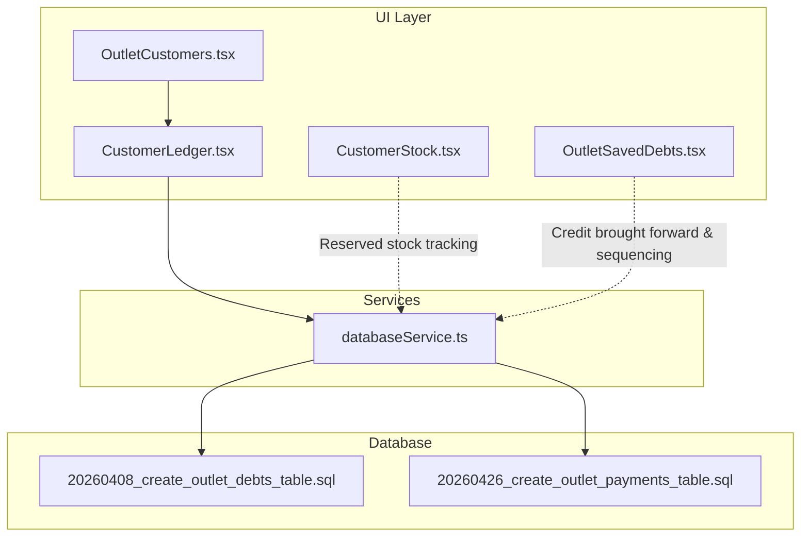
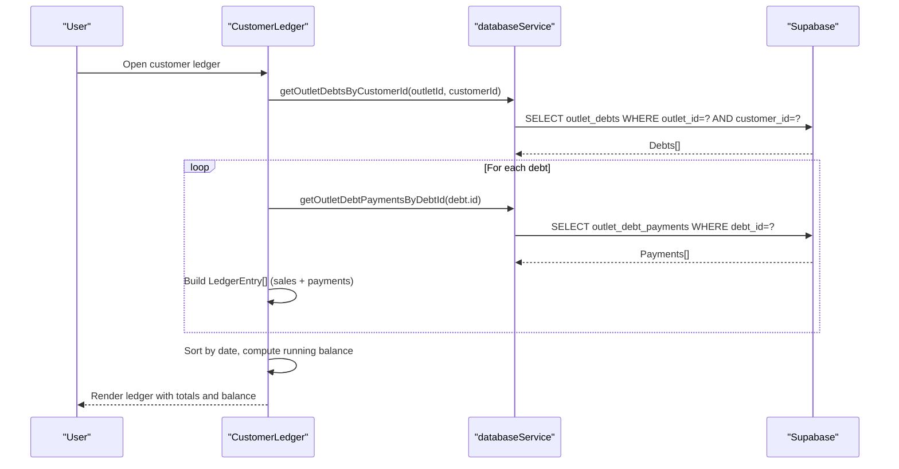
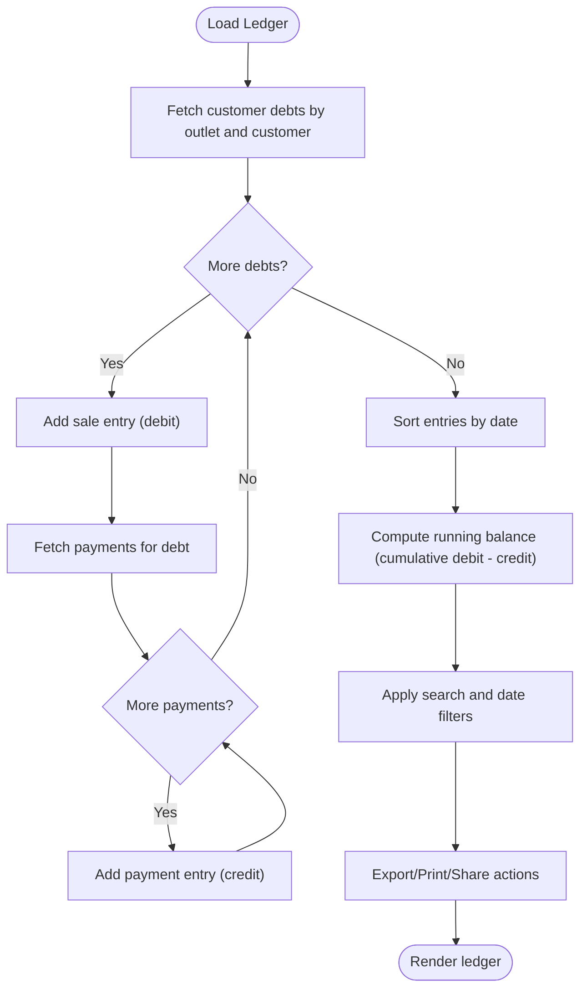
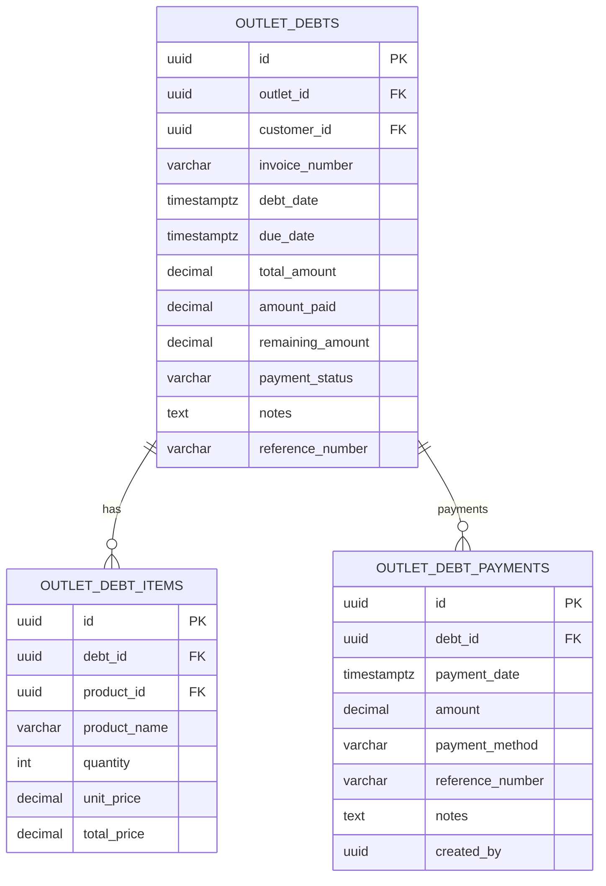
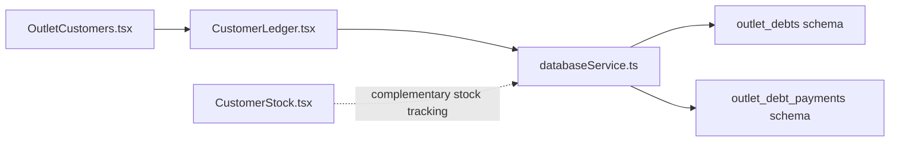

# Customer Ledger Management

<cite>
**Referenced Files in This Document**
- [CustomerLedger.tsx](file://src/components/CustomerLedger.tsx)
- [databaseService.ts](file://src/services/databaseService.ts)
- [20260408_create_outlet_debts_table.sql](file://migrations/20260408_create_outlet_debts_table.sql)
- [20260426_create_outlet_payments_table.sql](file://migrations/20260426_create_outlet_payments_table.sql)
- [OutletCustomers.tsx](file://src/pages/OutletCustomers.tsx)
- [CustomerStock.tsx](file://src/pages/CustomerStock.tsx)
- [OutletSavedDebts.tsx](file://src/pages/OutletSavedDebts.tsx)
</cite>

## Table of Contents
1. [Introduction](#introduction)
2. [Project Structure](#project-structure)
3. [Core Components](#core-components)
4. [Architecture Overview](#architecture-overview)
5. [Detailed Component Analysis](#detailed-component-analysis)
6. [Dependency Analysis](#dependency-analysis)
7. [Performance Considerations](#performance-considerations)
8. [Troubleshooting Guide](#troubleshooting-guide)
9. [Conclusion](#conclusion)

## Introduction
This document explains the customer ledger system in Royal POS Modern, focusing on how customer transactions, purchases, payments, and outstanding balances are tracked and displayed. It covers:
- Ledger display components for transaction history, payment records, and account status
- Integration with customer stock management for tracking purchased items and inventory movements
- Ledger calculation algorithms for accurate account balances and transaction sequencing
- Ledger data structure including transaction types, amounts, dates, and references
- Practical examples of ledger operations, balance calculations, and reconciliation
- Performance considerations and troubleshooting guidance

## Project Structure
The customer ledger functionality spans React components, database services, and database migrations:
- UI component: CustomerLedger renders the ledger, supports filtering, exports, and printing
- Services: databaseService provides typed APIs for outlet debts, debt items, and debt payments
- Migrations: define the outlet_debts, outlet_debt_items, and outlet_debt_payments tables
- Pages: OutletCustomers integrates ledger access from customer listings; CustomerStock manages reserved/unclaimed items; OutletSavedDebts demonstrates credit brought forward and debt sequencing

**Diagram sources**
- [CustomerLedger.tsx:52-131](file://src/components/CustomerLedger.tsx#L52-L131)
- [databaseService.ts:4477-4883](file://src/services/databaseService.ts#L4477-L4883)
- [20260408_create_outlet_debts_table.sql:10-55](file://migrations/20260408_create_outlet_debts_table.sql#L10-L55)
- [20260426_create_outlet_payments_table.sql:2-16](file://migrations/20260426_create_outlet_payments_table.sql#L2-L16)
- [OutletCustomers.tsx:120-127](file://src/pages/OutletCustomers.tsx#L120-L127)
- [CustomerStock.tsx:47-131](file://src/pages/CustomerStock.tsx#L47-L131)
- [OutletSavedDebts.tsx:680-708](file://src/pages/OutletSavedDebts.tsx#L680-L708)

**Section sources**
- [CustomerLedger.tsx:52-131](file://src/components/CustomerLedger.tsx#L52-L131)
- [databaseService.ts:4477-4883](file://src/services/databaseService.ts#L4477-L4883)
- [20260408_create_outlet_debts_table.sql:10-55](file://migrations/20260408_create_outlet_debts_table.sql#L10-L55)
- [20260426_create_outlet_payments_table.sql:2-16](file://migrations/20260426_create_outlet_payments_table.sql#L2-L16)
- [OutletCustomers.tsx:120-127](file://src/pages/OutletCustomers.tsx#L120-L127)
- [CustomerStock.tsx:47-131](file://src/pages/CustomerStock.tsx#L47-L131)
- [OutletSavedDebts.tsx:680-708](file://src/pages/OutletSavedDebts.tsx#L680-L708)

## Core Components
- CustomerLedger component
  - Loads customer debts and associated payments
  - Builds a chronological ledger with running balance
  - Provides search, date-range filtering, and export/print/share actions
- Database service functions
  - getOutletDebtsByCustomerId: retrieves customer’s unpaid/partial debts
  - getOutletDebtPaymentsByDebtId: retrieves payment history per debt
  - Additional helpers for debt items and payments
- Ledger data model
  - LedgerEntry: date, description, debit, credit, balance, type, reference
  - OutletDebt: invoice_number, debt_date, due_date, subtotal, discount_amount, tax_amount, total_amount, amount_paid, remaining_amount, payment_status, notes, reference_number
  - OutletDebtPayment: payment_date, amount, payment_method, reference_number, notes, created_by

Key responsibilities:
- Accurate balance computation via sequential debit/credit accumulation
- Real-time filtering and export capabilities
- Seamless integration with outlet-scoped debt and payment records

**Section sources**
- [CustomerLedger.tsx:41-131](file://src/components/CustomerLedger.tsx#L41-L131)
- [databaseService.ts:4477-4883](file://src/services/databaseService.ts#L4477-L4883)

## Architecture Overview
The ledger architecture follows a layered pattern:
- UI layer: CustomerLedger orchestrates data loading, filtering, and rendering
- Service layer: databaseService abstracts Supabase queries for debts, items, and payments
- Data layer: outlet_debts, outlet_debt_items, outlet_debt_payments tables maintain transactional integrity

**Diagram sources**
- [CustomerLedger.tsx:69-131](file://src/components/CustomerLedger.tsx#L69-L131)
- [databaseService.ts:4477-4883](file://src/services/databaseService.ts#L4477-L4883)

## Detailed Component Analysis

### CustomerLedger Component
Responsibilities:
- Load customer debts and payments
- Construct chronological ledger entries
- Compute running balance
- Provide filtering and export/print/share actions

Processing logic:
- Fetch debts for the customer and outlet
- For each debt, add a sale entry and fetch all payments
- Sort entries by date
- Compute running balance as cumulative debit minus credit
- Expose totals and current balance
- Support search by description/type and date range
- Export to CSV/XLS/PDF and print/share

**Diagram sources**
- [CustomerLedger.tsx:69-164](file://src/components/CustomerLedger.tsx#L69-L164)

**Section sources**
- [CustomerLedger.tsx:52-591](file://src/components/CustomerLedger.tsx#L52-L591)

### Ledger Data Model and Calculations
Data model:
- LedgerEntry: id, date, description, debit, credit, balance, type, reference
- OutletDebt: invoice_number, debt_date, due_date, subtotal, discount_amount, tax_amount, total_amount, amount_paid, remaining_amount, payment_status, notes, reference_number
- OutletDebtPayment: payment_date, amount, payment_method, reference_number, notes, created_by

Calculation algorithm:
- Debits represent sales amounts; Credits represent payments
- Running balance computed as balance(n) = balance(n-1) + debit(n) - credit(n)
- Sorting ensures chronological accuracy for balance continuity

Integration points:
- OutletCustomers page links to ledger and precomputes balances
- OutletSavedDebts page demonstrates credit brought forward and sequential debt handling

**Section sources**
- [CustomerLedger.tsx:41-131](file://src/components/CustomerLedger.tsx#L41-L131)
- [OutletCustomers.tsx:96-107](file://src/pages/OutletCustomers.tsx#L96-L107)
- [OutletSavedDebts.tsx:680-708](file://src/pages/OutletSavedDebts.tsx#L680-L708)

### Database Schema and Service Functions
Schema highlights:
- outlet_debts: outlet_id, customer_id, invoice_number, debt_date, due_date, amounts, payment_status, reference_number
- outlet_debt_items: debt_id, product_id, product_name, quantity, unit_price, discount_amount, total_price
- outlet_debt_payments: debt_id, payment_date, amount, payment_method, reference_number, notes, created_by

Service functions:
- getOutletDebtsByCustomerId(outletId, customerId): returns unpaid/partial debts
- getOutletDebtPaymentsByDebtId(debtId): returns payment history ordered by payment_date
- getOutletDebtItemsByDebtId(debtId): returns line items for a debt

**Diagram sources**
- [20260408_create_outlet_debts_table.sql:10-55](file://migrations/20260408_create_outlet_debts_table.sql#L10-L55)
- [databaseService.ts:4477-4883](file://src/services/databaseService.ts#L4477-L4883)

**Section sources**
- [20260408_create_outlet_debts_table.sql:10-66](file://migrations/20260408_create_outlet_debts_table.sql#L10-L66)
- [20260426_create_outlet_payments_table.sql:2-23](file://migrations/20260426_create_outlet_payments_table.sql#L2-L23)
- [databaseService.ts:4477-4883](file://src/services/databaseService.ts#L4477-L4883)

### Customer Stock Management Integration
CustomerStock page manages reserved/unclaimed stock:
- Tracks quantities reserved, sold, and delivered
- Supports status transitions (reserved → delivered/cancelled)
- Demonstrates separation between inventory movement and ledger accounting

Integration insights:
- Reserved stock does not yet impact the ledger until delivered
- Delivered stock aligns with debt items and affects inventory counts
- Useful for reconciling physical inventory with ledger balances

**Section sources**
- [CustomerStock.tsx:47-328](file://src/pages/CustomerStock.tsx#L47-L328)

### Practical Examples

#### Example 1: Ledger Operation Workflow
- Load customer ledger for a specific outlet and customer
- Retrieve all unpaid/partial debts
- For each debt, retrieve payments and build entries
- Sort by date and compute running balance
- Export filtered results to CSV/XLS/PDF

**Section sources**
- [CustomerLedger.tsx:69-164](file://src/components/CustomerLedger.tsx#L69-L164)

#### Example 2: Balance Calculation
- Starting balance: 0
- Add sale entry (debit = total_amount, credit = 0)
- Add payment entry (debit = 0, credit = amount_paid)
- Running balance = previous balance + debit − credit
- Final balance reflects current outstanding amount

**Section sources**
- [CustomerLedger.tsx:109-114](file://src/components/CustomerLedger.tsx#L109-L114)

#### Example 3: Transaction Reconciliation
- Compare total debits vs. total credits
- Verify remaining_amount equals running balance
- Confirm payment_status aligns with balances (paid/partial/unpaid)

**Section sources**
- [databaseService.ts:4477-4489](file://src/services/databaseService.ts#L4477-L4489)

## Dependency Analysis
Component and module relationships:
- CustomerLedger depends on databaseService for outlet_debts and outlet_debt_payments
- OutletCustomers integrates ledger access and computes balances
- CustomerStock complements ledger by tracking reserved stock
- Migrations define the authoritative schema for ledger data

**Diagram sources**
- [CustomerLedger.tsx:26-27](file://src/components/CustomerLedger.tsx#L26-L27)
- [databaseService.ts:4477-4883](file://src/services/databaseService.ts#L4477-L4883)
- [OutletCustomers.tsx:120-127](file://src/pages/OutletCustomers.tsx#L120-L127)
- [CustomerStock.tsx:47-66](file://src/pages/CustomerStock.tsx#L47-L66)

**Section sources**
- [CustomerLedger.tsx:26-27](file://src/components/CustomerLedger.tsx#L26-L27)
- [databaseService.ts:4477-4883](file://src/services/databaseService.ts#L4477-L4883)
- [OutletCustomers.tsx:120-127](file://src/pages/OutletCustomers.tsx#L120-L127)
- [CustomerStock.tsx:47-66](file://src/pages/CustomerStock.tsx#L47-L66)

## Performance Considerations
- Data volume
  - Outlet-scoped tables reduce dataset size per user session
  - Indexes on outlet_id, customer_id, debt_date, payment_date improve query performance
- Sorting and filtering
  - Frontend sort by date is O(n log n); consider server-side ordering if datasets grow large
  - Filtering by date range should leverage database-side date conditions
- Real-time updates
  - Debts and payments are loaded on demand; consider caching for repeated views
  - Debounce search input to avoid frequent re-renders
- Export operations
  - CSV/XLS generation occurs client-side; large datasets may impact UI responsiveness
- Recommendations
  - Add database indexes for frequently filtered columns
  - Paginate or limit historical data for very large customers
  - Precompute balances at the database level for heavy reporting workloads

[No sources needed since this section provides general guidance]

## Troubleshooting Guide
Common issues and resolutions:
- No transactions displayed
  - Verify customer has unpaid/partial debts for the selected outlet
  - Confirm outlet_id and customer_id parameters are correct
- Discrepancies in totals
  - Recompute running balance manually by checking debit/credit entries
  - Ensure payment_status reflects actual balances (paid vs. partial)
- Payment method mismatch
  - Validate payment_method values stored in outlet_debt_payments
- Export failures
  - Check browser support for Blob and download triggers
  - Validate filteredEntries length before exporting
- Performance slowness
  - Confirm indexes exist on outlet_id, customer_id, and date fields
  - Limit date ranges during export to reduce payload

**Section sources**
- [CustomerLedger.tsx:134-164](file://src/components/CustomerLedger.tsx#L134-L164)
- [databaseService.ts:4477-4883](file://src/services/databaseService.ts#L4477-L4883)
- [20260408_create_outlet_debts_table.sql:58-65](file://migrations/20260408_create_outlet_debts_table.sql#L58-L65)

## Conclusion
Royal POS Modern’s customer ledger system provides a clear, outlet-scoped view of customer transactions and payments. The UI component constructs a chronological ledger with running balances, while the database schema and service functions ensure reliable data access. Integration with customer stock management helps reconcile reserved items and inventory movements. With appropriate indexing, filtering, and export strategies, the system scales effectively for large datasets and real-time balance updates.