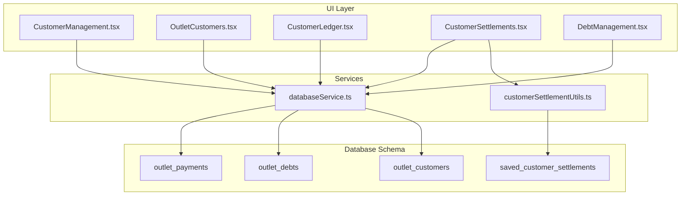
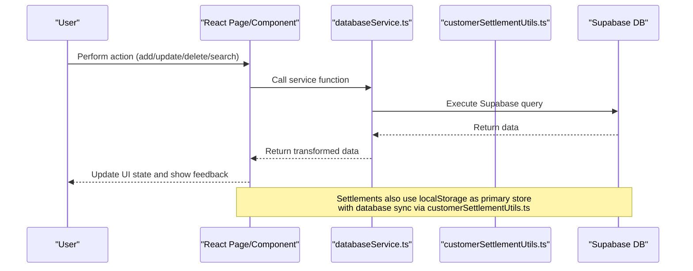
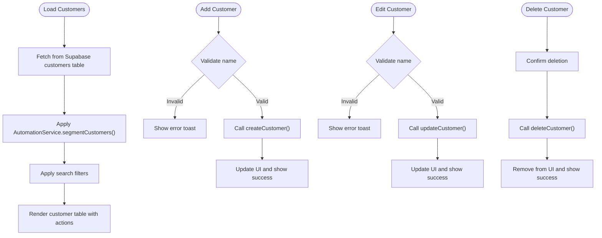
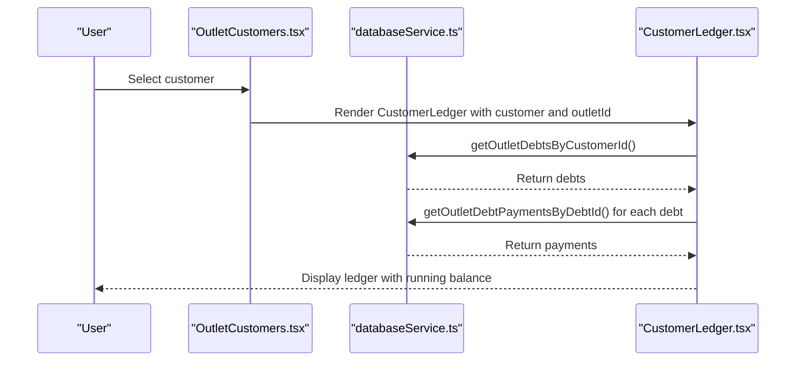
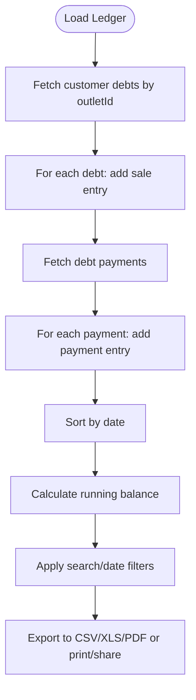
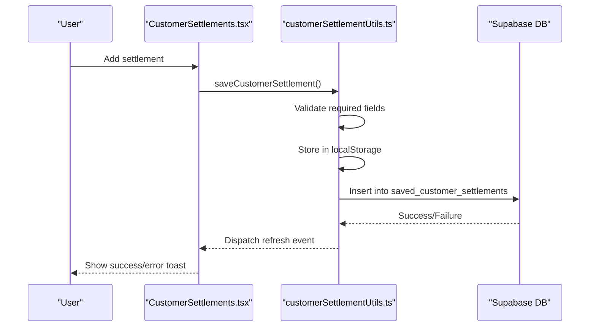
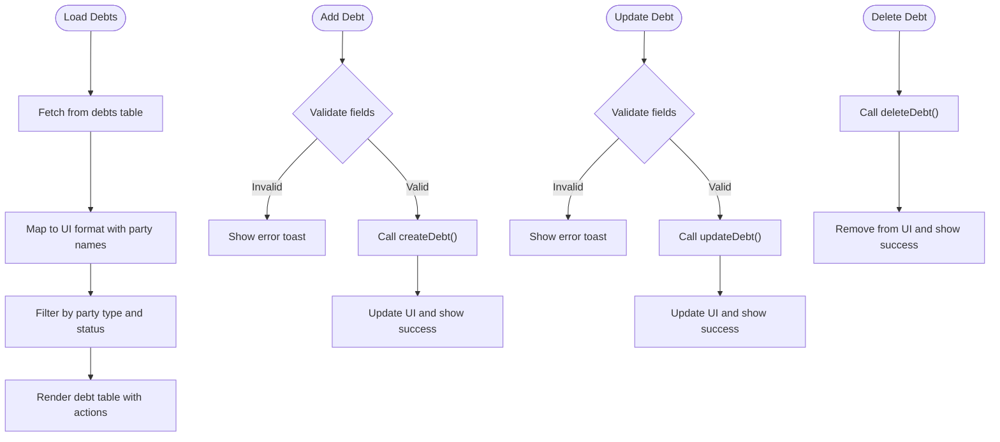
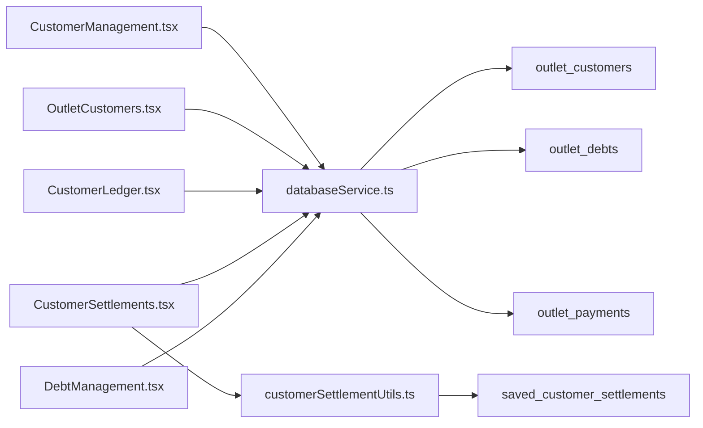

# Customer Management System

<cite>
**Referenced Files in This Document**
- [CustomerManagement.tsx](file://src/pages/CustomerManagement.tsx)
- [OutletCustomers.tsx](file://src/pages/OutletCustomers.tsx)
- [CustomerLedger.tsx](file://src/components/CustomerLedger.tsx)
- [CustomerSettlements.tsx](file://src/pages/CustomerSettlements.tsx)
- [DebtManagement.tsx](file://src/pages/DebtManagement.tsx)
- [databaseService.ts](file://src/services/databaseService.ts)
- [customerSettlementUtils.ts](file://src/utils/customerSettlementUtils.ts)
- [20260313_create_outlet_customers_table.sql](file://migrations/20260313_create_outlet_customers_table.sql)
- [20260313_create_outlet_debts_table.sql](file://migrations/20260313_create_outlet_debts_table.sql)
- [20251127_create_saved_customer_settlements_table.sql](file://migrations/20251127_create_saved_customer_settlements_table.sql)
- [20260426_create_outlet_payments_table.sql](file://migrations/20260426_create_outlet_payments_table.sql)
</cite>

## Table of Contents
1. [Introduction](#introduction)
2. [Project Structure](#project-structure)
3. [Core Components](#core-components)
4. [Architecture Overview](#architecture-overview)
5. [Detailed Component Analysis](#detailed-component-analysis)
6. [Dependency Analysis](#dependency-analysis)
7. [Performance Considerations](#performance-considerations)
8. [Troubleshooting Guide](#troubleshooting-guide)
9. [Conclusion](#conclusion)

## Introduction
This document describes the complete customer management system for Royal POS Modern, covering customer registration, profile management, purchase history tracking, debt management, settlement processing, and reporting capabilities. The system supports both general system-wide customers and outlet-specific customer management, with robust segregation between data domains and comprehensive transaction tracking.

## Project Structure
The customer management system spans React pages, shared components, service utilities, and database schema migrations:

- Pages: CustomerManagement, OutletCustomers, CustomerSettlements, DebtManagement
- Component: CustomerLedger for detailed transaction views
- Services: databaseService for backend interactions
- Utilities: customerSettlementUtils for settlement persistence and retrieval
- Migrations: outlet_customers, outlet_debts, saved_customer_settlements, outlet_payments

**Diagram sources**
- [CustomerManagement.tsx:1-514](file://src/pages/CustomerManagement.tsx#L1-L514)
- [OutletCustomers.tsx:1-803](file://src/pages/OutletCustomers.tsx#L1-L803)
- [CustomerLedger.tsx:1-591](file://src/components/CustomerLedger.tsx#L1-L591)
- [CustomerSettlements.tsx:1-665](file://src/pages/CustomerSettlements.tsx#L1-L665)
- [DebtManagement.tsx:1-599](file://src/pages/DebtManagement.tsx#L1-L599)
- [databaseService.ts:1178-1200](file://src/services/databaseService.ts#L1178-L1200)
- [customerSettlementUtils.ts:1-430](file://src/utils/customerSettlementUtils.ts#L1-L430)
- [20260313_create_outlet_customers_table.sql:1-53](file://migrations/20260313_create_outlet_customers_table.sql#L1-L53)
- [20260313_create_outlet_debts_table.sql:1-50](file://migrations/20260313_create_outlet_debts_table.sql#L1-L50)
- [20251127_create_saved_customer_settlements_table.sql:1-86](file://migrations/20251127_create_saved_customer_settlements_table.sql#L1-L86)
- [20260426_create_outlet_payments_table.sql:1-72](file://migrations/20260426_create_outlet_payments_table.sql#L1-L72)

**Section sources**
- [CustomerManagement.tsx:1-514](file://src/pages/CustomerManagement.tsx#L1-L514)
- [OutletCustomers.tsx:1-803](file://src/pages/OutletCustomers.tsx#L1-L803)
- [CustomerLedger.tsx:1-591](file://src/components/CustomerLedger.tsx#L1-L591)
- [CustomerSettlements.tsx:1-665](file://src/pages/CustomerSettlements.tsx#L1-L665)
- [DebtManagement.tsx:1-599](file://src/pages/DebtManagement.tsx#L1-L599)
- [databaseService.ts:1178-1200](file://src/services/databaseService.ts#L1178-L1200)
- [customerSettlementUtils.ts:1-430](file://src/utils/customerSettlementUtils.ts#L1-L430)
- [20260313_create_outlet_customers_table.sql:1-53](file://migrations/20260313_create_outlet_customers_table.sql#L1-L53)
- [20260313_create_outlet_debts_table.sql:1-50](file://migrations/20260313_create_outlet_debts_table.sql#L1-L50)
- [20251127_create_saved_customer_settlements_table.sql:1-86](file://migrations/20251127_create_saved_customer_settlements_table.sql#L1-L86)
- [20260426_create_outlet_payments_table.sql:1-72](file://migrations/20260426_create_outlet_payments_table.sql#L1-L72)

## Core Components
This section outlines the primary components and their responsibilities:

- General Customer Management: Full CRUD operations for system-wide customers, including import/export capabilities and automated segmentation.
- Outlet Customer Management: Isolated customer records per outlet with balance calculations and ledger integration.
- Customer Ledger: Detailed transaction view combining sales and payments with export/print/share capabilities.
- Customer Settlements: Payment recording with reference numbers, amounts, payment methods, and status tracking.
- Debt Management: Tracking of customer and supplier debts with status management and overdue monitoring.

Key capabilities:
- Customer CRUD: Create, read, update, delete customers with validation and toast notifications.
- Contact Information: Email, phone, address, district/ward, tax ID.
- Loyalty Points: Integrated points system with VIP segmentation and average spend calculation.
- Outlet Isolation: Separate outlet_customers and outlet_debts tables with RLS policies.
- Settlement Persistence: Local-first storage with database synchronization and refresh events.
- Reporting: Export to CSV/XLS/PDF, print, and share options in ledger view.

**Section sources**
- [CustomerManagement.tsx:18-514](file://src/pages/CustomerManagement.tsx#L18-L514)
- [OutletCustomers.tsx:48-803](file://src/pages/OutletCustomers.tsx#L48-L803)
- [CustomerLedger.tsx:52-591](file://src/components/CustomerLedger.tsx#L52-L591)
- [CustomerSettlements.tsx:59-665](file://src/pages/CustomerSettlements.tsx#L59-L665)
- [DebtManagement.tsx:30-599](file://src/pages/DebtManagement.tsx#L30-L599)

## Architecture Overview
The system follows a layered architecture with clear separation between UI, services, utilities, and database:

**Diagram sources**
- [databaseService.ts:1178-1200](file://src/services/databaseService.ts#L1178-L1200)
- [customerSettlementUtils.ts:45-126](file://src/utils/customerSettlementUtils.ts#L45-L126)

**Section sources**
- [databaseService.ts:1178-1200](file://src/services/databaseService.ts#L1178-L1200)
- [customerSettlementUtils.ts:45-126](file://src/utils/customerSettlementUtils.ts#L45-L126)

## Detailed Component Analysis

### General Customer Management
Manages system-wide customers with full CRUD operations, import/export, and automated segmentation.

**Diagram sources**
- [CustomerManagement.tsx:39-206](file://src/pages/CustomerManagement.tsx#L39-L206)

Key features:
- Search by name, email, phone
- Import customers from external sources with merge logic
- VIP segmentation based on loyalty points
- Stats cards for total customers, VIP count, and average spend

**Section sources**
- [CustomerManagement.tsx:18-514](file://src/pages/CustomerManagement.tsx#L18-L514)

### Outlet Customer Management
Handles outlet-specific customer records with balance calculations and ledger integration.

**Diagram sources**
- [OutletCustomers.tsx:120-127](file://src/pages/OutletCustomers.tsx#L120-L127)
- [CustomerLedger.tsx:69-131](file://src/components/CustomerLedger.tsx#L69-L131)
- [databaseService.ts:4477-4486](file://src/services/databaseService.ts#L4477-L4486)

Key features:
- Separate outlet_customers table with RLS policies
- Real-time balance calculation from unpaid/partial debts
- Click-to-view ledger for detailed transaction history
- Card and table view modes with search and filters

**Section sources**
- [OutletCustomers.tsx:48-803](file://src/pages/OutletCustomers.tsx#L48-L803)
- [20260313_create_outlet_customers_table.sql:1-53](file://migrations/20260313_create_outlet_customers_table.sql#L1-L53)

### Customer Ledger
Provides comprehensive transaction history with export and sharing capabilities.

**Diagram sources**
- [CustomerLedger.tsx:69-164](file://src/components/CustomerLedger.tsx#L69-L164)

Capabilities:
- Running balance calculation across sales and payments
- Search by description/type and date range filtering
- Export to CSV/XLS/PDF and print functionality
- Share via native web share API or clipboard

**Section sources**
- [CustomerLedger.tsx:52-591](file://src/components/CustomerLedger.tsx#L52-L591)

### Customer Settlements
Records customer payments with reference numbers, amounts, and status tracking.

**Diagram sources**
- [CustomerSettlements.tsx:105-167](file://src/pages/CustomerSettlements.tsx#L105-L167)
- [customerSettlementUtils.ts:45-126](file://src/utils/customerSettlementUtils.ts#L45-L126)

Features:
- Reference number generation and validation
- Payment method selection and status management
- Previous/new balance tracking
- Local-first persistence with database synchronization
- Admin/user scoping via RLS policies

**Section sources**
- [CustomerSettlements.tsx:59-665](file://src/pages/CustomerSettlements.tsx#L59-L665)
- [customerSettlementUtils.ts:1-430](file://src/utils/customerSettlementUtils.ts#L1-L430)
- [20251127_create_saved_customer_settlements_table.sql:1-86](file://migrations/20251127_create_saved_customer_settlements_table.sql#L1-L86)

### Debt Management
Tracks customer and supplier debts with status and overdue monitoring.

**Diagram sources**
- [DebtManagement.tsx:49-249](file://src/pages/DebtManagement.tsx#L49-L249)

Highlights:
- Support for both customer and supplier debts
- Status tracking (outstanding, paid, overdue)
- Due date management and overdue amount calculation
- Combined view with customer/supplier name resolution

**Section sources**
- [DebtManagement.tsx:30-599](file://src/pages/DebtManagement.tsx#L30-L599)

## Dependency Analysis
The system exhibits clear separation of concerns with minimal coupling between modules:

**Diagram sources**
- [databaseService.ts:1178-1200](file://src/services/databaseService.ts#L1178-L1200)
- [customerSettlementUtils.ts:1-430](file://src/utils/customerSettlementUtils.ts#L1-L430)
- [20260313_create_outlet_customers_table.sql:1-53](file://migrations/20260313_create_outlet_customers_table.sql#L1-L53)
- [20260313_create_outlet_debts_table.sql:1-50](file://migrations/20260313_create_outlet_debts_table.sql#L1-L50)
- [20251127_create_saved_customer_settlements_table.sql:1-86](file://migrations/20251127_create_saved_customer_settlements_table.sql#L1-L86)
- [20260426_create_outlet_payments_table.sql:1-72](file://migrations/20260426_create_outlet_payments_table.sql#L1-L72)

Key dependencies:
- databaseService.ts provides unified access to Supabase tables
- customerSettlementUtils.ts manages settlement persistence with localStorage fallback
- Migrations define strict schema boundaries between general and outlet-specific data
- RLS policies enforce data isolation between outlets and user-scoped settlements

**Section sources**
- [databaseService.ts:1178-1200](file://src/services/databaseService.ts#L1178-L1200)
- [customerSettlementUtils.ts:1-430](file://src/utils/customerSettlementUtils.ts#L1-L430)
- [20260313_create_outlet_customers_table.sql:1-53](file://migrations/20260313_create_outlet_customers_table.sql#L1-L53)
- [20260313_create_outlet_debts_table.sql:1-50](file://migrations/20260313_create_outlet_debts_table.sql#L1-L50)
- [20251127_create_saved_customer_settlements_table.sql:1-86](file://migrations/20251127_create_saved_customer_settlements_table.sql#L1-L86)
- [20260426_create_outlet_payments_table.sql:1-72](file://migrations/20260426_create_outlet_payments_table.sql#L1-L72)

## Performance Considerations
- Database indexing: outlet_customers and outlet_debts tables include strategic indexes for outlet_id, customer_id, status, and due_date.
- Lazy loading: Ledger loads data on demand when a customer is selected.
- Client-side caching: Settlements use localStorage as primary store with database sync, reducing server round trips.
- Pagination and filtering: UI-level filtering reduces DOM rendering overhead.
- RLS overhead: Row-level security adds minimal overhead while ensuring data isolation.

## Troubleshooting Guide
Common issues and resolutions:

- Customer import conflicts: The import process checks for existing emails and merges data appropriately. Verify email uniqueness and ensure required fields are populated.
- Settlement synchronization: If database writes fail, the system falls back to localStorage. Check browser storage limits and clear cache if needed.
- Ledger balance discrepancies: Ensure all outlet_debt_payments are properly linked to outlet_debts. Verify payment dates and amounts.
- Debt status accuracy: Overdue amounts require due_date fields. Regular reconciliation should compare status against due_date and current date.
- RLS policy errors: For development environments, RLS policies can be fixed using the provided SQL commands in databaseService.ts.

Practical scenarios:
- Adding a new outlet customer: Use the Add Customer dialog in OutletCustomers page. The system automatically calculates balances from unpaid/partial debts.
- Recording a partial payment: Create a debt with unpaid/partial status and add payments via outlet_debt_payments. The system recalculates remaining amounts.
- Generating customer statements: Navigate to a customer's ledger and use export/print/share options.
- Managing customer segmentation: VIP classification is automatic based on loyalty points threshold.

**Section sources**
- [CustomerManagement.tsx:98-148](file://src/pages/CustomerManagement.tsx#L98-L148)
- [customerSettlementUtils.ts:128-254](file://src/utils/customerSettlementUtils.ts#L128-L254)
- [CustomerLedger.tsx:167-290](file://src/components/CustomerLedger.tsx#L167-L290)
- [DebtManagement.tsx:273-279](file://src/pages/DebtManagement.tsx#L273-L279)
- [databaseService.ts:939-1160](file://src/services/databaseService.ts#L939-L1160)

## Conclusion
Royal POS Modern's customer management system provides a comprehensive solution for managing customer relationships across multiple outlets. The architecture ensures data isolation, robust transaction tracking, and flexible reporting capabilities. With outlet-specific customer records, detailed ledger views, settlement processing, and debt management, the system supports both operational efficiency and financial oversight. The modular design allows for future enhancements while maintaining clear separation of concerns and strong data governance through RLS policies.