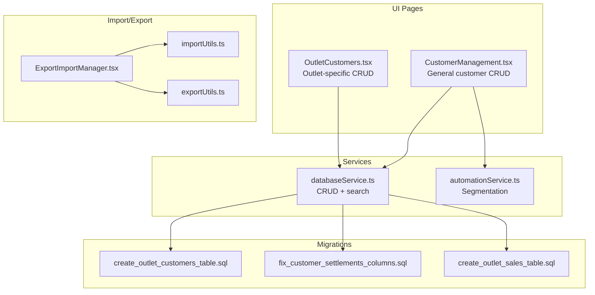
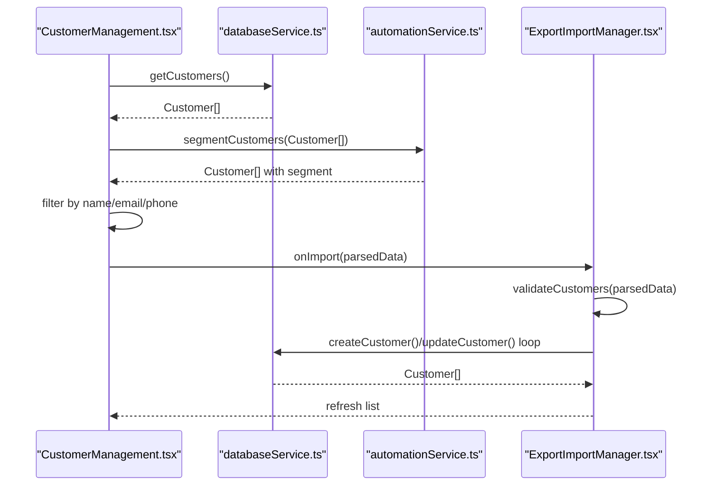
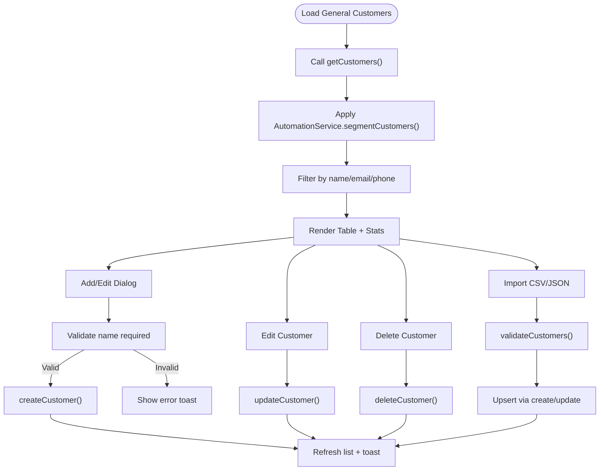
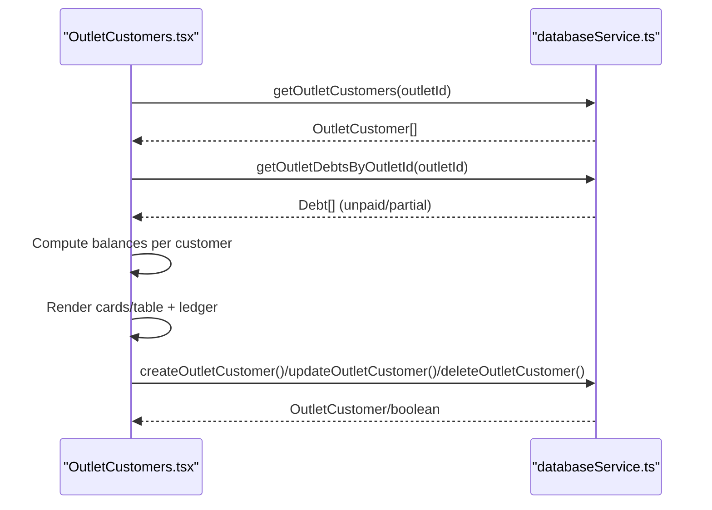
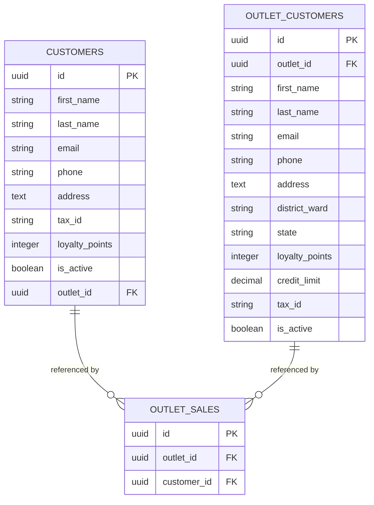
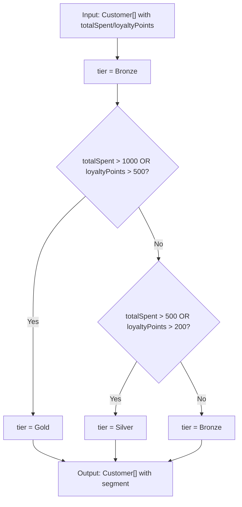
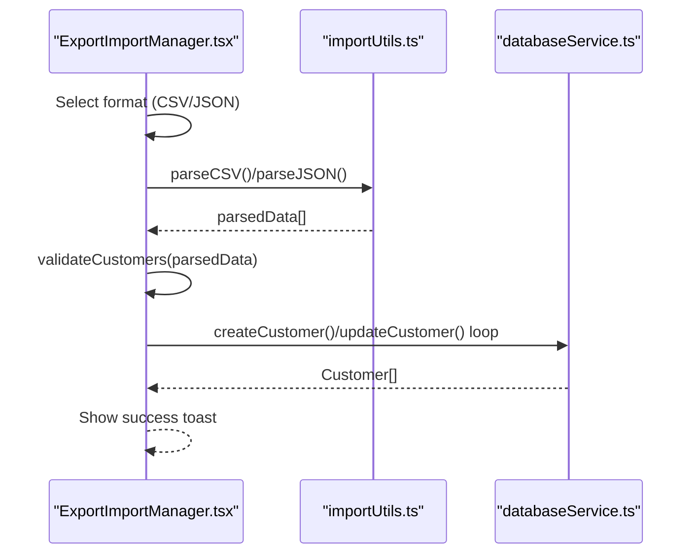
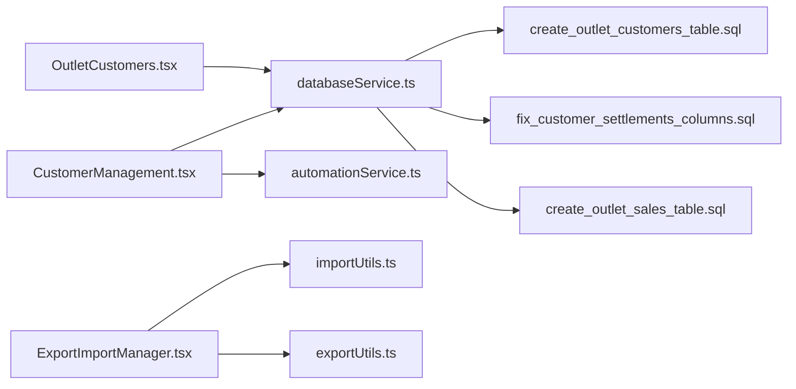

# Customer Profiles and Registration

<cite>
**Referenced Files in This Document**
- [CustomerManagement.tsx](file://src/pages/CustomerManagement.tsx)
- [OutletCustomers.tsx](file://src/pages/OutletCustomers.tsx)
- [automationService.ts](file://src/services/automationService.ts)
- [databaseService.ts](file://src/services/databaseService.ts)
- [ExportImportManager.tsx](file://src/components/ExportImportManager.tsx)
- [importUtils.ts](file://src/utils/importUtils.ts)
- [exportUtils.ts](file://src/utils/exportUtils.ts)
- [customerSettlementUtils.ts](file://src/utils/customerSettlementUtils.ts)
- [create_outlet_customers_table.sql](file://migrations/20260313_create_outlet_customers_table.sql)
- [fix_customer_settlements_columns.sql](file://migrations/20260408_fix_customer_settlements_columns.sql)
- [create_outlet_sales_table.sql](file://migrations/20260313_create_outlet_sales_table.sql)
</cite>

## Table of Contents
1. [Introduction](#introduction)
2. [Project Structure](#project-structure)
3. [Core Components](#core-components)
4. [Architecture Overview](#architecture-overview)
5. [Detailed Component Analysis](#detailed-component-analysis)
6. [Dependency Analysis](#dependency-analysis)
7. [Performance Considerations](#performance-considerations)
8. [Troubleshooting Guide](#troubleshooting-guide)
9. [Conclusion](#conclusion)

## Introduction
This document explains the complete customer profile management system in Royal POS Modern, covering customer registration, editing, deletion, search, import/export, and the customer segmentation system. It details the data model for both general system customers and outlet-specific customers, describes the automation-driven VIP segmentation, and provides practical examples of CRUD operations, validation rules, and error handling. It also addresses data integrity, duplicate detection during imports, and the relationship between general and outlet-specific customer records.

## Project Structure
Customer management spans three main areas:
- General customer management page for system-wide customers
- Outlet-specific customer management for individual outlets
- Shared import/export infrastructure and automation services

**Diagram sources**
- [CustomerManagement.tsx:18-514](file://src/pages/CustomerManagement.tsx#L18-L514)
- [OutletCustomers.tsx:48-800](file://src/pages/OutletCustomers.tsx#L48-L800)
- [databaseService.ts:1178-1287](file://src/services/databaseService.ts#L1178-L1287)
- [automationService.ts:81-96](file://src/services/automationService.ts#L81-L96)
- [ExportImportManager.tsx:28-259](file://src/components/ExportImportManager.tsx#L28-L259)
- [importUtils.ts:74-92](file://src/utils/importUtils.ts#L74-L92)
- [exportUtils.ts:14-109](file://src/utils/exportUtils.ts#L14-L109)
- [create_outlet_customers_table.sql:1-53](file://migrations/20260313_create_outlet_customers_table.sql#L1-L53)
- [fix_customer_settlements_columns.sql:155-194](file://migrations/20260408_fix_customer_settlements_columns.sql#L155-L194)
- [create_outlet_sales_table.sql:1-27](file://migrations/20260313_create_outlet_sales_table.sql#L1-L27)

**Section sources**
- [CustomerManagement.tsx:18-514](file://src/pages/CustomerManagement.tsx#L18-L514)
- [OutletCustomers.tsx:48-800](file://src/pages/OutletCustomers.tsx#L48-L800)
- [databaseService.ts:1178-1287](file://src/services/databaseService.ts#L1178-L1287)
- [automationService.ts:81-96](file://src/services/automationService.ts#L81-L96)
- [ExportImportManager.tsx:28-259](file://src/components/ExportImportManager.tsx#L28-L259)
- [importUtils.ts:74-92](file://src/utils/importUtils.ts#L74-L92)
- [exportUtils.ts:14-109](file://src/utils/exportUtils.ts#L14-L109)
- [create_outlet_customers_table.sql:1-53](file://migrations/20260313_create_outlet_customers_table.sql#L1-L53)
- [fix_customer_settlements_columns.sql:155-194](file://migrations/20260408_fix_customer_settlements_columns.sql#L155-L194)
- [create_outlet_sales_table.sql:1-27](file://migrations/20260313_create_outlet_sales_table.sql#L1-L27)

## Core Components
- General customer management page: CRUD operations, search, import/export, and VIP statistics
- Outlet-specific customer management: CRUD operations, search, ledger view, and outlet-scoped balances
- Database service: unified CRUD and search for both general and outlet customers
- Automation service: customer segmentation for VIP identification
- Import/export manager: CSV/Excel/JSON/PDF export and CSV/JSON import with validation

Key responsibilities:
- CustomerManagement.tsx: loads general customers, handles add/edit/delete, search/filter, import/export, and VIP stats
- OutletCustomers.tsx: manages outlet-specific customers, calculates balances, and opens ledger
- databaseService.ts: provides get/create/update/delete/search for both general and outlet customers
- automationService.ts: segments customers based on spending/points thresholds
- ExportImportManager.tsx + importUtils.ts + exportUtils.ts: import/export pipeline with validation

**Section sources**
- [CustomerManagement.tsx:18-514](file://src/pages/CustomerManagement.tsx#L18-L514)
- [OutletCustomers.tsx:48-800](file://src/pages/OutletCustomers.tsx#L48-L800)
- [databaseService.ts:1178-1287](file://src/services/databaseService.ts#L1178-L1287)
- [automationService.ts:81-96](file://src/services/automationService.ts#L81-L96)
- [ExportImportManager.tsx:28-259](file://src/components/ExportImportManager.tsx#L28-L259)
- [importUtils.ts:74-92](file://src/utils/importUtils.ts#L74-L92)
- [exportUtils.ts:14-109](file://src/utils/exportUtils.ts#L14-L109)

## Architecture Overview
The customer management architecture separates concerns between general system customers and outlet-specific customers while sharing common infrastructure for data access, validation, and export.

**Diagram sources**
- [CustomerManagement.tsx:39-148](file://src/pages/CustomerManagement.tsx#L39-L148)
- [databaseService.ts:1178-1287](file://src/services/databaseService.ts#L1178-L1287)
- [automationService.ts:81-96](file://src/services/automationService.ts#L81-L96)
- [ExportImportManager.tsx:69-161](file://src/components/ExportImportManager.tsx#L69-L161)
- [importUtils.ts:74-92](file://src/utils/importUtils.ts#L74-L92)

## Detailed Component Analysis

### General Customer Management (System-wide)
- Data model fields: first_name, last_name, email, phone, address, tax_id, loyalty_points, is_active, outlet_id (optional for general customers)
- CRUD operations: create, read, update, delete via databaseService
- Search/filter: by name, email, phone
- Import/export: CSV/Excel/JSON/PDF with validation
- VIP segmentation: calculated via automationService based on loyalty points

**Diagram sources**
- [CustomerManagement.tsx:39-148](file://src/pages/CustomerManagement.tsx#L39-L148)
- [databaseService.ts:1178-1287](file://src/services/databaseService.ts#L1178-L1287)
- [automationService.ts:81-96](file://src/services/automationService.ts#L81-L96)
- [importUtils.ts:74-92](file://src/utils/importUtils.ts#L74-L92)

**Section sources**
- [CustomerManagement.tsx:18-514](file://src/pages/CustomerManagement.tsx#L18-L514)
- [databaseService.ts:1178-1287](file://src/services/databaseService.ts#L1178-L1287)
- [automationService.ts:81-96](file://src/services/automationService.ts#L81-L96)
- [ExportImportManager.tsx:28-259](file://src/components/ExportImportManager.tsx#L28-L259)
- [importUtils.ts:74-92](file://src/utils/importUtils.ts#L74-L92)

### Outlet-Specific Customer Management
- Data model fields: first_name, last_name, email, phone, address, district_ward, state, tax_id, loyalty_points, credit_limit, is_active
- CRUD operations scoped to an outlet
- Search: by name, phone, email
- Balances: computed from outlet debts (unpaid/partial)
- Ledger: opens customer ledger view for detailed transaction history

**Diagram sources**
- [OutletCustomers.tsx:87-118](file://src/pages/OutletCustomers.tsx#L87-L118)
- [databaseService.ts:3936-4022](file://src/services/databaseService.ts#L3936-L4022)

**Section sources**
- [OutletCustomers.tsx:48-800](file://src/pages/OutletCustomers.tsx#L48-L800)
- [databaseService.ts:3936-4022](file://src/services/databaseService.ts#L3936-L4022)
- [create_outlet_customers_table.sql:1-53](file://migrations/20260313_create_outlet_customers_table.sql#L1-L53)

### Customer Data Model and Relationships
- General customers (customers table): system-wide, optional outlet_id linkage
- Outlet customers (outlet_customers table): outlet-scoped, separate from general customers
- Outlet sales/debts/customers are isolated to maintain data separation between outlets

**Diagram sources**
- [databaseService.ts:44-60](file://src/services/databaseService.ts#L44-L60)
- [databaseService.ts:3936-4022](file://src/services/databaseService.ts#L3936-L4022)
- [create_outlet_sales_table.sql:1-27](file://migrations/20260313_create_outlet_sales_table.sql#L1-L27)
- [create_outlet_customers_table.sql:1-53](file://migrations/20260313_create_outlet_customers_table.sql#L1-L53)

**Section sources**
- [databaseService.ts:44-60](file://src/services/databaseService.ts#L44-L60)
- [databaseService.ts:3936-4022](file://src/services/databaseService.ts#L3936-L4022)
- [create_outlet_customers_table.sql:1-53](file://migrations/20260313_create_outlet_customers_table.sql#L1-L53)
- [create_outlet_sales_table.sql:1-27](file://migrations/20260313_create_outlet_sales_table.sql#L1-L27)

### Customer Segmentation System (VIP Identification)
- Uses AutomationService.segmentCustomers to classify customers into Bronze/Silver/Gold tiers based on totalSpent and loyaltyPoints
- Applied in general customer management to compute VIP counts and averages

**Diagram sources**
- [automationService.ts:81-96](file://src/services/automationService.ts#L81-L96)
- [CustomerManagement.tsx:230-237](file://src/pages/CustomerManagement.tsx#L230-L237)

**Section sources**
- [automationService.ts:81-96](file://src/services/automationService.ts#L81-L96)
- [CustomerManagement.tsx:230-237](file://src/pages/CustomerManagement.tsx#L230-L237)

### Import/Export Capabilities
- Export: CSV, Excel, JSON, PDF
- Import: CSV/JSON with validation for customer data structure
- Duplicate detection during import: checks existing customer by email and updates/creates accordingly

**Diagram sources**
- [ExportImportManager.tsx:69-161](file://src/components/ExportImportManager.tsx#L69-L161)
- [importUtils.ts:74-92](file://src/utils/importUtils.ts#L74-L92)
- [databaseService.ts:1228-1287](file://src/services/databaseService.ts#L1228-L1287)

**Section sources**
- [ExportImportManager.tsx:28-259](file://src/components/ExportImportManager.tsx#L28-L259)
- [importUtils.ts:74-92](file://src/utils/importUtils.ts#L74-L92)
- [exportUtils.ts:14-109](file://src/utils/exportUtils.ts#L14-L109)
- [CustomerManagement.tsx:97-148](file://src/pages/CustomerManagement.tsx#L97-L148)

### Practical Examples and Workflows

- Customer CRUD operations
  - Create: [CustomerManagement.tsx:58-95](file://src/pages/CustomerManagement.tsx#L58-L95), [databaseService.ts:1228-1242](file://src/services/databaseService.ts#L1228-L1242)
  - Update: [CustomerManagement.tsx:150-184](file://src/pages/CustomerManagement.tsx#L150-L184), [databaseService.ts:1265-1280](file://src/services/databaseService.ts#L1265-L1280)
  - Delete: [CustomerManagement.tsx:186-206](file://src/pages/CustomerManagement.tsx#L186-L206), [databaseService.ts:1282-1287](file://src/services/databaseService.ts#L1282-L1287)

- Customer search
  - General: [CustomerManagement.tsx:233-237](file://src/pages/CustomerManagement.tsx#L233-L237)
  - Outlet: [OutletCustomers.tsx:128-132](file://src/pages/OutletCustomers.tsx#L128-L132)

- Import/export examples
  - Import handler: [CustomerManagement.tsx:97-148](file://src/pages/CustomerManagement.tsx#L97-L148)
  - Validation: [importUtils.ts:74-92](file://src/utils/importUtils.ts#L74-L92)
  - Export: [exportUtils.ts:14-109](file://src/utils/exportUtils.ts#L14-L109)

**Section sources**
- [CustomerManagement.tsx:58-206](file://src/pages/CustomerManagement.tsx#L58-L206)
- [OutletCustomers.tsx:128-132](file://src/pages/OutletCustomers.tsx#L128-L132)
- [databaseService.ts:1228-1287](file://src/services/databaseService.ts#L1228-L1287)
- [importUtils.ts:74-92](file://src/utils/importUtils.ts#L74-L92)
- [exportUtils.ts:14-109](file://src/utils/exportUtils.ts#L14-L109)

## Dependency Analysis
- CustomerManagement depends on databaseService for CRUD and automationService for VIP segmentation
- OutletCustomers depends on databaseService for outlet-scoped CRUD and debt queries
- Import/export pipeline depends on importUtils and exportUtils
- Database tables: customers, outlet_customers, outlet_sales, customer_settlements

**Diagram sources**
- [CustomerManagement.tsx:18-514](file://src/pages/CustomerManagement.tsx#L18-L514)
- [OutletCustomers.tsx:48-800](file://src/pages/OutletCustomers.tsx#L48-L800)
- [databaseService.ts:1178-1287](file://src/services/databaseService.ts#L1178-L1287)
- [automationService.ts:81-96](file://src/services/automationService.ts#L81-L96)
- [ExportImportManager.tsx:28-259](file://src/components/ExportImportManager.tsx#L28-L259)
- [importUtils.ts:74-92](file://src/utils/importUtils.ts#L74-L92)
- [exportUtils.ts:14-109](file://src/utils/exportUtils.ts#L14-L109)
- [create_outlet_customers_table.sql:1-53](file://migrations/20260313_create_outlet_customers_table.sql#L1-L53)
- [fix_customer_settlements_columns.sql:155-194](file://migrations/20260408_fix_customer_settlements_columns.sql#L155-L194)
- [create_outlet_sales_table.sql:1-27](file://migrations/20260313_create_outlet_sales_table.sql#L1-L27)

**Section sources**
- [CustomerManagement.tsx:18-514](file://src/pages/CustomerManagement.tsx#L18-L514)
- [OutletCustomers.tsx:48-800](file://src/pages/OutletCustomers.tsx#L48-L800)
- [databaseService.ts:1178-1287](file://src/services/databaseService.ts#L1178-L1287)
- [automationService.ts:81-96](file://src/services/automationService.ts#L81-L96)
- [ExportImportManager.tsx:28-259](file://src/components/ExportImportManager.tsx#L28-L259)
- [importUtils.ts:74-92](file://src/utils/importUtils.ts#L74-L92)
- [exportUtils.ts:14-109](file://src/utils/exportUtils.ts#L14-L109)
- [create_outlet_customers_table.sql:1-53](file://migrations/20260313_create_outlet_customers_table.sql#L1-L53)
- [fix_customer_settlements_columns.sql:155-194](file://migrations/20260408_fix_customer_settlements_columns.sql#L155-L194)
- [create_outlet_sales_table.sql:1-27](file://migrations/20260313_create_outlet_sales_table.sql#L1-L27)

## Performance Considerations
- Use outlet-scoped queries where appropriate to limit dataset size
- Leverage database indexes on outlet_customers (email, phone, name) and outlet_sales (outlet_id)
- Batch imports to minimize round trips
- Debts aggregation for balances should be indexed by customer_id and status
- Consider pagination for large customer lists

## Troubleshooting Guide
Common issues and resolutions:
- Import validation failures: review validation errors returned by importUtils and correct data format
  - Reference: [importUtils.ts:74-92](file://src/utils/importUtils.ts#L74-L92)
- Duplicate detection during import: import logic checks existing customer by email and updates/creates accordingly
  - Reference: [CustomerManagement.tsx:97-148](file://src/pages/CustomerManagement.tsx#L97-L148)
- Database connectivity or policy issues: verify Supabase policies and RLS settings
  - References: [create_outlet_customers_table.sql:28-48](file://migrations/20260313_create_outlet_customers_table.sql#L28-L48), [fix_customer_settlements_columns.sql:155-194](file://migrations/20260408_fix_customer_settlements_columns.sql#L155-L194)
- Export failures: confirm supported formats and browser support for PDF generation
  - Reference: [exportUtils.ts:59-109](file://src/utils/exportUtils.ts#L59-L109)
- Customer data integrity: ensure required fields (e.g., customer name) are validated before create/update
  - References: [CustomerManagement.tsx:58-95](file://src/pages/CustomerManagement.tsx#L58-L95), [OutletCustomers.tsx:143-198](file://src/pages/OutletCustomers.tsx#L143-L198)

**Section sources**
- [importUtils.ts:74-92](file://src/utils/importUtils.ts#L74-L92)
- [CustomerManagement.tsx:97-148](file://src/pages/CustomerManagement.tsx#L97-L148)
- [create_outlet_customers_table.sql:28-48](file://migrations/20260313_create_outlet_customers_table.sql#L28-L48)
- [fix_customer_settlements_columns.sql:155-194](file://migrations/20260408_fix_customer_settlements_columns.sql#L155-L194)
- [exportUtils.ts:59-109](file://src/utils/exportUtils.ts#L59-L109)
- [OutletCustomers.tsx:143-198](file://src/pages/OutletCustomers.tsx#L143-L198)

## Conclusion
Royal POS Modern provides a robust, dual-layer customer management system: general system-wide customers and outlet-specific customers. The architecture ensures data isolation between outlets while enabling shared import/export and segmentation features. The system supports comprehensive CRUD operations, intelligent search, bulk import/export with validation, and VIP segmentation powered by automation. Proper use of database indexes, validation, and outlet scoping ensures performance and data integrity.