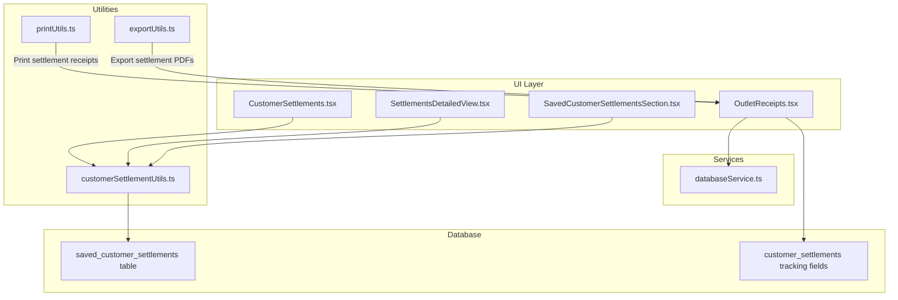
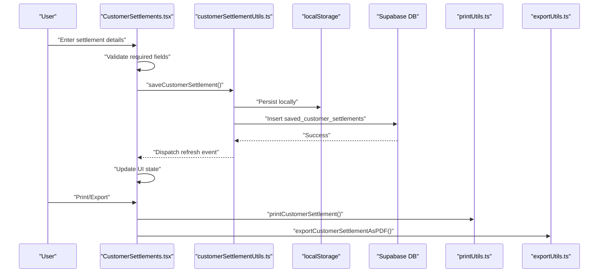
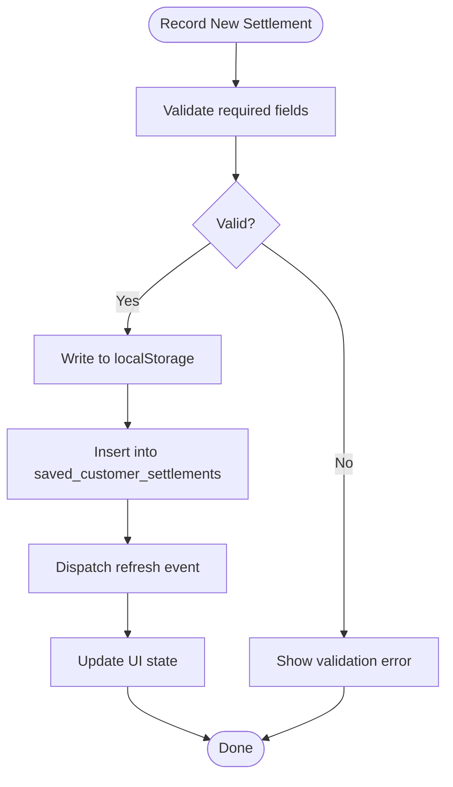
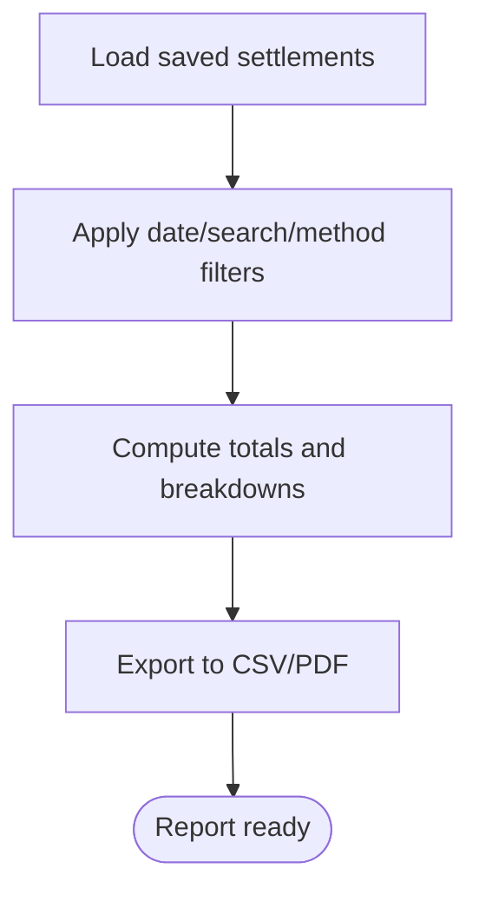
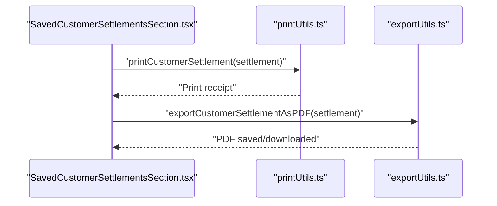
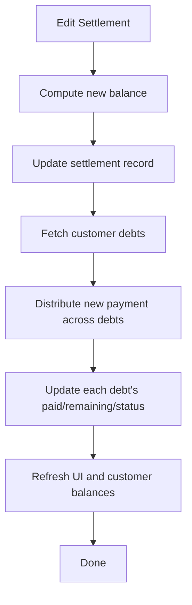
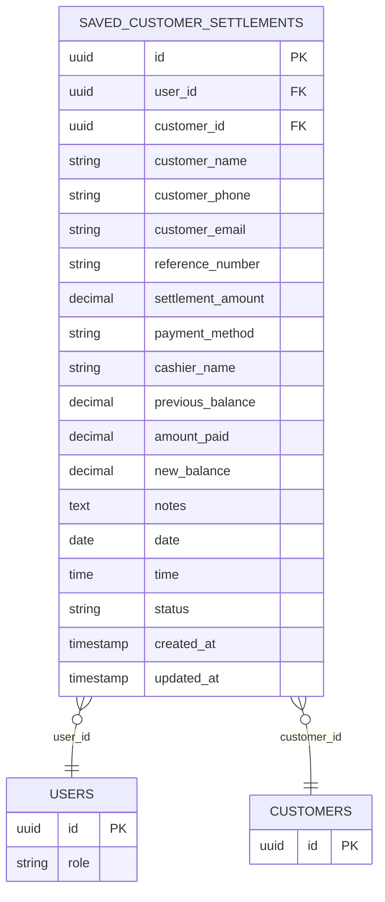
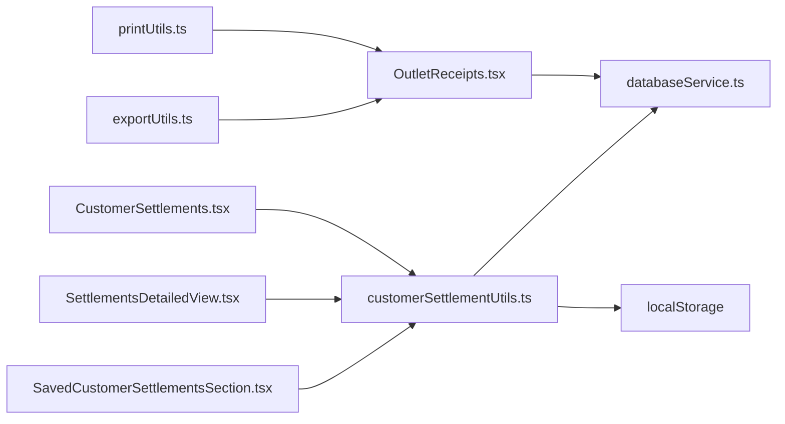

# Customer Settlement Processing

<cite>
**Referenced Files in This Document**
- [CustomerSettlements.tsx](file://src/pages/CustomerSettlements.tsx)
- [customerSettlementUtils.ts](file://src/utils/customerSettlementUtils.ts)
- [SettlementsDetailedView.tsx](file://src/pages/SettlementsDetailedView.tsx)
- [SavedCustomerSettlementsSection.tsx](file://src/components/SavedCustomerSettlementsSection.tsx)
- [printUtils.ts](file://src/utils/printUtils.ts)
- [exportUtils.ts](file://src/utils/exportUtils.ts)
- [OutletReceipts.tsx](file://src/pages/OutletReceipts.tsx)
- [databaseService.ts](file://src/services/databaseService.ts)
- [20251127_create_saved_customer_settlements_table.sql](file://migrations/20251127_create_saved_customer_settlements_table.sql)
- [20260419_add_settlement_tracking_fields.sql](file://migrations/20260419_add_settlement_tracking_fields.sql)
</cite>

## Table of Contents
1. [Introduction](#introduction)
2. [Project Structure](#project-structure)
3. [Core Components](#core-components)
4. [Architecture Overview](#architecture-overview)
5. [Detailed Component Analysis](#detailed-component-analysis)
6. [Dependency Analysis](#dependency-analysis)
7. [Performance Considerations](#performance-considerations)
8. [Troubleshooting Guide](#troubleshooting-guide)
9. [Conclusion](#conclusion)
10. [Appendices](#appendices)

## Introduction
This document explains the customer settlement processing system in Royal POS Modern. It covers how customer payments are recorded, applied to outstanding debts, and confirmed through receipts and settlement summaries. It also documents settlement types (partial payments, full settlements, payment plans), integration points with payment methods (cash, card, mobile money), calculation logic for payment application and balance updates, settlement documentation (receipts, confirmations, summaries), validation and security measures, audit and reconciliation, troubleshooting, and the relationship to financial reporting.

## Project Structure
The settlement processing spans UI pages, utilities, services, and database migrations:
- Pages: Customer settlement capture, detailed analytics, and outlet-specific settlement receipts
- Utilities: Persistence and retrieval of saved settlements with local and remote storage
- Services: Database service interfaces and outlet-level settlement operations
- Migrations: Database schema for saved settlements and settlement tracking fields

**Diagram sources**
- [CustomerSettlements.tsx:59-665](file://src/pages/CustomerSettlements.tsx#L59-L665)
- [SettlementsDetailedView.tsx:29-397](file://src/pages/SettlementsDetailedView.tsx#L29-L397)
- [SavedCustomerSettlementsSection.tsx:30-526](file://src/components/SavedCustomerSettlementsSection.tsx#L30-L526)
- [OutletReceipts.tsx:62-800](file://src/pages/OutletReceipts.tsx#L62-L800)
- [customerSettlementUtils.ts:45-430](file://src/utils/customerSettlementUtils.ts#L45-L430)
- [printUtils.ts:753-800](file://src/utils/printUtils.ts#L753-L800)
- [exportUtils.ts:273-401](file://src/utils/exportUtils.ts#L273-L401)
- [databaseService.ts:365-385](file://src/services/databaseService.ts#L365-L385)
- [20251127_create_saved_customer_settlements_table.sql:5-32](file://migrations/20251127_create_saved_customer_settlements_table.sql#L5-L32)
- [20260419_add_settlement_tracking_fields.sql:6-14](file://migrations/20260419_add_settlement_tracking_fields.sql#L6-L14)

**Section sources**
- [CustomerSettlements.tsx:1-665](file://src/pages/CustomerSettlements.tsx#L1-L665)
- [customerSettlementUtils.ts:1-430](file://src/utils/customerSettlementUtils.ts#L1-L430)
- [SettlementsDetailedView.tsx:1-397](file://src/pages/SettlementsDetailedView.tsx#L1-L397)
- [SavedCustomerSettlementsSection.tsx:1-526](file://src/components/SavedCustomerSettlementsSection.tsx#L1-L526)
- [printUtils.ts:1-800](file://src/utils/printUtils.ts#L1-L800)
- [exportUtils.ts:1-785](file://src/utils/exportUtils.ts#L1-L785)
- [OutletReceipts.tsx:1-800](file://src/pages/OutletReceipts.tsx#L1-L800)
- [databaseService.ts:365-385](file://src/services/databaseService.ts#L365-L385)
- [20251127_create_saved_customer_settlements_table.sql:1-86](file://migrations/20251127_create_saved_customer_settlements_table.sql#L1-L86)
- [20260419_add_settlement_tracking_fields.sql:1-15](file://migrations/20260419_add_settlement_tracking_fields.sql#L1-L15)

## Core Components
- CustomerSettlements page: Captures new customer settlements, validates inputs, and persists to local storage and database. Supports editing and deletion with user-role-aware RLS.
- customerSettlementUtils: Provides CRUD operations for saved settlements with dual persistence (localStorage + Supabase), user-scoped queries, and refresh events.
- SettlementsDetailedView: Aggregates settlement analytics, filters, and exports settlement data.
- SavedCustomerSettlementsSection: Lists saved settlements, supports search/date filters, prints, and exports settlement receipts.
- printUtils: Generates settlement receipts for printing and PDF export.
- exportUtils: Produces settlement PDFs for download and sharing.
- OutletReceipts: Manages outlet-level customer settlement receipts, edits, and debt recalculation across multiple debts.
- databaseService: Defines settlement data model and outlet-level settlement operations.

Key capabilities:
- Settlement recording with payment method and balance fields
- Dual persistence with automatic refresh
- Role-based access control (RLS) for settlement visibility and edits
- Settlement analytics and export
- Professional settlement receipt generation and PDF export
- Outlet-level settlement editing with proportional debt allocation

**Section sources**
- [CustomerSettlements.tsx:59-251](file://src/pages/CustomerSettlements.tsx#L59-L251)
- [customerSettlementUtils.ts:45-362](file://src/utils/customerSettlementUtils.ts#L45-L362)
- [SettlementsDetailedView.tsx:29-127](file://src/pages/SettlementsDetailedView.tsx#L29-L127)
- [SavedCustomerSettlementsSection.tsx:30-195](file://src/components/SavedCustomerSettlementsSection.tsx#L30-L195)
- [printUtils.ts:753-800](file://src/utils/printUtils.ts#L753-L800)
- [exportUtils.ts:273-401](file://src/utils/exportUtils.ts#L273-L401)
- [OutletReceipts.tsx:383-525](file://src/pages/OutletReceipts.tsx#L383-L525)
- [databaseService.ts:365-385](file://src/services/databaseService.ts#L365-L385)

## Architecture Overview
The settlement workflow integrates UI, utilities, services, and database layers with robust validation and dual persistence.

**Diagram sources**
- [CustomerSettlements.tsx:105-167](file://src/pages/CustomerSettlements.tsx#L105-L167)
- [customerSettlementUtils.ts:45-126](file://src/utils/customerSettlementUtils.ts#L45-L126)
- [printUtils.ts:753-800](file://src/utils/printUtils.ts#L753-L800)
- [exportUtils.ts:273-401](file://src/utils/exportUtils.ts#L273-L401)

## Detailed Component Analysis

### Customer Settlement Recording and Management
- Input validation ensures required fields are present before saving.
- Dual persistence writes to localStorage immediately and to Supabase asynchronously.
- Refresh events propagate UI updates across components.
- Role-aware queries enforce that non-admin users can only access their own records.

**Diagram sources**
- [CustomerSettlements.tsx:105-167](file://src/pages/CustomerSettlements.tsx#L105-L167)
- [customerSettlementUtils.ts:45-126](file://src/utils/customerSettlementUtils.ts#L45-L126)

**Section sources**
- [CustomerSettlements.tsx:105-167](file://src/pages/CustomerSettlements.tsx#L105-L167)
- [customerSettlementUtils.ts:45-126](file://src/utils/customerSettlementUtils.ts#L45-L126)

### Settlement Analytics and Export
- Detailed view aggregates totals, averages, and payment method breakdowns.
- Filtering by date range, customer/reference, and payment method.
- Export to CSV and PDF for reporting.

**Diagram sources**
- [SettlementsDetailedView.tsx:40-127](file://src/pages/SettlementsDetailedView.tsx#L40-L127)
- [exportUtils.ts:59-109](file://src/utils/exportUtils.ts#L59-L109)

**Section sources**
- [SettlementsDetailedView.tsx:29-127](file://src/pages/SettlementsDetailedView.tsx#L29-L127)
- [exportUtils.ts:59-109](file://src/utils/exportUtils.ts#L59-L109)

### Settlement Documentation and Receipts
- Printing: Uses a hidden iframe approach for desktop and mobile-friendly QR code generation.
- PDF export: Generates settlement receipts with business header, customer info, settlement details, totals, and footer.
- Tracking fields: cashier, prepared_by, approved_by are supported for auditability.

**Diagram sources**
- [SavedCustomerSettlementsSection.tsx:117-163](file://src/components/SavedCustomerSettlementsSection.tsx#L117-L163)
- [printUtils.ts:753-800](file://src/utils/printUtils.ts#L753-L800)
- [exportUtils.ts:273-401](file://src/utils/exportUtils.ts#L273-L401)

**Section sources**
- [SavedCustomerSettlementsSection.tsx:117-163](file://src/components/SavedCustomerSettlementsSection.tsx#L117-L163)
- [printUtils.ts:753-800](file://src/utils/printUtils.ts#L753-L800)
- [exportUtils.ts:273-401](file://src/utils/exportUtils.ts#L273-L401)
- [20260419_add_settlement_tracking_fields.sql:6-14](file://migrations/20260419_add_settlement_tracking_fields.sql#L6-L14)

### Outlet-Level Settlement Receipts and Debt Allocation
- Creates settlement receipts linked to outlet and customer.
- Edits settlement with recalculation of customer debt across multiple debts.
- Applies payment proportionally to outstanding debts, updating amounts paid, remaining, and status.

**Diagram sources**
- [OutletReceipts.tsx:396-525](file://src/pages/OutletReceipts.tsx#L396-L525)

**Section sources**
- [OutletReceipts.tsx:383-525](file://src/pages/OutletReceipts.tsx#L383-L525)

### Database Schema and Security
- saved_customer_settlements table stores settlement records with user scoping and RLS policies.
- Tracking fields (cashier, prepared_by, approved_by) enhance auditability.
- Role-based access ensures admins can view/edit/delete all records; non-admins are restricted to their own.

**Diagram sources**
- [20251127_create_saved_customer_settlements_table.sql:5-32](file://migrations/20251127_create_saved_customer_settlements_table.sql#L5-L32)
- [databaseService.ts:365-385](file://src/services/databaseService.ts#L365-L385)

**Section sources**
- [20251127_create_saved_customer_settlements_table.sql:1-86](file://migrations/20251127_create_saved_customer_settlements_table.sql#L1-L86)
- [20260419_add_settlement_tracking_fields.sql:1-15](file://migrations/20260419_add_settlement_tracking_fields.sql#L1-L15)
- [databaseService.ts:365-385](file://src/services/databaseService.ts#L365-L385)

## Dependency Analysis
- UI pages depend on customerSettlementUtils for persistence and on databaseService for outlet-level operations.
- Utilities depend on Supabase client and localStorage for dual persistence.
- Print and export utilities are consumed by UI sections for documentation generation.
- Database migrations define the schema and RLS policies that govern access and integrity.

**Diagram sources**
- [CustomerSettlements.tsx:14-14](file://src/pages/CustomerSettlements.tsx#L14-L14)
- [customerSettlementUtils.ts:1-3](file://src/utils/customerSettlementUtils.ts#L1-L3)
- [SettlementsDetailedView.tsx:20-21](file://src/pages/SettlementsDetailedView.tsx#L20-L21)
- [SavedCustomerSettlementsSection.tsx:8-14](file://src/components/SavedCustomerSettlementsSection.tsx#L8-L14)
- [OutletReceipts.tsx:32-32](file://src/pages/OutletReceipts.tsx#L32-L32)
- [printUtils.ts:1-1](file://src/utils/printUtils.ts#L1-L1)
- [exportUtils.ts:1-3](file://src/utils/exportUtils.ts#L1-L3)

**Section sources**
- [CustomerSettlements.tsx:1-14](file://src/pages/CustomerSettlements.tsx#L1-L14)
- [customerSettlementUtils.ts:1-3](file://src/utils/customerSettlementUtils.ts#L1-L3)
- [SettlementsDetailedView.tsx:1-21](file://src/pages/SettlementsDetailedView.tsx#L1-L21)
- [SavedCustomerSettlementsSection.tsx:1-14](file://src/components/SavedCustomerSettlementsSection.tsx#L1-L14)
- [OutletReceipts.tsx:1-32](file://src/pages/OutletReceipts.tsx#L1-L32)
- [printUtils.ts:1-3](file://src/utils/printUtils.ts#L1-L3)
- [exportUtils.ts:1-3](file://src/utils/exportUtils.ts#L1-L3)

## Performance Considerations
- Dual persistence (localStorage + Supabase) improves responsiveness and offline availability; ensure UI refreshes efficiently using event-driven updates.
- Analytics computations (totals, averages, breakdowns) operate on client-side arrays; keep datasets reasonably sized or paginate for large volumes.
- Debts recalculation iterates through customer debts; consider batching updates and limiting to visible/debtor-focused views.
- QR code generation uses CDN-based approach to avoid build-time overhead and improve reliability.

## Troubleshooting Guide
Common issues and resolutions:
- Validation errors on save: Ensure required fields (customer name, amount) are filled before submitting.
- Duplicate or missing records: Dual persistence relies on refresh events; verify event dispatch and listeners are active.
- Role access denied: Non-admin users can only view/update/delete their own settlements; confirm user role and user_id matching.
- Editing settlements: After edits, debt recalculation updates multiple debts; verify that outstanding debts exist and that distribution logic applies correctly.
- Printing/export failures: Confirm mobile/desktop print support and PDF generation paths; check QR code CDN availability.

**Section sources**
- [CustomerSettlements.tsx:105-167](file://src/pages/CustomerSettlements.tsx#L105-L167)
- [customerSettlementUtils.ts:128-254](file://src/utils/customerSettlementUtils.ts#L128-L254)
- [OutletReceipts.tsx:396-525](file://src/pages/OutletReceipts.tsx#L396-L525)
- [printUtils.ts:753-800](file://src/utils/printUtils.ts#L753-L800)
- [exportUtils.ts:273-401](file://src/utils/exportUtils.ts#L273-L401)

## Conclusion
Royal POS Modern’s customer settlement processing provides a robust, user-friendly workflow for recording payments, applying them to outstanding debts, and generating professional receipts and reports. The system leverages dual persistence, role-based access control, and outlet-level operations to ensure accuracy, auditability, and scalability. Integrations with printing and PDF export streamline documentation, while analytics and export capabilities support financial reporting needs.

## Appendices

### Settlement Types and Payment Application
- Full settlement: Payment equals or exceeds outstanding balance; remaining balance becomes zero, and status reflects completion.
- Partial payment: Payment is less than outstanding balance; remaining balance decremented accordingly, and status may be “partial” depending on downstream debt allocation.
- Payment plan arrangements: Managed via multiple debt records per customer; payments are distributed across debts proportionally or oldest-first, updating amounts paid and statuses.

**Section sources**
- [OutletReceipts.tsx:448-499](file://src/pages/OutletReceipts.tsx#L448-L499)

### Settlement Calculation Algorithms
- New balance computation: new_balance = max(0, previous_balance - payment_amount).
- Debt distribution: allocate payment across debts proportionally by total debt amounts until fully applied or no remaining payment.

**Section sources**
- [OutletReceipts.tsx:430-499](file://src/pages/OutletReceipts.tsx#L430-L499)

### Settlement Documentation
- Receipts: Printed via hidden iframe with QR code and settlement details.
- PDFs: Generated with business header, customer info, settlement summary, and footer.
- Tracking fields: cashier, prepared_by, approved_by included for audit trail.

**Section sources**
- [printUtils.ts:753-800](file://src/utils/printUtils.ts#L753-L800)
- [exportUtils.ts:273-401](file://src/utils/exportUtils.ts#L273-L401)
- [20260419_add_settlement_tracking_fields.sql:6-14](file://migrations/20260419_add_settlement_tracking_fields.sql#L6-L14)

### Security and Audit
- RLS policies restrict saved settlements to user scope; admins can access all.
- Tracking fields capture responsible parties for settlement actions.
- Event-driven refresh ensures UI consistency across clients.

**Section sources**
- [20251127_create_saved_customer_settlements_table.sql:34-86](file://migrations/20251127_create_saved_customer_settlements_table.sql#L34-L86)
- [customerSettlementUtils.ts:130-149](file://src/utils/customerSettlementUtils.ts#L130-L149)

### Financial Reporting and Reconciliation
- Settlement analytics enable revenue recognition tracking and receivables monitoring.
- Exported reports support reconciliation against cash, card, and mobile money flows.
- Outlet-level settlement receipts provide granular audit trails for disputes and reconciliations.

**Section sources**
- [SettlementsDetailedView.tsx:72-127](file://src/pages/SettlementsDetailedView.tsx#L72-L127)
- [OutletReceipts.tsx:281-294](file://src/pages/OutletReceipts.tsx#L281-L294)