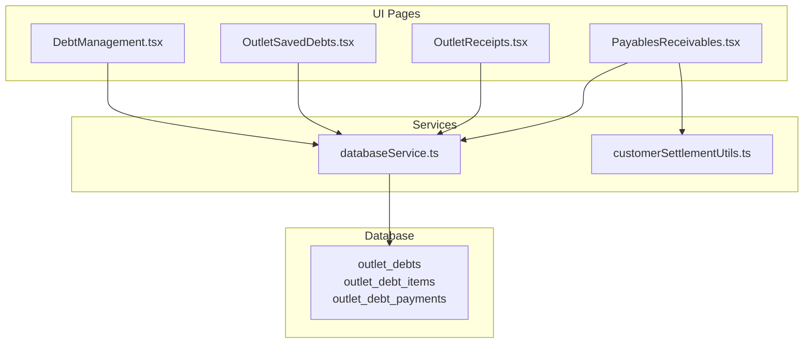
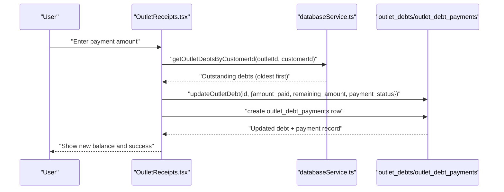
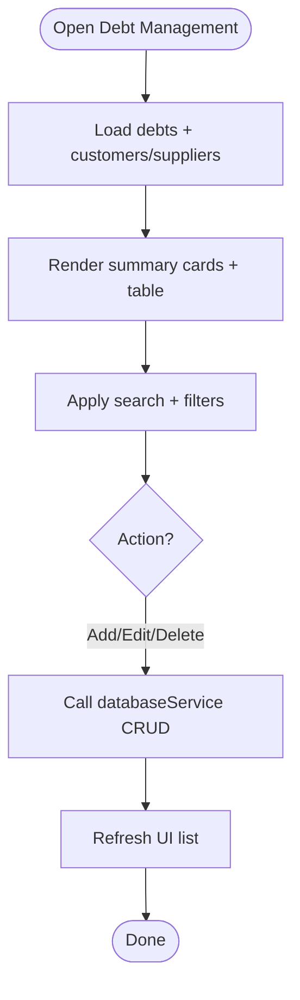
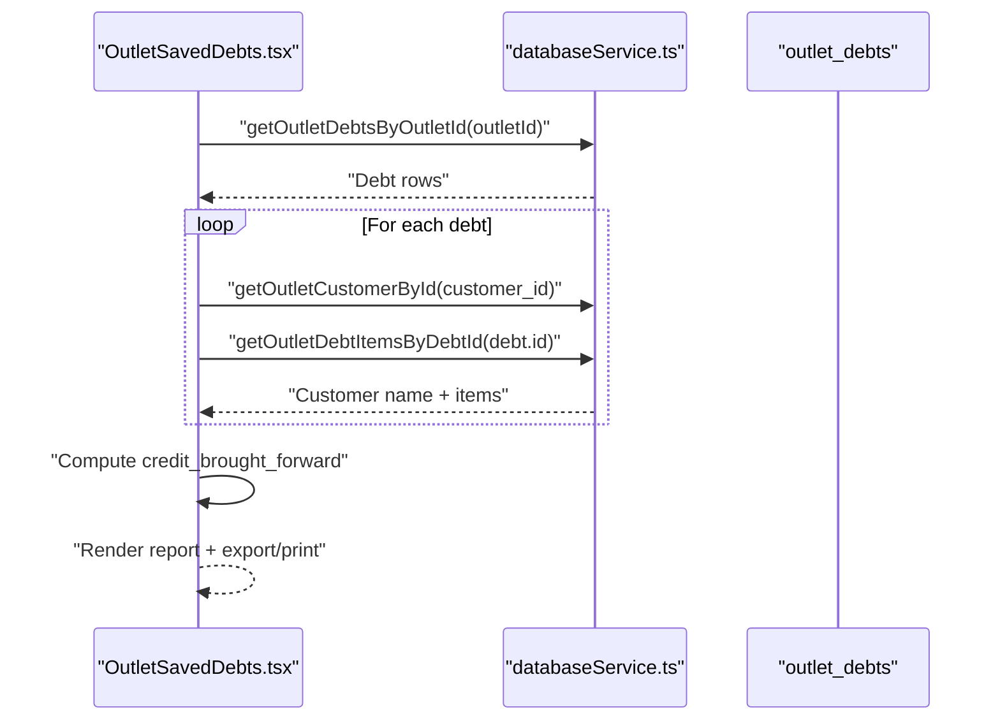
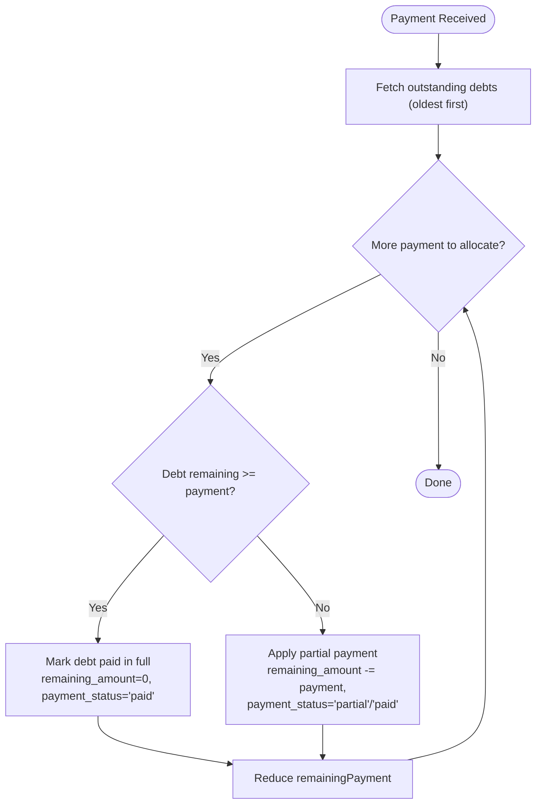
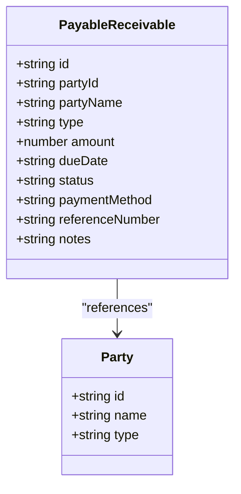
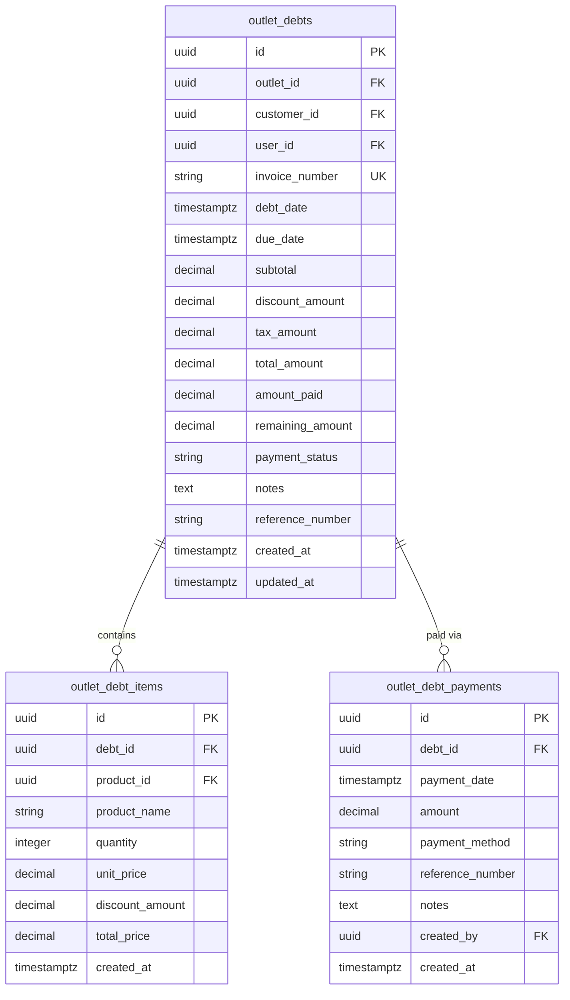
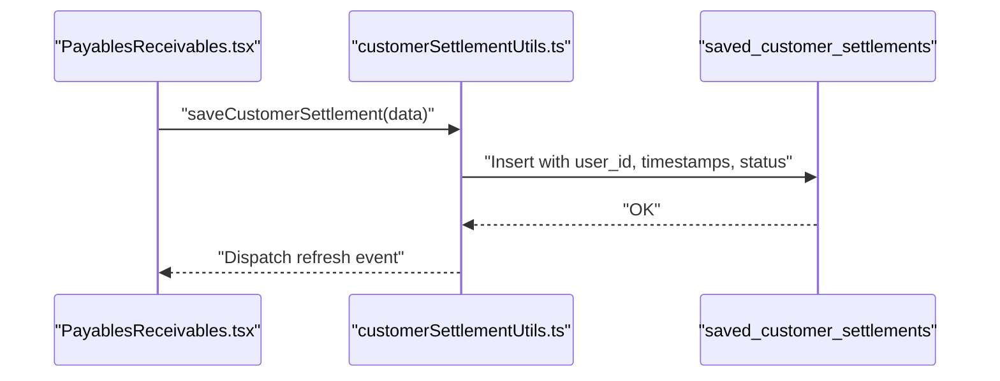
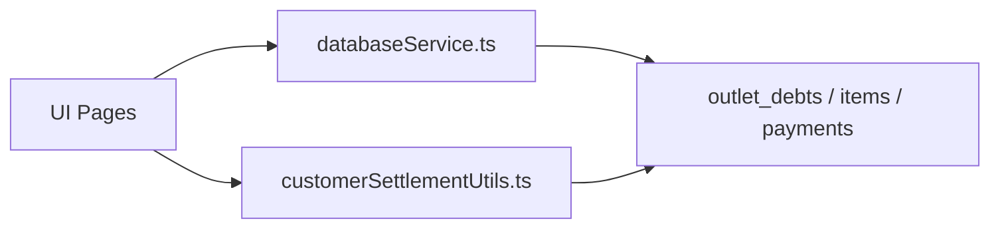

# Debt Management and Collections

<cite>
**Referenced Files in This Document**
- [DebtManagement.tsx](file://src/pages/DebtManagement.tsx)
- [OutletSavedDebts.tsx](file://src/pages/OutletSavedDebts.tsx)
- [OutletReceipts.tsx](file://src/pages/OutletReceipts.tsx)
- [PayablesReceivables.tsx](file://src/pages/PayablesReceivables.tsx)
- [databaseService.ts](file://src/services/databaseService.ts)
- [customerSettlementUtils.ts](file://src/utils/customerSettlementUtils.ts)
- [20260313_create_outlet_debts_table.sql](file://migrations/20260313_create_outlet_debts_table.sql)
- [20260408_create_outlet_debts_table.sql](file://migrations/20260408_create_outlet_debts_table.sql)
- [20260419_add_salesman_driver_truck_to_debts.sql](file://migrations/20260419_add_salesman_driver_truck_to_debts.sql)
- [20260419_add_settlement_tracking_fields.sql](file://migrations/20260419_add_settlement_tracking_fields.sql)
- [20260426_add_credit_brought_forward_to_deliveries.sql](file://migrations/20260426_add_credit_brought_forward_to_deliveries.sql)
- [check_credit_brought_forward.js](file://scripts/check_credit_brought_forward.js)
</cite>

## Table of Contents
1. [Introduction](#introduction)
2. [Project Structure](#project-structure)
3. [Core Components](#core-components)
4. [Architecture Overview](#architecture-overview)
5. [Detailed Component Analysis](#detailed-component-analysis)
6. [Dependency Analysis](#dependency-analysis)
7. [Performance Considerations](#performance-considerations)
8. [Troubleshooting Guide](#troubleshooting-guide)
9. [Conclusion](#conclusion)
10. [Appendices](#appendices)

## Introduction
This document explains the debt management and collections capabilities in Royal POS Modern. It covers how customer credit sales are tracked as receivables, how payment applications against outstanding balances work, and how settlement processing integrates with debt tracking. It also documents reporting and aging views, collection workflows, and best practices for maintaining healthy customer credit relationships.

## Project Structure
The debt management system spans UI pages, services, and database migrations:
- UI pages for debt entry, viewing, and settlement application
- Services for database access and settlement utilities
- Database migrations defining outlet-specific debt tables and indexes

**Diagram sources**
- [DebtManagement.tsx:1-599](file://src/pages/DebtManagement.tsx#L1-599)
- [OutletSavedDebts.tsx:1-800](file://src/pages/OutletSavedDebts.tsx#L1-800)
- [OutletReceipts.tsx:790-989](file://src/pages/OutletReceipts.tsx#L790-989)
- [PayablesReceivables.tsx:1-800](file://src/pages/PayablesReceivables.tsx#L1-800)
- [databaseService.ts:1-200](file://src/services/databaseService.ts#L1-200)
- [20260408_create_outlet_debts_table.sql:1-133](file://migrations/20260408_create_outlet_debts_table.sql#L1-133)

**Section sources**
- [DebtManagement.tsx:1-599](file://src/pages/DebtManagement.tsx#L1-599)
- [OutletSavedDebts.tsx:1-800](file://src/pages/OutletSavedDebts.tsx#L1-800)
- [OutletReceipts.tsx:790-989](file://src/pages/OutletReceipts.tsx#L790-989)
- [PayablesReceivables.tsx:1-800](file://src/pages/PayablesReceivables.tsx#L1-800)
- [databaseService.ts:1-200](file://src/services/databaseService.ts#L1-200)
- [20260408_create_outlet_debts_table.sql:1-133](file://migrations/20260408_create_outlet_debts_table.sql#L1-133)

## Core Components
- Debt entry and management page for manual debt records
- Outlet-specific debt ledger with saved debts, items, and payment history
- Settlement application that applies cash/card/mobile payments to outstanding receivables
- Payables & Receivables summary for cross-party tracking
- Database schema for outlet-level receivables and supporting tables

Key capabilities:
- Track receivables per outlet with customer associations
- Apply partial and full payments to outstanding balances
- Maintain line items and payment history per debt
- Export/print reports for receivables monitoring

**Section sources**
- [DebtManagement.tsx:17-104](file://src/pages/DebtManagement.tsx#L17-104)
- [OutletSavedDebts.tsx:662-749](file://src/pages/OutletSavedDebts.tsx#L662-749)
- [OutletReceipts.tsx:790-885](file://src/pages/OutletReceipts.tsx#L790-885)
- [PayablesReceivables.tsx:32-137](file://src/pages/PayablesReceivables.tsx#L32-137)
- [20260408_create_outlet_debts_table.sql:9-55](file://migrations/20260408_create_outlet_debts_table.sql#L9-55)

## Architecture Overview
The system separates concerns across UI, services, and database:
- UI pages orchestrate user actions (add/edit/delete/search/filter)
- Services abstract database operations and settlement utilities
- Database enforces outlet isolation and maintains payment history

**Diagram sources**
- [OutletReceipts.tsx:790-885](file://src/pages/OutletReceipts.tsx#L790-885)
- [databaseService.ts:1-200](file://src/services/databaseService.ts#L1-200)
- [20260408_create_outlet_debts_table.sql:44-55](file://migrations/20260408_create_outlet_debts_table.sql#L44-55)

## Detailed Component Analysis

### Debt Entry and Monitoring (DebtManagement)
- Supports adding/editing/deleting debt records for customers and suppliers
- Filters by party type and status, with search across party name and description
- Displays summary cards for total outstanding, overdue, and total records
- Integrates with customer/supplier lookup to resolve party names

**Diagram sources**
- [DebtManagement.tsx:48-104](file://src/pages/DebtManagement.tsx#L48-104)
- [DebtManagement.tsx:281-290](file://src/pages/DebtManagement.tsx#L281-290)

**Section sources**
- [DebtManagement.tsx:17-104](file://src/pages/DebtManagement.tsx#L17-104)
- [DebtManagement.tsx:281-290](file://src/pages/DebtManagement.tsx#L281-290)

### Outlet-Specific Debts Ledger (OutletSavedDebts)
- Loads saved debts per outlet, enriches with customer names and item lists
- Calculates credit brought forward from prior debts for the same customer
- Provides print/export/share functionality for receivables reports
- Supports date-range and search filters

**Diagram sources**
- [OutletSavedDebts.tsx:662-749](file://src/pages/OutletSavedDebts.tsx#L662-749)
- [20260426_add_credit_brought_forward_to_deliveries.sql:1-14](file://migrations/20260426_add_credit_brought_forward_to_deliveries.sql#L1-14)

**Section sources**
- [OutletSavedDebts.tsx:662-749](file://src/pages/OutletSavedDebts.tsx#L662-749)
- [20260426_add_credit_brought_forward_to_deliveries.sql:1-14](file://migrations/20260426_add_credit_brought_forward_to_deliveries.sql#L1-14)

### Settlement Application and Payment Scheduling (OutletReceipts)
- Applies incoming payments to outstanding receivables for a customer
- Pays off oldest debts first, switching between full and partial payments
- Updates payment_status and remaining_amount accordingly
- Creates payment records for audit trail

**Diagram sources**
- [OutletReceipts.tsx:790-885](file://src/pages/OutletReceipts.tsx#L790-885)
- [20260408_create_outlet_debts_table.sql:44-55](file://migrations/20260408_create_outlet_debts_table.sql#L44-55)

**Section sources**
- [OutletReceipts.tsx:790-885](file://src/pages/OutletReceipts.tsx#L790-885)
- [20260408_create_outlet_debts_table.sql:44-55](file://migrations/20260408_create_outlet_debts_table.sql#L44-55)

### Payables & Receivables Summary (PayablesReceivables)
- Consolidates customer and supplier settlements into a unified view
- Supports adding/updating/deleting receivable/payable entries
- Provides export/print capabilities for management reporting

**Diagram sources**
- [PayablesReceivables.tsx:32-80](file://src/pages/PayablesReceivables.tsx#L32-80)

**Section sources**
- [PayablesReceivables.tsx:32-137](file://src/pages/PayablesReceivables.tsx#L32-137)

### Database Schema for Debts
The outlet-level debt model includes:
- outlet_debts: header-level debt with totals, paid/remaining, and status
- outlet_debt_items: line items for each debt
- outlet_debt_payments: payment application history

**Diagram sources**
- [20260408_create_outlet_debts_table.sql:9-55](file://migrations/20260408_create_outlet_debts_table.sql#L9-55)

**Section sources**
- [20260313_create_outlet_debts_table.sql:1-50](file://migrations/20260313_create_outlet_debts_table.sql#L1-50)
- [20260408_create_outlet_debts_table.sql:1-133](file://migrations/20260408_create_outlet_debts_table.sql#L1-133)
- [20260419_add_salesman_driver_truck_to_debts.sql:1-1](file://migrations/20260419_add_salesman_driver_truck_to_debts.sql#L1-1)

### Settlement Utilities and Tracking
- Customer settlement utilities support saving, retrieving, updating, and deleting settlement records
- Settlement receipts can include cashier, prepared_by, and approved_by tracking fields
- Local storage fallback ensures continuity during offline or database issues

**Diagram sources**
- [PayablesReceivables.tsx:168-243](file://src/pages/PayablesReceivables.tsx#L168-243)
- [customerSettlementUtils.ts:45-126](file://src/utils/customerSettlementUtils.ts#L45-126)
- [20260419_add_settlement_tracking_fields.sql:1-15](file://migrations/20260419_add_settlement_tracking_fields.sql#L1-15)

**Section sources**
- [customerSettlementUtils.ts:128-254](file://src/utils/customerSettlementUtils.ts#L128-254)
- [20260419_add_settlement_tracking_fields.sql:1-15](file://migrations/20260419_add_settlement_tracking_fields.sql#L1-15)

## Dependency Analysis
- UI pages depend on databaseService for CRUD operations
- OutletReceipts depends on outlet_debts and outlet_debt_payments for payment application
- OutletSavedDebts depends on outlet_debts, outlet_debt_items, and outlet_customers for enrichment
- PayablesReceivables depends on customer/supplier settlement APIs and customerSettlementUtils

**Diagram sources**
- [databaseService.ts:1-200](file://src/services/databaseService.ts#L1-200)
- [OutletReceipts.tsx:790-885](file://src/pages/OutletReceipts.tsx#L790-885)
- [OutletSavedDebts.tsx:662-749](file://src/pages/OutletSavedDebts.tsx#L662-749)
- [PayablesReceivables.tsx:168-243](file://src/pages/PayablesReceivables.tsx#L168-243)
- [customerSettlementUtils.ts:128-254](file://src/utils/customerSettlementUtils.ts#L128-254)

**Section sources**
- [databaseService.ts:1-200](file://src/services/databaseService.ts#L1-200)
- [OutletReceipts.tsx:790-885](file://src/pages/OutletReceipts.tsx#L790-885)
- [OutletSavedDebts.tsx:662-749](file://src/pages/OutletSavedDebts.tsx#L662-749)
- [PayablesReceivables.tsx:168-243](file://src/pages/PayablesReceivables.tsx#L168-243)

## Performance Considerations
- Outlet-level isolation reduces cross-outlet contention and improves scalability
- Indexes on outlet_id, customer_id, due_date, and payment_status optimize queries
- Payment application loops process debts in order; consider batching updates for large portfolios
- Client-side caching and local storage fallback improve resilience during network issues

[No sources needed since this section provides general guidance]

## Troubleshooting Guide
Common issues and resolutions:
- Missing credit_brought_forward column: run the migration and re-check with the diagnostic script
- Settlement tracking fields missing: apply the settlement tracking migration
- Payment not applying: verify customer association and outstanding debt existence
- Reports empty: confirm date range and filters; ensure outlet context is set

**Section sources**
- [20260426_add_credit_brought_forward_to_deliveries.sql:1-14](file://migrations/20260426_add_credit_brought_forward_to_deliveries.sql#L1-14)
- [check_credit_brought_forward.js:22-98](file://scripts/check_credit_brought_forward.js#L22-98)
- [20260419_add_settlement_tracking_fields.sql:1-15](file://migrations/20260419_add_settlement_tracking_fields.sql#L1-15)
- [OutletReceipts.tsx:790-885](file://src/pages/OutletReceipts.tsx#L790-885)

## Conclusion
Royal POS Modern’s debt management system provides robust, outlet-scoped receivables tracking with integrated payment application, settlement utilities, and reporting. By leveraging outlet-level tables, payment histories, and settlement metadata, the system supports efficient collections, accurate aging analysis, and strong audit trails for financial oversight.

[No sources needed since this section summarizes without analyzing specific files]

## Appendices

### Practical Scenarios

- Debt entry and resolution
  - Enter a new debt for a customer with amount, due date, and description
  - Monitor status and aging; mark as paid/partial when settled
  - Use settlement application to apply incoming payments to outstanding balances

- Payment application workflow
  - On receiving payment, select customer and enter amount
  - System pays off oldest debts first; updates remaining amounts and statuses
  - Creates payment records for reconciliation

- Reporting and aging
  - Use OutletSavedDebts to print/export receivables summaries
  - Filter by date range and customer to analyze collections
  - Track credit brought forward to understand cumulative balances

- Bad debt management
  - Mark overdue debts with clear status indicators
  - Review aging trends and escalate collection efforts
  - Document write-offs and adjustments in notes/reference fields

[No sources needed since this section provides general guidance]