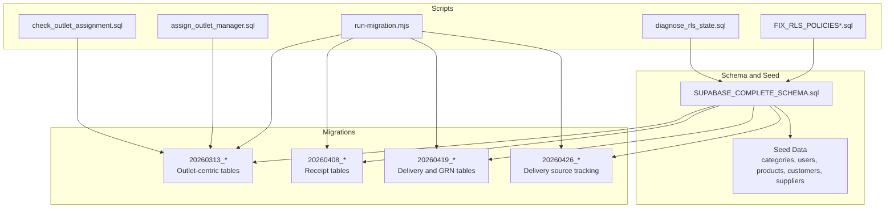
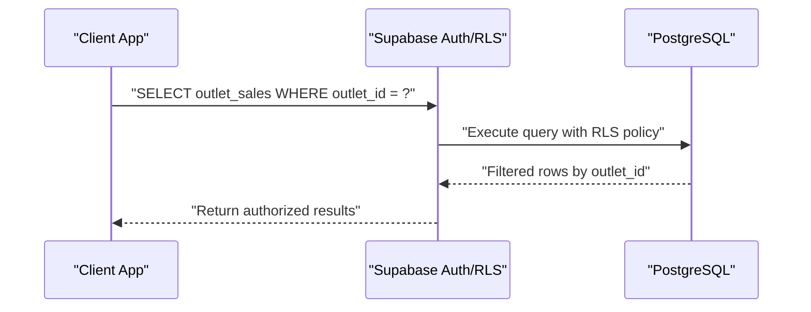
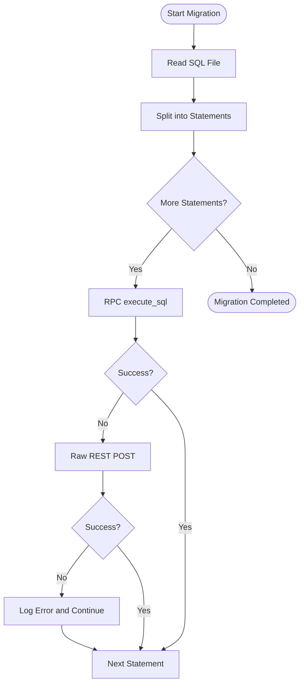
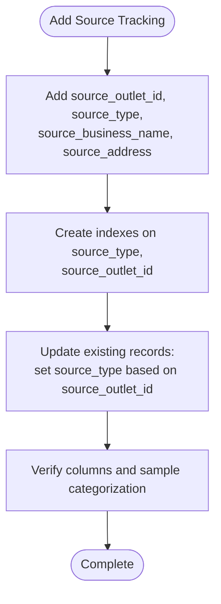
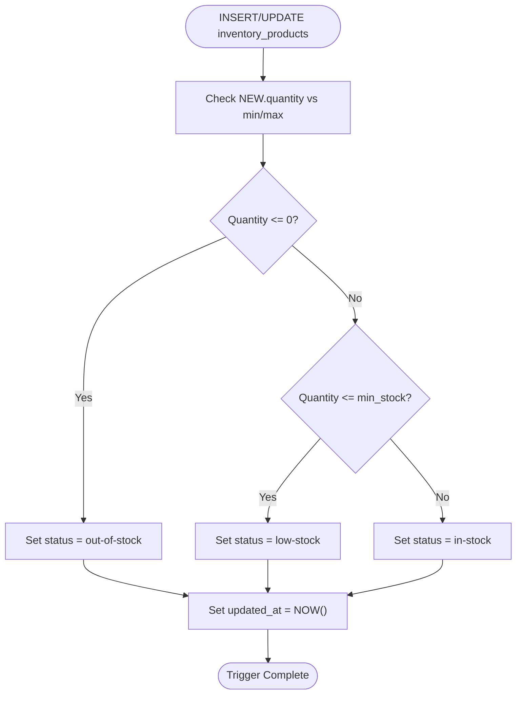
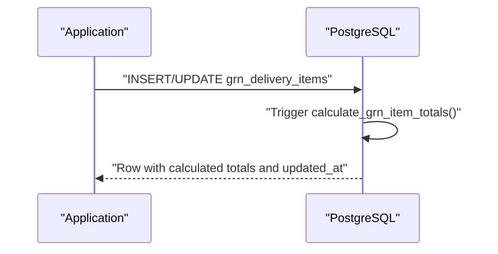
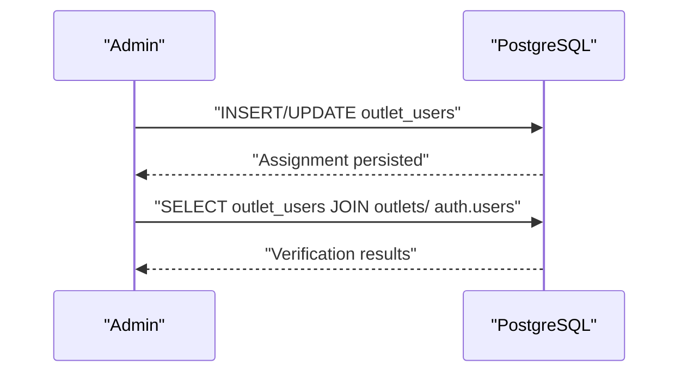
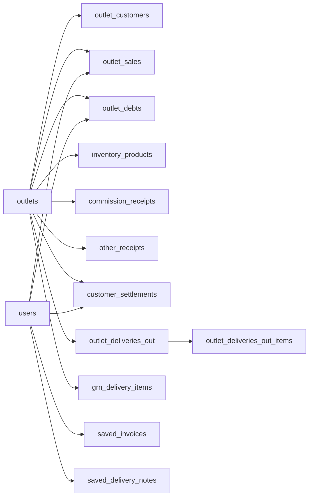

# Database Schema and Migrations

<cite>
**Referenced Files in This Document**
- [SUPABASE_COMPLETE_SCHEMA.sql](file://SUPABASE_COMPLETE_SCHEMA.sql)
- [SUPABASE_SETUP.md](file://SUPABASE_SETUP.md)
- [run-migration.mjs](file://scripts/run-migration.mjs)
- [run-migration.js](file://scripts/run-migration.js)
- [FIX_RLS_POLICIES.sql](file://FIX_RLS_POLICIES.sql)
- [FIX_RLS_POLICIES_COMPLETE.sql](file://FIX_RLS_POLICIES_COMPLETE.sql)
- [diagnose_rls_state.sql](file://scripts/diagnose_rls_state.sql)
- [20260313_create_outlet_sales_table.sql](file://migrations/20260313_create_outlet_sales_table.sql)
- [20260313_create_outlet_customers_table.sql](file://migrations/20260313_create_outlet_customers_table.sql)
- [20260313_create_outlet_debts_table.sql](file://migrations/20260313_create_outlet_debts_table.sql)
- [20260313_create_inventory_products_table.sql](file://migrations/20260313_create_inventory_products_table.sql)
- [20260408_create_receipt_tables.sql](file://migrations/20260408_create_receipt_tables.sql)
- [20260419_create_outlet_deliveries_out_table.sql](file://migrations/20260419_create_outlet_deliveries_out_table.sql)
- [20260419_create_grn_delivery_items_table.sql](file://migrations/20260419_create_grn_delivery_items_table.sql)
- [20260426_add_source_tracking_to_saved_delivery_notes.sql](file://migrations/20260426_add_source_tracking_to_saved_delivery_notes.sql)
- [assign_outlet_manager.sql](file://scripts/assign_outlet_manager.sql)
- [check_outlet_assignment.sql](file://scripts/check_outlet_assignment.sql)
</cite>

## Table of Contents
1. [Introduction](#introduction)
2. [Project Structure](#project-structure)
3. [Core Components](#core-components)
4. [Architecture Overview](#architecture-overview)
5. [Detailed Component Analysis](#detailed-component-analysis)
6. [Dependency Analysis](#dependency-analysis)
7. [Performance Considerations](#performance-considerations)
8. [Troubleshooting Guide](#troubleshooting-guide)
9. [Conclusion](#conclusion)
10. [Appendices](#appendices)

## Introduction
This document provides comprehensive database schema and migration documentation for Royal POS Modern. It explains the complete database architecture, table relationships, data integrity constraints, indexing strategies, and the migration system. It also documents Row Level Security (RLS) policies, multi-outlet data isolation, initialization and seeding, data model evolution, validation rules, referential integrity, performance optimization, backups, and maintenance procedures. Practical examples and troubleshooting guidance are included for schema modifications and database-related issues.

## Project Structure
The database layer consists of:
- A base schema script that defines the core tables, constraints, indexes, and initial seed data.
- A migration system organized under the migrations directory, each file representing a versioned change.
- Scripts to run migrations programmatically and diagnose RLS and outlet assignments.
- Setup documentation for initial Supabase configuration.

**Diagram sources**
- [SUPABASE_COMPLETE_SCHEMA.sql:1-567](file://SUPABASE_COMPLETE_SCHEMA.sql#L1-L567)
- [20260313_create_outlet_sales_table.sql:1-94](file://migrations/20260313_create_outlet_sales_table.sql#L1-L94)
- [20260408_create_receipt_tables.sql:1-306](file://migrations/20260408_create_receipt_tables.sql#L1-L306)
- [20260419_create_outlet_deliveries_out_table.sql:1-110](file://migrations/20260419_create_outlet_deliveries_out_table.sql#L1-L110)
- [20260419_create_grn_delivery_items_table.sql:1-123](file://migrations/20260419_create_grn_delivery_items_table.sql#L1-L123)
- [20260426_add_source_tracking_to_saved_delivery_notes.sql:1-69](file://migrations/20260426_add_source_tracking_to_saved_delivery_notes.sql#L1-L69)
- [run-migration.mjs:1-99](file://scripts/run-migration.mjs#L1-L99)
- [FIX_RLS_POLICIES.sql:1-222](file://FIX_RLS_POLICIES.sql#L1-L222)
- [diagnose_rls_state.sql:1-38](file://scripts/diagnose_rls_state.sql#L1-L38)
- [assign_outlet_manager.sql:1-43](file://scripts/assign_outlet_manager.sql#L1-L43)
- [check_outlet_assignment.sql:1-61](file://scripts/check_outlet_assignment.sql#L1-L61)

**Section sources**
- [SUPABASE_COMPLETE_SCHEMA.sql:1-567](file://SUPABASE_COMPLETE_SCHEMA.sql#L1-L567)
- [SUPABASE_SETUP.md:1-179](file://SUPABASE_SETUP.md#L1-L179)

## Core Components
This section outlines the core database schema and key constraints.

- Users and Roles
  - Table: users
  - Columns: id, username, email, password_hash, first_name, last_name, role, is_active, timestamps
  - Constraints: role enum, unique username/email, active flag
  - Indexes: none explicitly defined; consider adding indexes on email and username for auth-heavy workloads

- Access Logs
  - Table: access_logs
  - Columns: id, user_id (FK), action, description, ip_address, user_agent, timestamps
  - Constraints: FK to users with ON DELETE SET NULL
  - Indexes: idx_access_logs_user, idx_access_logs_date

- Categories
  - Table: categories
  - Columns: id, name, description, timestamps
  - Constraints: unique name

- Products
  - Table: products
  - Columns: id, name, category_id (FK), description, barcode, sku, unit_of_measure, prices, stock levels, flags, timestamps
  - Constraints: unique barcode/sku, enums for unit_of_measure, defaults for numeric fields
  - Indexes: idx_products_barcode, idx_products_sku, idx_products_category

- Suppliers
  - Table: suppliers
  - Columns: id, name, contact info, tax_id, payment_terms, flags, timestamps
  - Indexes: idx_suppliers_email, idx_suppliers_phone

- Customers
  - Table: customers
  - Columns: id, personal info, contact info, identifiers, credit limit, tax_id, flags, timestamps
  - Indexes: idx_customers_email, idx_customers_phone

- Discounts and Relationships
  - Table: discounts
  - Columns: id, name, code, description, type/value limits, dates, flags, usage tracking
  - Many-to-many via discount_products (product_id) and discount_categories (category_id)
  - Constraints: discount_type enum, apply_to enum, date range checks

- Sales and Returns
  - Table: sales
  - Columns: id, customer_id, user_id, invoice_number, timestamps, amounts, statuses, notes, references
  - Constraints: payment_status enum, sale_status enum
  - Table: sale_items
  - Columns: id, sale_id (FK), product_id (FK), quantities, pricing, timestamps
  - Table: returns
  - Columns: id, related identifiers, return_date, reason, status, amounts, refund details, notes, timestamps
  - Table: return_items
  - Columns: id, return_id (FK), original item linkage, product_id (FK), quantities, pricing, reason, timestamps

- Debts and Settlements
  - Table: debts
  - Columns: id, customer/supplier linkage, type, amount, description, due_date, status
  - Tables: customer_settlements, supplier_settlements
  - Columns: id, customer/supplier linkage, user_id, amounts, payment_method, reference, timestamps

- Expenses and Reports
  - Table: expenses
  - Columns: id, user_id, category, description, amount, payment_method, expense_date, receipt_url, flags, notes, timestamps
  - Table: reports
  - Columns: id, user_id, report_type, title, description, date range, file_url, status, timestamps

- Assets and Transactions
  - Table: assets
  - Columns: id, user_id, name, description, category, purchase info, valuation, status, identifiers, notes, timestamps
  - Table: asset_transactions
  - Columns: id, asset_id (FK), user_id, transaction_type, date, amounts, VAT fields, description, identifiers, timestamps
  - Indexes: user/category/status, transaction_type/date

- Saved Invoices and Delivery Notes
  - Table: saved_invoices
  - Columns: id, user_id (FK), invoice_number, date, customer, counts, totals, payment method, status, structured items, business info, timestamps
  - Table: saved_delivery_notes
  - Columns: id, user_id (FK), delivery note number, date, customer, counts, totals, payment method, status, items list, logistics, timestamps
  - RLS: enabled with policies restricting access to owner only

- Outlet-Centric Model (Isolation)
  - Table: outlets
  - Columns: id, name, contact info, address, manager identifiers, status, timestamps
  - Tables: outlet_customers, outlet_sales, outlet_sale_items, outlet_debts
  - Constraints: outlet_id FKs, unique constraints per outlet for name/SKU, enums for statuses
  - Indexes: outlet_id, status, identifiers

- Receipt Tables
  - Tables: commission_receipts, other_receipts, customer_settlements
  - Columns: outlet_id (FK), invoice_number, dates, amounts, payment methods, notes, created_by, timestamps
  - Indexes: outlet_id, date, customer/type
  - RLS: policies for admins and authenticated users

- Delivery and GRN
  - Table: outlet_deliveries_out and items
  - Columns: identifiers, outlet_id (FK), delivery metadata, items, logistics, timestamps
  - Table: grn_delivery_items
  - Columns: identifiers, delivery_id, outlet_id (FK), product info, quantities, costs/prices/gains, timestamps
  - Triggers: auto-calculation of totals and status updates

- Indexes and Constraints
  - Extensive indexes on foreign keys and frequently filtered columns
  - Generated columns for computed totals
  - Check constraints for positive values and enums
  - Unique constraints per outlet for product identity

**Section sources**
- [SUPABASE_COMPLETE_SCHEMA.sql:1-567](file://SUPABASE_COMPLETE_SCHEMA.sql#L1-L567)
- [20260313_create_outlet_sales_table.sql:1-94](file://migrations/20260313_create_outlet_sales_table.sql#L1-L94)
- [20260313_create_outlet_customers_table.sql:1-53](file://migrations/20260313_create_outlet_customers_table.sql#L1-L53)
- [20260313_create_outlet_debts_table.sql:1-50](file://migrations/20260313_create_outlet_debts_table.sql#L1-L50)
- [20260313_create_inventory_products_table.sql:1-61](file://migrations/20260313_create_inventory_products_table.sql#L1-L61)
- [20260408_create_receipt_tables.sql:1-306](file://migrations/20260408_create_receipt_tables.sql#L1-L306)
- [20260419_create_outlet_deliveries_out_table.sql:1-110](file://migrations/20260419_create_outlet_deliveries_out_table.sql#L1-L110)
- [20260419_create_grn_delivery_items_table.sql:1-123](file://migrations/20260419_create_grn_delivery_items_table.sql#L1-L123)

## Architecture Overview
The database architecture separates shared system data from outlet-specific data to achieve multi-outlet isolation. Shared entities (users, categories, suppliers, products) are complemented by outlet-centric tables (customers, sales, debts, receipts, inventory). RLS policies and outlet_id FKs enforce data isolation. Migrations evolve the schema while preserving backward compatibility.

```mermaid
graph TB
Users["users"] --> AccessLogs["access_logs"]
Categories["categories"] --> Products["products"]
Suppliers["suppliers"] --> Debts["debts"]
Customers["customers"] --> Sales["sales"]
Sales --> SaleItems["sale_items"]
Returns["returns"] --> ReturnItems["return_items"]
subgraph "Outlet Isolation"
Outlets["outlets"]
OutletCustomers["outlet_customers"]
OutletSales["outlet_sales"]
OutletSaleItems["outlet_sale_items"]
OutletDebts["outlet_debts"]
InventoryProducts["inventory_products"]
CommissionReceipts["commission_receipts"]
OtherReceipts["other_receipts"]
CustomerSettlements["customer_settlements"]
OutletDeliveriesOut["outlet_deliveries_out"]
OutletDeliveriesOutItems["outlet_deliveries_out_items"]
GrnDeliveryItems["grn_delivery_items"]
end
Outlets --> OutletCustomers
Outlets --> OutletSales
Outlets --> OutletDebts
Outlets --> InventoryProducts
Outlets --> CommissionReceipts
Outlets --> OtherReceipts
Outlets --> CustomerSettlements
Outlets --> OutletDeliveriesOut
OutletDeliveriesOut --> OutletDeliveriesOutItems
Outlets --> GrnDeliveryItems
Products -. shared .-> OutletSaleItems
OutletCustomers -. outlet-scoped .-> OutletSales
OutletCustomers -. outlet-scoped .-> OutletDebts
OutletCustomers -. outlet-scoped .-> CustomerSettlements
```

**Diagram sources**
- [SUPABASE_COMPLETE_SCHEMA.sql:1-567](file://SUPABASE_COMPLETE_SCHEMA.sql#L1-L567)
- [20260313_create_outlet_sales_table.sql:1-94](file://migrations/20260313_create_outlet_sales_table.sql#L1-L94)
- [20260313_create_outlet_customers_table.sql:1-53](file://migrations/20260313_create_outlet_customers_table.sql#L1-L53)
- [20260313_create_outlet_debts_table.sql:1-50](file://migrations/20260313_create_outlet_debts_table.sql#L1-L50)
- [20260313_create_inventory_products_table.sql:1-61](file://migrations/20260313_create_inventory_products_table.sql#L1-L61)
- [20260408_create_receipt_tables.sql:1-306](file://migrations/20260408_create_receipt_tables.sql#L1-L306)
- [20260419_create_outlet_deliveries_out_table.sql:1-110](file://migrations/20260419_create_outlet_deliveries_out_table.sql#L1-L110)
- [20260419_create_grn_delivery_items_table.sql:1-123](file://migrations/20260419_create_grn_delivery_items_table.sql#L1-L123)

## Detailed Component Analysis

### Multi-Outlet Data Isolation and RLS
- Outlet-centric tables (outlet_customers, outlet_sales, outlet_debts, inventory_products, receipts, deliveries) include outlet_id as a mandatory FK and often unique constraints scoped to outlet_id.
- RLS policies are applied to outlet tables to restrict visibility and manipulation to authenticated users; policies commonly allow viewing/inserting/updating/deleting for authenticated users, with admin privileges elevated in receipt tables.
- Saved invoices and delivery notes are secured with RLS policies that restrict access to the record owner (user_id).

**Diagram sources**
- [20260313_create_outlet_sales_table.sql:49-87](file://migrations/20260313_create_outlet_sales_table.sql#L49-L87)
- [20260408_create_receipt_tables.sql:55-87](file://migrations/20260408_create_receipt_tables.sql#L55-L87)
- [SUPABASE_COMPLETE_SCHEMA.sql:519-555](file://SUPABASE_COMPLETE_SCHEMA.sql#L519-L555)

**Section sources**
- [20260313_create_outlet_customers_table.sql:1-53](file://migrations/20260313_create_outlet_customers_table.sql#L1-L53)
- [20260313_create_outlet_sales_table.sql:1-94](file://migrations/20260313_create_outlet_sales_table.sql#L1-L94)
- [20260313_create_outlet_debts_table.sql:1-50](file://migrations/20260313_create_outlet_debts_table.sql#L1-L50)
- [20260313_create_inventory_products_table.sql:1-61](file://migrations/20260313_create_inventory_products_table.sql#L1-L61)
- [20260408_create_receipt_tables.sql:1-306](file://migrations/20260408_create_receipt_tables.sql#L1-L306)
- [20260419_create_outlet_deliveries_out_table.sql:1-110](file://migrations/20260419_create_outlet_deliveries_out_table.sql#L1-L110)
- [20260419_create_grn_delivery_items_table.sql:1-123](file://migrations/20260419_create_grn_delivery_items_table.sql#L1-L123)
- [SUPABASE_COMPLETE_SCHEMA.sql:519-555](file://SUPABASE_COMPLETE_SCHEMA.sql#L519-L555)

### Migration System and Version Control
- Migrations are stored as dated SQL files under the migrations directory. Each file encapsulates a single logical change (schema additions, indexes, triggers, RLS adjustments).
- A Node.js runner script executes SQL files against Supabase using RPC execute_sql and falls back to a raw REST endpoint when necessary.
- A separate migration script adds VAT and depreciation columns to assets and asset_transactions tables.

**Diagram sources**
- [run-migration.mjs:22-88](file://scripts/run-migration.mjs#L22-L88)

**Section sources**
- [run-migration.mjs:1-99](file://scripts/run-migration.mjs#L1-L99)
- [run-migration.js:1-54](file://scripts/run-migration.js#L1-L54)

### Delivery Source Tracking and Business Evolution
- The saved_delivery_notes table was extended with source tracking columns (source_outlet_id, source_type, source_business_name, source_address) to distinguish inter-outlet transfers versus investment-originated deliveries.
- Indexes were added for efficient filtering by source_type and source_outlet_id.
- Existing records are updated to categorize deliveries based on the presence of source_outlet_id.

**Diagram sources**
- [20260426_add_source_tracking_to_saved_delivery_notes.sql:1-69](file://migrations/20260426_add_source_tracking_to_saved_delivery_notes.sql#L1-L69)

**Section sources**
- [20260426_add_source_tracking_to_saved_delivery_notes.sql:1-69](file://migrations/20260426_add_source_tracking_to_saved_delivery_notes.sql#L1-L69)

### Inventory Products and Status Automation
- The inventory_products table stores outlet-specific inventory with generated columns for total cost and total price.
- A trigger updates the status based on quantity thresholds (in-stock, low-stock, out-of-stock) and timestamps.

**Diagram sources**
- [20260313_create_inventory_products_table.sql:41-61](file://migrations/20260313_create_inventory_products_table.sql#L41-L61)

**Section sources**
- [20260313_create_inventory_products_table.sql:1-61](file://migrations/20260313_create_inventory_products_table.sql#L1-L61)

### GRN Delivery Items and Totals Calculation
- The grn_delivery_items table captures detailed product information for GRN deliveries with computed totals and gains.
- A trigger calculates total_cost, total_price, unit_gain, and total_gain before insert/update and refreshes updated_at.

**Diagram sources**
- [20260419_create_grn_delivery_items_table.sql:95-123](file://migrations/20260419_create_grn_delivery_items_table.sql#L95-L123)

**Section sources**
- [20260419_create_grn_delivery_items_table.sql:1-123](file://migrations/20260419_create_grn_delivery_items_table.sql#L1-L123)

### Outlet Manager Assignment and Diagnostics
- Outlet managers are assigned via the outlet_users table linking outlet_id and user_id with a role and active flag.
- Diagnostic scripts help verify RLS state, trigger definitions, and outlet-user assignments.

**Diagram sources**
- [assign_outlet_manager.sql:17-28](file://scripts/assign_outlet_manager.sql#L17-L28)
- [check_outlet_assignment.sql:24-50](file://scripts/check_outlet_assignment.sql#L24-L50)

**Section sources**
- [assign_outlet_manager.sql:1-43](file://scripts/assign_outlet_manager.sql#L1-L43)
- [check_outlet_assignment.sql:1-61](file://scripts/check_outlet_assignment.sql#L1-L61)
- [diagnose_rls_state.sql:1-38](file://scripts/diagnose_rls_state.sql#L1-L38)

## Dependency Analysis
- Foreign Keys
  - Outlet tables consistently reference outlets(id) with ON DELETE CASCADE.
  - Outlet sales reference outlet_customers(id) with ON DELETE SET NULL.
  - Outlet debts reference outlet_customers(id) with ON DELETE CASCADE.
  - Receipt tables reference outlets(id) with ON DELETE CASCADE.
  - GRN and delivery items reference outlets(id) with ON DELETE CASCADE.
  - Saved invoices/delivery notes reference users(id) with ON DELETE CASCADE.
- Indexes
  - Heavy use of indexes on foreign keys and frequently filtered columns (status, date, outlet_id).
- Triggers and Functions
  - Auto-updated timestamps and computed totals via triggers.
- RLS
  - Applied to outlet tables and saved invoices/delivery notes to enforce ownership and access control.

**Diagram sources**
- [SUPABASE_COMPLETE_SCHEMA.sql:1-567](file://SUPABASE_COMPLETE_SCHEMA.sql#L1-L567)
- [20260313_create_outlet_sales_table.sql:1-94](file://migrations/20260313_create_outlet_sales_table.sql#L1-L94)
- [20260408_create_receipt_tables.sql:1-306](file://migrations/20260408_create_receipt_tables.sql#L1-L306)
- [20260419_create_outlet_deliveries_out_table.sql:1-110](file://migrations/20260419_create_outlet_deliveries_out_table.sql#L1-L110)
- [20260419_create_grn_delivery_items_table.sql:1-123](file://migrations/20260419_create_grn_delivery_items_table.sql#L1-L123)

**Section sources**
- [SUPABASE_COMPLETE_SCHEMA.sql:1-567](file://SUPABASE_COMPLETE_SCHEMA.sql#L1-L567)

## Performance Considerations
- Indexes
  - Maintain indexes on foreign keys and frequently filtered columns (e.g., outlet_id, status, date).
  - Consider composite indexes for common query patterns (e.g., outlet_id + status, outlet_id + date).
- Generated Columns
  - Use generated columns for computed totals to avoid application-side duplication and ensure consistency.
- Triggers
  - Keep triggers minimal and efficient; avoid heavy computations inside triggers.
- RLS Overhead
  - RLS adds overhead; ensure policies are selective and leverage indexes.
- Vacuum and Analyze
  - Schedule regular maintenance to update statistics and reclaim space.
- Backup and Restore
  - Use Supabase’s built-in backup features and test restore procedures regularly.
- Monitoring
  - Monitor slow queries and long-running transactions; adjust indexes and constraints accordingly.

[No sources needed since this section provides general guidance]

## Troubleshooting Guide
- RLS Misconfiguration
  - Use the diagnostic script to check RLS state, existing policies, and trigger definitions.
  - Apply the RLS fix scripts to reset policies if needed.
- Migration Failures
  - Use the migration runner to execute SQL files; it attempts RPC execute_sql and falls back to REST.
  - Review errors logged during execution and continue with subsequent statements.
- Outlet Assignment Issues
  - Use the assignment diagnostics to verify outlet manager assignments and user metadata.
  - Correct assignments via the assign manager script.
- Delivery Source Tracking
  - Confirm that source tracking columns exist and indexes are present.
  - Re-run the migration to update existing records if needed.

**Section sources**
- [diagnose_rls_state.sql:1-38](file://scripts/diagnose_rls_state.sql#L1-L38)
- [FIX_RLS_POLICIES.sql:1-222](file://FIX_RLS_POLICIES.sql#L1-L222)
- [FIX_RLS_POLICIES_COMPLETE.sql:1-297](file://FIX_RLS_POLICIES_COMPLETE.sql#L1-L297)
- [run-migration.mjs:1-99](file://scripts/run-migration.mjs#L1-L99)
- [assign_outlet_manager.sql:1-43](file://scripts/assign_outlet_manager.sql#L1-L43)
- [check_outlet_assignment.sql:1-61](file://scripts/check_outlet_assignment.sql#L1-L61)
- [20260426_add_source_tracking_to_saved_delivery_notes.sql:1-69](file://migrations/20260426_add_source_tracking_to_saved_delivery_notes.sql#L1-L69)

## Conclusion
Royal POS Modern employs a robust, outlet-isolated database schema with comprehensive RLS policies, extensive indexing, and a versioned migration system. The schema supports multi-outlet operations, automated computed fields, and detailed audit trails. The documented procedures for migrations, diagnostics, and troubleshooting ensure reliable evolution and maintenance of the database over time.

[No sources needed since this section summarizes without analyzing specific files]

## Appendices

### Appendix A: Initial Setup Checklist
- Create Supabase project and configure environment variables.
- Run the base schema and seed data.
- Enable RLS and apply policies as needed.
- Initialize outlet tables and assign managers.
- Execute migrations in chronological order.

**Section sources**
- [SUPABASE_SETUP.md:1-179](file://SUPABASE_SETUP.md#L1-L179)
- [SUPABASE_COMPLETE_SCHEMA.sql:1-567](file://SUPABASE_COMPLETE_SCHEMA.sql#L1-L567)

### Appendix B: Example Migration Workflow
- Prepare migration file under migrations/.
- Execute with the migration runner.
- Verify indexes, constraints, and RLS policies.
- Rollback plan: maintain reverse migration scripts or use Supabase’s version control features.

**Section sources**
- [run-migration.mjs:1-99](file://scripts/run-migration.mjs#L1-L99)