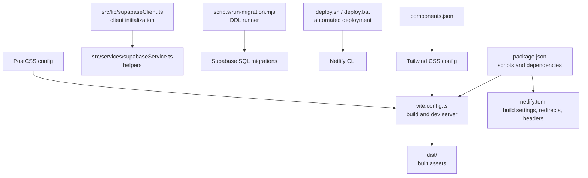
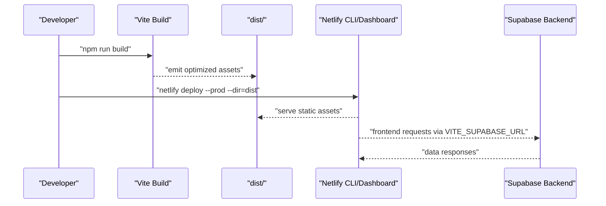
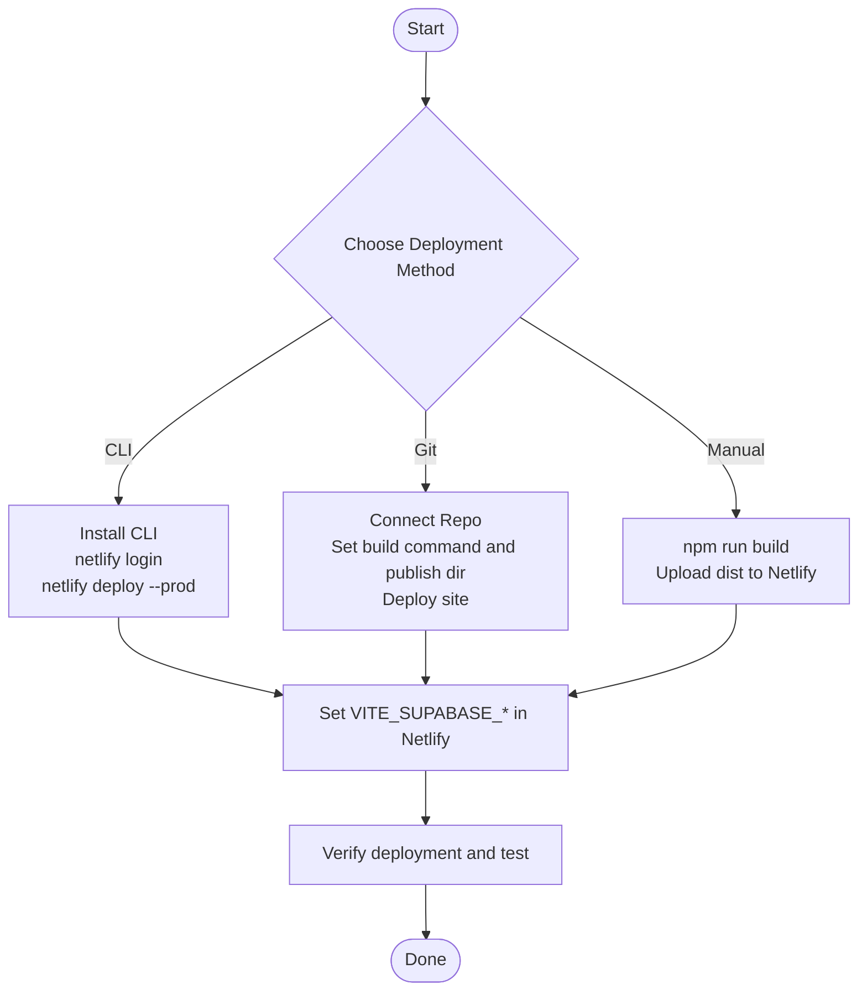
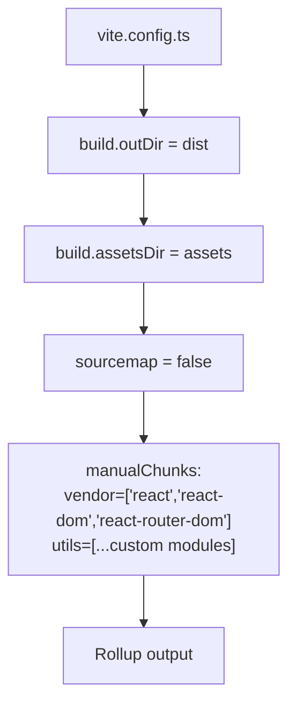
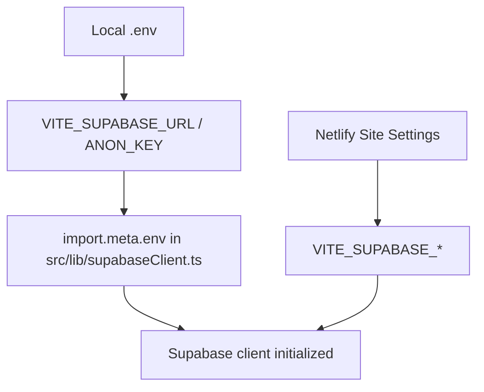
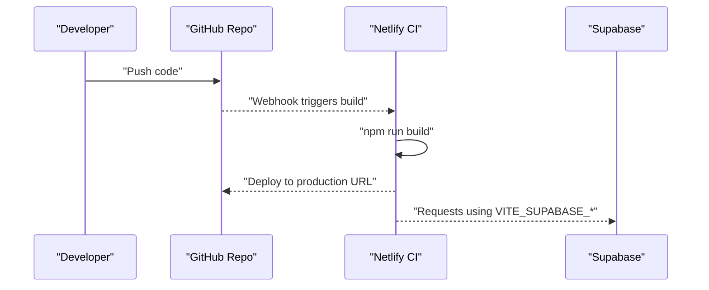
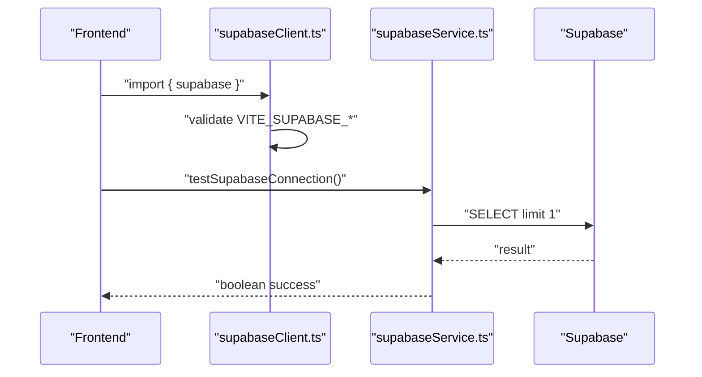
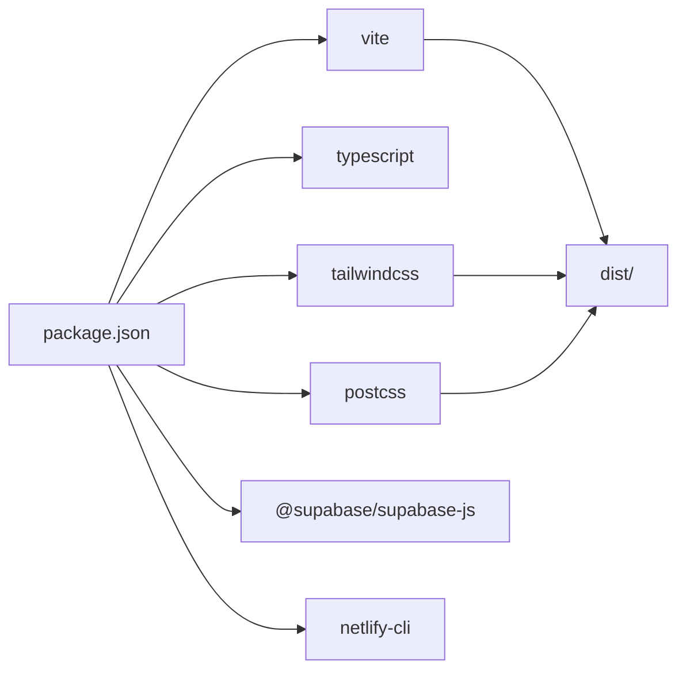

# Deployment and DevOps

<cite>
**Referenced Files in This Document**
- [DEPLOYMENT_NETLIFY.md](file://DEPLOYMENT_NETLIFY.md)
- [netlify.toml](file://netlify.toml)
- [package.json](file://package.json)
- [vite.config.ts](file://vite.config.ts)
- [deploy.sh](file://deploy.sh)
- [deploy.bat](file://deploy.bat)
- [src/lib/supabaseClient.ts](file://src/lib/supabaseClient.ts)
- [src/services/supabaseService.ts](file://src/services/supabaseService.ts)
- [SUPABASE_SETUP.md](file://SUPABASE_SETUP.md)
- [scripts/run-migration.mjs](file://scripts/run-migration.mjs)
- [scripts/run-migration.js](file://scripts/run-migration.js)
- [README.md](file://README.md)
- [tailwind.config.ts](file://tailwind.config.ts)
- [postcss.config.js](file://postcss.config.js)
- [components.json](file://components.json)
- [tsconfig.json](file://tsconfig.json)
- [eslint.config.js](file://eslint.config.js)
</cite>

## Table of Contents
1. [Introduction](#introduction)
2. [Project Structure](#project-structure)
3. [Core Components](#core-components)
4. [Architecture Overview](#architecture-overview)
5. [Detailed Component Analysis](#detailed-component-analysis)
6. [Dependency Analysis](#dependency-analysis)
7. [Performance Considerations](#performance-considerations)
8. [Troubleshooting Guide](#troubleshooting-guide)
9. [Conclusion](#conclusion)
10. [Appendices](#appendices)

## Introduction
This document provides comprehensive deployment and DevOps guidance for Royal POS Modern, focusing on Netlify hosting as the recommended platform. It covers automated deployment via Netlify CLI, manual deployment procedures, build configuration with Vite optimization, environment variable management for production (including Supabase), CI/CD pipeline setup ideas, automated testing integration, production environment requirements, performance optimization, monitoring, domain and SSL configuration, CDN integration, rollback and disaster recovery, maintenance schedules, and practical deployment workflows with troubleshooting.

## Project Structure
The project is a Vite + React + TypeScript application with Supabase integration. Key deployment-related artifacts include:
- Build and runtime configuration: Vite, Tailwind CSS, PostCSS
- Hosting configuration: Netlify configuration and deployment scripts
- Supabase client and service utilities
- Migration scripts for database schema updates
- Package scripts for local and CI builds

**Diagram sources**
- [package.json:1-95](file://package.json#L1-L95)
- [vite.config.ts:1-33](file://vite.config.ts#L1-L33)
- [netlify.toml:1-26](file://netlify.toml#L1-L26)
- [src/lib/supabaseClient.ts:1-33](file://src/lib/supabaseClient.ts#L1-L33)
- [src/services/supabaseService.ts:1-60](file://src/services/supabaseService.ts#L1-L60)
- [scripts/run-migration.mjs:1-99](file://scripts/run-migration.mjs#L1-L99)
- [deploy.sh:1-21](file://deploy.sh#L1-L21)
- [deploy.bat:1-18](file://deploy.bat#L1-L18)
- [tailwind.config.ts:1-118](file://tailwind.config.ts#L1-L118)
- [postcss.config.js:1-7](file://postcss.config.js#L1-L7)
- [components.json:1-20](file://components.json#L1-L20)

**Section sources**
- [package.json:1-95](file://package.json#L1-L95)
- [vite.config.ts:1-33](file://vite.config.ts#L1-L33)
- [netlify.toml:1-26](file://netlify.toml#L1-L26)
- [src/lib/supabaseClient.ts:1-33](file://src/lib/supabaseClient.ts#L1-L33)
- [src/services/supabaseService.ts:1-60](file://src/services/supabaseService.ts#L1-L60)
- [scripts/run-migration.mjs:1-99](file://scripts/run-migration.mjs#L1-L99)
- [scripts/run-migration.js:1-54](file://scripts/run-migration.js#L1-L54)
- [deploy.sh:1-21](file://deploy.sh#L1-L21)
- [deploy.bat:1-18](file://deploy.bat#L1-L18)
- [tailwind.config.ts:1-118](file://tailwind.config.ts#L1-L118)
- [postcss.config.js:1-7](file://postcss.config.js#L1-L7)
- [components.json:1-20](file://components.json#L1-L20)
- [tsconfig.json:1-20](file://tsconfig.json#L1-L20)
- [eslint.config.js:1-30](file://eslint.config.js#L1-L30)

## Core Components
- Build and optimization: Vite configuration defines output directory, asset directory, sourcemaps, and Rollup chunk splitting for vendor and utility bundles.
- Hosting and routing: Netlify configuration sets the publish directory, development command, redirects to SPA fallback, and security headers.
- Environment variables: Supabase URL and anonymous key are consumed via Vite’s import.meta.env with VITE_ prefix.
- Deployment automation: Shell and batch scripts wrap Netlify CLI for automated deployments.
- Supabase integration: Client initialization validates environment variables and enables session persistence and auto-refresh.
- Database migrations: Migration runners use Supabase RPC and REST endpoints to apply SQL scripts.

**Section sources**
- [vite.config.ts:19-33](file://vite.config.ts#L19-L33)
- [netlify.toml:1-26](file://netlify.toml#L1-L26)
- [src/lib/supabaseClient.ts:4-31](file://src/lib/supabaseClient.ts#L4-L31)
- [deploy.sh:8-21](file://deploy.sh#L8-L21)
- [deploy.bat:4-18](file://deploy.bat#L4-L18)
- [src/services/supabaseService.ts:4-23](file://src/services/supabaseService.ts#L4-L23)
- [scripts/run-migration.mjs:22-99](file://scripts/run-migration.mjs#L22-L99)

## Architecture Overview
The deployment pipeline integrates local development, build, and Netlify hosting with Supabase backend connectivity.

**Diagram sources**
- [package.json:8-11](file://package.json#L8-L11)
- [vite.config.ts:20-32](file://vite.config.ts#L20-L32)
- [netlify.toml:1-7](file://netlify.toml#L1-L7)
- [src/lib/supabaseClient.ts:4-31](file://src/lib/supabaseClient.ts#L4-L31)

## Detailed Component Analysis

### Netlify Deployment Options
- Netlify CLI automated deployment: Installs CLI globally, builds the project, and deploys to production with a specified directory.
- Git-based continuous deployment: Connects a repository, sets build command and publish directory, enabling automatic rebuilds on pushes.
- Manual deployment: Builds locally and uploads the dist folder to Netlify.

**Diagram sources**
- [DEPLOYMENT_NETLIFY.md:12-55](file://DEPLOYMENT_NETLIFY.md#L12-L55)
- [README.md:90-116](file://README.md#L90-L116)
- [netlify.toml:1-7](file://netlify.toml#L1-L7)

**Section sources**
- [DEPLOYMENT_NETLIFY.md:12-55](file://DEPLOYMENT_NETLIFY.md#L12-L55)
- [README.md:90-116](file://README.md#L90-L116)
- [deploy.sh:8-21](file://deploy.sh#L8-L21)
- [deploy.bat:4-18](file://deploy.bat#L4-L18)

### Build Configuration with Vite
- Output and assets: dist as outDir, assetsDir under dist.
- Sourcemaps disabled for production builds.
- Rollup chunk splitting separates vendor libraries and utility modules to improve caching and load performance.
- Development server configured for host and port.

**Diagram sources**
- [vite.config.ts:20-32](file://vite.config.ts#L20-L32)

**Section sources**
- [vite.config.ts:20-32](file://vite.config.ts#L20-L32)

### Environment Variable Management
- Frontend reads Supabase URL and anonymous key via VITE_SUPABASE_URL and VITE_SUPABASE_ANON_KEY.
- Validation logs indicate missing or placeholder values during client initialization.
- Netlify environment variables must be set in the site settings under “Environment variables”.

**Diagram sources**
- [src/lib/supabaseClient.ts:4-31](file://src/lib/supabaseClient.ts#L4-L31)
- [netlify.toml:8-11](file://netlify.toml#L8-L11)
- [DEPLOYMENT_NETLIFY.md:56-68](file://DEPLOYMENT_NETLIFY.md#L56-L68)

**Section sources**
- [src/lib/supabaseClient.ts:4-31](file://src/lib/supabaseClient.ts#L4-L31)
- [netlify.toml:8-11](file://netlify.toml#L8-L11)
- [DEPLOYMENT_NETLIFY.md:56-68](file://DEPLOYMENT_NETLIFY.md#L56-L68)

### CI/CD Pipeline Setup
- Recommended approach: Use Netlify’s Git integration for continuous deployment. Configure build command and publish directory in Netlify.
- Optional: Extend with automated testing in CI (e.g., lint and build checks) prior to triggering Netlify builds.
- Secrets management: Store Supabase keys in Netlify environment variables; avoid committing secrets to the repository.

**Diagram sources**
- [netlify.toml:1-7](file://netlify.toml#L1-L7)
- [package.json:8-11](file://package.json#L8-L11)
- [src/lib/supabaseClient.ts:4-31](file://src/lib/supabaseClient.ts#L4-L31)

**Section sources**
- [netlify.toml:1-7](file://netlify.toml#L1-L7)
- [package.json:8-11](file://package.json#L8-L11)

### Automated Testing Integration
- Linting and type checking are supported via ESLint and TypeScript configurations.
- Recommended: Integrate lint and build verification in CI before Netlify deployment to catch issues early.

**Section sources**
- [eslint.config.js:1-30](file://eslint.config.js#L1-L30)
- [tsconfig.json:1-20](file://tsconfig.json#L1-L20)

### Supabase Database Setup and Connectivity
- Supabase client initializes with URL and anonymous key, validates presence, and enables session persistence and auto-refresh.
- Supabase service exposes helpers to test connectivity and perform basic CRUD operations.
- Migration scripts demonstrate applying SQL changes using Supabase RPC and REST endpoints.

**Diagram sources**
- [src/lib/supabaseClient.ts:4-31](file://src/lib/supabaseClient.ts#L4-L31)
- [src/services/supabaseService.ts:4-23](file://src/services/supabaseService.ts#L4-L23)

**Section sources**
- [src/lib/supabaseClient.ts:4-31](file://src/lib/supabaseClient.ts#L4-L31)
- [src/services/supabaseService.ts:4-23](file://src/services/supabaseService.ts#L4-L23)
- [SUPABASE_SETUP.md:156-163](file://SUPABASE_SETUP.md#L156-L163)

### Domain Configuration, SSL, and CDN
- Custom domains: Configure DNS to point to Netlify and add the domain in Netlify’s domain settings.
- SSL: Netlify provisions and renews certificates automatically for custom domains.
- CDN: Netlify serves assets via its global CDN; ensure cache-friendly headers and chunking are enabled.

**Section sources**
- [README.md:188-197](file://README.md#L188-L197)
- [netlify.toml:14-26](file://netlify.toml#L14-L26)

### Rollback Procedures and Disaster Recovery
- Rollback: Use Netlify’s deploys history to revert to a previous successful build.
- Disaster recovery: Maintain Supabase backups and keep environment variables secure. Reconfigure environment variables and redeploy if needed.

**Section sources**
- [DEPLOYMENT_NETLIFY.md:94-101](file://DEPLOYMENT_NETLIFY.md#L94-L101)

### Maintenance Schedules
- Routine tasks: Review Supabase logs, monitor Netlify build status, update dependencies periodically, and validate Supabase connectivity.
- Database maintenance: Apply migrations using the provided scripts and verify schema changes.

**Section sources**
- [scripts/run-migration.mjs:22-99](file://scripts/run-migration.mjs#L22-L99)
- [scripts/run-migration.js:12-54](file://scripts/run-migration.js#L12-L54)

## Dependency Analysis
- Build-time dependencies: Vite, React, TypeScript, Tailwind CSS, PostCSS, and related plugins.
- Runtime dependencies: Supabase client, React Query, and UI libraries.
- Netlify-specific: netlify-cli for automated deployment.

**Diagram sources**
- [package.json:13-92](file://package.json#L13-L92)
- [vite.config.ts:1-33](file://vite.config.ts#L1-L33)
- [tailwind.config.ts:1-118](file://tailwind.config.ts#L1-L118)
- [postcss.config.js:1-7](file://postcss.config.js#L1-L7)

**Section sources**
- [package.json:13-92](file://package.json#L13-L92)

## Performance Considerations
- Bundle splitting: Vendor and utility chunks reduce initial payload and improve caching.
- Asset output: Place assets under a dedicated assetsDir within dist.
- Sourcemaps: Disabled in production to reduce bundle size.
- SPA routing: Netlify redirect to index.html ensures deep links work correctly.
- Security headers: X-Frame-Options, X-XSS-Protection, X-Content-Type-Options, Referrer-Policy are applied.

**Section sources**
- [vite.config.ts:20-32](file://vite.config.ts#L20-L32)
- [netlify.toml:14-26](file://netlify.toml#L14-L26)

## Troubleshooting Guide
- Build failures: Confirm scripts match package.json, verify Node.js version, and ensure dependencies are installed.
- Environment variables not applied: Ensure variables are prefixed with VITE_, set in Netlify, and redeploy after changes.
- Database connection issues: Validate Supabase credentials, confirm RLS policies, and ensure the project is reachable.

**Section sources**
- [DEPLOYMENT_NETLIFY.md:76-93](file://DEPLOYMENT_NETLIFY.md#L76-L93)
- [src/lib/supabaseClient.ts:10-17](file://src/lib/supabaseClient.ts#L10-L17)

## Conclusion
Royal POS Modern is designed for straightforward deployment to Netlify with robust build optimization and Supabase integration. By following the documented deployment options, managing environment variables securely, and leveraging Netlify’s Git integration, teams can achieve reliable, automated deployments with strong performance and security posture.

## Appendices

### Appendix A: Netlify Configuration Reference
- Build settings and redirects: publish directory, SPA fallback, security headers.
- Environment template variables for Supabase.

**Section sources**
- [netlify.toml:1-26](file://netlify.toml#L1-L26)

### Appendix B: Supabase Setup Reference
- Environment variables for local development and production.
- Connection testing and troubleshooting tips.

**Section sources**
- [SUPABASE_SETUP.md:156-163](file://SUPABASE_SETUP.md#L156-L163)
- [src/services/supabaseService.ts:4-23](file://src/services/supabaseService.ts#L4-L23)

### Appendix C: Migration Scripts Reference
- Migration runner using Supabase RPC and REST endpoints.
- Legacy migration script for specific schema updates.

**Section sources**
- [scripts/run-migration.mjs:22-99](file://scripts/run-migration.mjs#L22-L99)
- [scripts/run-migration.js:12-54](file://scripts/run-migration.js#L12-L54)