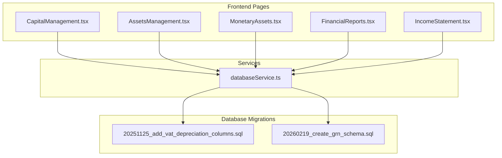
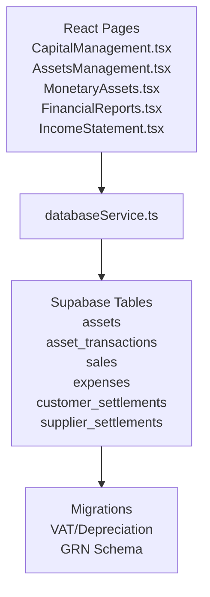
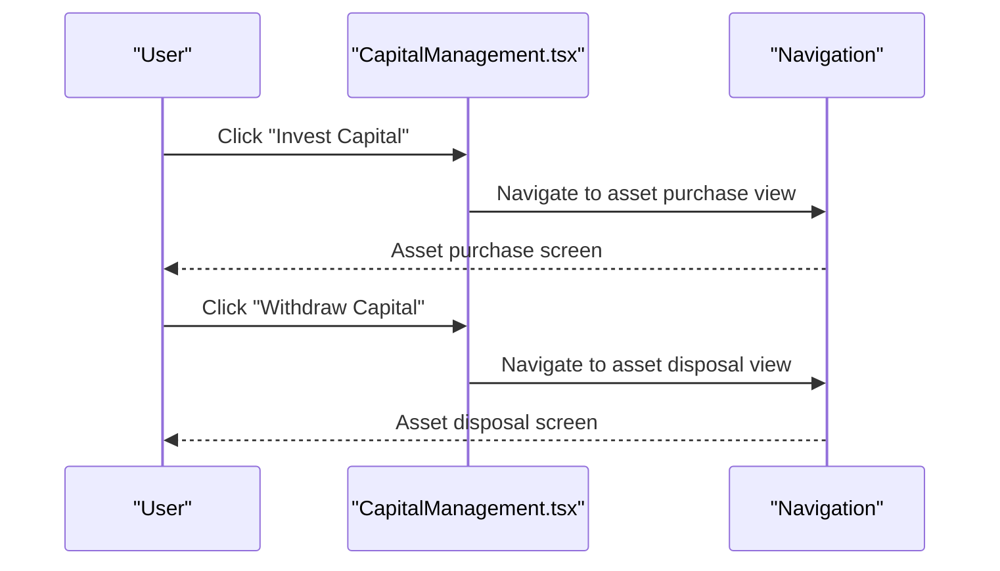
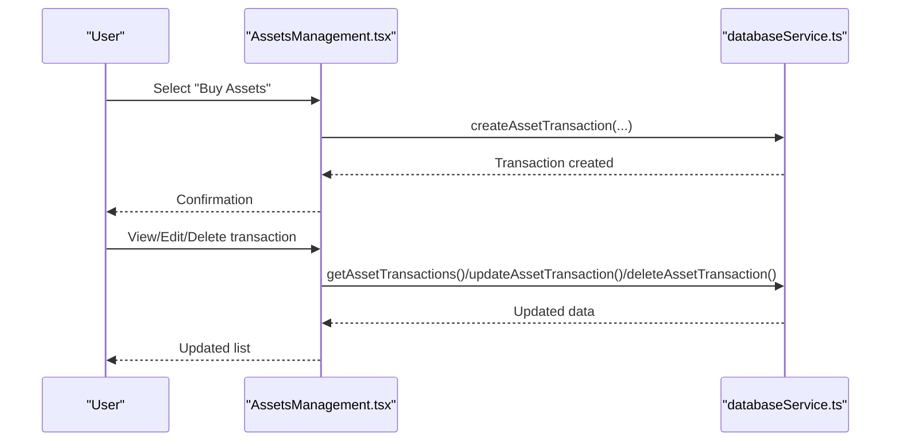
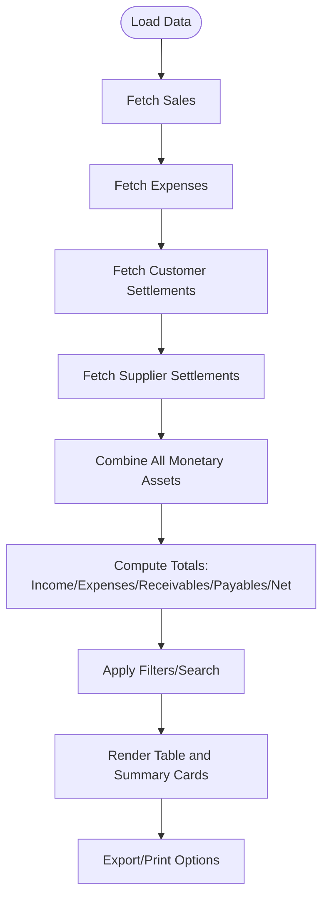
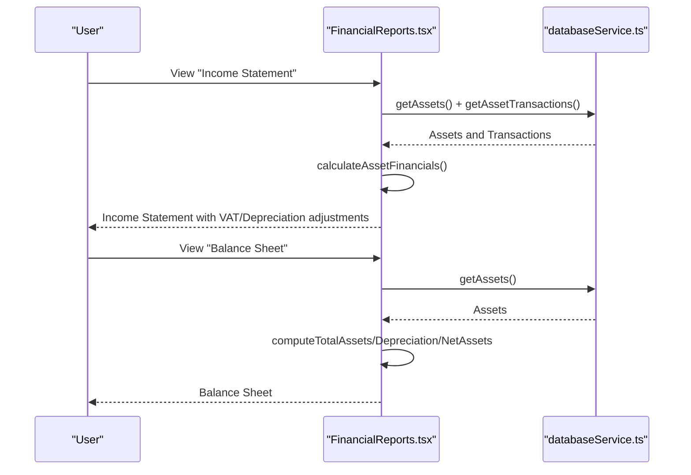
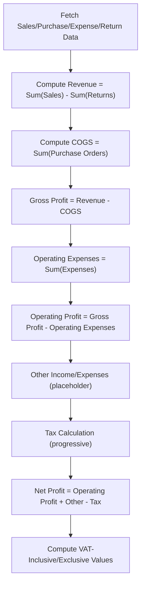
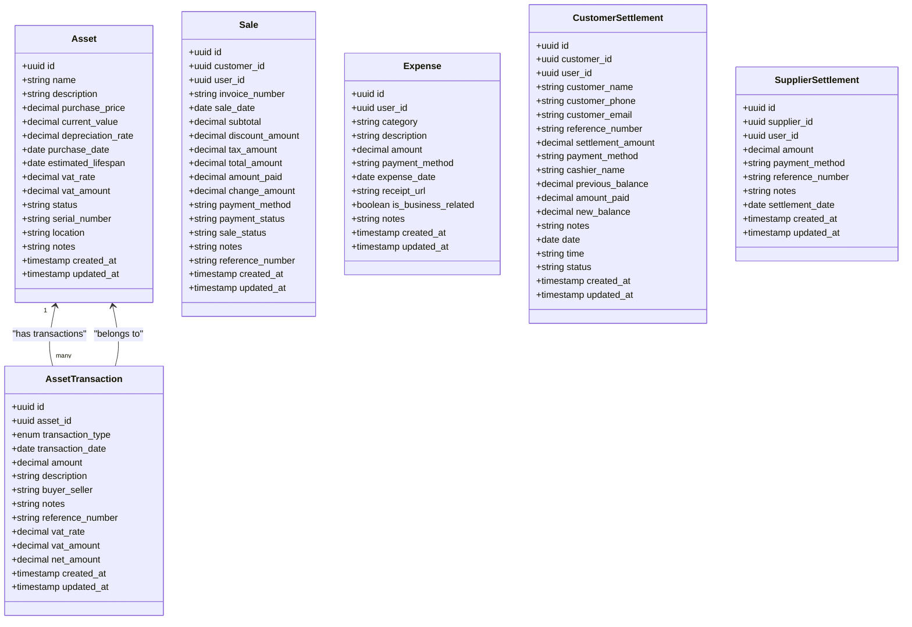
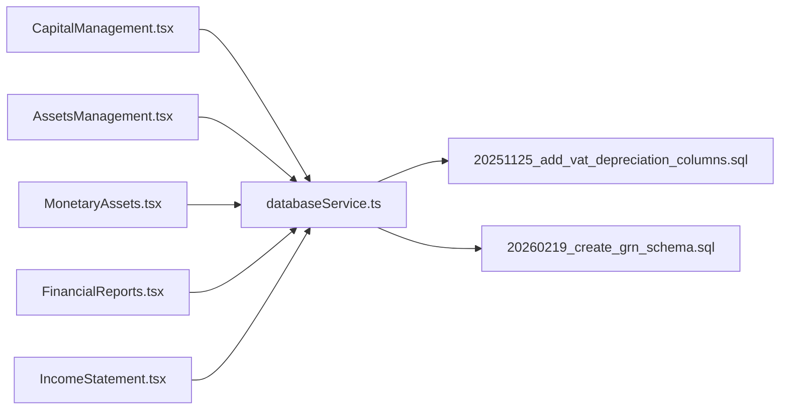

# Capital and Asset Management

<cite>
**Referenced Files in This Document**
- [CapitalManagement.tsx](file://src/pages/CapitalManagement.tsx)
- [AssetsManagement.tsx](file://src/pages/AssetsManagement.tsx)
- [MonetaryAssets.tsx](file://src/pages/MonetaryAssets.tsx)
- [FinancialReports.tsx](file://src/pages/FinancialReports.tsx)
- [IncomeStatement.tsx](file://src/pages/IncomeStatement.tsx)
- [databaseService.ts](file://src/services/databaseService.ts)
- [20251125_add_vat_depreciation_columns.sql](file://migrations/20251125_add_vat_depreciation_columns.sql)
- [20260219_create_grn_schema.sql](file://migrations/20260219_create_grn_schema.sql)
</cite>

## Table of Contents
1. [Introduction](#introduction)
2. [Project Structure](#project-structure)
3. [Core Components](#core-components)
4. [Architecture Overview](#architecture-overview)
5. [Detailed Component Analysis](#detailed-component-analysis)
6. [Dependency Analysis](#dependency-analysis)
7. [Performance Considerations](#performance-considerations)
8. [Troubleshooting Guide](#troubleshooting-guide)
9. [Conclusion](#conclusion)

## Introduction
This document explains the capital and asset management system within the Royal POS Modern application. It covers the complete capital tracking workflow from asset acquisition through depreciation and disposal, asset registration processes, valuation methods, lifecycle management, monetary asset tracking, cash flow management, investment monitoring, capital structure reporting, and financial planning integration. Practical examples illustrate asset entry scenarios, depreciation calculations, and capital allocation strategies, along with guidance on asset utilization tracking, maintenance scheduling, and impairment testing.

## Project Structure
The capital and asset management functionality spans several frontend pages and backend services:
- Capital Management: Provides dashboards for capital operations (investment and withdrawal) and summary cards for capital metrics.
- Assets Management: Manages asset acquisitions, disposals, adjustments, and maintains a transaction history.
- Monetary Assets: Tracks income, expenses, receivables, payables, and net position with filtering and export capabilities.
- Financial Reports: Generates financial statements including income statements and balance sheets, integrating asset financials such as VAT and depreciation.
- Income Statement: Calculates revenue, COGS, gross profit, operating expenses, and net profit with VAT-exclusive/inclusive breakdowns.
- Database Services: Defines data models and provides CRUD operations for assets, asset transactions, sales, expenses, and settlements.
- Migrations: Schema updates to support VAT and depreciation tracking on assets and asset transactions.

**Diagram sources**
- [CapitalManagement.tsx:19-132](file://src/pages/CapitalManagement.tsx#L19-L132)
- [AssetsManagement.tsx:28-482](file://src/pages/AssetsManagement.tsx#L28-L482)
- [MonetaryAssets.tsx:31-658](file://src/pages/MonetaryAssets.tsx#L31-L658)
- [FinancialReports.tsx:70-800](file://src/pages/FinancialReports.tsx#L70-L800)
- [IncomeStatement.tsx:63-593](file://src/pages/IncomeStatement.tsx#L63-L593)
- [databaseService.ts:1-800](file://src/services/databaseService.ts#L1-L800)
- [20251125_add_vat_depreciation_columns.sql:1-16](file://migrations/20251125_add_vat_depreciation_columns.sql#L1-L16)
- [20260219_create_grn_schema.sql:1-97](file://migrations/20260219_create_grn_schema.sql#L1-L97)

**Section sources**
- [CapitalManagement.tsx:19-132](file://src/pages/CapitalManagement.tsx#L19-L132)
- [AssetsManagement.tsx:28-482](file://src/pages/AssetsManagement.tsx#L28-L482)
- [MonetaryAssets.tsx:31-658](file://src/pages/MonetaryAssets.tsx#L31-L658)
- [FinancialReports.tsx:70-800](file://src/pages/FinancialReports.tsx#L70-L800)
- [IncomeStatement.tsx:63-593](file://src/pages/IncomeStatement.tsx#L63-L593)
- [databaseService.ts:1-800](file://src/services/databaseService.ts#L1-L800)
- [20251125_add_vat_depreciation_columns.sql:1-16](file://migrations/20251125_add_vat_depreciation_columns.sql#L1-L16)
- [20260219_create_grn_schema.sql:1-97](file://migrations/20260219_create_grn_schema.sql#L1-L97)

## Core Components
- Capital Management Dashboard: Presents total capital, invested capital, and available capital with interactive actions for capital investment and withdrawal.
- Assets Management: Supports buying, selling, disposing, adjusting assets, and viewing transaction history with edit/view/delete capabilities.
- Monetary Assets Tracking: Aggregates sales, expenses, customer settlements, and supplier settlements into a unified monetary asset ledger with search, filter, and export features.
- Financial Reporting: Produces income statements and balance sheets, incorporating VAT and depreciation derived from asset data.
- Income Statement Calculation: Computes revenue, COGS, gross profit, operating expenses, other income/expenses, tax, and net profit with VAT-exclusive/inclusive breakdowns.
- Database Layer: Provides typed interfaces and CRUD operations for assets, asset transactions, sales, expenses, and settlements, enabling robust data management.

**Section sources**
- [CapitalManagement.tsx:19-132](file://src/pages/CapitalManagement.tsx#L19-L132)
- [AssetsManagement.tsx:28-482](file://src/pages/AssetsManagement.tsx#L28-L482)
- [MonetaryAssets.tsx:31-658](file://src/pages/MonetaryAssets.tsx#L31-L658)
- [FinancialReports.tsx:70-800](file://src/pages/FinancialReports.tsx#L70-L800)
- [IncomeStatement.tsx:63-593](file://src/pages/IncomeStatement.tsx#L63-L593)
- [databaseService.ts:1-800](file://src/services/databaseService.ts#L1-L800)

## Architecture Overview
The system follows a layered architecture:
- Presentation Layer: React pages handle user interactions and render dashboards and reports.
- Service Layer: databaseService.ts encapsulates Supabase interactions and exposes typed functions for data operations.
- Data Layer: Supabase-backed tables with migrations ensuring schema alignment for assets, asset transactions, sales, expenses, and settlements.

**Diagram sources**
- [CapitalManagement.tsx:19-132](file://src/pages/CapitalManagement.tsx#L19-L132)
- [AssetsManagement.tsx:28-482](file://src/pages/AssetsManagement.tsx#L28-L482)
- [MonetaryAssets.tsx:31-658](file://src/pages/MonetaryAssets.tsx#L31-L658)
- [FinancialReports.tsx:70-800](file://src/pages/FinancialReports.tsx#L70-L800)
- [IncomeStatement.tsx:63-593](file://src/pages/IncomeStatement.tsx#L63-L593)
- [databaseService.ts:1-800](file://src/services/databaseService.ts#L1-L800)
- [20251125_add_vat_depreciation_columns.sql:1-16](file://migrations/20251125_add_vat_depreciation_columns.sql#L1-L16)
- [20260219_create_grn_schema.sql:1-97](file://migrations/20260219_create_grn_schema.sql#L1-L97)

## Detailed Component Analysis

### Capital Management
Capital Management provides:
- Interactive cards for capital investment and withdrawal operations.
- Summary cards for total capital, invested capital, and available capital with trend indicators.
- Navigation to dedicated asset management views.

**Diagram sources**
- [CapitalManagement.tsx:19-132](file://src/pages/CapitalManagement.tsx#L19-L132)

**Section sources**
- [CapitalManagement.tsx:19-132](file://src/pages/CapitalManagement.tsx#L19-L132)

### Assets Management
Assets Management supports:
- Asset lifecycle operations: buy, sell, dispose, adjust.
- Transaction history with filtering, pagination placeholders, and modal dialogs for view/edit/delete.
- Integration with databaseService for CRUD operations on asset transactions.

**Diagram sources**
- [AssetsManagement.tsx:28-482](file://src/pages/AssetsManagement.tsx#L28-L482)
- [databaseService.ts:1-800](file://src/services/databaseService.ts#L1-L800)

**Section sources**
- [AssetsManagement.tsx:28-482](file://src/pages/AssetsManagement.tsx#L28-L482)
- [databaseService.ts:1-800](file://src/services/databaseService.ts#L1-L800)

### Monetary Assets
Monetary Assets consolidates:
- Income from sales, expenses, customer settlements, and supplier settlements.
- Net position calculation combining income/receivables versus expenses/payables.
- Filtering by type and status, search by description/category/reference, and export to CSV/Excel/Print.

**Diagram sources**
- [MonetaryAssets.tsx:31-658](file://src/pages/MonetaryAssets.tsx#L31-L658)

**Section sources**
- [MonetaryAssets.tsx:31-658](file://src/pages/MonetaryAssets.tsx#L31-L658)

### Financial Reports
Financial Reports integrates asset financials:
- Calculates total VAT and total depreciation from asset transactions and assets.
- Builds income statement with VAT-exclusive/inclusive breakdowns and adjusts operating profit and net profit accordingly.
- Constructs balance sheet with total assets, accumulated depreciation, and net assets.

**Diagram sources**
- [FinancialReports.tsx:70-800](file://src/pages/FinancialReports.tsx#L70-L800)
- [databaseService.ts:1-800](file://src/services/databaseService.ts#L1-L800)

**Section sources**
- [FinancialReports.tsx:70-800](file://src/pages/FinancialReports.tsx#L70-L800)
- [databaseService.ts:1-800](file://src/services/databaseService.ts#L1-L800)

### Income Statement
Income Statement computes:
- Revenue (sales minus returns) and COGS (purchases).
- Gross profit, operating expenses, operating profit.
- Other income/expenses, tax (with simplified progressive tax calculation), and net profit.
- VAT-exclusive/inclusive amounts and VAT calculations based on an 18% rate.

**Diagram sources**
- [IncomeStatement.tsx:63-593](file://src/pages/IncomeStatement.tsx#L63-L593)

**Section sources**
- [IncomeStatement.tsx:63-593](file://src/pages/IncomeStatement.tsx#L63-L593)

### Database Model and Asset Lifecycle
The database layer defines core models and operations supporting asset management:
- Asset and AssetTransaction interfaces enable structured storage of asset metadata, purchase price, current value, depreciation rate, VAT fields, and transaction details.
- CRUD functions for assets and asset transactions facilitate acquisition, sale, disposal, and adjustment workflows.
- Supporting functions for sales, expenses, and settlements integrate monetary asset tracking.

**Diagram sources**
- [databaseService.ts:1-800](file://src/services/databaseService.ts#L1-L800)

**Section sources**
- [databaseService.ts:1-800](file://src/services/databaseService.ts#L1-L800)

### Practical Examples

#### Asset Entry Scenario
- Capture asset details: name, description, category, purchase date, purchase price, current value, depreciation rate, estimated lifespan, VAT rate, VAT amount, status, location, notes.
- Create asset and associated asset transaction with transaction type set to purchase, amount equal to purchase price, and VAT fields populated.

**Section sources**
- [AssetsManagement.tsx:28-482](file://src/pages/AssetsManagement.tsx#L28-L482)
- [databaseService.ts:1-800](file://src/services/databaseService.ts#L1-L800)

#### Depreciation Calculation
- Annual depreciation = purchase price × (depreciation rate / 100).
- Accumulated depreciation = annual depreciation × years owned since purchase date.
- Net book value = purchase price − accumulated depreciation.

**Section sources**
- [FinancialReports.tsx:120-153](file://src/pages/FinancialReports.tsx#L120-L153)
- [databaseService.ts:1-800](file://src/services/databaseService.ts#L1-L800)

#### Capital Allocation Strategies
- Use Capital Management summary cards to monitor available capital trends.
- Allocate capital to asset acquisitions by navigating to asset purchase workflows.
- Monitor capital efficiency via financial reports that incorporate VAT and depreciation impacts.

**Section sources**
- [CapitalManagement.tsx:19-132](file://src/pages/CapitalManagement.tsx#L19-L132)
- [FinancialReports.tsx:120-153](file://src/pages/FinancialReports.tsx#L120-L153)

### Asset Utilization Tracking, Maintenance Scheduling, and Impairment Testing
- Utilization tracking: Link asset usage to operational metrics via sales and inventory data.
- Maintenance scheduling: Record maintenance events as asset adjustments or separate maintenance entries, updating asset status and notes.
- Impairment testing: Compare carrying value against recoverable amount; adjust asset value and record impairment loss through asset adjustments.

[No sources needed since this section provides general guidance]

## Dependency Analysis
The system exhibits clear separation of concerns:
- Frontend pages depend on databaseService for data access.
- databaseService depends on Supabase client for persistence.
- Migrations define schema changes for VAT and depreciation support.

**Diagram sources**
- [CapitalManagement.tsx:19-132](file://src/pages/CapitalManagement.tsx#L19-L132)
- [AssetsManagement.tsx:28-482](file://src/pages/AssetsManagement.tsx#L28-L482)
- [MonetaryAssets.tsx:31-658](file://src/pages/MonetaryAssets.tsx#L31-L658)
- [FinancialReports.tsx:70-800](file://src/pages/FinancialReports.tsx#L70-L800)
- [IncomeStatement.tsx:63-593](file://src/pages/IncomeStatement.tsx#L63-L593)
- [databaseService.ts:1-800](file://src/services/databaseService.ts#L1-L800)
- [20251125_add_vat_depreciation_columns.sql:1-16](file://migrations/20251125_add_vat_depreciation_columns.sql#L1-L16)
- [20260219_create_grn_schema.sql:1-97](file://migrations/20260219_create_grn_schema.sql#L1-L97)

**Section sources**
- [CapitalManagement.tsx:19-132](file://src/pages/CapitalManagement.tsx#L19-L132)
- [AssetsManagement.tsx:28-482](file://src/pages/AssetsManagement.tsx#L28-L482)
- [MonetaryAssets.tsx:31-658](file://src/pages/MonetaryAssets.tsx#L31-L658)
- [FinancialReports.tsx:70-800](file://src/pages/FinancialReports.tsx#L70-L800)
- [IncomeStatement.tsx:63-593](file://src/pages/IncomeStatement.tsx#L63-L593)
- [databaseService.ts:1-800](file://src/services/databaseService.ts#L1-L800)
- [20251125_add_vat_depreciation_columns.sql:1-16](file://migrations/20251125_add_vat_depreciation_columns.sql#L1-L16)
- [20260219_create_grn_schema.sql:1-97](file://migrations/20260219_create_grn_schema.sql#L1-L97)

## Performance Considerations
- Use pagination and filtering in transaction/history views to limit data loads.
- Batch operations for bulk updates/deletes where applicable.
- Optimize database queries with appropriate indexes (as seen in migration for saved GRNs).
- Cache frequently accessed financial summaries to reduce repeated computations.

[No sources needed since this section provides general guidance]

## Troubleshooting Guide
- Asset financial calculations: Verify VAT and depreciation fields are present and populated; confirm migration execution for VAT/Depreciation columns.
- Transaction history: Ensure asset transaction retrieval functions return data; check for network errors and handle loading states gracefully.
- Monetary assets: Confirm sales, expenses, customer settlements, and supplier settlements are fetched successfully; validate computed totals and filters.
- Financial reports: Validate tax period selection for tax summary; ensure asset financial aggregation handles missing or zero values.

**Section sources**
- [20251125_add_vat_depreciation_columns.sql:1-16](file://migrations/20251125_add_vat_depreciation_columns.sql#L1-L16)
- [AssetsManagement.tsx:28-482](file://src/pages/AssetsManagement.tsx#L28-L482)
- [MonetaryAssets.tsx:31-658](file://src/pages/MonetaryAssets.tsx#L31-L658)
- [FinancialReports.tsx:70-800](file://src/pages/FinancialReports.tsx#L70-L800)

## Conclusion
The capital and asset management system integrates asset lifecycle operations with financial reporting, enabling accurate tracking of capital movements, asset valuations, and cash flows. By leveraging VAT and depreciation calculations, the system supports informed decision-making for capital efficiency, ROI analysis, and long-term financial planning. The modular architecture ensures maintainability and scalability as business needs evolve.