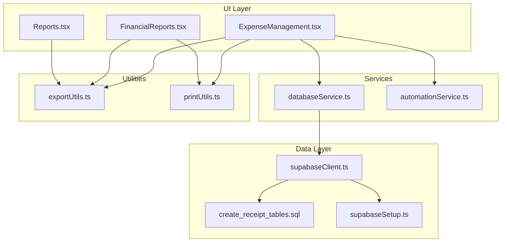
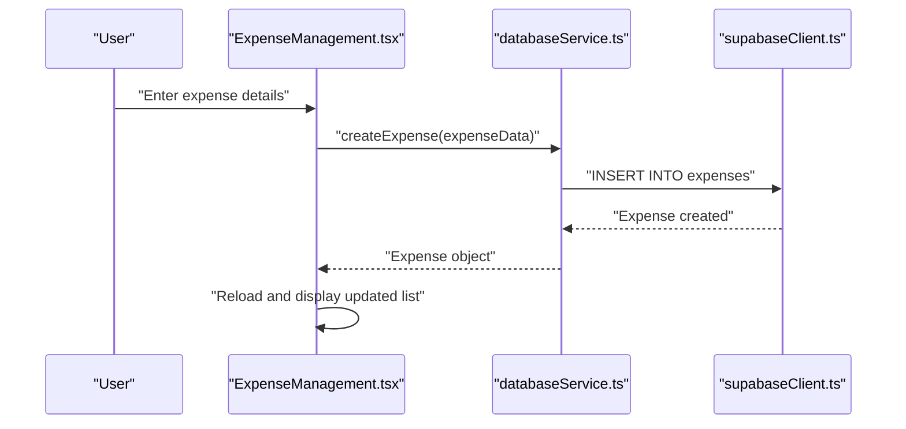
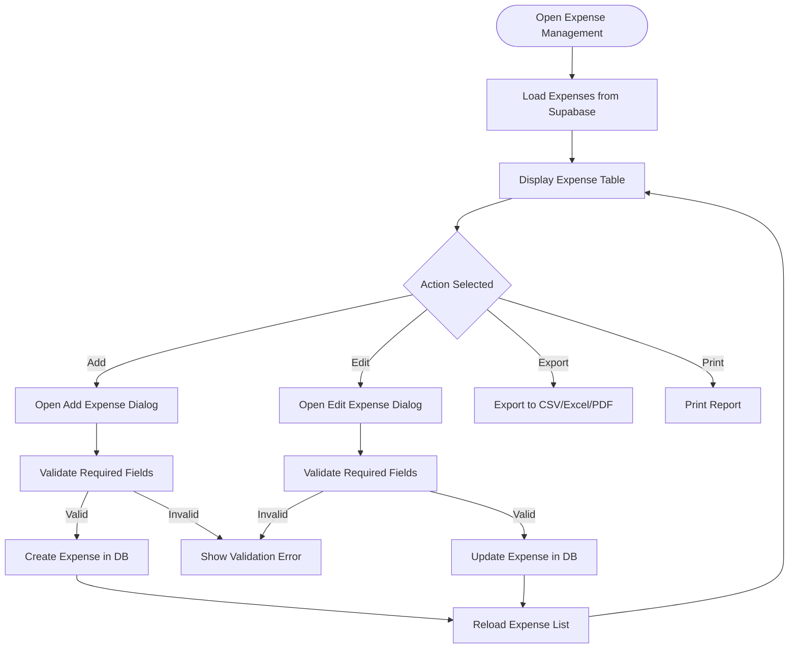
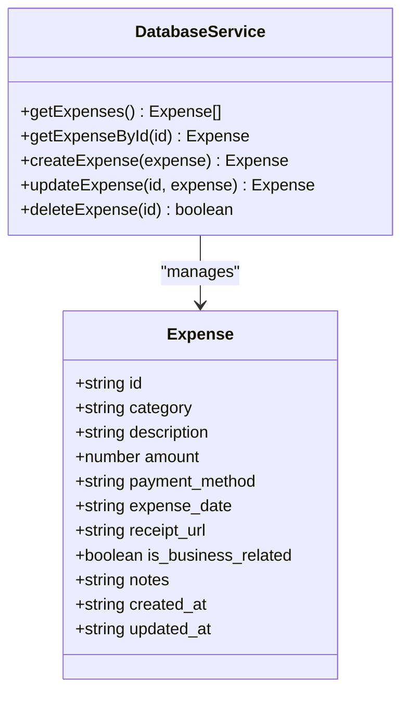
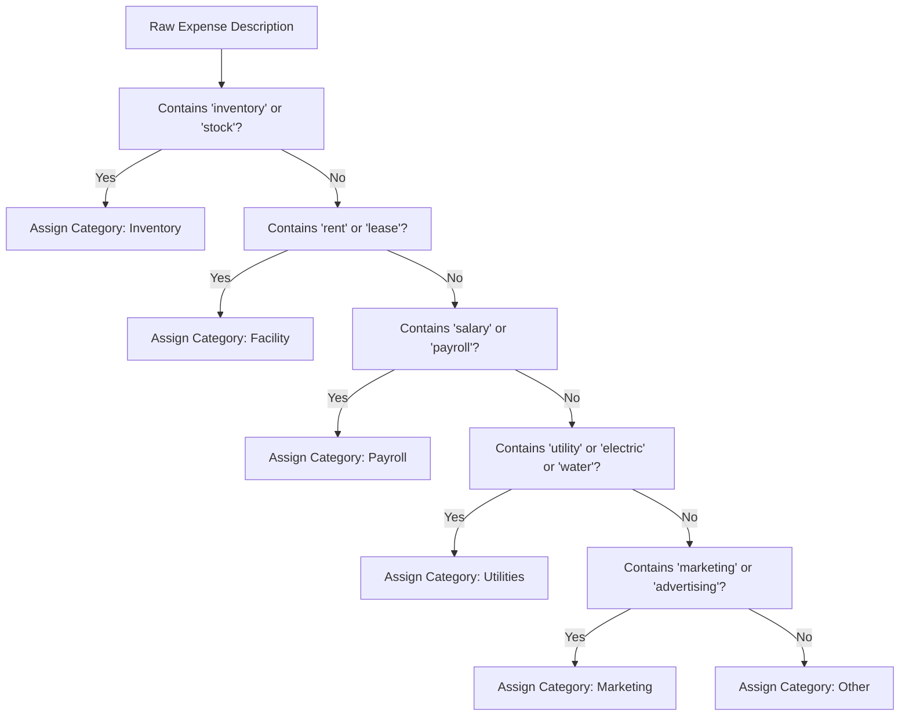
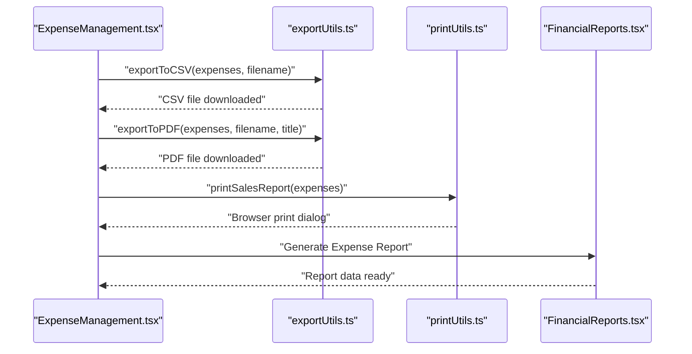
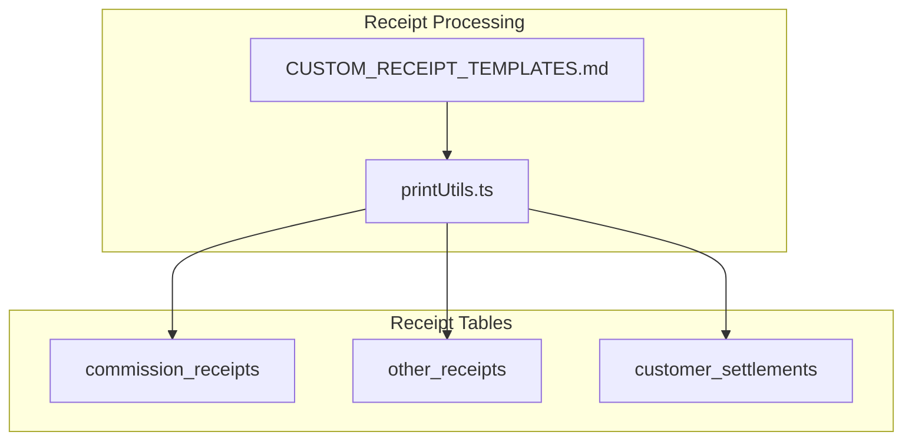
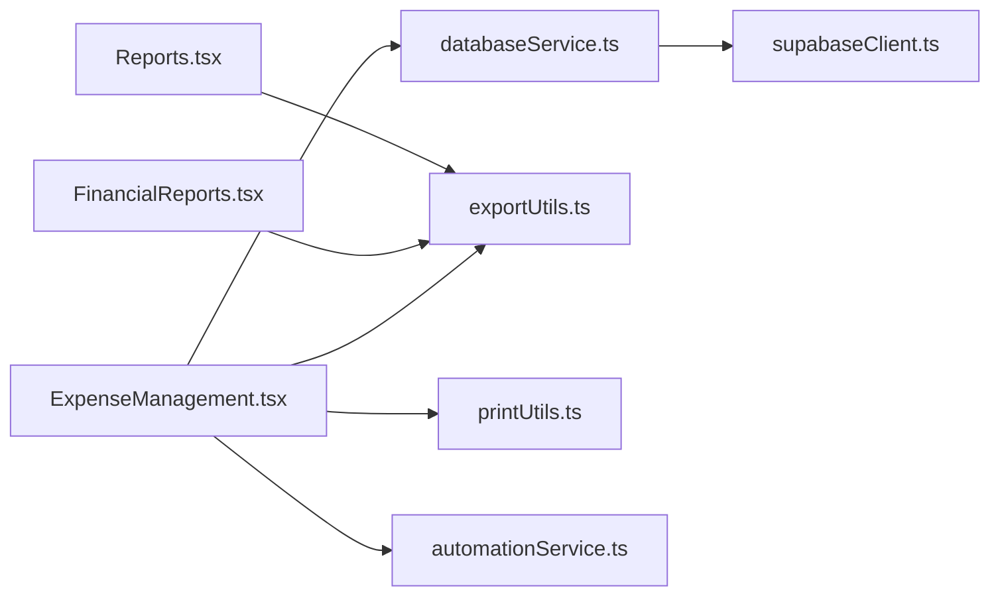

# Expense Management and Cost Control

<cite>
**Referenced Files in This Document**
- [ExpenseManagement.tsx](file://src/pages/ExpenseManagement.tsx)
- [databaseService.ts](file://src/services/databaseService.ts)
- [supabaseClient.ts](file://src/lib/supabaseClient.ts)
- [automationService.ts](file://src/services/automationService.ts)
- [exportUtils.ts](file://src/utils/exportUtils.ts)
- [printUtils.ts](file://src/utils/printUtils.ts)
- [FinancialReports.tsx](file://src/pages/FinancialReports.tsx)
- [Reports.tsx](file://src/pages/Reports.tsx)
- [CUSTOM_RECEIPT_TEMPLATES.md](file://src/docs/CUSTOM_RECEIPT_TEMPLATES.md)
- [create_receipt_tables.sql](file://migrations/20260408_create_receipt_tables.sql)
- [supabaseSetup.ts](file://src/utils/supabaseSetup.ts)
</cite>

## Table of Contents
1. [Introduction](#introduction)
2. [Project Structure](#project-structure)
3. [Core Components](#core-components)
4. [Architecture Overview](#architecture-overview)
5. [Detailed Component Analysis](#detailed-component-analysis)
6. [Dependency Analysis](#dependency-analysis)
7. [Performance Considerations](#performance-considerations)
8. [Troubleshooting Guide](#troubleshooting-guide)
9. [Conclusion](#conclusion)
10. [Appendices](#appendices)

## Introduction
This document provides comprehensive documentation for the expense management and cost control system within the Royal POS Modern platform. It explains the complete expense tracking workflow—from expense entry and categorization through reporting—along with vendor/payment tracking, approval workflows, budget monitoring, and integration with financial reporting. It also covers expense policy enforcement, receipt management, audit trails, optimization strategies, cost center allocation, and accounting integrations.

## Project Structure
The expense management system is implemented as a React-based page integrated with Supabase for data persistence and a suite of utilities for export, printing, and automation. The system supports:
- Expense entry, editing, and deletion
- Category-based filtering and search
- Export to CSV/Excel/PDF
- Printing receipts and reports
- Automated expense categorization
- Financial reporting and analytics

**Diagram sources**
- [ExpenseManagement.tsx:1-550](file://src/pages/ExpenseManagement.tsx#L1-L550)
- [databaseService.ts:2271-2330](file://src/services/databaseService.ts#L2271-L2330)
- [supabaseClient.ts:1-33](file://src/lib/supabaseClient.ts#L1-L33)
- [automationService.ts:98-126](file://src/services/automationService.ts#L98-L126)
- [exportUtils.ts:12-109](file://src/utils/exportUtils.ts#L12-L109)
- [printUtils.ts:7-800](file://src/utils/printUtils.ts#L7-L800)
- [FinancialReports.tsx:270-469](file://src/pages/FinancialReports.tsx#L270-L469)
- [Reports.tsx:470-669](file://src/pages/Reports.tsx#L470-L669)
- [create_receipt_tables.sql:1-306](file://migrations/20260408_create_receipt_tables.sql#L1-L306)
- [supabaseSetup.ts:91-101](file://src/utils/supabaseSetup.ts#L91-L101)

**Section sources**
- [ExpenseManagement.tsx:1-550](file://src/pages/ExpenseManagement.tsx#L1-L550)
- [databaseService.ts:2271-2330](file://src/services/databaseService.ts#L2271-L2330)
- [supabaseClient.ts:1-33](file://src/lib/supabaseClient.ts#L1-L33)
- [automationService.ts:98-126](file://src/services/automationService.ts#L98-L126)
- [exportUtils.ts:12-109](file://src/utils/exportUtils.ts#L12-L109)
- [printUtils.ts:7-800](file://src/utils/printUtils.ts#L7-L800)
- [FinancialReports.tsx:270-469](file://src/pages/FinancialReports.tsx#L270-L469)
- [Reports.tsx:470-669](file://src/pages/Reports.tsx#L470-L669)
- [create_receipt_tables.sql:1-306](file://migrations/20260408_create_receipt_tables.sql#L1-L306)
- [supabaseSetup.ts:91-101](file://src/utils/supabaseSetup.ts#L91-L101)

## Core Components
- ExpenseManagement page: Provides the primary UI for entering, editing, filtering, and exporting expenses. It integrates with Supabase via databaseService and uses export/print utilities for reporting.
- databaseService: Implements CRUD operations for expenses and exposes typed interfaces for data models.
- automationService: Includes automated expense categorization logic that can be applied to raw expense entries.
- exportUtils and printUtils: Offer export to CSV/Excel/PDF and printing capabilities for receipts and reports.
- FinancialReports and Reports: Generate financial reports including expense summaries and support printing/export.

Key capabilities:
- Expense entry with validation for required fields
- Category selection from predefined lists
- Payment method tracking
- Filtering and search
- Export to CSV/Excel/PDF
- Printing receipts and reports
- Automated categorization suggestions

**Section sources**
- [ExpenseManagement.tsx:21-73](file://src/pages/ExpenseManagement.tsx#L21-L73)
- [databaseService.ts:211-224](file://src/services/databaseService.ts#L211-L224)
- [automationService.ts:98-126](file://src/services/automationService.ts#L98-L126)
- [exportUtils.ts:12-109](file://src/utils/exportUtils.ts#L12-L109)
- [printUtils.ts:7-800](file://src/utils/printUtils.ts#L7-L800)

## Architecture Overview
The system follows a layered architecture:
- Presentation layer: React components for expense management and reporting
- Service layer: databaseService abstracts Supabase operations
- Data layer: Supabase client manages authentication and database connectivity
- Utilities: export/print services for output formats

**Diagram sources**
- [ExpenseManagement.tsx:120-161](file://src/pages/ExpenseManagement.tsx#L120-L161)
- [databaseService.ts:2303-2317](file://src/services/databaseService.ts#L2303-L2317)
- [supabaseClient.ts:19-31](file://src/lib/supabaseClient.ts#L19-L31)

## Detailed Component Analysis

### Expense Management Page
The ExpenseManagement page orchestrates the end-to-end expense lifecycle:
- Loads expenses from Supabase and formats them for display
- Supports adding, editing, and deleting expenses
- Provides search and category filters
- Exports and prints reports
- Calculates summary metrics (total expenses, counts)

**Diagram sources**
- [ExpenseManagement.tsx:89-161](file://src/pages/ExpenseManagement.tsx#L89-L161)
- [ExpenseManagement.tsx:254-266](file://src/pages/ExpenseManagement.tsx#L254-L266)

**Section sources**
- [ExpenseManagement.tsx:73-550](file://src/pages/ExpenseManagement.tsx#L73-L550)

### Database Service and Data Model
The database layer defines the Expense model and CRUD operations:
- Expense interface includes category, description, amount, payment_method, expense_date, optional receipt_url, business-related flag, notes, and timestamps
- CRUD functions for expenses with proper error handling and ordering by date

**Diagram sources**
- [databaseService.ts:211-224](file://src/services/databaseService.ts#L211-L224)
- [databaseService.ts:2271-2330](file://src/services/databaseService.ts#L2271-L2330)

**Section sources**
- [databaseService.ts:211-224](file://src/services/databaseService.ts#L211-L224)
- [databaseService.ts:2271-2330](file://src/services/databaseService.ts#L2271-L2330)

### Automated Expense Categorization
The automation service provides intelligent categorization of expenses based on textual keywords in descriptions, which can be used to pre-fill or suggest categories during expense entry.

**Diagram sources**
- [automationService.ts:98-126](file://src/services/automationService.ts#L98-L126)

**Section sources**
- [automationService.ts:98-126](file://src/services/automationService.ts#L98-L126)

### Reporting and Export Capabilities
The system supports multiple output formats for expense data:
- Export to CSV/Excel via exportUtils
- Export to PDF via exportUtils
- Printing receipts and reports via printUtils
- Financial reports including expense summaries via FinancialReports and Reports pages

**Diagram sources**
- [ExpenseManagement.tsx:307-321](file://src/pages/ExpenseManagement.tsx#L307-L321)
- [exportUtils.ts:12-109](file://src/utils/exportUtils.ts#L12-L109)
- [printUtils.ts:7-800](file://src/utils/printUtils.ts#L7-L800)
- [FinancialReports.tsx:270-282](file://src/pages/FinancialReports.tsx#L270-L282)

**Section sources**
- [ExpenseManagement.tsx:307-321](file://src/pages/ExpenseManagement.tsx#L307-L321)
- [exportUtils.ts:12-109](file://src/utils/exportUtils.ts#L12-L109)
- [printUtils.ts:7-800](file://src/utils/printUtils.ts#L7-L800)
- [FinancialReports.tsx:270-282](file://src/pages/FinancialReports.tsx#L270-L282)

### Receipt Management and Audit Trail
Receipt management is supported through dedicated receipt tables and printing utilities:
- Receipt tables include commission receipts, other receipts, and customer settlements
- Print utilities support QR code generation and receipt printing
- Template customization allows branding and layout control

**Diagram sources**
- [create_receipt_tables.sql:8-21](file://migrations/20260408_create_receipt_tables.sql#L8-L21)
- [create_receipt_tables.sql:92-106](file://migrations/20260408_create_receipt_tables.sql#L92-L106)
- [create_receipt_tables.sql:185-200](file://migrations/20260408_create_receipt_tables.sql#L185-L200)
- [printUtils.ts:48-418](file://src/utils/printUtils.ts#L48-L418)
- [CUSTOM_RECEIPT_TEMPLATES.md:1-133](file://src/docs/CUSTOM_RECEIPT_TEMPLATES.md#L1-L133)

**Section sources**
- [create_receipt_tables.sql:1-306](file://migrations/20260408_create_receipt_tables.sql#L1-L306)
- [printUtils.ts:48-418](file://src/utils/printUtils.ts#L48-L418)
- [CUSTOM_RECEIPT_TEMPLATES.md:1-133](file://src/docs/CUSTOM_RECEIPT_TEMPLATES.md#L1-L133)

## Dependency Analysis
The expense management system exhibits clear separation of concerns:
- UI depends on databaseService for data operations
- databaseService depends on supabaseClient for database connectivity
- Utilities (export/print) are independent and reusable
- Automation service provides domain-specific logic

**Diagram sources**
- [ExpenseManagement.tsx:19-19](file://src/pages/ExpenseManagement.tsx#L19-L19)
- [databaseService.ts:1-400](file://src/services/databaseService.ts#L1-L400)
- [supabaseClient.ts:1-33](file://src/lib/supabaseClient.ts#L1-L33)
- [exportUtils.ts:1-12](file://src/utils/exportUtils.ts#L1-L12)
- [printUtils.ts:1-7](file://src/utils/printUtils.ts#L1-L7)
- [automationService.ts:1-10](file://src/services/automationService.ts#L1-L10)
- [FinancialReports.tsx:1-40](file://src/pages/FinancialReports.tsx#L1-L40)
- [Reports.tsx:1-40](file://src/pages/Reports.tsx#L1-L40)

**Section sources**
- [ExpenseManagement.tsx:19-19](file://src/pages/ExpenseManagement.tsx#L19-L19)
- [databaseService.ts:1-400](file://src/services/databaseService.ts#L1-L400)
- [supabaseClient.ts:1-33](file://src/lib/supabaseClient.ts#L1-L33)
- [exportUtils.ts:1-12](file://src/utils/exportUtils.ts#L1-L12)
- [printUtils.ts:1-7](file://src/utils/printUtils.ts#L1-L7)
- [automationService.ts:1-10](file://src/services/automationService.ts#L1-L10)
- [FinancialReports.tsx:1-40](file://src/pages/FinancialReports.tsx#L1-L40)
- [Reports.tsx:1-40](file://src/pages/Reports.tsx#L1-L40)

## Performance Considerations
- Database queries are ordered by date to optimize recent-first retrieval
- Client-side filtering reduces server load for search and category filtering
- Export/print operations are lightweight and delegate to browser APIs
- Consider implementing server-side pagination for large datasets to improve responsiveness

## Troubleshooting Guide
Common issues and resolutions:
- Expense creation fails: Verify required fields (description, amount) and network connectivity
- Loading expenses errors: Check Supabase credentials and connection status
- Export/print failures: Confirm browser support for download/print APIs and permissions
- Receipt printing problems: Validate template configuration and printer settings

**Section sources**
- [ExpenseManagement.tsx:108-118](file://src/pages/ExpenseManagement.tsx#L108-L118)
- [supabaseClient.ts:10-17](file://src/lib/supabaseClient.ts#L10-L17)
- [exportUtils.ts:12-109](file://src/utils/exportUtils.ts#L12-L109)
- [printUtils.ts:7-800](file://src/utils/printUtils.ts#L7-L800)

## Conclusion
The expense management and cost control system provides a robust foundation for tracking, categorizing, and reporting business expenses. Its modular design enables easy extension for approval workflows, budget monitoring, and integration with broader financial systems. The combination of manual categorization, automated suggestions, and comprehensive reporting supports informed cost control decisions.

## Appendices

### Practical Scenarios and Workflows
- Expense entry scenario: Enter date, category, description, amount, and payment method; submit to create an expense record
- Category classification: Use predefined categories or leverage automated categorization suggestions
- Reimbursement processing: Track payment methods and amounts; export records for reconciliation

### Budget Monitoring and Approval Workflows
- Budget monitoring: Use expense summaries and variance analysis to compare actual vs. planned spending
- Approval workflows: Integrate with existing approval mechanisms to route expenses for manager review before posting

### Cost Center Allocation and Accounting Integration
- Cost center allocation: Extend the Expense model to include cost_center and allocate expenses accordingly
- Accounting integration: Export expense data to accounting systems via CSV/Excel/PDF for bookkeeping and tax preparation

[No sources needed since this section provides general guidance]