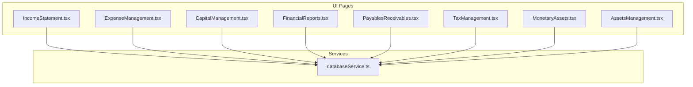
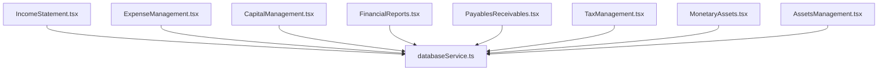
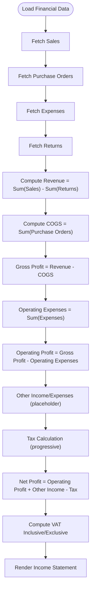
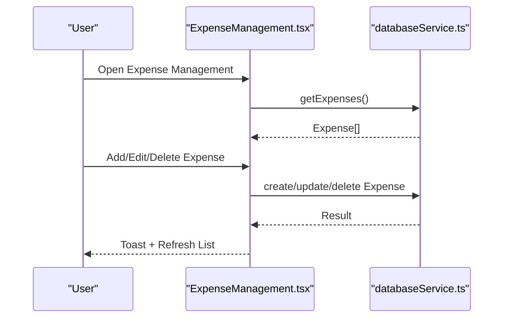
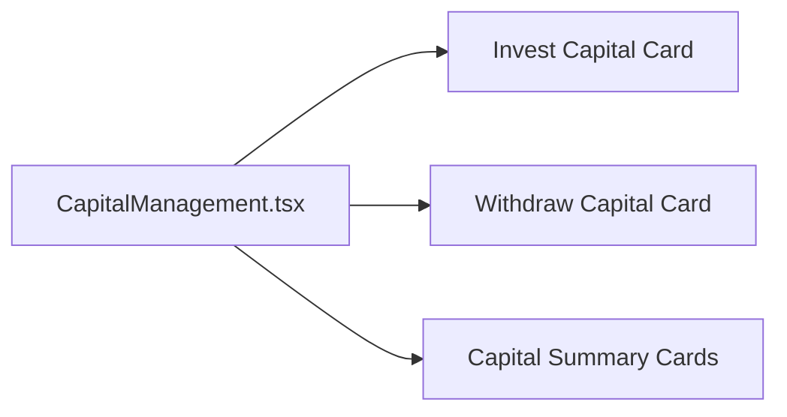
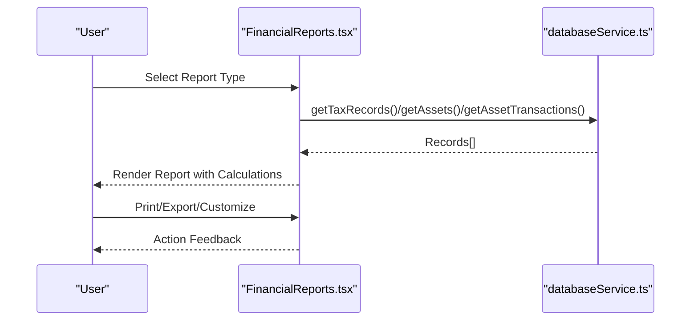
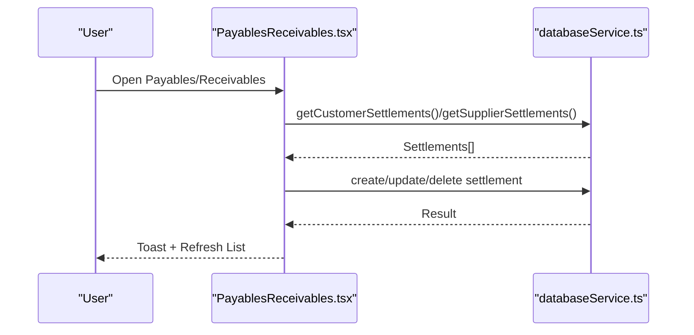
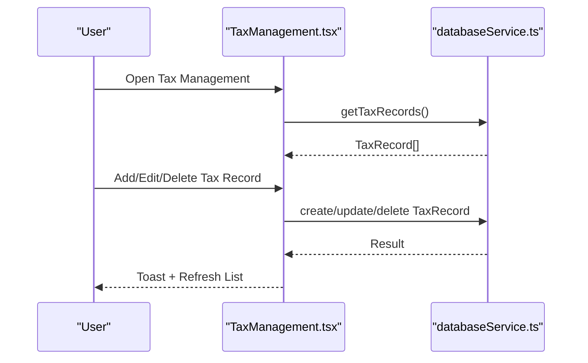
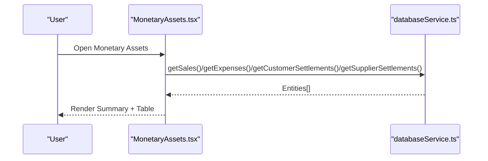
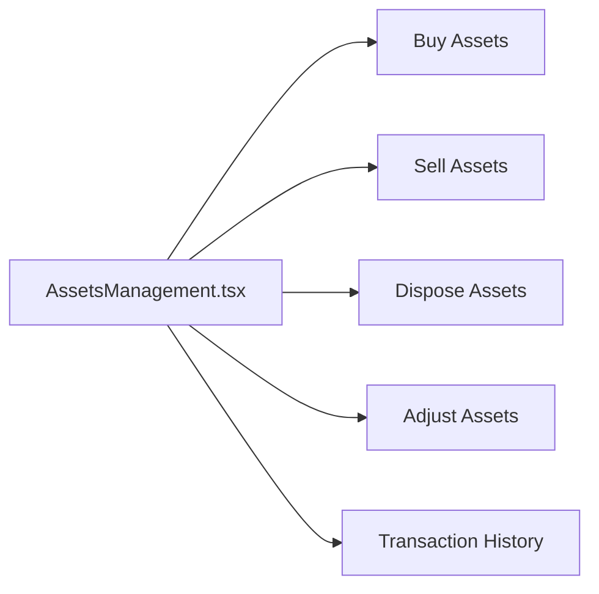

# Financial Management System

<cite>
**Referenced Files in This Document**
- [IncomeStatement.tsx](file://src/pages/IncomeStatement.tsx)
- [ExpenseManagement.tsx](file://src/pages/ExpenseManagement.tsx)
- [CapitalManagement.tsx](file://src/pages/CapitalManagement.tsx)
- [FinancialReports.tsx](file://src/pages/FinancialReports.tsx)
- [PayablesReceivables.tsx](file://src/pages/PayablesReceivables.tsx)
- [TaxManagement.tsx](file://src/pages/TaxManagement.tsx)
- [MonetaryAssets.tsx](file://src/pages/MonetaryAssets.tsx)
- [AssetsManagement.tsx](file://src/pages/AssetsManagement.tsx)
- [databaseService.ts](file://src/services/databaseService.ts)
</cite>

## Table of Contents
1. [Introduction](#introduction)
2. [Project Structure](#project-structure)
3. [Core Components](#core-components)
4. [Architecture Overview](#architecture-overview)
5. [Detailed Component Analysis](#detailed-component-analysis)
6. [Dependency Analysis](#dependency-analysis)
7. [Performance Considerations](#performance-considerations)
8. [Troubleshooting Guide](#troubleshooting-guide)
9. [Conclusion](#conclusion)
10. [Appendices](#appendices)

## Introduction
This document describes the financial management system for Royal POS Modern, covering the complete financial workflow from revenue tracking through expense management, capital operations, and financial reporting. It explains how income is recorded, expenses categorized and tracked, capital invested and withdrawn, and how financial statements and tax records are produced. It also documents analytics, variance analysis, performance metrics, compliance, and audit-ready features.

## Project Structure
The financial domain is implemented as React pages under the pages directory, each responsible for a specific financial capability:
- Revenue and P&L: IncomeStatement
- Expense tracking: ExpenseManagement
- Capital management: CapitalManagement
- Financial reporting hub: FinancialReports
- Payables and Receivables: PayablesReceivables
- Tax management: TaxManagement
- Monetary assets tracking: MonetaryAssets
- Assets lifecycle: AssetsManagement

These pages integrate with a centralized database service that abstracts Supabase access and defines typed models for financial entities.

**Diagram sources**
- [IncomeStatement.tsx:63-299](file://src/pages/IncomeStatement.tsx#L63-L299)
- [ExpenseManagement.tsx:19-118](file://src/pages/ExpenseManagement.tsx#L19-L118)
- [CapitalManagement.tsx:19-131](file://src/pages/CapitalManagement.tsx#L19-L131)
- [FinancialReports.tsx:70-153](file://src/pages/FinancialReports.tsx#L70-L153)
- [PayablesReceivables.tsx:52-137](file://src/pages/PayablesReceivables.tsx#L52-L137)
- [TaxManagement.tsx:37-77](file://src/pages/TaxManagement.tsx#L37-L77)
- [MonetaryAssets.tsx:31-52](file://src/pages/MonetaryAssets.tsx#L31-L52)
- [AssetsManagement.tsx:28-50](file://src/pages/AssetsManagement.tsx#L28-L50)
- [databaseService.ts:151-224](file://src/services/databaseService.ts#L151-L224)

**Section sources**
- [IncomeStatement.tsx:63-299](file://src/pages/IncomeStatement.tsx#L63-L299)
- [ExpenseManagement.tsx:19-118](file://src/pages/ExpenseManagement.tsx#L19-L118)
- [CapitalManagement.tsx:19-131](file://src/pages/CapitalManagement.tsx#L19-L131)
- [FinancialReports.tsx:70-153](file://src/pages/FinancialReports.tsx#L70-L153)
- [PayablesReceivables.tsx:52-137](file://src/pages/PayablesReceivables.tsx#L52-L137)
- [TaxManagement.tsx:37-77](file://src/pages/TaxManagement.tsx#L37-L77)
- [MonetaryAssets.tsx:31-52](file://src/pages/MonetaryAssets.tsx#L31-L52)
- [AssetsManagement.tsx:28-50](file://src/pages/AssetsManagement.tsx#L28-L50)
- [databaseService.ts:151-224](file://src/services/databaseService.ts#L151-L224)

## Core Components
- Income Statement: Aggregates sales, returns, purchases, and operating expenses to compute gross profit, operating profit, other income/expenses, taxes, and net profit. Includes VAT exclusive/inclusive calculations and a detail dialog per line item.
- Expense Management: Allows adding, editing, deleting, filtering, and exporting expenses with categories and payment methods.
- Capital Management: Provides dashboard cards for capital operations and summary KPIs (total, invested, available capital).
- Financial Reports: Centralized hub for viewing, printing, and exporting financial statements (Income Statement, Balance Sheet, Cash Flow, Fund Flow, Trial Balance, Expense Report, Tax Summary, Profitability Analysis). Supports custom report creation.
- Payables & Receivables: Manages customer and supplier settlements, with search, filters, and export/print capabilities.
- Tax Management: Tracks tax records by type, period, rate, amount, and status; supports print/export.
- Monetary Assets: Consolidates income, expenses, receivables, and payables into a single view with summary cards and net position calculation.
- Assets Management: Manages asset transactions (buy/sell/dispose/adjust) and displays transaction history with edit/view/delete actions.

**Section sources**
- [IncomeStatement.tsx:63-299](file://src/pages/IncomeStatement.tsx#L63-L299)
- [ExpenseManagement.tsx:19-118](file://src/pages/ExpenseManagement.tsx#L19-L118)
- [CapitalManagement.tsx:19-131](file://src/pages/CapitalManagement.tsx#L19-L131)
- [FinancialReports.tsx:70-153](file://src/pages/FinancialReports.tsx#L70-L153)
- [PayablesReceivables.tsx:52-137](file://src/pages/PayablesReceivables.tsx#L52-L137)
- [TaxManagement.tsx:37-77](file://src/pages/TaxManagement.tsx#L37-L77)
- [MonetaryAssets.tsx:31-52](file://src/pages/MonetaryAssets.tsx#L31-L52)
- [AssetsManagement.tsx:28-50](file://src/pages/AssetsManagement.tsx#L28-L50)

## Architecture Overview
The system follows a layered architecture:
- UI Layer: React functional components with Tailwind styling and shadcn/ui primitives.
- Service Layer: databaseService.ts encapsulates Supabase queries and mutations for financial entities.
- Data Contracts: Strongly typed interfaces define entity schemas for sales, expenses, taxes, settlements, and assets.

**Diagram sources**
- [IncomeStatement.tsx:15-21](file://src/pages/IncomeStatement.tsx#L15-L21)
- [ExpenseManagement.tsx:19-19](file://src/pages/ExpenseManagement.tsx#L19-L19)
- [CapitalManagement.tsx](file://src/pages/CapitalManagement.tsx)
- [FinancialReports.tsx:26-26](file://src/pages/FinancialReports.tsx#L26-L26)
- [PayablesReceivables.tsx:18-28](file://src/pages/PayablesReceivables.tsx#L18-L28)
- [TaxManagement.tsx:23-28](file://src/pages/TaxManagement.tsx#L23-L28)
- [MonetaryAssets.tsx:17-17](file://src/pages/MonetaryAssets.tsx#L17-L17)
- [AssetsManagement.tsx:17-18](file://src/pages/AssetsManagement.tsx#L17-L18)
- [databaseService.ts:151-224](file://src/services/databaseService.ts#L151-L224)

## Detailed Component Analysis

### Income Statement
The Income Statement page computes financial performance by combining:
- Revenue: Sum of sales minus returns
- COGS: Sum of purchase orders
- Gross Profit: Revenue − COGS
- Operating Expenses: Sum of expense records
- Operating Profit: Gross Profit − Operating Expenses
- Other Income/Expenses: Placeholder for non-operating items
- Taxes: Progressive tax calculation on profit/loss before tax
- Net Profit: Operating Profit + Other Income/Expenses − Tax

It also calculates VAT-inclusive and VAT-exclusive figures and provides a detailed dialog for each line item explaining data sources and computation.

**Diagram sources**
- [IncomeStatement.tsx:200-299](file://src/pages/IncomeStatement.tsx#L200-L299)

**Section sources**
- [IncomeStatement.tsx:63-299](file://src/pages/IncomeStatement.tsx#L63-L299)

### Expense Management
The Expense Management page enables:
- Adding/editing/deleting expenses with category, description, amount, and payment method
- Filtering by category and search term
- Export/print capabilities
- Summary cards for total expenses, pending count, and categories

**Diagram sources**
- [ExpenseManagement.tsx:94-118](file://src/pages/ExpenseManagement.tsx#L94-L118)
- [databaseService.ts:211-224](file://src/services/databaseService.ts#L211-L224)

**Section sources**
- [ExpenseManagement.tsx:19-118](file://src/pages/ExpenseManagement.tsx#L19-L118)
- [databaseService.ts:211-224](file://src/services/databaseService.ts#L211-L224)

### Capital Management
Capital Management presents:
- Operation cards for investing and withdrawing capital
- Summary cards for total capital, invested capital, and available capital
- Placeholder for future investment/withdrawal workflows

**Diagram sources**
- [CapitalManagement.tsx:19-131](file://src/pages/CapitalManagement.tsx#L19-L131)

**Section sources**
- [CapitalManagement.tsx:19-131](file://src/pages/CapitalManagement.tsx#L19-L131)

### Financial Reports
The Financial Reports hub:
- Lists standard financial statements and analytics
- Computes derived metrics (e.g., VAT and depreciation adjustments)
- Supports viewing, printing, and exporting reports
- Enables creation of custom reports with date ranges

**Diagram sources**
- [FinancialReports.tsx:119-153](file://src/pages/FinancialReports.tsx#L119-L153)
- [FinancialReports.tsx:155-309](file://src/pages/FinancialReports.tsx#L155-L309)
- [FinancialReports.tsx:382-475](file://src/pages/FinancialReports.tsx#L382-L475)
- [FinancialReports.tsx:492-534](file://src/pages/FinancialReports.tsx#L492-L534)

**Section sources**
- [FinancialReports.tsx:70-153](file://src/pages/FinancialReports.tsx#L70-L153)
- [FinancialReports.tsx:155-309](file://src/pages/FinancialReports.tsx#L155-L309)
- [FinancialReports.tsx:382-475](file://src/pages/FinancialReports.tsx#L382-L475)
- [FinancialReports.tsx:492-534](file://src/pages/FinancialReports.tsx#L492-L534)

### Payables & Receivables
Manages customer and supplier settlements:
- Loads customer and supplier lists
- Adds/editing/deletes settlements with due dates, amounts, and payment methods
- Filters by type/status/date range
- Exports and prints reports

**Diagram sources**
- [PayablesReceivables.tsx:88-137](file://src/pages/PayablesReceivables.tsx#L88-L137)
- [PayablesReceivables.tsx:168-243](file://src/pages/PayablesReceivables.tsx#L168-L243)

**Section sources**
- [PayablesReceivables.tsx:52-137](file://src/pages/PayablesReceivables.tsx#L52-L137)
- [PayablesReceivables.tsx:168-243](file://src/pages/PayablesReceivables.tsx#L168-L243)

### Tax Management
Tracks tax records:
- CRUD operations for tax types, periods, rates, amounts, and statuses
- Print/export of tax records
- Currency formatting for TZS

**Diagram sources**
- [TaxManagement.tsx:62-77](file://src/pages/TaxManagement.tsx#L62-L77)
- [TaxManagement.tsx:115-147](file://src/pages/TaxManagement.tsx#L115-L147)

**Section sources**
- [TaxManagement.tsx:37-77](file://src/pages/TaxManagement.tsx#L37-L77)
- [TaxManagement.tsx:115-147](file://src/pages/TaxManagement.tsx#L115-L147)

### Monetary Assets
Consolidates financial movements:
- Loads sales, expenses, customer/supplier settlements
- Computes totals and net position
- Supports filtering and export/print

**Diagram sources**
- [MonetaryAssets.tsx:54-127](file://src/pages/MonetaryAssets.tsx#L54-L127)

**Section sources**
- [MonetaryAssets.tsx:31-127](file://src/pages/MonetaryAssets.tsx#L31-L127)

### Assets Management
Manages asset transactions:
- Tabs for buy/sell/dispose/adjust/history
- Transaction history with view/edit/delete modals
- Navigation to specialized asset views

**Diagram sources**
- [AssetsManagement.tsx:28-124](file://src/pages/AssetsManagement.tsx#L28-L124)
- [AssetsManagement.tsx:142-422](file://src/pages/AssetsManagement.tsx#L142-L422)

**Section sources**
- [AssetsManagement.tsx:28-124](file://src/pages/AssetsManagement.tsx#L28-L124)
- [AssetsManagement.tsx:142-422](file://src/pages/AssetsManagement.tsx#L142-L422)

## Dependency Analysis
Key dependencies and relationships:
- All financial pages depend on databaseService.ts for data access.
- Income Statement depends on sales, purchase orders, expenses, and returns.
- Financial Reports depends on tax records, assets, and asset transactions for enriched computations.
- Payables & Receivables depend on customer/supplier settlement endpoints.
- Monetary Assets consolidates multiple entities for a unified view.

**Diagram sources**
- [IncomeStatement.tsx:15-21](file://src/pages/IncomeStatement.tsx#L15-L21)
- [ExpenseManagement.tsx:19-19](file://src/pages/ExpenseManagement.tsx#L19-L19)
- [CapitalManagement.tsx](file://src/pages/CapitalManagement.tsx)
- [FinancialReports.tsx:26-26](file://src/pages/FinancialReports.tsx#L26-L26)
- [PayablesReceivables.tsx:18-28](file://src/pages/PayablesReceivables.tsx#L18-L28)
- [TaxManagement.tsx:23-28](file://src/pages/TaxManagement.tsx#L23-L28)
- [MonetaryAssets.tsx:17-17](file://src/pages/MonetaryAssets.tsx#L17-L17)
- [AssetsManagement.tsx:17-18](file://src/pages/AssetsManagement.tsx#L17-L18)
- [databaseService.ts:151-224](file://src/services/databaseService.ts#L151-L224)

**Section sources**
- [databaseService.ts:151-224](file://src/services/databaseService.ts#L151-L224)

## Performance Considerations
- Batch data fetching: Income Statement uses concurrent fetches for sales, purchases, expenses, and returns to minimize latency.
- Client-side filtering and sorting: Expense Management and Payables/Receivables pages filter locally; consider server-side filtering for very large datasets.
- Currency formatting: Centralized formatting via a shared utility reduces repeated conversions.
- Export/print operations: Simulated for custom reports; actual export/print utilities should be optimized for large datasets.

[No sources needed since this section provides general guidance]

## Troubleshooting Guide
Common issues and resolutions:
- Income Statement data not loading:
  - Verify sales, purchase orders, expenses, and returns endpoints return data.
  - Check toast feedback for error messages.
- Expense CRUD errors:
  - Ensure required fields (description, amount > 0) are provided.
  - Confirm backend responses and toast notifications.
- Payables/Receivables settlement failures:
  - Validate party selection and required fields.
  - Confirm customer/supplier endpoints are reachable.
- Tax record issues:
  - Ensure tax type, period, rate, and amount are valid.
  - Check status transitions and reference numbers.
- Monetary Assets discrepancies:
  - Reconcile sales, expenses, and settlement records.
  - Verify date ranges and statuses.
- Assets transaction history:
  - Confirm transaction types and amounts.
  - Use view/edit/delete modals to troubleshoot entries.

**Section sources**
- [IncomeStatement.tsx:286-296](file://src/pages/IncomeStatement.tsx#L286-L296)
- [ExpenseManagement.tsx:120-161](file://src/pages/ExpenseManagement.tsx#L120-L161)
- [PayablesReceivables.tsx:168-243](file://src/pages/PayablesReceivables.tsx#L168-L243)
- [TaxManagement.tsx:115-147](file://src/pages/TaxManagement.tsx#L115-L147)
- [MonetaryAssets.tsx:129-161](file://src/pages/MonetaryAssets.tsx#L129-L161)
- [AssetsManagement.tsx:249-360](file://src/pages/AssetsManagement.tsx#L249-L360)

## Conclusion
Royal POS Modern’s financial management system integrates revenue tracking, expense management, capital operations, payables/receivables, tax management, and consolidated asset monitoring into a cohesive suite of pages backed by a typed database service. The system supports robust reporting, customization, and export/printing, while providing clear pathways for analytics and compliance.

[No sources needed since this section summarizes without analyzing specific files]

## Appendices

### Financial Analytics and Variance Analysis
- Income Statement detail dialogs explain calculations and data sources, enabling variance analysis against prior periods.
- Financial Reports offers multiple report types including profitability analysis and trial balance for deeper insights.
- Monetary Assets provides net position trends across income, expenses, receivables, and payables.

**Section sources**
- [IncomeStatement.tsx:91-192](file://src/pages/IncomeStatement.tsx#L91-L192)
- [FinancialReports.tsx:283-294](file://src/pages/FinancialReports.tsx#L283-L294)
- [MonetaryAssets.tsx:240-256](file://src/pages/MonetaryAssets.tsx#L240-L256)

### Compliance and Audit Trail
- Tax Management tracks filing status and reference numbers.
- Payables/Receivables maintains settlement records with dates, amounts, and notes.
- Assets Management logs transaction history with types, amounts, and descriptions.
- Monetary Assets consolidates all monetary movements for reconciliation.

**Section sources**
- [TaxManagement.tsx:29-55](file://src/pages/TaxManagement.tsx#L29-L55)
- [PayablesReceivables.tsx:32-44](file://src/pages/PayablesReceivables.tsx#L32-L44)
- [AssetsManagement.tsx:142-232](file://src/pages/AssetsManagement.tsx#L142-L232)
- [MonetaryAssets.tsx:19-29](file://src/pages/MonetaryAssets.tsx#L19-L29)

### Practical Reporting Scenarios
- Monthly Income Statement: Aggregate sales and returns, COGS from purchase orders, operating expenses, and compute taxes.
- Tax Summary Report: Filter tax records by selected period and summarize totals by tax type.
- Expense Report: Group expenses by category and export to CSV/Excel.
- Payables/Receivables Aging: Filter by due date ranges and status to monitor collections and obligations.
- Custom Financial Report: Build a tailored report with date ranges and export/print options.

**Section sources**
- [FinancialReports.tsx:155-309](file://src/pages/FinancialReports.tsx#L155-L309)
- [FinancialReports.tsx:311-380](file://src/pages/FinancialReports.tsx#L311-L380)
- [ExpenseManagement.tsx:307-321](file://src/pages/ExpenseManagement.tsx#L307-L321)
- [PayablesReceivables.tsx:475-497](file://src/pages/PayablesReceivables.tsx#L475-L497)
- [FinancialReports.tsx:492-534](file://src/pages/FinancialReports.tsx#L492-L534)