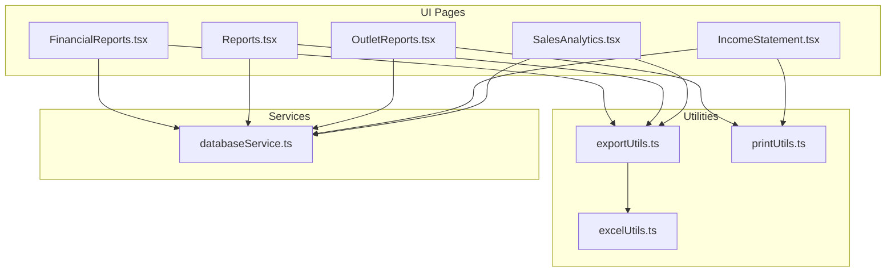
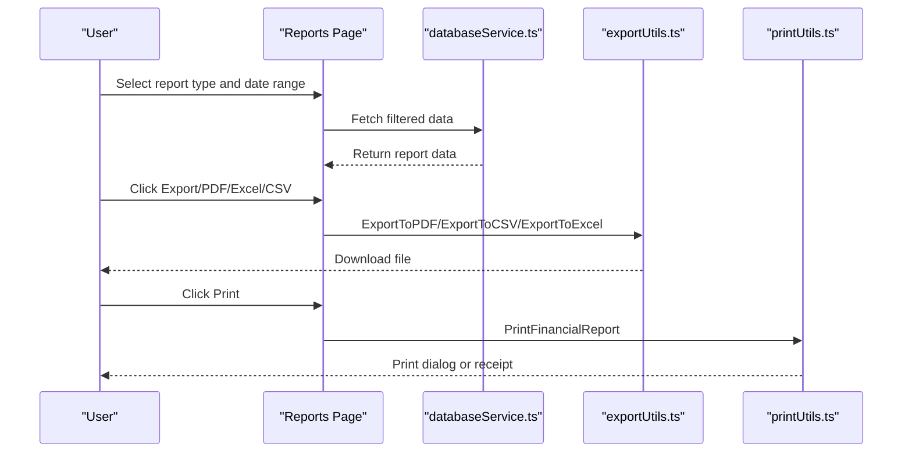
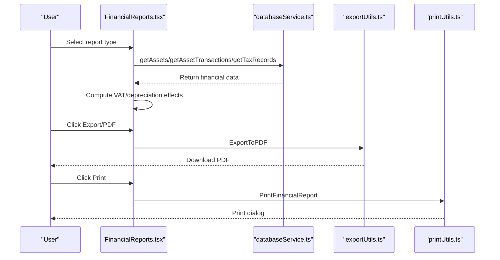
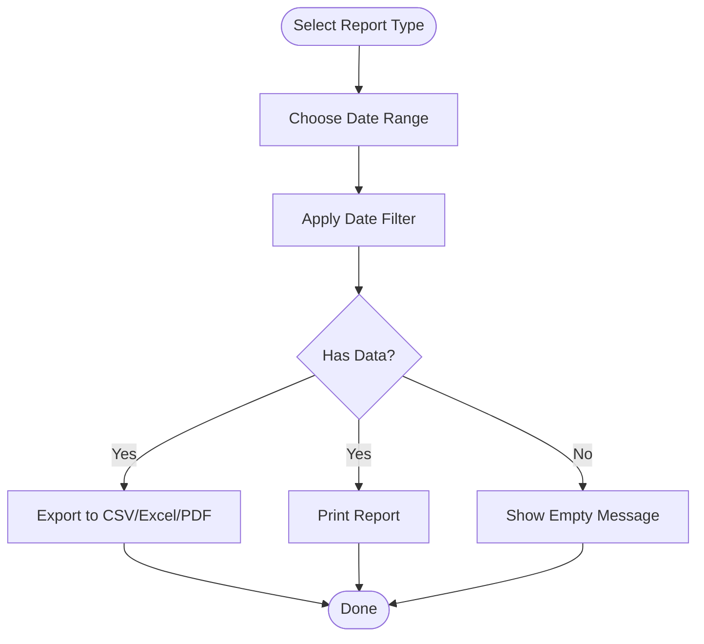
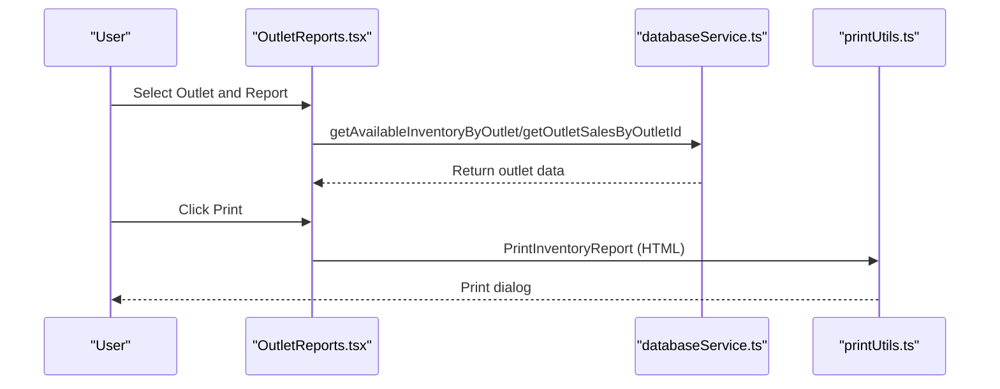
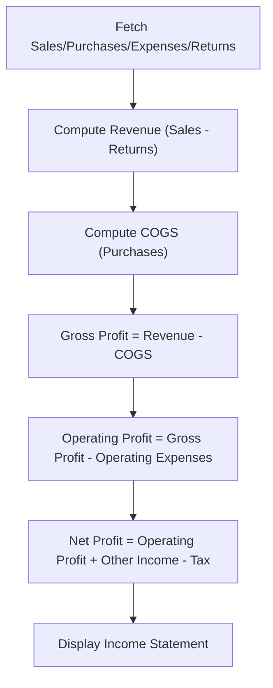
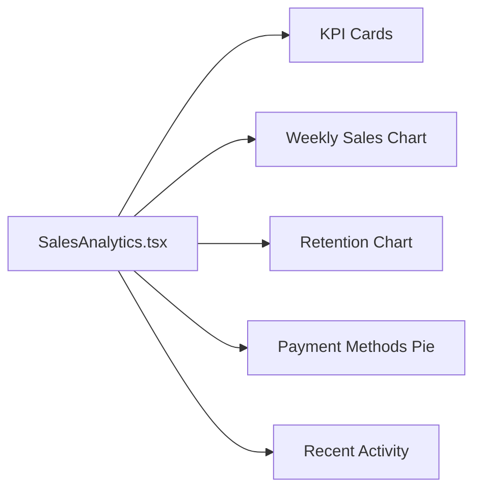
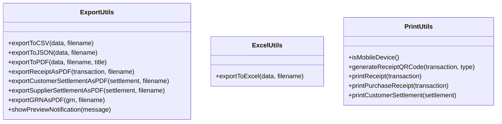
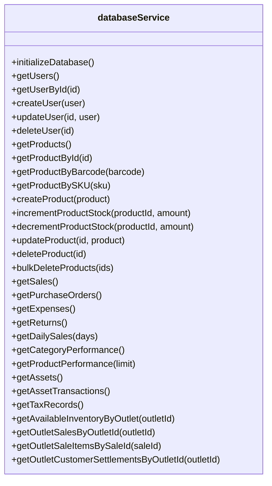
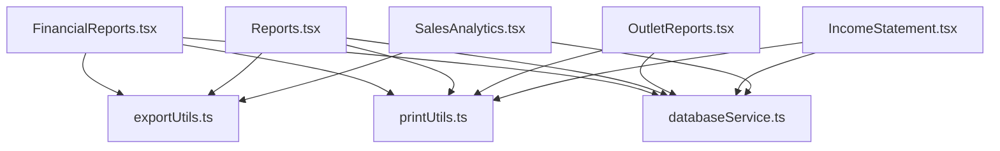

# Financial Reporting and Analytics

<cite>
**Referenced Files in This Document**
- [FinancialReports.tsx](file://src/pages/FinancialReports.tsx)
- [Reports.tsx](file://src/pages/Reports.tsx)
- [OutletReports.tsx](file://src/pages/OutletReports.tsx)
- [IncomeStatement.tsx](file://src/pages/IncomeStatement.tsx)
- [SalesAnalytics.tsx](file://src/pages/SalesAnalytics.tsx)
- [exportUtils.ts](file://src/utils/exportUtils.ts)
- [excelUtils.ts](file://src/utils/excelUtils.ts)
- [printUtils.ts](file://src/utils/printUtils.ts)
- [databaseService.ts](file://src/services/databaseService.ts)
</cite>

## Table of Contents
1. [Introduction](#introduction)
2. [Project Structure](#project-structure)
3. [Core Components](#core-components)
4. [Architecture Overview](#architecture-overview)
5. [Detailed Component Analysis](#detailed-component-analysis)
6. [Dependency Analysis](#dependency-analysis)
7. [Performance Considerations](#performance-considerations)
8. [Troubleshooting Guide](#troubleshooting-guide)
9. [Conclusion](#conclusion)

## Introduction
This document describes the financial reporting and analytics system within the POS Modern application. It explains the complete reporting workflow from data extraction through report generation and distribution, covering financial statements (income statement, balance sheet, cash flow), operational reports (inventory, sales, expenses), and analytics dashboards. It also documents export functionality (PDF, Excel, CSV), custom report creation, filtering, and practical scenarios for automated reporting. Regulatory considerations such as tax reporting and VAT calculations are integrated into the financial statements.

## Project Structure
The financial reporting system is organized around dedicated pages and supporting utilities:
- Pages for financial reports, operational reports, outlet-specific reports, income statement, and sales analytics
- Utilities for exporting to PDF/Excel/CSV and printing receipts/reports
- Services for database access and data retrieval

**Diagram sources**
- [FinancialReports.tsx:70-1178](file://src/pages/FinancialReports.tsx#L70-L1178)
- [Reports.tsx:67-1384](file://src/pages/Reports.tsx#L67-L1384)
- [OutletReports.tsx:113-1081](file://src/pages/OutletReports.tsx#L113-L1081)
- [IncomeStatement.tsx:63-593](file://src/pages/IncomeStatement.tsx#L63-L593)
- [SalesAnalytics.tsx:114-496](file://src/pages/SalesAnalytics.tsx#L114-L496)
- [exportUtils.ts:12-785](file://src/utils/exportUtils.ts#L12-L785)
- [excelUtils.ts:1-36](file://src/utils/excelUtils.ts#L1-L36)
- [printUtils.ts:7-4330](file://src/utils/printUtils.ts#L7-L4330)
- [databaseService.ts:1-5409](file://src/services/databaseService.ts#L1-L5409)

**Section sources**
- [FinancialReports.tsx:70-1178](file://src/pages/FinancialReports.tsx#L70-L1178)
- [Reports.tsx:67-1384](file://src/pages/Reports.tsx#L67-L1384)
- [OutletReports.tsx:113-1081](file://src/pages/OutletReports.tsx#L113-L1081)
- [IncomeStatement.tsx:63-593](file://src/pages/IncomeStatement.tsx#L63-L593)
- [SalesAnalytics.tsx:114-496](file://src/pages/SalesAnalytics.tsx#L114-L496)
- [exportUtils.ts:12-785](file://src/utils/exportUtils.ts#L12-L785)
- [excelUtils.ts:1-36](file://src/utils/excelUtils.ts#L1-L36)
- [printUtils.ts:7-4330](file://src/utils/printUtils.ts#L7-L4330)
- [databaseService.ts:1-5409](file://src/services/databaseService.ts#L1-L5409)

## Core Components
- FinancialReports page: Provides access to financial statements (income statement, balance sheet, cash flow, fund flow, trial balance, expense report, tax summary, profitability analysis), custom report creation, and export/print actions.
- Reports page: Generates operational reports (sales, expenses, inventory, customers, suppliers, saved invoices, saved customer settlements, saved deliveries) with date-range filtering and export/print capabilities.
- OutletReports page: Offers outlet-specific reports (inventory, sales, payments, deliveries, receipts, GRN) with search, filtering, and print functionality.
- IncomeStatement page: Calculates and displays a comprehensive income statement with VAT and tax computations, including detail dialogs for each line item.
- SalesAnalytics page: Presents KPIs, charts, and dashboards for sales performance, customer retention, payment methods, and recent activity.
- Export utilities: Provide CSV, Excel (.xlsx), and PDF export functionality for various report types.
- Print utilities: Offer receipt printing and report printing with QR code generation and mobile-friendly approaches.
- Database service: Supplies typed interfaces and data access functions for sales, purchases, expenses, returns, inventory, customer/supplier settlements, and tax records.

**Section sources**
- [FinancialReports.tsx:645-702](file://src/pages/FinancialReports.tsx#L645-L702)
- [Reports.tsx:327-409](file://src/pages/Reports.tsx#L327-L409)
- [OutletReports.tsx:54-111](file://src/pages/OutletReports.tsx#L54-L111)
- [IncomeStatement.tsx:29-88](file://src/pages/IncomeStatement.tsx#L29-L88)
- [SalesAnalytics.tsx:25-56](file://src/pages/SalesAnalytics.tsx#L25-L56)
- [exportUtils.ts:12-109](file://src/utils/exportUtils.ts#L12-L109)
- [excelUtils.ts:1-36](file://src/utils/excelUtils.ts#L1-L36)
- [printUtils.ts:7-418](file://src/utils/printUtils.ts#L7-L418)
- [databaseService.ts:1-363](file://src/services/databaseService.ts#L1-L363)

## Architecture Overview
The system follows a layered architecture:
- Presentation layer: React pages/components for financial reports, operational reports, outlet reports, income statement, and analytics.
- Business logic: Handlers for report generation, filtering, and calculation (e.g., VAT, tax, depreciation).
- Data access: Supabase-based service layer providing typed interfaces and CRUD operations.
- Export/print utilities: Independent modules for transforming data into downloadable or printable formats.

**Diagram sources**
- [Reports.tsx:327-585](file://src/pages/Reports.tsx#L327-L585)
- [exportUtils.ts:12-109](file://src/utils/exportUtils.ts#L12-L109)
- [excelUtils.ts:1-36](file://src/utils/excelUtils.ts#L1-L36)
- [printUtils.ts:7-418](file://src/utils/printUtils.ts#L7-L418)
- [databaseService.ts:1-5409](file://src/services/databaseService.ts#L1-L5409)

## Detailed Component Analysis

### Financial Reports Workflow
The FinancialReports page orchestrates financial statement generation and custom report creation:
- Report types include income statement, balance sheet, cash flow, fund flow, trial balance, expense report, tax summary, and profitability analysis.
- Data preparation involves fetching assets, transactions, and tax records, then computing VAT and depreciation effects.
- Export and print actions support PDF generation and printing via shared utilities.

**Diagram sources**
- [FinancialReports.tsx:119-153](file://src/pages/FinancialReports.tsx#L119-L153)
- [FinancialReports.tsx:311-380](file://src/pages/FinancialReports.tsx#L311-L380)
- [FinancialReports.tsx:477-490](file://src/pages/FinancialReports.tsx#L477-L490)
- [FinancialReports.tsx:382-475](file://src/pages/FinancialReports.tsx#L382-L475)
- [databaseService.ts:1-5409](file://src/services/databaseService.ts#L1-L5409)
- [exportUtils.ts:12-109](file://src/utils/exportUtils.ts#L12-L109)
- [printUtils.ts:7-418](file://src/utils/printUtils.ts#L7-L418)

**Section sources**
- [FinancialReports.tsx:645-702](file://src/pages/FinancialReports.tsx#L645-L702)
- [FinancialReports.tsx:119-153](file://src/pages/FinancialReports.tsx#L119-L153)
- [FinancialReports.tsx:311-380](file://src/pages/FinancialReports.tsx#L311-L380)
- [FinancialReports.tsx:382-475](file://src/pages/FinancialReports.tsx#L382-L475)
- [FinancialReports.tsx:477-490](file://src/pages/FinancialReports.tsx#L477-L490)

### Operational Reports and Filtering
The Reports page supports multiple report types with robust date-range filtering and export/print:
- Report types: sales, expenses, inventory, customers, suppliers, saved invoices, saved customer settlements, saved deliveries.
- Date-range logic: supports predefined ranges (today, yesterday, this week, this month, last month, this year, all-time) and custom date ranges.
- Export/print: generates CSV, Excel, or PDF depending on selection; prints formatted reports with totals and summaries.

**Diagram sources**
- [Reports.tsx:67-1384](file://src/pages/Reports.tsx#L67-L1384)
- [Reports.tsx:101-197](file://src/pages/Reports.tsx#L101-L197)
- [Reports.tsx:327-409](file://src/pages/Reports.tsx#L327-L409)
- [Reports.tsx:411-585](file://src/pages/Reports.tsx#L411-L585)

**Section sources**
- [Reports.tsx:67-1384](file://src/pages/Reports.tsx#L67-L1384)
- [Reports.tsx:101-197](file://src/pages/Reports.tsx#L101-L197)
- [Reports.tsx:327-409](file://src/pages/Reports.tsx#L327-L409)
- [Reports.tsx:411-585](file://src/pages/Reports.tsx#L411-L585)

### Outlet Reports and Printing
The OutletReports page focuses on outlet-specific insights:
- Report cards for inventory, sales, payments, deliveries, receipts, and GRN.
- Inventory report includes category breakdown, stock status distribution, top valuable items, and low stock alerts.
- Sales report computes revenue, transactions, growth, and product performance within a selected date range.
- Print functionality for inventory overview with HTML generation and browser print dialog.

**Diagram sources**
- [OutletReports.tsx:113-188](file://src/pages/OutletReports.tsx#L113-L188)
- [OutletReports.tsx:190-206](file://src/pages/OutletReports.tsx#L190-L206)
- [OutletReports.tsx:246-375](file://src/pages/OutletReports.tsx#L246-L375)
- [databaseService.ts:1-5409](file://src/services/databaseService.ts#L1-L5409)
- [printUtils.ts:7-418](file://src/utils/printUtils.ts#L7-L418)

**Section sources**
- [OutletReports.tsx:54-111](file://src/pages/OutletReports.tsx#L54-L111)
- [OutletReports.tsx:113-188](file://src/pages/OutletReports.tsx#L113-L188)
- [OutletReports.tsx:190-206](file://src/pages/OutletReports.tsx#L190-L206)
- [OutletReports.tsx:246-375](file://src/pages/OutletReports.tsx#L246-L375)

### Income Statement Calculation and Display
The IncomeStatement page calculates financial figures with VAT and tax:
- Fetches sales, purchase orders, expenses, and returns.
- Computes revenue (sales minus returns), COGS, gross profit, operating profit, other income/expenses, tax, and net profit.
- Supports VAT calculations and exclusive/inclusive amounts.
- Provides detailed dialogs for each line item explaining data sources and calculations.

**Diagram sources**
- [IncomeStatement.tsx:200-299](file://src/pages/IncomeStatement.tsx#L200-L299)
- [IncomeStatement.tsx:301-322](file://src/pages/IncomeStatement.tsx#L301-L322)

**Section sources**
- [IncomeStatement.tsx:29-88](file://src/pages/IncomeStatement.tsx#L29-L88)
- [IncomeStatement.tsx:200-299](file://src/pages/IncomeStatement.tsx#L200-L299)
- [IncomeStatement.tsx:301-322](file://src/pages/IncomeStatement.tsx#L301-L322)

### Sales Analytics and Dashboards
The SalesAnalytics page presents KPIs and visualizations:
- KPI cards for total revenue, transactions, average order value, and active customers.
- Charts for weekly sales performance (bar chart), customer retention (line chart), and payment methods (pie chart).
- Recent activity feed with transaction status badges.
- Data fetched in parallel for daily sales, category performance, and product performance.

**Diagram sources**
- [SalesAnalytics.tsx:114-156](file://src/pages/SalesAnalytics.tsx#L114-L156)
- [SalesAnalytics.tsx:210-496](file://src/pages/SalesAnalytics.tsx#L210-L496)

**Section sources**
- [SalesAnalytics.tsx:74-112](file://src/pages/SalesAnalytics.tsx#L74-L112)
- [SalesAnalytics.tsx:114-156](file://src/pages/SalesAnalytics.tsx#L114-L156)
- [SalesAnalytics.tsx:210-496](file://src/pages/SalesAnalytics.tsx#L210-L496)

### Export and Print Capabilities
Export and print utilities support multiple formats and devices:
- Export utilities: CSV, JSON, PDF (with autoTable), and specialized receipts/settlements/GRN exports.
- Excel utilities: CSV export with BOM for Excel recognition.
- Print utilities: Receipt printing with QR code generation, purchase receipts, settlement receipts, and report printing with mobile support.

**Diagram sources**
- [exportUtils.ts:12-785](file://src/utils/exportUtils.ts#L12-L785)
- [excelUtils.ts:1-36](file://src/utils/excelUtils.ts#L1-L36)
- [printUtils.ts:7-418](file://src/utils/printUtils.ts#L7-L418)

**Section sources**
- [exportUtils.ts:12-109](file://src/utils/exportUtils.ts#L12-L109)
- [exportUtils.ts:111-706](file://src/utils/exportUtils.ts#L111-L706)
- [excelUtils.ts:1-36](file://src/utils/excelUtils.ts#L1-L36)
- [printUtils.ts:7-418](file://src/utils/printUtils.ts#L7-L418)

### Data Access Layer
The database service defines typed interfaces and provides CRUD operations for financial entities:
- Entities include users, products, categories, customers, suppliers, outlets, sales, purchase orders, expenses, debts, discounts, returns, inventory audits, access logs, tax records, damaged products, discount categories/products, reports, customer/supplier settlements, and more.
- Functions cover initialization, CRUD operations, and specialized queries for analytics and reporting.

**Diagram sources**
- [databaseService.ts:1-5409](file://src/services/databaseService.ts#L1-L5409)

**Section sources**
- [databaseService.ts:1-5409](file://src/services/databaseService.ts#L1-L5409)

## Dependency Analysis
The system exhibits clear separation of concerns:
- Pages depend on databaseService for data and on export/print utilities for output.
- Export/print utilities are standalone and reusable across pages.
- databaseService abstracts Supabase interactions and exposes typed functions.

**Diagram sources**
- [FinancialReports.tsx:70-1178](file://src/pages/FinancialReports.tsx#L70-L1178)
- [Reports.tsx:67-1384](file://src/pages/Reports.tsx#L67-L1384)
- [OutletReports.tsx:113-1081](file://src/pages/OutletReports.tsx#L113-L1081)
- [IncomeStatement.tsx:63-593](file://src/pages/IncomeStatement.tsx#L63-L593)
- [SalesAnalytics.tsx:114-496](file://src/pages/SalesAnalytics.tsx#L114-L496)
- [exportUtils.ts:12-785](file://src/utils/exportUtils.ts#L12-L785)
- [excelUtils.ts:1-36](file://src/utils/excelUtils.ts#L1-L36)
- [printUtils.ts:7-4330](file://src/utils/printUtils.ts#L7-L4330)
- [databaseService.ts:1-5409](file://src/services/databaseService.ts#L1-L5409)

**Section sources**
- [FinancialReports.tsx:70-1178](file://src/pages/FinancialReports.tsx#L70-L1178)
- [Reports.tsx:67-1384](file://src/pages/Reports.tsx#L67-L1384)
- [OutletReports.tsx:113-1081](file://src/pages/OutletReports.tsx#L113-L1081)
- [IncomeStatement.tsx:63-593](file://src/pages/IncomeStatement.tsx#L63-L593)
- [SalesAnalytics.tsx:114-496](file://src/pages/SalesAnalytics.tsx#L114-L496)
- [exportUtils.ts:12-785](file://src/utils/exportUtils.ts#L12-L785)
- [excelUtils.ts:1-36](file://src/utils/excelUtils.ts#L1-L36)
- [printUtils.ts:7-4330](file://src/utils/printUtils.ts#L7-L4330)
- [databaseService.ts:1-5409](file://src/services/databaseService.ts#L1-L5409)

## Performance Considerations
- Parallel data fetching: The analytics page fetches daily sales, category performance, and product performance concurrently to reduce latency.
- Efficient filtering: Date-range filtering is applied client-side after fetching relevant datasets, minimizing repeated network requests.
- Mobile-first printing: Print utilities detect mobile devices and adjust behavior accordingly, ensuring reliable printing across platforms.
- Export optimization: CSV/Excel exports use minimal transformations and rely on browser Blob APIs for efficient downloads.

[No sources needed since this section provides general guidance]

## Troubleshooting Guide
Common issues and resolutions:
- Export failures: Verify data availability before export; confirm filename and format selection. Use export utilities’ built-in checks for empty data.
- Print errors: Ensure print utilities are invoked with valid report data; check for mobile device detection and fallback mechanisms.
- Data loading errors: Wrap data-fetching calls in try/catch blocks and display user-friendly notifications via toast messages.
- VAT/tax calculations: Confirm tax rates and inclusive/exclusive calculations align with regional regulations; validate inputs for zero/negative values.

**Section sources**
- [Reports.tsx:327-585](file://src/pages/Reports.tsx#L327-L585)
- [printUtils.ts:7-418](file://src/utils/printUtils.ts#L7-L418)
- [exportUtils.ts:12-109](file://src/utils/exportUtils.ts#L12-L109)

## Conclusion
The financial reporting and analytics system integrates robust data access, flexible report generation, and versatile export/print capabilities. It supports essential financial statements, operational reports, outlet-specific insights, and interactive dashboards. With VAT and tax computations embedded in financial statements, the system meets practical accounting needs while maintaining a clean, modular architecture suitable for extension and maintenance.