# Income Tracking and Revenue Management

<cite>
**Referenced Files in This Document**
- [IncomeStatement.tsx](file://src/pages/IncomeStatement.tsx)
- [FinancialReports.tsx](file://src/pages/FinancialReports.tsx)
- [SalesAnalytics.tsx](file://src/pages/SalesAnalytics.tsx)
- [ReturnsManagement.tsx](file://src/pages/ReturnsManagement.tsx)
- [TaxManagement.tsx](file://src/pages/TaxManagement.tsx)
- [databaseService.ts](file://src/services/databaseService.ts)
- [printUtils.ts](file://src/utils/printUtils.ts)
- [salesOrderUtils.ts](file://src/utils/salesOrderUtils.ts)
- [20260313_create_saved_sales_table.sql](file://migrations/20260313_create_saved_sales_table.sql)
- [20260408_create_receipt_tables.sql](file://migrations/20260408_create_receipt_tables.sql)
</cite>

## Table of Contents
1. [Introduction](#introduction)
2. [Project Structure](#project-structure)
3. [Core Components](#core-components)
4. [Architecture Overview](#architecture-overview)
5. [Detailed Component Analysis](#detailed-component-analysis)
6. [Dependency Analysis](#dependency-analysis)
7. [Performance Considerations](#performance-considerations)
8. [Troubleshooting Guide](#troubleshooting-guide)
9. [Conclusion](#conclusion)

## Introduction
This document explains the income tracking and revenue management system in Royal POS Modern. It covers the complete revenue tracking workflow from sales data capture through income statement generation, including VAT handling, profit margin analysis, sales aggregation, returns processing, and revenue reconciliation. It also documents financial reporting features such as print and export capabilities, and provides practical examples, tax methodologies, and troubleshooting guidance for revenue data discrepancies and integration with external accounting systems.

## Project Structure
The income tracking system spans several frontend pages and supporting services:
- Pages: Income Statement, Financial Reports, Sales Analytics, Returns Management, Tax Management
- Services: Database service for data access and business entities
- Utilities: Print utilities for receipts and reports
- Migrations: Database schema for saved sales and receipt tables

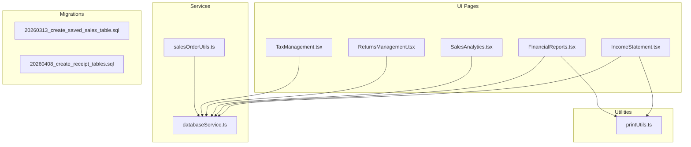

**Diagram sources**
- [IncomeStatement.tsx:1-593](file://src/pages/IncomeStatement.tsx#L1-L593)
- [FinancialReports.tsx:1-1178](file://src/pages/FinancialReports.tsx#L1-L1178)
- [SalesAnalytics.tsx:1-496](file://src/pages/SalesAnalytics.tsx#L1-L496)
- [ReturnsManagement.tsx:1-440](file://src/pages/ReturnsManagement.tsx#L1-L440)
- [TaxManagement.tsx:1-482](file://src/pages/TaxManagement.tsx#L1-L482)
- [databaseService.ts:1-5409](file://src/services/databaseService.ts#L1-L5409)
- [salesOrderUtils.ts:1-310](file://src/utils/salesOrderUtils.ts#L1-L310)
- [printUtils.ts:1-4330](file://src/utils/printUtils.ts#L1-L4330)
- [20260313_create_saved_sales_table.sql:1-55](file://migrations/20260313_create_saved_sales_table.sql#L1-L55)
- [20260408_create_receipt_tables.sql:1-306](file://migrations/20260408_create_receipt_tables.sql#L1-L306)

**Section sources**
- [IncomeStatement.tsx:1-593](file://src/pages/IncomeStatement.tsx#L1-L593)
- [FinancialReports.tsx:1-1178](file://src/pages/FinancialReports.tsx#L1-L1178)
- [SalesAnalytics.tsx:1-496](file://src/pages/SalesAnalytics.tsx#L1-L496)
- [ReturnsManagement.tsx:1-440](file://src/pages/ReturnsManagement.tsx#L1-L440)
- [TaxManagement.tsx:1-482](file://src/pages/TaxManagement.tsx#L1-L482)
- [databaseService.ts:1-5409](file://src/services/databaseService.ts#L1-L5409)
- [salesOrderUtils.ts:1-310](file://src/utils/salesOrderUtils.ts#L1-L310)
- [printUtils.ts:1-4330](file://src/utils/printUtils.ts#L1-L4330)
- [20260313_create_saved_sales_table.sql:1-55](file://migrations/20260313_create_saved_sales_table.sql#L1-L55)
- [20260408_create_receipt_tables.sql:1-306](file://migrations/20260408_create_receipt_tables.sql#L1-L306)

## Core Components
- Income Statement Page: Aggregates sales, purchases, expenses, and returns to compute revenue, COGS, gross profit, operating profit, other income/expenses, tax, and net profit. Includes VAT exclusive/inclusive calculations and detail dialogs for transparency.
- Financial Reports Page: Provides multiple financial views (Income Statement, Balance Sheet, Cash Flow, Trial Balance, Expense Report, Profitability Analysis) with print/export capabilities and tax summary filtering.
- Sales Analytics Page: Visualizes sales performance, customer retention, payment methods, and KPIs (revenue, transactions, average order value, conversion rate, CLV).
- Returns Management Page: Manages product returns and damages, including statuses and totals.
- Tax Management Page: Tracks tax records (income tax, sales tax, property tax) with print/export and status tracking.
- Database Service: Centralized data access for Sales, Purchase Orders, Expenses, Returns, Tax Records, and outlet-specific Saved Sales.
- Print Utilities: Handles receipt printing and financial report printing with QR code generation and mobile/desktop support.
- Sales Order Utils: Local-first persistence and database synchronization for sales orders with items and totals.

**Section sources**
- [IncomeStatement.tsx:35-86](file://src/pages/IncomeStatement.tsx#L35-L86)
- [FinancialReports.tsx:35-68](file://src/pages/FinancialReports.tsx#L35-L68)
- [SalesAnalytics.tsx:25-56](file://src/pages/SalesAnalytics.tsx#L25-L56)
- [ReturnsManagement.tsx:24-39](file://src/pages/ReturnsManagement.tsx#L24-L39)
- [TaxManagement.tsx:31-55](file://src/pages/TaxManagement.tsx#L31-L55)
- [databaseService.ts:151-170](file://src/services/databaseService.ts#L151-L170)
- [databaseService.ts:185-197](file://src/services/databaseService.ts#L185-L197)
- [databaseService.ts:211-224](file://src/services/databaseService.ts#L211-L224)
- [databaseService.ts:258-272](file://src/services/databaseService.ts#L258-L272)
- [databaseService.ts:311-326](file://src/services/databaseService.ts#L311-L326)
- [printUtils.ts:7-800](file://src/utils/printUtils.ts#L7-L800)
- [salesOrderUtils.ts:5-22](file://src/utils/salesOrderUtils.ts#L5-L22)

## Architecture Overview
The system follows a layered architecture:
- Presentation Layer: React pages for income statement, financial reports, analytics, returns, and tax management.
- Service Layer: databaseService.ts encapsulates Supabase data access for all entities.
- Utility Layer: printUtils.ts handles printing and QR code generation; salesOrderUtils.ts manages sales order persistence and synchronization.
- Data Layer: Supabase tables for Sales, Purchase Orders, Expenses, Returns, Tax Records, Saved Sales, and receipt tables.

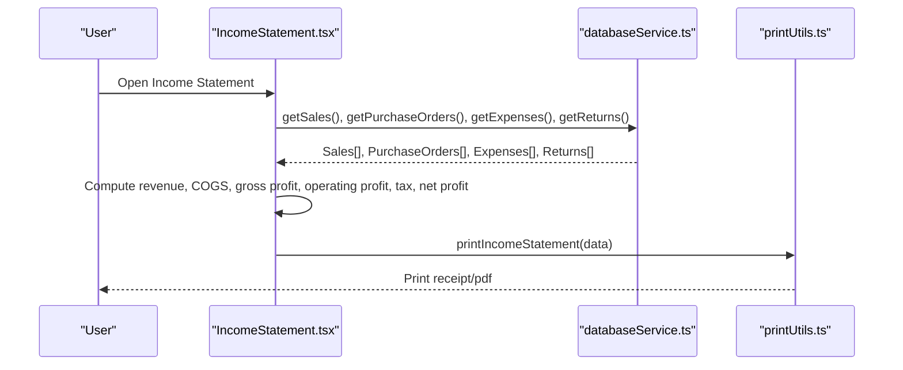

**Diagram sources**
- [IncomeStatement.tsx:200-299](file://src/pages/IncomeStatement.tsx#L200-L299)
- [databaseService.ts:151-170](file://src/services/databaseService.ts#L151-L170)
- [databaseService.ts:185-197](file://src/services/databaseService.ts#L185-L197)
- [databaseService.ts:211-224](file://src/services/databaseService.ts#L211-L224)
- [databaseService.ts:258-272](file://src/services/databaseService.ts#L258-L272)
- [printUtils.ts:7-800](file://src/utils/printUtils.ts#L7-L800)

## Detailed Component Analysis

### Income Statement Workflow
The Income Statement page aggregates financial data and computes key metrics:
- Revenue: Sum of sales minus returns
- COGS: Sum of purchase orders
- Gross Profit: Revenue - COGS
- Operating Expenses: Sum of expense records
- Operating Profit: Gross Profit - Operating Expenses
- Other Income/Expenses: Placeholder for additional items
- Tax: Progressive tax calculation based on taxable income
- Net Profit: Operating Profit + Other Income/Expenses - Tax
- VAT Handling: Computes inclusive/exclusive amounts using 18% VAT rate

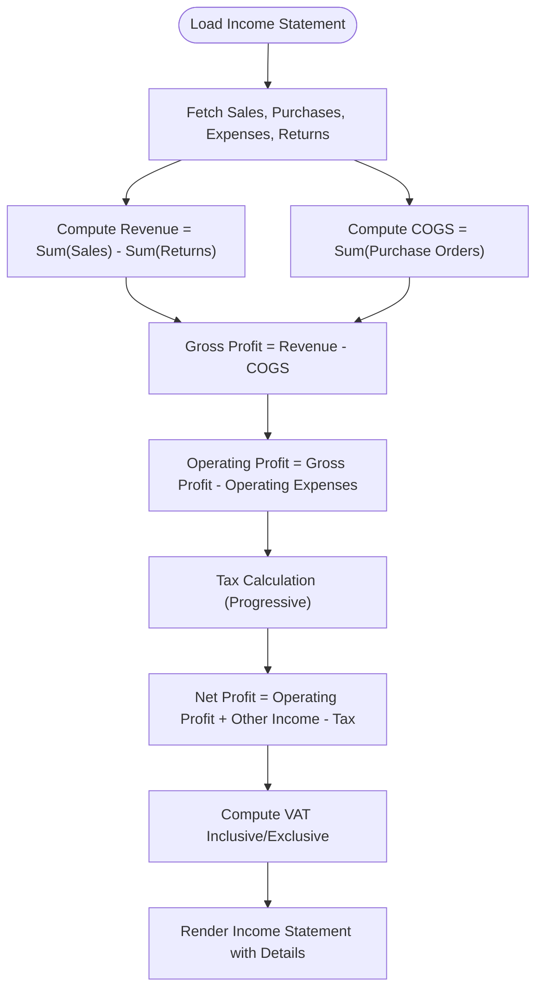

**Diagram sources**
- [IncomeStatement.tsx:200-299](file://src/pages/IncomeStatement.tsx#L200-L299)
- [IncomeStatement.tsx:251-264](file://src/pages/IncomeStatement.tsx#L251-L264)

**Section sources**
- [IncomeStatement.tsx:63-192](file://src/pages/IncomeStatement.tsx#L63-L192)
- [IncomeStatement.tsx:200-299](file://src/pages/IncomeStatement.tsx#L200-L299)
- [IncomeStatement.tsx:301-322](file://src/pages/IncomeStatement.tsx#L301-L322)

### Financial Reporting Features
The Financial Reports page offers:
- Report Views: Income Statement, Balance Sheet, Cash Flow, Fund Flow, Trial Balance, Expense Report, Profitability Analysis
- Tax Summary: Filter by date range and compute totals by tax type
- Print/Export: Print financial reports and export to PDF
- Custom Reports: Create and manage custom report configurations

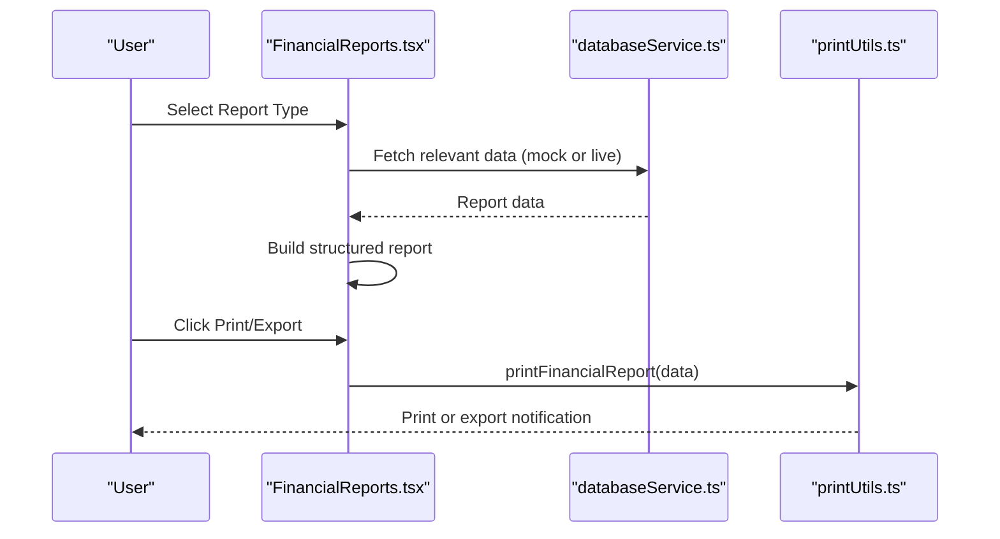

**Diagram sources**
- [FinancialReports.tsx:155-309](file://src/pages/FinancialReports.tsx#L155-L309)
- [FinancialReports.tsx:382-475](file://src/pages/FinancialReports.tsx#L382-L475)
- [FinancialReports.tsx:477-490](file://src/pages/FinancialReports.tsx#L477-L490)
- [databaseService.ts:311-326](file://src/services/databaseService.ts#L311-L326)
- [printUtils.ts:7-800](file://src/utils/printUtils.ts#L7-L800)

**Section sources**
- [FinancialReports.tsx:70-702](file://src/pages/FinancialReports.tsx#L70-L702)
- [FinancialReports.tsx:311-380](file://src/pages/FinancialReports.tsx#L311-L380)
- [FinancialReports.tsx:382-490](file://src/pages/FinancialReports.tsx#L382-L490)

### Sales Analytics and Performance Metrics
Sales Analytics visualizes:
- Daily sales and transaction counts
- Customer retention trends
- Category/product performance
- Payment method distribution
- KPIs: total revenue, transactions, average order value, conversion rate, CLV, average transaction time

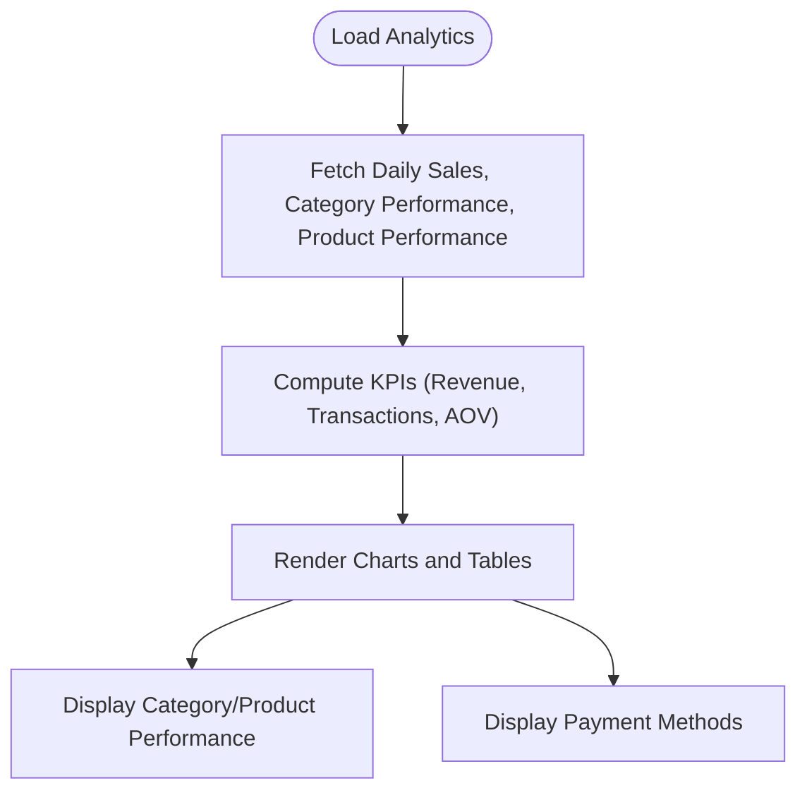

**Diagram sources**
- [SalesAnalytics.tsx:130-156](file://src/pages/SalesAnalytics.tsx#L130-L156)

**Section sources**
- [SalesAnalytics.tsx:114-196](file://src/pages/SalesAnalytics.tsx#L114-L196)
- [SalesAnalytics.tsx:158-167](file://src/pages/SalesAnalytics.tsx#L158-L167)
- [SalesAnalytics.tsx:209-496](file://src/pages/SalesAnalytics.tsx#L209-L496)

### Returns and Revenue Reconciliation
Returns Management supports:
- Return and damage records with statuses (pending, processed, refunded)
- Filtering by type and status
- Totals computed per return record

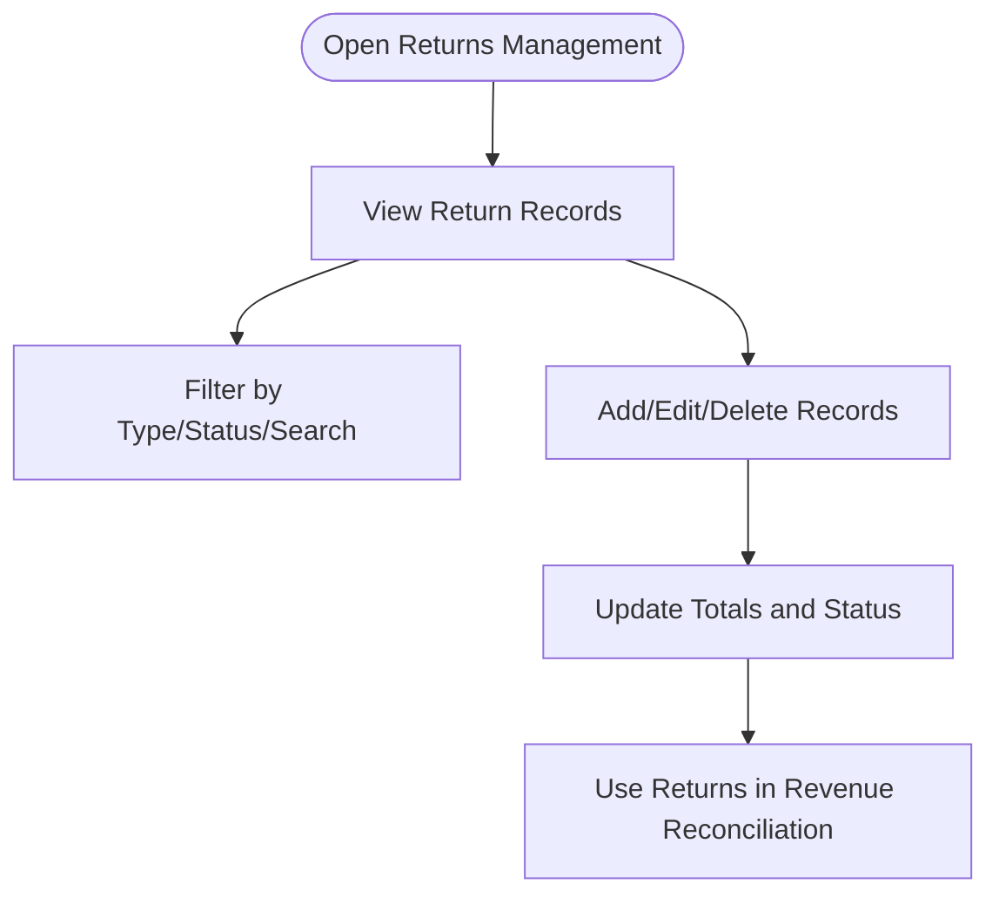

**Diagram sources**
- [ReturnsManagement.tsx:41-94](file://src/pages/ReturnsManagement.tsx#L41-L94)
- [ReturnsManagement.tsx:184-194](file://src/pages/ReturnsManagement.tsx#L184-L194)

**Section sources**
- [ReturnsManagement.tsx:41-94](file://src/pages/ReturnsManagement.tsx#L41-L94)
- [ReturnsManagement.tsx:184-194](file://src/pages/ReturnsManagement.tsx#L184-L194)

### Tax Management and VAT Handling
Tax Management tracks:
- Tax records by type (income_tax, sales_tax, property_tax)
- Periods, rates, amounts, and statuses
- Printing and exporting tax summaries

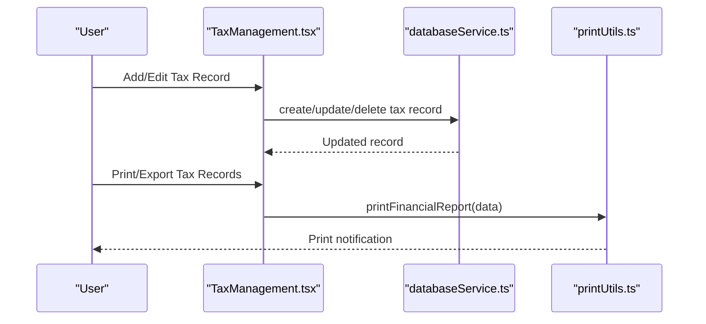

**Diagram sources**
- [TaxManagement.tsx:79-147](file://src/pages/TaxManagement.tsx#L79-L147)
- [TaxManagement.tsx:176-207](file://src/pages/TaxManagement.tsx#L176-L207)
- [databaseService.ts:311-326](file://src/services/databaseService.ts#L311-L326)
- [printUtils.ts:7-800](file://src/utils/printUtils.ts#L7-L800)

**Section sources**
- [TaxManagement.tsx:37-77](file://src/pages/TaxManagement.tsx#L37-L77)
- [TaxManagement.tsx:115-167](file://src/pages/TaxManagement.tsx#L115-L167)
- [TaxManagement.tsx:176-207](file://src/pages/TaxManagement.tsx#L176-L207)

### Sales Data Aggregation and Persistence
Sales data aggregation and persistence:
- Sales entities include invoice numbers, dates, totals, amounts paid, change, payment methods, and status
- Purchase Orders contribute to COGS
- Expenses contribute to operating expenses
- Returns reduce revenue
- Sales orders are persisted locally and synchronized to the database with items and computed totals

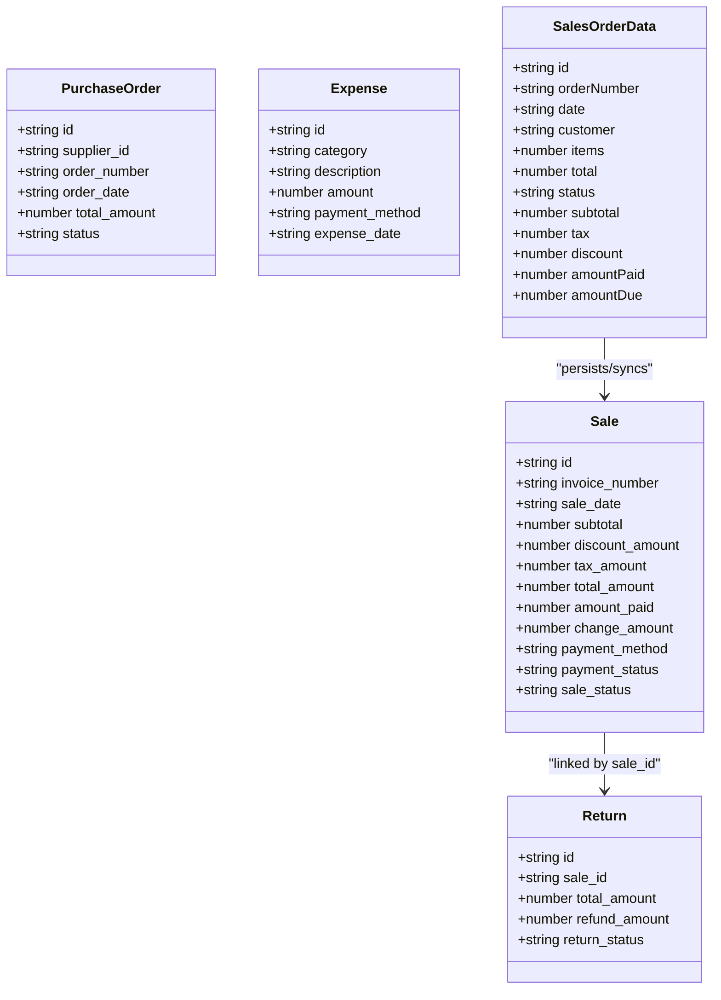

**Diagram sources**
- [databaseService.ts:151-170](file://src/services/databaseService.ts#L151-L170)
- [databaseService.ts:185-197](file://src/services/databaseService.ts#L185-L197)
- [databaseService.ts:211-224](file://src/services/databaseService.ts#L211-L224)
- [databaseService.ts:258-272](file://src/services/databaseService.ts#L258-L272)
- [salesOrderUtils.ts:5-22](file://src/utils/salesOrderUtils.ts#L5-L22)

**Section sources**
- [databaseService.ts:151-170](file://src/services/databaseService.ts#L151-L170)
- [databaseService.ts:185-197](file://src/services/databaseService.ts#L185-L197)
- [databaseService.ts:211-224](file://src/services/databaseService.ts#L211-L224)
- [databaseService.ts:258-272](file://src/services/databaseService.ts#L258-L272)
- [salesOrderUtils.ts:24-84](file://src/utils/salesOrderUtils.ts#L24-L84)

### Print and Export Capabilities
Print utilities support:
- Receipt printing with QR codes for sales and purchase transactions
- Financial report printing
- Mobile and desktop compatibility
- Loading indicators and error handling

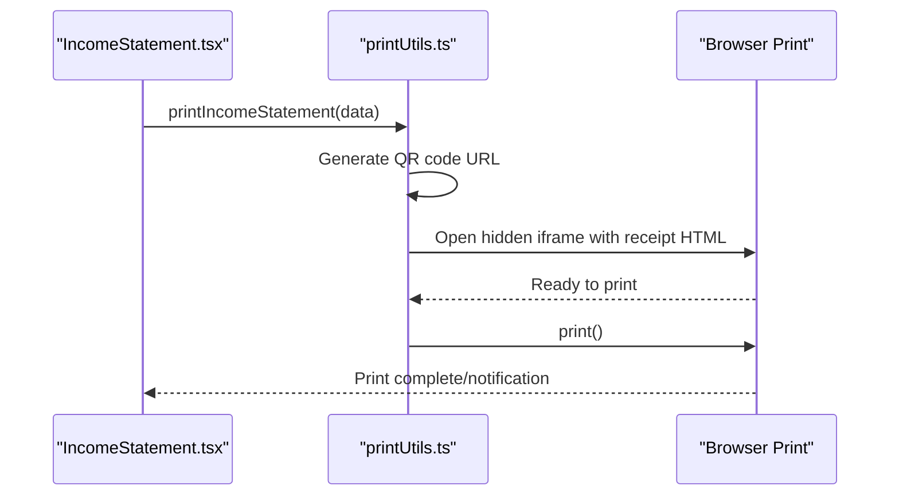

**Diagram sources**
- [IncomeStatement.tsx:301-322](file://src/pages/IncomeStatement.tsx#L301-L322)
- [printUtils.ts:48-418](file://src/utils/printUtils.ts#L48-L418)

**Section sources**
- [IncomeStatement.tsx:301-322](file://src/pages/IncomeStatement.tsx#L301-L322)
- [printUtils.ts:48-418](file://src/utils/printUtils.ts#L48-L418)

### Database Schema and Data Model
Key schema elements:
- Saved Sales table for outlet-specific saved sales with JSONB items and indexes
- Receipt tables for commission receipts, other receipts, and customer settlements with RLS policies

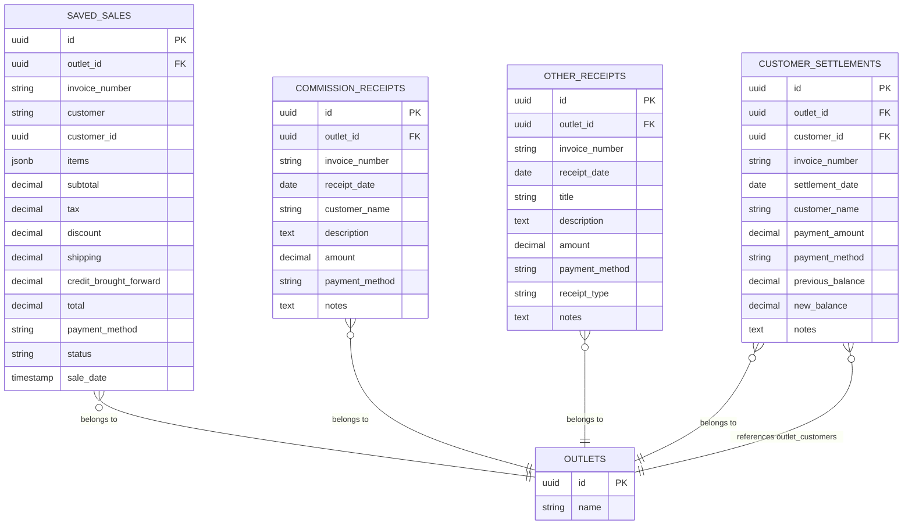

**Diagram sources**
- [20260313_create_saved_sales_table.sql:1-55](file://migrations/20260313_create_saved_sales_table.sql#L1-L55)
- [20260408_create_receipt_tables.sql:8-21](file://migrations/20260408_create_receipt_tables.sql#L8-L21)
- [20260408_create_receipt_tables.sql:92-106](file://migrations/20260408_create_receipt_tables.sql#L92-L106)
- [20260408_create_receipt_tables.sql:185-200](file://migrations/20260408_create_receipt_tables.sql#L185-L200)

**Section sources**
- [20260313_create_saved_sales_table.sql:1-55](file://migrations/20260313_create_saved_sales_table.sql#L1-L55)
- [20260408_create_receipt_tables.sql:1-306](file://migrations/20260408_create_receipt_tables.sql#L1-L306)

## Dependency Analysis
The system exhibits clear separation of concerns:
- UI pages depend on databaseService.ts for data access
- Print functionality depends on printUtils.ts
- Sales order persistence depends on salesOrderUtils.ts and databaseService.ts
- DatabaseService.ts defines typed interfaces for all entities and exposes CRUD functions

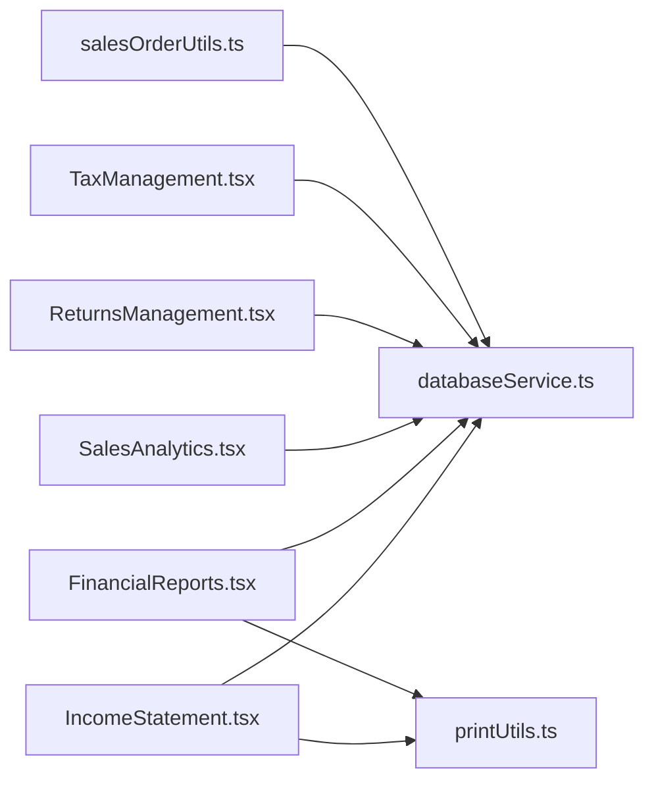

**Diagram sources**
- [IncomeStatement.tsx:1-28](file://src/pages/IncomeStatement.tsx#L1-L28)
- [FinancialReports.tsx:1-26](file://src/pages/FinancialReports.tsx#L1-L26)
- [SalesAnalytics.tsx:1-23](file://src/pages/SalesAnalytics.tsx#L1-L23)
- [ReturnsManagement.tsx:1-12](file://src/pages/ReturnsManagement.tsx#L1-L12)
- [TaxManagement.tsx:1-29](file://src/pages/TaxManagement.tsx#L1-L29)
- [salesOrderUtils.ts](file://src/utils/salesOrderUtils.ts#L1)
- [printUtils.ts](file://src/utils/printUtils.ts#L1)

**Section sources**
- [IncomeStatement.tsx:1-28](file://src/pages/IncomeStatement.tsx#L1-L28)
- [FinancialReports.tsx:1-26](file://src/pages/FinancialReports.tsx#L1-L26)
- [SalesAnalytics.tsx:1-23](file://src/pages/SalesAnalytics.tsx#L1-L23)
- [ReturnsManagement.tsx:1-12](file://src/pages/ReturnsManagement.tsx#L1-L12)
- [TaxManagement.tsx:1-29](file://src/pages/TaxManagement.tsx#L1-L29)
- [salesOrderUtils.ts](file://src/utils/salesOrderUtils.ts#L1)
- [printUtils.ts](file://src/utils/printUtils.ts#L1)

## Performance Considerations
- Parallel Data Fetching: Income Statement and Financial Reports use Promise.all to fetch multiple datasets concurrently, reducing load times.
- Efficient Aggregation: Revenue, COGS, and expenses are aggregated client-side using reduce operations; ensure dataset sizes remain reasonable for optimal performance.
- Indexes and Queries: Saved Sales table includes indexes on outlet_id, customer_id, status, payment_method, and sale_date to optimize filtering and sorting.
- Mobile Printing: Print utilities detect mobile devices and adjust the printing approach to improve reliability.
- Local Persistence: Sales orders are stored locally with fallback to database retrieval, minimizing network latency and improving responsiveness.

[No sources needed since this section provides general guidance]

## Troubleshooting Guide
Common issues and resolutions:
- Income Statement Data Discrepancies
  - Verify sales, purchases, expenses, and returns data sources are accurate and up-to-date.
  - Confirm VAT calculations align with the configured rate and inclusive/exclusive computations.
  - Check for missing or incorrect return records that could inflate revenue.
  - Review tax bracket logic and taxable income computation.

- Print/Export Failures
  - Ensure browser allows pop-ups and printing for the site.
  - On mobile devices, use the mobile print approach and confirm QR code generation URLs are accessible.
  - For PDF exports, verify export simulation completes successfully and toast notifications confirm completion.

- Sales Data Synchronization
  - Confirm sales orders are saved to both localStorage and the database via salesOrderUtils.
  - Validate that sale items are inserted correctly and totals are recalculated after updates.

- Tax Record Issues
  - Validate tax type, period, rate, and amount entries in Tax Management.
  - Use print/export features to reconcile tax summaries and ensure accurate reporting.

- Database Access and RLS
  - If database queries fail, review RLS policies and ensure user roles permit access.
  - Use provided RLS policy helpers to diagnose and fix policy issues.

**Section sources**
- [IncomeStatement.tsx:286-296](file://src/pages/IncomeStatement.tsx#L286-L296)
- [printUtils.ts:88-90](file://src/utils/printUtils.ts#L88-L90)
- [salesOrderUtils.ts:204-246](file://src/utils/salesOrderUtils.ts#L204-L246)
- [TaxManagement.tsx:115-147](file://src/pages/TaxManagement.tsx#L115-L147)

## Conclusion
Royal POS Modern’s income tracking and revenue management system integrates sales capture, returns processing, tax management, and financial reporting into a cohesive workflow. The Income Statement page provides transparent revenue computation with VAT handling, while Financial Reports offer comprehensive insights and export capabilities. Sales Analytics enhances decision-making with performance metrics and visualizations. Robust print utilities and database schema support reliable data persistence and reconciliation. By following the troubleshooting steps and leveraging the documented features, users can maintain accurate revenue records and generate meaningful financial reports.