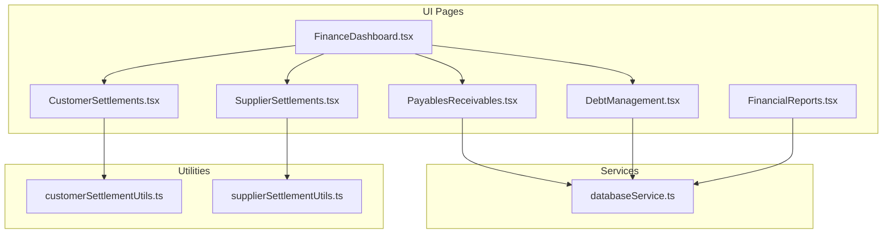
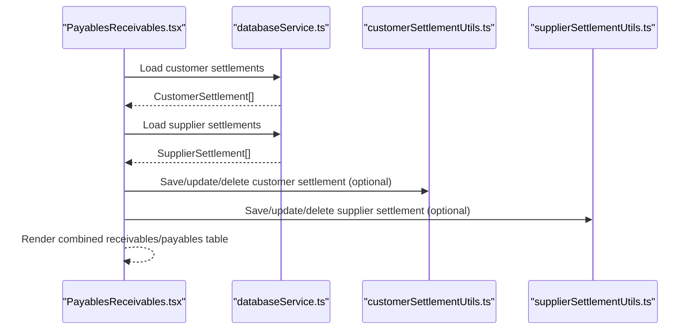
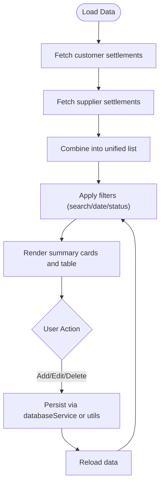
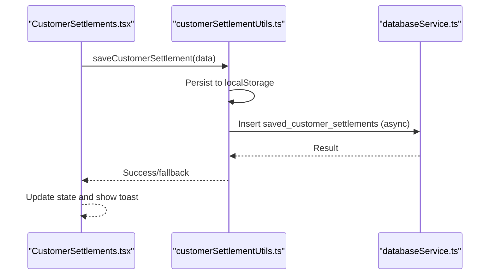
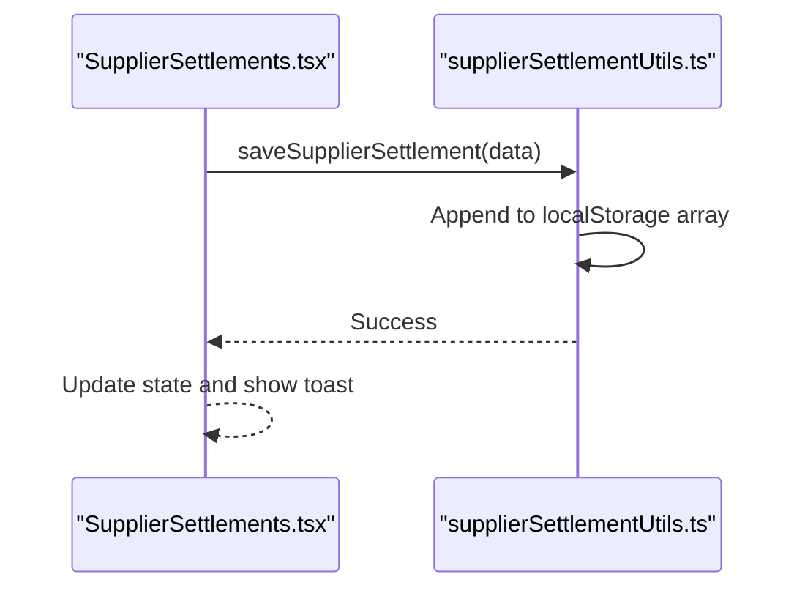
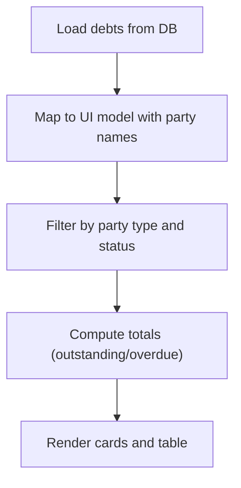
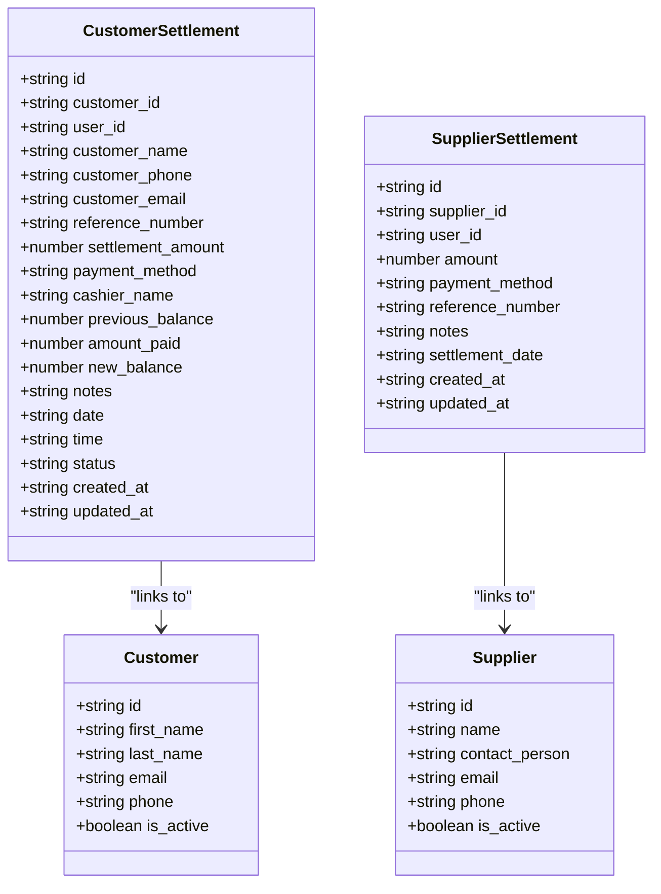
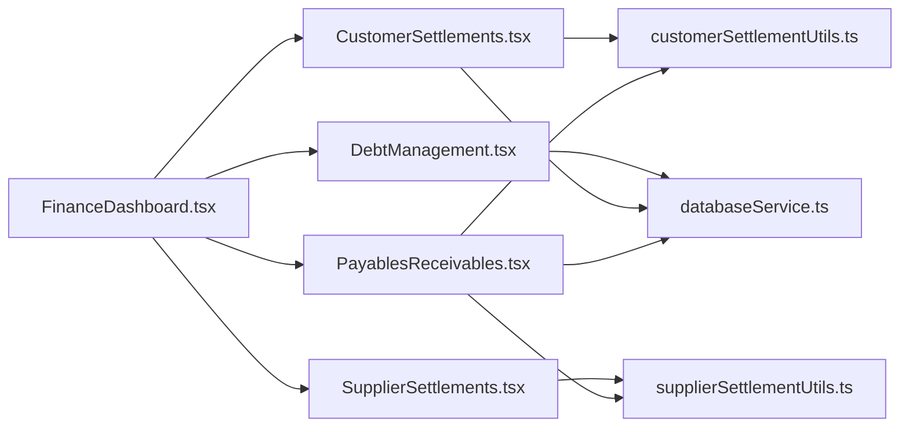

# Payables and Receivables Management

<cite>
**Referenced Files in This Document**
- [PayablesReceivables.tsx](file://src/pages/PayablesReceivables.tsx)
- [databaseService.ts](file://src/services/databaseService.ts)
- [customerSettlementUtils.ts](file://src/utils/customerSettlementUtils.ts)
- [supplierSettlementUtils.ts](file://src/utils/supplierSettlementUtils.ts)
- [CustomerSettlements.tsx](file://src/pages/CustomerSettlements.tsx)
- [SupplierSettlements.tsx](file://src/pages/SupplierSettlements.tsx)
- [DebtManagement.tsx](file://src/pages/DebtManagement.tsx)
- [FinanceDashboard.tsx](file://src/pages/FinanceDashboard.tsx)
- [FinancialReports.tsx](file://src/pages/FinancialReports.tsx)
</cite>

## Table of Contents
1. [Introduction](#introduction)
2. [Project Structure](#project-structure)
3. [Core Components](#core-components)
4. [Architecture Overview](#architecture-overview)
5. [Detailed Component Analysis](#detailed-component-analysis)
6. [Dependency Analysis](#dependency-analysis)
7. [Performance Considerations](#performance-considerations)
8. [Troubleshooting Guide](#troubleshooting-guide)
9. [Conclusion](#conclusion)

## Introduction
This document describes the payables and receivables management system within the POS Modern application. It explains how accounts receivable (customer debt) and accounts payable (supplier obligations) are modeled, captured, and reported. The system supports:
- Receivables: customer settlement entries, payment applications, and basic aging via due dates
- Payables: supplier settlement entries and payment tracking
- Reporting: summary cards, filters, exports, and dashboards
- Integrations: Supabase-backed persistence and local storage fallbacks

Where applicable, this document provides practical examples for receivable entry scenarios, payment applications, and write-off procedures, along with guidance on collections strategies, supplier negotiation, and working capital optimization.

## Project Structure
The payables and receivables functionality spans UI pages, service utilities, and data models:
- UI pages for Payables & Receivables, Customer Settlements, Supplier Settlements, and Debt Management
- Service layer for Supabase data access and model definitions
- Utilities for customer and supplier settlement persistence and formatting
- Dashboard and reports for financial visibility

**Diagram sources**
- [PayablesReceivables.tsx:1-963](file://src/pages/PayablesReceivables.tsx#L1-L963)
- [CustomerSettlements.tsx:1-665](file://src/pages/CustomerSettlements.tsx#L1-L665)
- [SupplierSettlements.tsx:1-473](file://src/pages/SupplierSettlements.tsx#L1-L473)
- [DebtManagement.tsx:30-517](file://src/pages/DebtManagement.tsx#L30-L517)
- [FinanceDashboard.tsx:52-97](file://src/pages/FinanceDashboard.tsx#L52-L97)
- [FinancialReports.tsx:214-449](file://src/pages/FinancialReports.tsx#L214-L449)
- [databaseService.ts:365-398](file://src/services/databaseService.ts#L365-L398)
- [customerSettlementUtils.ts:1-430](file://src/utils/customerSettlementUtils.ts#L1-L430)
- [supplierSettlementUtils.ts:1-121](file://src/utils/supplierSettlementUtils.ts#L1-L121)

**Section sources**
- [PayablesReceivables.tsx:1-963](file://src/pages/PayablesReceivables.tsx#L1-L963)
- [databaseService.ts:365-398](file://src/services/databaseService.ts#L365-L398)
- [customerSettlementUtils.ts:1-430](file://src/utils/customerSettlementUtils.ts#L1-L430)
- [supplierSettlementUtils.ts:1-121](file://src/utils/supplierSettlementUtils.ts#L1-L121)
- [FinanceDashboard.tsx:52-97](file://src/pages/FinanceDashboard.tsx#L52-L97)

## Core Components
- Payables & Receivables page: central hub for viewing and managing receivables/payables entries, filtering, exporting, and printing
- Customer Settlements: detailed capture of customer payments and balances
- Supplier Settlements: detailed capture of supplier payments and PO linkage
- Debt Management: broader debt lifecycle tracking (notably useful for aging and overdue monitoring)
- Services and Models: Supabase-backed data access and typed models for settlements and parties
- Utilities: local storage-backed persistence for settlements with database synchronization

Key capabilities:
- Receivable entry: create/update/delete settlement records with amounts, due dates, payment methods, and references
- Payable entry: create/update/delete supplier settlement records with amounts, payment methods, and references
- Aging and overdue: due date filtering and status badges for overdue items
- Reporting: summary cards, export to CSV/Excel, print reports
- Party management: create new customers/suppliers and link to entries

**Section sources**
- [PayablesReceivables.tsx:52-137](file://src/pages/PayablesReceivables.tsx#L52-L137)
- [CustomerSettlements.tsx:59-103](file://src/pages/CustomerSettlements.tsx#L59-L103)
- [SupplierSettlements.tsx:37-66](file://src/pages/SupplierSettlements.tsx#L37-L66)
- [DebtManagement.tsx:30-66](file://src/pages/DebtManagement.tsx#L30-L66)
- [databaseService.ts:365-398](file://src/services/databaseService.ts#L365-L398)
- [customerSettlementUtils.ts:45-126](file://src/utils/customerSettlementUtils.ts#L45-L126)
- [supplierSettlementUtils.ts:24-48](file://src/utils/supplierSettlementUtils.ts#L24-L48)

## Architecture Overview
The system follows a layered architecture:
- UI Layer: React pages for Payables & Receivables, Customer Settlements, Supplier Settlements, and Debt Management
- Service Layer: Supabase client access for persistent data retrieval and updates
- Utility Layer: Local storage-backed persistence for offline resilience and quick UI updates
- Model Layer: Typed interfaces for settlements, parties, and related entities

**Diagram sources**
- [PayablesReceivables.tsx:88-137](file://src/pages/PayablesReceivables.tsx#L88-L137)
- [databaseService.ts:365-398](file://src/services/databaseService.ts#L365-L398)
- [customerSettlementUtils.ts:45-126](file://src/utils/customerSettlementUtils.ts#L45-L126)
- [supplierSettlementUtils.ts:24-48](file://src/utils/supplierSettlementUtils.ts#L24-L48)

## Detailed Component Analysis

### Payables & Receivables Page
This page consolidates receivables and payables into a unified view:
- Loads customer settlements (receivables) and supplier settlements (payables)
- Provides search, date range, and status filters
- Supports adding/editing/deleting entries
- Offers export/print capabilities

**Diagram sources**
- [PayablesReceivables.tsx:88-137](file://src/pages/PayablesReceivables.tsx#L88-L137)
- [databaseService.ts:365-398](file://src/services/databaseService.ts#L365-L398)
- [customerSettlementUtils.ts:45-126](file://src/utils/customerSettlementUtils.ts#L45-L126)
- [supplierSettlementUtils.ts:24-48](file://src/utils/supplierSettlementUtils.ts#L24-L48)

**Section sources**
- [PayablesReceivables.tsx:52-137](file://src/pages/PayablesReceivables.tsx#L52-L137)
- [PayablesReceivables.tsx:467-497](file://src/pages/PayablesReceivables.tsx#L467-L497)
- [PayablesReceivables.tsx:880-963](file://src/pages/PayablesReceivables.tsx#L880-L963)

### Customer Settlements
This page focuses on customer-side debt and payments:
- Captures customer name, amount, payment method, reference, previous/new balances, and status
- Persists to local storage with optional database synchronization
- Supports filtering and summary cards

**Diagram sources**
- [CustomerSettlements.tsx:105-167](file://src/pages/CustomerSettlements.tsx#L105-L167)
- [customerSettlementUtils.ts:45-126](file://src/utils/customerSettlementUtils.ts#L45-L126)

**Section sources**
- [CustomerSettlements.tsx:59-103](file://src/pages/CustomerSettlements.tsx#L59-L103)
- [CustomerSettlements.tsx:105-167](file://src/pages/CustomerSettlements.tsx#L105-L167)
- [CustomerSettlements.tsx:169-224](file://src/pages/CustomerSettlements.tsx#L169-L224)
- [CustomerSettlements.tsx:226-251](file://src/pages/CustomerSettlements.tsx#L226-L251)
- [customerSettlementUtils.ts:45-126](file://src/utils/customerSettlementUtils.ts#L45-L126)

### Supplier Settlements
This page manages supplier payments:
- Captures supplier name, amount, payment method, reference, PO number, and status
- Stores locally and can be extended to persist to database

**Diagram sources**
- [SupplierSettlements.tsx:68-95](file://src/pages/SupplierSettlements.tsx#L68-L95)
- [supplierSettlementUtils.ts:24-48](file://src/utils/supplierSettlementUtils.ts#L24-L48)

**Section sources**
- [SupplierSettlements.tsx:37-66](file://src/pages/SupplierSettlements.tsx#L37-L66)
- [SupplierSettlements.tsx:68-95](file://src/pages/SupplierSettlements.tsx#L68-L95)
- [SupplierSettlements.tsx:97-123](file://src/pages/SupplierSettlements.tsx#L97-L123)
- [SupplierSettlements.tsx:125-136](file://src/pages/SupplierSettlements.tsx#L125-L136)
- [supplierSettlementUtils.ts:24-48](file://src/utils/supplierSettlementUtils.ts#L24-L48)

### Debt Management
While not exclusively receivables/payables, Debt Management complements aging and overdue tracking:
- Tracks debt type (customer/supplier), amount, due date, and status
- Provides summary cards for outstanding and overdue amounts
- Useful for aging analysis and collections prioritization

**Diagram sources**
- [DebtManagement.tsx:49-83](file://src/pages/DebtManagement.tsx#L49-L83)
- [DebtManagement.tsx:30-66](file://src/pages/DebtManagement.tsx#L30-L66)

**Section sources**
- [DebtManagement.tsx:30-66](file://src/pages/DebtManagement.tsx#L30-L66)
- [DebtManagement.tsx:49-83](file://src/pages/DebtManagement.tsx#L49-L83)
- [DebtManagement.tsx:485-507](file://src/pages/DebtManagement.tsx#L485-L507)

### Data Models and Interfaces
Core models for payables/receivables:
- CustomerSettlement: customer-related settlement with amounts, balances, and metadata
- SupplierSettlement: supplier-related settlement with amounts and metadata
- Party types: customer and supplier entities used for linking

**Diagram sources**
- [databaseService.ts:365-398](file://src/services/databaseService.ts#L365-L398)
- [databaseService.ts:44-78](file://src/services/databaseService.ts#L44-L78)

**Section sources**
- [databaseService.ts:365-398](file://src/services/databaseService.ts#L365-L398)
- [databaseService.ts:44-78](file://src/services/databaseService.ts#L44-L78)

## Dependency Analysis
- PayablesReceivables.tsx depends on databaseService for customer/supplier settlement retrieval and on utils for optional persistence
- CustomerSettlements.tsx depends on customerSettlementUtils for local storage persistence and databaseService for outlets
- SupplierSettlements.tsx depends on supplierSettlementUtils for local storage persistence
- DebtManagement.tsx depends on databaseService for debt retrieval and party resolution
- FinanceDashboard.tsx references payables/receivables, customer/supplier settlements, and debt management as dashboard tiles

**Diagram sources**
- [PayablesReceivables.tsx:17-28](file://src/pages/PayablesReceivables.tsx#L17-L28)
- [CustomerSettlements.tsx:14-15](file://src/pages/CustomerSettlements.tsx#L14-L15)
- [SupplierSettlements.tsx:1-14](file://src/pages/SupplierSettlements.tsx#L1-L14)
- [DebtManagement.tsx:1-20](file://src/pages/DebtManagement.tsx#L1-L20)
- [FinanceDashboard.tsx:52-97](file://src/pages/FinanceDashboard.tsx#L52-L97)

**Section sources**
- [PayablesReceivables.tsx:17-28](file://src/pages/PayablesReceivables.tsx#L17-L28)
- [CustomerSettlements.tsx:14-15](file://src/pages/CustomerSettlements.tsx#L14-L15)
- [SupplierSettlements.tsx:1-14](file://src/pages/SupplierSettlements.tsx#L1-L14)
- [DebtManagement.tsx:1-20](file://src/pages/DebtManagement.tsx#L1-L20)
- [FinanceDashboard.tsx:52-97](file://src/pages/FinanceDashboard.tsx#L52-L97)

## Performance Considerations
- Filtering and rendering: The Payables & Receivables page applies client-side filters; for large datasets, consider server-side filtering/pagination
- Persistence: Local storage writes occur on every change; batch operations or debounced saves could reduce overhead
- Data loading: Combining customer and supplier settlements in a single list is efficient but may benefit from separate lists with lazy loading
- Currency formatting: Formatting occurs in UI; ensure consistent locale handling for international deployments

## Troubleshooting Guide
Common issues and resolutions:
- Data not loading: Verify Supabase connectivity and table permissions; check toast messages for errors
- Settlements not persisting: Confirm local storage availability; note that customer settlement persistence uses a hybrid approach with database inserts
- Filters not working: Ensure date formats match expected patterns and that statuses are correctly mapped
- Export failures: Validate export utilities and confirm browser support for downloads

**Section sources**
- [PayablesReceivables.tsx:127-136](file://src/pages/PayablesReceivables.tsx#L127-L136)
- [PayablesReceivables.tsx:322-350](file://src/pages/PayablesReceivables.tsx#L322-L350)
- [customerSettlementUtils.ts:128-176](file://src/utils/customerSettlementUtils.ts#L128-L176)
- [supplierSettlementUtils.ts:51-59](file://src/utils/supplierSettlementUtils.ts#L51-L59)

## Conclusion
The payables and receivables management system provides a solid foundation for tracking customer and supplier settlements, with integrated reporting and export capabilities. While the current implementation emphasizes local storage and basic Supabase integration, extending database-backed persistence for all settlement operations would improve auditability and cross-device synchronization. The Debt Management module complements aging and overdue tracking, supporting collections strategies and working capital optimization.