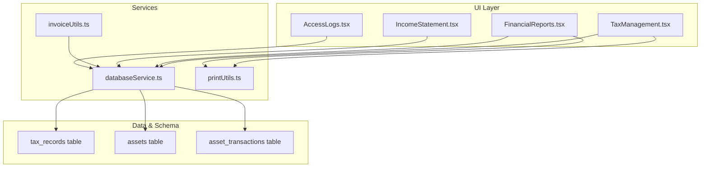
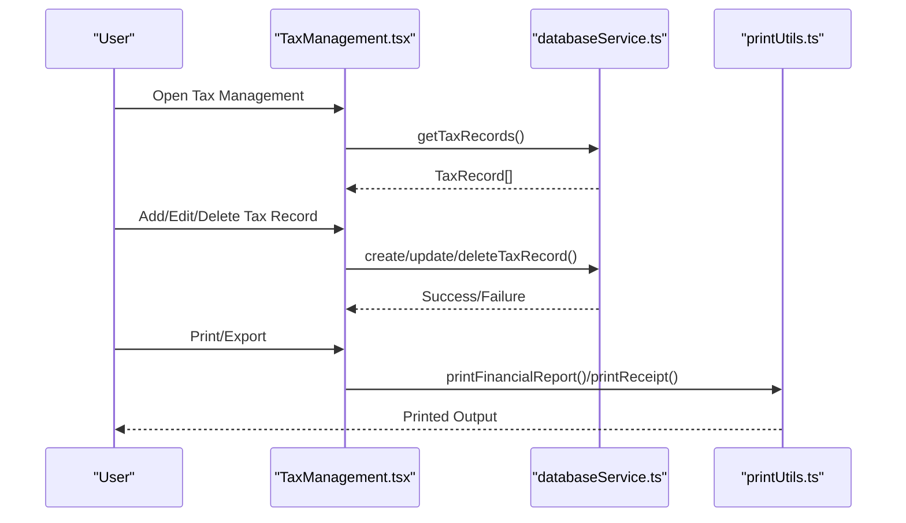
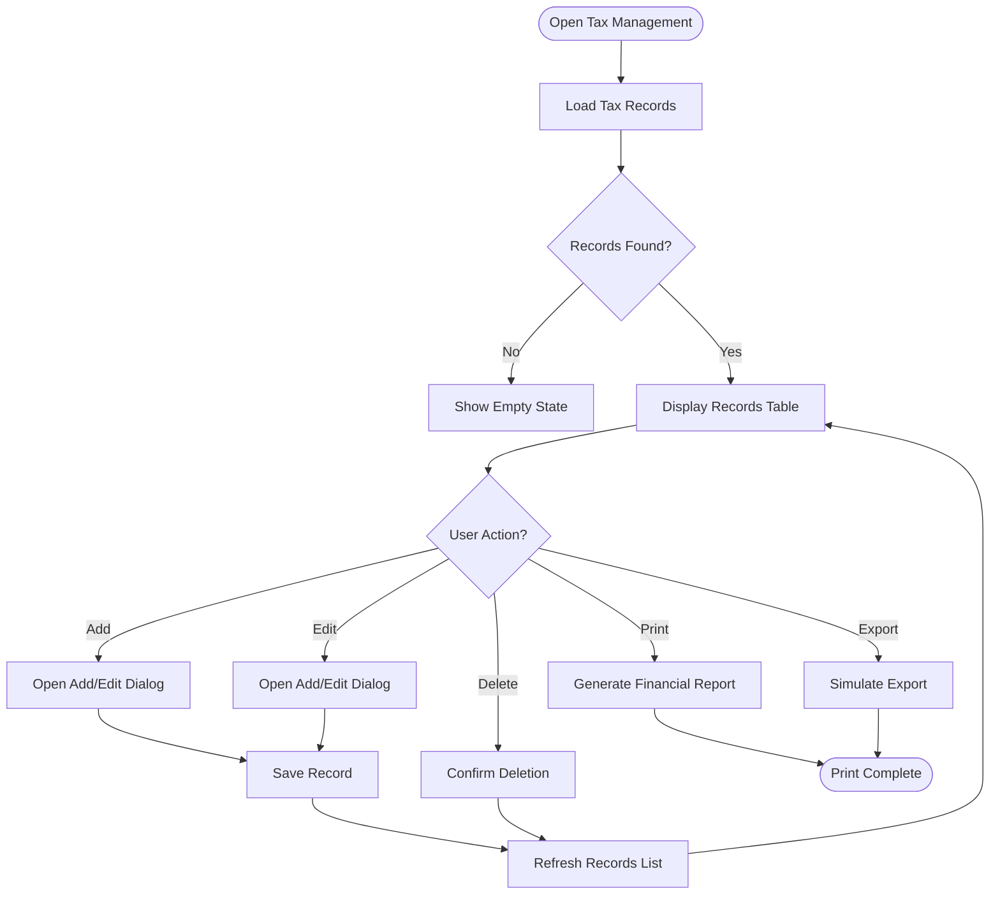
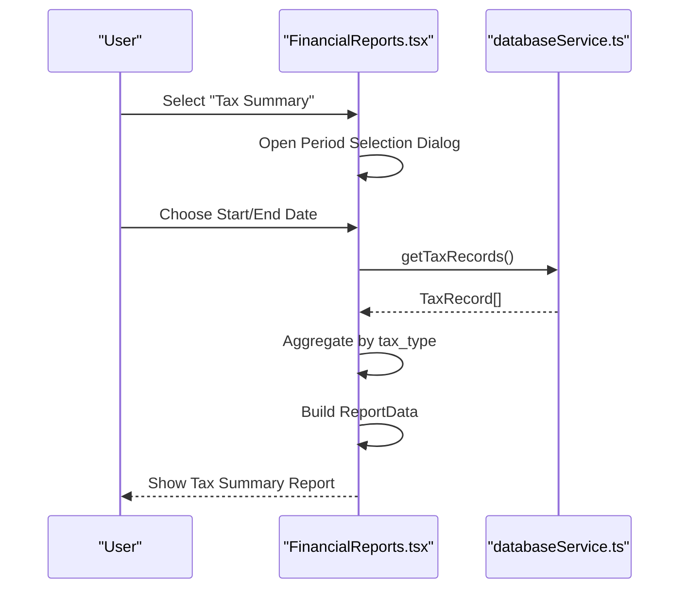
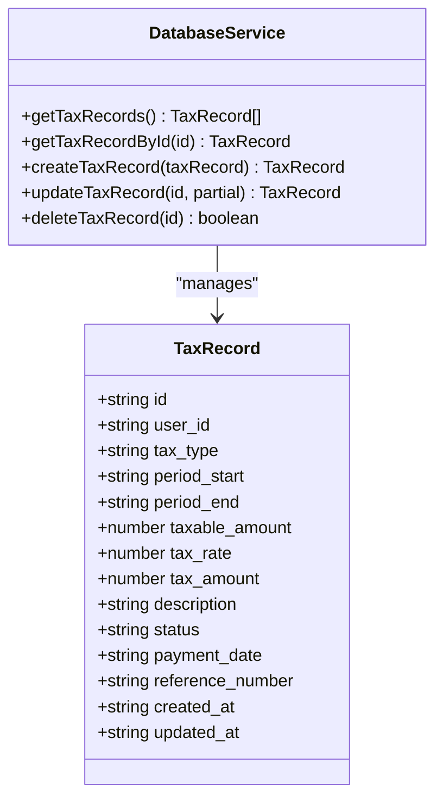
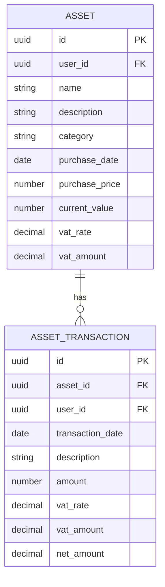
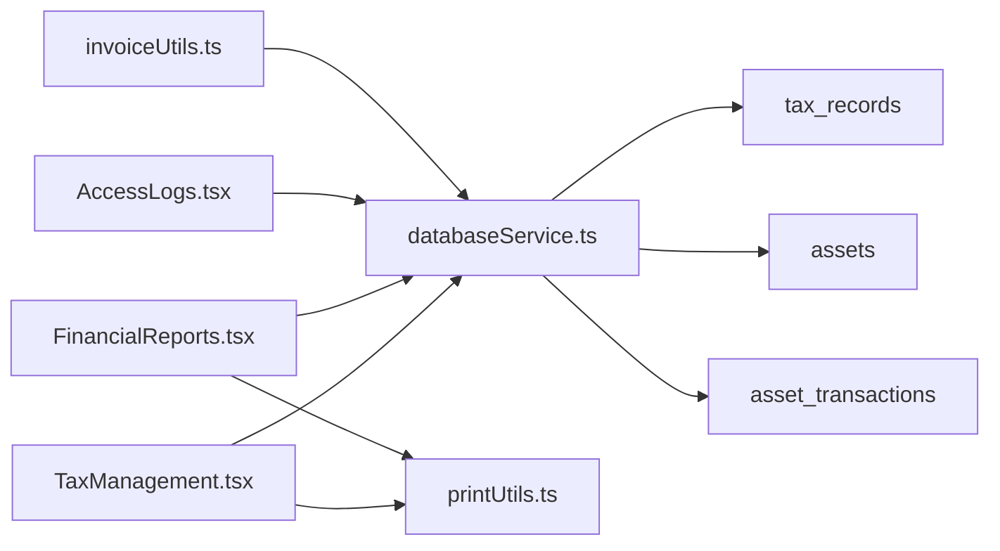

# Tax Management and Compliance

<cite>
**Referenced Files in This Document**
- [TaxManagement.tsx](file://src/pages/TaxManagement.tsx)
- [databaseService.ts](file://src/services/databaseService.ts)
- [FinancialReports.tsx](file://src/pages/FinancialReports.tsx)
- [IncomeStatement.tsx](file://src/pages/IncomeStatement.tsx)
- [20251125_add_vat_depreciation_columns.sql](file://migrations/20251125_add_vat_depreciation_columns.sql)
- [printUtils.ts](file://src/utils/printUtils.ts)
- [AccessLogs.tsx](file://src/pages/AccessLogs.tsx)
- [invoiceUtils.ts](file://src/utils/invoiceUtils.ts)
</cite>

## Table of Contents
1. [Introduction](#introduction)
2. [Project Structure](#project-structure)
3. [Core Components](#core-components)
4. [Architecture Overview](#architecture-overview)
5. [Detailed Component Analysis](#detailed-component-analysis)
6. [Dependency Analysis](#dependency-analysis)
7. [Performance Considerations](#performance-considerations)
8. [Troubleshooting Guide](#troubleshooting-guide)
9. [Conclusion](#conclusion)

## Introduction
This document explains the tax management and compliance system within the Royal POS Modern platform. It covers the end-to-end tax processing workflow from calculation and filing to compliance tracking, including VAT handling, tax rate management, and tax reporting. It also documents tax categorization, deduction tracking, optimization strategies, compliance features such as tax summaries and audit trails, and practical examples for tax calculation scenarios, rate changes, and compliance monitoring. Guidance is provided for tax law updates, regulatory changes, automated processing, tax planning, deduction maximization, and integration with tax preparation software.

## Project Structure
The tax management system spans UI pages, services, utilities, and database migrations:
- Tax management UI: Tax records creation, editing, and reporting
- Financial reporting UI: Tax summary reports and period selection
- Database service: Tax record persistence and retrieval
- Print utilities: Receipt and report printing
- Access logs: Audit trail for system access
- VAT and depreciation columns: Asset and asset transaction enhancements
- Invoice utilities: Receipt data persistence with tax fields

**Diagram sources**
- [TaxManagement.tsx:1-482](file://src/pages/TaxManagement.tsx#L1-L482)
- [FinancialReports.tsx:70-380](file://src/pages/FinancialReports.tsx#L70-L380)
- [IncomeStatement.tsx:231-257](file://src/pages/IncomeStatement.tsx#L231-L257)
- [databaseService.ts:311-326](file://src/services/databaseService.ts#L311-L326)
- [printUtils.ts:1-800](file://src/utils/printUtils.ts#L1-L800)
- [AccessLogs.tsx:1-334](file://src/pages/AccessLogs.tsx#L1-L334)
- [invoiceUtils.ts:1-261](file://src/utils/invoiceUtils.ts#L1-L261)

**Section sources**
- [TaxManagement.tsx:1-482](file://src/pages/TaxManagement.tsx#L1-L482)
- [FinancialReports.tsx:70-380](file://src/pages/FinancialReports.tsx#L70-L380)
- [databaseService.ts:311-326](file://src/services/databaseService.ts#L311-L326)

## Core Components
- Tax Management Page: Provides CRUD operations for tax records, including tax type, period, taxable amount, tax rate, tax amount, status, payment date, and reference number. Supports printing and exporting tax records.
- Financial Reports: Generates tax summary reports by tax type for selected periods and prints detailed financial reports.
- Database Service: Defines the TaxRecord model and provides functions to fetch, create, update, and delete tax records.
- Print Utilities: Handles printing receipts and financial reports with QR code generation and mobile-friendly layouts.
- Access Logs: Tracks user access activities for audit and compliance.
- VAT and Depreciation Columns: Adds VAT rate, VAT amount, and net amount to assets and asset transactions for financial reporting.
- Invoice Utilities: Persists invoice data including tax fields to both local storage and database.

**Section sources**
- [TaxManagement.tsx:37-482](file://src/pages/TaxManagement.tsx#L37-L482)
- [FinancialReports.tsx:311-380](file://src/pages/FinancialReports.tsx#L311-L380)
- [databaseService.ts:311-326](file://src/services/databaseService.ts#L311-L326)
- [printUtils.ts:1-800](file://src/utils/printUtils.ts#L1-L800)
- [AccessLogs.tsx:1-334](file://src/pages/AccessLogs.tsx#L1-L334)
- [20251125_add_vat_depreciation_columns.sql:1-16](file://migrations/20251125_add_vat_depreciation_columns.sql#L1-L16)
- [invoiceUtils.ts:1-261](file://src/utils/invoiceUtils.ts#L1-L261)

## Architecture Overview
The system follows a layered architecture:
- UI layer: React components for tax management, financial reports, and access logs
- Service layer: TypeScript interfaces and functions for data access and manipulation
- Persistence layer: Supabase-backed tables for tax records, assets, asset transactions, and saved invoices
- Utilities: Printing and receipt generation utilities
- Compliance: Access logs for audit trails

**Diagram sources**
- [TaxManagement.tsx:58-167](file://src/pages/TaxManagement.tsx#L58-L167)
- [databaseService.ts:3376-3462](file://src/services/databaseService.ts#L3376-L3462)
- [printUtils.ts:1-800](file://src/utils/printUtils.ts#L1-L800)

## Detailed Component Analysis

### Tax Management Page
The Tax Management page enables users to:
- View tax records with tax type, period, taxable amount, tax rate, tax amount, and status
- Add new tax records with default values and editable fields
- Edit existing records and update status, payment date, and reference number
- Delete tax records
- Print tax records as a financial report
- Export tax records (simulated)

Key behaviors:
- Loads tax records on mount using the database service
- Uses controlled inputs for tax type, period, taxable amount, tax rate, tax amount, status, reference number, and description
- Calculates tax amount from taxable amount and tax rate
- Supports status badges (pending, paid, filed)
- Integrates with print utilities for report printing

**Diagram sources**
- [TaxManagement.tsx:58-167](file://src/pages/TaxManagement.tsx#L58-L167)
- [TaxManagement.tsx:176-207](file://src/pages/TaxManagement.tsx#L176-L207)

**Section sources**
- [TaxManagement.tsx:37-482](file://src/pages/TaxManagement.tsx#L37-L482)

### Financial Reports and Tax Summary
The Financial Reports page supports:
- Viewing detailed financial reports (e.g., Income Statement)
- Generating a Tax Summary report by selecting a date range
- Printing reports with structured formatting

Tax Summary logic:
- Prompts for start and end dates
- Queries tax records within the selected period
- Aggregates tax amounts by tax type (income_tax, sales_tax, property_tax)
- Displays totals and opens a view report dialog

**Diagram sources**
- [FinancialReports.tsx:164-168](file://src/pages/FinancialReports.tsx#L164-L168)
- [FinancialReports.tsx:311-380](file://src/pages/FinancialReports.tsx#L311-L380)
- [databaseService.ts:3376-3387](file://src/services/databaseService.ts#L3376-L3387)

**Section sources**
- [FinancialReports.tsx:70-380](file://src/pages/FinancialReports.tsx#L70-L380)
- [databaseService.ts:3376-3387](file://src/services/databaseService.ts#L3376-L3387)

### Database Service: Tax Records
The database service defines the TaxRecord model and provides CRUD functions:
- Model fields: user_id, tax_type, period_start, period_end, taxable_amount, tax_rate, tax_amount, description, status, payment_date, reference_number, created_at, updated_at
- Functions:
  - getTaxRecords(): fetches all tax records ordered by period_start descending
  - getTaxRecordById(id): retrieves a specific tax record
  - createTaxRecord(taxRecord): inserts a new tax record with user context
  - updateTaxRecord(id, partial): updates an existing tax record
  - deleteTaxRecord(id): removes a tax record

**Diagram sources**
- [databaseService.ts:311-326](file://src/services/databaseService.ts#L311-L326)
- [databaseService.ts:3376-3462](file://src/services/databaseService.ts#L3376-L3462)

**Section sources**
- [databaseService.ts:311-326](file://src/services/databaseService.ts#L311-L326)
- [databaseService.ts:3376-3462](file://src/services/databaseService.ts#L3376-L3462)

### VAT Handling and Asset Reporting
The system includes VAT and depreciation columns for assets and asset transactions:
- assets table: adds vat_rate and vat_amount
- asset_transactions table: adds vat_rate, vat_amount, and net_amount
- These columns support accurate financial reporting and tax computations

**Diagram sources**
- [20251125_add_vat_depreciation_columns.sql:4-13](file://migrations/20251125_add_vat_depreciation_columns.sql#L4-L13)

**Section sources**
- [20251125_add_vat_depreciation_columns.sql:1-16](file://migrations/20251125_add_vat_depreciation_columns.sql#L1-L16)

### Income Statement Tax Calculation
The Income Statement page demonstrates tax calculation logic:
- Computes taxable income from operating profit and other income/expenses
- Applies a progressive tax system (example rates)
- Calculates VAT amounts using an 18% rate for Tanzania context
- Separates VAT-inclusive and exclusive values for revenue, COGS, and operating expenses

Practical implications:
- VAT handling is embedded in financial calculations
- Tax brackets can be configured for jurisdiction-specific compliance
- Accurate separation of VAT for reporting and cash flow analysis

**Section sources**
- [IncomeStatement.tsx:231-257](file://src/pages/IncomeStatement.tsx#L231-L257)

### Print Utilities and Receipts
Print utilities provide:
- Receipt printing with QR code generation via CDN
- Purchase receipt printing
- Financial report printing
- Mobile and desktop print support

Integration points:
- Tax Management page uses print utilities for tax records reports
- Financial Reports page uses print utilities for detailed financial reports

**Section sources**
- [printUtils.ts:1-800](file://src/utils/printUtils.ts#L1-L800)
- [TaxManagement.tsx:176-192](file://src/pages/TaxManagement.tsx#L176-L192)
- [FinancialReports.tsx:382-418](file://src/pages/FinancialReports.tsx#L382-L418)

### Access Logs and Audit Trails
Access Logs page:
- Displays user activities with action, module, timestamp, IP address, user agent, and status
- Supports filtering by action, status, and date ranges
- Provides summary cards for total activities, successful actions, and failed attempts

Audit trail features:
- Monitors authentication, product, customer, sales, reports, and settings access
- Enables compliance monitoring and incident investigation

**Section sources**
- [AccessLogs.tsx:1-334](file://src/pages/AccessLogs.tsx#L1-L334)

### Invoice Utilities and Tax Fields
Invoice utilities:
- Persist invoice data locally and in the database
- Include tax fields (tax, subtotal, discount, total, amountReceived, change, amountPaid, amountDue)
- Support saved invoices with user scoping and admin visibility

Integration with tax:
- Receipts carry tax amounts for transparency
- Saved invoices can be used for tax reporting and reconciliation

**Section sources**
- [invoiceUtils.ts:1-261](file://src/utils/invoiceUtils.ts#L1-L261)

## Dependency Analysis
Tax management components depend on:
- databaseService.ts for data access and persistence
- printUtils.ts for printing receipts and reports
- Supabase for backend operations and RLS policies
- UI components for forms, dialogs, and tables

**Diagram sources**
- [TaxManagement.tsx:23-29](file://src/pages/TaxManagement.tsx#L23-L29)
- [FinancialReports.tsx:70-78](file://src/pages/FinancialReports.tsx#L70-L78)
- [databaseService.ts:311-326](file://src/services/databaseService.ts#L311-L326)
- [printUtils.ts:1-800](file://src/utils/printUtils.ts#L1-L800)
- [AccessLogs.tsx:1-334](file://src/pages/AccessLogs.tsx#L1-L334)
- [invoiceUtils.ts:1-261](file://src/utils/invoiceUtils.ts#L1-L261)

**Section sources**
- [TaxManagement.tsx:23-29](file://src/pages/TaxManagement.tsx#L23-L29)
- [FinancialReports.tsx:70-78](file://src/pages/FinancialReports.tsx#L70-L78)
- [databaseService.ts:311-326](file://src/services/databaseService.ts#L311-L326)

## Performance Considerations
- Data fetching: Use server-side ordering and filtering to minimize client-side processing
- Printing: Offload QR code generation to CDN to avoid heavy client-side libraries
- Local caching: Use local storage for offline availability while maintaining database synchronization
- Pagination: Implement pagination for large tax record sets to improve UI responsiveness
- Debouncing: Debounce search and filter inputs in reports and logs for better UX

## Troubleshooting Guide
Common issues and resolutions:
- Tax record loading failures: Verify database connectivity and RLS policies; check toast notifications for error details
- Printing problems: Ensure mobile/desktop print support is enabled; confirm QR code CDN accessibility
- Export delays: Simulated exports may take time; inform users and provide feedback
- Access logs discrepancies: Validate filtering criteria and date range selections
- VAT/Depreciation mismatches: Confirm migration execution and column presence in assets and asset_transactions tables

**Section sources**
- [TaxManagement.tsx:67-76](file://src/pages/TaxManagement.tsx#L67-L76)
- [printUtils.ts:1-800](file://src/utils/printUtils.ts#L1-L800)
- [AccessLogs.tsx:120-133](file://src/pages/AccessLogs.tsx#L120-L133)
- [20251125_add_vat_depreciation_columns.sql:1-16](file://migrations/20251125_add_vat_depreciation_columns.sql#L1-L16)

## Conclusion
The Royal POS Modern tax management and compliance system provides a robust foundation for tax processing, reporting, and audit. It supports tax record management, tax summaries, VAT handling, and compliance monitoring through access logs. The modular architecture enables easy updates for tax law changes, automated processing improvements, and integration with external tax preparation software. By leveraging the provided components and following the documented practices, organizations can maintain accurate tax compliance and optimize tax outcomes.