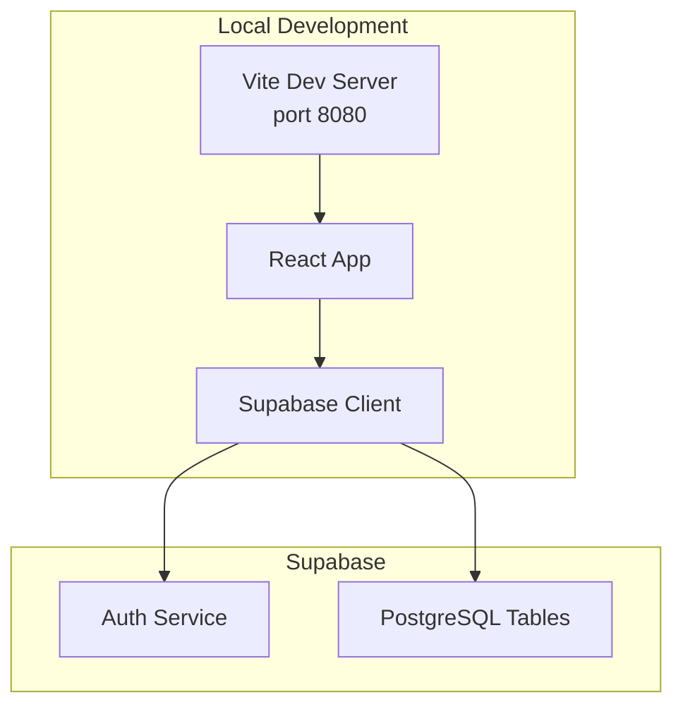
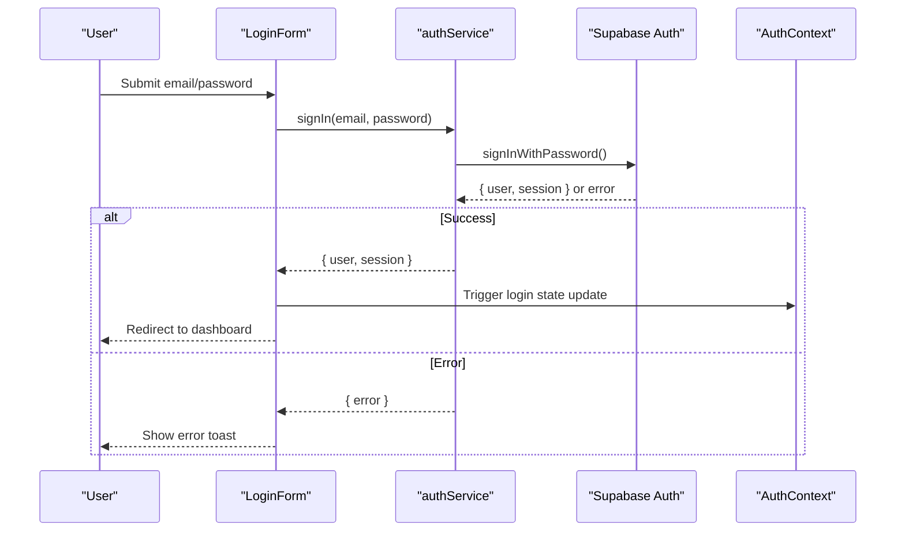
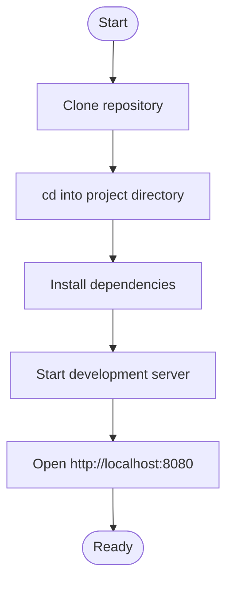
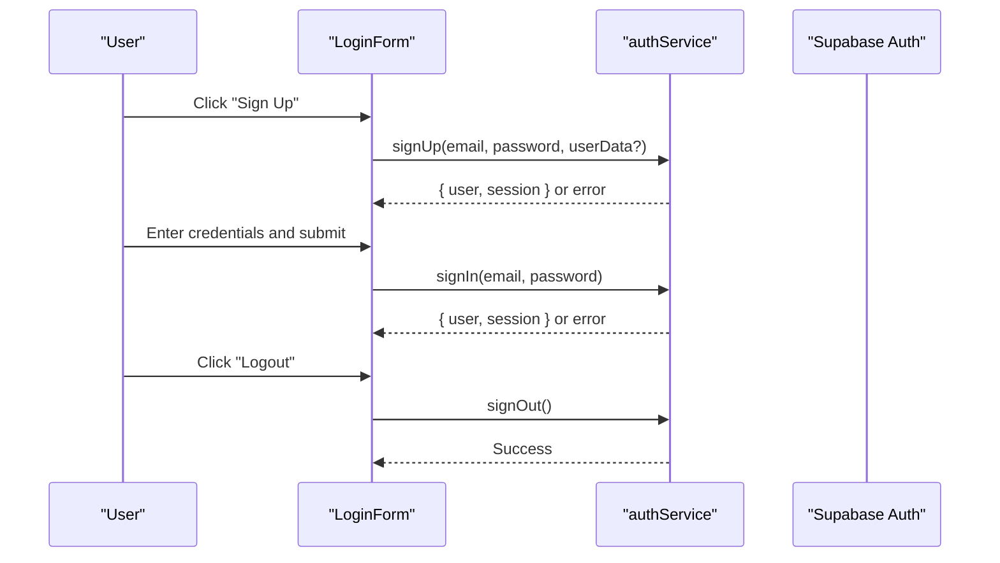
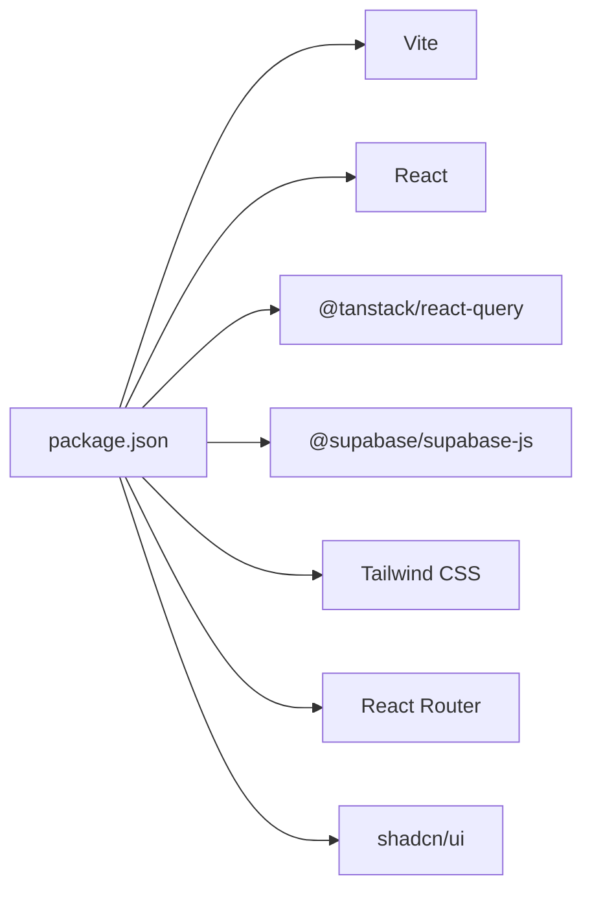

# Getting Started

<cite>
**Referenced Files in This Document**
- [README.md](file://README.md)
- [package.json](file://package.json)
- [vite.config.ts](file://vite.config.ts)
- [netlify.toml](file://netlify.toml)
- [DEPLOYMENT_NETLIFY.md](file://DEPLOYMENT_NETLIFY.md)
- [SUPABASE_SETUP.md](file://SUPABASE_SETUP.md)
- [src/lib/supabaseClient.ts](file://src/lib/supabaseClient.ts)
- [src/services/supabaseService.ts](file://src/services/supabaseService.ts)
- [src/contexts/AuthContext.tsx](file://src/contexts/AuthContext.tsx)
- [src/services/authService.ts](file://src/services/authService.ts)
- [src/components/LoginForm.tsx](file://src/components/LoginForm.tsx)
- [src/utils/supabaseSetup.ts](file://src/utils/supabaseSetup.ts)
</cite>

## Table of Contents
1. [Introduction](#introduction)
2. [Project Structure](#project-structure)
3. [Core Components](#core-components)
4. [Architecture Overview](#architecture-overview)
5. [Detailed Component Analysis](#detailed-component-analysis)
6. [Dependency Analysis](#dependency-analysis)
7. [Performance Considerations](#performance-considerations)
8. [Troubleshooting Guide](#troubleshooting-guide)
9. [Conclusion](#conclusion)
10. [Appendices](#appendices)

## Introduction
This guide helps you install and run the Royal POS Modern application locally, configure Supabase for authentication and data persistence, and complete the first-time setup. It covers prerequisites, step-by-step installation, environment configuration, initial user registration and login, and verification steps to ensure everything works as expected.

## Project Structure
Royal POS Modern is a Vite + React + TypeScript application with Supabase integration. Key parts for setup and operation:
- Frontend runtime and build: Vite, React, TypeScript, Tailwind CSS, Radix UI components
- Authentication and backend data: Supabase (authentication and database)
- Routing and state: React Router and React Context
- Environment variables: Vite injects VITE_SUPABASE_URL and VITE_SUPABASE_ANON_KEY at build time

**Diagram sources**
- [vite.config.ts:1-33](file://vite.config.ts#L1-L33)
- [src/lib/supabaseClient.ts:1-33](file://src/lib/supabaseClient.ts#L1-L33)

**Section sources**
- [README.md:134-150](file://README.md#L134-L150)
- [package.json:1-95](file://package.json#L1-L95)
- [vite.config.ts:1-33](file://vite.config.ts#L1-L33)

## Core Components
- Supabase client initialization and environment validation
- Authentication context and services
- Login form integration with Supabase
- Supabase connection testing utilities

Key responsibilities:
- Initialize Supabase client with VITE_SUPABASE_URL and VITE_SUPABASE_ANON_KEY
- Provide authentication state, login, logout, and sign-up flows
- Validate environment variables and report errors during development
- Offer helpers to test connectivity and perform basic CRUD operations

**Section sources**
- [src/lib/supabaseClient.ts:1-33](file://src/lib/supabaseClient.ts#L1-L33)
- [src/services/supabaseService.ts:1-60](file://src/services/supabaseService.ts#L1-L60)
- [src/contexts/AuthContext.tsx:1-118](file://src/contexts/AuthContext.tsx#L1-L118)
- [src/services/authService.ts:1-127](file://src/services/authService.ts#L1-L127)
- [src/components/LoginForm.tsx:1-331](file://src/components/LoginForm.tsx#L1-L331)

## Architecture Overview
The application uses Supabase for:
- Authentication: sign-up, sign-in, sign-out, password reset, and session management
- Database: tables for products, customers, sales, purchase orders, expenses, and more
- Real-time updates: optional subscriptions for live data

**Diagram sources**
- [src/components/LoginForm.tsx:56-114](file://src/components/LoginForm.tsx#L56-L114)
- [src/services/authService.ts:25-39](file://src/services/authService.ts#L25-L39)
- [src/contexts/AuthContext.tsx:56-85](file://src/contexts/AuthContext.tsx#L56-L85)

## Detailed Component Analysis

### Prerequisites
- Node.js and npm: Install via your preferred method (e.g., nvm). The project requires Node.js and npm to run locally and build.
- Git: To clone the repository.
- Optional: Netlify CLI for deployment.

Verification steps:
- Confirm Node.js and npm versions are supported by the project’s package configuration.
- Ensure your OS firewall allows the development server port.

**Section sources**
- [README.md:134](file://README.md#L134)
- [package.json:1-95](file://package.json#L1-L95)

### Step-by-Step Installation
1. Clone the repository using the project’s Git URL.
2. Navigate to the project directory.
3. Install dependencies using npm.
4. Start the development server with hot reload.

**Diagram sources**
- [README.md:138-149](file://README.md#L138-L149)
- [vite.config.ts:7-10](file://vite.config.ts#L7-L10)

**Section sources**
- [README.md:138-149](file://README.md#L138-L149)
- [vite.config.ts:1-33](file://vite.config.ts#L1-L33)

### Supabase Setup
1. Create a Supabase account and project.
2. Retrieve your project URL and anon key from the project settings.
3. Create a .env file in the project root with the required variables.
4. Run the database schema setup SQL in the Supabase SQL editor.
5. Optionally enable Row Level Security (RLS) policies as needed.

Environment variables:
- VITE_SUPABASE_URL
- VITE_SUPABASE_ANON_KEY

Notes:
- The Supabase client validates these variables at runtime and logs warnings if missing or default.
- For production, set the same variables in Netlify.

**Section sources**
- [README.md:55-87](file://README.md#L55-L87)
- [SUPABASE_SETUP.md:5-179](file://SUPABASE_SETUP.md#L5-L179)
- [src/lib/supabaseClient.ts:4-17](file://src/lib/supabaseClient.ts#L4-L17)
- [netlify.toml:8-11](file://netlify.toml#L8-L11)

### Authentication Flow
- Registration: Users sign up with email and password; optional metadata can be attached.
- Login: Email/password authentication via Supabase.
- Logout: Ends the session and clears local state.
- Password reset: Initiates a reset flow with a redirect URL.

**Diagram sources**
- [src/components/LoginForm.tsx:116-125](file://src/components/LoginForm.tsx#L116-L125)
- [src/services/authService.ts:5-23](file://src/services/authService.ts#L5-L23)
- [src/services/authService.ts:25-51](file://src/services/authService.ts#L25-L51)
- [src/services/authService.ts:42-51](file://src/services/authService.ts#L42-L51)

**Section sources**
- [src/contexts/AuthContext.tsx:16-110](file://src/contexts/AuthContext.tsx#L16-L110)
- [src/services/authService.ts:1-127](file://src/services/authService.ts#L1-L127)
- [src/components/LoginForm.tsx:18-114](file://src/components/LoginForm.tsx#L18-L114)

### First-Time System Configuration
- Initial user registration: Use the sign-up flow in the login component.
- Login: Authenticate using the registered credentials.
- Verify Supabase connection: The app tests connectivity on startup and logs results.
- Seed data: Populate tables with sample data using the Supabase SQL editor.

**Section sources**
- [src/components/LoginForm.tsx:116-125](file://src/components/LoginForm.tsx#L116-L125)
- [src/services/supabaseService.ts:4-23](file://src/services/supabaseService.ts#L4-L23)
- [SUPABASE_SETUP.md:165-179](file://SUPABASE_SETUP.md#L165-L179)

### Verification Steps
- Development server: Visit http://localhost:8080 and confirm the UI loads.
- Supabase connection: Check the browser console for connection logs and errors.
- Authentication: Register a user, log in, and verify protected routes behave correctly.
- Database: Confirm tables exist and RLS policies are enabled if used.

**Section sources**
- [vite.config.ts:7-10](file://vite.config.ts#L7-L10)
- [src/lib/supabaseClient.ts:7-17](file://src/lib/supabaseClient.ts#L7-L17)
- [src/services/supabaseService.ts:4-23](file://src/services/supabaseService.ts#L4-L23)
- [src/contexts/AuthContext.tsx:20-54](file://src/contexts/AuthContext.tsx#L20-L54)

## Dependency Analysis
- Build and dev server: Vite
- Frontend framework: React
- UI components: shadcn/ui + Tailwind CSS
- Routing: React Router
- State/data: React Query
- Icons: Lucide React
- Charts: Recharts
- Supabase client: @supabase/supabase-js
- Environment variables: dotenv (development) and Vite injection (runtime)

**Diagram sources**
- [package.json:13-72](file://package.json#L13-L72)

**Section sources**
- [package.json:1-95](file://package.json#L1-L95)

## Performance Considerations
- Keep dependencies updated to benefit from performance improvements.
- Use Vite’s optimized build for production deployments.
- Minimize unnecessary re-renders by leveraging React Query caching and efficient component design.
- Enable Supabase indexing and consider RLS policies for scalable access control.

[No sources needed since this section provides general guidance]

## Troubleshooting Guide
Common issues and resolutions:
- Missing or incorrect environment variables:
  - Ensure VITE_SUPABASE_URL and VITE_SUPABASE_ANON_KEY are present in .env and Netlify settings.
  - The Supabase client logs explicit errors if variables are missing or default.
- Authentication errors:
  - Email confirmation required: Follow the confirmation email instructions.
  - Session expired: Log in again; the app handles refresh token errors.
- Database connectivity:
  - Verify tables exist and RLS policies are correctly applied.
  - Test the connection using the provided helper function.
- Build and deployment:
  - Confirm build command and publish directory match configuration.
  - Ensure environment variables are set in Netlify after deployment.

**Section sources**
- [src/lib/supabaseClient.ts:11-17](file://src/lib/supabaseClient.ts#L11-L17)
- [src/services/supabaseService.ts:4-23](file://src/services/supabaseService.ts#L4-L23)
- [src/contexts/AuthContext.tsx:26-34](file://src/contexts/AuthContext.tsx#L26-L34)
- [DEPLOYMENT_NETLIFY.md:56-93](file://DEPLOYMENT_NETLIFY.md#L56-L93)

## Conclusion
You now have the essentials to install the application locally, configure Supabase, register and log in users, and verify the system. Proceed to populate your database, customize environment variables, and explore the POS modules.

[No sources needed since this section summarizes without analyzing specific files]

## Appendices

### Appendix A: Environment Variables
- VITE_SUPABASE_URL: Supabase project URL
- VITE_SUPABASE_ANON_KEY: Supabase anon key

Where to set:
- Locally: .env file in the project root
- Production: Netlify environment variables

**Section sources**
- [SUPABASE_SETUP.md:156-163](file://SUPABASE_SETUP.md#L156-L163)
- [netlify.toml:8-11](file://netlify.toml#L8-L11)

### Appendix B: Supabase Schema Reference
The Supabase setup includes tables for products, customers, sales, purchase orders, expenses, and tax records, along with indexes and optional RLS policies.

**Section sources**
- [src/utils/supabaseSetup.ts:4-188](file://src/utils/supabaseSetup.ts#L4-L188)
- [SUPABASE_SETUP.md:14-154](file://SUPABASE_SETUP.md#L14-L154)