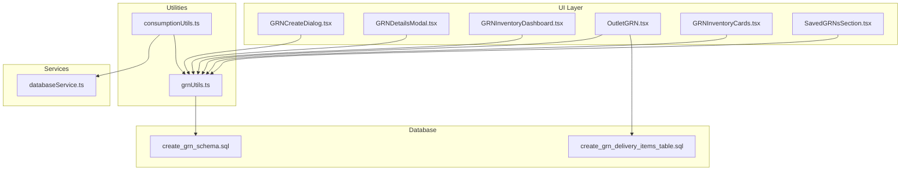
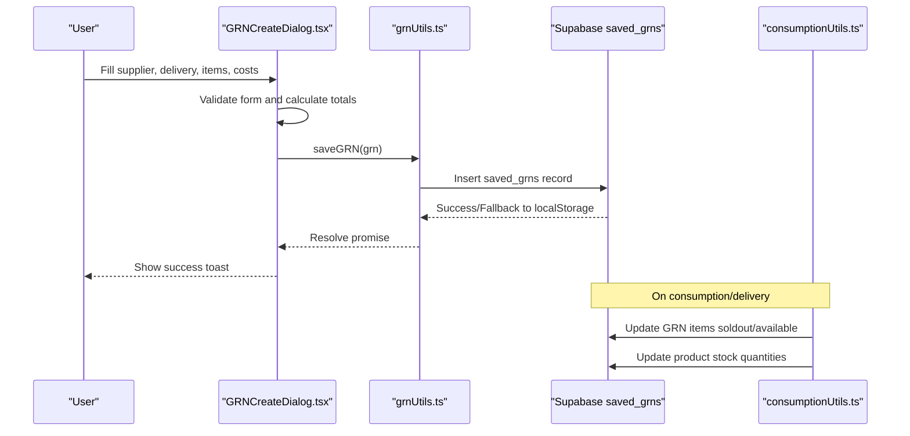
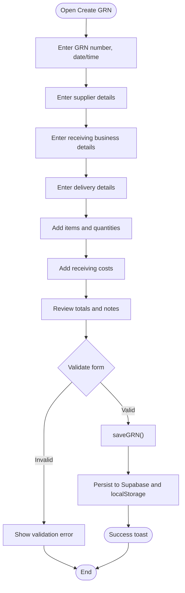
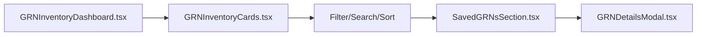
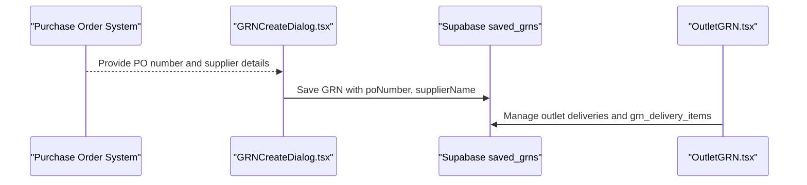
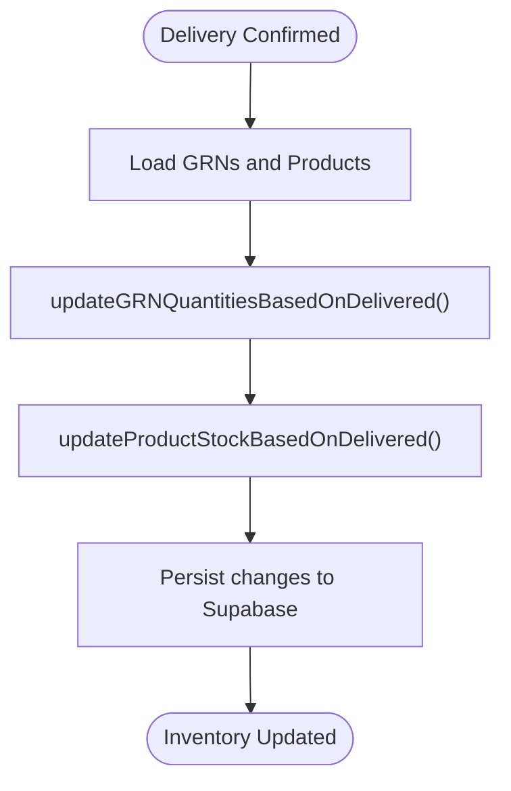
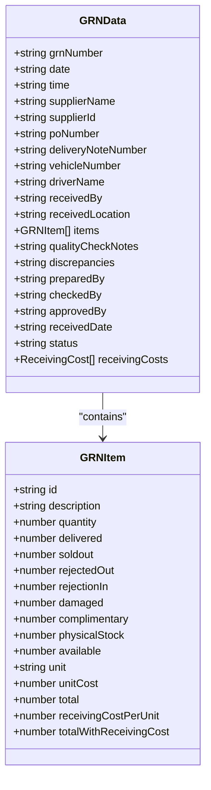
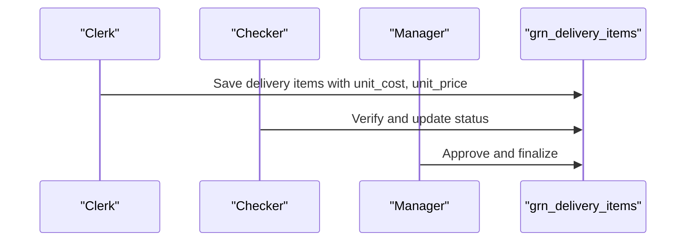
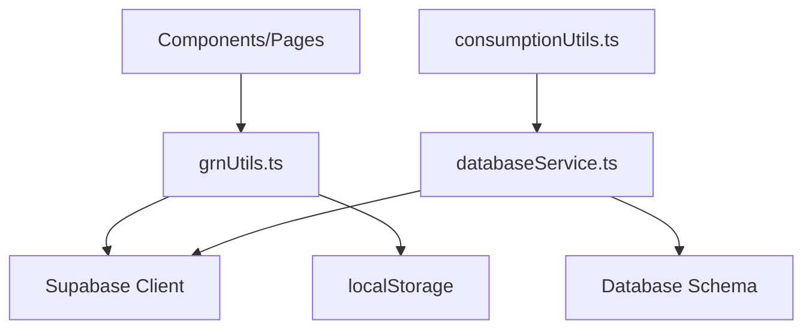

# Goods Receipt Note (GRN)

<cite>
**Referenced Files in This Document**
- [GRNCreateDialog.tsx](file://src/components/GRNCreateDialog.tsx)
- [GRNDetailsModal.tsx](file://src/components/GRNDetailsModal.tsx)
- [GRNInventoryDashboard.tsx](file://src/pages/GRNInventoryDashboard.tsx)
- [OutletGRN.tsx](file://src/pages/OutletGRN.tsx)
- [GRNInventoryCards.tsx](file://src/components/GRNInventoryCards.tsx)
- [SavedGRNsSection.tsx](file://src/components/SavedGRNsSection.tsx)
- [grnUtils.ts](file://src/utils/grnUtils.ts)
- [consumptionUtils.ts](file://src/utils/consumptionUtils.ts)
- [databaseService.ts](file://src/services/databaseService.ts)
- [create_grn_schema.sql](file://migrations/20260219_create_grn_schema.sql)
- [create_grn_delivery_items_table.sql](file://migrations/20260419_create_grn_delivery_items_table.sql)
</cite>

## Table of Contents
1. [Introduction](#introduction)
2. [Project Structure](#project-structure)
3. [Core Components](#core-components)
4. [Architecture Overview](#architecture-overview)
5. [Detailed Component Analysis](#detailed-component-analysis)
6. [Dependency Analysis](#dependency-analysis)
7. [Performance Considerations](#performance-considerations)
8. [Troubleshooting Guide](#troubleshooting-guide)
9. [Conclusion](#conclusion)

## Introduction
This document explains the Goods Receipt Note (GRN) system for supplier delivery management and inventory receiving. It covers the end-to-end workflow from creating a GRN, capturing supplier and delivery details, adding products and quantities, to completing the process and updating inventory. It also documents the GRN dashboard, integration with supplier and purchase order systems, inventory updates triggered by successful GRN completion, and the GRN details interface. Practical examples demonstrate creating GRNs for different supplier scenarios, handling partial deliveries, and managing delivery discrepancies. Finally, it addresses approval workflows, multi-outlet delivery coordination, integration with accounting systems, and troubleshooting steps for common issues.

## Project Structure
The GRN system spans React components, pages, utilities, and database migrations:
- UI components for creating and viewing GRNs
- Pages for dashboards and outlet-specific GRN management
- Utility functions for saving, retrieving, and updating GRNs
- Database schema and triggers for persistence and derived calculations
- Consumption utilities for inventory synchronization

**Diagram sources**
- [GRNCreateDialog.tsx:1-732](file://src/components/GRNCreateDialog.tsx#L1-732)
- [GRNDetailsModal.tsx:1-482](file://src/components/GRNDetailsModal.tsx#L1-482)
- [GRNInventoryDashboard.tsx:1-307](file://src/pages/GRNInventoryDashboard.tsx#L1-307)
- [OutletGRN.tsx:1-800](file://src/pages/OutletGRN.tsx#L1-800)
- [GRNInventoryCards.tsx:1-295](file://src/components/GRNInventoryCards.tsx#L1-295)
- [SavedGRNsSection.tsx:1-357](file://src/components/SavedGRNsSection.tsx#L1-357)
- [grnUtils.ts:1-436](file://src/utils/grnUtils.ts#L1-436)
- [consumptionUtils.ts:1-309](file://src/utils/consumptionUtils.ts#L1-309)
- [databaseService.ts:1-800](file://src/services/databaseService.ts#L1-800)
- [create_grn_schema.sql:1-97](file://migrations/20260219_create_grn_schema.sql#L1-97)
- [create_grn_delivery_items_table.sql:1-123](file://migrations/20260419_create_grn_delivery_items_table.sql#L1-123)

**Section sources**
- [GRNCreateDialog.tsx:1-732](file://src/components/GRNCreateDialog.tsx#L1-732)
- [GRNDetailsModal.tsx:1-482](file://src/components/GRNDetailsModal.tsx#L1-482)
- [GRNInventoryDashboard.tsx:1-307](file://src/pages/GRNInventoryDashboard.tsx#L1-307)
- [OutletGRN.tsx:1-800](file://src/pages/OutletGRN.tsx#L1-800)
- [GRNInventoryCards.tsx:1-295](file://src/components/GRNInventoryCards.tsx#L1-295)
- [SavedGRNsSection.tsx:1-357](file://src/components/SavedGRNsSection.tsx#L1-357)
- [grnUtils.ts:1-436](file://src/utils/grnUtils.ts#L1-436)
- [consumptionUtils.ts:1-309](file://src/utils/consumptionUtils.ts#L1-309)
- [databaseService.ts:1-800](file://src/services/databaseService.ts#L1-800)
- [create_grn_schema.sql:1-97](file://migrations/20260219_create_grn_schema.sql#L1-97)
- [create_grn_delivery_items_table.sql:1-123](file://migrations/20260419_create_grn_delivery_items_table.sql#L1-123)

## Core Components
- GRN creation dialog: Captures supplier and business details, delivery information, items, receiving costs, and quality notes; calculates totals and saves GRN.
- GRN details modal: Displays GRN summary, items, quality notes, and status with print/download capabilities.
- GRN inventory dashboard: Shows metrics, recent GRNs, and manages GRN cards with filtering and sorting.
- Outlet GRN page: Manages outlet-specific deliveries and integrates with delivery items table for multi-outlet coordination.
- GRN utilities: Persist GRNs locally and in Supabase, compute totals, and support updates/deletes.
- Consumption utilities: Update GRN sold-out quantities and synchronize product stock based on delivered amounts.
- Database schema: Defines saved_grns table, indexes, policies, and triggers for derived calculations.

**Section sources**
- [GRNCreateDialog.tsx:1-732](file://src/components/GRNCreateDialog.tsx#L1-732)
- [GRNDetailsModal.tsx:1-482](file://src/components/GRNDetailsModal.tsx#L1-482)
- [GRNInventoryDashboard.tsx:1-307](file://src/pages/GRNInventoryDashboard.tsx#L1-307)
- [OutletGRN.tsx:1-800](file://src/pages/OutletGRN.tsx#L1-800)
- [grnUtils.ts:1-436](file://src/utils/grnUtils.ts#L1-436)
- [consumptionUtils.ts:1-309](file://src/utils/consumptionUtils.ts#L1-309)
- [create_grn_schema.sql:1-97](file://migrations/20260219_create_grn_schema.sql#L1-97)
- [create_grn_delivery_items_table.sql:1-123](file://migrations/20260419_create_grn_delivery_items_table.sql#L1-123)

## Architecture Overview
The GRN system follows a layered architecture:
- UI layer: React components and pages render forms, dashboards, and modals.
- Utilities layer: GRN utilities handle persistence and data transformations; consumption utilities manage inventory synchronization.
- Services layer: Database service provides product and outlet operations.
- Database layer: Supabase tables store GRNs, delivery items, and enforce RLS policies.

**Diagram sources**
- [GRNCreateDialog.tsx:222-264](file://src/components/GRNCreateDialog.tsx#L222-264)
- [grnUtils.ts:74-195](file://src/utils/grnUtils.ts#L74-195)
- [consumptionUtils.ts:115-194](file://src/utils/consumptionUtils.ts#L115-194)

**Section sources**
- [GRNCreateDialog.tsx:222-264](file://src/components/GRNCreateDialog.tsx#L222-264)
- [grnUtils.ts:74-195](file://src/utils/grnUtils.ts#L74-195)
- [consumptionUtils.ts:115-194](file://src/utils/consumptionUtils.ts#L115-194)

## Detailed Component Analysis

### GRN Creation Workflow
The creation workflow captures:
- Document info: GRN number, date/time
- Supplier info: name, ID, contact, address
- Receiving business: name, contact, address, stock type (vatable/exempt)
- Delivery details: PO number, delivery note, vehicle, driver, received by, location
- Items: description, ordered quantity, received quantity, unit, unit cost, total, available calculation
- Receiving costs: transport, offloaders, traffic charges
- Quality notes and discrepancies
- Approval fields: prepared, checked, approved by and dates

Key behaviors:
- Real-time calculations for item totals and available quantities
- Validation for required fields
- Saving to localStorage and Supabase with fallback

**Diagram sources**
- [GRNCreateDialog.tsx:191-264](file://src/components/GRNCreateDialog.tsx#L191-264)
- [grnUtils.ts:74-195](file://src/utils/grnUtils.ts#L74-195)

**Section sources**
- [GRNCreateDialog.tsx:191-264](file://src/components/GRNCreateDialog.tsx#L191-264)
- [grnUtils.ts:74-195](file://src/utils/grnUtils.ts#L74-195)

### GRN Dashboard and Status Tracking
The dashboard presents:
- Metrics: total GRNs, total value, pending, completed
- Recent GRNs list
- Filtering/sorting by status, date range, and value
- Actions: view details, print, download, delete

**Diagram sources**
- [GRNInventoryDashboard.tsx:13-307](file://src/pages/GRNInventoryDashboard.tsx#L13-307)
- [GRNInventoryCards.tsx:18-295](file://src/components/GRNInventoryCards.tsx#L18-295)
- [SavedGRNsSection.tsx:18-357](file://src/components/SavedGRNsSection.tsx#L18-357)
- [GRNDetailsModal.tsx:32-482](file://src/components/GRNDetailsModal.tsx#L32-482)

**Section sources**
- [GRNInventoryDashboard.tsx:59-126](file://src/pages/GRNInventoryDashboard.tsx#L59-126)
- [GRNInventoryCards.tsx:30-77](file://src/components/GRNInventoryCards.tsx#L30-77)
- [SavedGRNsSection.tsx:84-100](file://src/components/SavedGRNsSection.tsx#L84-100)
- [GRNDetailsModal.tsx:39-73](file://src/components/GRNDetailsModal.tsx#L39-73)

### Integration with Supplier Management and Purchase Orders
- Supplier information captured during GRN creation
- PO number linkage enables traceability from purchase orders to goods received
- Outlet GRN page coordinates multi-outlet deliveries and integrates with delivery items table

**Diagram sources**
- [GRNCreateDialog.tsx:446-452](file://src/components/GRNCreateDialog.tsx#L446-452)
- [OutletGRN.tsx:475-524](file://src/pages/OutletGRN.tsx#L475-524)
- [create_grn_delivery_items_table.sql:1-123](file://migrations/20260419_create_grn_delivery_items_table.sql#L1-123)

**Section sources**
- [GRNCreateDialog.tsx:446-452](file://src/components/GRNCreateDialog.tsx#L446-452)
- [OutletGRN.tsx:475-524](file://src/pages/OutletGRN.tsx#L475-524)
- [create_grn_delivery_items_table.sql:1-123](file://migrations/20260419_create_grn_delivery_items_table.sql#L1-123)

### Inventory Update Process and Stock Adjustments
On successful GRN completion and delivery:
- Sold-out quantities are updated in GRN items
- Available quantities are recalculated
- Product stock quantities are synchronized in the database

**Diagram sources**
- [consumptionUtils.ts:115-194](file://src/utils/consumptionUtils.ts#L115-194)
- [consumptionUtils.ts:200-243](file://src/utils/consumptionUtils.ts#L200-243)
- [databaseService.ts:642-709](file://src/services/databaseService.ts#L642-709)

**Section sources**
- [consumptionUtils.ts:115-194](file://src/utils/consumptionUtils.ts#L115-194)
- [consumptionUtils.ts:200-243](file://src/utils/consumptionUtils.ts#L200-243)
- [databaseService.ts:642-709](file://src/services/databaseService.ts#L642-709)

### GRN Details Interface
The details interface displays:
- Summary cards: items count, total quantity, total value, status
- Supplier and business information
- Logistics and status information
- Items table with ordered/delivered quantities, unit price, total, and status indicators
- Quality notes and discrepancies sections
- Print and download actions

**Diagram sources**
- [grnUtils.ts:29-72](file://src/utils/grnUtils.ts#L29-72)

**Section sources**
- [GRNDetailsModal.tsx:159-477](file://src/components/GRNDetailsModal.tsx#L159-477)
- [grnUtils.ts:29-72](file://src/utils/grnUtils.ts#L29-72)

### Practical Examples

#### Example 1: Creating a GRN for a Vatable Supplier
- Enter vatable stock type to enable TIN number capture
- Add items with unit cost and received quantities
- Capture delivery details (PO number, delivery note, vehicle, driver)
- Add receiving costs (transport, offloaders)
- Save GRN; totals computed automatically

**Section sources**
- [GRNCreateDialog.tsx:413-435](file://src/components/GRNCreateDialog.tsx#L413-435)
- [GRNCreateDialog.tsx:547-574](file://src/components/GRNCreateDialog.tsx#L547-574)

#### Example 2: Handling Partial Deliveries
- Enter delivered quantity less than ordered quantity
- Sold-out increases by delivered amount
- Available recalculated accordingly
- Product stock reduced by delivered amount

**Section sources**
- [consumptionUtils.ts:115-194](file://src/utils/consumptionUtils.ts#L115-194)
- [consumptionUtils.ts:200-243](file://src/utils/consumptionUtils.ts#L200-243)

#### Example 3: Managing Delivery Discrepancies
- Record discrepancies in the GRN form
- Use quality notes to document damage, rejection, or expiry issues
- Review items with issues highlighted in the details view

**Section sources**
- [GRNCreateDialog.tsx:646-653](file://src/components/GRNCreateDialog.tsx#L646-653)
- [GRNDetailsModal.tsx:92-97](file://src/components/GRNDetailsModal.tsx#L92-97)

### Approval Workflows and Multi-Outlet Coordination
- Approval fields (prepared, checked, approved) with names and dates
- Outlet GRN page manages deliveries across outlets
- Delivery items table stores per-item cost, price, and gain calculations

**Diagram sources**
- [GRNCreateDialog.tsx:658-701](file://src/components/GRNCreateDialog.tsx#L658-701)
- [OutletGRN.tsx:475-524](file://src/pages/OutletGRN.tsx#L475-524)
- [create_grn_delivery_items_table.sql:96-123](file://migrations/20260419_create_grn_delivery_items_table.sql#L96-123)

**Section sources**
- [GRNCreateDialog.tsx:658-701](file://src/components/GRNCreateDialog.tsx#L658-701)
- [OutletGRN.tsx:475-524](file://src/pages/OutletGRN.tsx#L475-524)
- [create_grn_delivery_items_table.sql:96-123](file://migrations/20260419_create_grn_delivery_items_table.sql#L96-123)

### Accounting Integration
- GRN records include supplier and business details, PO number, and delivery note
- Totals and statuses support financial reconciliation
- Delivery items table includes unit cost, total cost, unit price, total price, unit gain, and total gain for profit tracking

**Section sources**
- [create_grn_delivery_items_table.sql:11-30](file://migrations/20260419_create_grn_delivery_items_table.sql#L11-30)

## Dependency Analysis
The GRN system exhibits clear separation of concerns:
- Components depend on utilities for data operations
- Utilities depend on Supabase client and localStorage
- Consumption utilities depend on database service for product stock updates
- Database schema defines persistence and derived calculations

**Diagram sources**
- [grnUtils.ts:1-5](file://src/utils/grnUtils.ts#L1-L5)
- [consumptionUtils.ts:1-3](file://src/utils/consumptionUtils.ts#L1-L3)
- [databaseService.ts:1-5](file://src/services/databaseService.ts#L1-L5)
- [create_grn_schema.sql:1-10](file://migrations/20260219_create_grn_schema.sql#L1-L10)
- [create_grn_delivery_items_table.sql:1-10](file://migrations/20260419_create_grn_delivery_items_table.sql#L1-L10)

**Section sources**
- [grnUtils.ts:1-5](file://src/utils/grnUtils.ts#L1-L5)
- [consumptionUtils.ts:1-3](file://src/utils/consumptionUtils.ts#L1-L3)
- [databaseService.ts:1-5](file://src/services/databaseService.ts#L1-L5)
- [create_grn_schema.sql:1-10](file://migrations/20260219_create_grn_schema.sql#L1-L10)
- [create_grn_delivery_items_table.sql:1-10](file://migrations/20260419_create_grn_delivery_items_table.sql#L1-L10)

## Performance Considerations
- Local caching via localStorage ensures immediate availability while network operations complete
- Supabase queries limit results to prevent performance issues
- Triggers and indexes in the database optimize derived calculations and lookups
- Sorting and filtering in the UI reduce rendering overhead for large datasets

[No sources needed since this section provides general guidance]

## Troubleshooting Guide
Common issues and resolutions:
- Authentication failures during save: The system falls back to localStorage; verify user session and retry
- Database insert errors: Inspect error codes/messages; confirm table schema and policies
- Missing totals: Ensure items arrays are properly structured; recalculate totals when quantities change
- Inventory synchronization errors: Confirm product names match between GRN items and product database; verify stock updates occur after delivered quantities are set
- Delivery tracking problems: Validate delivery note numbers and outlet associations; check grn_delivery_items entries
- Multi-outlet delivery discrepancies: Verify outlet_id references and delivery items consistency

**Section sources**
- [grnUtils.ts:178-195](file://src/utils/grnUtils.ts#L178-195)
- [grnUtils.ts:217-325](file://src/utils/grnUtils.ts#L217-325)
- [consumptionUtils.ts:200-243](file://src/utils/consumptionUtils.ts#L200-243)

## Conclusion
The GRN system provides a robust framework for supplier delivery management and inventory receiving. It captures comprehensive supplier and delivery details, supports real-time calculations, persists data across local and remote storage, and synchronizes inventory quantities upon delivery. The dashboard and details interface offer visibility and control, while integrations with purchase orders and multi-outlet deliveries streamline coordination. The troubleshooting guidance helps resolve common issues efficiently.