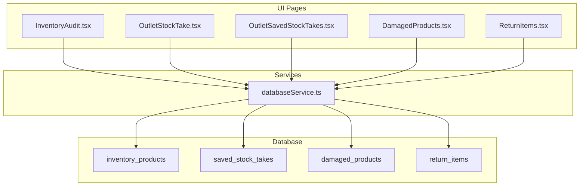
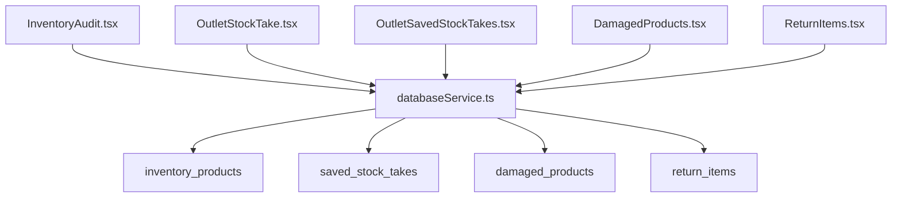
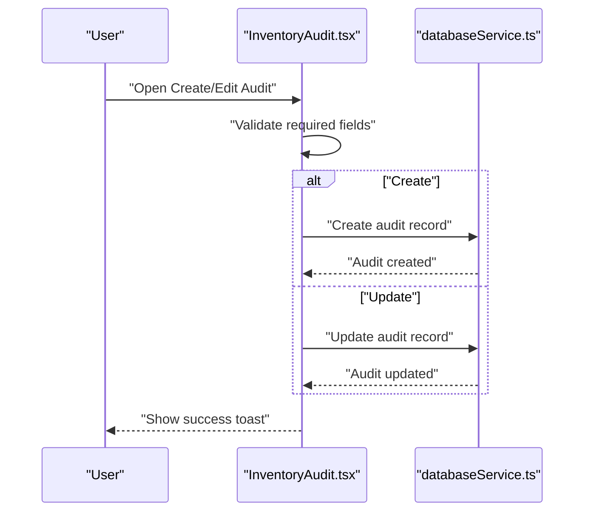
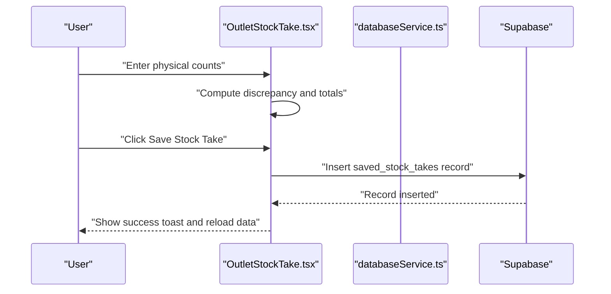
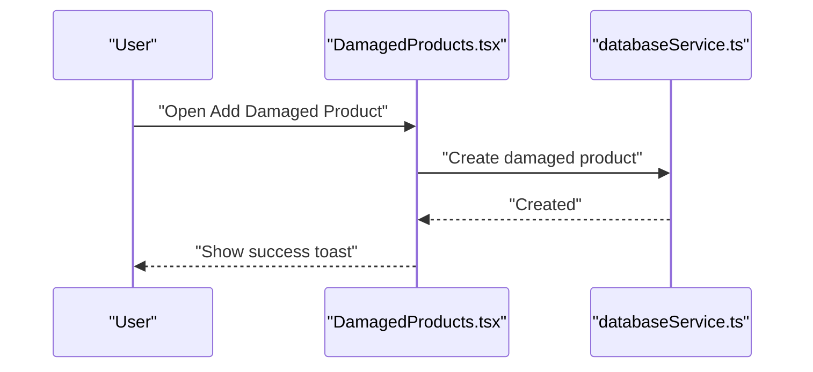
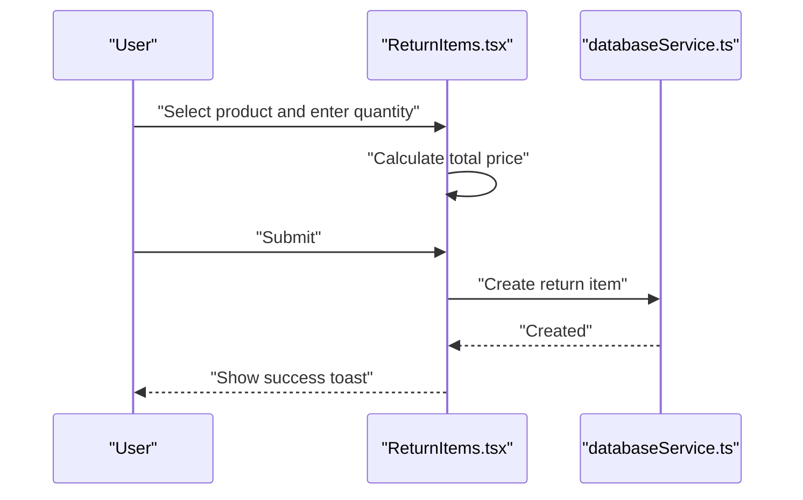
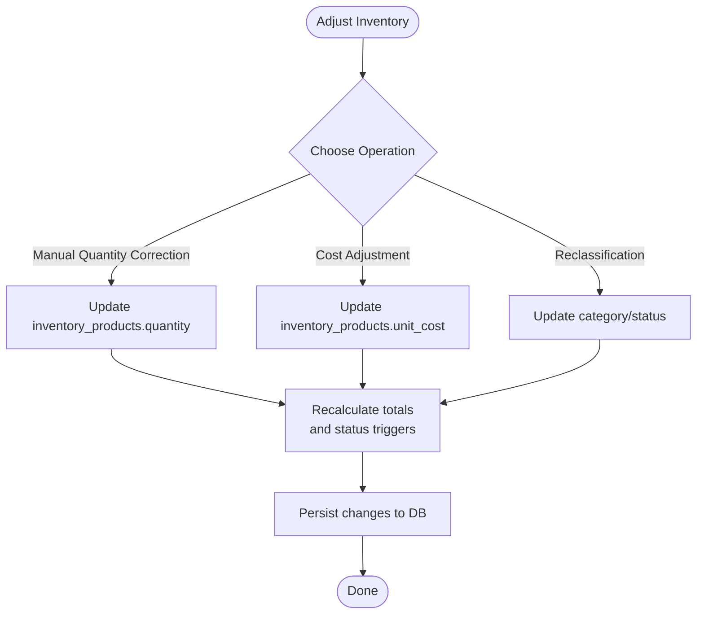
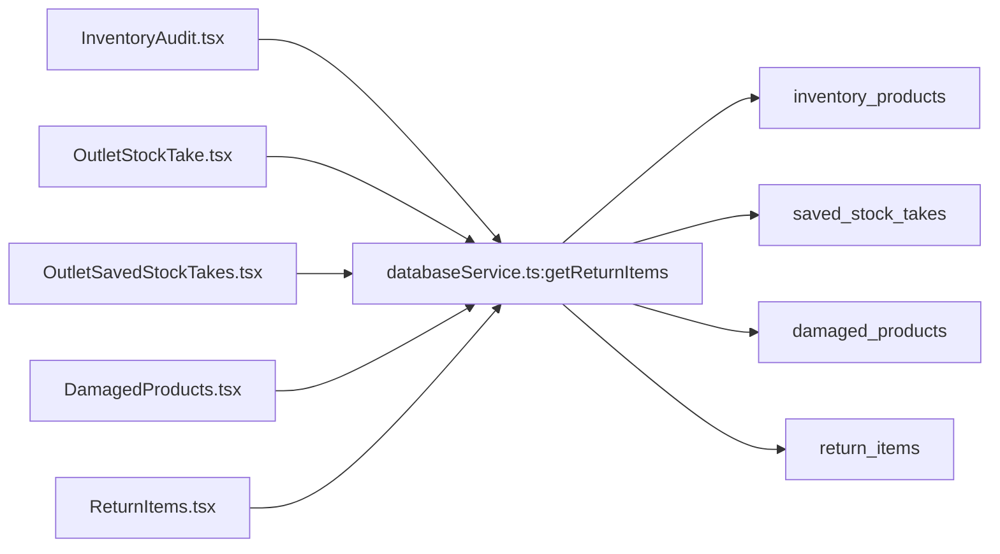

# Inventory Audit and Adjustments

<cite>
**Referenced Files in This Document**
- [InventoryAudit.tsx](file://src/pages/InventoryAudit.tsx)
- [OutletStockTake.tsx](file://src/pages/OutletStockTake.tsx)
- [OutletSavedStockTakes.tsx](file://src/pages/OutletSavedStockTakes.tsx)
- [DamagedProducts.tsx](file://src/pages/DamagedProducts.tsx)
- [ReturnItems.tsx](file://src/pages/ReturnItems.tsx)
- [databaseService.ts](file://src/services/databaseService.ts)
- [20260313_create_inventory_products_table.sql](file://migrations/20260313_create_inventory_products_table.sql)
- [20260313_create_and_populate_inventory_products.sql](file://migrations/20260313_create_and_populate_inventory_products.sql)
- [20260313_create_saved_stock_takes.sql](file://migrations/20260313_create_saved_stock_takes.sql)
- [20260404_add_adjustments_columns.sql](file://migrations/20260404_add_adjustments_columns.sql)
</cite>

## Table of Contents
1. [Introduction](#introduction)
2. [Project Structure](#project-structure)
3. [Core Components](#core-components)
4. [Architecture Overview](#architecture-overview)
5. [Detailed Component Analysis](#detailed-component-analysis)
6. [Dependency Analysis](#dependency-analysis)
7. [Performance Considerations](#performance-considerations)
8. [Troubleshooting Guide](#troubleshooting-guide)
9. [Conclusion](#conclusion)
10. [Appendices](#appendices)

## Introduction
This document explains the inventory audit and adjustment capabilities implemented in the POS system, focusing on:
- Conducting physical inventory counts (cycle counts and full inventory takes)
- Tracking and resolving discrepancies
- Managing damaged products and disposals
- Processing returns (customer, supplier, and internal transfers)
- Performing inventory adjustments (manual quantity corrections, cost adjustments, and reclassifications)
- Maintaining audit trails for all inventory changes
- Practical examples and guidance for shrinkage handling, valuation adjustments, write-offs, and financial reporting integration

The system supports outlet-specific inventory via dedicated tables and provides UI components for performing audits, recording damaged items, and managing return items. Backend services integrate with Supabase for data persistence and retrieval.

## Project Structure
The inventory audit and adjustment features span UI pages, service functions, and database migrations:
- UI pages for inventory audit, stock take, damaged products, and return items
- Service functions for CRUD operations against Supabase tables
- Database migrations defining inventory, stock take, and adjustment-related schemas

**Diagram sources**
- [InventoryAudit.tsx:1-474](file://src/pages/InventoryAudit.tsx#L1-L474)
- [OutletStockTake.tsx:1-480](file://src/pages/OutletStockTake.tsx#L1-L480)
- [OutletSavedStockTakes.tsx:1-433](file://src/pages/OutletSavedStockTakes.tsx#L1-L433)
- [DamagedProducts.tsx:1-545](file://src/pages/DamagedProducts.tsx#L1-L545)
- [ReturnItems.tsx:1-558](file://src/pages/ReturnItems.tsx#L1-L558)
- [databaseService.ts:286-299](file://src/services/databaseService.ts#L286-L299)
- [databaseService.ts:3056-3102](file://src/services/databaseService.ts#L3056-L3102)
- [databaseService.ts:3308-3370](file://src/services/databaseService.ts#L3308-L3370)
- [20260313_create_inventory_products_table.sql:1-61](file://migrations/20260313_create_inventory_products_table.sql#L1-L61)
- [20260313_create_and_populate_inventory_products.sql:1-159](file://migrations/20260313_create_and_populate_inventory_products.sql#L1-L159)
- [20260313_create_saved_stock_takes.sql:1-44](file://migrations/20260313_create_saved_stock_takes.sql#L1-L44)

**Section sources**
- [InventoryAudit.tsx:1-474](file://src/pages/InventoryAudit.tsx#L1-L474)
- [OutletStockTake.tsx:1-480](file://src/pages/OutletStockTake.tsx#L1-L480)
- [OutletSavedStockTakes.tsx:1-433](file://src/pages/OutletSavedStockTakes.tsx#L1-L433)
- [DamagedProducts.tsx:1-545](file://src/pages/DamagedProducts.tsx#L1-L545)
- [ReturnItems.tsx:1-558](file://src/pages/ReturnItems.tsx#L1-L558)
- [databaseService.ts:286-299](file://src/services/databaseService.ts#L286-L299)
- [databaseService.ts:3056-3102](file://src/services/databaseService.ts#L3056-L3102)
- [databaseService.ts:3308-3370](file://src/services/databaseService.ts#L3308-L3370)
- [20260313_create_inventory_products_table.sql:1-61](file://migrations/20260313_create_inventory_products_table.sql#L1-L61)
- [20260313_create_and_populate_inventory_products.sql:1-159](file://migrations/20260313_create_and_populate_inventory_products.sql#L1-L159)
- [20260313_create_saved_stock_takes.sql:1-44](file://migrations/20260313_create_saved_stock_takes.sql#L1-L44)

## Core Components
- Inventory Audit page: Create, edit, and track inventory audits with statuses (draft, in progress, completed) and discrepancy counts.
- Outlet Stock Take: Perform physical counts per outlet, compute variances, and save completed stock takes with summary metrics.
- Damaged Products: Report, categorize, and resolve damaged inventory items with status tracking.
- Return Items: Manage individual items within return transactions, including reasons and computed totals.
- Database Services: Provide CRUD operations for inventory audits, damaged products, and return items; expose outlet inventory and stock take records.
- Database Schema: Defines outlet-specific inventory, saved stock takes, and adjustment columns for sales-related tables.

**Section sources**
- [InventoryAudit.tsx:15-39](file://src/pages/InventoryAudit.tsx#L15-L39)
- [OutletStockTake.tsx:27-39](file://src/pages/OutletStockTake.tsx#L27-L39)
- [DamagedProducts.tsx:25-36](file://src/pages/DamagedProducts.tsx#L25-L36)
- [ReturnItems.tsx:24-34](file://src/pages/ReturnItems.tsx#L24-L34)
- [databaseService.ts:2466-2475](file://src/services/databaseService.ts#L2466-L2475)
- [databaseService.ts:3056-3102](file://src/services/databaseService.ts#L3056-L3102)
- [databaseService.ts:3308-3370](file://src/services/databaseService.ts#L3308-L3370)
- [20260313_create_inventory_products_table.sql:1-61](file://migrations/20260313_create_inventory_products_table.sql#L1-L61)
- [20260313_create_and_populate_inventory_products.sql:1-159](file://migrations/20260313_create_and_populate_inventory_products.sql#L1-L159)
- [20260313_create_saved_stock_takes.sql:1-44](file://migrations/20260313_create_saved_stock_takes.sql#L1-L44)

## Architecture Overview
The system follows a layered architecture:
- UI Layer: React components for inventory audit, stock take, damaged products, and returns
- Service Layer: databaseService.ts functions interacting with Supabase
- Data Layer: PostgreSQL tables for inventory, stock takes, damaged products, and return items

**Diagram sources**
- [InventoryAudit.tsx:1-474](file://src/pages/InventoryAudit.tsx#L1-L474)
- [OutletStockTake.tsx:1-480](file://src/pages/OutletStockTake.tsx#L1-L480)
- [OutletSavedStockTakes.tsx:1-433](file://src/pages/OutletSavedStockTakes.tsx#L1-L433)
- [DamagedProducts.tsx:1-545](file://src/pages/DamagedProducts.tsx#L1-L545)
- [ReturnItems.tsx:1-558](file://src/pages/ReturnItems.tsx#L1-L558)
- [databaseService.ts:286-299](file://src/services/databaseService.ts#L286-L299)
- [databaseService.ts:3056-3102](file://src/services/databaseService.ts#L3056-L3102)
- [databaseService.ts:3308-3370](file://src/services/databaseService.ts#L3308-L3370)
- [20260313_create_inventory_products_table.sql:1-61](file://migrations/20260313_create_inventory_products_table.sql#L1-L61)
- [20260313_create_saved_stock_takes.sql:1-44](file://migrations/20260313_create_saved_stock_takes.sql#L1-L44)

## Detailed Component Analysis

### Inventory Audit Page
Purpose: Create and manage inventory audits with statuses and discrepancy tracking.

Key behaviors:
- Create new audits with auto-generated audit numbers
- Edit/update audit metadata (date, location, auditor, status)
- Delete audits
- Filter and search audits by number, location, auditor, and status
- Track discrepancy counts and total variance per audit

**Diagram sources**
- [InventoryAudit.tsx:117-175](file://src/pages/InventoryAudit.tsx#L117-L175)
- [databaseService.ts:2466-2475](file://src/services/databaseService.ts#L2466-L2475)

**Section sources**
- [InventoryAudit.tsx:15-39](file://src/pages/InventoryAudit.tsx#L15-L39)
- [InventoryAudit.tsx:104-175](file://src/pages/InventoryAudit.tsx#L104-L175)
- [databaseService.ts:2466-2475](file://src/services/databaseService.ts#L2466-L2475)

### Outlet Stock Take and Saved Stock Takes
Purpose: Perform physical inventory counts per outlet, compute variances, and persist completed stock takes.

Key behaviors:
- Load outlet inventory with sold quantities and compute available stock
- Allow entering physical counts per product
- Compute discrepancy = physical count − available stock
- Save stock take with summary metrics (total products, calculated sold, costs, prices, earnings, turnover)
- View and print saved stock takes
- Filter saved stock takes by date range and search term

**Diagram sources**
- [OutletStockTake.tsx:124-221](file://src/pages/OutletStockTake.tsx#L124-L221)
- [OutletSavedStockTakes.tsx:71-94](file://src/pages/OutletSavedStockTakes.tsx#L71-L94)
- [20260313_create_saved_stock_takes.sql:1-44](file://migrations/20260313_create_saved_stock_takes.sql#L1-L44)

**Section sources**
- [OutletStockTake.tsx:27-39](file://src/pages/OutletStockTake.tsx#L27-L39)
- [OutletStockTake.tsx:52-99](file://src/pages/OutletStockTake.tsx#L52-L99)
- [OutletStockTake.tsx:124-221](file://src/pages/OutletStockTake.tsx#L124-L221)
- [OutletSavedStockTakes.tsx:35-50](file://src/pages/OutletSavedStockTakes.tsx#L35-L50)
- [OutletSavedStockTakes.tsx:71-94](file://src/pages/OutletSavedStockTakes.tsx#L71-L94)
- [OutletSavedStockTakes.tsx:129-212](file://src/pages/OutletSavedStockTakes.tsx#L129-L212)
- [20260313_create_saved_stock_takes.sql:1-44](file://migrations/20260313_create_saved_stock_takes.sql#L1-L44)

### Damaged Products Management
Purpose: Report, categorize, and resolve damaged inventory items.

Key behaviors:
- Report damaged items with product selection, quantity, reason, status, and notes
- Update and delete damaged product records
- Filter by status and search by reason/notes
- Track total and resolved quantities

**Diagram sources**
- [DamagedProducts.tsx:104-140](file://src/pages/DamagedProducts.tsx#L104-L140)
- [databaseService.ts:3087-3101](file://src/services/databaseService.ts#L3087-L3101)

**Section sources**
- [DamagedProducts.tsx:25-36](file://src/pages/DamagedProducts.tsx#L25-L36)
- [DamagedProducts.tsx:56-102](file://src/pages/DamagedProducts.tsx#L56-L102)
- [DamagedProducts.tsx:104-198](file://src/pages/DamagedProducts.tsx#L104-L198)
- [databaseService.ts:3056-3102](file://src/services/databaseService.ts#L3056-L3102)

### Return Items Processing
Purpose: Manage individual items within return transactions, including reasons and computed totals.

Key behaviors:
- Add return items with product selection, quantity, unit price, and reason
- Update and delete return items
- Automatic recalculation of total price (quantity × unit price)
- Filter by reason text

**Diagram sources**
- [ReturnItems.tsx:134-158](file://src/pages/ReturnItems.tsx#L134-L158)
- [databaseService.ts:3339-3353](file://src/services/databaseService.ts#L3339-L3353)

**Section sources**
- [ReturnItems.tsx:24-34](file://src/pages/ReturnItems.tsx#L24-L34)
- [ReturnItems.tsx:52-132](file://src/pages/ReturnItems.tsx#L52-L132)
- [ReturnItems.tsx:134-186](file://src/pages/ReturnItems.tsx#L134-L186)
- [databaseService.ts:3308-3370](file://src/services/databaseService.ts#L3308-L3370)

### Inventory Adjustment System
Purpose: Support manual inventory corrections, cost adjustments, and reclassifications.

Current capabilities:
- Adjustment columns exist on sales-related tables to support conditional amount adjustments and payment tracking
- Manual inventory adjustments can be performed via direct database operations or through UI flows that update inventory_products quantities and unit costs

Recommended approach:
- For manual quantity corrections: update inventory_products.quantity and related computed totals
- For cost adjustments: update inventory_products.unit_cost and recompute total_cost
- For reclassifications: update inventory_products.category and status fields

**Diagram sources**
- [20260404_add_adjustments_columns.sql:1-47](file://migrations/20260404_add_adjustments_columns.sql#L1-L47)
- [20260313_create_inventory_products_table.sql:42-61](file://migrations/20260313_create_inventory_products_table.sql#L42-L61)

**Section sources**
- [20260404_add_adjustments_columns.sql:6-22](file://migrations/20260404_add_adjustments_columns.sql#L6-L22)
- [20260313_create_inventory_products_table.sql:1-61](file://migrations/20260313_create_inventory_products_table.sql#L1-L61)

### Audit Trail and Change Tracking
Purpose: Maintain who changed what, when, and why for inventory modifications.

Current mechanisms:
- Saved stock takes capture who created the record and when via created_by and timestamps
- Inventory audits include timestamps and statuses indicating resolution/disputes
- Damaged products and return items include timestamps and status fields

Recommendations:
- Enforce row-level security on audit tables
- Capture user_id for all inventory changes
- Store adjustment_reason for non-zero adjustments
- Log changes to a dedicated audit log table if needed

**Section sources**
- [20260313_create_saved_stock_takes.sql:16-18](file://migrations/20260313_create_saved_stock_takes.sql#L16-L18)
- [20260404_add_adjustments_columns.sql:24-30](file://migrations/20260404_add_adjustments_columns.sql#L24-L30)
- [OutletStockTake.tsx:186-200](file://src/pages/OutletStockTake.tsx#L186-L200)

## Dependency Analysis
The UI components depend on databaseService.ts functions to interact with Supabase. The database schema defines outlet-specific inventory and saved stock takes, enabling per-outlet auditing and reporting.

**Diagram sources**
- [InventoryAudit.tsx:1-474](file://src/pages/InventoryAudit.tsx#L1-L474)
- [OutletStockTake.tsx:1-480](file://src/pages/OutletStockTake.tsx#L1-L480)
- [OutletSavedStockTakes.tsx:1-433](file://src/pages/OutletSavedStockTakes.tsx#L1-L433)
- [DamagedProducts.tsx:1-545](file://src/pages/DamagedProducts.tsx#L1-L545)
- [ReturnItems.tsx:1-558](file://src/pages/ReturnItems.tsx#L1-L558)
- [databaseService.ts:2466-2475](file://src/services/databaseService.ts#L2466-L2475)
- [databaseService.ts:3056-3102](file://src/services/databaseService.ts#L3056-L3102)
- [databaseService.ts:3308-3370](file://src/services/databaseService.ts#L3308-L3370)
- [20260313_create_inventory_products_table.sql:1-61](file://migrations/20260313_create_inventory_products_table.sql#L1-L61)
- [20260313_create_saved_stock_takes.sql:1-44](file://migrations/20260313_create_saved_stock_takes.sql#L1-L44)

**Section sources**
- [databaseService.ts:286-299](file://src/services/databaseService.ts#L286-L299)
- [databaseService.ts:3056-3102](file://src/services/databaseService.ts#L3056-L3102)
- [databaseService.ts:3308-3370](file://src/services/databaseService.ts#L3308-L3370)
- [20260313_create_inventory_products_table.sql:1-61](file://migrations/20260313_create_inventory_products_table.sql#L1-L61)
- [20260313_create_saved_stock_takes.sql:1-44](file://migrations/20260313_create_saved_stock_takes.sql#L1-L44)

## Performance Considerations
- Use indexes on frequently queried columns (e.g., outlet_id, date, stock_take_number) as defined in migrations
- Batch updates for inventory adjustments to minimize database round trips
- Cache outlet inventory locally during stock takes to reduce repeated network requests
- Paginate saved stock takes and audit lists for large datasets

[No sources needed since this section provides general guidance]

## Troubleshooting Guide
Common issues and resolutions:
- Stock take not saving: Verify outlet_id is present and Supabase insert succeeds; check toast messages for errors
- Discrepancy calculation incorrect: Ensure available stock is computed as quantity − sold_quantity before entering physical count
- Damaged product creation fails: Confirm product_id and quantity are valid; check toast error messages
- Return item total mismatch: Ensure unit price × quantity equals total price; verify automatic recalculation on input change
- Audit filters not working: Confirm search term and status filter logic in UI components

**Section sources**
- [OutletStockTake.tsx:124-221](file://src/pages/OutletStockTake.tsx#L124-L221)
- [OutletStockTake.tsx:223-246](file://src/pages/OutletStockTake.tsx#L223-L246)
- [DamagedProducts.tsx:104-140](file://src/pages/DamagedProducts.tsx#L104-L140)
- [ReturnItems.tsx:134-158](file://src/pages/ReturnItems.tsx#L134-L158)
- [ReturnItems.tsx:211-216](file://src/pages/ReturnItems.tsx#L211-L216)

## Conclusion
The system provides robust capabilities for inventory audit and adjustment, including physical counting, discrepancy tracking, damaged goods management, and return processing. Saved stock takes capture essential metrics for financial reporting, while service functions enable reliable data operations. To strengthen compliance and financial accuracy, implement user attribution, enforce RLS, and maintain detailed audit logs for all inventory changes.

[No sources needed since this section summarizes without analyzing specific files]

## Appendices

### Practical Examples

- Conducting a Cycle Count
  - Navigate to Outlet Stock Take, enter physical counts for selected SKUs, review discrepancies, and save the stock take to generate summary metrics.

- Handling Shrinkage
  - Use Outlet Stock Take to compute calculated sold (available − physical) and review potential earnings. Investigate discrepancies and adjust inventory accordingly.

- Processing Damaged Goods
  - Report damaged items with reason and status, verify and resolve items, and reconcile quantities in inventory_products.

- Managing Returns
  - Add return items with reasons, compute totals, and reconcile inventory after return processing.

- Inventory Valuation Adjustments and Write-offs
  - Update inventory_products.unit_cost for cost adjustments and inventory_products.quantity for corrections. For write-offs, reduce quantity and record adjustment_reason.

- Establishing Audit Schedules and Maintaining Records
  - Use Inventory Audit page to schedule and track audits by status. Maintain saved stock takes for historical reporting and tax/accounting purposes.

**Section sources**
- [OutletStockTake.tsx:124-221](file://src/pages/OutletStockTake.tsx#L124-L221)
- [OutletSavedStockTakes.tsx:129-212](file://src/pages/OutletSavedStockTakes.tsx#L129-L212)
- [DamagedProducts.tsx:104-198](file://src/pages/DamagedProducts.tsx#L104-L198)
- [ReturnItems.tsx:134-186](file://src/pages/ReturnItems.tsx#L134-L186)
- [20260404_add_adjustments_columns.sql:24-30](file://migrations/20260404_add_adjustments_columns.sql#L24-L30)