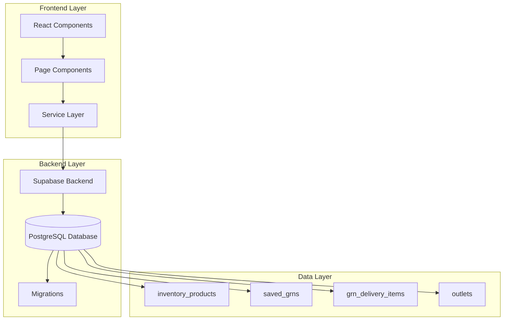
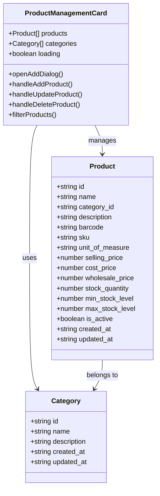
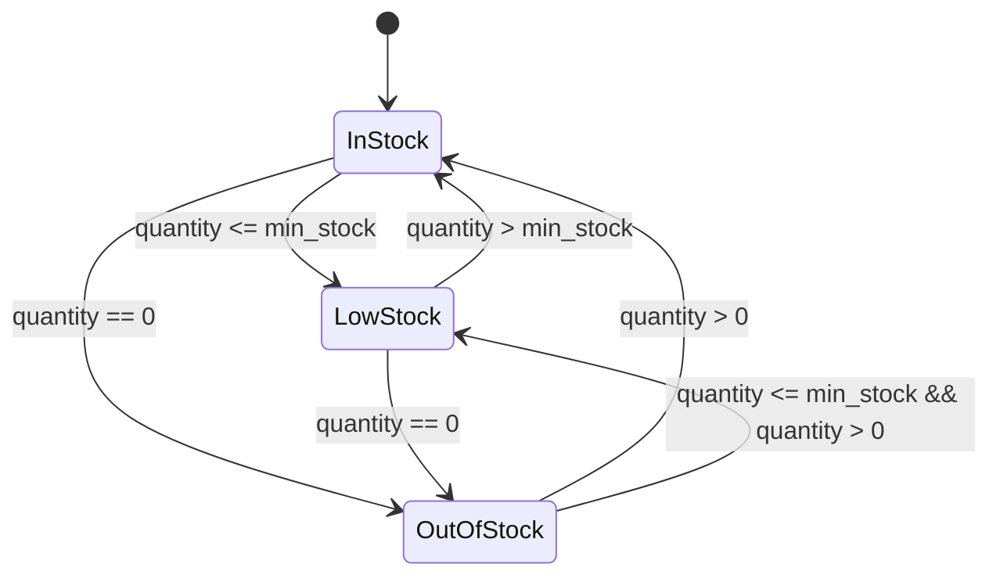
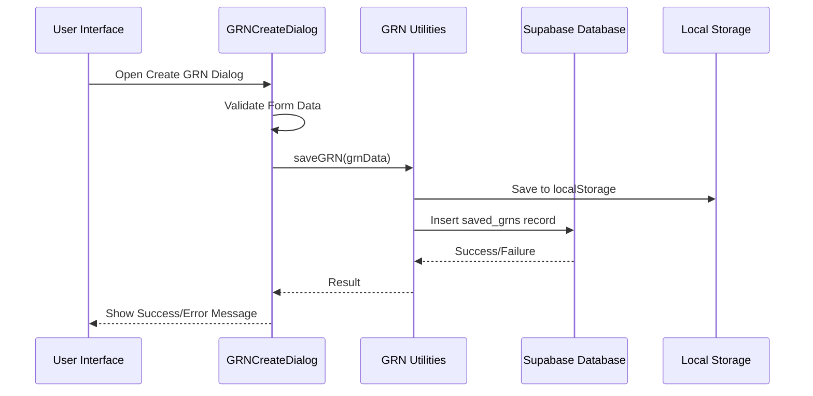
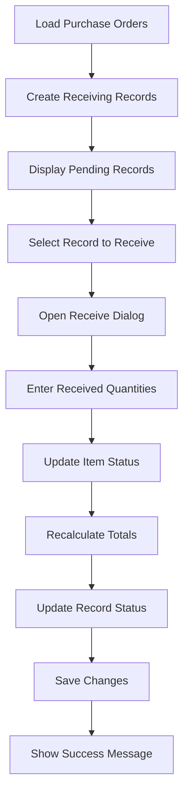
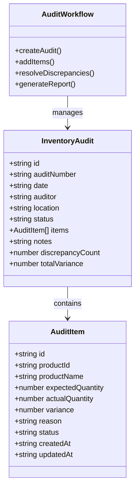
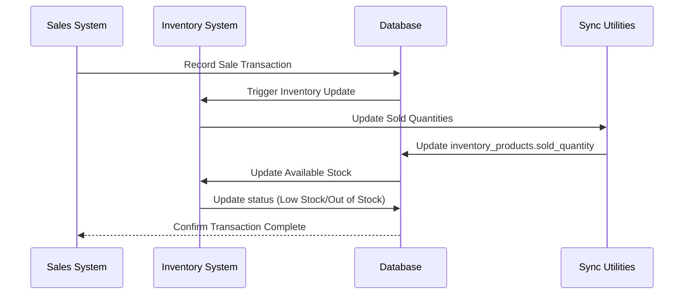
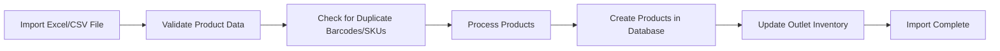
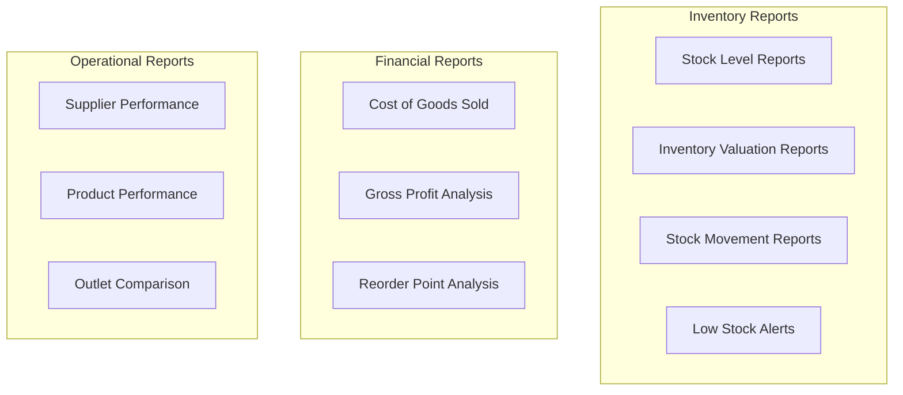

# Inventory Management System

<cite>
**Referenced Files in This Document**
- [InventoryManagement.tsx](file://src/pages/InventoryManagement.tsx)
- [InventoryReceiving.tsx](file://src/pages/InventoryReceiving.tsx)
- [OutletInventory.tsx](file://src/pages/OutletInventory.tsx)
- [InventoryAudit.tsx](file://src/pages/InventoryAudit.tsx)
- [ProductManagementCard.tsx](file://src/components/ProductManagementCard.tsx)
- [GRNManagementCard.tsx](file://src/components/GRNManagementCard.tsx)
- [GRNCreateDialog.tsx](file://src/components/GRNCreateDialog.tsx)
- [databaseService.ts](file://src/services/databaseService.ts)
- [grnUtils.ts](file://src/utils/grnUtils.ts)
- [syncSellingPrices.ts](file://src/utils/syncSellingPrices.ts)
- [syncSoldQuantities.ts](file://src/utils/syncSoldQuantities.ts)
- [OutletGRN.tsx](file://src/pages/OutletGRN.tsx)
- [20260313_create_inventory_products_table.sql](file://migrations/20260313_create_inventory_products_table.sql)
- [20260219_create_grn_schema.sql](file://migrations/20260219_create_grn_schema.sql)
</cite>

## Table of Contents
1. [Introduction](#introduction)
2. [System Architecture](#system-architecture)
3. [Core Components](#core-components)
4. [Product Management](#product-management)
5. [Inventory Tracking](#inventory-tracking)
6. [Goods Receipt Note (GRN) Workflow](#goods-receipt-note-grn-workflow)
7. [Inventory Receiving Process](#inventory-receiving-process)
8. [Inventory Audit System](#inventory-audit-system)
9. [Stock Synchronization](#stock-synchronization)
10. [Barcode Integration](#barcode-integration)
11. [Bulk Operations](#bulk-operations)
12. [Reporting and Analytics](#reporting-and-analytics)
13. [Common Scenarios](#common-scenarios)
14. [Troubleshooting Guide](#troubleshooting-guide)
15. [Performance Optimization](#performance-optimization)
16. [Conclusion](#conclusion)

## Introduction

Royal POS Modern is a comprehensive inventory management system designed for modern retail environments. The system provides end-to-end inventory control from product catalog management through real-time stock tracking, supplier deliveries, and inventory adjustments. Built with React and TypeScript, it leverages Supabase for backend services and PostgreSQL for data persistence.

The system supports multiple outlets with individual inventory tracking, real-time stock synchronization between sales and inventory systems, and comprehensive reporting capabilities. It includes advanced features such as barcode scanning, bulk product imports, and automated low-stock alerts.

## System Architecture

The inventory management system follows a modular architecture with clear separation of concerns:



**Diagram sources**
- [databaseService.ts:129-149](file://src/services/databaseService.ts#L129-L149)
- [20260313_create_inventory_products_table.sql:1-61](file://migrations/20260313_create_inventory_products_table.sql#L1-L61)
- [20260219_create_grn_schema.sql:1-97](file://migrations/20260219_create_grn_schema.sql#L1-L97)

**Section sources**
- [databaseService.ts:1-50](file://src/services/databaseService.ts#L1-L50)
- [20260313_create_inventory_products_table.sql:1-61](file://migrations/20260313_create_inventory_products_table.sql#L1-L61)

## Core Components

### Main Inventory Management Interface

The system centers around a comprehensive inventory management page that provides unified access to all inventory functions:

```mermaid
flowchart TD
InventoryManagement[Inventory Management Page] --> Tabs[Tabs: Products | GRN]
Tabs --> ProductTab[Products Management]
Tabs --> GRNTab[GRN Management]
ProductTab --> ProductCard[Product Management Card]
ProductTab --> ProductCRUD[CRUD Operations]
ProductTab --> CategoryManagement[Category Management]
ProductTab --> PricingStrategies[Pricing Strategies]
GRNTab --> GRNCard[GRN Management Card]
GRNTab --> GRNCreate[GRN Creation]
GRNTab --> GRNTracking[GRN Tracking]
GRNTab --> GRNReporting[GRN Reporting]
```

**Diagram sources**
- [InventoryManagement.tsx:10-121](file://src/pages/InventoryManagement.tsx#L10-L121)

**Section sources**
- [InventoryManagement.tsx:1-121](file://src/pages/InventoryManagement.tsx#L1-L121)

## Product Management

### Product Catalog Management

The product management system provides comprehensive CRUD operations with advanced features:



**Diagram sources**
- [ProductManagementCard.tsx:16-35](file://src/components/ProductManagementCard.tsx#L16-L35)
- [databaseService.ts:16-34](file://src/services/databaseService.ts#L16-L34)

### Pricing Strategies

The system supports multiple pricing tiers with automatic calculations:

| Pricing Tier | Description | Usage |
|--------------|-------------|-------|
| Cost Price | Purchase price from suppliers | Base cost calculation |
| Selling Price | Retail price for customers | Primary revenue generation |
| Wholesale Price | Bulk pricing for large orders | Volume discounts |

**Section sources**
- [ProductManagementCard.tsx:496-784](file://src/components/ProductManagementCard.tsx#L496-L784)
- [databaseService.ts:496-784](file://src/services/databaseService.ts#L496-L784)

## Inventory Tracking

### Real-Time Stock Management

The outlet inventory system provides comprehensive stock tracking with automatic status updates:



**Diagram sources**
- [20260313_create_inventory_products_table.sql:42-60](file://migrations/20260313_create_inventory_products_table.sql#L42-L60)

### Stock Level Monitoring

The system tracks multiple stock metrics:

| Metric | Description | Calculation |
|--------|-------------|-------------|
| Available Quantity | Current stock minus sold items | quantity - sold_quantity |
| Total Value | Stock value at cost price | quantity × unit_cost |
| Total Retail Value | Stock value at selling price | quantity × selling_price |
| Potential Earnings | Difference between retail and cost | total_retail_value - total_value |

**Section sources**
- [OutletInventory.tsx:122-280](file://src/pages/OutletInventory.tsx#L122-L280)
- [20260313_create_inventory_products_table.sql:1-61](file://migrations/20260313_create_inventory_products_table.sql#L1-L61)

## Goods Receipt Note (GRN) Workflow

### GRN Creation Process

The GRN system handles supplier deliveries with comprehensive tracking:



**Diagram sources**
- [GRNCreateDialog.tsx:222-264](file://src/components/GRNCreateDialog.tsx#L222-L264)
- [grnUtils.ts:74-195](file://src/utils/grnUtils.ts#L74-L195)

### GRN Management Features

The GRN management system provides comprehensive tracking:

| Feature | Description | Implementation |
|---------|-------------|----------------|
| Multi-item Support | Handle multiple products per delivery | Items array with detailed tracking |
| Cost Distribution | Allocate receiving costs across items | Automatic cost per unit calculation |
| Quality Control | Track quality checks and discrepancies | Dedicated fields for notes |
| Status Tracking | Monitor delivery progress | Status lifecycle management |
| Batch Management | Track expiration dates and batch numbers | Batch and expiry date fields |

**Section sources**
- [GRNManagementCard.tsx:1-553](file://src/components/GRNManagementCard.tsx#L1-L553)
- [GRNCreateDialog.tsx:1-732](file://src/components/GRNCreateDialog.tsx#L1-L732)
- [grnUtils.ts:1-436](file://src/utils/grnUtils.ts#L1-L436)

## Inventory Receiving Process

### Receiving Workflow

The inventory receiving system streamlines supplier delivery processing:



**Diagram sources**
- [InventoryReceiving.tsx:219-272](file://src/pages/InventoryReceiving.tsx#L219-L272)

### Receiving Operations

The system supports various receiving scenarios:

| Operation | Description | Status Impact |
|-----------|-------------|---------------|
| Partial Receipt | Receive less than ordered quantity | Partial status |
| Complete Receipt | Receive full ordered quantity | Completed status |
| Damage Recording | Record damaged items separately | Adjust available stock |
| Excess Receipt | Receive more than ordered | Adjust for overage |

**Section sources**
- [InventoryReceiving.tsx:1-491](file://src/pages/InventoryReceiving.tsx#L1-L491)

## Inventory Audit System

### Audit Capabilities

The inventory audit system provides comprehensive discrepancy tracking:



**Diagram sources**
- [InventoryAudit.tsx:15-39](file://src/pages/InventoryAudit.tsx#L15-L39)

### Audit Process

The audit system supports complete inventory reconciliation:

1. **Audit Planning**: Create audit with location, auditor, and expected items
2. **Physical Counting**: Conduct inventory count with barcode scanning
3. **Discrepancy Recording**: Log differences with reasons and supporting documentation
4. **Resolution Tracking**: Manage resolution status and approval workflows
5. **Reporting**: Generate audit reports for management review

**Section sources**
- [InventoryAudit.tsx:1-474](file://src/pages/InventoryAudit.tsx#L1-L474)

## Stock Synchronization

### Sales to Inventory Integration

The system maintains real-time synchronization between sales and inventory:



**Diagram sources**
- [syncSoldQuantities.ts:59-124](file://src/utils/syncSoldQuantities.ts#L59-L124)
- [syncSellingPrices.ts:26-99](file://src/utils/syncSellingPrices.ts#L26-L99)

### Synchronization Utilities

The system provides specialized utilities for data migration:

| Utility | Purpose | Data Format |
|---------|---------|-------------|
| syncSoldQuantities | Migrate sold quantity data | localStorage → database |
| syncSellingPrices | Update product pricing | localStorage → database |
| syncAllOutlets | Batch synchronization | Multiple outlets |

**Section sources**
- [syncSoldQuantities.ts:1-183](file://src/utils/syncSoldQuantities.ts#L1-L183)
- [syncSellingPrices.ts:1-156](file://src/utils/syncSellingPrices.ts#L1-L156)

## Barcode Integration

### Barcode Management

The system supports comprehensive barcode operations:

| Barcode Type | Field | Usage |
|--------------|-------|-------|
| Product Barcode | barcode | Individual product identification |
| Product SKU | sku | Internal product reference |
| Supplier Barcode | supplier_barcode | Supplier product identification |
| Universal Product Code | upc | Standard product code |

### Barcode Operations

The barcode system supports:

- **Scanning Integration**: Real-time barcode scanning via camera
- **Automatic Lookup**: Instant product lookup by barcode
- **Duplicate Prevention**: Barcode uniqueness validation
- **Batch Operations**: Barcode generation for bulk product creation

**Section sources**
- [databaseService.ts:535-578](file://src/services/databaseService.ts#L535-L578)
- [ProductManagementCard.tsx:38-57](file://src/components/ProductManagementCard.tsx#L38-L57)

## Bulk Operations

### Bulk Product Import

The system supports efficient bulk product management:



### Bulk Operations Features

| Operation | Supported Formats | Validation | Error Handling |
|-----------|-------------------|------------|----------------|
| Product Import | Excel, CSV | Barcode/SKU uniqueness, required fields | Detailed error reporting |
| Price Updates | Excel, CSV | Product matching by barcode/SKU | Partial success/failure |
| Stock Adjustments | CSV | Quantity validation, product existence | Rollback capability |

**Section sources**
- [ProductManagementCard.tsx:97-168](file://src/components/ProductManagementCard.tsx#L97-L168)

## Reporting and Analytics

### Inventory Analytics Dashboard

The system provides comprehensive reporting capabilities:



### Key Metrics

| Metric | Description | Calculation |
|--------|-------------|-------------|
| Inventory Turnover | How often inventory sells and replaces | COGS / Average Inventory |
| Days Sales of Inventory | Days inventory sits on shelf | 365 / Inventory Turnover |
| Gross Profit Margin | % of revenue after cost of goods | (Revenue - COGS) / Revenue |
| Stock Accuracy | Percentage of accurate inventory counts | Accurate Count / Total Count |

**Section sources**
- [OutletInventory.tsx:210-241](file://src/pages/OutletInventory.tsx#L210-L241)

## Common Scenarios

### Scenario 1: Stock Receiving Process

**Step-by-step Process:**

1. **Create Purchase Order**: Generate PO for supplier delivery
2. **Receive Shipment**: Scan delivery or manually enter quantities
3. **Quality Check**: Inspect items for damage or discrepancies
4. **Update Inventory**: Record received quantities and update stock levels
5. **Generate GRN**: Create Goods Receipt Note for documentation
6. **Update Costs**: Apply receiving costs and update unit costs

**Section sources**
- [InventoryReceiving.tsx:219-272](file://src/pages/InventoryReceiving.tsx#L219-L272)
- [GRNCreateDialog.tsx:222-264](file://src/components/GRNCreateDialog.tsx#L222-L264)

### Scenario 2: Inventory Adjustment

**Process Steps:**

1. **Identify Discrepancy**: Compare physical count with system records
2. **Document Reason**: Record cause of discrepancy (damage, theft, error)
3. **Create Adjustment**: Generate inventory adjustment entry
4. **Update Stock**: Modify inventory quantities accordingly
5. **Approve Adjustment**: Route for supervisor approval
6. **Update Reports**: Reflect changes in inventory reports

**Section sources**
- [InventoryAudit.tsx:117-175](file://src/pages/InventoryAudit.tsx#L117-L175)

### Scenario 3: Product Transfer Between Outlets

**Transfer Process:**

1. **Initiate Transfer**: Create transfer request from source outlet
2. **Update Source Stock**: Reduce quantities in source outlet
3. **Update Destination Stock**: Increase quantities in destination outlet
4. **Generate Transfer Documents**: Create transfer receipts
5. **Update Tracking**: Track transfer status and completion
6. **Reconcile Accounts**: Update financial records for both outlets

## Troubleshooting Guide

### Common Issues and Solutions

| Issue | Symptoms | Solution |
|-------|----------|----------|
| Barcode Scanning Not Working | Scanner not recognized | Check browser permissions, update camera drivers |
| Inventory Not Updating | Stock levels unchanged after sales | Verify sync utilities are running, check database connectivity |
| GRN Creation Failing | Error when saving GRN | Validate required fields, check database schema |
| Low Stock Alerts Not Triggering | Missing low stock notifications | Verify min_stock thresholds, check alert configurations |
| Product Duplication | Duplicate products appearing | Check barcode/SKU uniqueness, validate import files |

### Performance Issues

**Database Optimization:**
- Ensure proper indexing on frequently queried fields
- Regular database maintenance and vacuum operations
- Optimize queries for large datasets

**Frontend Performance:**
- Implement virtual scrolling for large product lists
- Use pagination for inventory displays
- Debounce search operations

**Section sources**
- [databaseService.ts:401-413](file://src/services/databaseService.ts#L401-L413)
- [OutletInventory.tsx:384-410](file://src/pages/OutletInventory.tsx#L384-L410)

## Performance Optimization

### Database Optimization Strategies

**Indexing Strategy:**
- Primary keys: Auto-generated UUIDs with appropriate indexing
- Frequently searched fields: barcode, sku, name, category
- Foreign keys: outlet_id, category_id for join operations
- Date ranges: created_at, updated_at for time-based queries

**Query Optimization:**
- Use LIMIT clauses for large result sets
- Implement proper WHERE clause filtering
- Avoid SELECT * in favor of specific column selection
- Use EXPLAIN ANALYZE for query performance tuning

### Frontend Performance

**Component Optimization:**
- Implement React.memo for expensive components
- Use lazy loading for heavy components
- Optimize rendering with proper key props
- Debounce user input for search operations

**Data Management:**
- Implement caching strategies for frequently accessed data
- Use pagination for large datasets
- Lazy load images and heavy assets
- Optimize state management to reduce re-renders

## Conclusion

Royal POS Modern provides a comprehensive inventory management solution with robust features for modern retail operations. The system's modular architecture, real-time synchronization capabilities, and comprehensive reporting tools make it suitable for businesses of all sizes.

Key strengths include:
- **Real-time Inventory Tracking**: Automatic stock updates and low-stock alerts
- **Supplier Integration**: Complete GRN workflow with quality control
- **Multi-outlet Support**: Individual inventory tracking per location
- **Advanced Analytics**: Comprehensive reporting and performance metrics
- **Scalability**: Optimized for growing business needs

The system's extensible design allows for future enhancements while maintaining stability and performance. Regular maintenance, proper indexing, and optimized queries ensure reliable operation as business demands increase.