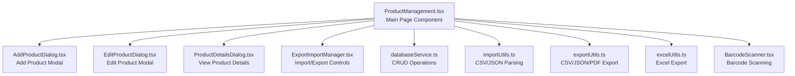
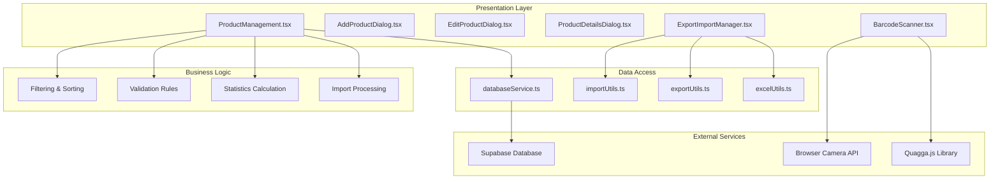
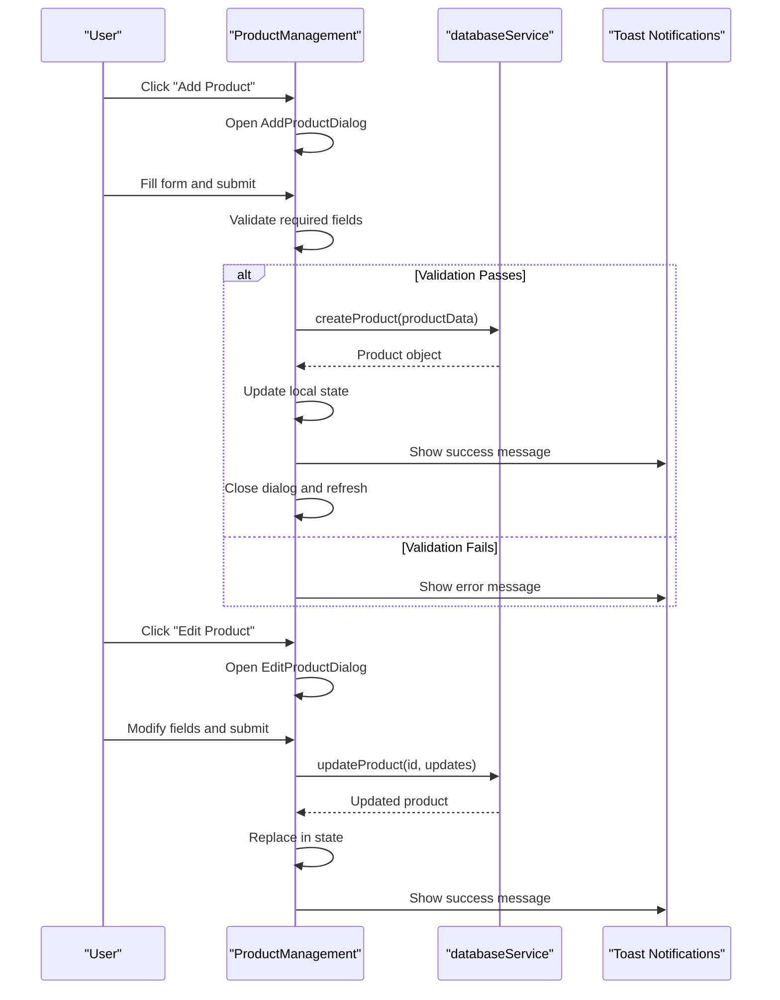
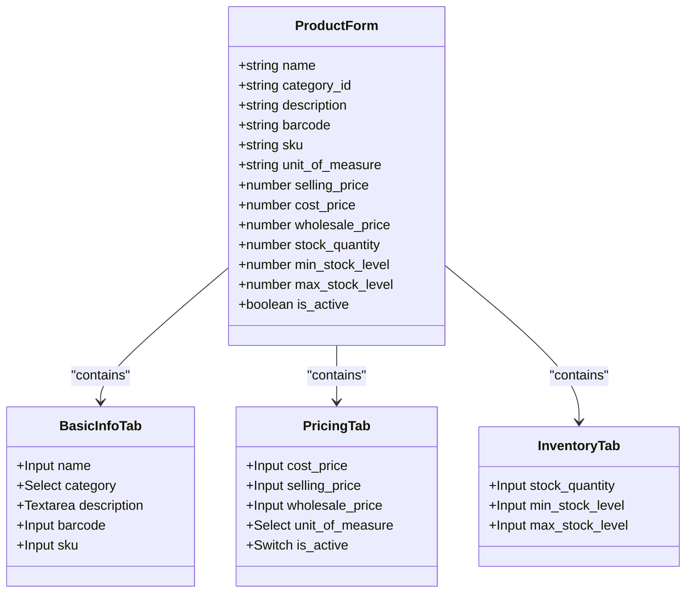
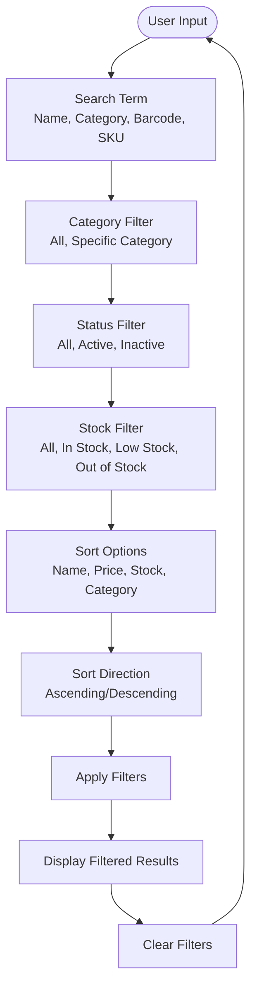
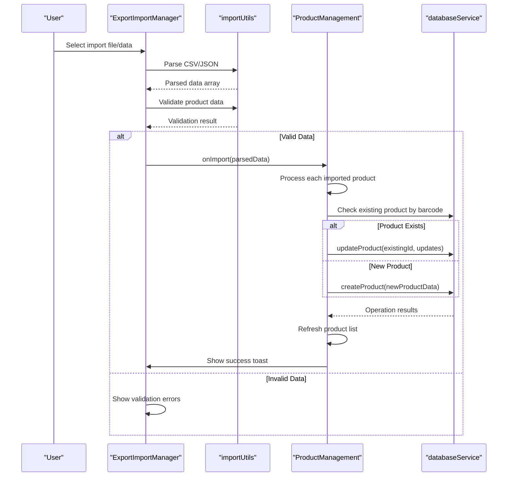
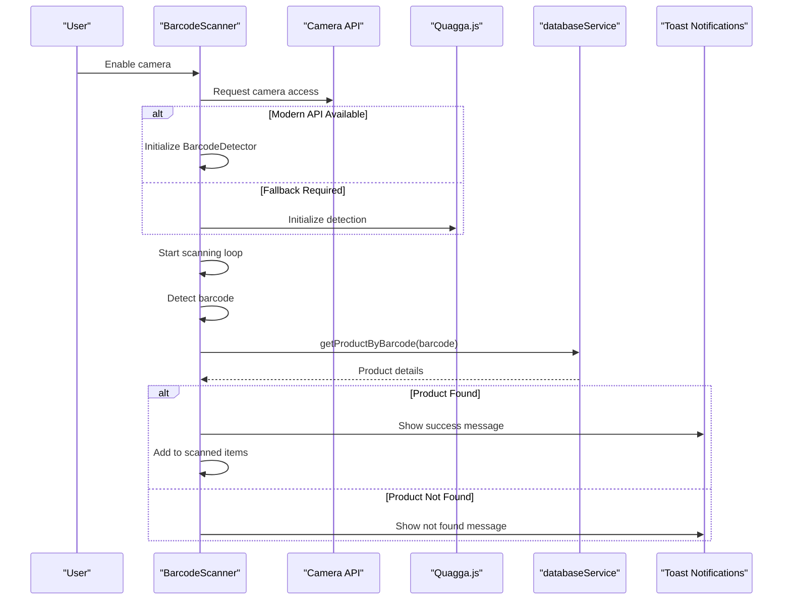
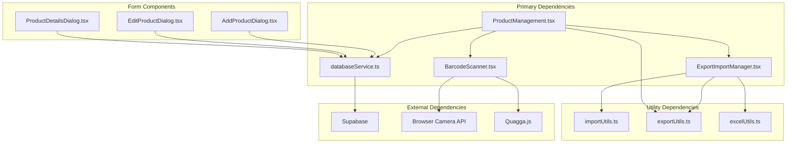

# Product Catalog Management

<cite>
**Referenced Files in This Document**
- [ProductManagement.tsx](file://src/pages/ProductManagement.tsx)
- [AddProductDialog.tsx](file://src/components/AddProductDialog.tsx)
- [EditProductDialog.tsx](file://src/components/EditProductDialog.tsx)
- [ProductDetailsDialog.tsx](file://src/components/ProductDetailsDialog.tsx)
- [ExportImportManager.tsx](file://src/components/ExportImportManager.tsx)
- [databaseService.ts](file://src/services/databaseService.ts)
- [importUtils.ts](file://src/utils/importUtils.ts)
- [excelUtils.ts](file://src/utils/excelUtils.ts)
- [exportUtils.ts](file://src/utils/exportUtils.ts)
- [BarcodeScanner.tsx](file://src/components/BarcodeScanner.tsx)
- [ENHANCED_PRODUCT_MANAGEMENT.md](file://ENHANCED_PRODUCT_MANAGEMENT.md)
- [PRODUCT_CRUD_OPERATIONS.md](file://PRODUCT_CRUD_OPERATIONS.md)
- [README.md](file://README.md)
</cite>

## Table of Contents
1. [Introduction](#introduction)
2. [Project Structure](#project-structure)
3. [Core Components](#core-components)
4. [Architecture Overview](#architecture-overview)
5. [Detailed Component Analysis](#detailed-component-analysis)
6. [Dependency Analysis](#dependency-analysis)
7. [Performance Considerations](#performance-considerations)
8. [Troubleshooting Guide](#troubleshooting-guide)
9. [Conclusion](#conclusion)

## Introduction
This document provides comprehensive guidance for the product catalog management system within the POS application. It covers complete product CRUD operations (create, read, update, delete), activation/deactivation workflows, the multi-tab form interface (basic information, pricing, inventory), advanced filtering and sorting, bulk import/export functionality, unit of measure system, barcode scanning integration, category management, validation rules, error handling, user feedback mechanisms, troubleshooting, and performance optimization strategies.

## Project Structure
The product catalog management feature is implemented as a cohesive module centered around a primary page component with supporting dialogs, utilities, and services:

- **Page Component**: ProductManagement.tsx orchestrates the UI, state, filtering, sorting, and CRUD operations
- **Dialog Components**: AddProductDialog.tsx, EditProductDialog.tsx, ProductDetailsDialog.tsx provide modal forms for product operations
- **Import/Export**: ExportImportManager.tsx integrates CSV/JSON/Excel/PDF export and import workflows
- **Database Service**: databaseService.ts defines typed interfaces and CRUD operations for products and categories
- **Utilities**: importUtils.ts, excelUtils.ts, exportUtils.ts handle data parsing, formatting, and export generation
- **Barcode Scanner**: BarcodeScanner.tsx enables camera-based barcode scanning and product lookup

**Diagram sources**
- [ProductManagement.tsx:45-1293](file://src/pages/ProductManagement.tsx#L45-L1293)
- [AddProductDialog.tsx:35-345](file://src/components/AddProductDialog.tsx#L35-L345)
- [EditProductDialog.tsx:36-339](file://src/components/EditProductDialog.tsx#L36-L339)
- [ProductDetailsDialog.tsx:17-230](file://src/components/ProductDetailsDialog.tsx#L17-L230)
- [ExportImportManager.tsx:28-259](file://src/components/ExportImportManager.tsx#L28-L259)
- [databaseService.ts:16-784](file://src/services/databaseService.ts#L16-L784)
- [importUtils.ts:1-114](file://src/utils/importUtils.ts#L1-L114)
- [exportUtils.ts:12-109](file://src/utils/exportUtils.ts#L12-L109)
- [excelUtils.ts:1-36](file://src/utils/excelUtils.ts#L1-L36)
- [BarcodeScanner.tsx:39-878](file://src/components/BarcodeScanner.tsx#L39-L878)

**Section sources**
- [ProductManagement.tsx:1-1293](file://src/pages/ProductManagement.tsx#L1-L1293)
- [README.md:1-207](file://README.md#L1-L207)

## Core Components
This section outlines the primary components and their responsibilities:

- **ProductManagement Page**
  - Manages product list state, categories, loading/error states
  - Implements search, filtering, and sorting
  - Handles CRUD operations via databaseService
  - Integrates import/export and barcode scanning
  - Provides statistics dashboard and action buttons (activate/deactivate, edit, view)

- **AddProductDialog**
  - Modal form for creating new products
  - Tabbed interface for basic info, pricing, and inventory
  - Category selection with "No Category" option
  - Unit of measure selection from predefined options

- **EditProductDialog**
  - Modal form for editing existing products
  - Preserves and updates all product attributes
  - Maintains category and unit of measure selections

- **ProductDetailsDialog**
  - Read-only view of product details
  - Displays summary cards (stock, min/max levels, costs, total value)
  - Shows detailed information tables for product, pricing, and inventory

- **ExportImportManager**
  - Provides export to CSV, Excel, JSON, and PDF
  - Supports import from file or manual paste
  - Validates product data before import
  - Integrates with ProductManagement for bulk operations

- **Database Service**
  - Defines Product and Category interfaces
  - Implements create, read, update, delete operations
  - Includes specialized functions: getProductByBarcode, getProductBySKU
  - Provides stock increment/decrement utilities

- **BarcodeScanner**
  - Camera-based barcode scanning with modern API and Quagga fallback
  - Real-time product lookup by barcode
  - Manual barcode entry support
  - Toast notifications for user feedback

**Section sources**
- [ProductManagement.tsx:45-1293](file://src/pages/ProductManagement.tsx#L45-L1293)
- [AddProductDialog.tsx:35-345](file://src/components/AddProductDialog.tsx#L35-L345)
- [EditProductDialog.tsx:36-339](file://src/components/EditProductDialog.tsx#L36-L339)
- [ProductDetailsDialog.tsx:17-230](file://src/components/ProductDetailsDialog.tsx#L17-L230)
- [ExportImportManager.tsx:28-259](file://src/components/ExportImportManager.tsx#L28-L259)
- [databaseService.ts:16-784](file://src/services/databaseService.ts#L16-L784)
- [BarcodeScanner.tsx:39-878](file://src/components/BarcodeScanner.tsx#L39-L878)

## Architecture Overview
The system follows a layered architecture with clear separation of concerns:

**Diagram sources**
- [ProductManagement.tsx:45-1293](file://src/pages/ProductManagement.tsx#L45-L1293)
- [databaseService.ts:497-784](file://src/services/databaseService.ts#L497-L784)
- [importUtils.ts:1-114](file://src/utils/importUtils.ts#L1-L114)
- [exportUtils.ts:12-109](file://src/utils/exportUtils.ts#L12-L109)
- [excelUtils.ts:1-36](file://src/utils/excelUtils.ts#L1-L36)
- [BarcodeScanner.tsx:134-367](file://src/components/BarcodeScanner.tsx#L134-L367)

## Detailed Component Analysis

### Product CRUD Operations
The system implements full CRUD functionality with comprehensive validation and user feedback:

**Diagram sources**
- [ProductManagement.tsx:123-246](file://src/pages/ProductManagement.tsx#L123-L246)
- [AddProductDialog.tsx:90-122](file://src/components/AddProductDialog.tsx#L90-L122)
- [EditProductDialog.tsx:93-124](file://src/components/EditProductDialog.tsx#L93-L124)
- [databaseService.ts:580-640](file://src/services/databaseService.ts#L580-L640)

Key validation rules enforced:
- Product name is required for creation/update
- Selling price must be zero or positive
- Cost price must be zero or positive
- Stock quantities must be zero or positive
- Empty strings for barcode/SKU are converted to null for database storage

**Section sources**
- [ProductManagement.tsx:123-246](file://src/pages/ProductManagement.tsx#L123-L246)
- [databaseService.ts:580-760](file://src/services/databaseService.ts#L580-L760)
- [PRODUCT_CRUD_OPERATIONS.md:1-194](file://PRODUCT_CRUD_OPERATIONS.md#L1-L194)

### Multi-Tab Form Interface
The product forms utilize a three-tab structure for intuitive data entry:

**Diagram sources**
- [ProductManagement.tsx:55-899](file://src/pages/ProductManagement.tsx#L55-L899)
- [AddProductDialog.tsx:41-331](file://src/components/AddProductDialog.tsx#L41-L331)
- [EditProductDialog.tsx:42-325](file://src/components/EditProductDialog.tsx#L42-L325)

Supported unit of measure options:
- Piece, Kilogram, Gram, Pound, Ounce
- Liter, Milliliter, Gallon
- Box, Pack, Dozen

**Section sources**
- [ProductManagement.tsx:21-34](file://src/pages/ProductManagement.tsx#L21-L34)
- [AddProductDialog.tsx:20-33](file://src/components/AddProductDialog.tsx#L20-L33)
- [EditProductDialog.tsx:21-34](file://src/components/EditProductDialog.tsx#L21-L34)

### Advanced Filtering and Sorting
The system provides comprehensive filtering and sorting capabilities:

**Diagram sources**
- [ProductManagement.tsx:307-357](file://src/pages/ProductManagement.tsx#L307-L357)
- [ProductManagement.tsx:963-1048](file://src/pages/ProductManagement.tsx#L963-L1048)

Filtering logic includes:
- Multi-field search across product names, categories, barcodes, and SKUs
- Category selection with dynamic category list
- Status filtering (active/inactive/all)
- Stock level filtering with thresholds
- Sorting by multiple criteria with direction control

**Section sources**
- [ProductManagement.tsx:307-357](file://src/pages/ProductManagement.tsx#L307-L357)
- [ProductManagement.tsx:963-1048](file://src/pages/ProductManagement.tsx#L963-L1048)

### Bulk Product Import Functionality
The import system supports seamless batch operations:

**Diagram sources**
- [ExportImportManager.tsx:69-161](file://src/components/ExportImportManager.tsx#L69-L161)
- [ProductManagement.tsx:157-210](file://src/pages/ProductManagement.tsx#L157-L210)
- [importUtils.ts:49-71](file://src/utils/importUtils.ts#L49-L71)

Import behavior:
- Existing products are matched by barcode and updated
- New products are created for unmatched barcodes
- Automatic data type conversion for prices and quantities
- Comprehensive validation with detailed error reporting

**Section sources**
- [ExportImportManager.tsx:69-161](file://src/components/ExportImportManager.tsx#L69-L161)
- [ProductManagement.tsx:157-210](file://src/pages/ProductManagement.tsx#L157-L210)
- [importUtils.ts:49-71](file://src/utils/importUtils.ts#L49-L71)

### Unit of Measure System
The system supports standardized units for inventory tracking:

Supported Units:
- **Count Units**: piece, dozen
- **Weight Units**: kg, g, lb, oz
- **Volume Units**: l, ml, gal
- **Packaging Units**: box, pack

Implementation details:
- Centralized unit definitions in form components
- Consistent selection across add/edit dialogs
- Database field for storing unit measurements
- Display formatting in product listings

**Section sources**
- [ProductManagement.tsx:21-34](file://src/pages/ProductManagement.tsx#L21-L34)
- [AddProductDialog.tsx:20-33](file://src/components/AddProductDialog.tsx#L20-L33)
- [EditProductDialog.tsx:21-34](file://src/components/EditProductDialog.tsx#L21-L34)

### Barcode Scanning Integration
The barcode scanner provides real-time product lookup:

**Diagram sources**
- [BarcodeScanner.tsx:134-367](file://src/components/BarcodeScanner.tsx#L134-L367)
- [databaseService.ts:534-555](file://src/services/databaseService.ts#L534-L555)

Scanner capabilities:
- Modern Barcode Detection API with fallback to Quagga.js
- Camera access with device-specific constraints
- Debounced scanning to prevent duplicate detections
- Real-time product lookup and inventory updates
- Manual barcode entry support

**Section sources**
- [BarcodeScanner.tsx:39-878](file://src/components/BarcodeScanner.tsx#L39-L878)
- [databaseService.ts:534-555](file://src/services/databaseService.ts#L534-L555)

### Category Management
The system provides flexible category handling:

- Dynamic category loading from database
- Category selection with "No Category" option
- Category ID generation for entries with null/empty IDs
- Category-aware filtering and display
- Integration with product search and filtering

**Section sources**
- [ProductManagement.tsx:36-43](file://src/pages/ProductManagement.tsx#L36-L43)
- [ProductManagement.tsx:105-121](file://src/pages/ProductManagement.tsx#L105-L121)

### Product Validation Rules and Error Handling
The system implements comprehensive validation and error handling:

Validation Rules:
- Required fields: product name, selling price
- Numeric validation: non-negative values for prices and quantities
- Unique constraints: barcode and SKU converted to null for uniqueness
- Type validation: proper conversion for numbers and strings

Error Handling:
- Centralized toast notifications for user feedback
- Detailed error logging for debugging
- Graceful degradation for failed operations
- User-friendly error messages with actionable guidance

**Section sources**
- [ProductManagement.tsx:123-155](file://src/pages/ProductManagement.tsx#L123-L155)
- [databaseService.ts:580-760](file://src/services/databaseService.ts#L580-L760)

## Dependency Analysis
The product catalog management system exhibits strong modularity with clear dependency relationships:

**Diagram sources**
- [ProductManagement.tsx:18-19](file://src/pages/ProductManagement.tsx#L18-L19)
- [databaseService.ts:1-1](file://src/services/databaseService.ts#L1-L1)
- [ExportImportManager.tsx:7-20](file://src/components/ExportImportManager.tsx#L7-L20)
- [BarcodeScanner.tsx:21-23](file://src/components/BarcodeScanner.tsx#L21-L23)

Key dependency characteristics:
- Loose coupling between UI components and database service
- Centralized validation logic in database service
- Utility modules provide reusable functionality
- External dependencies isolated in dedicated components

**Section sources**
- [ProductManagement.tsx:1-1293](file://src/pages/ProductManagement.tsx#L1-L1293)
- [databaseService.ts:1-800](file://src/services/databaseService.ts#L1-L800)

## Performance Considerations
The system incorporates several performance optimization strategies:

- **Efficient Filtering**: Client-side filtering optimized for large datasets
- **Lazy Loading**: Categories and products loaded on demand
- **State Management**: Minimal re-renders through targeted state updates
- **Export Optimization**: Streaming exports for large datasets
- **Import Processing**: Batch processing with progress indication
- **Database Queries**: Optimized Supabase queries with proper indexing
- **Memory Management**: Cleanup of media streams and timers in components

Best practices for large catalogs:
- Implement pagination for product lists
- Use debounced search to reduce filtering frequency
- Cache frequently accessed categories
- Optimize database indexes for common queries
- Consider server-side filtering for very large datasets

## Troubleshooting Guide

### Common Issues and Solutions

**Product Creation Failures**
- Verify required fields are filled (name, selling price)
- Check price values are non-negative
- Ensure barcode/SKU uniqueness if provided
- Review toast notifications for specific error messages

**Import/Export Problems**
- Validate CSV/JSON format compliance
- Check data types match expected formats
- Review validation error messages for specific issues
- Ensure file encoding is UTF-8 for Excel exports

**Barcode Scanner Issues**
- Verify camera permissions are granted
- Check HTTPS requirement for mobile devices
- Ensure modern browser with Barcode Detection API support
- Try Quagga.js fallback for unsupported devices

**Performance Issues**
- Clear unnecessary filters to reduce dataset size
- Use pagination for large product catalogs
- Close unused modals to free memory
- Check browser developer tools for performance bottlenecks

**Database Connectivity**
- Verify Supabase credentials are configured
- Check network connectivity to database
- Review browser console for connection errors
- Ensure database is properly initialized

**Section sources**
- [ProductManagement.tsx:83-121](file://src/pages/ProductManagement.tsx#L83-L121)
- [BarcodeScanner.tsx:52-132](file://src/components/BarcodeScanner.tsx#L52-L132)
- [ExportImportManager.tsx:34-67](file://src/components/ExportImportManager.tsx#L34-L67)

## Conclusion
The product catalog management system provides a comprehensive, user-friendly solution for inventory management with robust CRUD operations, advanced filtering, bulk import/export capabilities, and integrated barcode scanning. The modular architecture ensures maintainability and extensibility, while comprehensive validation and error handling deliver a reliable user experience. The system's performance optimizations and troubleshooting guidance support efficient operation across various deployment scenarios and dataset sizes.