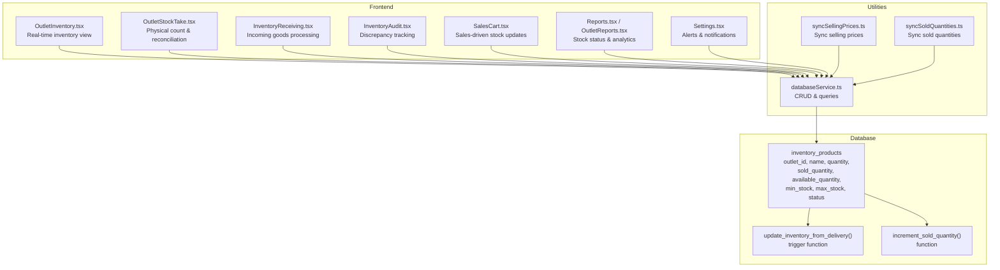
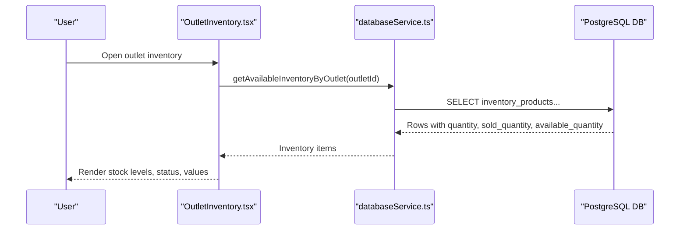
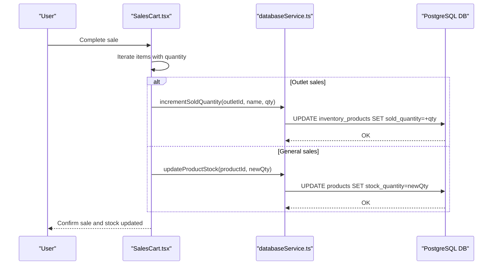
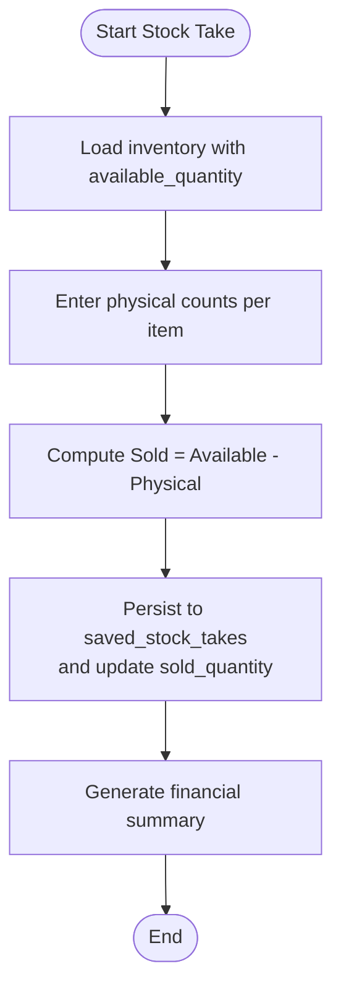
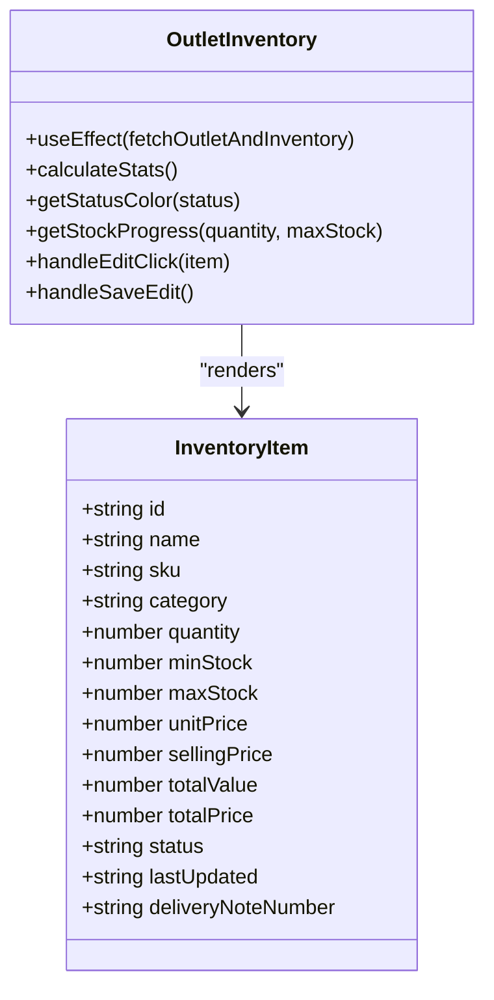
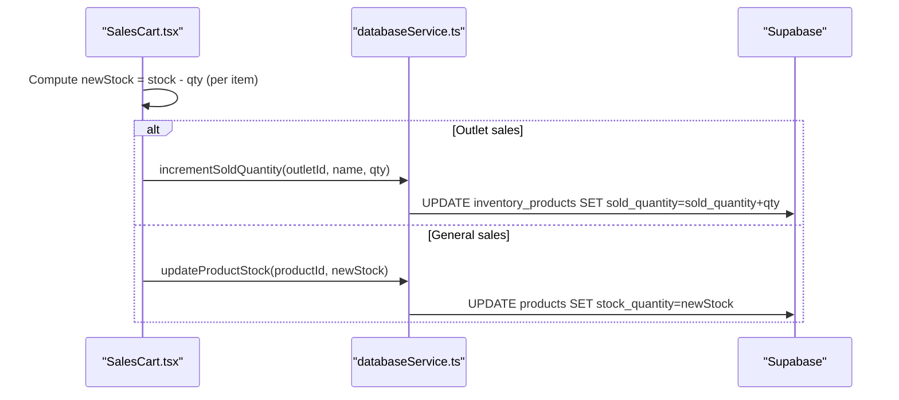
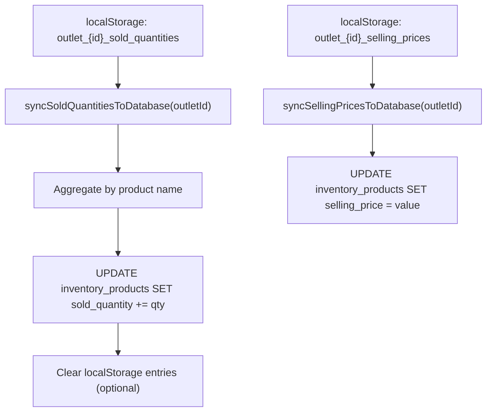
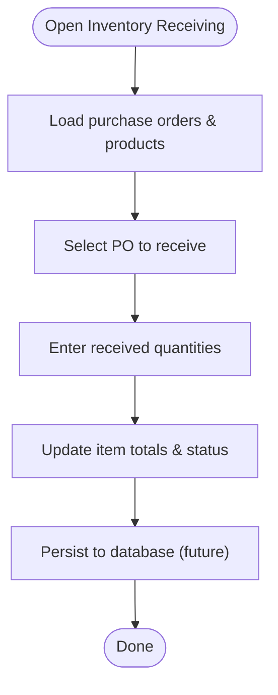
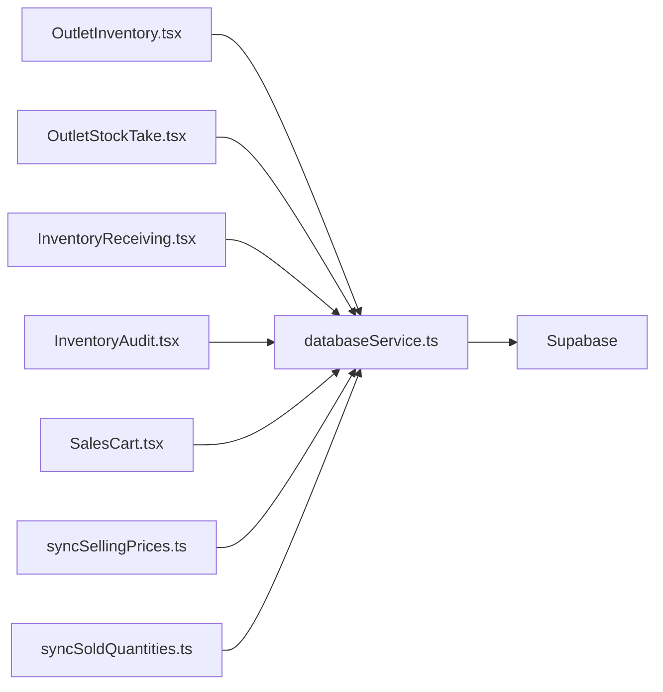

# Stock Control System

<cite>
**Referenced Files in This Document**
- [README.md](file://README.md)
- [20260313_create_inventory_products_table.sql](file://migrations/20260313_create_inventory_products_table.sql)
- [20260313_add_sold_quantity_to_inventory_products.sql](file://migrations/20260313_add_sold_quantity_to_inventory_products.sql)
- [20260313_create_and_populate_inventory_products.sql](file://migrations/20260313_create_and_populate_inventory_products.sql)
- [20260313_add_delivery_inventory_trigger.sql](file://migrations/20260313_add_delivery_inventory_trigger.sql)
- [20260419_fix_inventory_rls_trigger.sql](file://migrations/20260419_fix_inventory_rls_trigger.sql)
- [databaseService.ts](file://src/services/databaseService.ts)
- [syncSellingPrices.ts](file://src/utils/syncSellingPrices.ts)
- [syncSoldQuantities.ts](file://src/utils/syncSoldQuantities.ts)
- [OutletInventory.tsx](file://src/pages/OutletInventory.tsx)
- [OutletStockTake.tsx](file://src/pages/OutletStockTake.tsx)
- [InventoryReceiving.tsx](file://src/pages/InventoryReceiving.tsx)
- [InventoryAudit.tsx](file://src/pages/InventoryAudit.tsx)
- [SalesCart.tsx](file://src/pages/SalesCart.tsx)
- [Settings.tsx](file://src/pages/Settings.tsx)
- [Reports.tsx](file://src/pages/Reports.tsx)
- [OutletReports.tsx](file://src/pages/OutletReports.tsx)
</cite>

## Table of Contents
1. [Introduction](#introduction)
2. [Project Structure](#project-structure)
3. [Core Components](#core-components)
4. [Architecture Overview](#architecture-overview)
5. [Detailed Component Analysis](#detailed-component-analysis)
6. [Dependency Analysis](#dependency-analysis)
7. [Performance Considerations](#performance-considerations)
8. [Troubleshooting Guide](#troubleshooting-guide)
9. [Conclusion](#conclusion)
10. [Appendices](#appendices)

## Introduction
This document describes the stock control system for the Royal POS Modern platform. It covers real-time inventory tracking, stock level management, automated synchronization between sales and inventory, low stock alerts, manual adjustments, audit trails, and practical workflows for receiving, transfers, and adjustments. The system is built around an outlet-centric inventory model with database-backed sold quantity tracking and status calculation.

## Project Structure
The stock control system spans database migrations, backend utilities, and frontend pages:
- Database schema defines outlet-specific inventory with computed availability and status.
- Utilities synchronize selling prices and sold quantities from client-side storage to the database.
- Pages implement inventory views, stock-taking, receiving, auditing, and reporting.

**Diagram sources**
- [20260313_create_inventory_products_table.sql:1-61](file://migrations/20260313_create_inventory_products_table.sql#L1-L61)
- [20260313_add_delivery_inventory_trigger.sql:1-36](file://migrations/20260313_add_delivery_inventory_trigger.sql#L1-L36)
- [20260313_add_sold_quantity_to_inventory_products.sql:1-41](file://migrations/20260313_add_sold_quantity_to_inventory_products.sql#L1-L41)
- [databaseService.ts:129-149](file://src/services/databaseService.ts#L129-L149)
- [OutletInventory.tsx:150-208](file://src/pages/OutletInventory.tsx#L150-L208)
- [OutletStockTake.tsx:52-99](file://src/pages/OutletStockTake.tsx#L52-L99)
- [InventoryReceiving.tsx:1-491](file://src/pages/InventoryReceiving.tsx#L1-L491)
- [InventoryAudit.tsx:1-474](file://src/pages/InventoryAudit.tsx#L1-L474)
- [SalesCart.tsx:793-815](file://src/pages/SalesCart.tsx#L793-L815)
- [Reports.tsx:687-713](file://src/pages/Reports.tsx#L687-L713)
- [OutletReports.tsx:303-321](file://src/pages/OutletReports.tsx#L303-L321)
- [Settings.tsx:173-310](file://src/pages/Settings.tsx#L173-L310)
- [syncSellingPrices.ts:26-99](file://src/utils/syncSellingPrices.ts#L26-L99)
- [syncSoldQuantities.ts:59-124](file://src/utils/syncSoldQuantities.ts#L59-L124)

**Section sources**
- [20260313_create_inventory_products_table.sql:1-61](file://migrations/20260313_create_inventory_products_table.sql#L1-L61)
- [20260313_add_sold_quantity_to_inventory_products.sql:1-41](file://migrations/20260313_add_sold_quantity_to_inventory_products.sql#L1-L41)
- [20260313_create_and_populate_inventory_products.sql:111-158](file://migrations/20260313_create_and_populate_inventory_products.sql#L111-L158)
- [20260313_add_delivery_inventory_trigger.sql:1-36](file://migrations/20260313_add_delivery_inventory_trigger.sql#L1-L36)
- [20260419_fix_inventory_rls_trigger.sql:1-39](file://migrations/20260419_fix_inventory_rls_trigger.sql#L1-L39)

## Core Components
- Outlet inventory table with computed availability and status:
  - Columns include outlet linkage, product identifiers, quantities, min/max stock, costs, selling prices, and status.
  - A trigger automatically sets status based on quantity versus min_stock.
- Sold quantity tracking:
  - Database-backed sold_quantity with a function to increment sold quantities per outlet and product.
- Client-side synchronization utilities:
  - Utilities to sync selling prices and sold quantities from localStorage to the database for persistence and auditability.
- Frontend pages:
  - Real-time inventory view with filters, status badges, and editable selling prices.
  - Stock-taking workflow to reconcile physical counts and update sold quantities.
  - Inventory receiving workflow to process incoming goods.
  - Inventory audit to track discrepancies and resolutions.
  - Sales page to update stock quantities during transactions.
  - Reporting pages to visualize stock status distribution and inventory tables.

**Section sources**
- [20260313_create_inventory_products_table.sql:1-61](file://migrations/20260313_create_inventory_products_table.sql#L1-L61)
- [20260313_add_sold_quantity_to_inventory_products.sql:17-32](file://migrations/20260313_add_sold_quantity_to_inventory_products.sql#L17-L32)
- [databaseService.ts:129-149](file://src/services/databaseService.ts#L129-L149)
- [syncSellingPrices.ts:26-99](file://src/utils/syncSellingPrices.ts#L26-L99)
- [syncSoldQuantities.ts:59-124](file://src/utils/syncSoldQuantities.ts#L59-L124)
- [OutletInventory.tsx:150-208](file://src/pages/OutletInventory.tsx#L150-L208)
- [OutletStockTake.tsx:124-221](file://src/pages/OutletStockTake.tsx#L124-L221)
- [InventoryReceiving.tsx:219-272](file://src/pages/InventoryReceiving.tsx#L219-L272)
- [InventoryAudit.tsx:1-474](file://src/pages/InventoryAudit.tsx#L1-L474)
- [SalesCart.tsx:793-815](file://src/pages/SalesCart.tsx#L793-L815)
- [Reports.tsx:687-713](file://src/pages/Reports.tsx#L687-L713)
- [OutletReports.tsx:303-321](file://src/pages/OutletReports.tsx#L303-L321)

## Architecture Overview
The system architecture centers on Supabase as the backend datastore and React/TypeScript for the frontend. Data flows between the UI and database via service functions and utilities.

**Diagram sources**
- [OutletInventory.tsx:150-208](file://src/pages/OutletInventory.tsx#L150-L208)
- [databaseService.ts:129-149](file://src/services/databaseService.ts#L129-L149)

**Diagram sources**
- [SalesCart.tsx:793-815](file://src/pages/SalesCart.tsx#L793-L815)
- [databaseService.ts:1684-1725](file://src/services/databaseService.ts#L1684-L1725)

**Diagram sources**
- [OutletStockTake.tsx:124-221](file://src/pages/OutletStockTake.tsx#L124-L221)

## Detailed Component Analysis

### Outlet Inventory View
- Displays current stock levels, minimum/maximum thresholds, unit costs/prices, total values, and status badges.
- Supports filtering by category, date range, and search term.
- Provides actions to edit selling prices and view details.
- Status is derived from available_quantity against min_stock.

**Diagram sources**
- [OutletInventory.tsx:56-83](file://src/pages/OutletInventory.tsx#L56-L83)
- [OutletInventory.tsx:150-208](file://src/pages/OutletInventory.tsx#L150-L208)

**Section sources**
- [OutletInventory.tsx:150-208](file://src/pages/OutletInventory.tsx#L150-L208)
- [OutletInventory.tsx:282-293](file://src/pages/OutletInventory.tsx#L282-L293)
- [20260313_create_inventory_products_table.sql:42-61](file://migrations/20260313_create_inventory_products_table.sql#L42-L61)

### Stock Monitoring Interface
- Real-time display of total products, inventory value, retail value, potential earnings, low stock count, out-of-stock count, categories, average turnover, and total deliveries.
- Per-item stock level with progress bars and status badges.
- Filtering by search, category, and date range.

**Section sources**
- [OutletInventory.tsx:470-583](file://src/pages/OutletInventory.tsx#L470-L583)
- [OutletInventory.tsx:674-798](file://src/pages/OutletInventory.tsx#L674-L798)
- [Reports.tsx:687-713](file://src/pages/Reports.tsx#L687-L713)
- [OutletReports.tsx:303-321](file://src/pages/OutletReports.tsx#L303-L321)

### Automatic Stock Quantity Updates During Sales
- On checkout, the system iterates items and updates stock:
  - For outlet sales, increments sold_quantity in inventory_products via a dedicated function.
  - For general sales, updates the product stock directly.
- Parallel updates ensure responsiveness.

**Diagram sources**
- [SalesCart.tsx:793-815](file://src/pages/SalesCart.tsx#L793-L815)
- [databaseService.ts:1684-1725](file://src/services/databaseService.ts#L1684-L1725)

**Section sources**
- [SalesCart.tsx:793-815](file://src/pages/SalesCart.tsx#L793-L815)
- [databaseService.ts:1684-1725](file://src/services/databaseService.ts#L1684-L1725)

### Stock Synchronization Mechanisms
- Sold quantity synchronization:
  - Extract aggregated sold quantities from localStorage and update database sold_quantity per product and outlet.
  - Optional clearing of localStorage entries after successful sync.
- Selling price synchronization:
  - Load saved selling prices from localStorage and update inventory_products selling_price for each product by name.

**Diagram sources**
- [syncSoldQuantities.ts:17-54](file://src/utils/syncSoldQuantities.ts#L17-L54)
- [syncSoldQuantities.ts:59-124](file://src/utils/syncSoldQuantities.ts#L59-L124)
- [syncSellingPrices.ts:10-19](file://src/utils/syncSellingPrices.ts#L10-L19)
- [syncSellingPrices.ts:26-99](file://src/utils/syncSellingPrices.ts#L26-L99)

**Section sources**
- [syncSoldQuantities.ts:59-124](file://src/utils/syncSoldQuantities.ts#L59-L124)
- [syncSoldQuantities.ts:129-162](file://src/utils/syncSoldQuantities.ts#L129-L162)
- [syncSellingPrices.ts:26-99](file://src/utils/syncSellingPrices.ts#L26-L99)

### Low Stock Alert System
- Status is automatically maintained in inventory_products via a trigger that compares quantity to min_stock.
- Users can configure notification preferences in Settings (e.g., low stock alerts).
- Reports pages visualize stock status distribution for quick visibility.

**Section sources**
- [20260313_create_inventory_products_table.sql:42-61](file://migrations/20260313_create_inventory_products_table.sql#L42-L61)
- [Settings.tsx:173-310](file://src/pages/Settings.tsx#L173-L310)
- [OutletReports.tsx:303-321](file://src/pages/OutletReports.tsx#L303-L321)

### Manual Stock Adjustment Capabilities
- Edit selling price per product directly in the outlet inventory view; changes persist to inventory_products.
- Stock-taking workflow allows entering physical counts, computing discrepancies, and saving reconciled sold quantities to the database and a persisted stock-take record.

**Section sources**
- [OutletInventory.tsx:340-377](file://src/pages/OutletInventory.tsx#L340-L377)
- [OutletStockTake.tsx:124-221](file://src/pages/OutletStockTake.tsx#L124-L221)

### Audit Trail for Stock Changes
- Inventory audit page tracks audit sessions, items, variances, reasons, and statuses.
- Stock take records are stored in a dedicated table with computed totals and items snapshot.

**Section sources**
- [InventoryAudit.tsx:1-474](file://src/pages/InventoryAudit.tsx#L1-L474)
- [OutletStockTake.tsx:185-221](file://src/pages/OutletStockTake.tsx#L185-L221)

### Practical Workflows

#### Stock Receiving Workflow
- Load purchase orders and products.
- Open receiving dialog to specify received quantities per item.
- Update totals and status; in a production system, this would also update purchase orders and product stock.

**Diagram sources**
- [InventoryReceiving.tsx:50-122](file://src/pages/InventoryReceiving.tsx#L50-L122)
- [InventoryReceiving.tsx:219-272](file://src/pages/InventoryReceiving.tsx#L219-L272)

**Section sources**
- [InventoryReceiving.tsx:50-122](file://src/pages/InventoryReceiving.tsx#L50-L122)
- [InventoryReceiving.tsx:219-272](file://src/pages/InventoryReceiving.tsx#L219-L272)

#### Stock Transfer Operations
- The system does not expose explicit inter-outlet transfer pages in the provided files. Transfers can be modeled as:
  - Reducing source outlet stock (sold_quantity or direct quantity).
  - Increasing destination outlet stock via delivery or receiving workflows.
- Implementing a formal transfer page would involve:
  - Source outlet selection and item selection.
  - Destination outlet selection.
  - Quantity validation and movement.
  - Audit logging and reverse operations if needed.

[No sources needed since this section proposes a conceptual extension not present in the provided files]

#### Inventory Adjustments
- Use the stock-taking workflow to adjust sold quantities based on physical counts.
- Alternatively, edit selling prices per product in the outlet inventory view to align revenue metrics.

**Section sources**
- [OutletStockTake.tsx:124-221](file://src/pages/OutletStockTake.tsx#L124-L221)
- [OutletInventory.tsx:340-377](file://src/pages/OutletInventory.tsx#L340-L377)

### Stock Discrepancy Resolution
- The audit page supports recording reasons and statuses for discrepancies.
- Stock take workflow computes discrepancies and allows saving reconciled data.

**Section sources**
- [InventoryAudit.tsx:1-474](file://src/pages/InventoryAudit.tsx#L1-L474)
- [OutletStockTake.tsx:223-246](file://src/pages/OutletStockTake.tsx#L223-L246)

### Batch Management and Expiry Tracking
- The provided schema and pages do not include batch numbers or expiry dates for inventory items.
- To implement batch/expiration tracking:
  - Extend inventory_products with batch and expiry fields.
  - Update receiving and stock-taking workflows to capture and reconcile batches.
  - Add UI components to manage and filter by batch/expiry.

[No sources needed since this section proposes a conceptual enhancement not present in the provided files]

### Guidance for Optimal Stock Levels and Accuracy
- Set min_stock and max_stock based on historical consumption and lead times.
- Use stock-taking to reconcile discrepancies and update sold_quantity regularly.
- Monitor low stock alerts and review reports to optimize reorder points.
- Maintain accurate selling prices to reflect proper margins and avoid revenue misstatements.

**Section sources**
- [20260313_create_inventory_products_table.sql:8-19](file://migrations/20260313_create_inventory_products_table.sql#L8-L19)
- [OutletReports.tsx:303-321](file://src/pages/OutletReports.tsx#L303-L321)
- [Settings.tsx:173-310](file://src/pages/Settings.tsx#L173-L310)

## Dependency Analysis
- Outlet inventory depends on:
  - databaseService for fetching inventory and updating prices.
  - Supabase for persistent storage and triggers.
- Stock-taking depends on:
  - databaseService for retrieving inventory and updating sold quantities.
  - localStorage for temporary physical counts persistence.
- Sales depend on:
  - databaseService for updating sold quantities or product stock.
- Utilities depend on:
  - Supabase client for database operations.

**Diagram sources**
- [OutletInventory.tsx:150-208](file://src/pages/OutletInventory.tsx#L150-L208)
- [OutletStockTake.tsx:52-99](file://src/pages/OutletStockTake.tsx#L52-L99)
- [InventoryReceiving.tsx:1-491](file://src/pages/InventoryReceiving.tsx#L1-L491)
- [InventoryAudit.tsx:1-474](file://src/pages/InventoryAudit.tsx#L1-L474)
- [SalesCart.tsx:793-815](file://src/pages/SalesCart.tsx#L793-L815)
- [syncSellingPrices.ts:26-99](file://src/utils/syncSellingPrices.ts#L26-L99)
- [syncSoldQuantities.ts:59-124](file://src/utils/syncSoldQuantities.ts#L59-L124)
- [databaseService.ts:129-149](file://src/services/databaseService.ts#L129-L149)

**Section sources**
- [databaseService.ts:129-149](file://src/services/databaseService.ts#L129-L149)
- [syncSellingPrices.ts:26-99](file://src/utils/syncSellingPrices.ts#L26-L99)
- [syncSoldQuantities.ts:59-124](file://src/utils/syncSoldQuantities.ts#L59-L124)

## Performance Considerations
- Database indexes on outlet_id, category, status, and SKU improve query performance for inventory lists and filters.
- Computed available_quantity reduces runtime calculations and improves rendering performance.
- Trigger-based status updates occur on insert/update, minimizing UI logic complexity.
- Parallel stock updates during sales enhance responsiveness.

**Section sources**
- [20260313_create_inventory_products_table.sql:26-30](file://migrations/20260313_create_inventory_products_table.sql#L26-L30)
- [20260313_create_inventory_products.sql:111-158](file://migrations/20260313_create_and_populate_inventory_products.sql#L111-L158)

## Troubleshooting Guide
- Low stock alerts not triggering:
  - Verify min_stock values and that the status trigger is active.
- Sold quantities not updating:
  - Confirm outletId is set and incrementSoldQuantity is called; check database permissions and RLS policies.
- Selling price edits not persisting:
  - Ensure sync utilities are invoked or database updates are executed.
- Stock discrepancies:
  - Use stock-taking to compute and reconcile discrepancies; review audit logs for resolution status.

**Section sources**
- [20260313_create_inventory_products_table.sql:42-61](file://migrations/20260313_create_inventory_products_table.sql#L42-L61)
- [20260419_fix_inventory_rls_trigger.sql:1-39](file://migrations/20260419_fix_inventory_rls_trigger.sql#L1-L39)
- [syncSellingPrices.ts:26-99](file://src/utils/syncSellingPrices.ts#L26-L99)
- [OutletStockTake.tsx:124-221](file://src/pages/OutletStockTake.tsx#L124-L221)
- [InventoryAudit.tsx:1-474](file://src/pages/InventoryAudit.tsx#L1-L474)

## Conclusion
The stock control system provides robust, outlet-centric inventory management with real-time status tracking, automated sold quantity updates during sales, and utilities to synchronize client-side changes to the database. The architecture supports scalability, auditability, and operational insights through reporting and stock-taking workflows.

## Appendices

### Database Schema Highlights
- inventory_products:
  - outlet_id links to outlets.
  - quantity, min_stock, max_stock define thresholds.
  - unit_cost, selling_price enable valuation and profit tracking.
  - status is computed via trigger based on quantity and min_stock.
  - available_quantity is computed as quantity - sold_quantity.

**Section sources**
- [20260313_create_inventory_products_table.sql:1-61](file://migrations/20260313_create_inventory_products_table.sql#L1-L61)

### Trigger and Function References
- Delivery-triggered population and updates:
  - Trigger function updates inventory when delivery status becomes delivered.
  - RLS-compliant function definition ensures policy bypass for inventory updates.

**Section sources**
- [20260313_add_delivery_inventory_trigger.sql:1-36](file://migrations/20260313_add_delivery_inventory_trigger.sql#L1-L36)
- [20260419_fix_inventory_rls_trigger.sql:1-39](file://migrations/20260419_fix_inventory_rls_trigger.sql#L1-L39)