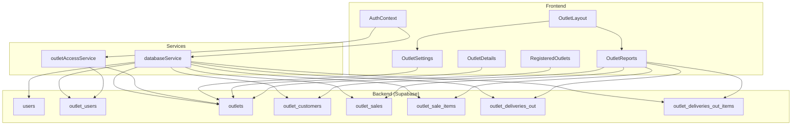
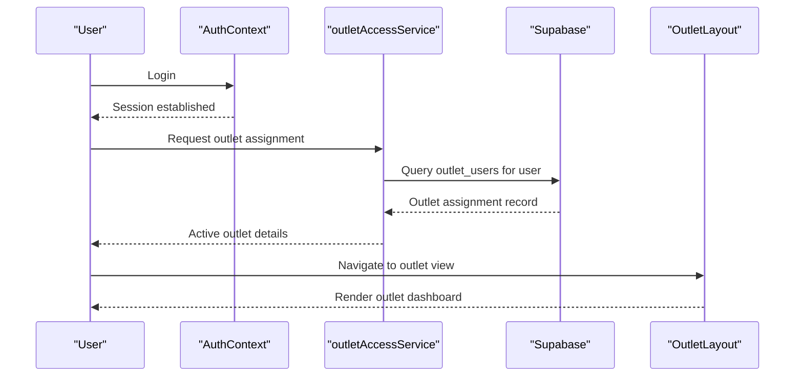
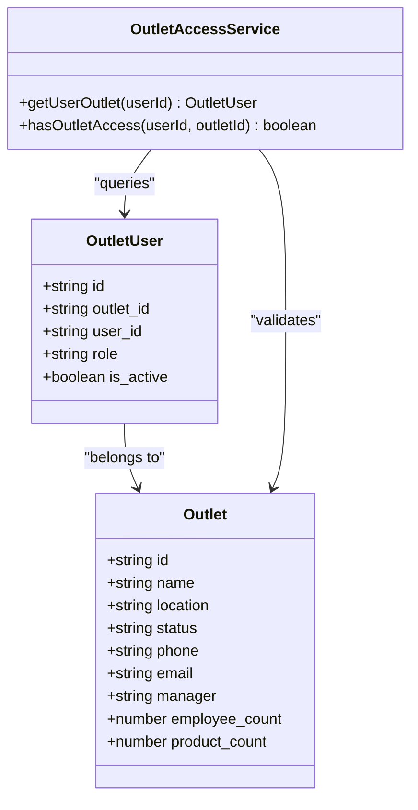
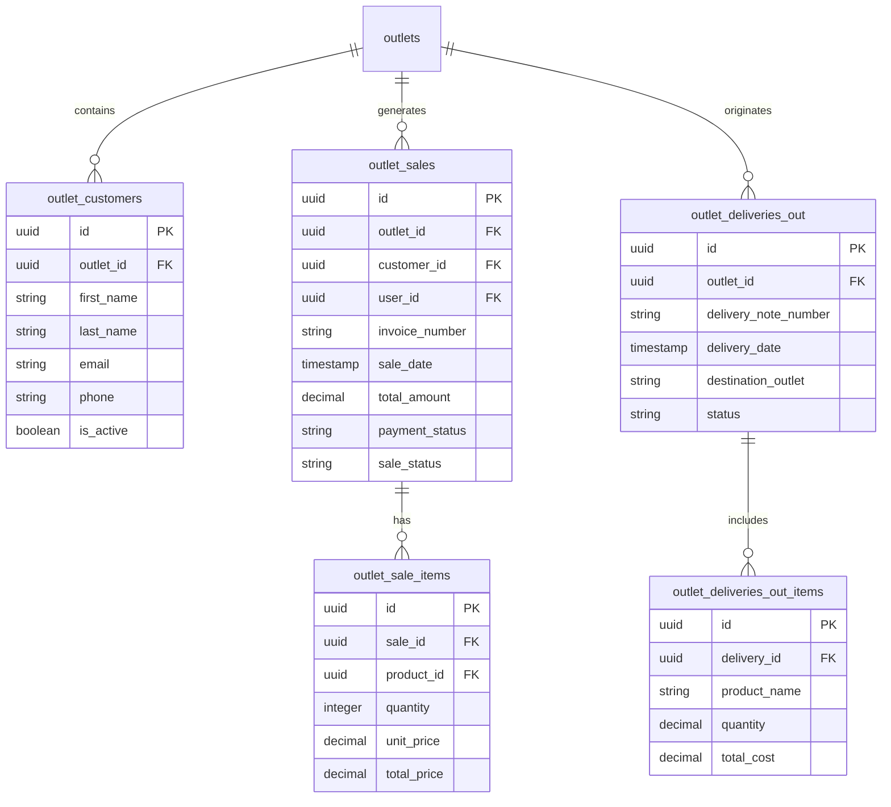
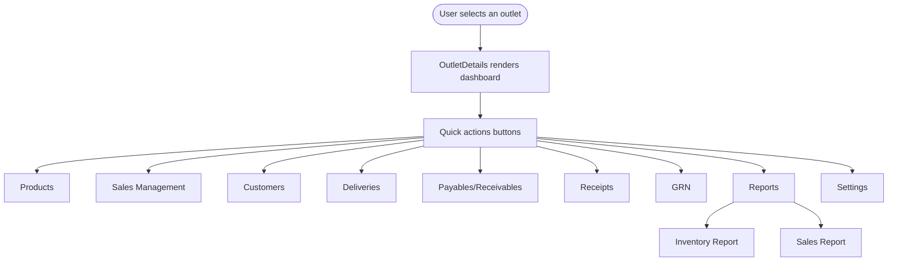
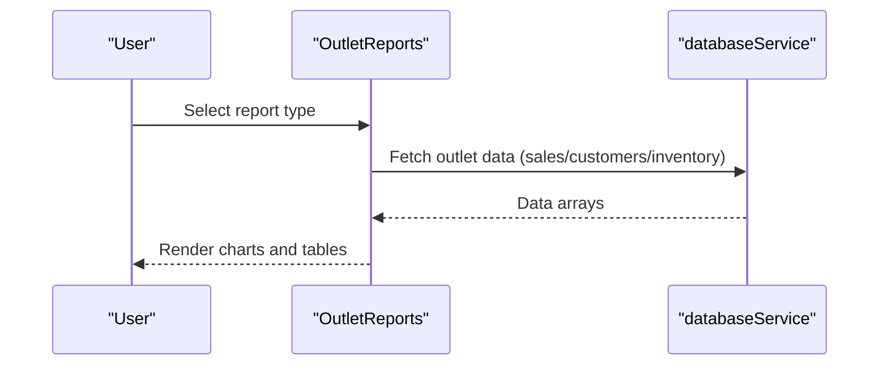
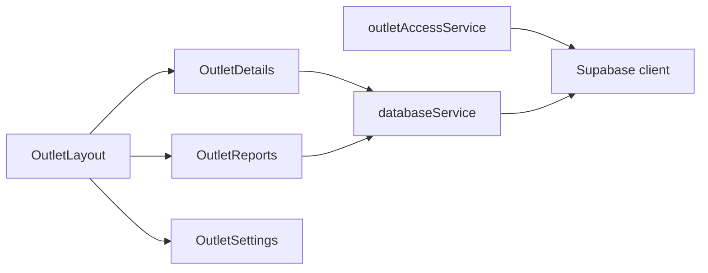

# Multi-Location Management

<cite>
**Referenced Files in This Document**
- [outletAccessService.ts](file://src/services/outletAccessService.ts)
- [AuthContext.tsx](file://src/contexts/AuthContext.tsx)
- [OutletLayout.tsx](file://src/components/OutletLayout.tsx)
- [RegisteredOutlets.tsx](file://src/pages/RegisteredOutlets.tsx)
- [OutletDetails.tsx](file://src/pages/OutletDetails.tsx)
- [OutletSettings.tsx](file://src/pages/OutletSettings.tsx)
- [OutletReports.tsx](file://src/pages/OutletReports.tsx)
- [databaseService.ts](file://src/services/databaseService.ts)
- [20260220_create_outlets_table.sql](file://migrations/20260220_create_outlets_table.sql)
- [20260419_create_outlet_users_table.sql](file://migrations/20260419_create_outlet_users_table.sql)
- [20260313_create_outlet_customers_table.sql](file://migrations/20260313_create_outlet_customers_table.sql)
- [20260313_create_outlet_sales_table.sql](file://migrations/20260313_create_outlet_sales_table.sql)
- [20260419_create_outlet_deliveries_out_table.sql](file://migrations/20260419_create_outlet_deliveries_out_table.sql)
- [assign_outlet_manager.sql](file://scripts/assign_outlet_manager.sql)
- [check_outlet_assignment.sql](file://scripts/check_outlet_assignment.sql)
</cite>

## Table of Contents
1. [Introduction](#introduction)
2. [Project Structure](#project-structure)
3. [Core Components](#core-components)
4. [Architecture Overview](#architecture-overview)
5. [Detailed Component Analysis](#detailed-component-analysis)
6. [Dependency Analysis](#dependency-analysis)
7. [Performance Considerations](#performance-considerations)
8. [Troubleshooting Guide](#troubleshooting-guide)
9. [Conclusion](#conclusion)
10. [Appendices](#appendices)

## Introduction
This document explains the multi-location management architecture of Royal POS Modern. It covers how the system models multiple business locations (outlets), isolates outlet-specific data, controls access per user and outlet, and enables seamless navigation between locations. It also documents reporting and analytics capabilities, practical setup examples, and operational guidance for data consistency and performance.

## Project Structure
Royal POS Modern organizes multi-location features around:
- Centralized user authentication and session management
- Outlet registry and user-to-outlet assignments
- Outlet-scoped data models (customers, sales, deliveries)
- UI layouts and pages for outlet dashboards, settings, and reports
- Database migrations defining outlet tables and row-level security (RLS)

**Diagram sources**
- [AuthContext.tsx:1-118](file://src/contexts/AuthContext.tsx#L1-L118)
- [OutletLayout.tsx:1-330](file://src/components/OutletLayout.tsx#L1-L330)
- [RegisteredOutlets.tsx:1-460](file://src/pages/RegisteredOutlets.tsx#L1-L460)
- [OutletDetails.tsx:1-640](file://src/pages/OutletDetails.tsx#L1-L640)
- [OutletSettings.tsx:1-292](file://src/pages/OutletSettings.tsx#L1-L292)
- [OutletReports.tsx:1-800](file://src/pages/OutletReports.tsx#L1-L800)
- [databaseService.ts:1-800](file://src/services/databaseService.ts#L1-L800)
- [outletAccessService.ts:1-98](file://src/services/outletAccessService.ts#L1-L98)
- [20260220_create_outlets_table.sql:1-33](file://migrations/20260220_create_outlets_table.sql#L1-L33)
- [20260419_create_outlet_users_table.sql:1-40](file://migrations/20260419_create_outlet_users_table.sql#L1-L40)
- [20260313_create_outlet_customers_table.sql:1-53](file://migrations/20260313_create_outlet_customers_table.sql#L1-L53)
- [20260313_create_outlet_sales_table.sql:1-94](file://migrations/20260313_create_outlet_sales_table.sql#L1-L94)
- [20260419_create_outlet_deliveries_out_table.sql:1-110](file://migrations/20260419_create_outlet_deliveries_out_table.sql#L1-L110)

**Section sources**
- [AuthContext.tsx:1-118](file://src/contexts/AuthContext.tsx#L1-L118)
- [OutletLayout.tsx:1-330](file://src/components/OutletLayout.tsx#L1-L330)
- [RegisteredOutlets.tsx:1-460](file://src/pages/RegisteredOutlets.tsx#L1-L460)
- [OutletDetails.tsx:1-640](file://src/pages/OutletDetails.tsx#L1-L640)
- [OutletSettings.tsx:1-292](file://src/pages/OutletSettings.tsx#L1-L292)
- [OutletReports.tsx:1-800](file://src/pages/OutletReports.tsx#L1-L800)
- [databaseService.ts:1-800](file://src/services/databaseService.ts#L1-L800)
- [outletAccessService.ts:1-98](file://src/services/outletAccessService.ts#L1-L98)
- [20260220_create_outlets_table.sql:1-33](file://migrations/20260220_create_outlets_table.sql#L1-L33)
- [20260419_create_outlet_users_table.sql:1-40](file://migrations/20260419_create_outlet_users_table.sql#L1-L40)
- [20260313_create_outlet_customers_table.sql:1-53](file://migrations/20260313_create_outlet_customers_table.sql#L1-L53)
- [20260313_create_outlet_sales_table.sql:1-94](file://migrations/20260313_create_outlet_sales_table.sql#L1-L94)
- [20260419_create_outlet_deliveries_out_table.sql:1-110](file://migrations/20260419_create_outlet_deliveries_out_table.sql#L1-L110)

## Core Components
- Authentication and session lifecycle managed centrally via the authentication context.
- Outlet registry defines business locations with status, contact, and operational attributes.
- User-to-outlet assignment table governs access and roles per location.
- Outlet-scoped data models isolate customers, sales, sale items, and deliveries by outlet.
- UI components provide outlet dashboards, settings, and reporting with navigation and filtering.

Key implementation references:
- [AuthContext.tsx:1-118](file://src/contexts/AuthContext.tsx#L1-L118)
- [20260220_create_outlets_table.sql:1-33](file://migrations/20260220_create_outlets_table.sql#L1-L33)
- [20260419_create_outlet_users_table.sql:1-40](file://migrations/20260419_create_outlet_users_table.sql#L1-L40)
- [20260313_create_outlet_customers_table.sql:1-53](file://migrations/20260313_create_outlet_customers_table.sql#L1-L53)
- [20260313_create_outlet_sales_table.sql:1-94](file://migrations/20260313_create_outlet_sales_table.sql#L1-L94)
- [20260419_create_outlet_deliveries_out_table.sql:1-110](file://migrations/20260419_create_outlet_deliveries_out_table.sql#L1-L110)

**Section sources**
- [AuthContext.tsx:1-118](file://src/contexts/AuthContext.tsx#L1-L118)
- [20260220_create_outlets_table.sql:1-33](file://migrations/20260220_create_outlets_table.sql#L1-L33)
- [20260419_create_outlet_users_table.sql:1-40](file://migrations/20260419_create_outlet_users_table.sql#L1-L40)
- [20260313_create_outlet_customers_table.sql:1-53](file://migrations/20260313_create_outlet_customers_table.sql#L1-L53)
- [20260313_create_outlet_sales_table.sql:1-94](file://migrations/20260313_create_outlet_sales_table.sql#L1-L94)
- [20260419_create_outlet_deliveries_out_table.sql:1-110](file://migrations/20260419_create_outlet_deliveries_out_table.sql#L1-L110)

## Architecture Overview
The multi-location architecture centers on:
- Centralized authentication and session management
- Outlet registry and user-role assignments
- Outlet-scoped data models with RLS policies
- Outlet dashboard layout and navigation
- Reporting and analytics scoped to a selected outlet

**Diagram sources**
- [AuthContext.tsx:1-118](file://src/contexts/AuthContext.tsx#L1-L118)
- [outletAccessService.ts:1-98](file://src/services/outletAccessService.ts#L1-L98)
- [OutletLayout.tsx:1-330](file://src/components/OutletLayout.tsx#L1-L330)

**Section sources**
- [AuthContext.tsx:1-118](file://src/contexts/AuthContext.tsx#L1-L118)
- [outletAccessService.ts:1-98](file://src/services/outletAccessService.ts#L1-L98)
- [OutletLayout.tsx:1-330](file://src/components/OutletLayout.tsx#L1-L330)

## Detailed Component Analysis

### Outlet Registry and Access Control
- Outlets are defined in the outlets table with attributes such as name, location, status, and contact info.
- User-to-outlet assignments are governed by outlet_users with roles (manager, cashier, staff, admin) and activation state.
- Access checks are performed via dedicated service functions to validate user access to a given outlet.

**Diagram sources**
- [20260220_create_outlets_table.sql:1-33](file://migrations/20260220_create_outlets_table.sql#L1-L33)
- [20260419_create_outlet_users_table.sql:1-40](file://migrations/20260419_create_outlet_users_table.sql#L1-L40)
- [outletAccessService.ts:1-98](file://src/services/outletAccessService.ts#L1-L98)

**Section sources**
- [20260220_create_outlets_table.sql:1-33](file://migrations/20260220_create_outlets_table.sql#L1-L33)
- [20260419_create_outlet_users_table.sql:1-40](file://migrations/20260419_create_outlet_users_table.sql#L1-L40)
- [outletAccessService.ts:1-98](file://src/services/outletAccessService.ts#L1-L98)

### Outlet-Specific Data Models
- outlet_customers: Outlet-scoped customer records with isolation from general system customers.
- outlet_sales and outlet_sale_items: Outlet-scoped sales and line items with payment and status tracking.
- outlet_deliveries_out and outlet_deliveries_out_items: Tracking of outgoing deliveries from an outlet to other branches.

**Diagram sources**
- [20260313_create_outlet_customers_table.sql:1-53](file://migrations/20260313_create_outlet_customers_table.sql#L1-L53)
- [20260313_create_outlet_sales_table.sql:1-94](file://migrations/20260313_create_outlet_sales_table.sql#L1-L94)
- [20260419_create_outlet_deliveries_out_table.sql:1-110](file://migrations/20260419_create_outlet_deliveries_out_table.sql#L1-L110)

**Section sources**
- [20260313_create_outlet_customers_table.sql:1-53](file://migrations/20260313_create_outlet_customers_table.sql#L1-L53)
- [20260313_create_outlet_sales_table.sql:1-94](file://migrations/20260313_create_outlet_sales_table.sql#L1-L94)
- [20260419_create_outlet_deliveries_out_table.sql:1-110](file://migrations/20260419_create_outlet_deliveries_out_table.sql#L1-L110)

### Outlet Pages and Navigation
- RegisteredOutlets: Lists all outlets, allows adding/editing/deleting, and navigates to outlet details.
- OutletDetails: Provides dashboard views, quick actions, alerts, and performance metrics for a selected outlet.
- OutletSettings: Allows configuring outlet-specific settings such as operating hours, tax rate, and features.
- OutletReports: Loads and displays outlet-scoped reports (inventory, sales, payments, deliveries, receipts, GRN).

**Diagram sources**
- [RegisteredOutlets.tsx:1-460](file://src/pages/RegisteredOutlets.tsx#L1-L460)
- [OutletDetails.tsx:1-640](file://src/pages/OutletDetails.tsx#L1-L640)
- [OutletSettings.tsx:1-292](file://src/pages/OutletSettings.tsx#L1-L292)
- [OutletReports.tsx:1-800](file://src/pages/OutletReports.tsx#L1-L800)

**Section sources**
- [RegisteredOutlets.tsx:1-460](file://src/pages/RegisteredOutlets.tsx#L1-L460)
- [OutletDetails.tsx:1-640](file://src/pages/OutletDetails.tsx#L1-L640)
- [OutletSettings.tsx:1-292](file://src/pages/OutletSettings.tsx#L1-L292)
- [OutletReports.tsx:1-800](file://src/pages/OutletReports.tsx#L1-L800)

### Outlet Reports and Analytics
- Inventory Report: Shows counts, values, categories, stock status distribution, and low-stock alerts.
- Sales Report: Aggregates revenue, transactions, and product performance over a selected date range.
- Additional reports (Payments, Deliveries, Receipts, GRN) are available via report cards.

**Diagram sources**
- [OutletReports.tsx:1-800](file://src/pages/OutletReports.tsx#L1-L800)
- [databaseService.ts:1-800](file://src/services/databaseService.ts#L1-L800)

**Section sources**
- [OutletReports.tsx:1-800](file://src/pages/OutletReports.tsx#L1-L800)
- [databaseService.ts:1-800](file://src/services/databaseService.ts#L1-L800)

### Practical Setup Examples
- Adding a new outlet:
  - Use the outlet registration page to create a new outlet entry with name, location, contact, and status.
  - Reference: [RegisteredOutlets.tsx:89-124](file://src/pages/RegisteredOutlets.tsx#L89-L124)
- Assigning an outlet manager:
  - Use the outlet user assignment table to link a user to an outlet with role and activation.
  - Reference: [20260419_create_outlet_users_table.sql:1-40](file://migrations/20260419_create_outlet_users_table.sql#L1-L40)
  - Example script: [assign_outlet_manager.sql:1-43](file://scripts/assign_outlet_manager.sql#L1-L43)
- Checking assignments:
  - Query outlet assignments and user metadata to verify roles and outlet linkage.
  - Reference: [check_outlet_assignment.sql:1-61](file://scripts/check_outlet_assignment.sql#L1-L61)

**Section sources**
- [RegisteredOutlets.tsx:89-124](file://src/pages/RegisteredOutlets.tsx#L89-L124)
- [20260419_create_outlet_users_table.sql:1-40](file://migrations/20260419_create_outlet_users_table.sql#L1-L40)
- [assign_outlet_manager.sql:1-43](file://scripts/assign_outlet_manager.sql#L1-L43)
- [check_outlet_assignment.sql:1-61](file://scripts/check_outlet_assignment.sql#L1-L61)

## Dependency Analysis
- OutletLayout depends on outletId and outletName to build navigation and quick actions.
- OutletDetails and OutletReports depend on databaseService functions to fetch outlet-scoped data.
- outletAccessService depends on Supabase to validate user outlet access and roles.
- databaseService defines outlet-related interfaces and provides typed accessors for outlet data.

**Diagram sources**
- [OutletLayout.tsx:1-330](file://src/components/OutletLayout.tsx#L1-L330)
- [OutletDetails.tsx:1-640](file://src/pages/OutletDetails.tsx#L1-L640)
- [OutletReports.tsx:1-800](file://src/pages/OutletReports.tsx#L1-L800)
- [outletAccessService.ts:1-98](file://src/services/outletAccessService.ts#L1-L98)
- [databaseService.ts:1-800](file://src/services/databaseService.ts#L1-L800)

**Section sources**
- [OutletLayout.tsx:1-330](file://src/components/OutletLayout.tsx#L1-L330)
- [OutletDetails.tsx:1-640](file://src/pages/OutletDetails.tsx#L1-L640)
- [OutletReports.tsx:1-800](file://src/pages/OutletReports.tsx#L1-L800)
- [outletAccessService.ts:1-98](file://src/services/outletAccessService.ts#L1-L98)
- [databaseService.ts:1-800](file://src/services/databaseService.ts#L1-L800)

## Performance Considerations
- Database indexing:
  - Outlets: status, city, manager
  - Outlet users: outlet_id, user_id, role, is_active
  - Outlet sales: outlet_id, customer_id, sale_date, payment_method, invoice_number
  - Outlet sale items: sale_id, product_id
  - Outgoing deliveries: outlet_id, status, delivery_date, destination
- RLS policies:
  - Enforce row-level access for outlet-scoped tables to prevent cross-outlet data leakage.
- UI data loading:
  - Reports pages fetch data progressively; consider pagination and date-range filters to reduce payload sizes.
- Navigation:
  - Hash-based routing minimizes server round trips during outlet switching.

[No sources needed since this section provides general guidance]

## Troubleshooting Guide
Common issues and resolutions:
- User cannot access a specific outlet:
  - Verify outlet assignment and active status in outlet_users.
  - Confirm user role allows access to the outlet.
  - References: [outletAccessService.ts:78-97](file://src/services/outletAccessService.ts#L78-L97), [20260419_create_outlet_users_table.sql:1-40](file://migrations/20260419_create_outlet_users_table.sql#L1-L40)
- Outlet manager assignment errors:
  - Use the assignment script to link user and outlet with proper UUIDs.
  - References: [assign_outlet_manager.sql:1-43](file://scripts/assign_outlet_manager.sql#L1-L43)
- Verifying assignments:
  - Cross-check outlet manager field, outlet_users entries, and user metadata.
  - References: [check_outlet_assignment.sql:1-61](file://scripts/check_outlet_assignment.sql#L1-L61)
- Data consistency in reports:
  - Ensure outlet_id is correctly set on outlet_sales and outlet_sale_items.
  - Validate RLS policies for outlet-delimited tables.
  - References: [20260313_create_outlet_sales_table.sql:1-94](file://migrations/20260313_create_outlet_sales_table.sql#L1-L94), [20260419_create_outlet_deliveries_out_table.sql:1-110](file://migrations/20260419_create_outlet_deliveries_out_table.sql#L1-L110)

**Section sources**
- [outletAccessService.ts:78-97](file://src/services/outletAccessService.ts#L78-L97)
- [20260419_create_outlet_users_table.sql:1-40](file://migrations/20260419_create_outlet_users_table.sql#L1-L40)
- [assign_outlet_manager.sql:1-43](file://scripts/assign_outlet_manager.sql#L1-L43)
- [check_outlet_assignment.sql:1-61](file://scripts/check_outlet_assignment.sql#L1-L61)
- [20260313_create_outlet_sales_table.sql:1-94](file://migrations/20260313_create_outlet_sales_table.sql#L1-L94)
- [20260419_create_outlet_deliveries_out_table.sql:1-110](file://migrations/20260419_create_outlet_deliveries_out_table.sql#L1-L110)

## Conclusion
Royal POS Modern’s multi-location design leverages a centralized authentication system, a dedicated outlet registry, and outlet-scoped data models protected by RLS. The UI provides intuitive navigation, settings, and robust reporting per outlet. Proper assignment of users to outlets and adherence to RLS policies ensure secure, isolated, and scalable multi-location operations.

[No sources needed since this section summarizes without analyzing specific files]

## Appendices
- Data model interfaces and service functions are defined in the database service module.
- Migration scripts establish outlet tables, indexes, and RLS policies.
- Scripts assist with assigning managers and diagnosing outlet-user relationships.

**Section sources**
- [databaseService.ts:1-800](file://src/services/databaseService.ts#L1-L800)
- [20260220_create_outlets_table.sql:1-33](file://migrations/20260220_create_outlets_table.sql#L1-L33)
- [20260419_create_outlet_users_table.sql:1-40](file://migrations/20260419_create_outlet_users_table.sql#L1-L40)
- [20260313_create_outlet_customers_table.sql:1-53](file://migrations/20260313_create_outlet_customers_table.sql#L1-L53)
- [20260313_create_outlet_sales_table.sql:1-94](file://migrations/20260313_create_outlet_sales_table.sql#L1-L94)
- [20260419_create_outlet_deliveries_out_table.sql:1-110](file://migrations/20260419_create_outlet_deliveries_out_table.sql#L1-L110)
- [assign_outlet_manager.sql:1-43](file://scripts/assign_outlet_manager.sql#L1-L43)
- [check_outlet_assignment.sql:1-61](file://scripts/check_outlet_assignment.sql#L1-L61)