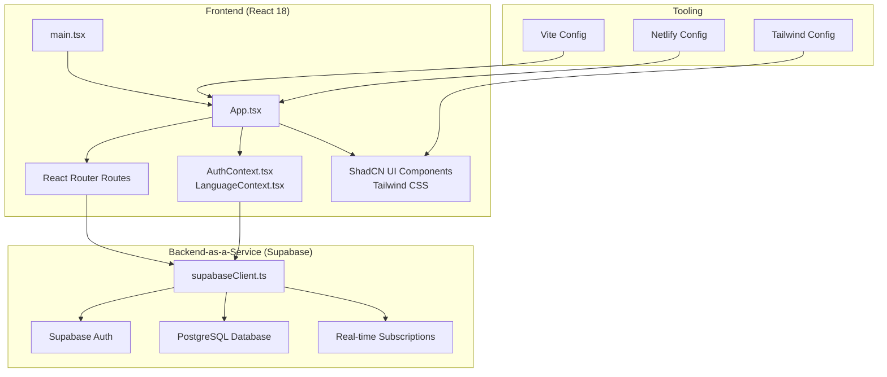
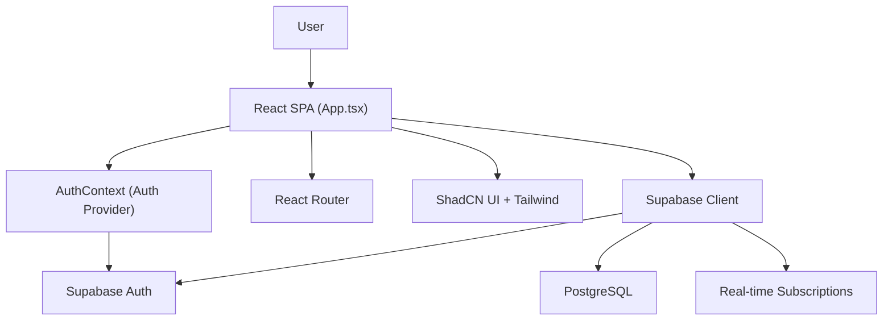
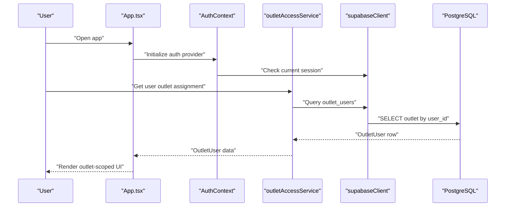
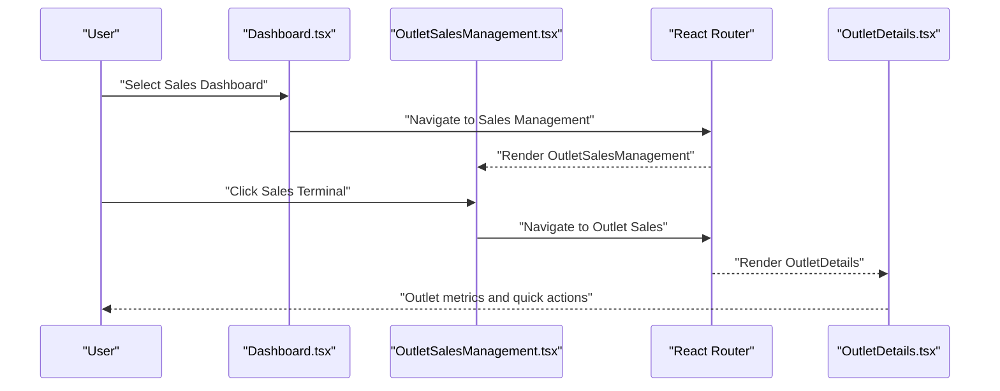
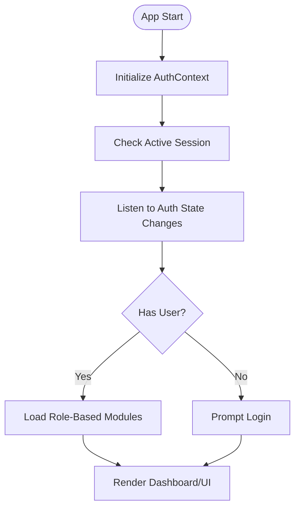
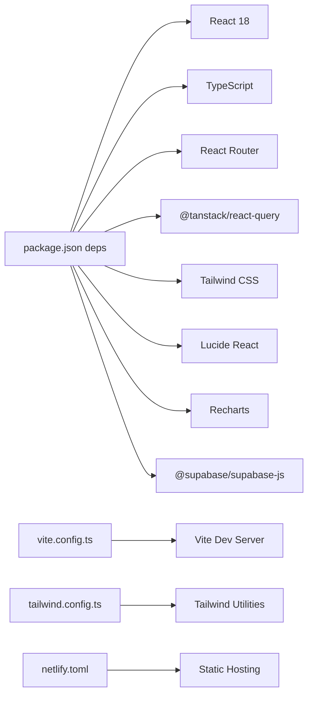

# Project Overview

<cite>
**Referenced Files in This Document**
- [README.md](file://README.md)
- [package.json](file://package.json)
- [src\App.tsx](file://src\App.tsx)
- [src\main.tsx](file://src\main.tsx)
- [src\lib\supabaseClient.ts](file://src\lib\supabaseClient.ts)
- [src\contexts\AuthContext.tsx](file://src\contexts\AuthContext.tsx)
- [src\services\outletAccessService.ts](file://src\services\outletAccessService.ts)
- [src\pages\Dashboard.tsx](file://src\pages\Dashboard.tsx)
- [src\pages\OutletDetails.tsx](file://src\pages\OutletDetails.tsx)
- [src\pages\OutletSalesManagement.tsx](file://src\pages\OutletSalesManagement.tsx)
- [tailwind.config.ts](file://tailwind.config.ts)
- [vite.config.ts](file://vite.config.ts)
- [netlify.toml](file://netlify.toml)
- [src\hooks\use-mobile.tsx](file://src\hooks\use-mobile.tsx)
</cite>

## Table of Contents
1. [Introduction](#introduction)
2. [Project Structure](#project-structure)
3. [Core Components](#core-components)
4. [Architecture Overview](#architecture-overview)
5. [Detailed Component Analysis](#detailed-component-analysis)
6. [Dependency Analysis](#dependency-analysis)
7. [Performance Considerations](#performance-considerations)
8. [Troubleshooting Guide](#troubleshooting-guide)
9. [Conclusion](#conclusion)

## Introduction
Royal POS Modern is a comprehensive Point of Sale (POS) solution tailored for Tanzanian retail businesses. Its purpose is to streamline daily operations by unifying sales, inventory, customers, suppliers, and financial reporting into a single, cloud-native platform. The system’s core value proposition lies in enabling multi-location retail chains to operate cohesively while maintaining real-time visibility and control across outlets. It targets owners, managers, cashiers, and administrators who require a reliable, scalable, and secure POS system that integrates seamlessly with modern web technologies.

Typical business scenarios include:
- Managing multiple store locations with centralized oversight and localized operations
- Processing sales with customer selection, discounts, and multiple payment methods
- Tracking inventory in real time with low stock alerts and audit capabilities
- Managing customer and supplier relationships with debt and settlement workflows
- Generating financial reports and analytics for informed decision-making
- Enforcing role-based access control to ensure authorized sales and secure operations

## Project Structure
The project follows a modern frontend architecture with a React 18 application, TypeScript for type safety, and Supabase for backend-as-a-service (authentication, database, and real-time features). The build tooling leverages Vite, and the UI is styled with Tailwind CSS and ShadCN UI components. Routing is handled by React Router, and data synchronization is powered by React Query.

**Diagram sources**
- [src\App.tsx:73-127](file://src\App.tsx#L73-L127)
- [src\main.tsx:1-39](file://src\main.tsx#L1-L39)
- [src\lib\supabaseClient.ts:1-33](file://src\lib\supabaseClient.ts#L1-L33)
- [src\contexts\AuthContext.tsx:1-118](file://src\contexts\AuthContext.tsx#L1-L118)
- [tailwind.config.ts:1-118](file://tailwind.config.ts#L1-L118)
- [vite.config.ts:1-33](file://vite.config.ts#L1-L33)
- [netlify.toml:1-26](file://netlify.toml#L1-L26)

**Section sources**
- [README.md:166-179](file://README.md#L166-L179)
- [package.json:1-95](file://package.json#L1-L95)
- [src\App.tsx:1-130](file://src\App.tsx#L1-L130)
- [src\main.tsx:1-39](file://src\main.tsx#L1-L39)
- [tailwind.config.ts:1-118](file://tailwind.config.ts#L1-L118)
- [vite.config.ts:1-33](file://vite.config.ts#L1-L33)
- [netlify.toml:1-26](file://netlify.toml#L1-L26)

## Core Components
- Authentication and session management via Supabase Auth, exposed through a React context provider
- Supabase client initialization and environment variable validation
- Multi-location architecture with outlet-aware services and routing
- Role-based access control for sales and module permissions
- Real-time connectivity and reactive UI updates through Supabase and React Query
- Mobile-first responsive design with device-optimized interactions

Practical examples:
- Logging in to access the dashboard and navigate to modules based on role
- Selecting an outlet to view localized metrics and perform outlet-specific tasks
- Creating sales and accessing saved invoices, orders, and deliveries
- Monitoring low stock alerts and managing inventory adjustments

**Section sources**
- [src\contexts\AuthContext.tsx:1-118](file://src\contexts\AuthContext.tsx#L1-L118)
- [src\lib\supabaseClient.ts:1-33](file://src\lib\supabaseClient.ts#L1-L33)
- [src\services\outletAccessService.ts:1-98](file://src\services\outletAccessService.ts#L1-L98)
- [src\pages\Dashboard.tsx:1-215](file://src\pages\Dashboard.tsx#L1-L215)
- [src\pages\OutletDetails.tsx:1-640](file://src\pages\OutletDetails.tsx#L1-L640)
- [src\pages\OutletSalesManagement.tsx:1-109](file://src\pages\OutletSalesManagement.tsx#L1-L109)

## Architecture Overview
The system architecture centers on a React SPA with Supabase as the backend. The frontend initializes Supabase, manages authentication state, and orchestrates navigation and data flows. Supabase handles authentication, database operations, and real-time subscriptions. The build pipeline uses Vite, and deployment is optimized for static hosting platforms.

**Diagram sources**
- [src\App.tsx:32-127](file://src\App.tsx#L32-L127)
- [src\contexts\AuthContext.tsx:16-110](file://src\contexts\AuthContext.tsx#L16-L110)
- [src\lib\supabaseClient.ts:1-33](file://src\lib\supabaseClient.ts#L1-L33)

**Section sources**
- [src\App.tsx:32-127](file://src\App.tsx#L32-L127)
- [src\contexts\AuthContext.tsx:16-110](file://src\contexts\AuthContext.tsx#L16-L110)
- [src\lib\supabaseClient.ts:1-33](file://src\lib\supabaseClient.ts#L1-L33)

## Detailed Component Analysis

### Multi-Location Architecture and Real-Time Capabilities
The multi-location design enables users to be assigned to specific outlets and operate within outlet-scoped contexts. Services query outlet assignments and enforce access per user and outlet. Real-time updates are achieved through Supabase’s client and reactive patterns.

**Diagram sources**
- [src\contexts\AuthContext.tsx:20-54](file://src\contexts\AuthContext.tsx#L20-L54)
- [src\services\outletAccessService.ts:22-70](file://src\services\outletAccessService.ts#L22-L70)
- [src\lib\supabaseClient.ts:1-33](file://src\lib\supabaseClient.ts#L1-L33)

**Section sources**
- [src\services\outletAccessService.ts:1-98](file://src\services\outletAccessService.ts#L1-L98)
- [src\pages\OutletDetails.tsx:67-144](file://src\pages\OutletDetails.tsx#L67-L144)
- [src\pages\OutletSalesManagement.tsx:26-67](file://src\pages\OutletSalesManagement.tsx#L26-L67)

### Sales Management Workflow
The sales management flow demonstrates multi-location sales creation, order handling, and saved records access.

**Diagram sources**
- [src\pages\Dashboard.tsx:160-171](file://src\pages\Dashboard.tsx#L160-L171)
- [src\pages\OutletSalesManagement.tsx:65-67](file://src\pages\OutletSalesManagement.tsx#L65-L67)
- [src\pages\OutletDetails.tsx:390-471](file://src\pages\OutletDetails.tsx#L390-L471)

**Section sources**
- [src\pages\Dashboard.tsx:45-171](file://src\pages\Dashboard.tsx#L45-L171)
- [src\pages\OutletSalesManagement.tsx:26-67](file://src\pages\OutletSalesManagement.tsx#L26-L67)
- [src\pages\OutletDetails.tsx:328-504](file://src\pages\OutletDetails.tsx#L328-L504)

### Authentication and Access Control
Authentication is managed centrally, with Supabase handling sessions and the app enforcing role-based access to modules and sales operations.

**Diagram sources**
- [src\contexts\AuthContext.tsx:20-54](file://src\contexts\AuthContext.tsx#L20-L54)
- [src\pages\Dashboard.tsx:36-43](file://src\pages\Dashboard.tsx#L36-L43)

**Section sources**
- [src\contexts\AuthContext.tsx:1-118](file://src\contexts\AuthContext.tsx#L1-L118)
- [src\pages\Dashboard.tsx:160-171](file://src\pages\Dashboard.tsx#L160-L171)

## Dependency Analysis
The technology stack combines modern frontend libraries with Supabase for backend services. Dependencies include React 18, TypeScript, React Router, React Query, Tailwind CSS, and ShadCN UI components. Build and deployment are streamlined via Vite and Netlify.

**Diagram sources**
- [package.json:13-72](file://package.json#L13-L72)
- [vite.config.ts:1-33](file://vite.config.ts#L1-L33)
- [tailwind.config.ts:1-118](file://tailwind.config.ts#L1-L118)
- [netlify.toml:1-26](file://netlify.toml#L1-L26)

**Section sources**
- [package.json:1-95](file://package.json#L1-L95)
- [vite.config.ts:1-33](file://vite.config.ts#L1-L33)
- [tailwind.config.ts:1-118](file://tailwind.config.ts#L1-L118)
- [netlify.toml:1-26](file://netlify.toml#L1-L26)

## Performance Considerations
- Use Vite’s optimized build with manual chunking to reduce bundle sizes
- Enable service workers for offline readiness and improved load performance on mobile devices
- Leverage React Query caching and background refetching for efficient data management
- Keep Supabase client configuration minimal and environment variables validated at startup
- Optimize Tailwind CSS purging and avoid unused utilities to minimize CSS payload

[No sources needed since this section provides general guidance]

## Troubleshooting Guide
Common issues and resolutions:
- Supabase credentials missing or incorrect: Verify environment variables and client initialization logs
- Authentication session errors: Clear stale tokens and re-authenticate; confirm auth state change listeners
- Outlet access denied: Confirm user outlet assignment and active status in outlet_users
- Build/deployment failures: Ensure Netlify environment variables are set and redirects are configured

**Section sources**
- [src\lib\supabaseClient.ts:10-17](file://src\lib\supabaseClient.ts#L10-L17)
- [src\contexts\AuthContext.tsx:28-34](file://src\contexts\AuthContext.tsx#L28-L34)
- [src\services\outletAccessService.ts:78-96](file://src\services\outletAccessService.ts#L78-L96)
- [netlify.toml:8-11](file://netlify.toml#L8-L11)

## Conclusion
Royal POS Modern delivers a robust, multi-location POS solution for Tanzanian retailers. By combining React 18, TypeScript, Supabase, Tailwind CSS, and ShadCN UI, it achieves a modern, responsive, and secure user experience. The system’s real-time capabilities, role-based access control, and comprehensive feature set—from sales and inventory to customer and supplier management—position it as a scalable foundation for growing retail operations. With cloud-native deployment and mobile-first design, it supports both desktop and mobile workflows, ensuring accessibility and performance across devices.