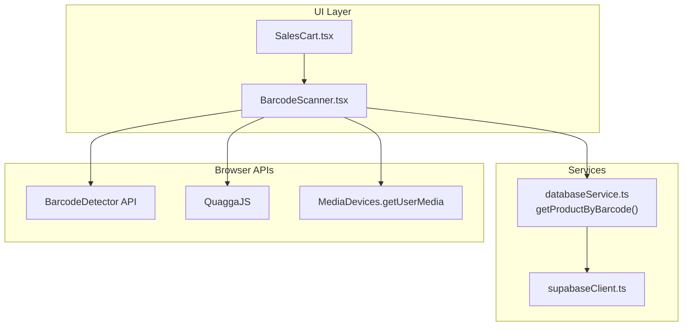
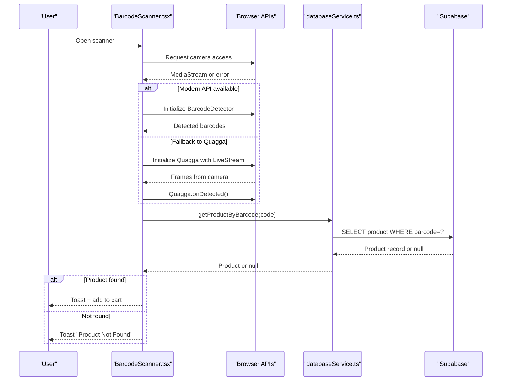
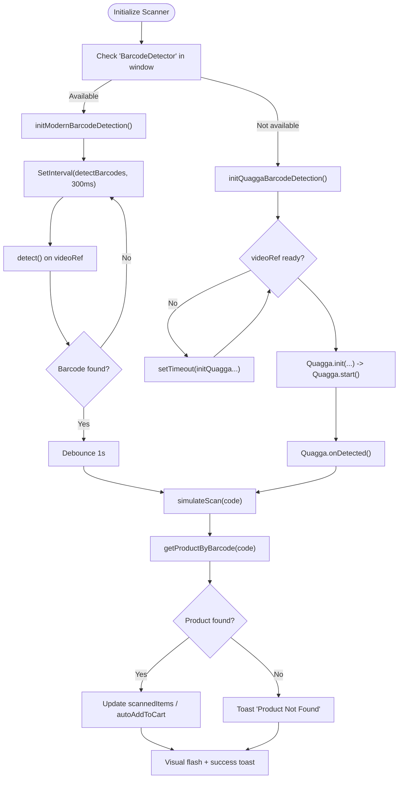
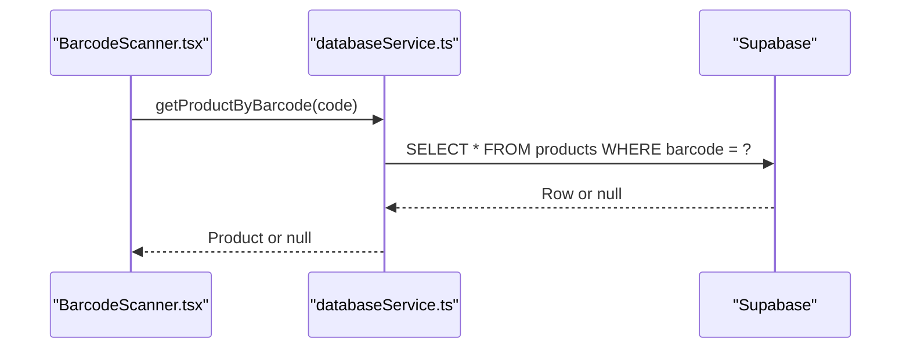
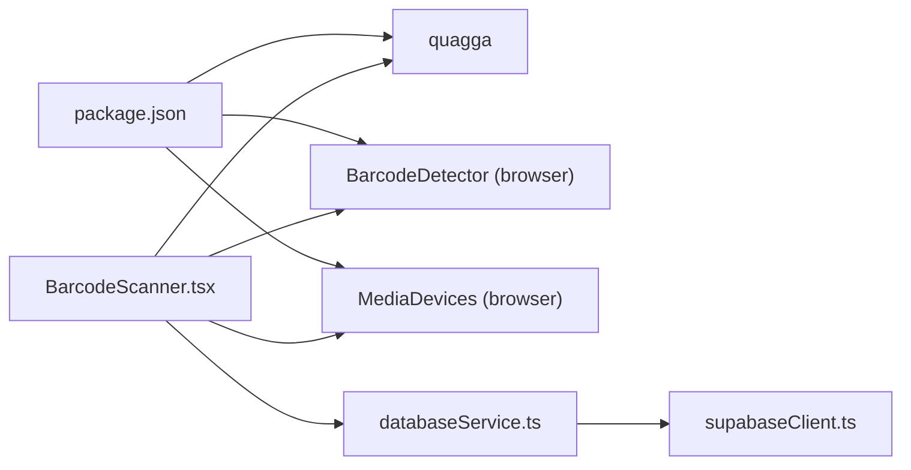

# Barcode Scanning Integration

<cite>
**Referenced Files in This Document**
- [BarcodeScanner.tsx](file://src/components/BarcodeScanner.tsx)
- [quagga.d.ts](file://src/types/quagga.d.ts)
- [databaseService.ts](file://src/services/databaseService.ts)
- [supabaseClient.ts](file://src/lib/supabaseClient.ts)
- [package.json](file://package.json)
- [SalesCart.tsx](file://src/pages/SalesCart.tsx)
- [QRTestPage.tsx](file://src/pages/QRTestPage.tsx)
- [TestQRCode.tsx](file://src/pages/TestQRCode.tsx)
</cite>

## Table of Contents
1. [Introduction](#introduction)
2. [Project Structure](#project-structure)
3. [Core Components](#core-components)
4. [Architecture Overview](#architecture-overview)
5. [Detailed Component Analysis](#detailed-component-analysis)
6. [Dependency Analysis](#dependency-analysis)
7. [Performance Considerations](#performance-considerations)
8. [Troubleshooting Guide](#troubleshooting-guide)
9. [Conclusion](#conclusion)
10. [Appendices](#appendices)

## Introduction
This document explains the barcode scanning integration for Royal POS Modern. It covers the QuaggaJS-based implementation, modern browser barcode detection fallback, camera access permissions, barcode data processing, product matching against the Supabase database, and integration into the sales workflow. It also documents scanning accuracy optimization, error handling strategies, barcode format support, and practical workflows for diagnosing scanner issues.

## Project Structure
The barcode scanning feature is implemented as a reusable React component that integrates with the Supabase backend for product lookups. The scanner supports two detection modes:
- Modern browser Barcode Detection API (where available)
- QuaggaJS fallback for broader compatibility

**Diagram sources**
- [BarcodeScanner.tsx:134-160](file://src/components/BarcodeScanner.tsx#L134-L160)
- [databaseService.ts:534-555](file://src/services/databaseService.ts#L534-L555)
- [supabaseClient.ts:1-33](file://src/lib/supabaseClient.ts#L1-L33)
- [SalesCart.tsx:1958-1972](file://src/pages/SalesCart.tsx#L1958-L1972)

**Section sources**
- [BarcodeScanner.tsx:1-120](file://src/components/BarcodeScanner.tsx#L1-L120)
- [package.json:59-59](file://package.json#L59-L59)

## Core Components
- BarcodeScanner component: Manages camera initialization, detection mode selection, real-time barcode detection, manual entry, and product lookup.
- QuaggaJS type definitions: Provide TypeScript signatures for Quagga initialization and callbacks.
- databaseService: Provides getProductByBarcode for product matching against the Supabase database.
- Supabase client: Centralized client configuration for database access.
- SalesCart integration: Demonstrates auto-add-to-cart behavior via the scanner.

Key capabilities:
- Dual-mode detection with automatic fallback
- Mobile-optimized camera constraints and user prompts
- Debounced detection to avoid duplicate scans
- Visual feedback on successful scans
- Manual barcode entry as a backup
- Integration with the sales cart for seamless checkout

**Section sources**
- [BarcodeScanner.tsx:33-50](file://src/components/BarcodeScanner.tsx#L33-L50)
- [quagga.d.ts:1-33](file://src/types/quagga.d.ts#L1-L33)
- [databaseService.ts:534-555](file://src/services/databaseService.ts#L534-L555)
- [supabaseClient.ts:1-33](file://src/lib/supabaseClient.ts#L1-L33)
- [SalesCart.tsx:1958-1972](file://src/pages/SalesCart.tsx#L1958-L1972)

## Architecture Overview
The scanner architecture prioritizes modern detection APIs while ensuring broad compatibility through QuaggaJS. The flow below illustrates the end-to-end process from camera capture to product addition to the cart.

**Diagram sources**
- [BarcodeScanner.tsx:134-160](file://src/components/BarcodeScanner.tsx#L134-L160)
- [BarcodeScanner.tsx:245-367](file://src/components/BarcodeScanner.tsx#L245-L367)
- [BarcodeScanner.tsx:369-450](file://src/components/BarcodeScanner.tsx#L369-L450)
- [databaseService.ts:534-555](file://src/services/databaseService.ts#L534-L555)

## Detailed Component Analysis

### BarcodeScanner Component
Responsibilities:
- Camera initialization with robust fallbacks for mobile and desktop
- Mode selection between modern Barcode Detection API and QuaggaJS
- Real-time detection with debouncing to prevent duplicate scans
- Product lookup via databaseService
- Cart integration and optional auto-add-to-cart
- Visual feedback and user guidance

Implementation highlights:
- Camera constraints prioritize environment-facing camera and reasonable resolution
- Modern detection runs at ~300ms intervals with 1-second debounce
- QuaggaJS configuration includes multiple decoders and worker count based on hardware concurrency
- Manual entry triggers the same lookup pipeline
- Cleanup stops camera tracks and Quagga on unmount

**Diagram sources**
- [BarcodeScanner.tsx:134-160](file://src/components/BarcodeScanner.tsx#L134-L160)
- [BarcodeScanner.tsx:166-243](file://src/components/BarcodeScanner.tsx#L166-L243)
- [BarcodeScanner.tsx:245-367](file://src/components/BarcodeScanner.tsx#L245-L367)
- [BarcodeScanner.tsx:369-450](file://src/components/BarcodeScanner.tsx#L369-L450)
- [databaseService.ts:534-555](file://src/services/databaseService.ts#L534-L555)

**Section sources**
- [BarcodeScanner.tsx:51-132](file://src/components/BarcodeScanner.tsx#L51-L132)
- [BarcodeScanner.tsx:134-160](file://src/components/BarcodeScanner.tsx#L134-L160)
- [BarcodeScanner.tsx:166-243](file://src/components/BarcodeScanner.tsx#L166-L243)
- [BarcodeScanner.tsx:245-367](file://src/components/BarcodeScanner.tsx#L245-L367)
- [BarcodeScanner.tsx:369-450](file://src/components/BarcodeScanner.tsx#L369-L450)

### QuaggaJS Type Definitions
Provides accurate TypeScript signatures for Quagga initialization, configuration, and callbacks, enabling safer integration and better developer experience.

**Section sources**
- [quagga.d.ts:1-33](file://src/types/quagga.d.ts#L1-L33)

### Product Matching and Database Integration
The scanner relies on a single lookup function to resolve barcodes to products:
- databaseService.getProductByBarcode performs a Supabase query by barcode
- The Supabase client is configured centrally with environment variables and session persistence

**Diagram sources**
- [databaseService.ts:534-555](file://src/services/databaseService.ts#L534-L555)
- [supabaseClient.ts:1-33](file://src/lib/supabaseClient.ts#L1-L33)

**Section sources**
- [databaseService.ts:534-555](file://src/services/databaseService.ts#L534-L555)
- [supabaseClient.ts:1-33](file://src/lib/supabaseClient.ts#L1-L33)

### Sales Cart Integration
The scanner can operate in auto-add mode, directly pushing scanned items into the sales cart for a streamlined checkout experience.

**Section sources**
- [SalesCart.tsx:1958-1972](file://src/pages/SalesCart.tsx#L1958-L1972)

### QR Code Context (Supporting Feature)
While not part of barcode scanning, the POS system includes QR code generation for receipts. This demonstrates the broader scanning ecosystem and can aid in testing and diagnostics.

**Section sources**
- [QRTestPage.tsx:1-139](file://src/pages/QRTestPage.tsx#L1-L139)
- [TestQRCode.tsx:1-86](file://src/pages/TestQRCode.tsx#L1-L86)

## Dependency Analysis
External libraries and browser APIs:
- QuaggaJS: Barcode decoding engine for fallback mode
- BarcodeDetector API: Native browser API for modern environments
- MediaDevices.getUserMedia: Camera access
- Supabase client: Backend data access

**Diagram sources**
- [package.json:59-59](file://package.json#L59-L59)
- [BarcodeScanner.tsx:21-21](file://src/components/BarcodeScanner.tsx#L21-L21)
- [databaseService.ts:1-1](file://src/services/databaseService.ts#L1-L1)
- [supabaseClient.ts:1-33](file://src/lib/supabaseClient.ts#L1-L33)

**Section sources**
- [package.json:59-59](file://package.json#L59-L59)
- [BarcodeScanner.tsx:21-21](file://src/components/BarcodeScanner.tsx#L21-L21)

## Performance Considerations
- Modern detection frequency: ~300ms polling with 1-second debounce to balance responsiveness and CPU usage.
- QuaggaJS workers: Uses hardwareConcurrency - 1 workers to distribute workload without blocking the UI thread.
- Camera constraints: Prefers environment-facing camera and reasonable resolution to improve detection speed and reliability.
- Debouncing: Prevents rapid re-scans of the same barcode, reducing redundant lookups.
- Cleanup: Stops camera tracks and Quagga on unmount to free resources.

[No sources needed since this section provides general guidance]

## Troubleshooting Guide
Common issues and resolutions:
- Camera access denied or blocked
  - Ensure HTTPS on mobile and desktop; some browsers require secure contexts for camera access.
  - Prompt users to grant permission when requested.
  - Use the retry button to re-request camera access.
- No barcode detected
  - Verify the barcode is clean, well-printed, and fully within the frame.
  - Try the manual entry field as a fallback.
  - Ensure the camera is focused and well-lit.
- Slow or unresponsive detection
  - Close other apps using the camera.
  - Use an environment-facing camera on mobile devices.
  - Reduce ambient light glare.
- Product not found
  - Confirm the barcode matches the product record in the database.
  - Verify the product has a barcode assigned.
- Mixed results between modern and Quagga modes
  - Modern API may fail on unsupported browsers; the component automatically falls back to QuaggaJS.
  - If modern API initializes but does not detect, check browser support and try again.

Diagnostic steps:
- Open browser dev tools and check console logs for initialization and error messages.
- Use the built-in retry mechanism to reset camera and detection state.
- Test manual entry to isolate camera vs. backend issues.

**Section sources**
- [BarcodeScanner.tsx:58-90](file://src/components/BarcodeScanner.tsx#L58-L90)
- [BarcodeScanner.tsx:166-243](file://src/components/BarcodeScanner.tsx#L166-L243)
- [BarcodeScanner.tsx:245-367](file://src/components/BarcodeScanner.tsx#L245-L367)
- [BarcodeScanner.tsx:369-450](file://src/components/BarcodeScanner.tsx#L369-L450)

## Conclusion
Royal POS Modern’s barcode scanning integration combines modern browser capabilities with a robust QuaggaJS fallback, delivering reliable real-time detection across devices. The scanner integrates tightly with the product database and sales cart, supporting both guided and auto-add workflows. With careful camera configuration, debouncing, and clear user feedback, it provides a smooth and efficient scanning experience suitable for retail environments.

[No sources needed since this section summarizes without analyzing specific files]

## Appendices

### Supported Barcode Formats
- Modern API (detected via BarcodeDetector):
  - Code 128, EAN-13, EAN-8, Code 39, Code 93, Codabar, UPC-A, UPC-E, QR Code
- QuaggaJS decoders:
  - Code 128, EAN, EAN-8, Code 39, Code 39 VIN, Codabar, UPC, UPC-E, Interleaved 2 of 5

Note: QR Code is supported in both modes, while UPC and EAN variants are covered by both sets.

**Section sources**
- [BarcodeScanner.tsx:170-172](file://src/components/BarcodeScanner.tsx#L170-L172)
- [BarcodeScanner.tsx:274-285](file://src/components/BarcodeScanner.tsx#L274-L285)

### Practical Workflows
- Standard scanning workflow:
  - Open the scanner from the sales cart.
  - Allow camera access when prompted.
  - Hold the device steady and aim the camera at the barcode.
  - On detection, the product is added to the cart with a success toast.
- Manual entry workflow:
  - Enter the barcode digits in the manual field and submit.
  - Same product lookup and cart update flow applies.
- Auto-add-to-cart workflow:
  - Launch the scanner with autoAddToCart enabled.
  - Each successful scan immediately updates the main sales cart.

**Section sources**
- [SalesCart.tsx:1958-1972](file://src/pages/SalesCart.tsx#L1958-L1972)
- [BarcodeScanner.tsx:484-505](file://src/components/BarcodeScanner.tsx#L484-L505)
- [BarcodeScanner.tsx:420-434](file://src/components/BarcodeScanner.tsx#L420-L434)