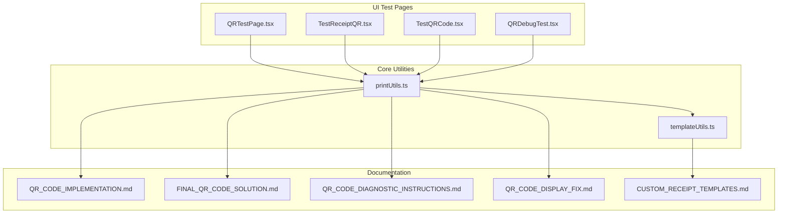
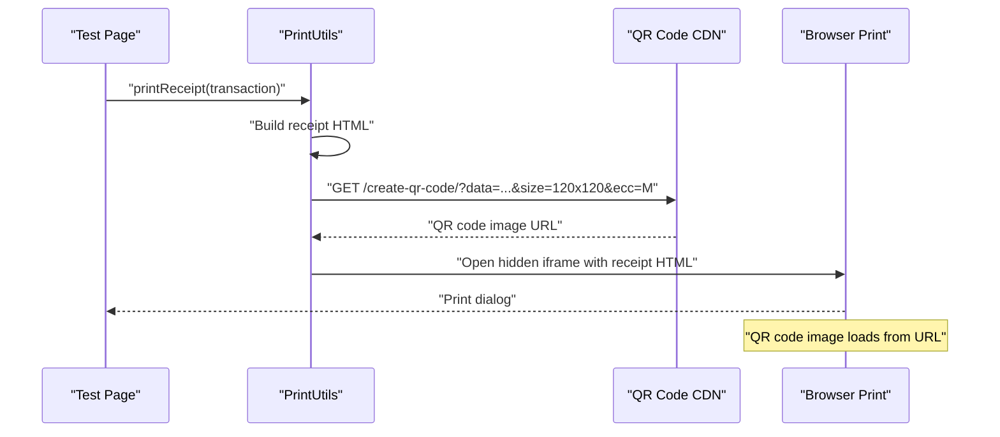
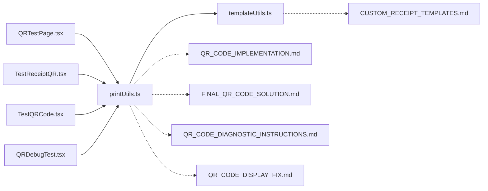

# QR Code System

<cite>
**Referenced Files in This Document**
- [printUtils.ts](file://src/utils/printUtils.ts)
- [templateUtils.ts](file://src/utils/templateUtils.ts)
- [CUSTOM_RECEIPT_TEMPLATES.md](file://src/docs/CUSTOM_RECEIPT_TEMPLATES.md)
- [QRTestPage.tsx](file://src/pages/QRTestPage.tsx)
- [TestReceiptQR.tsx](file://src/pages/TestReceiptQR.tsx)
- [TestQRCode.tsx](file://src/pages/TestQRCode.tsx)
- [QRDebugTest.tsx](file://src/pages/QRDebugTest.tsx)
- [QR_CODE_IMPLEMENTATION.md](file://QR_CODE_IMPLEMENTATION.md)
- [FINAL_QR_CODE_SOLUTION.md](file://FINAL_QR_CODE_SOLUTION.md)
- [QR_CODE_DIAGNOSTIC_INSTRUCTIONS.md](file://QR_CODE_DIAGNOSTIC_INSTRUCTIONS.md)
- [QR_CODE_DISPLAY_FIX.md](file://QR_CODE_DISPLAY_FIX.md)
</cite>

## Table of Contents
1. [Introduction](#introduction)
2. [Project Structure](#project-structure)
3. [Core Components](#core-components)
4. [Architecture Overview](#architecture-overview)
5. [Detailed Component Analysis](#detailed-component-analysis)
6. [Dependency Analysis](#dependency-analysis)
7. [Performance Considerations](#performance-considerations)
8. [Troubleshooting Guide](#troubleshooting-guide)
9. [Conclusion](#conclusion)
10. [Appendices](#appendices)

## Introduction
This document explains the complete QR code system for Royal POS Modern, covering receipt generation, QR code creation, display, and verification. It documents the receipt printing pipeline with customizable templates, print formatting, and mobile device optimization. It also covers QR code data encoding strategies, error correction levels, and troubleshooting guidance for QR code generation and printing issues.

## Project Structure
The QR code system spans several modules:
- Print utilities that generate QR code URLs and orchestrate receipt printing
- Template utilities that define and render customizable receipt layouts
- Test pages that validate QR code generation and receipt printing
- Documentation that captures implementation details, fixes, and diagnostics

**Diagram sources**
- [printUtils.ts:1-4330](file://src/utils/printUtils.ts#L1-L4330)
- [templateUtils.ts:1-584](file://src/utils/templateUtils.ts#L1-L584)
- [QRTestPage.tsx:1-139](file://src/pages/QRTestPage.tsx#L1-L139)
- [TestReceiptQR.tsx:1-205](file://src/pages/TestReceiptQR.tsx#L1-L205)
- [TestQRCode.tsx:1-86](file://src/pages/TestQRCode.tsx#L1-L86)
- [QRDebugTest.tsx:1-129](file://src/pages/QRDebugTest.tsx#L1-L129)
- [QR_CODE_IMPLEMENTATION.md:1-347](file://QR_CODE_IMPLEMENTATION.md#L1-L347)
- [FINAL_QR_CODE_SOLUTION.md:1-92](file://FINAL_QR_CODE_SOLUTION.md#L1-L92)
- [QR_CODE_DIAGNOSTIC_INSTRUCTIONS.md:1-126](file://QR_CODE_DIAGNOSTIC_INSTRUCTIONS.md#L1-L126)
- [QR_CODE_DISPLAY_FIX.md:1-78](file://QR_CODE_DISPLAY_FIX.md#L1-L78)
- [CUSTOM_RECEIPT_TEMPLATES.md:1-133](file://src/docs/CUSTOM_RECEIPT_TEMPLATES.md#L1-L133)

**Section sources**
- [printUtils.ts:1-4330](file://src/utils/printUtils.ts#L1-L4330)
- [templateUtils.ts:1-584](file://src/utils/templateUtils.ts#L1-L584)
- [CUSTOM_RECEIPT_TEMPLATES.md:1-133](file://src/docs/CUSTOM_RECEIPT_TEMPLATES.md#L1-L133)
- [QRTestPage.tsx:1-139](file://src/pages/QRTestPage.tsx#L1-L139)
- [TestReceiptQR.tsx:1-205](file://src/pages/TestReceiptQR.tsx#L1-L205)
- [TestQRCode.tsx:1-86](file://src/pages/TestQRCode.tsx#L1-L86)
- [QRDebugTest.tsx:1-129](file://src/pages/QRDebugTest.tsx#L1-L129)
- [QR_CODE_IMPLEMENTATION.md:1-347](file://QR_CODE_IMPLEMENTATION.md#L1-L347)
- [FINAL_QR_CODE_SOLUTION.md:1-92](file://FINAL_QR_CODE_SOLUTION.md#L1-L92)
- [QR_CODE_DIAGNOSTIC_INSTRUCTIONS.md:1-126](file://QR_CODE_DIAGNOSTIC_INSTRUCTIONS.md#L1-L126)
- [QR_CODE_DISPLAY_FIX.md:1-78](file://QR_CODE_DISPLAY_FIX.md#L1-L78)

## Core Components
- PrintUtils: Generates QR code URLs, builds receipt HTML, handles desktop/mobile printing, and manages QR code display with error handling and fallbacks.
- TemplateUtils: Provides default and persisted template configurations for receipts and purchase receipts, enabling customization of layout, sections, fonts, and paper width.
- Test pages: Validate QR code generation, receipt printing, and QR code display under various conditions.

Key capabilities:
- QR code generation via a CDN-based approach to avoid build-time dependency issues
- Mobile-aware printing with dedicated mobile flows
- Comprehensive error handling and fallback messaging for QR code display
- Customizable receipt templates with persistent storage

**Section sources**
- [printUtils.ts:1-4330](file://src/utils/printUtils.ts#L1-L4330)
- [templateUtils.ts:1-584](file://src/utils/templateUtils.ts#L1-L584)
- [CUSTOM_RECEIPT_TEMPLATES.md:1-133](file://src/docs/CUSTOM_RECEIPT_TEMPLATES.md#L1-L133)
- [QRTestPage.tsx:1-139](file://src/pages/QRTestPage.tsx#L1-L139)
- [TestReceiptQR.tsx:1-205](file://src/pages/TestReceiptQR.tsx#L1-L205)
- [TestQRCode.tsx:1-86](file://src/pages/TestQRCode.tsx#L1-L86)
- [QRDebugTest.tsx:1-129](file://src/pages/QRDebugTest.tsx#L1-L129)

## Architecture Overview
The QR code system integrates with the receipt printing pipeline. At runtime, PrintUtils constructs receipt content, optionally applies a custom template, injects a QR code section, and triggers printing. QR codes are generated using a CDN endpoint and embedded as image URLs in the receipt HTML.

**Diagram sources**
- [printUtils.ts:48-418](file://src/utils/printUtils.ts#L48-L418)
- [QRTestPage.tsx:66-75](file://src/pages/QRTestPage.tsx#L66-L75)
- [TestReceiptQR.tsx:96-128](file://src/pages/TestReceiptQR.tsx#L96-L128)

## Detailed Component Analysis

### PrintUtils: Receipt Printing and QR Code Integration
Responsibilities:
- Detect mobile vs desktop and route to appropriate print flows
- Build receipt HTML with embedded QR code section
- Generate QR code URL using a CDN endpoint with specified size and error correction
- Apply custom templates when enabled
- Provide robust error handling and fallbacks for QR code display

QR code generation strategy:
- Construct a JSON payload containing transaction metadata
- Encode the payload and request a PNG image from the CDN with fixed dimensions and error correction level
- Embed the returned URL into the receipt HTML image tag

Display and fallback:
- QR section includes a label, image, and receipt/order number
- Inline onload/onerror handlers log and manage display behavior
- Fallback message is shown when QR code generation fails

Mobile optimization:
- Dedicated mobile print flows avoid popup-related issues
- Ensures receipt window remains visible for QR code inspection

**Section sources**
- [printUtils.ts:14-45](file://src/utils/printUtils.ts#L14-L45)
- [printUtils.ts:48-418](file://src/utils/printUtils.ts#L48-L418)
- [printUtils.ts:421-751](file://src/utils/printUtils.ts#L421-L751)

### TemplateUtils: Custom Receipt Templates
Capabilities:
- Define default template configurations for sales and purchase receipts
- Persist and load template preferences from local storage
- Generate receipt HTML based on selected sections and formatting options
- Support font size and paper width adjustments for print quality

Usage:
- Sales receipts: customer info, items, totals, payment info, and optional extras
- Purchase receipts: supplier info, items, totals, payment info, and note about tax display

**Section sources**
- [templateUtils.ts:30-97](file://src/utils/templateUtils.ts#L30-L97)
- [templateUtils.ts:99-337](file://src/utils/templateUtils.ts#L99-L337)
- [templateUtils.ts:339-584](file://src/utils/templateUtils.ts#L339-L584)
- [CUSTOM_RECEIPT_TEMPLATES.md:1-133](file://src/docs/CUSTOM_RECEIPT_TEMPLATES.md#L1-L133)

### Test Pages: QR Code and Receipt Validation
- QRTestPage.tsx: Validates QR code generation and receipt printing flows, logs debug info, and displays generated QR images
- TestReceiptQR.tsx: Exercises sales/purchase receipt printing and direct QR code generation with detailed debug output
- TestQRCode.tsx: Demonstrates basic QR code generation with simple and structured data
- QRDebugTest.tsx: Comprehensive tests for multiple QR code generation modes and canvas-based generation

These pages provide controlled environments to reproduce and diagnose QR code and printing issues.

**Section sources**
- [QRTestPage.tsx:1-139](file://src/pages/QRTestPage.tsx#L1-L139)
- [TestReceiptQR.tsx:1-205](file://src/pages/TestReceiptQR.tsx#L1-L205)
- [TestQRCode.tsx:1-86](file://src/pages/TestQRCode.tsx#L1-L86)
- [QRDebugTest.tsx:1-129](file://src/pages/QRDebugTest.tsx#L1-L129)

### Implementation Notes and Fixes
- Final QR Code Solution: Enhanced HTML attributes, improved CSS styling, and detailed debugging information for QR code display
- QR Code Display Fix: Adjusted window handling timing to ensure QR code renders before printing
- QR Code Diagnostic Instructions: Step-by-step diagnostic tool and environment troubleshooting guidance

**Section sources**
- [FINAL_QR_CODE_SOLUTION.md:1-92](file://FINAL_QR_CODE_SOLUTION.md#L1-L92)
- [QR_CODE_DISPLAY_FIX.md:1-78](file://QR_CODE_DISPLAY_FIX.md#L1-L78)
- [QR_CODE_DIAGNOSTIC_INSTRUCTIONS.md:1-126](file://QR_CODE_DIAGNOSTIC_INSTRUCTIONS.md#L1-L126)
- [QR_CODE_IMPLEMENTATION.md:1-347](file://QR_CODE_IMPLEMENTATION.md#L1-L347)

## Dependency Analysis
The QR code system depends on:
- PrintUtils for receipt construction and QR code embedding
- TemplateUtils for custom receipt rendering
- Test pages for validation and debugging
- Documentation for implementation details and troubleshooting

**Diagram sources**
- [printUtils.ts:1-4330](file://src/utils/printUtils.ts#L1-L4330)
- [templateUtils.ts:1-584](file://src/utils/templateUtils.ts#L1-L584)
- [QRTestPage.tsx:1-139](file://src/pages/QRTestPage.tsx#L1-L139)
- [TestReceiptQR.tsx:1-205](file://src/pages/TestReceiptQR.tsx#L1-L205)
- [TestQRCode.tsx:1-86](file://src/pages/TestQRCode.tsx#L1-L86)
- [QRDebugTest.tsx:1-129](file://src/pages/QRDebugTest.tsx#L1-L129)
- [QR_CODE_IMPLEMENTATION.md:1-347](file://QR_CODE_IMPLEMENTATION.md#L1-L347)
- [FINAL_QR_CODE_SOLUTION.md:1-92](file://FINAL_QR_CODE_SOLUTION.md#L1-L92)
- [QR_CODE_DIAGNOSTIC_INSTRUCTIONS.md:1-126](file://QR_CODE_DIAGNOSTIC_INSTRUCTIONS.md#L1-L126)
- [QR_CODE_DISPLAY_FIX.md:1-78](file://QR_CODE_DISPLAY_FIX.md#L1-L78)
- [CUSTOM_RECEIPT_TEMPLATES.md:1-133](file://src/docs/CUSTOM_RECEIPT_TEMPLATES.md#L1-L133)

**Section sources**
- [printUtils.ts:1-4330](file://src/utils/printUtils.ts#L1-L4330)
- [templateUtils.ts:1-584](file://src/utils/templateUtils.ts#L1-L584)
- [QRTestPage.tsx:1-139](file://src/pages/QRTestPage.tsx#L1-L139)
- [TestReceiptQR.tsx:1-205](file://src/pages/TestReceiptQR.tsx#L1-L205)
- [TestQRCode.tsx:1-86](file://src/pages/TestQRCode.tsx#L1-L86)
- [QRDebugTest.tsx:1-129](file://src/pages/QRDebugTest.tsx#L1-L129)
- [QR_CODE_IMPLEMENTATION.md:1-347](file://QR_CODE_IMPLEMENTATION.md#L1-L347)
- [FINAL_QR_CODE_SOLUTION.md:1-92](file://FINAL_QR_CODE_SOLUTION.md#L1-L92)
- [QR_CODE_DIAGNOSTIC_INSTRUCTIONS.md:1-126](file://QR_CODE_DIAGNOSTIC_INSTRUCTIONS.md#L1-L126)
- [QR_CODE_DISPLAY_FIX.md:1-78](file://QR_CODE_DISPLAY_FIX.md#L1-L78)
- [CUSTOM_RECEIPT_TEMPLATES.md:1-133](file://src/docs/CUSTOM_RECEIPT_TEMPLATES.md#L1-L133)

## Performance Considerations
- QR code generation is delegated to a CDN endpoint, avoiding heavy client-side computations and keeping UI responsive
- Fixed image dimensions (120x120) and error correction level (M) balance scan reliability and payload size
- Desktop printing uses a hidden iframe to minimize UI disruption and reduce print dialog overhead
- Mobile flows avoid popup-related issues and improve user experience by keeping receipts visible

[No sources needed since this section provides general guidance]

## Troubleshooting Guide
Common issues and resolutions:
- QR code not displaying: Confirm browser console for errors, check Content Security Policy, and verify QR code URL validity
- QR code not scanning: Ensure sufficient contrast and appropriate size; verify error correction level
- Printing issues: Validate receipt printer connectivity and paper size; confirm browser print settings
- Environment-specific problems: Disable browser extensions, test in incognito mode, or try different browsers

Diagnostic steps:
- Use the diagnostic tool to test data URL image display and QR code generation
- Inspect receipt window handling and ensure proper timing for QR code rendering
- Review network tab for blocked requests or CORS issues

Practical examples:
- Sales receipt QR code: Generated from transaction data and embedded in receipt HTML
- Purchase receipt QR code: Generated similarly with purchase-specific fields
- Direct QR code generation: Tested via multiple test pages with structured data payloads

**Section sources**
- [QR_CODE_DIAGNOSTIC_INSTRUCTIONS.md:1-126](file://QR_CODE_DIAGNOSTIC_INSTRUCTIONS.md#L1-L126)
- [FINAL_QR_CODE_SOLUTION.md:55-83](file://FINAL_QR_CODE_SOLUTION.md#L55-L83)
- [QR_CODE_DISPLAY_FIX.md:71-78](file://QR_CODE_DISPLAY_FIX.md#L71-L78)
- [QRTestPage.tsx:22-75](file://src/pages/QRTestPage.tsx#L22-L75)
- [TestReceiptQR.tsx:40-128](file://src/pages/TestReceiptQR.tsx#L40-L128)
- [TestQRCode.tsx:9-46](file://src/pages/TestQRCode.tsx#L9-L46)
- [QRDebugTest.tsx:11-83](file://src/pages/QRDebugTest.tsx#L11-L83)

## Conclusion
Royal POS Modern’s QR code system integrates seamlessly with the receipt printing pipeline. By leveraging a CDN-based QR code generator, robust error handling, and customizable templates, it ensures reliable QR code display across devices. The provided test pages and documentation facilitate validation, debugging, and ongoing maintenance.

[No sources needed since this section summarizes without analyzing specific files]

## Appendices

### QR Code Data Encoding and Error Correction
- Data encoding: JSON payload containing transaction metadata
- Error correction: Medium (M) for balanced reliability and capacity
- Image format: PNG with fixed dimensions for consistent print quality

**Section sources**
- [printUtils.ts:14-45](file://src/utils/printUtils.ts#L14-L45)
- [QR_CODE_IMPLEMENTATION.md:8-15](file://QR_CODE_IMPLEMENTATION.md#L8-L15)

### Receipt Data Structures
- Sales receipt: Includes type, receipt number, date, items, totals, and payment details
- Purchase receipt: Includes type, order number, date, items, supplier, totals, and payment details

**Section sources**
- [printUtils.ts:17-28](file://src/utils/printUtils.ts#L17-L28)
- [printUtils.ts:429-441](file://src/utils/printUtils.ts#L429-L441)

### Print Quality Optimization
- Fixed QR code dimensions (120x120) and error correction level (M)
- Custom templates allow font size and paper width adjustments
- Mobile optimization improves visibility and reduces print dialog interruptions

**Section sources**
- [printUtils.ts:48-418](file://src/utils/printUtils.ts#L48-L418)
- [templateUtils.ts:30-57](file://src/utils/templateUtils.ts#L30-L57)
- [CUSTOM_RECEIPT_TEMPLATES.md:70-81](file://src/docs/CUSTOM_RECEIPT_TEMPLATES.md#L70-L81)