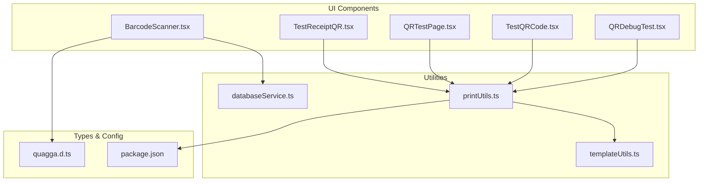
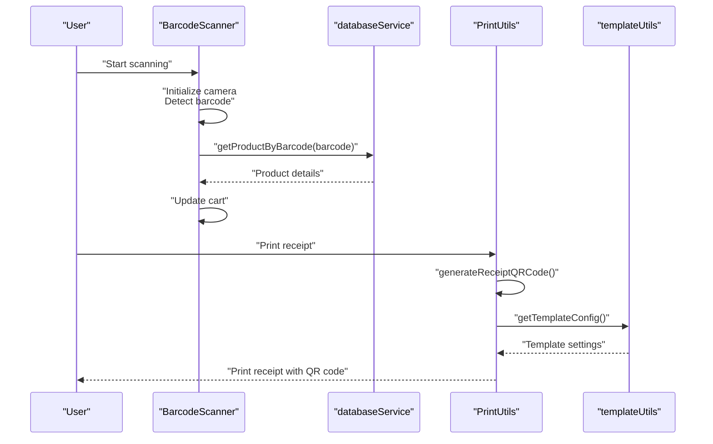
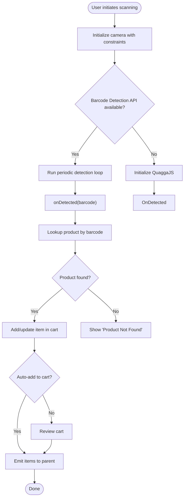
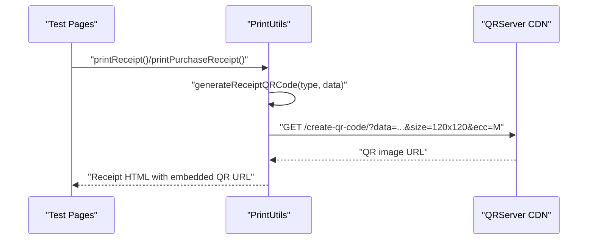
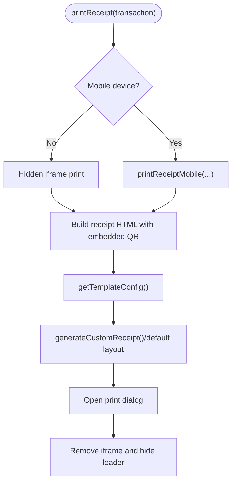
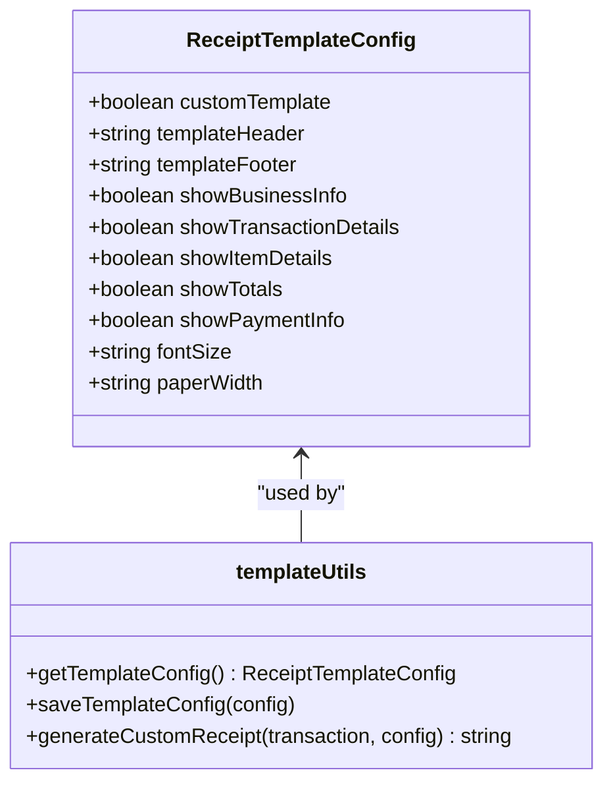
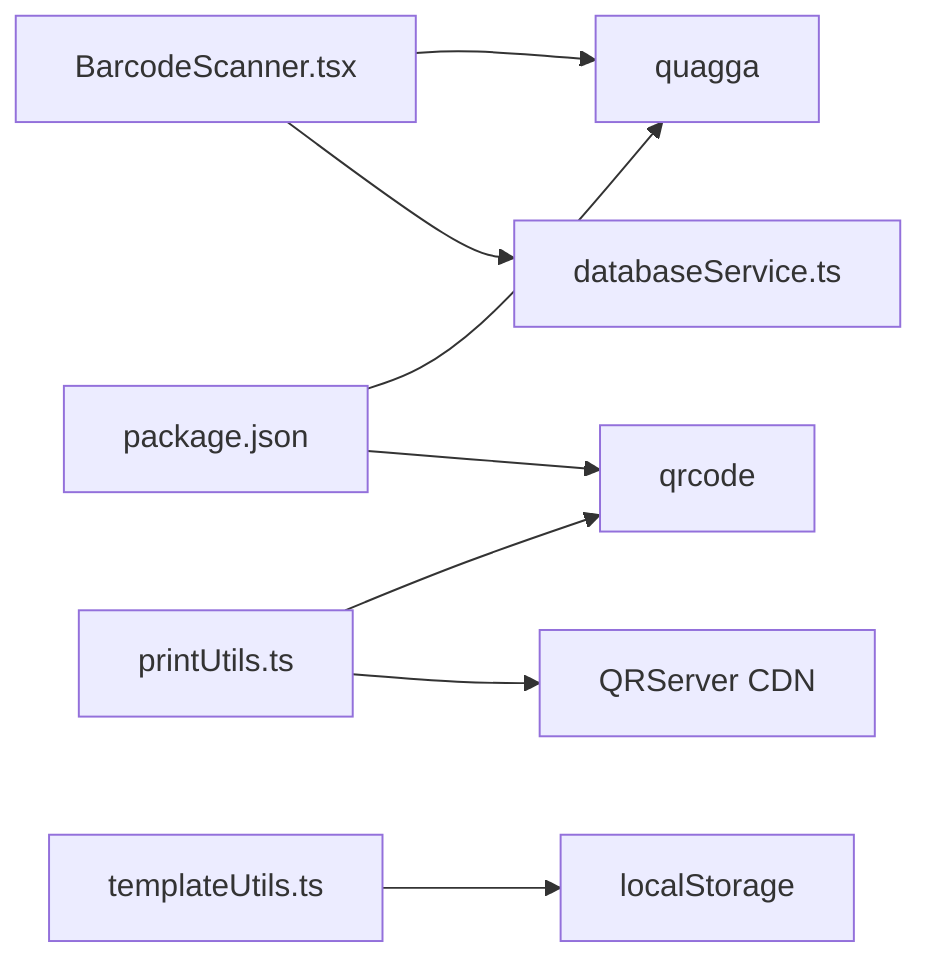

# QR Code and Barcode Integration

<cite>
**Referenced Files in This Document**
- [BarcodeScanner.tsx](file://src/components/BarcodeScanner.tsx)
- [printUtils.ts](file://src/utils/printUtils.ts)
- [templateUtils.ts](file://src/utils/templateUtils.ts)
- [databaseService.ts](file://src/services/databaseService.ts)
- [TestQRCode.tsx](file://src/pages/TestQRCode.tsx)
- [QRTestPage.tsx](file://src/pages/QRTestPage.tsx)
- [TestReceiptQR.tsx](file://src/pages/TestReceiptQR.tsx)
- [QRDebugTest.tsx](file://src/pages/QRDebugTest.tsx)
- [quagga.d.ts](file://src/types/quagga.d.ts)
- [package.json](file://package.json)
- [CUSTOM_RECEIPT_TEMPLATES.md](file://src/docs/CUSTOM_RECEIPT_TEMPLATES.md)
</cite>

## Table of Contents
1. [Introduction](#introduction)
2. [Project Structure](#project-structure)
3. [Core Components](#core-components)
4. [Architecture Overview](#architecture-overview)
5. [Detailed Component Analysis](#detailed-component-analysis)
6. [Dependency Analysis](#dependency-analysis)
7. [Performance Considerations](#performance-considerations)
8. [Troubleshooting Guide](#troubleshooting-guide)
9. [Conclusion](#conclusion)
10. [Appendices](#appendices)

## Introduction
This document explains the complete QR code and barcode integration system in Royal POS Modern. It covers:
- QR code generation and display within receipts
- QR code verification for receipt authenticity and transaction validation
- Barcode scanning integration using QuaggaJS for product identification and inventory updates
- Receipt printing with customizable templates, print formatting, and mobile device optimization
- Practical usage scenarios, troubleshooting guidance, and cross-platform compatibility considerations

## Project Structure
The QR code and barcode system spans several modules:
- Barcode scanning UI and logic
- QR code generation and embedding in receipts
- Receipt printing utilities with template customization
- Database integration for product lookup
- Testing pages and debugging utilities

**Diagram sources**
- [BarcodeScanner.tsx:1-878](file://src/components/BarcodeScanner.tsx#L1-L878)
- [printUtils.ts:1-4330](file://src/utils/printUtils.ts#L1-L4330)
- [templateUtils.ts:1-584](file://src/utils/templateUtils.ts#L1-L584)
- [databaseService.ts:1-5409](file://src/services/databaseService.ts#L1-L5409)
- [TestReceiptQR.tsx:1-205](file://src/pages/TestReceiptQR.tsx#L1-L205)
- [QRTestPage.tsx:1-139](file://src/pages/QRTestPage.tsx#L1-L139)
- [TestQRCode.tsx:1-86](file://src/pages/TestQRCode.tsx#L1-L86)
- [QRDebugTest.tsx:1-129](file://src/pages/QRDebugTest.tsx#L1-L129)
- [quagga.d.ts:1-33](file://src/types/quagga.d.ts#L1-L33)
- [package.json:1-95](file://package.json#L1-L95)

**Section sources**
- [BarcodeScanner.tsx:1-878](file://src/components/BarcodeScanner.tsx#L1-L878)
- [printUtils.ts:1-4330](file://src/utils/printUtils.ts#L1-L4330)
- [templateUtils.ts:1-584](file://src/utils/templateUtils.ts#L1-L584)
- [databaseService.ts:1-5409](file://src/services/databaseService.ts#L1-L5409)
- [TestReceiptQR.tsx:1-205](file://src/pages/TestReceiptQR.tsx#L1-L205)
- [QRTestPage.tsx:1-139](file://src/pages/QRTestPage.tsx#L1-L139)
- [TestQRCode.tsx:1-86](file://src/pages/TestQRCode.tsx#L1-L86)
- [QRDebugTest.tsx:1-129](file://src/pages/QRDebugTest.tsx#L1-L129)
- [quagga.d.ts:1-33](file://src/types/quagga.d.ts#L1-L33)
- [package.json:1-95](file://package.json#L1-L95)

## Core Components
- BarcodeScanner: Live camera-based barcode scanning with QuaggaJS fallback, product lookup via Supabase, and cart management
- PrintUtils: Generates QR codes via external CDN, formats receipts with embedded QR codes, and prints optimized layouts for desktop and mobile
- templateUtils: Provides customizable receipt templates with persistent storage and flexible layout controls
- databaseService: Supplies product data for barcode lookups and inventory updates
- Test pages: Dedicated pages for validating QR generation, receipt printing, and scanning behavior

Key capabilities:
- Dual-path barcode detection: modern Browser Barcode Detection API with fallback to QuaggaJS
- Real-time product matching and inventory updates through Supabase
- Mobile-first receipt printing with responsive styles and QR code fallback messaging
- Extensible template engine for branding and compliance needs

**Section sources**
- [BarcodeScanner.tsx:1-878](file://src/components/BarcodeScanner.tsx#L1-L878)
- [printUtils.ts:1-4330](file://src/utils/printUtils.ts#L1-L4330)
- [templateUtils.ts:1-584](file://src/utils/templateUtils.ts#L1-L584)
- [databaseService.ts:1-5409](file://src/services/databaseService.ts#L1-L5409)

## Architecture Overview
The system integrates three primary flows:
1) Barcode scanning and product lookup
2) QR code generation and embedding in receipts
3) Receipt printing with template customization

**Diagram sources**
- [BarcodeScanner.tsx:135-367](file://src/components/BarcodeScanner.tsx#L135-L367)
- [databaseService.ts:534-555](file://src/services/databaseService.ts#L534-L555)
- [printUtils.ts:14-45](file://src/utils/printUtils.ts#L14-L45)
- [templateUtils.ts:60-79](file://src/utils/templateUtils.ts#L60-L79)

## Detailed Component Analysis

### BarcodeScanner Component
The scanner supports modern and legacy barcode detection:
- Uses Browser Barcode Detection API when available (Chrome)
- Falls back to QuaggaJS for broader compatibility
- Integrates with Supabase to resolve barcodes to product records
- Manages a local cart for scanned items with quantity adjustments

**Diagram sources**
- [BarcodeScanner.tsx:52-132](file://src/components/BarcodeScanner.tsx#L52-L132)
- [BarcodeScanner.tsx:135-367](file://src/components/BarcodeScanner.tsx#L135-L367)
- [BarcodeScanner.tsx:370-450](file://src/components/BarcodeScanner.tsx#L370-L450)
- [databaseService.ts:534-555](file://src/services/databaseService.ts#L534-L555)

**Section sources**
- [BarcodeScanner.tsx:1-878](file://src/components/BarcodeScanner.tsx#L1-L878)
- [quagga.d.ts:1-33](file://src/types/quagga.d.ts#L1-L33)
- [databaseService.ts:534-555](file://src/services/databaseService.ts#L534-L555)

### QR Code Generation and Embedding
Two complementary approaches exist:
- Direct generation for testing and small payloads
- CDN-based generation for production receipts

**Diagram sources**
- [TestReceiptQR.tsx:96-128](file://src/pages/TestReceiptQR.tsx#L96-L128)
- [QRTestPage.tsx:22-64](file://src/pages/QRTestPage.tsx#L22-L64)
- [TestQRCode.tsx:9-46](file://src/pages/TestQRCode.tsx#L9-L46)
- [printUtils.ts:14-45](file://src/utils/printUtils.ts#L14-L45)

**Section sources**
- [TestReceiptQR.tsx:1-205](file://src/pages/TestReceiptQR.tsx#L1-L205)
- [QRTestPage.tsx:1-139](file://src/pages/QRTestPage.tsx#L1-L139)
- [TestQRCode.tsx:1-86](file://src/pages/TestQRCode.tsx#L1-L86)
- [printUtils.ts:14-45](file://src/utils/printUtils.ts#L14-L45)

### Receipt Printing System
PrintUtils handles:
- QR code generation via CDN to avoid build-time dependencies
- Desktop vs mobile print strategies
- Template-driven receipt rendering with optional custom templates
- Robust error handling and fallback messaging for QR code loading

**Diagram sources**
- [printUtils.ts:48-418](file://src/utils/printUtils.ts#L48-L418)
- [templateUtils.ts:60-79](file://src/utils/templateUtils.ts#L60-L79)

**Section sources**
- [printUtils.ts:1-4330](file://src/utils/printUtils.ts#L1-L4330)
- [templateUtils.ts:1-584](file://src/utils/templateUtils.ts#L1-L584)

### Template Customization
The template engine enables:
- Enabling/disabling sections (business info, items, totals, payment)
- Custom header/footer content
- Font size and paper width adjustments
- Persistent storage via localStorage

**Diagram sources**
- [templateUtils.ts:2-28](file://src/utils/templateUtils.ts#L2-L28)
- [templateUtils.ts:60-97](file://src/utils/templateUtils.ts#L60-L97)
- [templateUtils.ts:99-337](file://src/utils/templateUtils.ts#L99-L337)

**Section sources**
- [templateUtils.ts:1-584](file://src/utils/templateUtils.ts#L1-L584)
- [CUSTOM_RECEIPT_TEMPLATES.md:1-133](file://src/docs/CUSTOM_RECEIPT_TEMPLATES.md#L1-L133)

## Dependency Analysis
External libraries and integrations:
- qrcode: QR code generation for testing and direct embedding
- quagga: Legacy barcode scanning fallback
- @types/qrcode: Type definitions for QR code APIs
- Supabase client: Backend integration for product lookups

**Diagram sources**
- [BarcodeScanner.tsx:20-23](file://src/components/BarcodeScanner.tsx#L20-L23)
- [printUtils.ts:1-1](file://src/utils/printUtils.ts#L1-L1)
- [templateUtils.ts:60-79](file://src/utils/templateUtils.ts#L60-L79)
- [package.json:58-59](file://package.json#L58-L59)

**Section sources**
- [package.json:1-95](file://package.json#L1-L95)
- [BarcodeScanner.tsx:1-878](file://src/components/BarcodeScanner.tsx#L1-L878)
- [printUtils.ts:1-4330](file://src/utils/printUtils.ts#L1-L4330)
- [templateUtils.ts:1-584](file://src/utils/templateUtils.ts#L1-L584)

## Performance Considerations
- QR code generation: Using a CDN avoids heavy client-side QR encoding, reducing memory and CPU usage during receipt generation
- Barcode scanning: Debouncing and scan rate limiting prevent duplicate entries and excessive network calls
- Mobile optimization: Compact print styles and minimal DOM reduce rendering overhead on lower-powered devices
- Template rendering: Conditional sections and responsive widths minimize layout thrashing

## Troubleshooting Guide
Common issues and resolutions:
- Camera access denied on mobile:
  - Ensure HTTPS and permission prompts are accepted
  - Retry camera access using the built-in retry mechanism
- Barcode scanning not working:
  - Verify browser supports the chosen detection method
  - Use manual barcode entry as a workaround
  - Check barcode contrast and lighting conditions
- QR code not appearing on receipts:
  - Confirm CDN availability and network connectivity
  - Inspect onerror handlers for detailed failure messages
- Printing problems:
  - Validate paper width matches template settings
  - Check browser print dialog and printer driver configuration
- Template not applying:
  - Toggle custom template and save changes
  - Refresh the page to reapply settings

**Section sources**
- [BarcodeScanner.tsx:508-529](file://src/components/BarcodeScanner.tsx#L508-L529)
- [printUtils.ts:364-383](file://src/utils/printUtils.ts#L364-L383)
- [CUSTOM_RECEIPT_TEMPLATES.md:118-133](file://src/docs/CUSTOM_RECEIPT_TEMPLATES.md#L118-L133)

## Conclusion
Royal POS Modern provides a robust, cross-platform QR code and barcode system:
- Reliable barcode scanning with modern and legacy detection paths
- Seamless QR code integration in receipts with CDN-backed generation
- Flexible, customizable receipt templates with persistent configuration
- Optimized printing for both desktop and mobile environments
- Comprehensive testing and debugging utilities for smooth operation

## Appendices

### Practical Usage Scenarios
- Sales receipt with QR code: Generate a sales receipt and embed a QR code containing transaction details for customer verification
- Purchase receipt with QR code: Create purchase receipts with QR codes for supplier reconciliation
- Barcode-assisted checkout: Scan barcodes to populate cart items and update inventory in real time
- Template customization: Tailor receipt appearance to brand guidelines and legal requirements

### Cross-Platform Compatibility Notes
- Barcode scanning: Works best on modern browsers with HTTPS; includes fallbacks for older environments
- QR code generation: Relies on CDN for production stability; local generation available for testing
- Printing: Desktop and mobile print paths optimized separately; ensure printer drivers and browser settings are configured correctly