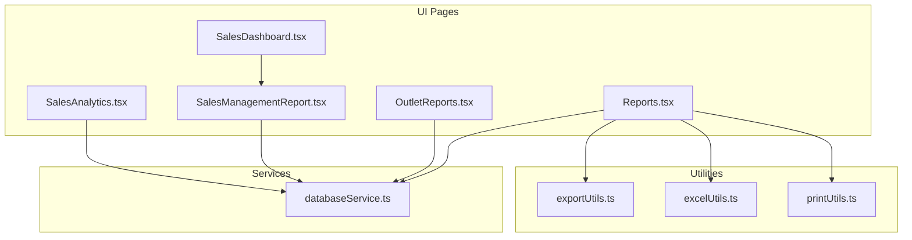
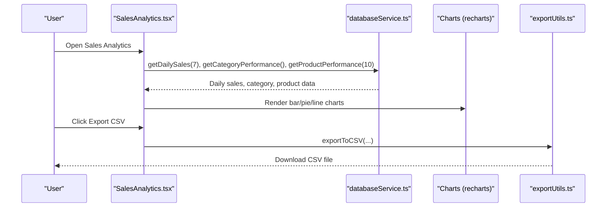
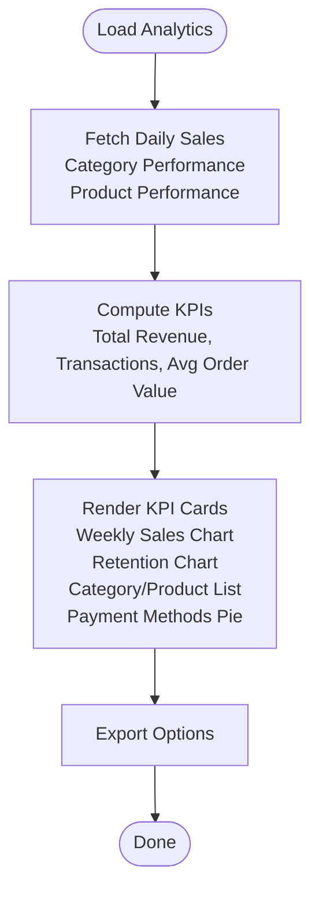
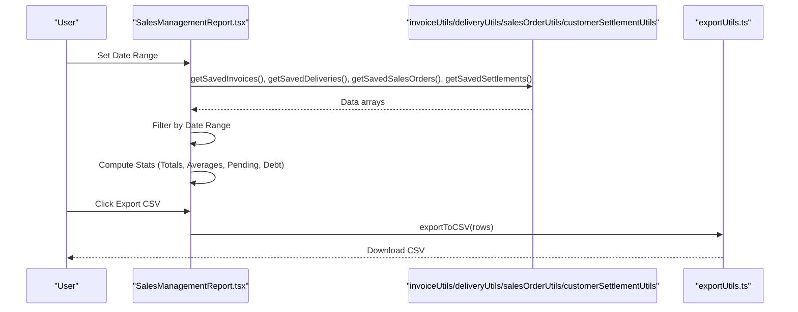
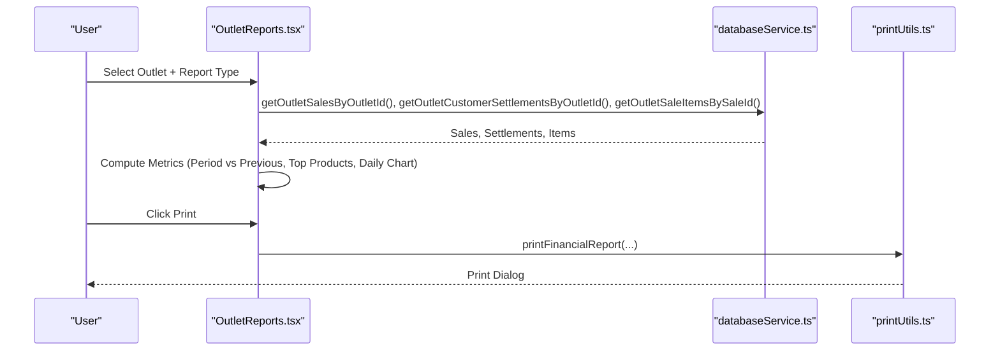
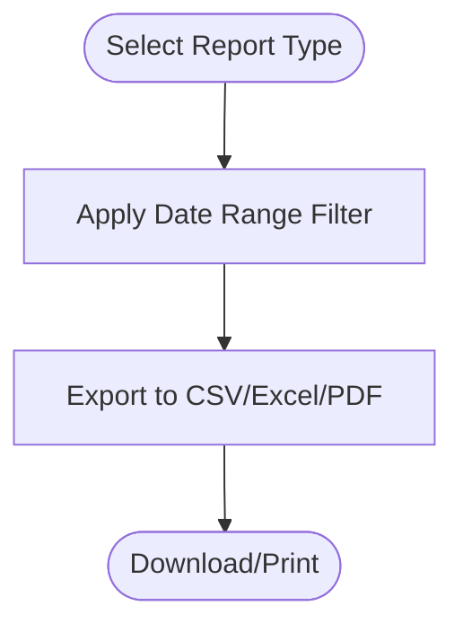
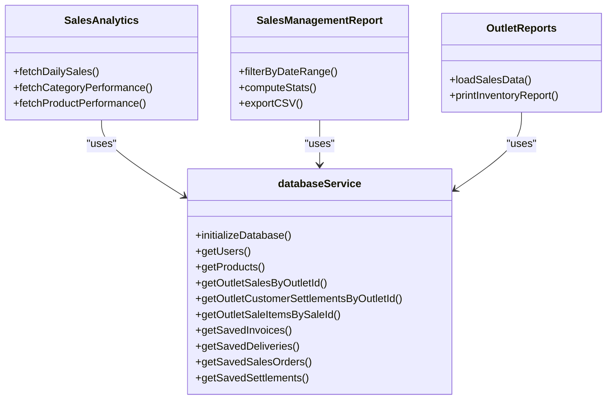
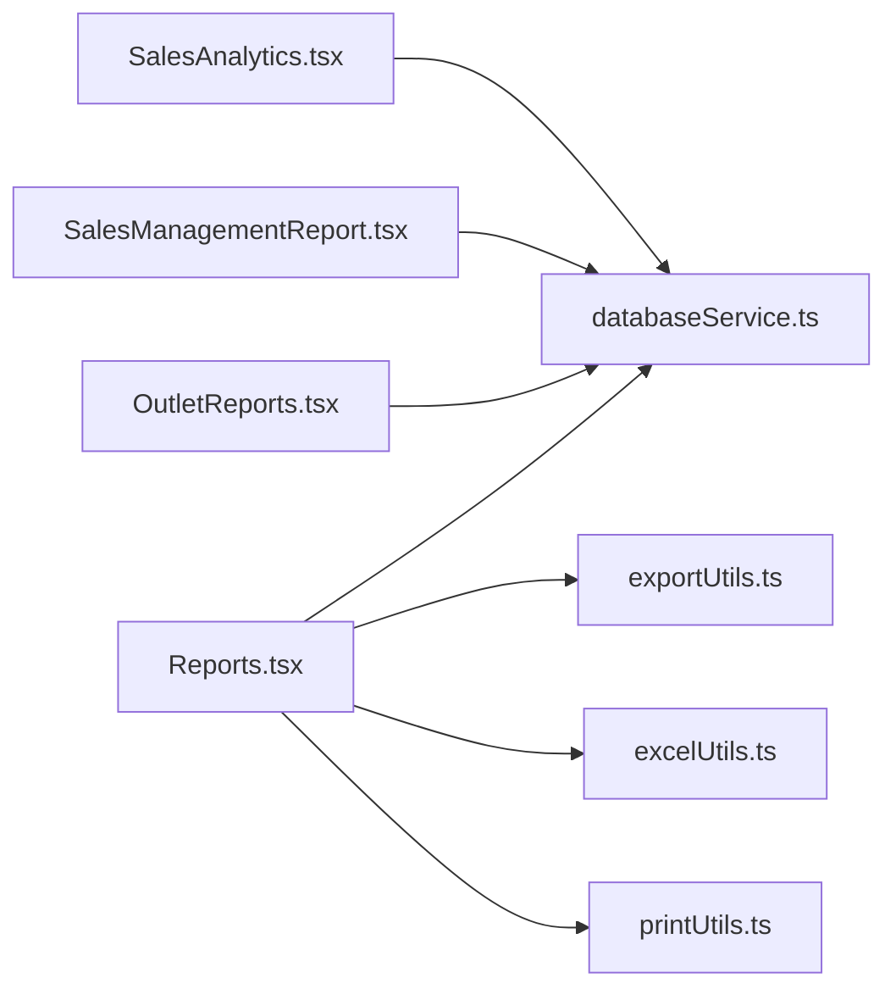

# Sales Analytics and Reporting

<cite>
**Referenced Files in This Document**
- [SalesAnalytics.tsx](file://src/pages/SalesAnalytics.tsx)
- [SalesManagementReport.tsx](file://src/pages/SalesManagementReport.tsx)
- [OutletReports.tsx](file://src/pages/OutletReports.tsx)
- [Reports.tsx](file://src/pages/Reports.tsx)
- [SalesDashboard.tsx](file://src/pages/SalesDashboard.tsx)
- [databaseService.ts](file://src/services/databaseService.ts)
- [exportUtils.ts](file://src/utils/exportUtils.ts)
- [excelUtils.ts](file://src/utils/excelUtils.ts)
- [printUtils.ts](file://src/utils/printUtils.ts)
</cite>

## Table of Contents
1. [Introduction](#introduction)
2. [Project Structure](#project-structure)
3. [Core Components](#core-components)
4. [Architecture Overview](#architecture-overview)
5. [Detailed Component Analysis](#detailed-component-analysis)
6. [Dependency Analysis](#dependency-analysis)
7. [Performance Considerations](#performance-considerations)
8. [Troubleshooting Guide](#troubleshooting-guide)
9. [Conclusion](#conclusion)

## Introduction
This document explains the sales analytics and reporting capabilities of Royal POS Modern. It covers the sales dashboard with key performance indicators, the sales management report with detailed breakdowns, analytics filters, export functionality (CSV, Excel, PDF), real-time data synchronization, customizable report templates, automated report scheduling, and guidance for interpreting sales trends.

## Project Structure
The analytics and reporting features are implemented across several pages and supporting utilities:
- Sales dashboard and analytics: SalesAnalytics
- Sales management report: SalesManagementReport
- Outlet-level reports: OutletReports
- General reports and exports: Reports
- Data access layer: databaseService
- Export utilities: exportUtils, excelUtils
- Printing utilities: printUtils
- Sales dashboard navigation: SalesDashboard

**Diagram sources**
- [SalesAnalytics.tsx:114-496](file://src/pages/SalesAnalytics.tsx#L114-L496)
- [SalesManagementReport.tsx:34-665](file://src/pages/SalesManagementReport.tsx#L34-L665)
- [OutletReports.tsx:113-800](file://src/pages/OutletReports.tsx#L113-L800)
- [Reports.tsx:67-800](file://src/pages/Reports.tsx#L67-L800)
- [SalesDashboard.tsx:34-251](file://src/pages/SalesDashboard.tsx#L34-L251)
- [databaseService.ts:1-800](file://src/services/databaseService.ts#L1-L800)
- [exportUtils.ts:12-785](file://src/utils/exportUtils.ts#L12-L785)
- [excelUtils.ts:1-36](file://src/utils/excelUtils.ts#L1-L36)
- [printUtils.ts:7-800](file://src/utils/printUtils.ts#L7-L800)

**Section sources**
- [SalesAnalytics.tsx:114-496](file://src/pages/SalesAnalytics.tsx#L114-L496)
- [SalesManagementReport.tsx:34-665](file://src/pages/SalesManagementReport.tsx#L34-L665)
- [OutletReports.tsx:113-800](file://src/pages/OutletReports.tsx#L113-L800)
- [Reports.tsx:67-800](file://src/pages/Reports.tsx#L67-L800)
- [SalesDashboard.tsx:34-251](file://src/pages/SalesDashboard.tsx#L34-L251)

## Core Components
- SalesAnalytics: Provides KPIs, weekly sales performance charts, customer retention trends, category/product performance, and payment method distribution.
- SalesManagementReport: Summarizes sales, orders, deliveries, and settlements; includes date-range filtering and CSV export.
- OutletReports: Loads outlet-specific sales and inventory data, supports date-range selection, and prints outlet reports.
- Reports: Centralized report selection, date-range filtering, export to CSV/Excel/PDF, and printing via printUtils.
- databaseService: Defines data models and provides typed accessors for analytics data.
- exportUtils and excelUtils: CSV and Excel export utilities; exportUtils also generates PDFs.
- printUtils: Generates printable HTML receipts and financial reports with QR codes and mobile-friendly layouts.

**Section sources**
- [SalesAnalytics.tsx:74-496](file://src/pages/SalesAnalytics.tsx#L74-L496)
- [SalesManagementReport.tsx:34-665](file://src/pages/SalesManagementReport.tsx#L34-L665)
- [OutletReports.tsx:113-800](file://src/pages/OutletReports.tsx#L113-L800)
- [Reports.tsx:67-800](file://src/pages/Reports.tsx#L67-L800)
- [databaseService.ts:1-800](file://src/services/databaseService.ts#L1-L800)
- [exportUtils.ts:12-785](file://src/utils/exportUtils.ts#L12-L785)
- [excelUtils.ts:1-36](file://src/utils/excelUtils.ts#L1-L36)
- [printUtils.ts:7-800](file://src/utils/printUtils.ts#L7-L800)

## Architecture Overview
The analytics pipeline follows a clear separation of concerns:
- UI pages orchestrate data fetching and rendering.
- databaseService abstracts Supabase queries and provides typed models.
- Utilities handle export and printing, ensuring consistent output formats.

**Diagram sources**
- [SalesAnalytics.tsx:130-156](file://src/pages/SalesAnalytics.tsx#L130-L156)
- [databaseService.ts:1-800](file://src/services/databaseService.ts#L1-L800)
- [exportUtils.ts:12-41](file://src/utils/exportUtils.ts#L12-L41)

## Detailed Component Analysis

### Sales Analytics Dashboard
- KPI Cards: Total Revenue, Transactions, Average Order Value, Active Customers.
- Weekly Sales Performance: Bar chart with sales and transaction counts.
- Customer Retention: Line chart comparing new vs returning customers.
- Category/Product Performance: Toggle between category and product views with growth indicators.
- Payment Methods: Pie chart showing distribution of payment methods.
- Recent Activity: List of recent sales with status badges.

**Diagram sources**
- [SalesAnalytics.tsx:130-156](file://src/pages/SalesAnalytics.tsx#L130-L156)
- [SalesAnalytics.tsx:210-456](file://src/pages/SalesAnalytics.tsx#L210-L456)

**Section sources**
- [SalesAnalytics.tsx:74-496](file://src/pages/SalesAnalytics.tsx#L74-L496)

### Sales Management Report
- Date Range Filter: From/To date pickers.
- Summary Cards: Total Sales, Total Orders, Total Deliveries, Average Order Value.
- Detailed Sections: Sales Invoices, Sales Orders, Deliveries, Customer Settlements.
- Financial Summary: Total Revenue, Total Settlements, Outstanding Debt, Net Position.
- Key Metrics: Order Completion Rate, Average Transaction, Debt Collection Rate.
- Export: CSV export of summary metrics.

**Diagram sources**
- [SalesManagementReport.tsx:61-84](file://src/pages/SalesManagementReport.tsx#L61-L84)
- [SalesManagementReport.tsx:86-125](file://src/pages/SalesManagementReport.tsx#L86-L125)
- [SalesManagementReport.tsx:167-193](file://src/pages/SalesManagementReport.tsx#L167-L193)
- [exportUtils.ts:12-41](file://src/utils/exportUtils.ts#L12-L41)

**Section sources**
- [SalesManagementReport.tsx:34-665](file://src/pages/SalesManagementReport.tsx#L34-L665)

### Outlet Reports
- Outlet Sales: Loads outlet-specific sales, settlements, and sale items.
- Date Range Selection: Start/End date pickers for sales analysis.
- Metrics: Period vs previous period revenue growth, top products by revenue, daily chart data.
- Inventory Overview: Category breakdown, stock status distribution, top valuable items, low stock alerts.
- Print Inventory Report: Generates a printable HTML report with charts and summaries.

**Diagram sources**
- [OutletReports.tsx:143-188](file://src/pages/OutletReports.tsx#L143-L188)
- [OutletReports.tsx:724-800](file://src/pages/OutletReports.tsx#L724-L800)
- [printUtils.ts:7-800](file://src/utils/printUtils.ts#L7-L800)

**Section sources**
- [OutletReports.tsx:113-800](file://src/pages/OutletReports.tsx#L113-L800)

### General Reports and Export
- Report Types: Inventory, Customers, Suppliers, Expenses, Sales, Saved Invoices, Saved Customer Settlements, Saved Deliveries.
- Date Range Filtering: Predefined ranges (today, yesterday, this week/month/year/all-time) and custom date picker.
- Export Formats: CSV, Excel (via CSV with BOM), PDF (using jsPDF with autoTable).
- Printing: Dedicated print handlers for receipts and financial reports.

**Diagram sources**
- [Reports.tsx:101-226](file://src/pages/Reports.tsx#L101-L226)
- [Reports.tsx:327-409](file://src/pages/Reports.tsx#L327-L409)
- [Reports.tsx:411-585](file://src/pages/Reports.tsx#L411-L585)
- [exportUtils.ts:12-109](file://src/utils/exportUtils.ts#L12-L109)
- [excelUtils.ts:1-36](file://src/utils/excelUtils.ts#L1-L36)

**Section sources**
- [Reports.tsx:67-800](file://src/pages/Reports.tsx#L67-L800)
- [exportUtils.ts:12-785](file://src/utils/exportUtils.ts#L12-L785)
- [excelUtils.ts:1-36](file://src/utils/excelUtils.ts#L1-L36)
- [printUtils.ts:7-800](file://src/utils/printUtils.ts#L7-L800)

### Data Models and Real-Time Synchronization
- Typed Models: User, Product, Category, Customer, Supplier, Outlet, SavedSale, InventoryProduct, Sale, SaleItem, PurchaseOrder, PurchaseOrderItem, Expense, Debt, Discount, Return, ReturnItem, InventoryAudit, AccessLog, TaxRecord, DamagedProduct, DiscountCategory, DiscountProduct, Report, CustomerSettlement, SupplierSettlement.
- Data Access: databaseService exposes typed functions to query and manage data.
- Real-Time Sync: The analytics pages fetch data on mount and re-run computations when filters change. For real-time updates across locations, implement periodic refetches or subscribe to database events.

**Diagram sources**
- [databaseService.ts:1-800](file://src/services/databaseService.ts#L1-L800)
- [SalesAnalytics.tsx:23-23](file://src/pages/SalesAnalytics.tsx#L23-L23)
- [SalesManagementReport.tsx:21-25](file://src/pages/SalesManagementReport.tsx#L21-L25)
- [OutletReports.tsx:29-29](file://src/pages/OutletReports.tsx#L29-L29)

**Section sources**
- [databaseService.ts:1-800](file://src/services/databaseService.ts#L1-L800)
- [SalesAnalytics.tsx:130-156](file://src/pages/SalesAnalytics.tsx#L130-L156)
- [SalesManagementReport.tsx:61-84](file://src/pages/SalesManagementReport.tsx#L61-L84)
- [OutletReports.tsx:143-188](file://src/pages/OutletReports.tsx#L143-L188)

## Dependency Analysis
- UI pages depend on databaseService for data retrieval and on export/print utilities for output.
- SalesAnalytics and SalesManagementReport compute derived metrics from raw data.
- OutletReports aggregates outlet sales, items, and settlements to produce charts and summaries.
- Reports centralizes export/print logic and date-range filtering.

**Diagram sources**
- [SalesAnalytics.tsx:23-23](file://src/pages/SalesAnalytics.tsx#L23-L23)
- [SalesManagementReport.tsx:21-25](file://src/pages/SalesManagementReport.tsx#L21-L25)
- [OutletReports.tsx:29-29](file://src/pages/OutletReports.tsx#L29-L29)
- [Reports.tsx:24-31](file://src/pages/Reports.tsx#L24-L31)
- [exportUtils.ts:12-785](file://src/utils/exportUtils.ts#L12-L785)
- [excelUtils.ts:1-36](file://src/utils/excelUtils.ts#L1-L36)
- [printUtils.ts:7-800](file://src/utils/printUtils.ts#L7-L800)

**Section sources**
- [SalesAnalytics.tsx:23-23](file://src/pages/SalesAnalytics.tsx#L23-L23)
- [SalesManagementReport.tsx:21-25](file://src/pages/SalesManagementReport.tsx#L21-L25)
- [OutletReports.tsx:29-29](file://src/pages/OutletReports.tsx#L29-L29)
- [Reports.tsx:24-31](file://src/pages/Reports.tsx#L24-L31)

## Performance Considerations
- Parallel Data Fetching: Use Promise.all to load multiple datasets concurrently (as seen in SalesAnalytics).
- Client-Side Filtering: Apply date-range filters on the client to reduce server requests; consider server-side filtering for very large datasets.
- Pagination and Limits: For lists like invoices/orders, implement server-side pagination to avoid large payloads.
- Memoization: Cache computed metrics (e.g., averages, totals) and recalculate only when filters or data change.
- Chart Rendering: Limit visible data points (e.g., last N days) to keep charts responsive.
- Export Optimization: For large exports, stream data or split into chunks; inform users of processing time.

[No sources needed since this section provides general guidance]

## Troubleshooting Guide
- Loading States: All analytics pages show loading spinners while fetching data; errors are surfaced with retry buttons.
- Date Range Issues: Reports.tsx validates and logs date parsing; ensure date strings are valid ISO dates.
- Export Failures: exportUtils and excelUtils check for empty data and create downloadable blobs; verify data arrays are populated.
- Printing Problems: printUtils handles mobile/desktop differences and QR code generation; ensure network access for CDN-based QR generation.

**Section sources**
- [SalesAnalytics.tsx:169-190](file://src/pages/SalesAnalytics.tsx#L169-L190)
- [Reports.tsx:101-197](file://src/pages/Reports.tsx#L101-L197)
- [Reports.tsx:327-409](file://src/pages/Reports.tsx#L327-L409)
- [printUtils.ts:13-45](file://src/utils/printUtils.ts#L13-L45)

## Conclusion
Royal POS Modern’s analytics and reporting suite provides comprehensive sales insights with intuitive dashboards, flexible filters, and robust export/print capabilities. By leveraging typed data models, parallel data fetching, and standardized export/print utilities, the system supports accurate, real-time reporting across business locations. Use the guidance here to interpret trends, optimize performance, and maintain reliable reporting workflows.