# Sales Management System

<cite>
**Referenced Files in This Document**
- [SalesCart.tsx](file://src/pages/SalesCart.tsx)
- [OutletSalesManagement.tsx](file://src/pages/OutletSalesManagement.tsx)
- [SalesOrders.tsx](file://src/pages/SalesOrders.tsx)
- [SalesOrderCard.tsx](file://src/components/SalesOrderCard.tsx)
- [SalesAnalytics.tsx](file://src/pages/SalesAnalytics.tsx)
- [SalesManagementReport.tsx](file://src/pages/SalesManagementReport.tsx)
- [OutletSavedSales.tsx](file://src/pages/OutletSavedSales.tsx)
- [salesPermissionUtils.ts](file://src/utils/salesPermissionUtils.ts)
- [databaseService.ts](file://src/services/databaseService.ts)
- [20260313_create_outlet_sales_table.sql](file://migrations/20260313_create_outlet_sales_table.sql)
- [20260313_create_saved_sales_table.sql](file://migrations/20260313_create_saved_sales_table.sql)
- [RESTRICTED_SALES_ACCESS.md](file://RESTRICTED_SALES_ACCESS.md)
- [SALES_ORDERS_CRUD.md](file://src/docs/SALES_ORDERS_CRUD.md)
- [SALES_ORDER_CARD.md](file://src/docs/SALES_ORDER_CARD.md)
</cite>

## Table of Contents
1. [Introduction](#introduction)
2. [Project Structure](#project-structure)
3. [Core Components](#core-components)
4. [Architecture Overview](#architecture-overview)
5. [Detailed Component Analysis](#detailed-component-analysis)
6. [Dependency Analysis](#dependency-analysis)
7. [Performance Considerations](#performance-considerations)
8. [Troubleshooting Guide](#troubleshooting-guide)
9. [Conclusion](#conclusion)
10. [Appendices](#appendices)

## Introduction
This document provides comprehensive documentation for the Royal POS Modern sales management system. It explains the complete sales workflow from product selection through payment processing and receipt generation, details the sales terminal interface with real-time product scanning, discount application, and multiple payment method support, and covers sales order management, analytics, restricted access controls, cart functionality, customer association, sales history, reporting, tax calculations, and integration with inventory systems. Practical examples and troubleshooting guidance are included for common sales scenarios.

## Project Structure
The sales management system is implemented as a React application with TypeScript, integrating with Supabase for data persistence and authentication. Key areas include:
- Sales terminal interface for cash, card, mobile, and debt transactions
- Sales orders management with CRUD operations
- Analytics and reporting dashboards
- Outlet-specific sales and inventory isolation
- Restricted access controls based on user roles

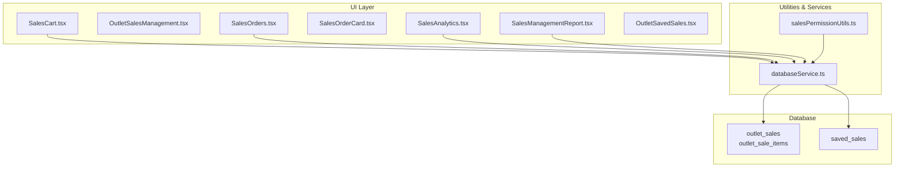

**Diagram sources**
- [SalesCart.tsx:1-120](file://src/pages/SalesCart.tsx#L1-120)
- [OutletSalesManagement.tsx:1-109](file://src/pages/OutletSalesManagement.tsx#L1-109)
- [SalesOrders.tsx:1-120](file://src/pages/SalesOrders.tsx#L1-120)
- [SalesOrderCard.tsx:1-111](file://src/components/SalesOrderCard.tsx#L1-111)
- [SalesAnalytics.tsx:1-120](file://src/pages/SalesAnalytics.tsx#L1-120)
- [SalesManagementReport.tsx:1-120](file://src/pages/SalesManagementReport.tsx#L1-120)
- [OutletSavedSales.tsx:1-98](file://src/pages/OutletSavedSales.tsx#L1-98)
- [salesPermissionUtils.ts:1-171](file://src/utils/salesPermissionUtils.ts#L1-171)
- [databaseService.ts:151-183](file://src/services/databaseService.ts#L151-L183)
- [20260313_create_outlet_sales_table.sql:1-94](file://migrations/20260313_create_outlet_sales_table.sql#L1-L94)
- [20260313_create_saved_sales_table.sql:1-55](file://migrations/20260313_create_saved_sales_table.sql#L1-L55)

**Section sources**
- [SalesCart.tsx:1-120](file://src/pages/SalesCart.tsx#L1-120)
- [OutletSalesManagement.tsx:1-109](file://src/pages/OutletSalesManagement.tsx#L1-109)
- [SalesOrders.tsx:1-120](file://src/pages/SalesOrders.tsx#L1-120)
- [SalesAnalytics.tsx:1-120](file://src/pages/SalesAnalytics.tsx#L1-120)
- [SalesManagementReport.tsx:1-120](file://src/pages/SalesManagementReport.tsx#L1-120)
- [OutletSavedSales.tsx:1-98](file://src/pages/OutletSavedSales.tsx#L1-98)
- [salesPermissionUtils.ts:1-171](file://src/utils/salesPermissionUtils.ts#L1-171)
- [databaseService.ts:151-183](file://src/services/databaseService.ts#L151-L183)
- [20260313_create_outlet_sales_table.sql:1-94](file://migrations/20260313_create_outlet_sales_table.sql#L1-L94)
- [20260313_create_saved_sales_table.sql:1-55](file://migrations/20260313_create_saved_sales_table.sql#L1-L55)

## Core Components
- SalesCart: Real-time product search, cart management, discounts, multiple payment methods, debt handling, stock updates, and receipt generation.
- SalesOrders: CRUD operations for sales orders, filtering, and detailed views.
- SalesAnalytics: Revenue tracking, sales trends, and performance metrics.
- SalesManagementReport: Consolidated reporting across invoices, orders, deliveries, and settlements.
- OutletSalesManagement and OutletSavedSales: Outlet-specific sales management and saved sales categories.
- salesPermissionUtils: Role-based access control for sales operations.
- databaseService: Data models, CRUD functions, and outlet-specific sales tables.

**Section sources**
- [SalesCart.tsx:67-125](file://src/pages/SalesCart.tsx#L67-L125)
- [SalesOrders.tsx:42-80](file://src/pages/SalesOrders.tsx#L42-L80)
- [SalesAnalytics.tsx:114-156](file://src/pages/SalesAnalytics.tsx#L114-L156)
- [SalesManagementReport.tsx:34-84](file://src/pages/SalesManagementReport.tsx#L34-L84)
- [OutletSalesManagement.tsx:26-63](file://src/pages/OutletSalesManagement.tsx#L26-L63)
- [OutletSavedSales.tsx:24-54](file://src/pages/OutletSavedSales.tsx#L24-L54)
- [salesPermissionUtils.ts:8-86](file://src/utils/salesPermissionUtils.ts#L8-L86)
- [databaseService.ts:151-183](file://src/services/databaseService.ts#L151-L183)

## Architecture Overview
The sales system integrates UI components with Supabase-backed services and database tables. Outlet-specific sales are isolated in dedicated tables to support multi-outlet deployments. Access control is enforced via role-based permissions and RLS policies.

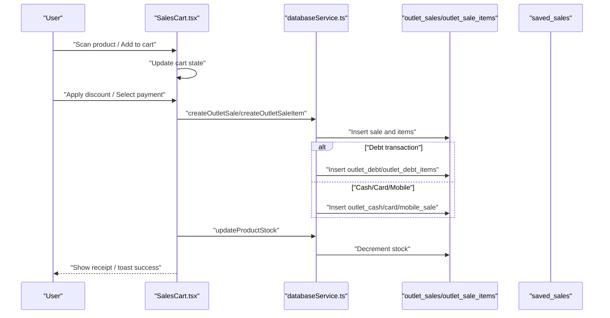

**Diagram sources**
- [SalesCart.tsx:405-800](file://src/pages/SalesCart.tsx#L405-L800)
- [databaseService.ts:151-183](file://src/services/databaseService.ts#L151-L183)
- [20260313_create_outlet_sales_table.sql:4-47](file://migrations/20260313_create_outlet_sales_table.sql#L4-L47)
- [20260313_create_saved_sales_table.sql:1-28](file://migrations/20260313_create_saved_sales_table.sql#L1-L28)

**Section sources**
- [SalesCart.tsx:405-800](file://src/pages/SalesCart.tsx#L405-L800)
- [databaseService.ts:151-183](file://src/services/databaseService.ts#L151-L183)
- [20260313_create_outlet_sales_table.sql:1-94](file://migrations/20260313_create_outlet_sales_table.sql#L1-L94)
- [20260313_create_saved_sales_table.sql:1-55](file://migrations/20260313_create_saved_sales_table.sql#L1-L55)

## Detailed Component Analysis

### Sales Terminal (SalesCart)
The sales terminal enables real-time product scanning, cart management, discount application, and multiple payment methods. It enforces stock limits, validates selling price vs. cost price, calculates tax and totals, handles debt payments, and updates inventory.

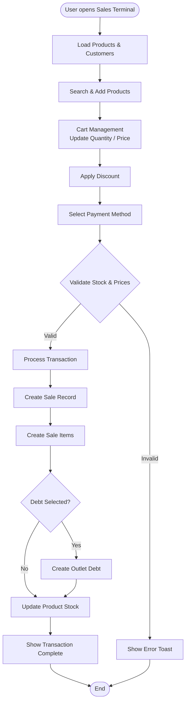

**Diagram sources**
- [SalesCart.tsx:127-214](file://src/pages/SalesCart.tsx#L127-L214)
- [SalesCart.tsx:222-263](file://src/pages/SalesCart.tsx#L222-L263)
- [SalesCart.tsx:357-403](file://src/pages/SalesCart.tsx#L357-L403)
- [SalesCart.tsx:405-800](file://src/pages/SalesCart.tsx#L405-L800)

**Section sources**
- [SalesCart.tsx:67-125](file://src/pages/SalesCart.tsx#L67-L125)
- [SalesCart.tsx:127-214](file://src/pages/SalesCart.tsx#L127-L214)
- [SalesCart.tsx:222-263](file://src/pages/SalesCart.tsx#L222-L263)
- [SalesCart.tsx:357-403](file://src/pages/SalesCart.tsx#L357-L403)
- [SalesCart.tsx:405-800](file://src/pages/SalesCart.tsx#L405-L800)

### Sales Orders Management
The sales orders module provides CRUD operations for sales orders, including creation, updates, and deletions with password confirmation for administrative actions. It supports filtering, searching, and detailed views.

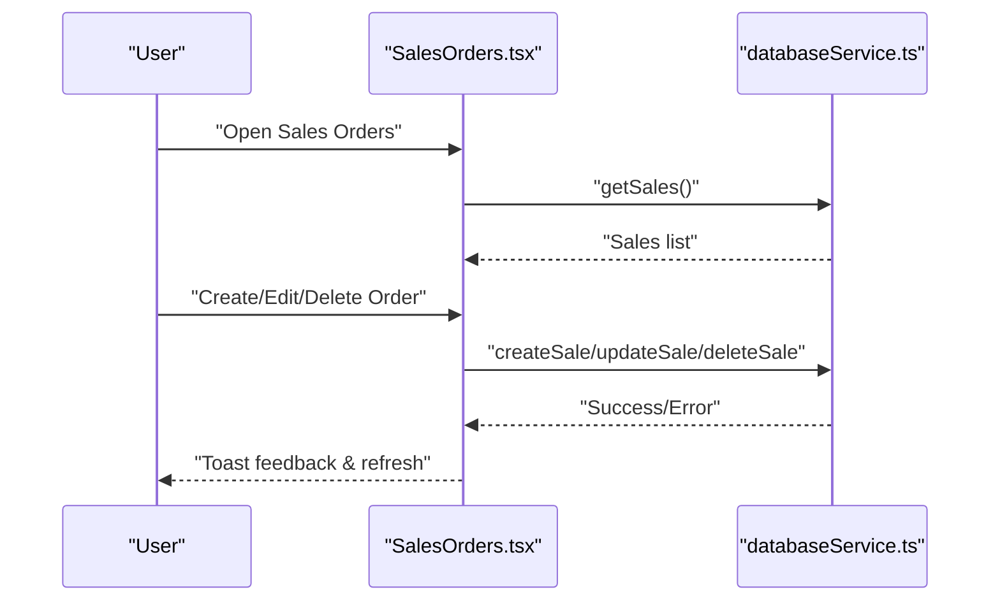

**Diagram sources**
- [SalesOrders.tsx:82-136](file://src/pages/SalesOrders.tsx#L82-L136)
- [SalesOrders.tsx:138-240](file://src/pages/SalesOrders.tsx#L138-L240)
- [SalesOrders.tsx:332-450](file://src/pages/SalesOrders.tsx#L332-L450)
- [databaseService.ts:151-183](file://src/services/databaseService.ts#L151-L183)

**Section sources**
- [SalesOrders.tsx:42-80](file://src/pages/SalesOrders.tsx#L42-L80)
- [SalesOrders.tsx:82-136](file://src/pages/SalesOrders.tsx#L82-L136)
- [SalesOrders.tsx:138-240](file://src/pages/SalesOrders.tsx#L138-L240)
- [SalesOrders.tsx:332-450](file://src/pages/SalesOrders.tsx#L332-L450)
- [SALES_ORDERS_CRUD.md:1-176](file://src/docs/SALES_ORDERS_CRUD.md#L1-L176)

### Sales Analytics Dashboard
The analytics dashboard tracks revenue, transactions, average order value, customer retention, and payment method distribution. It fetches daily sales, category performance, and product performance data.

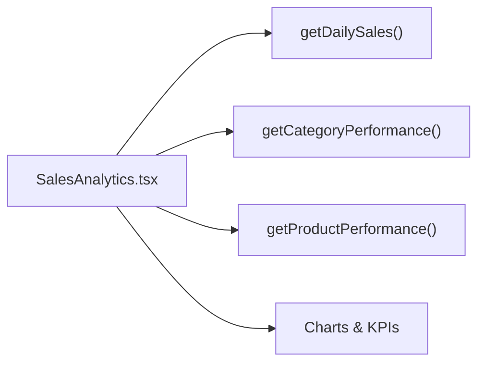

**Diagram sources**
- [SalesAnalytics.tsx:130-156](file://src/pages/SalesAnalytics.tsx#L130-L156)
- [SalesAnalytics.tsx:158-167](file://src/pages/SalesAnalytics.tsx#L158-L167)

**Section sources**
- [SalesAnalytics.tsx:114-156](file://src/pages/SalesAnalytics.tsx#L114-L156)
- [SalesAnalytics.tsx:158-167](file://src/pages/SalesAnalytics.tsx#L158-L167)

### Sales Management Report
The sales management report consolidates invoices, deliveries, sales orders, and customer settlements within a date range, calculating key metrics such as total sales, pending orders, outstanding debt, and average order value.

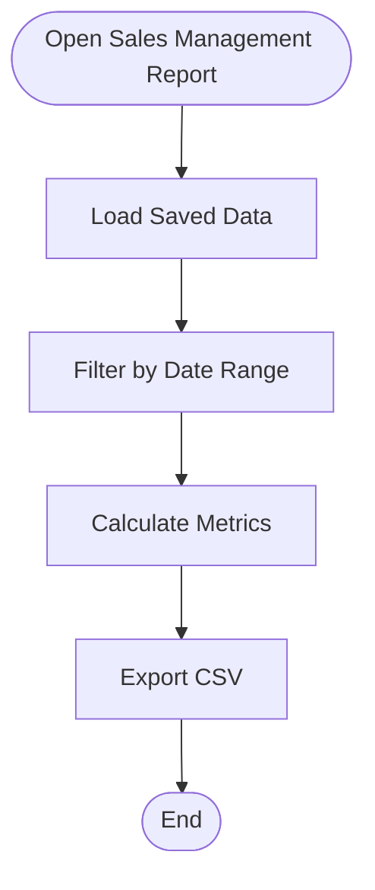

**Diagram sources**
- [SalesManagementReport.tsx:60-84](file://src/pages/SalesManagementReport.tsx#L60-L84)
- [SalesManagementReport.tsx:86-98](file://src/pages/SalesManagementReport.tsx#L86-L98)
- [SalesManagementReport.tsx:99-125](file://src/pages/SalesManagementReport.tsx#L99-L125)
- [SalesManagementReport.tsx:167-193](file://src/pages/SalesManagementReport.tsx#L167-L193)

**Section sources**
- [SalesManagementReport.tsx:34-84](file://src/pages/SalesManagementReport.tsx#L34-L84)
- [SalesManagementReport.tsx:86-98](file://src/pages/SalesManagementReport.tsx#L86-L98)
- [SalesManagementReport.tsx:99-125](file://src/pages/SalesManagementReport.tsx#L99-L125)
- [SalesManagementReport.tsx:167-193](file://src/pages/SalesManagementReport.tsx#L167-L193)

### Outlet Sales Management
Outlet-specific sales management provides navigation to sales terminal, orders, saved sales, customers, and stock takes. Saved sales are categorized by payment method and debt.

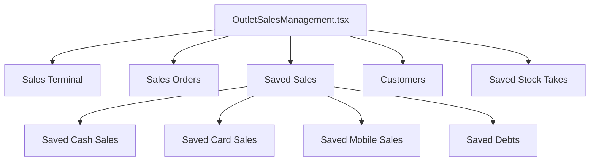

**Diagram sources**
- [OutletSalesManagement.tsx:26-63](file://src/pages/OutletSalesManagement.tsx#L26-L63)
- [OutletSavedSales.tsx:24-54](file://src/pages/OutletSavedSales.tsx#L24-L54)

**Section sources**
- [OutletSalesManagement.tsx:26-63](file://src/pages/OutletSalesManagement.tsx#L26-L63)
- [OutletSavedSales.tsx:24-54](file://src/pages/OutletSavedSales.tsx#L24-L54)

### Restricted Sales Access
Restricted sales access ensures only authorized personnel can process sales transactions. Access is controlled via role-based permissions and user authentication.

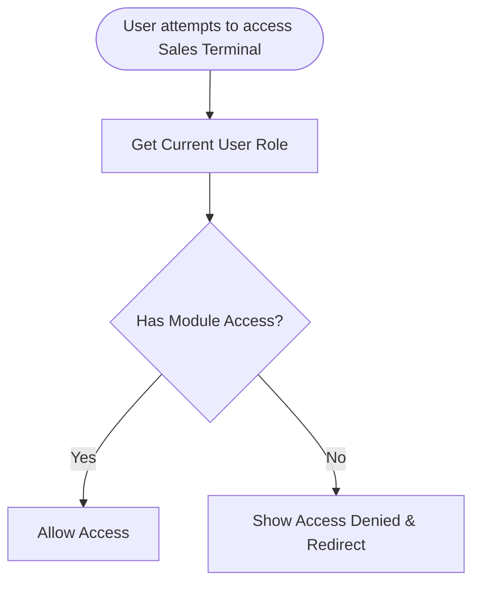

**Diagram sources**
- [salesPermissionUtils.ts:26-86](file://src/utils/salesPermissionUtils.ts#L26-L86)
- [SalesCart.tsx:110-125](file://src/pages/SalesCart.tsx#L110-L125)
- [RESTRICTED_SALES_ACCESS.md](file://RESTRICTED_SALES_ACCESS.md)

**Section sources**
- [salesPermissionUtils.ts:8-86](file://src/utils/salesPermissionUtils.ts#L8-L86)
- [SalesCart.tsx:110-125](file://src/pages/SalesCart.tsx#L110-L125)
- [RESTRICTED_SALES_ACCESS.md](file://RESTRICTED_SALES_ACCESS.md)

### Sales Cart Functionality
The sales cart manages product selection, quantity adjustments, price modifications, discount calculations, shipping costs, adjustments, and tax display. It validates stock availability and selling price vs. cost price.

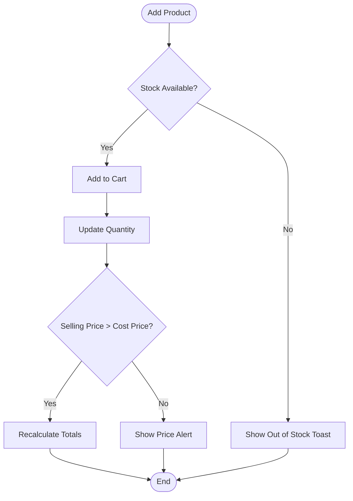

**Diagram sources**
- [SalesCart.tsx:222-263](file://src/pages/SalesCart.tsx#L222-L263)
- [SalesCart.tsx:265-287](file://src/pages/SalesCart.tsx#L265-L287)
- [SalesCart.tsx:382-400](file://src/pages/SalesCart.tsx#L382-L400)

**Section sources**
- [SalesCart.tsx:222-263](file://src/pages/SalesCart.tsx#L222-L263)
- [SalesCart.tsx:265-287](file://src/pages/SalesCart.tsx#L265-L287)
- [SalesCart.tsx:382-400](file://src/pages/SalesCart.tsx#L382-L400)

### Customer Association and Sales History
Customer association is supported for debt transactions and order history. Sales history is managed via saved sales tables and outlet-specific sales records.

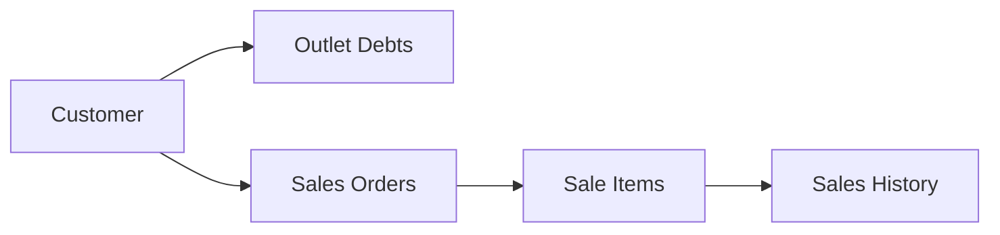

**Diagram sources**
- [databaseService.ts:151-183](file://src/services/databaseService.ts#L151-L183)
- [20260313_create_outlet_sales_table.sql:4-47](file://migrations/20260313_create_outlet_sales_table.sql#L4-L47)
- [20260313_create_saved_sales_table.sql:1-28](file://migrations/20260313_create_saved_sales_table.sql#L1-L28)

**Section sources**
- [databaseService.ts:151-183](file://src/services/databaseService.ts#L151-L183)
- [20260313_create_outlet_sales_table.sql:1-94](file://migrations/20260313_create_outlet_sales_table.sql#L1-L94)
- [20260313_create_saved_sales_table.sql:1-55](file://migrations/20260313_create_saved_sales_table.sql#L1-L55)

### Tax Calculations and Reporting
Tax is displayed as 18% for informational purposes on subtotal after discount. Reporting aggregates totals, orders, deliveries, and settlements with export capabilities.

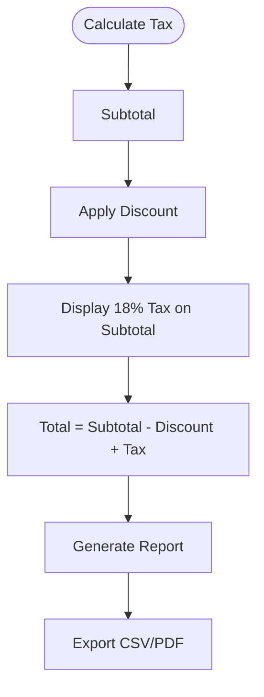

**Diagram sources**
- [SalesCart.tsx:313-315](file://src/pages/SalesCart.tsx#L313-L315)
- [SalesAnalytics.tsx:158-167](file://src/pages/SalesAnalytics.tsx#L158-L167)
- [SalesManagementReport.tsx:167-193](file://src/pages/SalesManagementReport.tsx#L167-L193)

**Section sources**
- [SalesCart.tsx:313-315](file://src/pages/SalesCart.tsx#L313-L315)
- [SalesAnalytics.tsx:158-167](file://src/pages/SalesAnalytics.tsx#L158-L167)
- [SalesManagementReport.tsx:167-193](file://src/pages/SalesManagementReport.tsx#L167-L193)

### Integration with Inventory Systems
Outlet-specific sales integrate with inventory by updating stock quantities upon transaction completion. The system distinguishes between general products and outlet inventory.

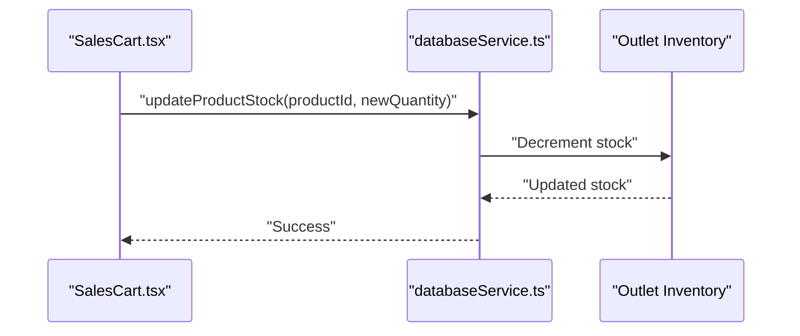

**Diagram sources**
- [SalesCart.tsx:793-800](file://src/pages/SalesCart.tsx#L793-L800)
- [databaseService.ts:676-709](file://src/services/databaseService.ts#L676-L709)

**Section sources**
- [SalesCart.tsx:793-800](file://src/pages/SalesCart.tsx#L793-L800)
- [databaseService.ts:676-709](file://src/services/databaseService.ts#L676-L709)

## Dependency Analysis
The sales system exhibits clear separation of concerns:
- UI components depend on databaseService for data operations
- databaseService encapsulates Supabase interactions and data models
- Outlet-specific tables isolate sales data per location
- Permission utilities enforce access control

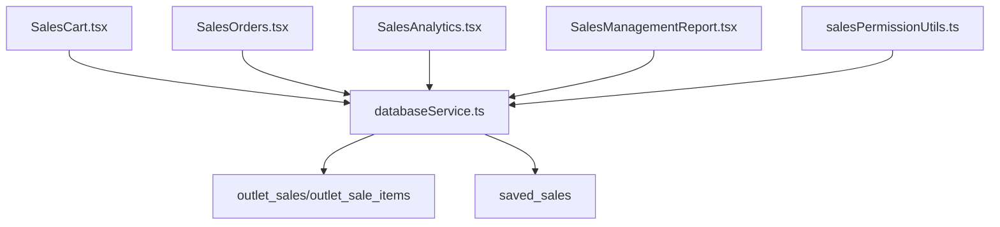

**Diagram sources**
- [SalesCart.tsx:20-24](file://src/pages/SalesCart.tsx#L20-L24)
- [SalesOrders.tsx:14-18](file://src/pages/SalesOrders.tsx#L14-L18)
- [SalesAnalytics.tsx:23-23](file://src/pages/SalesAnalytics.tsx#L23-L23)
- [SalesManagementReport.tsx:21-24](file://src/pages/SalesManagementReport.tsx#L21-L24)
- [salesPermissionUtils.ts:1-2](file://src/utils/salesPermissionUtils.ts#L1-L2)
- [databaseService.ts:1-14](file://src/services/databaseService.ts#L1-L14)
- [20260313_create_outlet_sales_table.sql:1-94](file://migrations/20260313_create_outlet_sales_table.sql#L1-L94)
- [20260313_create_saved_sales_table.sql:1-55](file://migrations/20260313_create_saved_sales_table.sql#L1-L55)

**Section sources**
- [SalesCart.tsx:20-24](file://src/pages/SalesCart.tsx#L20-L24)
- [SalesOrders.tsx:14-18](file://src/pages/SalesOrders.tsx#L14-L18)
- [SalesAnalytics.tsx:23-23](file://src/pages/SalesAnalytics.tsx#L23-L23)
- [SalesManagementReport.tsx:21-24](file://src/pages/SalesManagementReport.tsx#L21-L24)
- [salesPermissionUtils.ts:1-2](file://src/utils/salesPermissionUtils.ts#L1-L2)
- [databaseService.ts:1-14](file://src/services/databaseService.ts#L1-L14)
- [20260313_create_outlet_sales_table.sql:1-94](file://migrations/20260313_create_outlet_sales_table.sql#L1-L94)
- [20260313_create_saved_sales_table.sql:1-55](file://migrations/20260313_create_saved_sales_table.sql#L1-L55)

## Performance Considerations
- Parallel operations: Sale items creation and stock updates are executed concurrently to reduce latency.
- Outlet-specific isolation: Dedicated tables minimize cross-outlet contention and simplify scaling.
- Indexing: Strategic indexes on outlet_sales and saved_sales improve query performance.
- Client-side filtering: Reduces server load by filtering data locally after initial fetch.
- Memoization: Derived statistics in reports avoid repeated computations.

[No sources needed since this section provides general guidance]

## Troubleshooting Guide
Common issues and resolutions:
- Access Denied: Verify user role and module permissions via salesPermissionUtils.
- Insufficient Stock: Ensure product quantity does not exceed available stock before checkout.
- Price Below Cost: Adjust selling price to be greater than cost price.
- Payment Shortage: Confirm amount received meets or exceeds total for cash payments.
- Debt Validation: Provide customer details and ensure credit limit is sufficient for debt transactions.
- Data Loading Failures: Check network connectivity and toast notifications for error messages.
- Deletion Requires Admin: Use password confirmation for sales order deletion.

**Section sources**
- [salesPermissionUtils.ts:8-86](file://src/utils/salesPermissionUtils.ts#L8-L86)
- [SalesCart.tsx:367-400](file://src/pages/SalesCart.tsx#L367-L400)
- [SalesCart.tsx:490-497](file://src/pages/SalesCart.tsx#L490-L497)
- [SalesOrders.tsx:332-356](file://src/pages/SalesOrders.tsx#L332-L356)
- [SalesOrders.tsx:358-450](file://src/pages/SalesOrders.tsx#L358-L450)

## Conclusion
Royal POS Modern’s sales management system provides a robust, scalable solution for retail operations with real-time product scanning, flexible payment methods, outlet-specific isolation, comprehensive analytics, and strict access controls. The modular architecture and well-defined data flows enable efficient development and maintenance while supporting multi-outlet deployments and accurate financial reporting.

## Appendices
- Practical Scenarios:
  - Cash Sale: Scan items → Apply discount → Enter amount received → Print receipt.
  - Debt Transaction: Select customer → Enter debt payment → Create debt record → Update balances.
  - Sales Order Creation: Select customer → Add items → Set status → Save order.
  - Analytics Review: Filter by date range → Review KPIs and charts → Export report.
- Best Practices:
  - Validate stock and pricing before checkout.
  - Use outlet-specific terminals for accurate inventory tracking.
  - Regularly review analytics for performance insights.
  - Enforce role-based access for sensitive operations.

[No sources needed since this section provides general guidance]