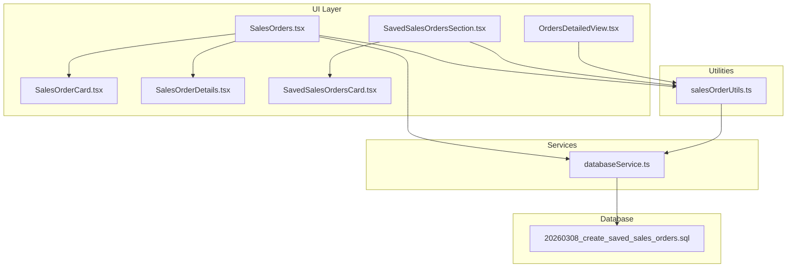
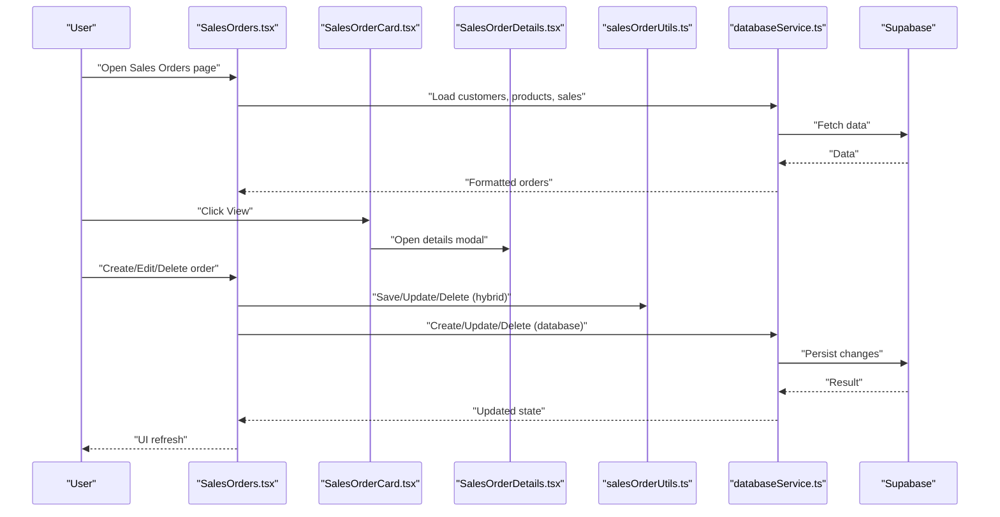
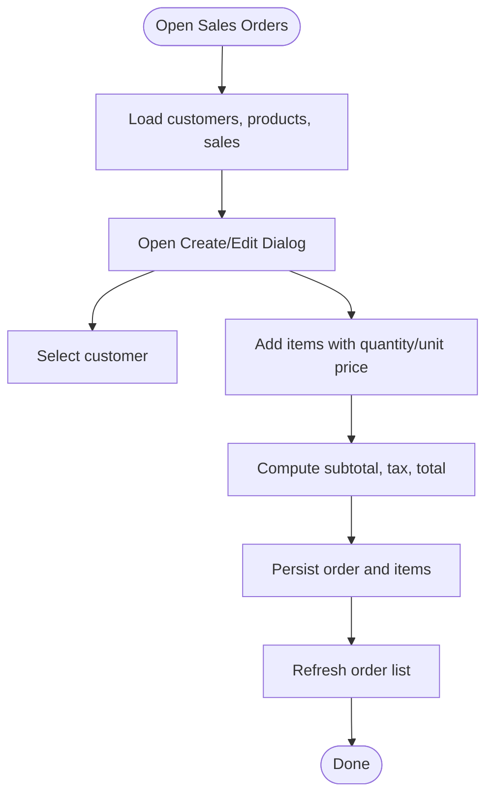
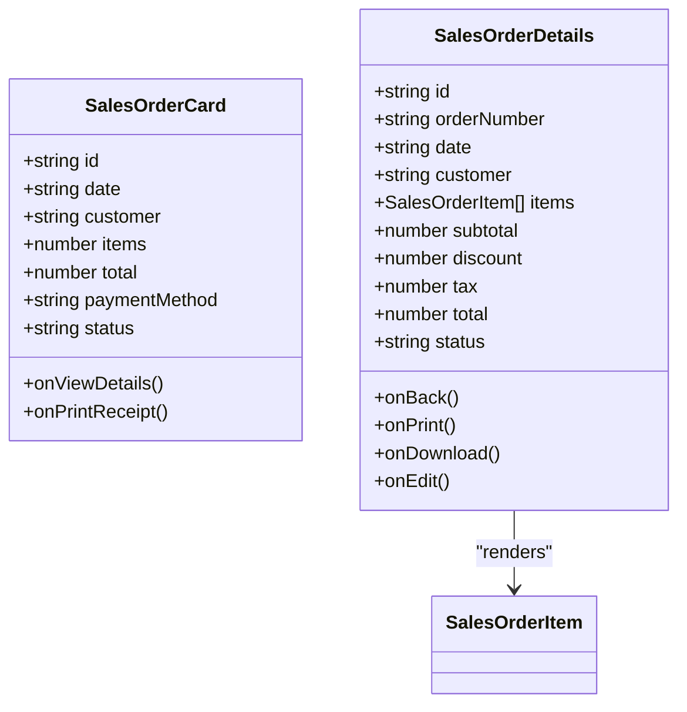
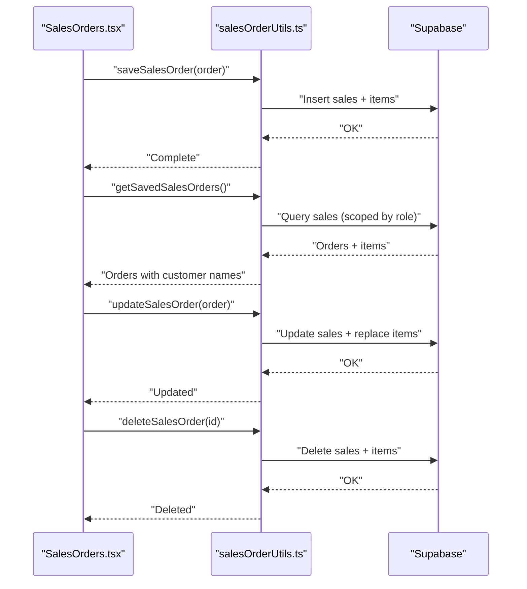
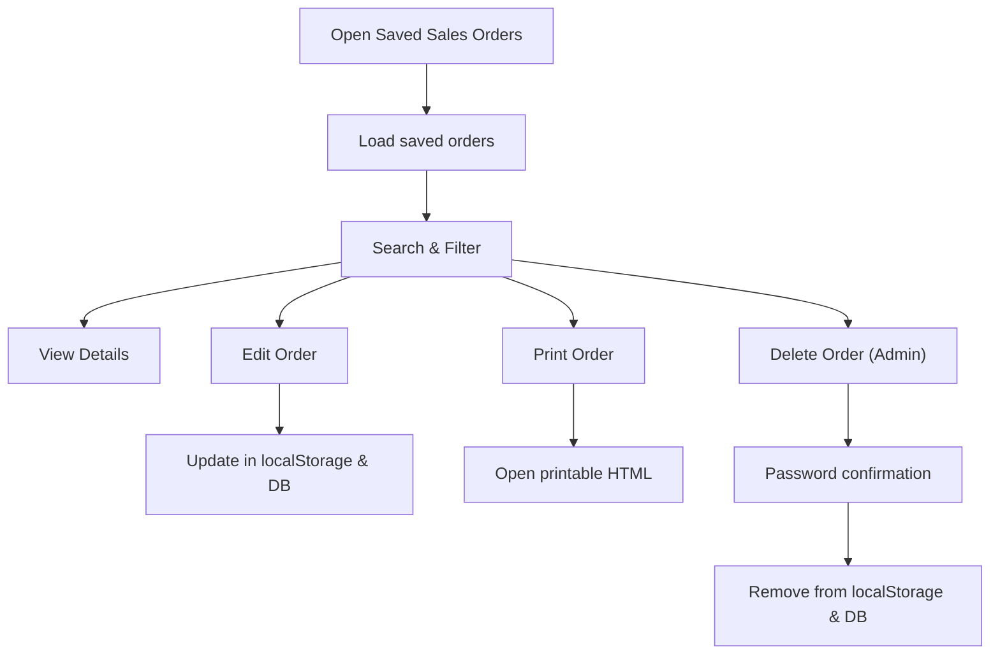
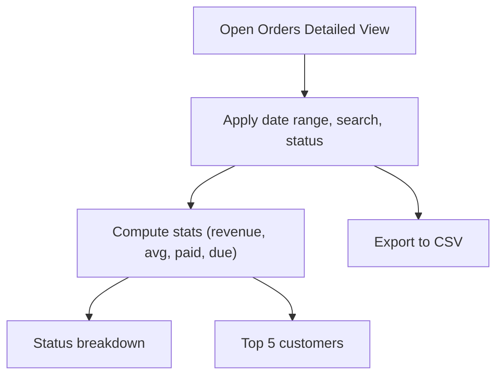
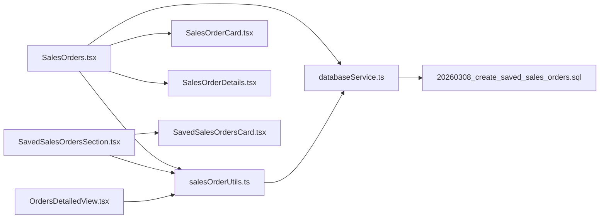
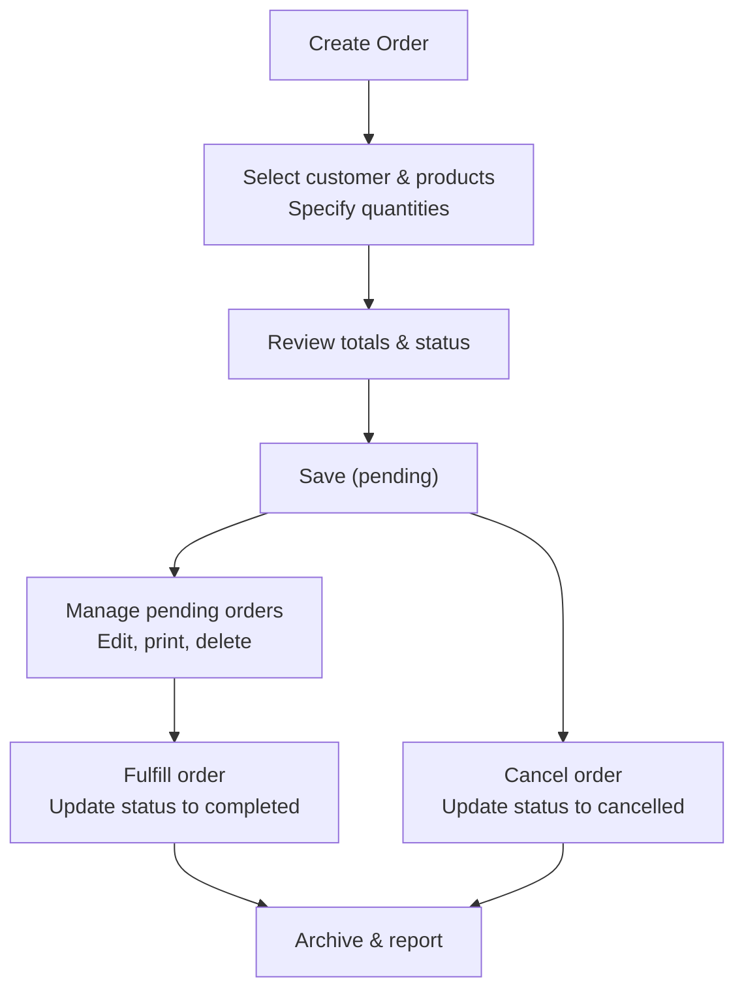

# Sales Orders Management

<cite>
**Referenced Files in This Document**
- [SALES_ORDERS_CRUD.md](file://src/docs/SALES_ORDERS_CRUD.md)
- [SALES_ORDER_CARD.md](file://src/docs/SALES_ORDER_CARD.md)
- [SalesOrders.tsx](file://src/pages/SalesOrders.tsx)
- [SalesOrderCard.tsx](file://src/components/SalesOrderCard.tsx)
- [SalesOrderDetails.tsx](file://src/components/SalesOrderDetails.tsx)
- [salesOrderUtils.ts](file://src/utils/salesOrderUtils.ts)
- [SavedSalesOrdersCard.tsx](file://src/components/SavedSalesOrdersCard.tsx)
- [SavedSalesOrdersSection.tsx](file://src/components/SavedSalesOrdersSection.tsx)
- [OrdersDetailedView.tsx](file://src/pages/OrdersDetailedView.tsx)
- [databaseService.ts](file://src/services/databaseService.ts)
- [20260308_create_saved_sales_orders.sql](file://migrations/20260308_create_saved_sales_orders.sql)
</cite>

## Table of Contents
1. [Introduction](#introduction)
2. [Project Structure](#project-structure)
3. [Core Components](#core-components)
4. [Architecture Overview](#architecture-overview)
5. [Detailed Component Analysis](#detailed-component-analysis)
6. [Dependency Analysis](#dependency-analysis)
7. [Performance Considerations](#performance-considerations)
8. [Troubleshooting Guide](#troubleshooting-guide)
9. [Conclusion](#conclusion)
10. [Appendices](#appendices)

## Introduction
This document provides comprehensive guidance for the Sales Orders Management module within the POS Modern system. It covers the complete order lifecycle from creation to fulfillment, including product selection, quantity specification, customer association, modifications, cancellations, tracking, search and filtering, detailed views, integrations with inventory and payments, archiving and reporting, and bulk/template-based operations. The documentation synthesizes the existing implementation details and highlights practical usage patterns, UI flows, and backend integrations.

## Project Structure
The Sales Orders Management feature spans UI components, page containers, utilities, and database services. Key areas include:
- Page-level management for creating, viewing, editing, and deleting sales orders
- Reusable UI cards and details panels
- Local and database-backed persistence utilities
- Reporting and analytics page for order insights
- Database schema supporting persisted sales orders with status tracking

**Diagram sources**
- [SalesOrders.tsx:1-800](file://src/pages/SalesOrders.tsx#L1-L800)
- [SalesOrderCard.tsx:1-111](file://src/components/SalesOrderCard.tsx#L1-L111)
- [SalesOrderDetails.tsx:1-281](file://src/components/SalesOrderDetails.tsx#L1-L281)
- [SavedSalesOrdersCard.tsx:1-380](file://src/components/SavedSalesOrdersCard.tsx#L1-L380)
- [SavedSalesOrdersSection.tsx:1-616](file://src/components/SavedSalesOrdersSection.tsx#L1-L616)
- [OrdersDetailedView.tsx:1-399](file://src/pages/OrdersDetailedView.tsx#L1-L399)
- [salesOrderUtils.ts:1-310](file://src/utils/salesOrderUtils.ts#L1-L310)
- [databaseService.ts:151-183](file://src/services/databaseService.ts#L151-L183)
- [20260308_create_saved_sales_orders.sql:1-113](file://migrations/20260308_create_saved_sales_orders.sql#L1-L113)

**Section sources**
- [SALES_ORDER_CARD.md:1-141](file://src/docs/SALES_ORDER_CARD.md#L1-L141)
- [SALES_ORDERS_CRUD.md:1-176](file://src/docs/SALES_ORDERS_CRUD.md#L1-L176)

## Core Components
- SalesOrders page: Manages order creation/editing/viewing, customer/product selection, itemization, totals computation, and deletion with role-based protection.
- SalesOrderCard: Displays summarized order information with status badges and action buttons.
- SalesOrderDetails: Presents detailed order information including items, pricing, totals, and actions.
- salesOrderUtils: Provides persistence utilities for saved orders (local and database), including save, load, update, and delete operations.
- SavedSalesOrdersSection and SavedSalesOrdersCard: Offer a dedicated section for pending orders with search, print, and secure deletion.
- OrdersDetailedView: Aggregates order analytics, filters, and exports.

**Section sources**
- [SalesOrders.tsx:1-800](file://src/pages/SalesOrders.tsx#L1-L800)
- [SalesOrderCard.tsx:1-111](file://src/components/SalesOrderCard.tsx#L1-L111)
- [SalesOrderDetails.tsx:1-281](file://src/components/SalesOrderDetails.tsx#L1-L281)
- [salesOrderUtils.ts:1-310](file://src/utils/salesOrderUtils.ts#L1-L310)
- [SavedSalesOrdersSection.tsx:1-616](file://src/components/SavedSalesOrdersSection.tsx#L1-L616)
- [SavedSalesOrdersCard.tsx:1-380](file://src/components/SavedSalesOrdersCard.tsx#L1-L380)
- [OrdersDetailedView.tsx:1-399](file://src/pages/OrdersDetailedView.tsx#L1-L399)

## Architecture Overview
The Sales Orders Management architecture integrates UI components with data services and persistence utilities. The page orchestrates state, user interactions, and data fetching. The database service abstracts Supabase operations, while utilities manage hybrid persistence (localStorage + database). The schema migration defines the persisted model for sales orders and items.

**Diagram sources**
- [SalesOrders.tsx:1-800](file://src/pages/SalesOrders.tsx#L1-L800)
- [SalesOrderCard.tsx:1-111](file://src/components/SalesOrderCard.tsx#L1-L111)
- [SalesOrderDetails.tsx:1-281](file://src/components/SalesOrderDetails.tsx#L1-L281)
- [salesOrderUtils.ts:1-310](file://src/utils/salesOrderUtils.ts#L1-L310)
- [databaseService.ts:151-183](file://src/services/databaseService.ts#L151-L183)

## Detailed Component Analysis

### Sales Orders Page (Creation, Modification, Deletion)
- Loads customers and products for selection.
- Supports adding/removing items with quantity and unit price.
- Computes subtotal, tax (18%), and total.
- Persists order and items to database and local storage.
- Provides role-based deletion with password confirmation for admin users.
- Supports viewing order details and printing receipts.

**Diagram sources**
- [SalesOrders.tsx:138-240](file://src/pages/SalesOrders.tsx#L138-L240)
- [SalesOrders.tsx:242-330](file://src/pages/SalesOrders.tsx#L242-L330)
- [SalesOrders.tsx:332-450](file://src/pages/SalesOrders.tsx#L332-L450)

**Section sources**
- [SalesOrders.tsx:1-800](file://src/pages/SalesOrders.tsx#L1-L800)

### Sales Order Card and Details
- SalesOrderCard: Displays order number, date, customer, item count, total, payment method, status, and action buttons (View, Print).
- SalesOrderDetails: Shows customer info, itemized list, pricing breakdown (subtotal, discount, tax, total), payment status, notes, and actions (Back, Edit, Print, Download).

**Diagram sources**
- [SalesOrderCard.tsx:1-111](file://src/components/SalesOrderCard.tsx#L1-L111)
- [SalesOrderDetails.tsx:1-281](file://src/components/SalesOrderDetails.tsx#L1-L281)

**Section sources**
- [SalesOrderCard.tsx:1-111](file://src/components/SalesOrderCard.tsx#L1-L111)
- [SalesOrderDetails.tsx:1-281](file://src/components/SalesOrderDetails.tsx#L1-L281)

### Persistence Utilities (Hybrid: localStorage + Database)
- saveSalesOrder: Saves to localStorage immediately and to database asynchronously with user context.
- getSavedSalesOrders: Loads from database (with admin-aware scoping) and falls back to localStorage.
- updateSalesOrder: Updates both localStorage and database, including items replacement.
- deleteSalesOrder: Removes from both localStorage and database, with cascading item deletion.

**Diagram sources**
- [salesOrderUtils.ts:24-84](file://src/utils/salesOrderUtils.ts#L24-L84)
- [salesOrderUtils.ts:86-201](file://src/utils/salesOrderUtils.ts#L86-L201)
- [salesOrderUtils.ts:248-310](file://src/utils/salesOrderUtils.ts#L248-L310)

**Section sources**
- [salesOrderUtils.ts:1-310](file://src/utils/salesOrderUtils.ts#L1-L310)

### Saved Sales Orders Section and Card
- SavedSalesOrdersSection: Lists saved orders with search by order number/customer/date, prints orders, edits totals/status/items, and deletes with admin password confirmation.
- SavedSalesOrdersCard: Renders order summary, expands to show items, and provides View, Print, and Delete actions with role checks.

**Diagram sources**
- [SavedSalesOrdersSection.tsx:1-616](file://src/components/SavedSalesOrdersSection.tsx#L1-L616)
- [SavedSalesOrdersCard.tsx:1-380](file://src/components/SavedSalesOrdersCard.tsx#L1-L380)

**Section sources**
- [SavedSalesOrdersSection.tsx:1-616](file://src/components/SavedSalesOrdersSection.tsx#L1-L616)
- [SavedSalesOrdersCard.tsx:1-380](file://src/components/SavedSalesOrdersCard.tsx#L1-L380)

### Orders Detailed Analytics
- OrdersDetailedView: Provides date-range filtering, search by customer/order, status filtering, and export to CSV.
- Calculates revenue, average order, total paid, outstanding amounts, status breakdown, and top customers.

**Diagram sources**
- [OrdersDetailedView.tsx:1-399](file://src/pages/OrdersDetailedView.tsx#L1-L399)

**Section sources**
- [OrdersDetailedView.tsx:1-399](file://src/pages/OrdersDetailedView.tsx#L1-L399)

## Dependency Analysis
- UI components depend on shared UI primitives and currency formatting utilities.
- SalesOrders page depends on databaseService for CRUD operations and on salesOrderUtils for hybrid persistence.
- SavedSalesOrdersSection depends on salesOrderUtils and uses SavedSalesOrdersCard for rendering.
- databaseService exposes typed interfaces for Sale and SaleItem, aligning with the persisted schema.
- The schema migration ensures presence of sale_status, items count, product_name denormalization, and unit fields, plus indexes for performance.

**Diagram sources**
- [SalesOrders.tsx:1-800](file://src/pages/SalesOrders.tsx#L1-L800)
- [databaseService.ts:151-183](file://src/services/databaseService.ts#L151-L183)
- [salesOrderUtils.ts:1-310](file://src/utils/salesOrderUtils.ts#L1-L310)
- [20260308_create_saved_sales_orders.sql:1-113](file://migrations/20260308_create_saved_sales_orders.sql#L1-L113)

**Section sources**
- [databaseService.ts:151-183](file://src/services/databaseService.ts#L151-L183)
- [20260308_create_saved_sales_orders.sql:1-113](file://migrations/20260308_create_saved_sales_orders.sql#L1-L113)

## Performance Considerations
- Hybrid persistence: Immediate localStorage writes ensure responsiveness; database writes occur asynchronously to avoid blocking UI.
- Indexes: sale_status, sale_date, and composite indexes improve filtering and sorting performance.
- Client-side filtering reduces server requests; pagination can be considered for very large datasets.
- Currency formatting and computed totals are handled efficiently in components.

[No sources needed since this section provides general guidance]

## Troubleshooting Guide
- Authentication failures during deletion: The deletion flow requires re-authentication; ensure the correct password is entered and the user is logged in.
- Role restrictions: Non-admin users cannot delete orders; the UI hides delete actions accordingly.
- Data loading errors: The UI displays toast notifications and falls back to cached data when database queries fail.
- Totals mismatch: Verify computed subtotal, tax, and total logic in the page and utilities.

**Section sources**
- [SalesOrders.tsx:332-450](file://src/pages/SalesOrders.tsx#L332-L450)
- [SavedSalesOrdersCard.tsx:101-154](file://src/components/SavedSalesOrdersCard.tsx#L101-L154)
- [salesOrderUtils.ts:203-246](file://src/utils/salesOrderUtils.ts#L203-L246)

## Conclusion
The Sales Orders Management module provides a robust, user-friendly system for end-to-end order lifecycle management. It combines intuitive UI components with reliable persistence, comprehensive filtering and reporting, and secure administrative controls. The modular design enables easy extension for advanced features such as bulk operations, templates, and deeper inventory integration.

[No sources needed since this section summarizes without analyzing specific files]

## Appendices

### Order Lifecycle Workflow

[No sources needed since this diagram shows conceptual workflow, not actual code structure]

### Supported Status Values
- pending: Order created but not fulfilled.
- completed: Order fulfilled.
- cancelled: Order rejected.

**Section sources**
- [20260308_create_saved_sales_orders.sql:96-99](file://migrations/20260308_create_saved_sales_orders.sql#L96-L99)