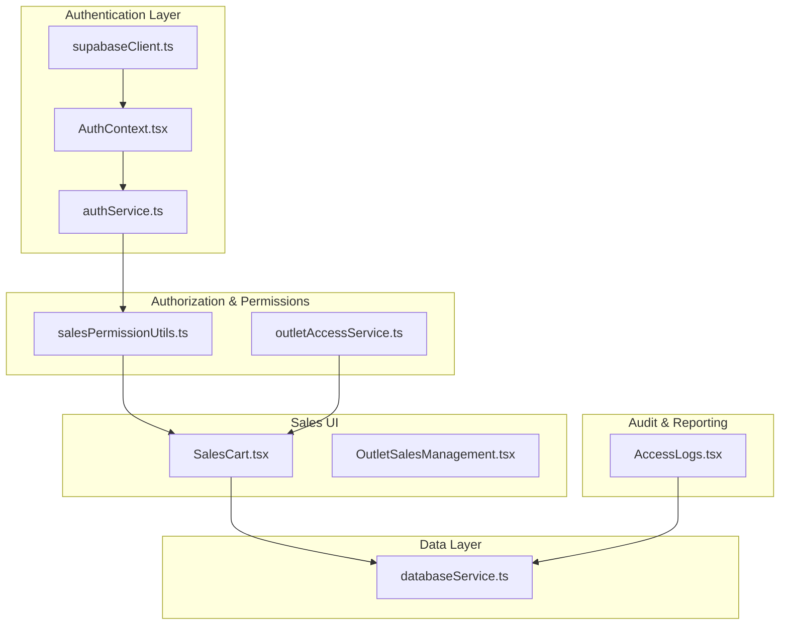
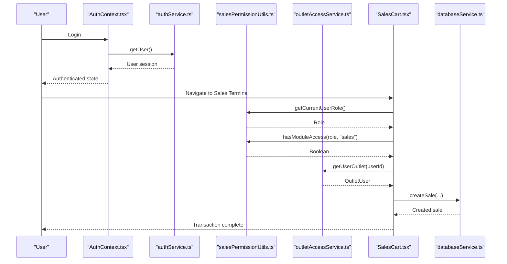
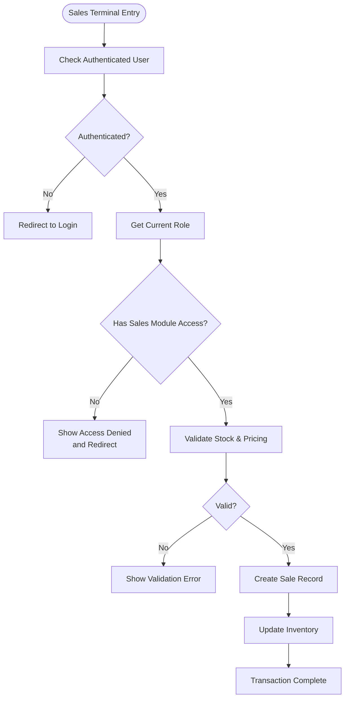
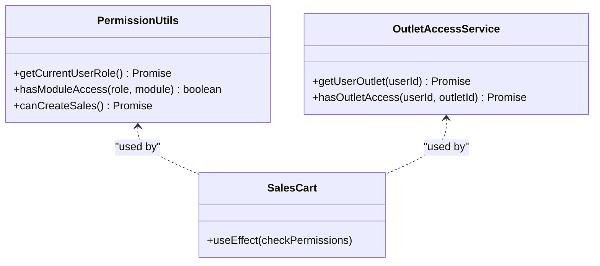
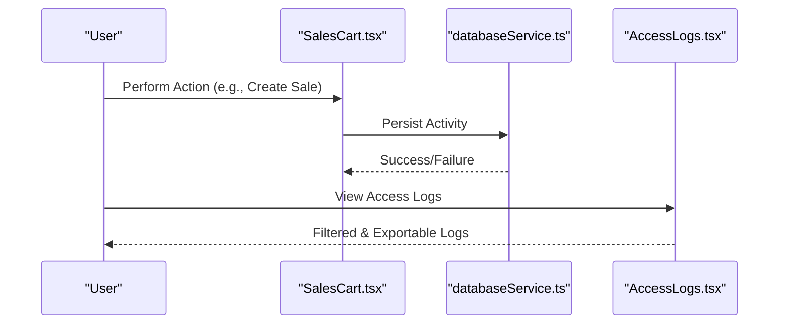
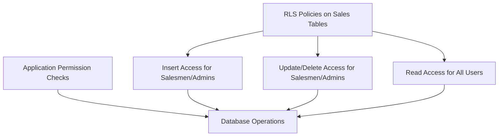
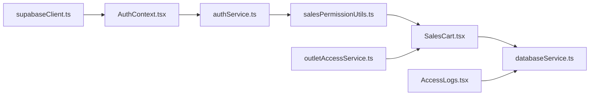

# Sales Permissions and Access Control

<cite>
**Referenced Files in This Document**
- [salesPermissionUtils.ts](file://src/utils/salesPermissionUtils.ts)
- [authService.ts](file://src/services/authService.ts)
- [AuthContext.tsx](file://src/contexts/AuthContext.tsx)
- [ProtectedRoute.tsx](file://src/components/ProtectedRoute.tsx)
- [outletAccessService.ts](file://src/services/outletAccessService.ts)
- [supabaseClient.ts](file://src/lib/supabaseClient.ts)
- [SalesCart.tsx](file://src/pages/SalesCart.tsx)
- [OutletSalesManagement.tsx](file://src/pages/OutletSalesManagement.tsx)
- [AccessLogs.tsx](file://src/pages/AccessLogs.tsx)
- [databaseService.ts](file://src/services/databaseService.ts)
- [SALES_PERMISSION_IMPLEMENTATION.md](file://SALES_PERMISSION_IMPLEMENTATION.md)
- [STAFF_ACCESS_CONTROL.md](file://STAFF_ACCESS_CONTROL.md)
</cite>

## Table of Contents
1. [Introduction](#introduction)
2. [Project Structure](#project-structure)
3. [Core Components](#core-components)
4. [Architecture Overview](#architecture-overview)
5. [Detailed Component Analysis](#detailed-component-analysis)
6. [Dependency Analysis](#dependency-analysis)
7. [Performance Considerations](#performance-considerations)
8. [Troubleshooting Guide](#troubleshooting-guide)
9. [Conclusion](#conclusion)
10. [Appendices](#appendices)

## Introduction
This document explains the role-based security system for sales operations in the POS application. It defines the permission matrix for admin, manager, cashier, and staff roles, details sales-specific restrictions, module-level access control, transaction-level permissions, audit logging, escalation and approval workflows, and integration with Supabase RLS policies. Guidance is included for onboarding, troubleshooting, and maintaining security compliance.

## Project Structure
The sales permissions and access control system spans authentication, authorization utilities, outlet scoping, sales UI components, and audit logging. The following diagram maps the key modules and their interactions.

**Diagram sources**
- [supabaseClient.ts:1-33](file://src/lib/supabaseClient.ts#L1-L33)
- [AuthContext.tsx:1-118](file://src/contexts/AuthContext.tsx#L1-L118)
- [authService.ts:1-127](file://src/services/authService.ts#L1-L127)
- [salesPermissionUtils.ts:1-171](file://src/utils/salesPermissionUtils.ts#L1-L171)
- [outletAccessService.ts:1-98](file://src/services/outletAccessService.ts#L1-L98)
- [SalesCart.tsx:1-800](file://src/pages/SalesCart.tsx#L1-L800)
- [OutletSalesManagement.tsx:1-109](file://src/pages/OutletSalesManagement.tsx#L1-L109)
- [AccessLogs.tsx:1-334](file://src/pages/AccessLogs.tsx#L1-L334)
- [databaseService.ts:1-800](file://src/services/databaseService.ts#L1-L800)

**Section sources**
- [supabaseClient.ts:1-33](file://src/lib/supabaseClient.ts#L1-L33)
- [AuthContext.tsx:1-118](file://src/contexts/AuthContext.tsx#L1-L118)
- [authService.ts:1-127](file://src/services/authService.ts#L1-L127)
- [salesPermissionUtils.ts:1-171](file://src/utils/salesPermissionUtils.ts#L1-L171)
- [outletAccessService.ts:1-98](file://src/services/outletAccessService.ts#L1-L98)
- [SalesCart.tsx:1-800](file://src/pages/SalesCart.tsx#L1-L800)
- [OutletSalesManagement.tsx:1-109](file://src/pages/OutletSalesManagement.tsx#L1-L109)
- [AccessLogs.tsx:1-334](file://src/pages/AccessLogs.tsx#L1-L334)
- [databaseService.ts:1-800](file://src/services/databaseService.ts#L1-L800)

## Core Components
- Authentication and session management via Supabase client and context.
- Role-based permission utilities for sales creation and module access.
- Outlet-scoped access control for multi-outlet deployments.
- Sales UI components enforcing permissions at runtime.
- Audit logging for access and sales-related activities.

**Section sources**
- [supabaseClient.ts:1-33](file://src/lib/supabaseClient.ts#L1-L33)
- [AuthContext.tsx:1-118](file://src/contexts/AuthContext.tsx#L1-L118)
- [authService.ts:1-127](file://src/services/authService.ts#L1-L127)
- [salesPermissionUtils.ts:1-171](file://src/utils/salesPermissionUtils.ts#L1-L171)
- [outletAccessService.ts:1-98](file://src/services/outletAccessService.ts#L1-L98)
- [SalesCart.tsx:1-800](file://src/pages/SalesCart.tsx#L1-L800)
- [AccessLogs.tsx:1-334](file://src/pages/AccessLogs.tsx#L1-L334)

## Architecture Overview
The system enforces permissions at multiple layers:
- Supabase RLS policies at the database level restrict sales creation and modification to authorized roles.
- Application-level utilities verify roles and module access before rendering UI or enabling actions.
- Outlet-level access ensures users operate within permitted locations.
- Audit logs capture access and sales activities for compliance and monitoring.

**Diagram sources**
- [AuthContext.tsx:1-118](file://src/contexts/AuthContext.tsx#L1-L118)
- [authService.ts:1-127](file://src/services/authService.ts#L1-L127)
- [salesPermissionUtils.ts:1-171](file://src/utils/salesPermissionUtils.ts#L1-L171)
- [outletAccessService.ts:1-98](file://src/services/outletAccessService.ts#L1-L98)
- [SalesCart.tsx:1-800](file://src/pages/SalesCart.tsx#L1-L800)
- [databaseService.ts:1-800](file://src/services/databaseService.ts#L1-L800)

## Detailed Component Analysis

### Role-Based Permission Matrix
Roles and their sales-related capabilities:
- Admin
  - Full access to sales modules and functions.
  - Can create, update, and delete sales.
  - Can approve special discounts and manage outlet assignments.
- Manager
  - Access to sales modules excluding administrative functions.
  - Can create sales and manage outlet operations.
  - Approves special discounts within delegated limits.
- Cashier
  - Access to sales terminal and basic sales functions.
  - Can process sales and apply standard discounts.
  - Cannot modify existing transactions or approve high-value discounts.
- Staff
  - Limited to inventory and customer management.
  - Cannot access sales modules.

Module access is enforced by the module access utility. The matrix is defined in the permission utility and validated in sales components.

**Section sources**
- [salesPermissionUtils.ts:94-171](file://src/utils/salesPermissionUtils.ts#L94-L171)
- [STAFF_ACCESS_CONTROL.md:40-133](file://STAFF_ACCESS_CONTROL.md#L40-L133)

### Sales Creation and Transaction-Level Permissions
- Sales creation requires authenticated users; the permission utility confirms eligibility.
- Sales components check module access and user role before rendering or enabling actions.
- Transaction validation includes stock sufficiency, pricing rules, and payment completeness.
- Outlet-specific sales are scoped to the user’s assigned outlet.

**Diagram sources**
- [salesPermissionUtils.ts:8-20](file://src/utils/salesPermissionUtils.ts#L8-L20)
- [salesPermissionUtils.ts:26-86](file://src/utils/salesPermissionUtils.ts#L26-L86)
- [SalesCart.tsx:110-125](file://src/pages/SalesCart.tsx#L110-L125)
- [SalesCart.tsx:509-518](file://src/pages/SalesCart.tsx#L509-L518)

**Section sources**
- [salesPermissionUtils.ts:8-20](file://src/utils/salesPermissionUtils.ts#L8-L20)
- [salesPermissionUtils.ts:26-86](file://src/utils/salesPermissionUtils.ts#L26-L86)
- [SalesCart.tsx:110-125](file://src/pages/SalesCart.tsx#L110-L125)
- [SalesCart.tsx:509-518](file://src/pages/SalesCart.tsx#L509-L518)

### Module-Level Access Control
- The module access utility defines which modules each role can access.
- Sales components enforce access checks on mount and during navigation.
- Outlet-aware components ensure users operate within their assigned outlet.

**Diagram sources**
- [salesPermissionUtils.ts:26-86](file://src/utils/salesPermissionUtils.ts#L26-L86)
- [salesPermissionUtils.ts:94-171](file://src/utils/salesPermissionUtils.ts#L94-L171)
- [SalesCart.tsx:110-125](file://src/pages/SalesCart.tsx#L110-L125)
- [outletAccessService.ts:22-70](file://src/services/outletAccessService.ts#L22-L70)

**Section sources**
- [salesPermissionUtils.ts:94-171](file://src/utils/salesPermissionUtils.ts#L94-L171)
- [SalesCart.tsx:110-125](file://src/pages/SalesCart.tsx#L110-L125)
- [outletAccessService.ts:22-70](file://src/services/outletAccessService.ts#L22-L70)

### Audit Trail and Access Logging
- Access logs capture user actions, modules accessed, timestamps, IP addresses, and statuses.
- The access logs page provides filtering and export capabilities for monitoring.
- Sales components can integrate with backend logging for sales-specific activities.

**Diagram sources**
- [SalesCart.tsx:525-613](file://src/pages/SalesCart.tsx#L525-L613)
- [AccessLogs.tsx:25-85](file://src/pages/AccessLogs.tsx#L25-L85)
- [databaseService.ts:301-309](file://src/services/databaseService.ts#L301-L309)

**Section sources**
- [AccessLogs.tsx:25-85](file://src/pages/AccessLogs.tsx#L25-L85)
- [databaseService.ts:301-309](file://src/services/databaseService.ts#L301-L309)

### Supabase RLS Policies and Database-Level Security
- RLS policies restrict sales creation and updates to authorized roles.
- Application-level checks complement database-level enforcement.
- Policies ensure only active users can perform sales operations.

**Diagram sources**
- [SALES_PERMISSION_IMPLEMENTATION.md:12-34](file://SALES_PERMISSION_IMPLEMENTATION.md#L12-L34)
- [SALES_PERMISSION_IMPLEMENTATION.md:42-74](file://SALES_PERMISSION_IMPLEMENTATION.md#L42-L74)

**Section sources**
- [SALES_PERMISSION_IMPLEMENTATION.md:12-34](file://SALES_PERMISSION_IMPLEMENTATION.md#L12-L34)
- [SALES_PERMISSION_IMPLEMENTATION.md:42-74](file://SALES_PERMISSION_IMPLEMENTATION.md#L42-L74)

## Dependency Analysis
The following diagram shows key dependencies among components involved in sales permissions and access control.

**Diagram sources**
- [supabaseClient.ts:1-33](file://src/lib/supabaseClient.ts#L1-L33)
- [AuthContext.tsx:1-118](file://src/contexts/AuthContext.tsx#L1-L118)
- [authService.ts:1-127](file://src/services/authService.ts#L1-L127)
- [salesPermissionUtils.ts:1-171](file://src/utils/salesPermissionUtils.ts#L1-L171)
- [outletAccessService.ts:1-98](file://src/services/outletAccessService.ts#L1-L98)
- [SalesCart.tsx:1-800](file://src/pages/SalesCart.tsx#L1-L800)
- [databaseService.ts:1-800](file://src/services/databaseService.ts#L1-L800)
- [AccessLogs.tsx:1-334](file://src/pages/AccessLogs.tsx#L1-L334)

**Section sources**
- [supabaseClient.ts:1-33](file://src/lib/supabaseClient.ts#L1-L33)
- [AuthContext.tsx:1-118](file://src/contexts/AuthContext.tsx#L1-L118)
- [authService.ts:1-127](file://src/services/authService.ts#L1-L127)
- [salesPermissionUtils.ts:1-171](file://src/utils/salesPermissionUtils.ts#L1-L171)
- [outletAccessService.ts:1-98](file://src/services/outletAccessService.ts#L1-L98)
- [SalesCart.tsx:1-800](file://src/pages/SalesCart.tsx#L1-L800)
- [databaseService.ts:1-800](file://src/services/databaseService.ts#L1-L800)
- [AccessLogs.tsx:1-334](file://src/pages/AccessLogs.tsx#L1-L334)

## Performance Considerations
- Permission checks are lightweight and cached per session; avoid redundant calls by centralizing checks in shared utilities.
- Outlet queries should be minimized; fetch outlet assignments once per session and reuse.
- Batch operations for sales items improve throughput; ensure UI remains responsive during long-running tasks.
- Debounce user input for search and filters in sales terminals to reduce unnecessary computations.

## Troubleshooting Guide
Common issues and resolutions:
- Session expiration or invalid refresh token
  - Symptom: Redirect to login or session invalid errors.
  - Resolution: Use the authentication error handler to clear invalid sessions and prompt re-login.
- Unauthorized access to sales modules
  - Symptom: Access denied messages or redirection.
  - Resolution: Verify user role in the database and ensure the role has module access defined.
- Outlet access denied
  - Symptom: Cannot access outlet-specific sales.
  - Resolution: Confirm the user has an active outlet assignment and the outlet is accessible.
- Sales creation failures
  - Symptom: Errors when creating sales.
  - Resolution: Check RLS policies, user role, stock sufficiency, and pricing validations.
- Audit logs not appearing
  - Symptom: Missing access logs.
  - Resolution: Ensure logging endpoints are implemented and accessible; verify database schema for access logs.

**Section sources**
- [AuthContext.tsx:20-54](file://src/contexts/AuthContext.tsx#L20-L54)
- [authService.ts:54-76](file://src/services/authService.ts#L54-L76)
- [outletAccessService.ts:22-70](file://src/services/outletAccessService.ts#L22-L70)
- [AccessLogs.tsx:25-85](file://src/pages/AccessLogs.tsx#L25-L85)

## Conclusion
The sales permissions and access control system combines Supabase RLS policies, application-level role checks, and outlet-scoped access to ensure secure and compliant sales operations. The defined permission matrix, module-level controls, transaction validations, and audit logging provide a robust foundation for managing sales access across admin, manager, cashier, and staff roles.

## Appendices

### Permission Matrix Reference
- Admin: Full sales and administrative access.
- Manager: Sales access with limited administrative functions.
- Cashier: Sales terminal and standard sales functions.
- Staff: Inventory and customer management only.

**Section sources**
- [salesPermissionUtils.ts:94-171](file://src/utils/salesPermissionUtils.ts#L94-L171)
- [STAFF_ACCESS_CONTROL.md:40-133](file://STAFF_ACCESS_CONTROL.md#L40-L133)

### Onboarding and Configuration Checklist
- Assign roles in the database for each user.
- Enable and verify RLS policies for sales tables.
- Configure outlet assignments for users in multi-outlet environments.
- Test access across roles using the sales terminal and dashboards.
- Monitor access logs for anomalies and compliance reporting.

**Section sources**
- [SALES_PERMISSION_IMPLEMENTATION.md:104-110](file://SALES_PERMISSION_IMPLEMENTATION.md#L104-L110)
- [outletAccessService.ts:22-70](file://src/services/outletAccessService.ts#L22-L70)
- [AccessLogs.tsx:25-85](file://src/pages/AccessLogs.tsx#L25-L85)