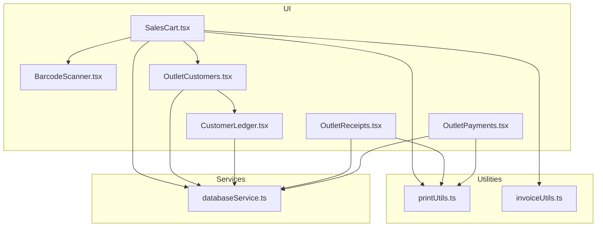
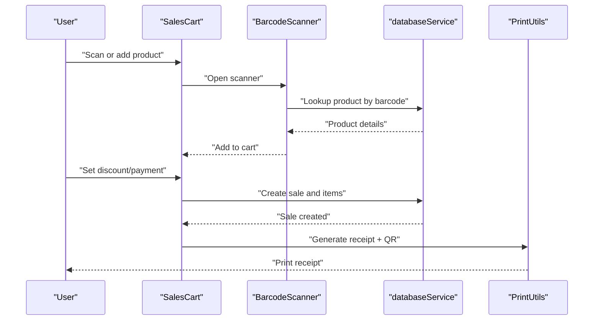
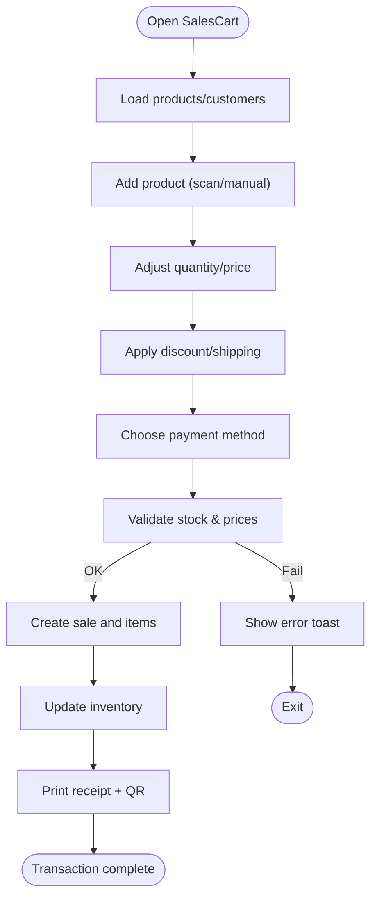
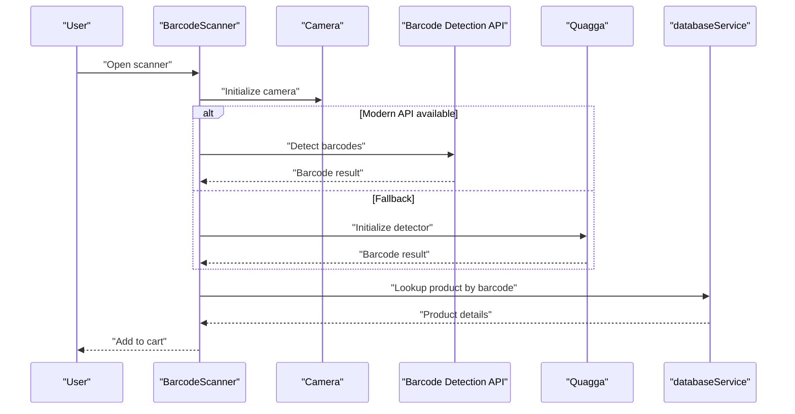
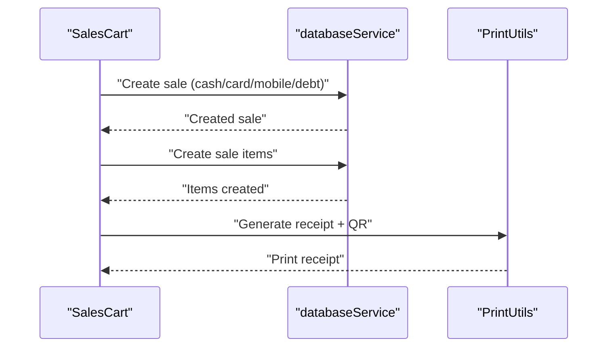
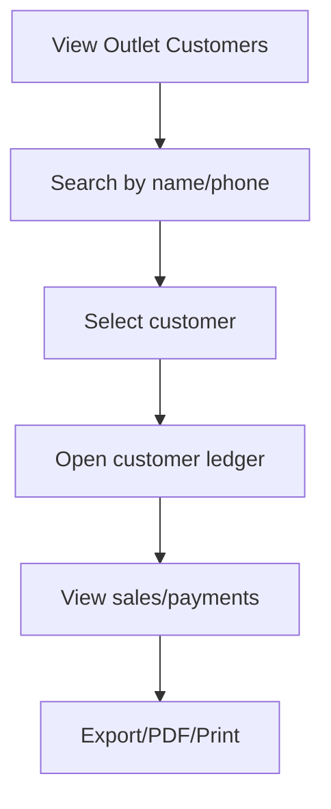
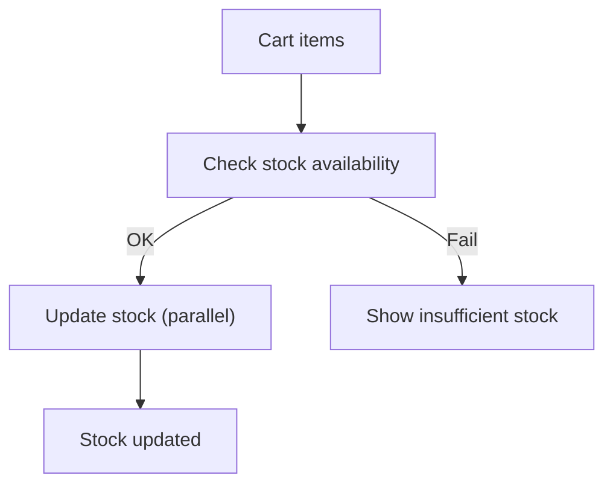
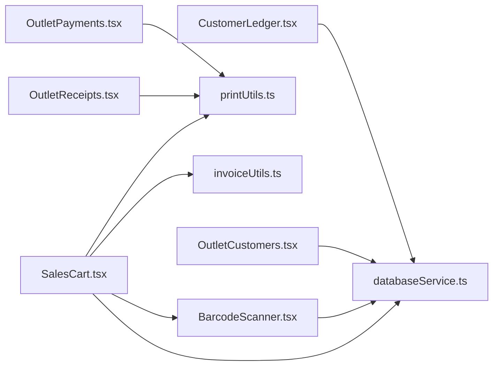

# Sales Terminal

<cite>
**Referenced Files in This Document**
- [SalesCart.tsx](file://src/pages/SalesCart.tsx)
- [BarcodeScanner.tsx](file://src/components/BarcodeScanner.tsx)
- [printUtils.ts](file://src/utils/printUtils.ts)
- [invoiceUtils.ts](file://src/utils/invoiceUtils.ts)
- [OutletCustomers.tsx](file://src/pages/OutletCustomers.tsx)
- [CustomerLedger.tsx](file://src/components/CustomerLedger.tsx)
- [OutletPayments.tsx](file://src/pages/OutletPayments.tsx)
- [OutletReceipts.tsx](file://src/pages/OutletReceipts.tsx)
- [databaseService.ts](file://src/services/databaseService.ts)
</cite>

## Table of Contents
1. [Introduction](#introduction)
2. [Project Structure](#project-structure)
3. [Core Components](#core-components)
4. [Architecture Overview](#architecture-overview)
5. [Detailed Component Analysis](#detailed-component-analysis)
6. [Dependency Analysis](#dependency-analysis)
7. [Performance Considerations](#performance-considerations)
8. [Troubleshooting Guide](#troubleshooting-guide)
9. [Conclusion](#conclusion)

## Introduction
This document describes the real-time point of sale (POS) sales terminal for Royal POS Modern. It covers the sales cart, product scanning, manual selection, quantity and price adjustments, payment processing (cash, card, mobile money, debt), tax and discount handling, receipt generation with QR code integration, customer association (walk-in and registered), and integration with inventory systems for real-time stock updates. It also includes step-by-step workflows, error handling, and troubleshooting guidance.

## Project Structure
The sales terminal is implemented as a React-based web application with TypeScript. Key modules include:
- SalesCart: primary sales interface with cart, scanning, payments, and checkout
- BarcodeScanner: barcode scanning with camera and fallback detection
- Print utilities: receipt generation and QR code integration
- Customer management: registered customer lookup and ledger
- Payment and receipt management: outlet-specific sales and receipts
- Database service: Supabase-backed CRUD for products, customers, sales, and inventory

**Diagram sources**
- [SalesCart.tsx:1-800](file://src/pages/SalesCart.tsx#L1-800)
- [BarcodeScanner.tsx:1-800](file://src/components/BarcodeScanner.tsx#L1-800)
- [printUtils.ts:1-800](file://src/utils/printUtils.ts#L1-800)
- [invoiceUtils.ts:1-261](file://src/utils/invoiceUtils.ts#L1-261)
- [OutletCustomers.tsx:1-800](file://src/pages/OutletCustomers.tsx#L1-800)
- [CustomerLedger.tsx:1-591](file://src/components/CustomerLedger.tsx#L1-591)
- [OutletReceipts.tsx:1-800](file://src/pages/OutletReceipts.tsx#L1-800)
- [OutletPayments.tsx:1-800](file://src/pages/OutletPayments.tsx#L1-800)
- [databaseService.ts:1-200](file://src/services/databaseService.ts#L1-200)

**Section sources**
- [SalesCart.tsx:1-800](file://src/pages/SalesCart.tsx#L1-800)
- [BarcodeScanner.tsx:1-800](file://src/components/BarcodeScanner.tsx#L1-800)
- [printUtils.ts:1-800](file://src/utils/printUtils.ts#L1-800)
- [invoiceUtils.ts:1-261](file://src/utils/invoiceUtils.ts#L1-261)
- [OutletCustomers.tsx:1-800](file://src/pages/OutletCustomers.tsx#L1-800)
- [CustomerLedger.tsx:1-591](file://src/components/CustomerLedger.tsx#L1-591)
- [OutletReceipts.tsx:1-800](file://src/pages/OutletReceipts.tsx#L1-800)
- [OutletPayments.tsx:1-800](file://src/pages/OutletPayments.tsx#L1-800)
- [databaseService.ts:1-200](file://src/services/databaseService.ts#L1-200)

## Core Components
- SalesCart: manages the shopping cart, scanning, discounts, taxes, and payment processing. Integrates with Supabase for products, customers, and sales persistence.
- BarcodeScanner: captures barcodes via camera with modern detection APIs and fallback to legacy libraries, with manual entry support.
- Print utilities: generates receipts with QR codes and prints via hidden iframes or mobile print flows.
- Customer management: maintains outlet-specific customer lists and ledgers for debt tracking.
- Payment and receipts: outlet-focused sales and settlement receipts with printing and exports.

Key capabilities:
- Real-time stock checks and updates
- Tax display and discount application
- Multi-payment methods (cash, card, mobile money, debt)
- QR-based receipt verification
- Customer association (walk-in or registered)

**Section sources**
- [SalesCart.tsx:222-403](file://src/pages/SalesCart.tsx#L222-403)
- [BarcodeScanner.tsx:370-450](file://src/components/BarcodeScanner.tsx#L370-450)
- [printUtils.ts:48-418](file://src/utils/printUtils.ts#L48-418)
- [OutletCustomers.tsx:87-118](file://src/pages/OutletCustomers.tsx#L87-118)
- [OutletReceipts.tsx:329-381](file://src/pages/OutletReceipts.tsx#L329-381)

## Architecture Overview
The sales terminal follows a layered architecture:
- Presentation layer: React components for cart, scanner, customer, receipts, and payments
- Utilities: printing and QR code generation
- Services: database abstraction over Supabase
- Data models: TypeScript interfaces for products, customers, sales, and inventory

**Diagram sources**
- [SalesCart.tsx:405-791](file://src/pages/SalesCart.tsx#L405-791)
- [BarcodeScanner.tsx:370-450](file://src/components/BarcodeScanner.tsx#L370-450)
- [printUtils.ts:48-418](file://src/utils/printUtils.ts#L48-418)
- [databaseService.ts:1-200](file://src/services/databaseService.ts#L1-200)

## Detailed Component Analysis

### Sales Cart
The sales cart handles:
- Product scanning and manual selection
- Quantity and price adjustments
- Discount and shipping adjustments
- Tax display and total calculation
- Payment processing (cash, card, mobile, debt)
- Stock validation and updates
- Receipt generation and printing

**Diagram sources**
- [SalesCart.tsx:222-403](file://src/pages/SalesCart.tsx#L222-403)
- [SalesCart.tsx:405-791](file://src/pages/SalesCart.tsx#L405-791)
- [printUtils.ts:48-418](file://src/utils/printUtils.ts#L48-418)

**Section sources**
- [SalesCart.tsx:222-403](file://src/pages/SalesCart.tsx#L222-403)
- [SalesCart.tsx:405-791](file://src/pages/SalesCart.tsx#L405-791)

### Barcode Scanner
The scanner supports:
- Modern barcode detection API (where available)
- Fallback to legacy detection
- Camera access with constraints and retries
- Manual barcode entry
- Immediate product lookup and cart addition

**Diagram sources**
- [BarcodeScanner.tsx:134-160](file://src/components/BarcodeScanner.tsx#L134-160)
- [BarcodeScanner.tsx:245-367](file://src/components/BarcodeScanner.tsx#L245-367)
- [BarcodeScanner.tsx:370-450](file://src/components/BarcodeScanner.tsx#L370-450)
- [databaseService.ts:1-200](file://src/services/databaseService.ts#L1-200)

**Section sources**
- [BarcodeScanner.tsx:134-160](file://src/components/BarcodeScanner.tsx#L134-160)
- [BarcodeScanner.tsx:245-367](file://src/components/BarcodeScanner.tsx#L245-367)
- [BarcodeScanner.tsx:370-450](file://src/components/BarcodeScanner.tsx#L370-450)

### Payment Processing and Receipts
Payment methods:
- Cash: amount received and change computed
- Card: card payment recorded
- Mobile: mobile money payment recorded
- Debt: creates debt records with payment tracking

Receipt generation:
- QR code embedded via CDN-based generator
- Desktop: hidden iframe print
- Mobile: mobile print flow
- Settlement receipts for customer debt payments

**Diagram sources**
- [SalesCart.tsx:530-666](file://src/pages/SalesCart.tsx#L530-666)
- [printUtils.ts:48-418](file://src/utils/printUtils.ts#L48-418)
- [databaseService.ts:100-183](file://src/services/databaseService.ts#L100-183)

**Section sources**
- [SalesCart.tsx:530-666](file://src/pages/SalesCart.tsx#L530-666)
- [printUtils.ts:48-418](file://src/utils/printUtils.ts#L48-418)

### Customer Association and Ledgers
Registered customers:
- Outlet-specific customer list
- Customer search with outstanding balance
- Ledger view with sales and payments
- Settlement recording and printing

**Diagram sources**
- [OutletCustomers.tsx:128-132](file://src/pages/OutletCustomers.tsx#L128-132)
- [OutletCustomers.tsx:120-122](file://src/pages/OutletCustomers.tsx#L120-122)
- [CustomerLedger.tsx:69-131](file://src/components/CustomerLedger.tsx#L69-131)

**Section sources**
- [OutletCustomers.tsx:128-132](file://src/pages/OutletCustomers.tsx#L128-132)
- [OutletCustomers.tsx:120-122](file://src/pages/OutletCustomers.tsx#L120-122)
- [CustomerLedger.tsx:69-131](file://src/components/CustomerLedger.tsx#L69-131)

### Inventory Integration
Real-time stock updates:
- Pre-check and post-check stock limits
- Parallel updates for multiple items
- Outlet-specific inventory aggregation

**Diagram sources**
- [SalesCart.tsx:793-800](file://src/pages/SalesCart.tsx#L793-800)
- [databaseService.ts:129-149](file://src/services/databaseService.ts#L129-149)

**Section sources**
- [SalesCart.tsx:793-800](file://src/pages/SalesCart.tsx#L793-800)
- [databaseService.ts:129-149](file://src/services/databaseService.ts#L129-149)

## Dependency Analysis
- SalesCart depends on:
  - BarcodeScanner for product capture
  - PrintUtils for receipts
  - databaseService for products, customers, sales, inventory
  - invoiceUtils for persisted invoice records
- BarcodeScanner depends on:
  - Modern detection API or Quagga fallback
  - databaseService for product lookup
- PrintUtils depends on:
  - Template utilities for receipts
  - CDN-based QR code generation
- OutletCustomers and CustomerLedger depend on:
  - databaseService for customer and debt queries
- OutletReceipts and OutletPayments depend on:
  - databaseService for sales and payments
  - PrintUtils for printing

**Diagram sources**
- [SalesCart.tsx:1-800](file://src/pages/SalesCart.tsx#L1-800)
- [BarcodeScanner.tsx:1-800](file://src/components/BarcodeScanner.tsx#L1-800)
- [printUtils.ts:1-800](file://src/utils/printUtils.ts#L1-800)
- [invoiceUtils.ts:1-261](file://src/utils/invoiceUtils.ts#L1-261)
- [OutletCustomers.tsx:1-800](file://src/pages/OutletCustomers.tsx#L1-800)
- [CustomerLedger.tsx:1-591](file://src/components/CustomerLedger.tsx#L1-591)
- [OutletReceipts.tsx:1-800](file://src/pages/OutletReceipts.tsx#L1-800)
- [OutletPayments.tsx:1-800](file://src/pages/OutletPayments.tsx#L1-800)
- [databaseService.ts:1-200](file://src/services/databaseService.ts#L1-200)

**Section sources**
- [SalesCart.tsx:1-800](file://src/pages/SalesCart.tsx#L1-800)
- [BarcodeScanner.tsx:1-800](file://src/components/BarcodeScanner.tsx#L1-800)
- [printUtils.ts:1-800](file://src/utils/printUtils.ts#L1-800)
- [invoiceUtils.ts:1-261](file://src/utils/invoiceUtils.ts#L1-261)
- [OutletCustomers.tsx:1-800](file://src/pages/OutletCustomers.tsx#L1-800)
- [CustomerLedger.tsx:1-591](file://src/components/CustomerLedger.tsx#L1-591)
- [OutletReceipts.tsx:1-800](file://src/pages/OutletReceipts.tsx#L1-800)
- [OutletPayments.tsx:1-800](file://src/pages/OutletPayments.tsx#L1-800)
- [databaseService.ts:1-200](file://src/services/databaseService.ts#L1-200)

## Performance Considerations
- Parallel processing: sale items and stock updates are executed concurrently to minimize latency.
- Debounced scanning: prevents rapid re-detection of the same barcode.
- Mobile print optimization: uses mobile-friendly print flows to reduce overhead.
- Local caching: invoice persistence via localStorage with database synchronization.

[No sources needed since this section provides general guidance]

## Troubleshooting Guide

Common issues and resolutions:
- Barcode scanner not working
  - Ensure camera permissions are granted
  - Retry camera initialization if access fails
  - Use manual barcode entry as fallback
  - Verify HTTPS context on mobile devices

- Payment failures
  - Insufficient cash received for cash transactions
  - Debt payment exceeding credit limit
  - Validate payment method and amounts before processing

- Receipt printing problems
  - Desktop: ensure pop-up/iframe printing is allowed
  - Mobile: use device’s native print dialog
  - QR code generation failures: network connectivity or CDN issues

- Out-of-stock items
  - Pre-check stock before adding to cart
  - Post-check during transaction completion
  - Stock updates occur after successful transaction

**Section sources**
- [BarcodeScanner.tsx:508-529](file://src/components/BarcodeScanner.tsx#L508-529)
- [SalesCart.tsx:357-403](file://src/pages/SalesCart.tsx#L357-403)
- [printUtils.ts:48-418](file://src/utils/printUtils.ts#L48-418)

## Conclusion
Royal POS Modern’s sales terminal integrates real-time product scanning, robust cart management, flexible payment processing, and comprehensive receipt generation with QR codes. It supports both walk-in and registered customer workflows, maintains outlet-specific customer ledgers, and synchronizes inventory in real time. The modular architecture and utility-driven printing and persistence layers provide maintainability and extensibility for future enhancements.