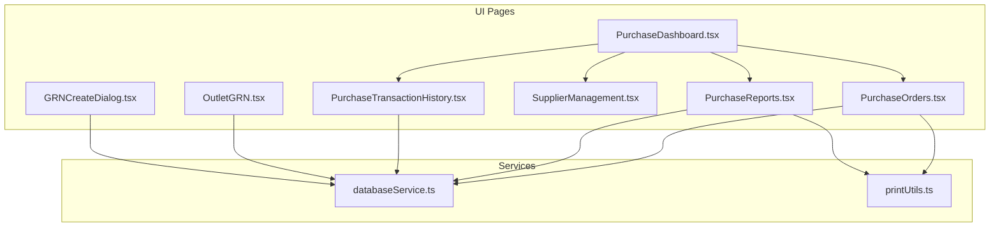
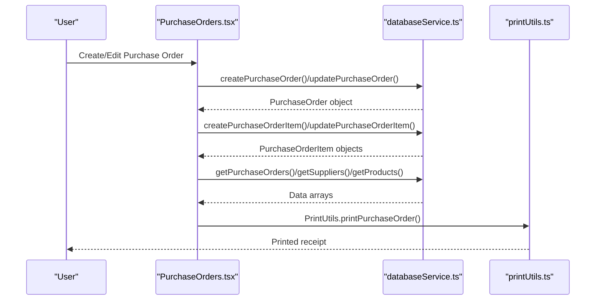
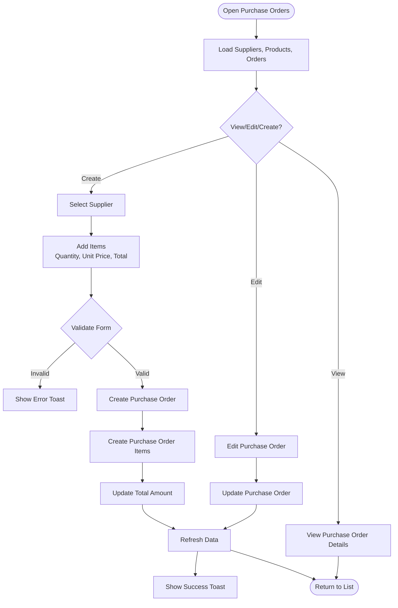
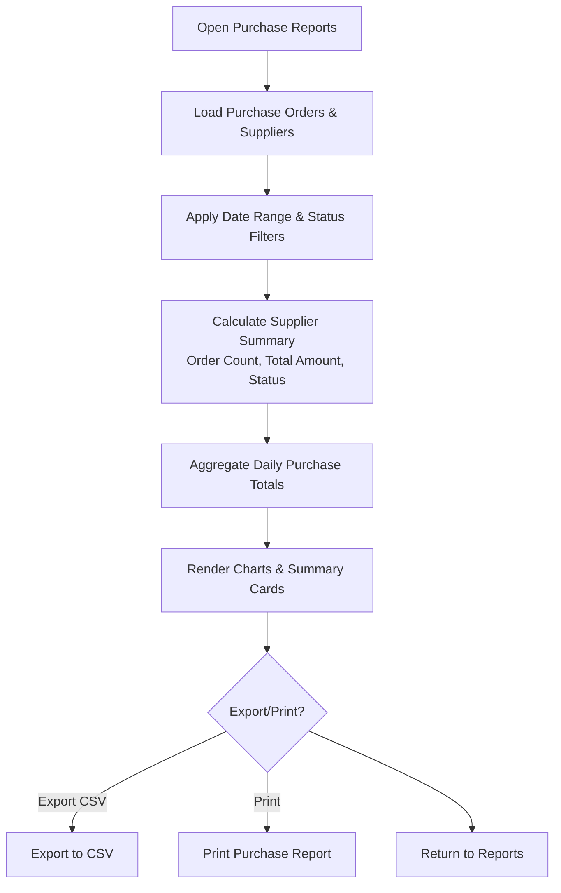
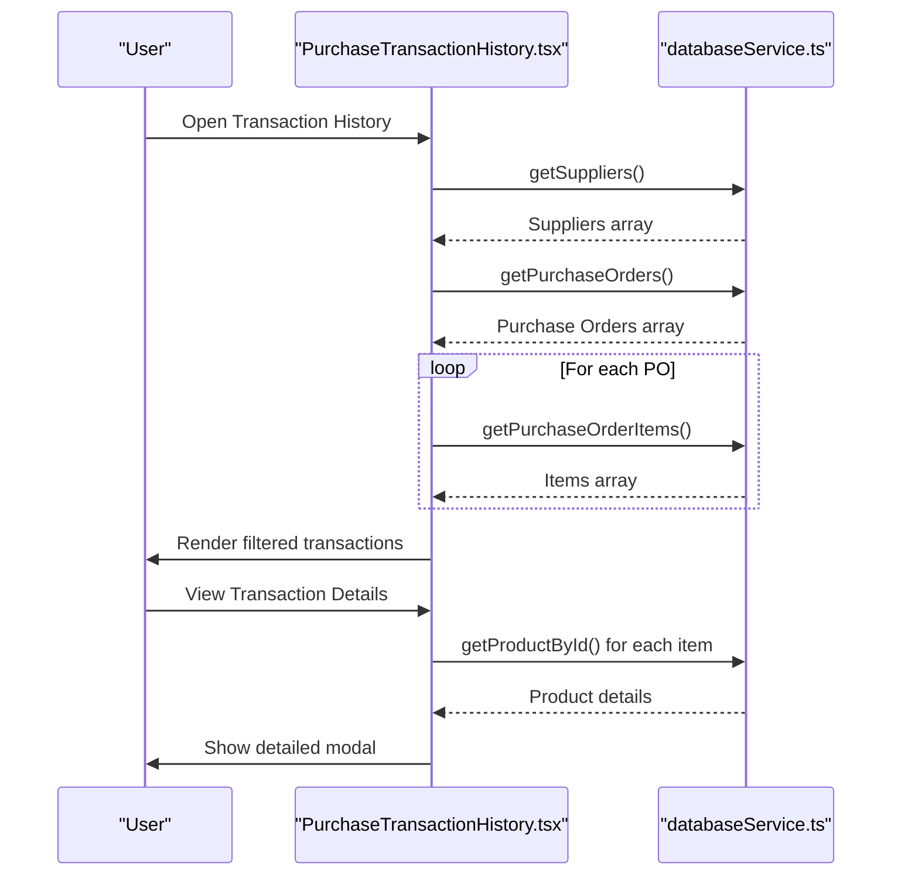
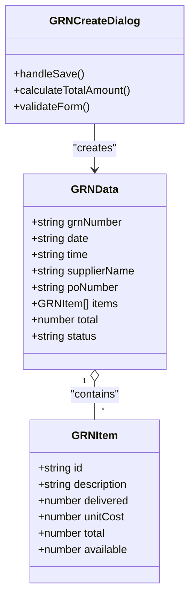
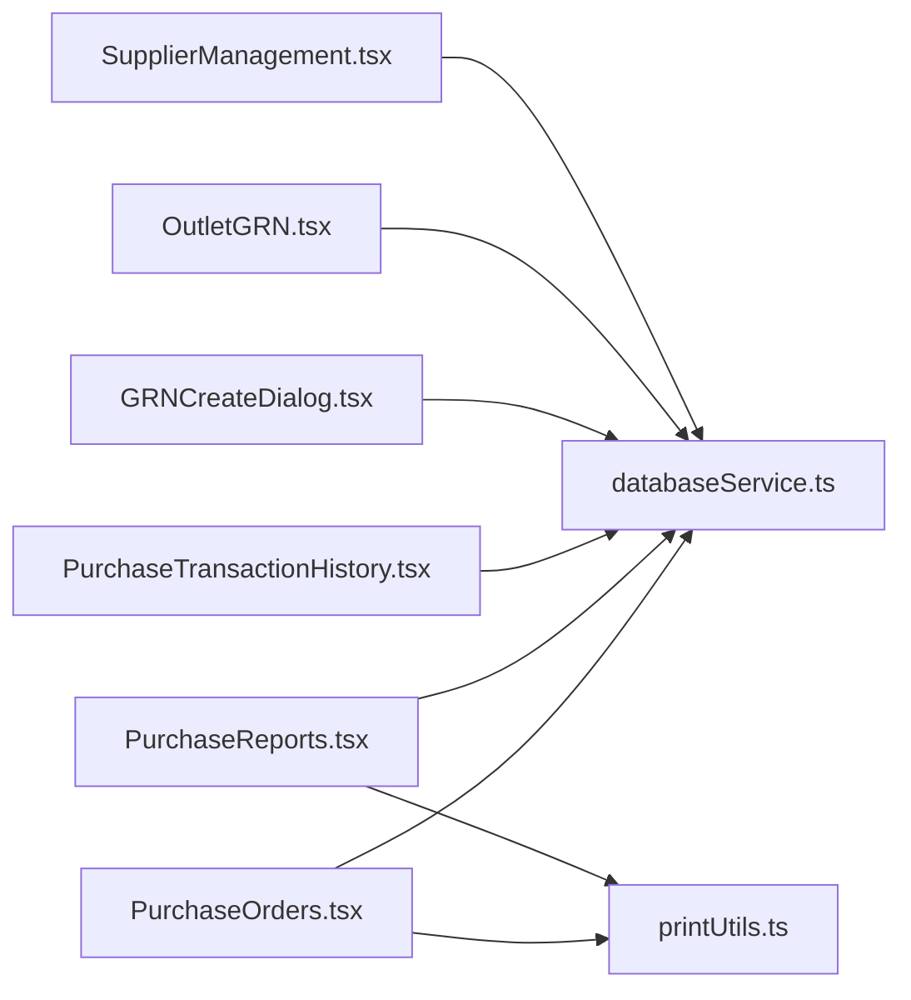

# Purchase Orders Management

<cite>
**Referenced Files in This Document**
- [PurchaseOrders.tsx](file://src/pages/PurchaseOrders.tsx)
- [PurchaseDashboard.tsx](file://src/pages/PurchaseDashboard.tsx)
- [PurchaseReports.tsx](file://src/pages/PurchaseReports.tsx)
- [PurchaseTransactionHistory.tsx](file://src/pages/PurchaseTransactionHistory.tsx)
- [databaseService.ts](file://src/services/databaseService.ts)
- [printUtils.ts](file://src/utils/printUtils.ts)
- [OutletGRN.tsx](file://src/pages/OutletGRN.tsx)
- [GRNCreateDialog.tsx](file://src/components/GRNCreateDialog.tsx)
- [SupplierManagement.tsx](file://src/pages/SupplierManagement.tsx)
</cite>

## Table of Contents
1. [Introduction](#introduction)
2. [Project Structure](#project-structure)
3. [Core Components](#core-components)
4. [Architecture Overview](#architecture-overview)
5. [Detailed Component Analysis](#detailed-component-analysis)
6. [Dependency Analysis](#dependency-analysis)
7. [Performance Considerations](#performance-considerations)
8. [Troubleshooting Guide](#troubleshooting-guide)
9. [Conclusion](#conclusion)

## Introduction
This document provides comprehensive documentation for the purchase orders management system in Royal POS Modern. It explains the complete purchase order lifecycle from creation through approval and fulfillment tracking, covering product selection, quantity management, pricing details, supplier linking, status tracking, modification capabilities, approval workflows, history and audit trails, reporting features, and integration with inventory management. Practical examples and troubleshooting guidance are included to support both technical and non-technical users.

## Project Structure
The purchase orders system spans several React pages and supporting services:
- Purchase Orders management page for creating, editing, and viewing purchase orders
- Purchase Reports dashboard for analytics and summaries
- Purchase Transaction History for audit trails and historical tracking
- Database service layer for CRUD operations against Supabase
- Print utilities for generating purchase receipts and reports
- Goods Receipt Note (GRN) integration for fulfillment tracking
- Supplier management for vendor relationship maintenance

**Diagram sources**
- [PurchaseOrders.tsx:1-941](file://src/pages/PurchaseOrders.tsx#L1-941)
- [PurchaseReports.tsx:1-439](file://src/pages/PurchaseReports.tsx#L1-439)
- [PurchaseTransactionHistory.tsx:1-621](file://src/pages/PurchaseTransactionHistory.tsx#L1-621)
- [PurchaseDashboard.tsx:1-174](file://src/pages/PurchaseDashboard.tsx#L1-174)
- [SupplierManagement.tsx:1-591](file://src/pages/SupplierManagement.tsx#L1-591)
- [OutletGRN.tsx:1-1757](file://src/pages/OutletGRN.tsx#L1-1757)
- [GRNCreateDialog.tsx:1-732](file://src/components/GRNCreateDialog.tsx#L1-732)
- [databaseService.ts:1-5409](file://src/services/databaseService.ts#L1-5409)
- [printUtils.ts:1-4330](file://src/utils/printUtils.ts#L1-4330)

**Section sources**
- [PurchaseOrders.tsx:1-941](file://src/pages/PurchaseOrders.tsx#L1-941)
- [PurchaseDashboard.tsx:1-174](file://src/pages/PurchaseDashboard.tsx#L1-174)

## Core Components
- Purchase Orders Page: Full CRUD for purchase orders, item management, supplier selection, and status updates
- Purchase Reports: Analytics, summaries, and export capabilities
- Purchase Transaction History: Audit trail and historical records
- Database Service: Centralized CRUD operations for purchase orders, items, suppliers, and related entities
- Print Utilities: Purchase receipts and reports printing
- GRN Integration: Fulfillment tracking via Goods Receipt Notes

Key responsibilities:
- Purchase Orders: Creation, editing, deletion, item addition/removal, status transitions
- Reports: Supplier performance, purchase trends, summary cards
- History: Filtering by date/status, viewing detailed transaction records
- Integration: Supplier linking, product selection, inventory impact via GRN

**Section sources**
- [PurchaseOrders.tsx:17-38](file://src/pages/PurchaseOrders.tsx#L17-38)
- [PurchaseReports.tsx:17-35](file://src/pages/PurchaseReports.tsx#L17-35)
- [PurchaseTransactionHistory.tsx:19-45](file://src/pages/PurchaseTransactionHistory.tsx#L19-45)
- [databaseService.ts:185-2238](file://src/services/databaseService.ts#L185-2238)

## Architecture Overview
The system follows a layered architecture:
- UI Layer: React pages/components handling user interactions
- Service Layer: databaseService.ts encapsulating Supabase operations
- Data Model: TypeScript interfaces defining purchase orders, items, suppliers, and related entities
- Integration Layer: Print utilities and GRN workflows

**Diagram sources**
- [PurchaseOrders.tsx:119-312](file://src/pages/PurchaseOrders.tsx#L119-312)
- [databaseService.ts:2010-2238](file://src/services/databaseService.ts#L2010-2238)
- [printUtils.ts:420-751](file://src/utils/printUtils.ts#L420-751)

## Detailed Component Analysis

### Purchase Orders Management
The Purchase Orders page manages the complete lifecycle of purchase orders:
- Creation: Supplier selection, dates, status, and item addition
- Editing: Update supplier, dates, status, and modify items
- Viewing: Read-only view with detailed items
- Deletion: Remove purchase orders with cascading item deletion
- Printing: Generate purchase receipts after updates

**Diagram sources**
- [PurchaseOrders.tsx:119-312](file://src/pages/PurchaseOrders.tsx#L119-312)
- [PurchaseOrders.tsx:384-453](file://src/pages/PurchaseOrders.tsx#L384-453)

Key implementation patterns:
- State management for purchase orders, items, and UI dialogs
- Validation for required fields (supplier selection, quantities)
- Batch creation/update of purchase order items
- Currency formatting and date handling

**Section sources**
- [PurchaseOrders.tsx:17-38](file://src/pages/PurchaseOrders.tsx#L17-38)
- [PurchaseOrders.tsx:119-312](file://src/pages/PurchaseOrders.tsx#L119-312)
- [PurchaseOrders.tsx:384-453](file://src/pages/PurchaseOrders.tsx#L384-453)

### Purchase Reports and Analytics
The Purchase Reports page provides:
- Supplier purchase summaries with status indicators
- Purchase trend charts (daily totals)
- Summary cards (total purchases, active suppliers, average order value)
- Filtering by date range and status
- Export to CSV and printing capabilities

**Diagram sources**
- [PurchaseReports.tsx:36-183](file://src/pages/PurchaseReports.tsx#L36-183)
- [PurchaseReports.tsx:102-157](file://src/pages/PurchaseReports.tsx#L102-157)

**Section sources**
- [PurchaseReports.tsx:17-35](file://src/pages/PurchaseReports.tsx#L17-35)
- [PurchaseReports.tsx:75-183](file://src/pages/PurchaseReports.tsx#L75-183)

### Purchase Transaction History and Audit Trails
The Purchase Transaction History page offers:
- Search by transaction ID or supplier
- Date filters (today, week, month)
- Status filtering
- Detailed view with purchased items
- Export to CSV/Excel and printing

**Diagram sources**
- [PurchaseTransactionHistory.tsx:47-203](file://src/pages/PurchaseTransactionHistory.tsx#L47-203)
- [PurchaseTransactionHistory.tsx:297-345](file://src/pages/PurchaseTransactionHistory.tsx#L297-345)

**Section sources**
- [PurchaseTransactionHistory.tsx:19-45](file://src/pages/PurchaseTransactionHistory.tsx#L19-45)
- [PurchaseTransactionHistory.tsx:72-203](file://src/pages/PurchaseTransactionHistory.tsx#L72-203)

### Goods Receipt Notes (GRN) Integration
GRN integration tracks fulfillment and inventory impact:
- Create GRNs from purchase orders
- Track received quantities, damages, rejections
- Update inventory products with selling prices
- Generate GRN documents with quality checks

**Diagram sources**
- [GRNCreateDialog.tsx:13-86](file://src/components/GRNCreateDialog.tsx#L13-86)
- [GRNCreateDialog.tsx:222-264](file://src/components/GRNCreateDialog.tsx#L222-264)

**Section sources**
- [GRNCreateDialog.tsx:13-86](file://src/components/GRNCreateDialog.tsx#L13-86)
- [GRNCreateDialog.tsx:105-174](file://src/components/GRNCreateDialog.tsx#L105-174)

### Supplier Management
Supplier management supports vendor relationship maintenance:
- CRUD operations for suppliers
- Contact information and tax ID management
- Status tracking (active/inactive)
- Integration with purchase orders and settlements

**Section sources**
- [SupplierManagement.tsx:17-28](file://src/pages/SupplierManagement.tsx#L17-28)
- [SupplierManagement.tsx:30-79](file://src/pages/SupplierManagement.tsx#L30-79)

## Dependency Analysis
The system exhibits clear separation of concerns:
- UI pages depend on databaseService for data operations
- Print utilities are consumed by purchase order and report pages
- GRN components integrate with databaseService and inventory updates
- Supplier management complements purchase order workflows

**Diagram sources**
- [PurchaseOrders.tsx](file://src/pages/PurchaseOrders.tsx#L14)
- [PurchaseReports.tsx](file://src/pages/PurchaseReports.tsx#L14)
- [PurchaseTransactionHistory.tsx](file://src/pages/PurchaseTransactionHistory.tsx#L16)
- [GRNCreateDialog.tsx](file://src/components/GRNCreateDialog.tsx#L10)
- [OutletGRN.tsx](file://src/pages/OutletGRN.tsx#L45)
- [SupplierManagement.tsx](file://src/pages/SupplierManagement.tsx#L15)
- [printUtils.ts](file://src/utils/printUtils.ts#L1)

**Section sources**
- [databaseService.ts:185-2238](file://src/services/databaseService.ts#L185-2238)

## Performance Considerations
- Data loading optimization: Batch loading of purchase orders, suppliers, and products reduces network requests
- Lazy loading of items: Items are fetched only when needed (view/edit modes)
- Efficient filtering: Client-side filtering by search term and status minimizes server load
- Currency and date formatting: Centralized formatting improves consistency and reduces repeated computations
- Export and print operations: Asynchronous processing prevents UI blocking

## Troubleshooting Guide
Common issues and resolutions:
- Purchase order creation failures: Validate supplier selection and item quantities; check toast messages for specific errors
- Data refresh problems: Use the refresh button to reload purchase orders and suppliers
- Print issues: Verify printer connectivity and browser permissions for print dialogs
- GRN save errors: Ensure required fields are filled and item descriptions are provided
- Supplier management errors: Confirm required fields (company name, contact person) are populated

**Section sources**
- [PurchaseOrders.tsx:119-212](file://src/pages/PurchaseOrders.tsx#L119-212)
- [PurchaseTransactionHistory.tsx:235-295](file://src/pages/PurchaseTransactionHistory.tsx#L235-295)
- [GRNCreateDialog.tsx:191-220](file://src/components/GRNCreateDialog.tsx#L191-220)

## Conclusion
The purchase orders management system in Royal POS Modern provides a comprehensive solution for procurement lifecycle management. It supports end-to-end workflows from purchase order creation to fulfillment tracking via GRNs, with robust reporting, audit trails, and integration capabilities. The modular architecture ensures maintainability and scalability while providing intuitive user experiences across all major purchase order processes.