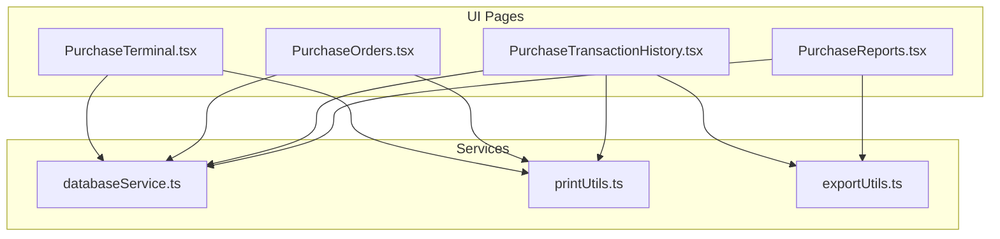
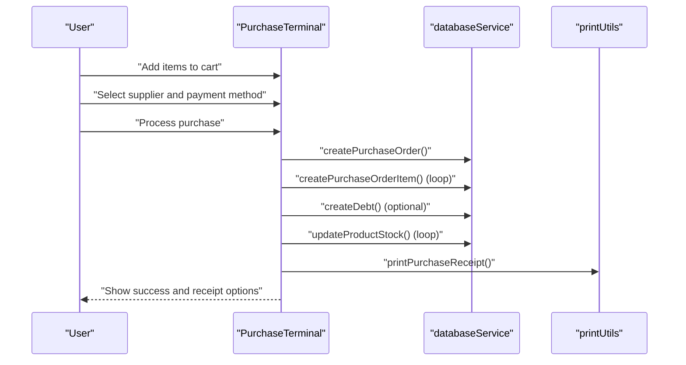
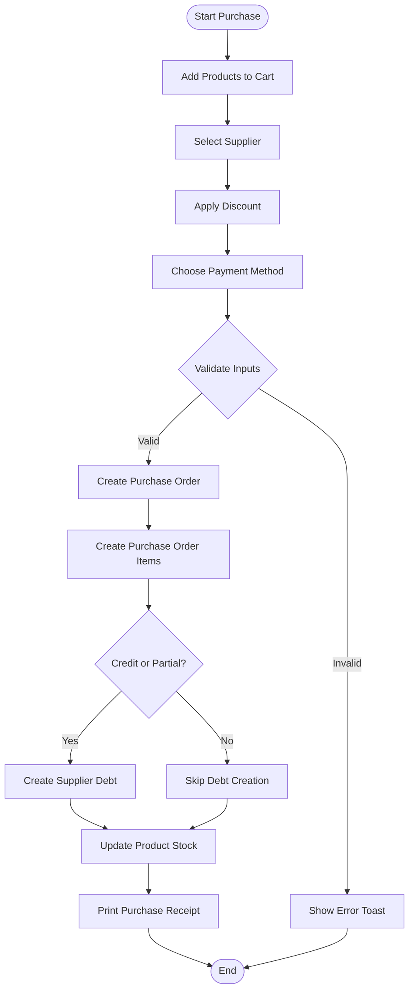
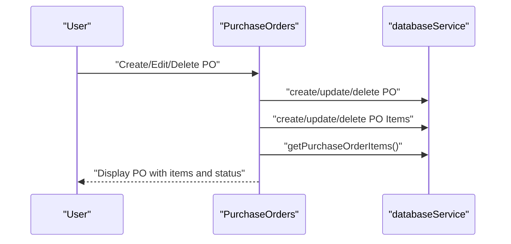
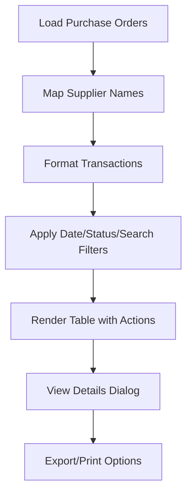
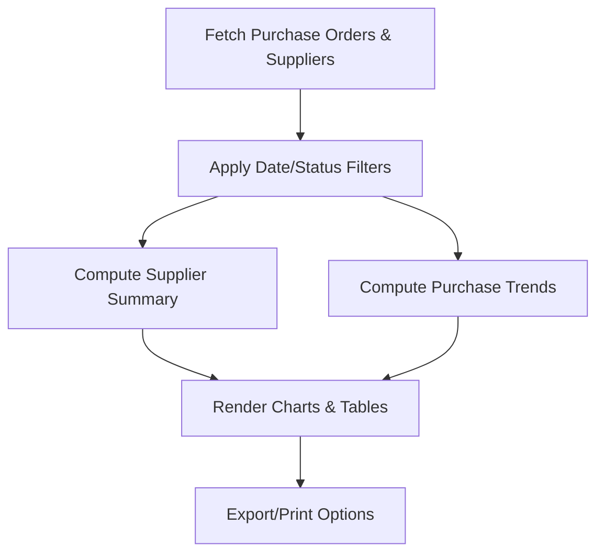
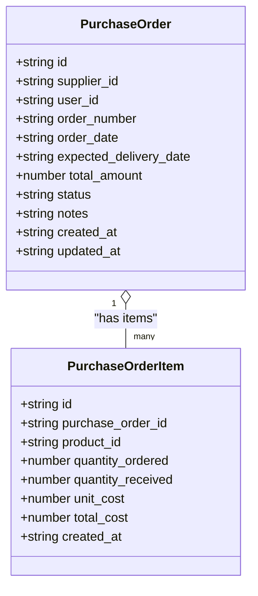
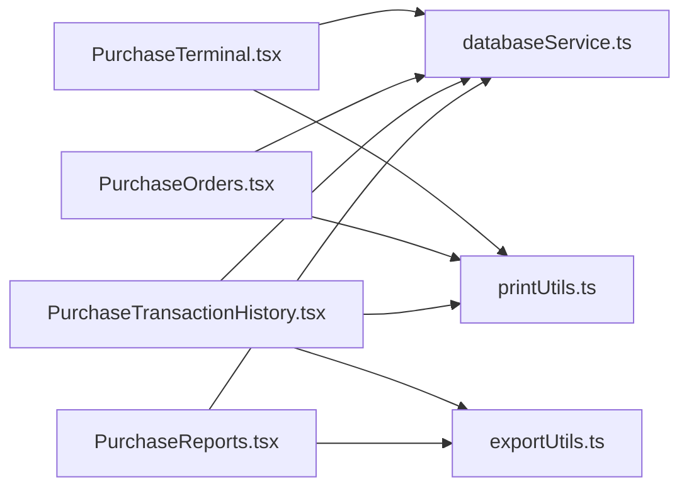

# Purchase Transactions and History

<cite>
**Referenced Files in This Document**
- [PurchaseTransactionHistory.tsx](file://src/pages/PurchaseTransactionHistory.tsx)
- [PurchaseOrders.tsx](file://src/pages/PurchaseOrders.tsx)
- [PurchaseReports.tsx](file://src/pages/PurchaseReports.tsx)
- [PurchaseTerminal.tsx](file://src/pages/PurchaseTerminal.tsx)
- [databaseService.ts](file://src/services/databaseService.ts)
- [printUtils.ts](file://src/utils/printUtils.ts)
- [exportUtils.ts](file://src/utils/exportUtils.ts)
</cite>

## Table of Contents
1. [Introduction](#introduction)
2. [Project Structure](#project-structure)
3. [Core Components](#core-components)
4. [Architecture Overview](#architecture-overview)
5. [Detailed Component Analysis](#detailed-component-analysis)
6. [Dependency Analysis](#dependency-analysis)
7. [Performance Considerations](#performance-considerations)
8. [Troubleshooting Guide](#troubleshooting-guide)
9. [Conclusion](#conclusion)

## Introduction
This document explains purchase transaction management and history tracking in Royal POS Modern. It covers the complete lifecycle from transaction recording and payment processing to reconciliation and reporting. It also documents transaction categorization, search and filtering, analytics, and operational procedures for reversals and corrections. Practical examples illustrate end-to-end workflows, and guidance is provided for maintaining data integrity, security, and performance at scale.

## Project Structure
The purchase domain spans several UI pages and supporting services:
- PurchaseTerminal: Real-time purchase entry with supplier selection, cart management, discount, and payment processing.
- PurchaseOrders: CRUD for purchase orders and items, including status updates and printing.
- PurchaseTransactionHistory: Historical view of purchase orders with filtering and export/printing.
- PurchaseReports: Analytics and supplier performance dashboards.
- databaseService: Backend integration with Supabase for purchase orders, items, suppliers, and debts.
- printUtils and exportUtils: Printing and export utilities for receipts and reports.

**Diagram sources**
- [PurchaseTerminal.tsx:1-979](file://src/pages/PurchaseTerminal.tsx#L1-L979)
- [PurchaseOrders.tsx:1-941](file://src/pages/PurchaseOrders.tsx#L1-L941)
- [PurchaseTransactionHistory.tsx:1-621](file://src/pages/PurchaseTransactionHistory.tsx#L1-L621)
- [PurchaseReports.tsx:1-439](file://src/pages/PurchaseReports.tsx#L1-L439)
- [databaseService.ts:185-384](file://src/services/databaseService.ts#L185-L384)
- [printUtils.ts:1-800](file://src/utils/printUtils.ts#L1-L800)
- [exportUtils.ts:1-785](file://src/utils/exportUtils.ts#L1-L785)

**Section sources**
- [PurchaseTerminal.tsx:1-979](file://src/pages/PurchaseTerminal.tsx#L1-L979)
- [PurchaseOrders.tsx:1-941](file://src/pages/PurchaseOrders.tsx#L1-L941)
- [PurchaseTransactionHistory.tsx:1-621](file://src/pages/PurchaseTransactionHistory.tsx#L1-L621)
- [PurchaseReports.tsx:1-439](file://src/pages/PurchaseReports.tsx#L1-L439)
- [databaseService.ts:185-384](file://src/services/databaseService.ts#L185-L384)
- [printUtils.ts:1-800](file://src/utils/printUtils.ts#L1-L800)
- [exportUtils.ts:1-785](file://src/utils/exportUtils.ts#L1-L785)

## Core Components
- PurchaseTerminal: Handles live purchase creation, cart management, discount application, and payment capture. Supports cash, credit, card, and mobile money. Creates purchase orders, purchase order items, optional supplier debt records, and updates product stock quantities.
- PurchaseOrders: Manages purchase order lifecycle including creation, editing, deletion, and viewing with items. Provides filtering by status and search by PO number or supplier.
- PurchaseTransactionHistory: Lists purchase orders with key attributes (date, supplier, item count, total, status), supports date range and status filters, and offers print/export capabilities.
- PurchaseReports: Aggregates purchase data for supplier performance, purchase trends, and summary cards. Includes date-range filtering and export/print options.
- databaseService: Defines purchase order and item data models and exposes CRUD functions for purchase orders, items, suppliers, and debt.
- printUtils and exportUtils: Provide printing of purchase receipts and exporting of purchase data to CSV/PDF.

**Section sources**
- [PurchaseTerminal.tsx:153-283](file://src/pages/PurchaseTerminal.tsx#L153-L283)
- [PurchaseOrders.tsx:119-312](file://src/pages/PurchaseOrders.tsx#L119-L312)
- [PurchaseTransactionHistory.tsx:47-295](file://src/pages/PurchaseTransactionHistory.tsx#L47-L295)
- [PurchaseReports.tsx:36-183](file://src/pages/PurchaseReports.tsx#L36-L183)
- [databaseService.ts:185-209](file://src/services/databaseService.ts#L185-L209)
- [printUtils.ts:420-751](file://src/utils/printUtils.ts#L420-L751)
- [exportUtils.ts:14-109](file://src/utils/exportUtils.ts#L14-L109)

## Architecture Overview
The purchase transaction architecture integrates UI pages with a Supabase-backed service layer. PurchaseTerminal orchestrates transaction recording and payment capture, while PurchaseOrders centralizes purchase order management. PurchaseTransactionHistory and PurchaseReports consume the same data model to present historical records and analytics.

**Diagram sources**
- [PurchaseTerminal.tsx:153-283](file://src/pages/PurchaseTerminal.tsx#L153-L283)
- [databaseService.ts:185-209](file://src/services/databaseService.ts#L185-L209)
- [printUtils.ts:420-751](file://src/utils/printUtils.ts#L420-L751)

## Detailed Component Analysis

### PurchaseTerminal: Transaction Recording and Payment Processing
- Cart and search: Adds products by name, barcode, or SKU; supports quantity editing and removal.
- Supplier selection: Either selects an existing supplier or adds a new one.
- Discount: Supports percentage or fixed-amount discount.
- Payment: Supports cash (with amount received and change), credit, card, and mobile money.
- Transaction completion:
  - Creates a purchase order with status “received”.
  - Creates purchase order items for each cart entry.
  - Optionally creates a supplier debt record for credit or partial payments.
  - Updates product stock quantities.
  - Prints a purchase receipt via printUtils.
- Receipt printing: Generates a purchase receipt with order details, items, totals, and payment info.

**Diagram sources**
- [PurchaseTerminal.tsx:153-283](file://src/pages/PurchaseTerminal.tsx#L153-L283)
- [printUtils.ts:420-751](file://src/utils/printUtils.ts#L420-L751)

**Section sources**
- [PurchaseTerminal.tsx:153-283](file://src/pages/PurchaseTerminal.tsx#L153-L283)
- [PurchaseTerminal.tsx:833-952](file://src/pages/PurchaseTerminal.tsx#L833-L952)
- [printUtils.ts:420-751](file://src/utils/printUtils.ts#L420-L751)

### PurchaseOrders: Purchase Order Lifecycle and Reconciliation
- CRUD operations: Create, edit, delete purchase orders; load items per order; print PO.
- Status management: draft, ordered, received, cancelled.
- Item management: Add/remove items with quantity and cost; recalculate totals.
- Reconciliation: After receiving goods, status can be updated to “received,” aligning inventory with purchase order items.

**Diagram sources**
- [PurchaseOrders.tsx:119-312](file://src/pages/PurchaseOrders.tsx#L119-L312)
- [databaseService.ts:185-209](file://src/services/databaseService.ts#L185-L209)

**Section sources**
- [PurchaseOrders.tsx:119-312](file://src/pages/PurchaseOrders.tsx#L119-L312)
- [PurchaseOrders.tsx:384-453](file://src/pages/PurchaseOrders.tsx#L384-L453)

### PurchaseTransactionHistory: Search, Filters, and Reporting
- Displays purchase orders with date, supplier, item count, total, and status.
- Filters:
  - Date range: all, today, this week, this month.
  - Status: all, draft, ordered, received, cancelled.
  - Text search by transaction ID or supplier.
- Actions: refresh, print report, export to CSV/Excel.
- Detailed view: loads and displays items with product names, quantities, unit costs, and totals.

**Diagram sources**
- [PurchaseTransactionHistory.tsx:72-203](file://src/pages/PurchaseTransactionHistory.tsx#L72-L203)
- [PurchaseTransactionHistory.tsx:205-233](file://src/pages/PurchaseTransactionHistory.tsx#L205-L233)

**Section sources**
- [PurchaseTransactionHistory.tsx:47-295](file://src/pages/PurchaseTransactionHistory.tsx#L47-L295)
- [PurchaseTransactionHistory.tsx:297-351](file://src/pages/PurchaseTransactionHistory.tsx#L297-L351)

### PurchaseReports: Analytics and Supplier Metrics
- Date range filters: last 7 days, last 30 days, last 90 days, all time.
- Status filters: all, draft, ordered, received, cancelled.
- Calculations:
  - Purchase summary by supplier (orders count, total amount, overall status).
  - Purchase trends grouped by order date.
  - Supplier performance pie chart (total purchases and order counts).
- Export/print: CSV export and print report actions.

**Diagram sources**
- [PurchaseReports.tsx:44-100](file://src/pages/PurchaseReports.tsx#L44-L100)
- [PurchaseReports.tsx:102-157](file://src/pages/PurchaseReports.tsx#L102-L157)

**Section sources**
- [PurchaseReports.tsx:36-183](file://src/pages/PurchaseReports.tsx#L36-L183)
- [PurchaseReports.tsx:185-202](file://src/pages/PurchaseReports.tsx#L185-L202)

### Data Models and Relationships
Purchase order and item models define the core data structures used across components.

**Diagram sources**
- [databaseService.ts:185-209](file://src/services/databaseService.ts#L185-L209)

**Section sources**
- [databaseService.ts:185-209](file://src/services/databaseService.ts#L185-L209)

## Dependency Analysis
- UI pages depend on databaseService for data access and on printUtils/exportUtils for output.
- PurchaseTerminal depends on PurchaseOrders for shared item handling and on databaseService for purchase order persistence.
- PurchaseTransactionHistory and PurchaseReports share the same data source and filters.

**Diagram sources**
- [PurchaseTerminal.tsx:1-979](file://src/pages/PurchaseTerminal.tsx#L1-L979)
- [PurchaseOrders.tsx:1-941](file://src/pages/PurchaseOrders.tsx#L1-L941)
- [PurchaseTransactionHistory.tsx:1-621](file://src/pages/PurchaseTransactionHistory.tsx#L1-L621)
- [PurchaseReports.tsx:1-439](file://src/pages/PurchaseReports.tsx#L1-L439)
- [databaseService.ts:185-384](file://src/services/databaseService.ts#L185-L384)
- [printUtils.ts:1-800](file://src/utils/printUtils.ts#L1-L800)
- [exportUtils.ts:1-785](file://src/utils/exportUtils.ts#L1-L785)

**Section sources**
- [PurchaseTerminal.tsx:1-979](file://src/pages/PurchaseTerminal.tsx#L1-L979)
- [PurchaseOrders.tsx:1-941](file://src/pages/PurchaseOrders.tsx#L1-L941)
- [PurchaseTransactionHistory.tsx:1-621](file://src/pages/PurchaseTransactionHistory.tsx#L1-L621)
- [PurchaseReports.tsx:1-439](file://src/pages/PurchaseReports.tsx#L1-L439)
- [databaseService.ts:185-384](file://src/services/databaseService.ts#L185-L384)
- [printUtils.ts:1-800](file://src/utils/printUtils.ts#L1-L800)
- [exportUtils.ts:1-785](file://src/utils/exportUtils.ts#L1-L785)

## Performance Considerations
- Filtering and rendering large datasets:
  - Use client-side filtering only for moderate datasets; consider server-side pagination and filtering for very large histories.
  - Debounce search inputs to reduce re-renders.
- Batch operations:
  - When updating stock or creating many items, batch database calls to minimize round-trips.
- Printing and exports:
  - For large exports, stream or chunk data to avoid memory pressure.
- Currency formatting:
  - Centralize formatting to reduce repeated computations.

[No sources needed since this section provides general guidance]

## Troubleshooting Guide
- PurchaseTerminal errors:
  - Empty cart or missing supplier selection lead to validation errors.
  - Insufficient cash payment triggers insufficient funds warnings.
  - Debt creation warnings occur when supplier is not selected.
- PurchaseOrders errors:
  - Missing supplier or invalid dates cause failures during create/update.
  - Deleting a purchase order removes associated items.
- PurchaseTransactionHistory errors:
  - Missing supplier mapping defaults to “Unknown Supplier.”
  - Item count fallback ensures display stability.
- PurchaseReports errors:
  - Empty datasets show a friendly message and refresh option.
- General:
  - Toast notifications provide user feedback for success and error states.
  - Use refresh actions to reload data after external changes.

**Section sources**
- [PurchaseTerminal.tsx:153-283](file://src/pages/PurchaseTerminal.tsx#L153-L283)
- [PurchaseOrders.tsx:119-312](file://src/pages/PurchaseOrders.tsx#L119-L312)
- [PurchaseTransactionHistory.tsx:72-132](file://src/pages/PurchaseTransactionHistory.tsx#L72-L132)
- [PurchaseReports.tsx:159-183](file://src/pages/PurchaseReports.tsx#L159-L183)

## Conclusion
Royal POS Modern’s purchase transaction management integrates real-time purchase recording, robust order lifecycle management, historical tracking, and insightful analytics. The system supports multiple payment methods, optional debt tracking, and comprehensive reporting. By leveraging the documented workflows, filters, and utilities, operators can efficiently manage supplier purchases, reconcile transactions, and maintain accurate financial records at scale.