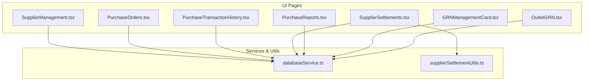
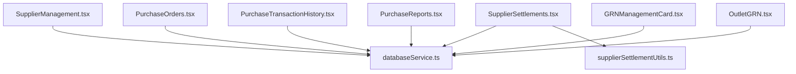
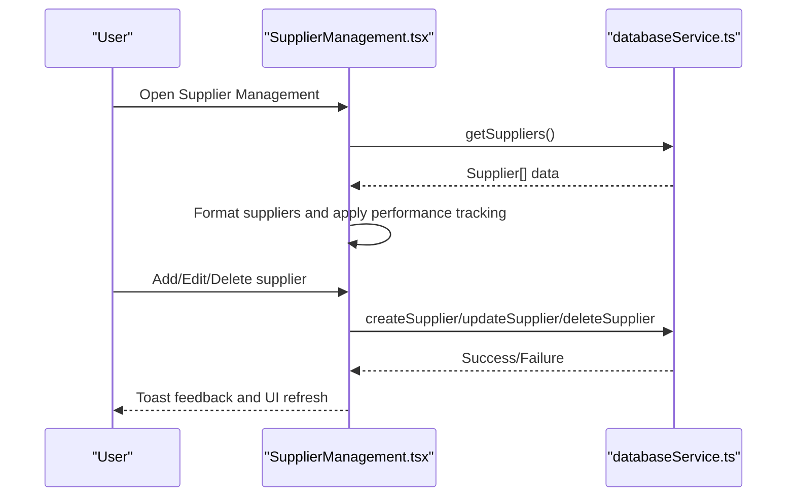
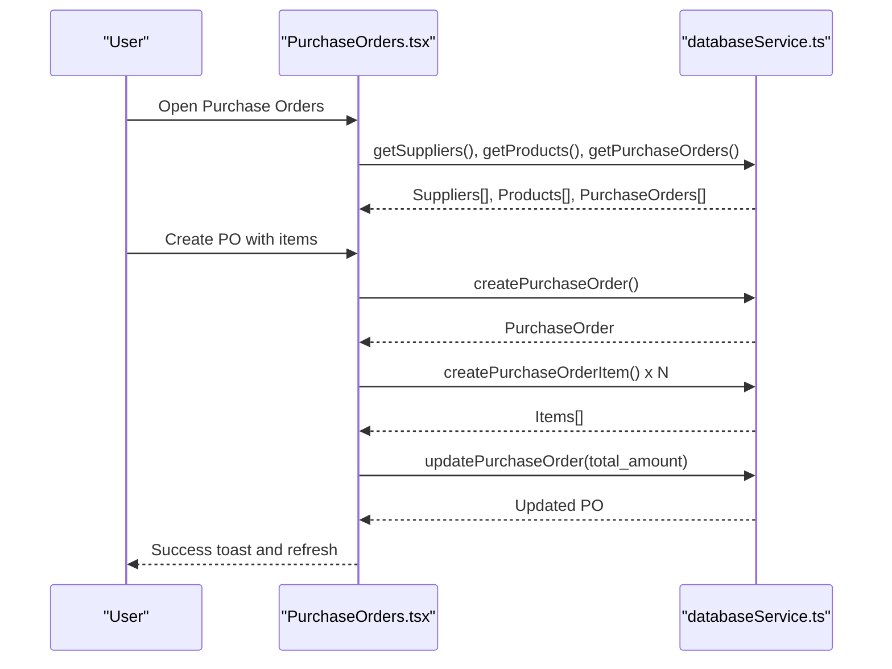
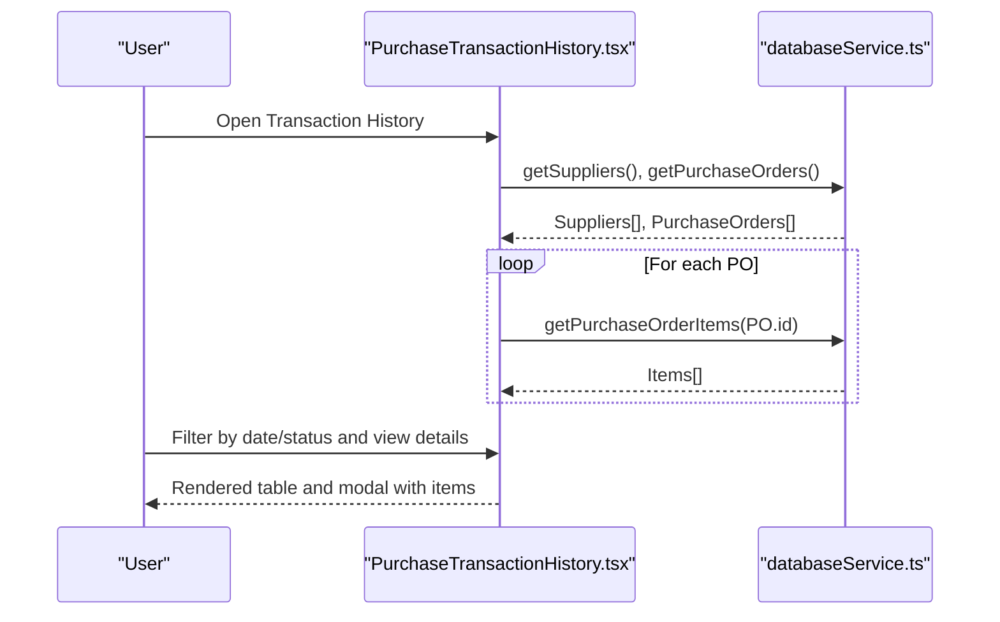
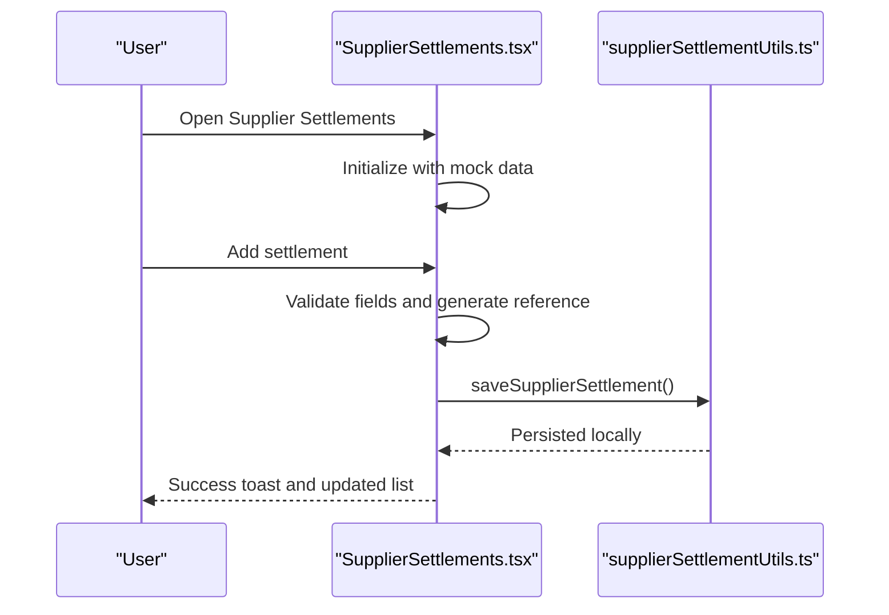
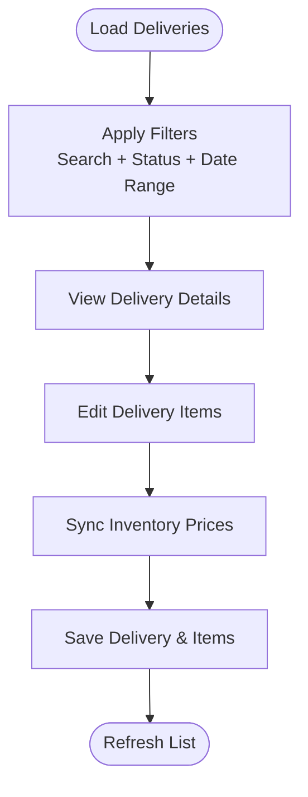
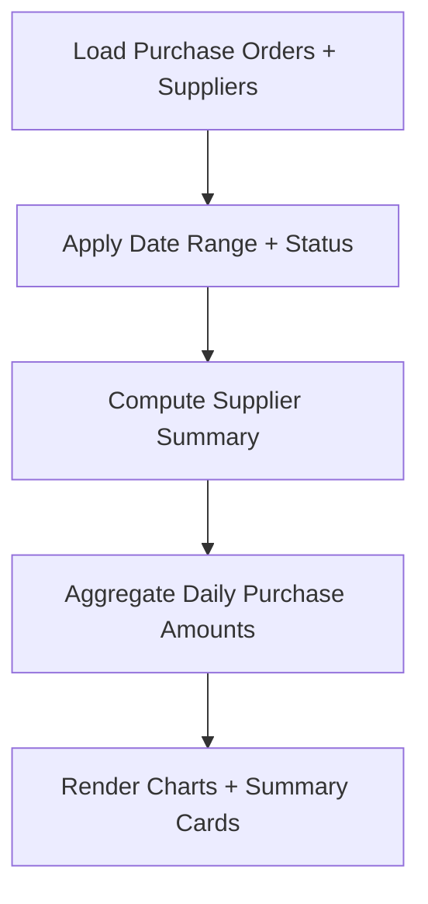
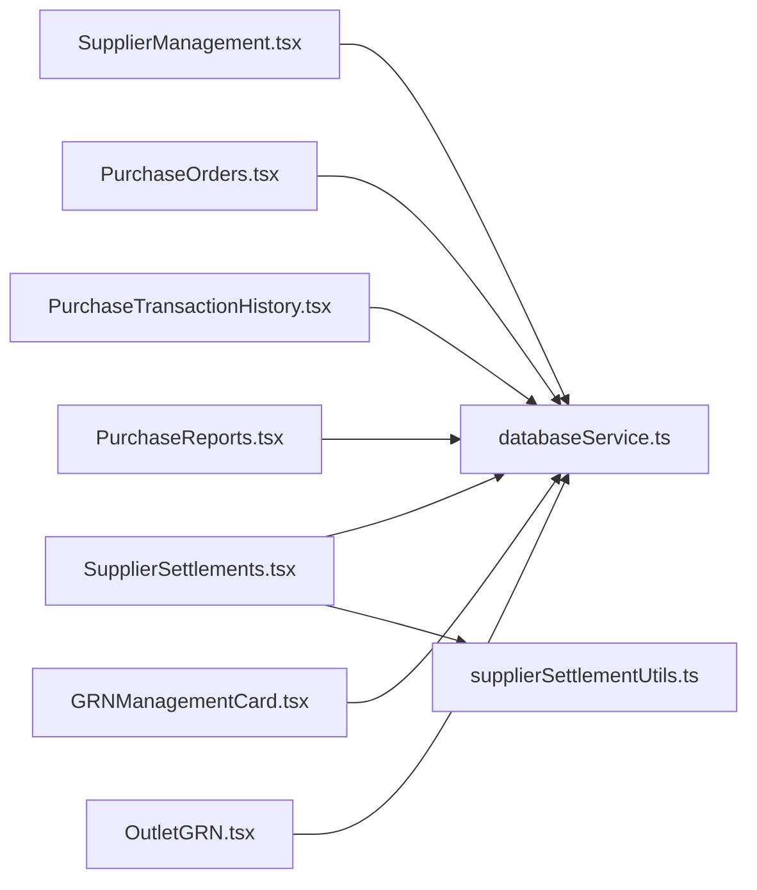

# Supplier Management System

<cite>
**Referenced Files in This Document**
- [SupplierManagement.tsx](file://src/pages/SupplierManagement.tsx)
- [SupplierSettlements.tsx](file://src/pages/SupplierSettlements.tsx)
- [supplierSettlementUtils.ts](file://src/utils/supplierSettlementUtils.ts)
- [PurchaseOrders.tsx](file://src/pages/PurchaseOrders.tsx)
- [PurchaseTransactionHistory.tsx](file://src/pages/PurchaseTransactionHistory.tsx)
- [PurchaseReports.tsx](file://src/pages/PurchaseReports.tsx)
- [PurchaseDashboard.tsx](file://src/pages/PurchaseDashboard.tsx)
- [databaseService.ts](file://src/services/databaseService.ts)
- [GRNManagementCard.tsx](file://src/components/GRNManagementCard.tsx)
- [OutletGRN.tsx](file://src/pages/OutletGRN.tsx)
</cite>

## Table of Contents
1. [Introduction](#introduction)
2. [Project Structure](#project-structure)
3. [Core Components](#core-components)
4. [Architecture Overview](#architecture-overview)
5. [Detailed Component Analysis](#detailed-component-analysis)
6. [Dependency Analysis](#dependency-analysis)
7. [Performance Considerations](#performance-considerations)
8. [Troubleshooting Guide](#troubleshooting-guide)
9. [Conclusion](#conclusion)

## Introduction
This document describes the complete supplier management system for Royal POS Modern, covering supplier relationship lifecycle management from registration through purchase order processing, goods receipt, and payment settlement. It documents supplier profile management (CRUD, product catalogs, ratings), purchase order creation and tracking, purchase transaction history, supplier settlement/payment processing, communication features, purchase analytics, and reporting capabilities. Practical scenarios and troubleshooting guidance are included to support day-to-day operations.

## Project Structure
The supplier management system spans several React pages and supporting utilities:
- Supplier profile management: SupplierManagement page with CRUD operations and performance metrics
- Purchase order lifecycle: PurchaseOrders page with creation, updates, approvals, and printing
- Transaction history: PurchaseTransactionHistory page for purchase records and detailed views
- Settlements: SupplierSettlements page for payment recording and tracking
- Reporting: PurchaseReports page for analytics and supplier performance
- Goods Receipt: GRNManagementCard and OutletGRN for delivery and inventory alignment
- Data access: databaseService.ts for Supabase integration and typed models
- Utilities: supplierSettlementUtils.ts for local persistence and formatting

**Diagram sources**
- [SupplierManagement.tsx:1-591](file://src/pages/SupplierManagement.tsx#L1-591)
- [PurchaseOrders.tsx:1-941](file://src/pages/PurchaseOrders.tsx#L1-941)
- [PurchaseTransactionHistory.tsx:1-621](file://src/pages/PurchaseTransactionHistory.tsx#L1-621)
- [SupplierSettlements.tsx:1-473](file://src/pages/SupplierSettlements.tsx#L1-473)
- [PurchaseReports.tsx:1-439](file://src/pages/PurchaseReports.tsx#L1-439)
- [GRNManagementCard.tsx:1-553](file://src/components/GRNManagementCard.tsx#L1-553)
- [OutletGRN.tsx:1-1757](file://src/pages/OutletGRN.tsx#L1-1757)
- [databaseService.ts:62-78](file://src/services/databaseService.ts#L62-78)
- [supplierSettlementUtils.ts:1-121](file://src/utils/supplierSettlementUtils.ts#L1-121)

**Section sources**
- [SupplierManagement.tsx:1-591](file://src/pages/SupplierManagement.tsx#L1-591)
- [PurchaseOrders.tsx:1-941](file://src/pages/PurchaseOrders.tsx#L1-941)
- [PurchaseTransactionHistory.tsx:1-621](file://src/pages/PurchaseTransactionHistory.tsx#L1-621)
- [SupplierSettlements.tsx:1-473](file://src/pages/SupplierSettlements.tsx#L1-473)
- [PurchaseReports.tsx:1-439](file://src/pages/PurchaseReports.tsx#L1-439)
- [GRNManagementCard.tsx:1-553](file://src/components/GRNManagementCard.tsx#L1-553)
- [OutletGRN.tsx:1-1757](file://src/pages/OutletGRN.tsx#L1-1757)
- [databaseService.ts:62-78](file://src/services/databaseService.ts#L62-78)
- [supplierSettlementUtils.ts:1-121](file://src/utils/supplierSettlementUtils.ts#L1-121)

## Core Components
- Supplier Profile Management
  - CRUD operations for suppliers (create, read, update, delete)
  - Contact details, tax ID, product categories supplied, and status
  - Automated supplier performance tracking and filtering/search
- Purchase Order Management
  - Create, edit, delete purchase orders with items
  - Supplier selection, dates, status tracking, and printing
- Purchase Transaction History
  - View purchase orders with filters (date range, status)
  - Detailed transaction view with items and totals
- Supplier Settlements
  - Record payments, reference numbers, payment methods, and statuses
  - Local persistence utilities for settlement entries
- Purchase Analytics and Reporting
  - Purchase trends, supplier performance, and summary cards
- Goods Receipt (GRN)
  - GRN management with status tracking and item cost distribution
  - Delivery note management and inventory alignment

**Section sources**
- [SupplierManagement.tsx:17-30](file://src/pages/SupplierManagement.tsx#L17-30)
- [PurchaseOrders.tsx:26-58](file://src/pages/PurchaseOrders.tsx#L26-58)
- [PurchaseTransactionHistory.tsx:28-45](file://src/pages/PurchaseTransactionHistory.tsx#L28-45)
- [SupplierSettlements.tsx:15-26](file://src/pages/SupplierSettlements.tsx#L15-26)
- [PurchaseReports.tsx:17-34](file://src/pages/PurchaseReports.tsx#L17-34)
- [GRNManagementCard.tsx:22-57](file://src/components/GRNManagementCard.tsx#L22-57)
- [OutletGRN.tsx:50-53](file://src/pages/OutletGRN.tsx#L50-53)

## Architecture Overview
The system follows a layered architecture:
- UI Layer: React pages/components implementing supplier, purchase, settlement, and reporting workflows
- Services Layer: databaseService.ts encapsulates Supabase queries and typed model interfaces
- Utilities Layer: supplierSettlementUtils.ts handles local persistence and formatting for supplier settlements
- Data Model Layer: TypeScript interfaces define domain entities (Supplier, PurchaseOrder, PurchaseOrderItem, SupplierSettlement)

**Diagram sources**
- [SupplierManagement.tsx:15-14](file://src/pages/SupplierManagement.tsx#L15-14)
- [PurchaseOrders.tsx:14-13](file://src/pages/PurchaseOrders.tsx#L14-13)
- [PurchaseTransactionHistory.tsx:16-17](file://src/pages/PurchaseTransactionHistory.tsx#L16-17)
- [SupplierSettlements.tsx:13-66](file://src/pages/SupplierSettlements.tsx#L13-66)
- [PurchaseReports.tsx:14-42](file://src/pages/PurchaseReports.tsx#L14-42)
- [GRNManagementCard.tsx:14-65](file://src/components/GRNManagementCard.tsx#L14-65)
- [OutletGRN.tsx:43-79](file://src/pages/OutletGRN.tsx#L43-79)
- [databaseService.ts:62-78](file://src/services/databaseService.ts#L62-78)
- [supplierSettlementUtils.ts:25-48](file://src/utils/supplierSettlementUtils.ts#L25-48)

## Detailed Component Analysis

### Supplier Profile Management
SupplierManagement provides a comprehensive supplier directory with:
- CRUD operations: add, edit, delete suppliers
- Search and filter by name, contact person, email, phone
- Status badges (active/inactive)
- Performance indicators (automated via AutomationService)
- Import/export functionality through ExportImportManager

**Diagram sources**
- [SupplierManagement.tsx:48-79](file://src/pages/SupplierManagement.tsx#L48-79)
- [SupplierManagement.tsx:81-136](file://src/pages/SupplierManagement.tsx#L81-136)
- [SupplierManagement.tsx:170-225](file://src/pages/SupplierManagement.tsx#L170-225)
- [SupplierManagement.tsx:227-248](file://src/pages/SupplierManagement.tsx#L227-248)
- [databaseService.ts:62-78](file://src/services/databaseService.ts#L62-78)

**Section sources**
- [SupplierManagement.tsx:17-30](file://src/pages/SupplierManagement.tsx#L17-30)
- [SupplierManagement.tsx:306-314](file://src/pages/SupplierManagement.tsx#L306-314)
- [SupplierManagement.tsx:332-351](file://src/pages/SupplierManagement.tsx#L332-351)
- [SupplierManagement.tsx:353-466](file://src/pages/SupplierManagement.tsx#L353-466)
- [SupplierManagement.tsx:469-579](file://src/pages/SupplierManagement.tsx#L469-579)
- [SupplierManagement.tsx:581-587](file://src/pages/SupplierManagement.tsx#L581-587)

### Purchase Order System
PurchaseOrders enables end-to-end purchase order management:
- Create purchase orders with supplier, dates, status, and items
- Edit and delete purchase orders with cascading item deletion
- View detailed PO with items and totals
- Print PO after updates
- Real-time supplier and product lists

**Diagram sources**
- [PurchaseOrders.tsx:64-117](file://src/pages/PurchaseOrders.tsx#L64-117)
- [PurchaseOrders.tsx:119-212](file://src/pages/PurchaseOrders.tsx#L119-212)
- [PurchaseOrders.tsx:214-312](file://src/pages/PurchaseOrders.tsx#L214-312)
- [PurchaseOrders.tsx:314-367](file://src/pages/PurchaseOrders.tsx#L314-367)
- [databaseService.ts:185-197](file://src/services/databaseService.ts#L185-197)
- [databaseService.ts:199-209](file://src/services/databaseService.ts#L199-209)

**Section sources**
- [PurchaseOrders.tsx:26-58](file://src/pages/PurchaseOrders.tsx#L26-58)
- [PurchaseOrders.tsx:61-85](file://src/pages/PurchaseOrders.tsx#L61-85)
- [PurchaseOrders.tsx:119-212](file://src/pages/PurchaseOrders.tsx#L119-212)
- [PurchaseOrders.tsx:214-312](file://src/pages/PurchaseOrders.tsx#L214-312)
- [PurchaseOrders.tsx:314-367](file://src/pages/PurchaseOrders.tsx#L314-367)
- [PurchaseOrders.tsx:418-553](file://src/pages/PurchaseOrders.tsx#L418-553)

### Purchase Transaction History
PurchaseTransactionHistory provides historical visibility:
- Filter by date range (today, week, month) and status
- View detailed transaction with items and totals
- Refresh data and export/print reports

**Diagram sources**
- [PurchaseTransactionHistory.tsx:58-70](file://src/pages/PurchaseTransactionHistory.tsx#L58-70)
- [PurchaseTransactionHistory.tsx:72-203](file://src/pages/PurchaseTransactionHistory.tsx#L72-203)
- [PurchaseTransactionHistory.tsx:297-345](file://src/pages/PurchaseTransactionHistory.tsx#L297-345)
- [databaseService.ts:185-197](file://src/services/databaseService.ts#L185-197)
- [databaseService.ts:199-209](file://src/services/databaseService.ts#L199-209)

**Section sources**
- [PurchaseTransactionHistory.tsx:47-56](file://src/pages/PurchaseTransactionHistory.tsx#L47-56)
- [PurchaseTransactionHistory.tsx:205-233](file://src/pages/PurchaseTransactionHistory.tsx#L205-233)
- [PurchaseTransactionHistory.tsx:235-295](file://src/pages/PurchaseTransactionHistory.tsx#L235-295)
- [PurchaseTransactionHistory.tsx:297-345](file://src/pages/PurchaseTransactionHistory.tsx#L297-345)

### Supplier Settlement System
SupplierSettlements manages payment recording and tracking:
- Record payments with amounts, dates, payment methods, and references
- Filter by status and search by supplier/reference/PO number
- Summary cards for total paid, transactions, and recent activity
- Local persistence utilities for settlement entries

**Diagram sources**
- [SupplierSettlements.tsx:37-66](file://src/pages/SupplierSettlements.tsx#L37-66)
- [SupplierSettlements.tsx:68-95](file://src/pages/SupplierSettlements.tsx#L68-95)
- [SupplierSettlements.tsx:97-115](file://src/pages/SupplierSettlements.tsx#L97-115)
- [supplierSettlementUtils.ts:25-48](file://src/utils/supplierSettlementUtils.ts#L25-48)

**Section sources**
- [SupplierSettlements.tsx:15-26](file://src/pages/SupplierSettlements.tsx#L15-26)
- [SupplierSettlements.tsx:37-66](file://src/pages/SupplierSettlements.tsx#L37-66)
- [SupplierSettlements.tsx:68-115](file://src/pages/SupplierSettlements.tsx#L68-115)
- [SupplierSettlements.tsx:148-159](file://src/pages/SupplierSettlements.tsx#L148-159)
- [supplierSettlementUtils.ts:1-121](file://src/utils/supplierSettlementUtils.ts#L1-121)

### Goods Receipt (GRN) Management
GRNManagementCard and OutletGRN coordinate delivery and inventory:
- Track GRNs by status (completed, pending, draft)
- Distribute receiving costs across items proportionally
- Edit delivery details, synchronize inventory product prices
- Print and export delivery notes

**Diagram sources**
- [GRNManagementCard.tsx:59-104](file://src/components/GRNManagementCard.tsx#L59-104)
- [GRNManagementCard.tsx:195-206](file://src/components/GRNManagementCard.tsx#L195-206)
- [OutletGRN.tsx:81-106](file://src/pages/OutletGRN.tsx#L81-106)
- [OutletGRN.tsx:108-135](file://src/pages/OutletGRN.tsx#L108-135)
- [OutletGRN.tsx:363-600](file://src/pages/OutletGRN.tsx#L363-600)

**Section sources**
- [GRNManagementCard.tsx:59-104](file://src/components/GRNManagementCard.tsx#L59-104)
- [GRNManagementCard.tsx:115-147](file://src/components/GRNManagementCard.tsx#L115-147)
- [GRNManagementCard.tsx:195-206](file://src/components/GRNManagementCard.tsx#L195-206)
- [OutletGRN.tsx:81-106](file://src/pages/OutletGRN.tsx#L81-106)
- [OutletGRN.tsx:363-600](file://src/pages/OutletGRN.tsx#L363-600)

### Purchase Analytics and Reporting
PurchaseReports aggregates insights:
- Summary cards: total purchases, active suppliers, average order value
- Charts: purchase trends (bar) and supplier performance (pie)
- Filters: date range and status
- Export/print capabilities

**Diagram sources**
- [PurchaseReports.tsx:44-73](file://src/pages/PurchaseReports.tsx#L44-73)
- [PurchaseReports.tsx:75-100](file://src/pages/PurchaseReports.tsx#L75-100)
- [PurchaseReports.tsx:102-129](file://src/pages/PurchaseReports.tsx#L102-129)
- [PurchaseReports.tsx:131-150](file://src/pages/PurchaseReports.tsx#L131-150)
- [PurchaseReports.tsx:159-183](file://src/pages/PurchaseReports.tsx#L159-183)

**Section sources**
- [PurchaseReports.tsx:36-73](file://src/pages/PurchaseReports.tsx#L36-73)
- [PurchaseReports.tsx:102-129](file://src/pages/PurchaseReports.tsx#L102-129)
- [PurchaseReports.tsx:131-150](file://src/pages/PurchaseReports.tsx#L131-150)
- [PurchaseReports.tsx:159-183](file://src/pages/PurchaseReports.tsx#L159-183)

## Dependency Analysis
The system exhibits clear separation of concerns:
- UI pages depend on databaseService.ts for data access
- SupplierSettlements integrates supplierSettlementUtils.ts for local persistence
- GRN components rely on delivery utilities and Supabase for inventory synchronization

**Diagram sources**
- [SupplierManagement.tsx:15-14](file://src/pages/SupplierManagement.tsx#L15-14)
- [PurchaseOrders.tsx:14-13](file://src/pages/PurchaseOrders.tsx#L14-13)
- [PurchaseTransactionHistory.tsx:16-17](file://src/pages/PurchaseTransactionHistory.tsx#L16-17)
- [SupplierSettlements.tsx:13-66](file://src/pages/SupplierSettlements.tsx#L13-66)
- [PurchaseReports.tsx:14-42](file://src/pages/PurchaseReports.tsx#L14-42)
- [GRNManagementCard.tsx:14-65](file://src/components/GRNManagementCard.tsx#L14-65)
- [OutletGRN.tsx:43-79](file://src/pages/OutletGRN.tsx#L43-79)
- [databaseService.ts:62-78](file://src/services/databaseService.ts#L62-78)
- [supplierSettlementUtils.ts:25-48](file://src/utils/supplierSettlementUtils.ts#L25-48)

**Section sources**
- [databaseService.ts:62-78](file://src/services/databaseService.ts#L62-78)
- [supplierSettlementUtils.ts:1-121](file://src/utils/supplierSettlementUtils.ts#L1-121)

## Performance Considerations
- Data loading: Batch queries for suppliers/products/orders reduce round trips
- Filtering: Client-side filtering on formatted datasets; consider server-side filters for large datasets
- Printing and exports: Defer heavy operations until user triggers actions
- Local persistence: supplierSettlementUtils.ts reduces server load for settlement entries

## Troubleshooting Guide
Common issues and resolutions:
- Supplier data not loading
  - Verify database connectivity and table permissions
  - Check toast notifications for error messages
  - Refresh data using the refresh button
- Purchase order creation fails
  - Ensure supplier selection and required fields are present
  - Confirm item quantities and unit costs are valid
  - Review error toast for specific failure reasons
- Transaction history empty
  - Adjust date range and status filters
  - Refresh data to pull latest purchase orders and items
- GRN receiving costs not distributing
  - Verify total delivered quantity is greater than zero
  - Confirm items have non-zero quantities
- Settlement recording issues
  - Validate amount and supplier name fields
  - Check local storage availability if using local persistence utilities

**Section sources**
- [SupplierManagement.tsx:66-75](file://src/pages/SupplierManagement.tsx#L66-75)
- [PurchaseOrders.tsx:104-113](file://src/pages/PurchaseOrders.tsx#L104-113)
- [PurchaseTransactionHistory.tsx:122-131](file://src/pages/PurchaseTransactionHistory.tsx#L122-131)
- [GRNManagementCard.tsx:115-147](file://src/components/GRNManagementCard.tsx#L115-147)
- [SupplierSettlements.tsx:68-75](file://src/pages/SupplierSettlements.tsx#L68-75)

## Conclusion
Royal POS Modern’s supplier management system provides a robust foundation for supplier relationship lifecycle management. It supports supplier CRUD, purchase order workflows, transaction history, settlement tracking, analytics, and goods receipt processes. The modular architecture and typed data models enable maintainability and scalability. Operational teams can leverage built-in filters, reporting, and export capabilities to monitor supplier performance and financial flows effectively.