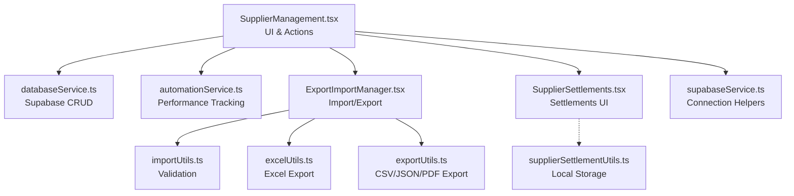
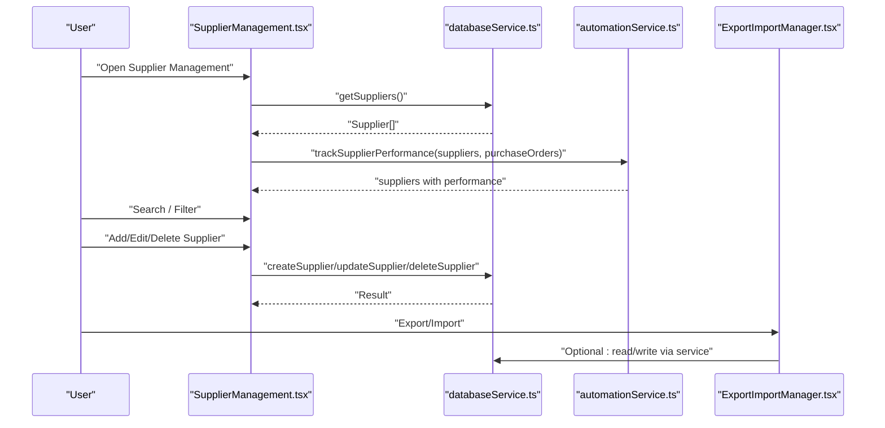
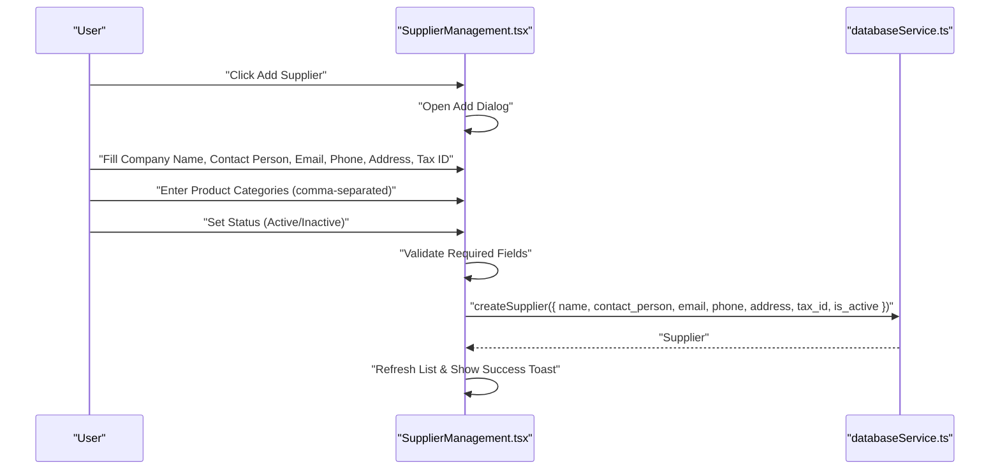
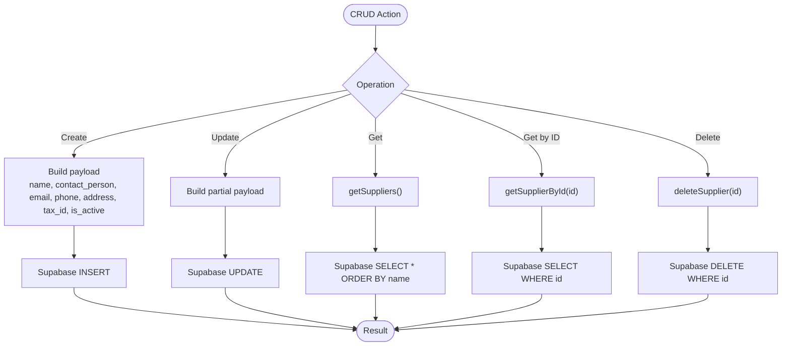
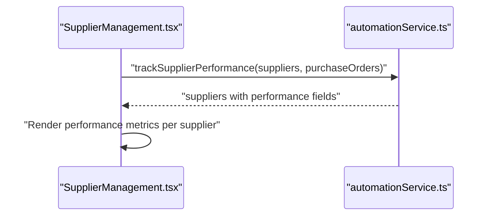
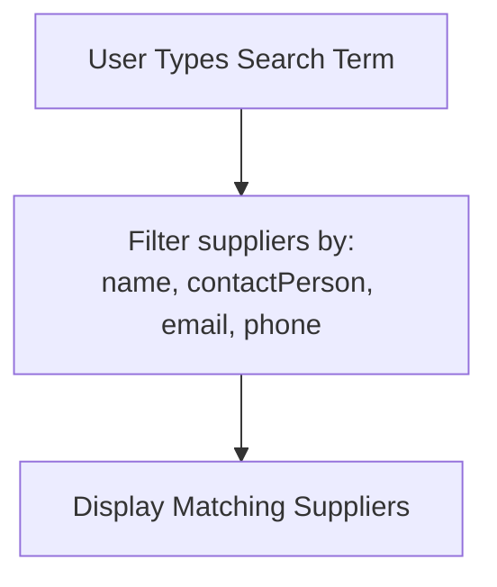
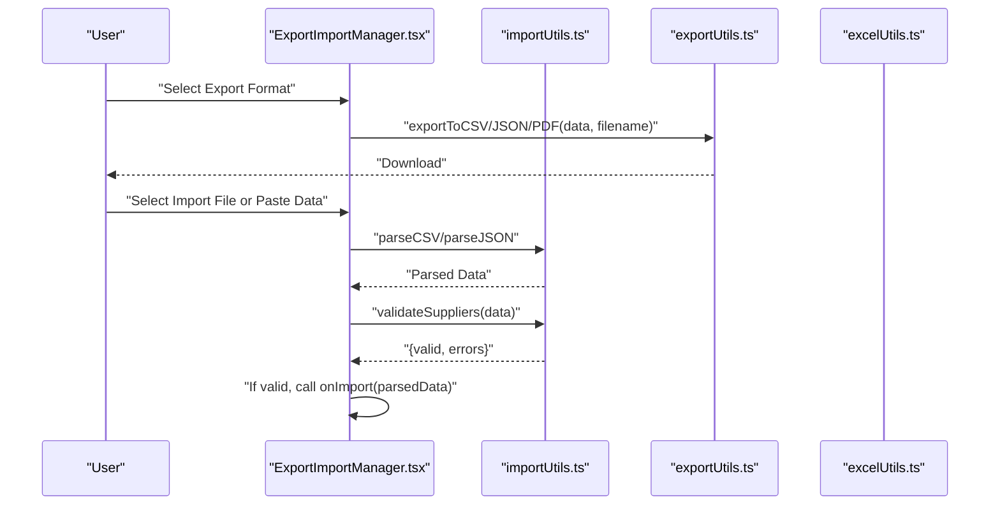
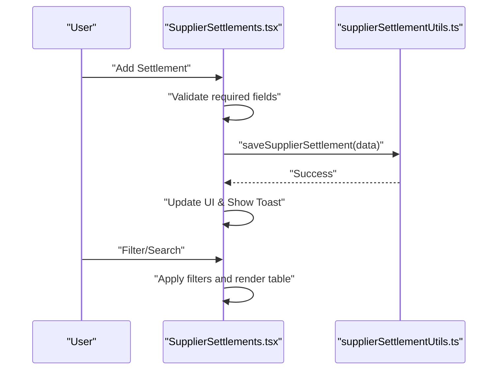
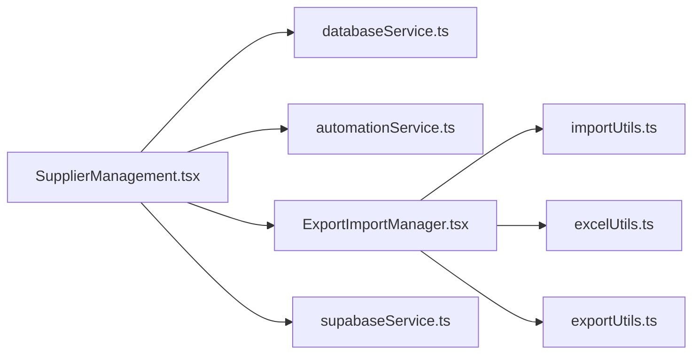

# Supplier Profiles and Registration

<cite>
**Referenced Files in This Document**
- [SupplierManagement.tsx](file://src/pages/SupplierManagement.tsx)
- [databaseService.ts](file://src/services/databaseService.ts)
- [automationService.ts](file://src/services/automationService.ts)
- [ExportImportManager.tsx](file://src/components/ExportImportManager.tsx)
- [importUtils.ts](file://src/utils/importUtils.ts)
- [excelUtils.ts](file://src/utils/excelUtils.ts)
- [exportUtils.ts](file://src/utils/exportUtils.ts)
- [SupplierSettlements.tsx](file://src/pages/SupplierSettlements.tsx)
- [supplierSettlementUtils.ts](file://src/utils/supplierSettlementUtils.ts)
- [supabaseService.ts](file://src/services/supabaseService.ts)
</cite>

## Table of Contents
1. [Introduction](#introduction)
2. [Project Structure](#project-structure)
3. [Core Components](#core-components)
4. [Architecture Overview](#architecture-overview)
5. [Detailed Component Analysis](#detailed-component-analysis)
6. [Dependency Analysis](#dependency-analysis)
7. [Performance Considerations](#performance-considerations)
8. [Troubleshooting Guide](#troubleshooting-guide)
9. [Conclusion](#conclusion)

## Introduction
This document explains supplier profile management in Royal POS Modern, covering the complete supplier registration workflow, CRUD operations, status management, performance tracking, search and filtering, and import/export capabilities. It also documents supplier settlement integration and provides practical examples, validation rules, and troubleshooting guidance to ensure data integrity and consistency.

## Project Structure
Supplier management spans UI pages, services, utilities, and database integration:
- Page: SupplierManagement handles supplier CRUD, search, refresh, and import/export
- Services: databaseService provides typed CRUD operations against Supabase
- Utilities: importUtils and excelUtils support bulk operations
- Automation: automationService enriches supplier data with performance metrics
- Settlements: SupplierSettlements and supplierSettlementUtils manage supplier payments

**Diagram sources**
- [SupplierManagement.tsx:1-591](file://src/pages/SupplierManagement.tsx#L1-L591)
- [databaseService.ts:1298-1337](file://src/services/databaseService.ts#L1298-L1337)
- [automationService.ts:128-152](file://src/services/automationService.ts#L128-L152)
- [ExportImportManager.tsx:1-259](file://src/components/ExportImportManager.tsx#L1-L259)
- [importUtils.ts:94-114](file://src/utils/importUtils.ts#L94-L114)
- [excelUtils.ts:1-36](file://src/utils/excelUtils.ts#L1-L36)
- [exportUtils.ts:13-41](file://src/utils/exportUtils.ts#L13-L41)
- [SupplierSettlements.tsx:1-473](file://src/pages/SupplierSettlements.tsx#L1-L473)
- [supplierSettlementUtils.ts:24-48](file://src/utils/supplierSettlementUtils.ts#L24-L48)
- [supabaseService.ts:1-60](file://src/services/supabaseService.ts#L1-L60)

**Section sources**
- [SupplierManagement.tsx:1-591](file://src/pages/SupplierManagement.tsx#L1-L591)
- [databaseService.ts:1298-1337](file://src/services/databaseService.ts#L1298-L1337)
- [automationService.ts:128-152](file://src/services/automationService.ts#L128-L152)
- [ExportImportManager.tsx:1-259](file://src/components/ExportImportManager.tsx#L1-L259)
- [importUtils.ts:94-114](file://src/utils/importUtils.ts#L94-L114)
- [excelUtils.ts:1-36](file://src/utils/excelUtils.ts#L1-L36)
- [exportUtils.ts:13-41](file://src/utils/exportUtils.ts#L13-L41)
- [SupplierSettlements.tsx:1-473](file://src/pages/SupplierSettlements.tsx#L1-L473)
- [supplierSettlementUtils.ts:24-48](file://src/utils/supplierSettlementUtils.ts#L24-L48)
- [supabaseService.ts:1-60](file://src/services/supabaseService.ts#L1-L60)

## Core Components
- SupplierManagement page: Provides the main UI for supplier registration, editing, deletion, search, refresh, and import/export
- databaseService: Implements typed CRUD operations for suppliers via Supabase
- automationService: Adds supplier performance metrics (on-time delivery rate, average order value)
- ExportImportManager: Enables export to CSV/Excel/JSON/PDF and import from CSV/JSON with validation
- importUtils: Validates supplier import data structure
- excelUtils: Exports supplier lists to Excel-compatible CSV
- exportUtils: Exports supplier lists to CSV/JSON/PDF
- SupplierSettlements: Manages supplier payment records and integrates with supplierSettlementUtils for local persistence
- supplierSettlementUtils: Local storage utilities for supplier settlements
- supabaseService: Connection helpers and example Supabase operations

**Section sources**
- [SupplierManagement.tsx:17-28](file://src/pages/SupplierManagement.tsx#L17-L28)
- [databaseService.ts:62-78](file://src/services/databaseService.ts#L62-L78)
- [automationService.ts:128-152](file://src/services/automationService.ts#L128-L152)
- [ExportImportManager.tsx:22-26](file://src/components/ExportImportManager.tsx#L22-L26)
- [importUtils.ts:94-114](file://src/utils/importUtils.ts#L94-L114)
- [excelUtils.ts:1-36](file://src/utils/excelUtils.ts#L1-L36)
- [exportUtils.ts:13-41](file://src/utils/exportUtils.ts#L13-L41)
- [SupplierSettlements.tsx:15-26](file://src/pages/SupplierSettlements.tsx#L15-L26)
- [supplierSettlementUtils.ts:3-22](file://src/utils/supplierSettlementUtils.ts#L3-L22)
- [supabaseService.ts:1-60](file://src/services/supabaseService.ts#L1-L60)

## Architecture Overview
The supplier management architecture connects UI actions to Supabase-backed services, with optional performance enrichment and import/export utilities.

**Diagram sources**
- [SupplierManagement.tsx:48-79](file://src/pages/SupplierManagement.tsx#L48-L79)
- [automationService.ts:128-152](file://src/services/automationService.ts#L128-L152)
- [ExportImportManager.tsx:34-67](file://src/components/ExportImportManager.tsx#L34-L67)
- [databaseService.ts:1298-1337](file://src/services/databaseService.ts#L1298-L1337)

## Detailed Component Analysis

### Supplier Registration Workflow
End-to-end supplier registration includes capturing company information, contact details, tax ID, and product categories supplied, followed by status assignment and performance tracking.

Key fields captured during registration:
- Company Name: required
- Contact Person: required
- Email: optional
- Phone: optional
- Address: optional
- Tax ID (TIN): optional
- Product Categories Supplied: comma-separated list stored as an array
- Status: active or inactive

**Diagram sources**
- [SupplierManagement.tsx:81-136](file://src/pages/SupplierManagement.tsx#L81-L136)
- [databaseService.ts:1329-1337](file://src/services/databaseService.ts#L1329-L1337)

**Section sources**
- [SupplierManagement.tsx:36-45](file://src/pages/SupplierManagement.tsx#L36-L45)
- [SupplierManagement.tsx:81-136](file://src/pages/SupplierManagement.tsx#L81-L136)
- [databaseService.ts:1329-1337](file://src/services/databaseService.ts#L1329-L1337)

### Supplier CRUD Operations
- Retrieve: getSuppliers() returns all suppliers ordered by name
- Retrieve by ID: getSupplierById(id) returns a single supplier
- Create: createSupplier(payload) inserts a new supplier
- Update: updateSupplier(id, payload) modifies an existing supplier
- Delete: deleteSupplier(id) removes a supplier

Field mapping for create/update:
- name → name
- contact_person → contactPerson
- email → email
- phone → phone
- address → address
- tax_id → taxId
- is_active → status (active/inactive)

**Diagram sources**
- [databaseService.ts:1298-1337](file://src/services/databaseService.ts#L1298-L1337)

**Section sources**
- [databaseService.ts:1298-1337](file://src/services/databaseService.ts#L1298-L1337)

### Supplier Status Management
- Status is represented as active/inactive
- During create/update, is_active maps to status
- UI displays status as a badge with distinct variants

Practical usage:
- Newly created suppliers default to active
- Deactivation can be performed via edit dialog

**Section sources**
- [SupplierManagement.tsx:44](file://src/pages/SupplierManagement.tsx#L44)
- [SupplierManagement.tsx:106-115](file://src/pages/SupplierManagement.tsx#L106-L115)
- [SupplierManagement.tsx:202-204](file://src/pages/SupplierManagement.tsx#L202-L204)

### Supplier Performance Tracking Integration
Supplier performance is computed off-line using automationService.trackSupplierPerformance(suppliers, purchaseOrders). Metrics include:
- On-time delivery rate (%)
- Average order value

The page applies performance tracking to the loaded supplier list and displays metrics alongside supplier entries.

**Diagram sources**
- [SupplierManagement.tsx:307-307](file://src/pages/SupplierManagement.tsx#L307-L307)
- [automationService.ts:128-152](file://src/services/automationService.ts#L128-L152)

**Section sources**
- [SupplierManagement.tsx:307-314](file://src/pages/SupplierManagement.tsx#L307-L314)
- [automationService.ts:128-152](file://src/services/automationService.ts#L128-L152)

### Supplier Search and Filtering
- Real-time search across name, contact person, email, and phone
- Case-insensitive substring matching
- Combined with performance tracking results

**Diagram sources**
- [SupplierManagement.tsx:309-314](file://src/pages/SupplierManagement.tsx#L309-L314)

**Section sources**
- [SupplierManagement.tsx:309-314](file://src/pages/SupplierManagement.tsx#L309-L314)

### Import/Export Features for Bulk Supplier Management
- Export supported formats: CSV, Excel, JSON, PDF
- Import supported formats: CSV, JSON with validation
- Validation ensures required fields (name, contactPerson) are present

Supported validations:
- name is required
- contactPerson is required

**Diagram sources**
- [ExportImportManager.tsx:34-67](file://src/components/ExportImportManager.tsx#L34-L67)
- [ExportImportManager.tsx:69-161](file://src/components/ExportImportManager.tsx#L69-L161)
- [importUtils.ts:94-114](file://src/utils/importUtils.ts#L94-L114)
- [excelUtils.ts:1-36](file://src/utils/excelUtils.ts#L1-L36)
- [exportUtils.ts:13-41](file://src/utils/exportUtils.ts#L13-L41)

**Section sources**
- [ExportImportManager.tsx:28-259](file://src/components/ExportImportManager.tsx#L28-L259)
- [importUtils.ts:94-114](file://src/utils/importUtils.ts#L94-L114)
- [excelUtils.ts:1-36](file://src/utils/excelUtils.ts#L1-L36)
- [exportUtils.ts:13-41](file://src/utils/exportUtils.ts#L13-L41)

### Supplier Settlement Integration
Supplier payments are tracked in SupplierSettlements with local persistence via supplierSettlementUtils. The page supports:
- Adding, editing, and deleting settlements
- Filtering by status and search by supplier/reference/PO
- Summary cards for total paid, transaction count, and recent activity

**Diagram sources**
- [SupplierSettlements.tsx:68-95](file://src/pages/SupplierSettlements.tsx#L68-L95)
- [supplierSettlementUtils.ts:24-48](file://src/utils/supplierSettlementUtils.ts#L24-L48)

**Section sources**
- [SupplierSettlements.tsx:15-26](file://src/pages/SupplierSettlements.tsx#L15-L26)
- [SupplierSettlements.tsx:68-123](file://src/pages/SupplierSettlements.tsx#L68-L123)
- [supplierSettlementUtils.ts:24-48](file://src/utils/supplierSettlementUtils.ts#L24-L48)

## Dependency Analysis
SupplierManagement depends on:
- databaseService for CRUD operations
- automationService for performance metrics
- ExportImportManager for bulk operations
- Supabase connection helpers

**Diagram sources**
- [SupplierManagement.tsx:15-15](file://src/pages/SupplierManagement.tsx#L15-L15)
- [databaseService.ts:1298-1337](file://src/services/databaseService.ts#L1298-L1337)
- [automationService.ts:128-152](file://src/services/automationService.ts#L128-L152)
- [ExportImportManager.tsx:18-21](file://src/components/ExportImportManager.tsx#L18-L21)
- [importUtils.ts:1-114](file://src/utils/importUtils.ts#L1-L114)
- [excelUtils.ts:1-36](file://src/utils/excelUtils.ts#L1-L36)
- [exportUtils.ts:1-785](file://src/utils/exportUtils.ts#L1-L785)
- [supabaseService.ts:1-60](file://src/services/supabaseService.ts#L1-L60)

**Section sources**
- [SupplierManagement.tsx:15-15](file://src/pages/SupplierManagement.tsx#L15-L15)
- [databaseService.ts:1298-1337](file://src/services/databaseService.ts#L1298-L1337)
- [automationService.ts:128-152](file://src/services/automationService.ts#L128-L152)
- [ExportImportManager.tsx:18-21](file://src/components/ExportImportManager.tsx#L18-L21)
- [importUtils.ts:1-114](file://src/utils/importUtils.ts#L1-L114)
- [excelUtils.ts:1-36](file://src/utils/excelUtils.ts#L1-L36)
- [exportUtils.ts:1-785](file://src/utils/exportUtils.ts#L1-L785)
- [supabaseService.ts:1-60](file://src/services/supabaseService.ts#L1-L60)

## Performance Considerations
- Search/filter runs client-side on the loaded supplier list; keep lists reasonably sized for responsive filtering
- Performance metrics are computed client-side; ensure purchaseOrders input remains minimal or paginated for large datasets
- Export operations serialize large arrays; consider server-side export for very large datasets
- Import validation occurs before applying changes; keep CSV/JSON sizes manageable to avoid long validation times

## Troubleshooting Guide
Common issues and resolutions:
- Supabase connectivity failures
  - Use supabaseService.testSupabaseConnection() to verify connectivity
  - Confirm Supabase project credentials and network access
- RLS policy errors
  - databaseService.applyRLSPoliciesFix() prepares SQL commands; run them in the Supabase SQL editor
  - Verify policies allow read/write for the suppliers table
- Import validation errors
  - importUtils.validateSuppliers checks presence of name and contactPerson
  - Ensure CSV/JSON includes required fields and correct column names
- Export/download issues
  - exportUtils/exportToCSV/exportToJSON/exportToPDF require data; ensure data is present
  - excelUtils exports Excel-compatible CSV; confirm browser allows downloads
- Supplier not appearing after import
  - handleImportSuppliers updates the in-memory list; trigger refresh to reload from database
- Supplier status not updating
  - Ensure is_active flag is correctly mapped to status during create/update

**Section sources**
- [supabaseService.ts:4-23](file://src/services/supabaseService.ts#L4-L23)
- [databaseService.ts:1140-1160](file://src/services/databaseService.ts#L1140-L1160)
- [importUtils.ts:94-114](file://src/utils/importUtils.ts#L94-L114)
- [excelUtils.ts:1-36](file://src/utils/excelUtils.ts#L1-L36)
- [exportUtils.ts:13-41](file://src/utils/exportUtils.ts#L13-L41)
- [SupplierManagement.tsx:139-168](file://src/pages/SupplierManagement.tsx#L139-L168)

## Conclusion
Royal POS Modern’s supplier profile management provides a robust foundation for supplier registration, maintenance, and analytics. The system integrates Supabase-backed CRUD, client-side performance tracking, and flexible import/export capabilities. Adhering to validation rules and troubleshooting steps ensures reliable supplier data management and operational continuity.