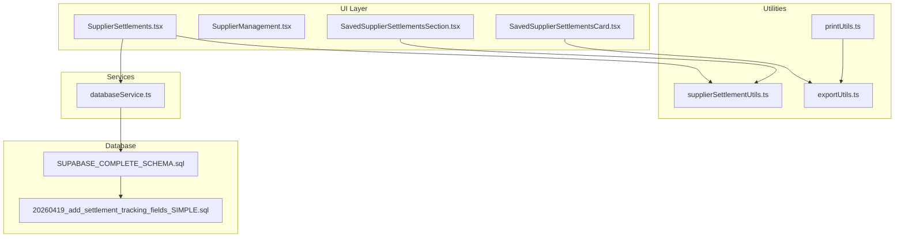
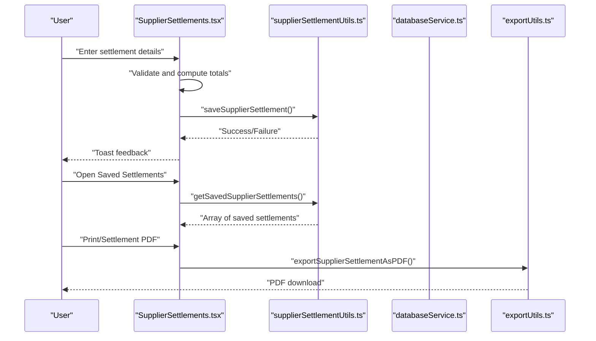
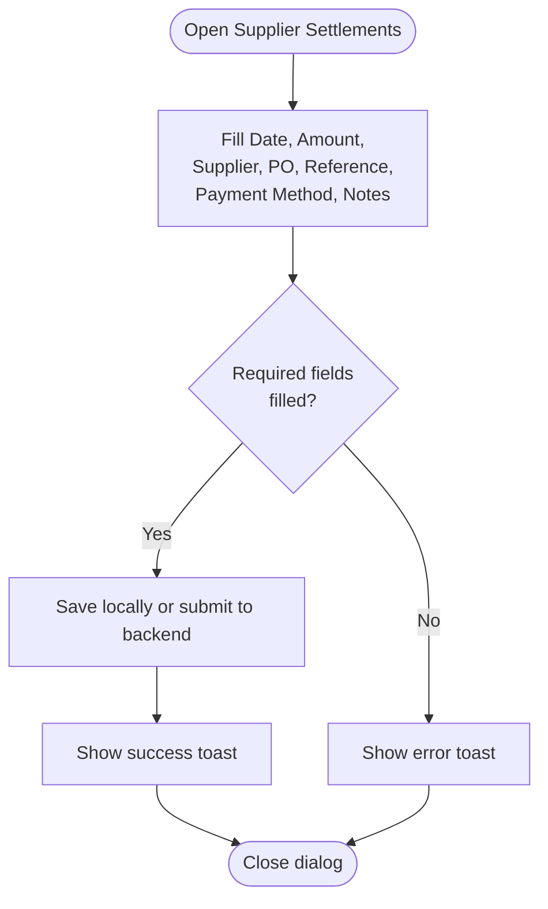
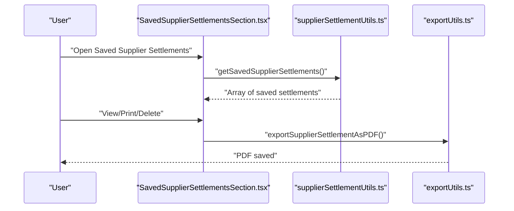
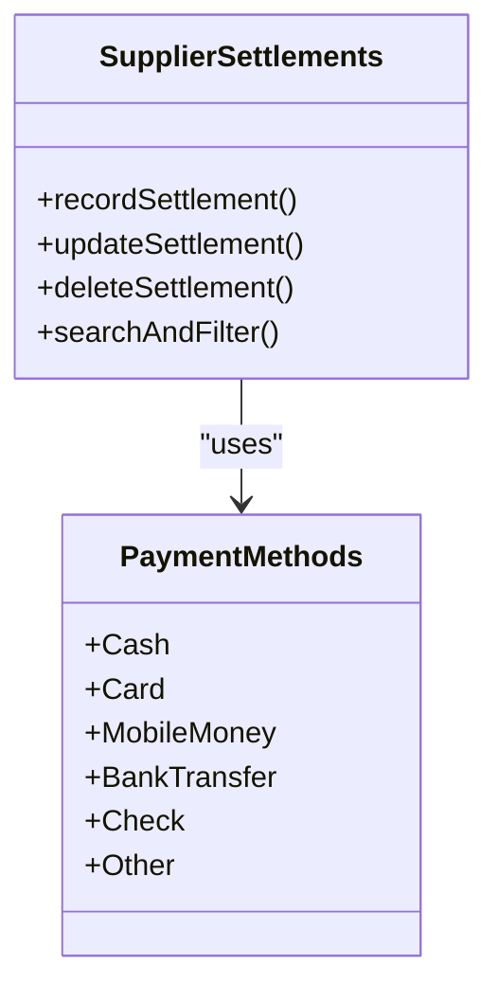
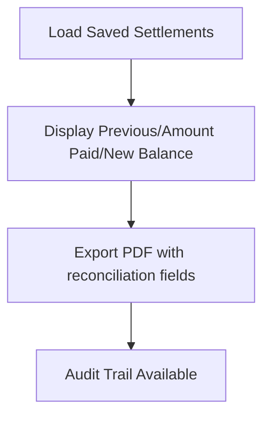
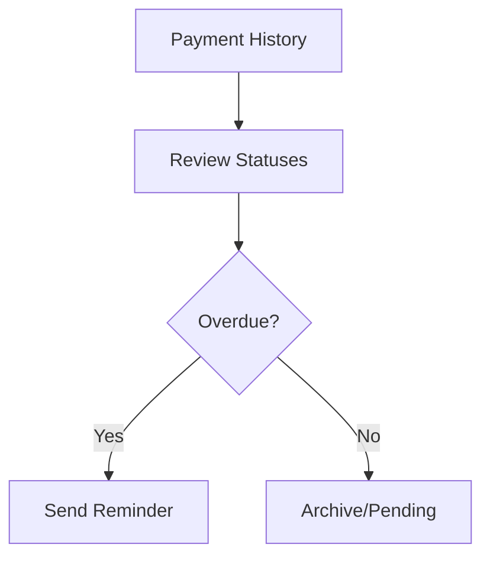
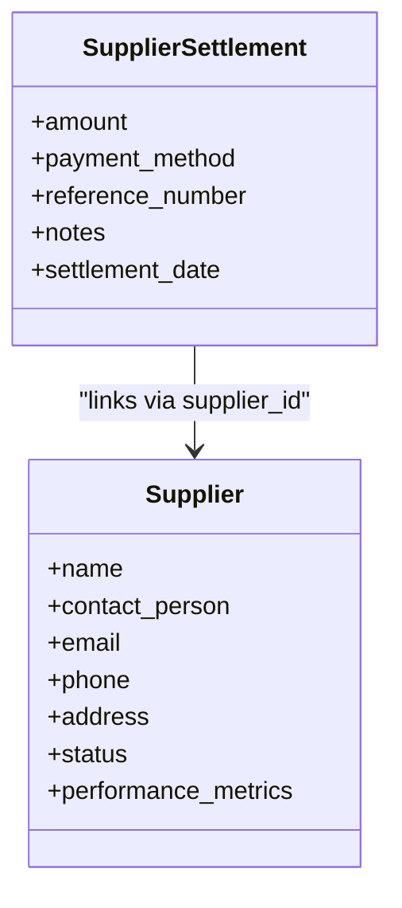
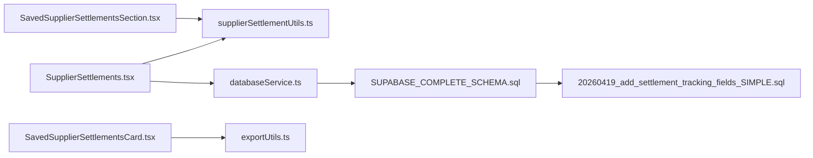
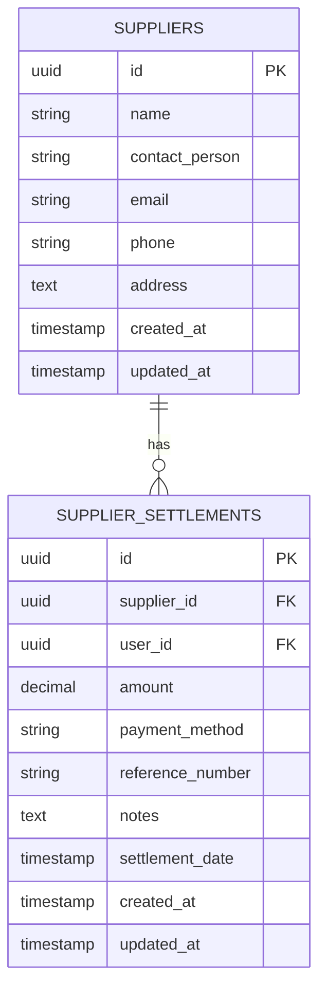

# Supplier Settlements and Payments

<cite>
**Referenced Files in This Document**
- [SupplierSettlements.tsx](file://src/pages/SupplierSettlements.tsx)
- [SavedSupplierSettlementsSection.tsx](file://src/components/SavedSupplierSettlementsSection.tsx)
- [SavedSupplierSettlementsCard.tsx](file://src/components/SavedSupplierSettlementsCard.tsx)
- [supplierSettlementUtils.ts](file://src/utils/supplierSettlementUtils.ts)
- [SupplierManagement.tsx](file://src/pages/SupplierManagement.tsx)
- [exportUtils.ts](file://src/utils/exportUtils.ts)
- [printUtils.ts](file://src/utils/printUtils.ts)
- [databaseService.ts](file://src/services/databaseService.ts)
- [SUPABASE_COMPLETE_SCHEMA.sql](file://SUPABASE_COMPLETE_SCHEMA.sql)
- [20260419_add_settlement_tracking_fields_SIMPLE.sql](file://migrations/20260419_add_settlement_tracking_fields_SIMPLE.sql)
</cite>

## Table of Contents
1. [Introduction](#introduction)
2. [Project Structure](#project-structure)
3. [Core Components](#core-components)
4. [Architecture Overview](#architecture-overview)
5. [Detailed Component Analysis](#detailed-component-analysis)
6. [Dependency Analysis](#dependency-analysis)
7. [Performance Considerations](#performance-considerations)
8. [Troubleshooting Guide](#troubleshooting-guide)
9. [Conclusion](#conclusion)
10. [Appendices](#appendices)

## Introduction
This document explains the supplier settlement and payment system in Royal POS Modern. It covers the end-to-end workflow from settlement calculation and recording through payment execution, reconciliation, and reporting. It also documents supported payment methods, settlement types, scheduling, reconciliation, outstanding balances, payment history, reminders, overdue management, credit limits, negotiation, and relationship management. Practical examples and system architecture diagrams illustrate how the frontend components, utilities, and backend services collaborate to manage supplier payments.

## Project Structure
The supplier settlement system spans UI pages, reusable components, utilities for persistence and exports, and backend services integrated with Supabase. Key areas:
- Pages: SupplierSettlements (entry for manual recording), SupplierManagement (vendor directory), and SavedSupplierSettlementsSection (historical view).
- Utilities: supplierSettlementUtils (local persistence), exportUtils (PDF exports), printUtils (receipt printing).
- Services: databaseService (CRUD for supplier settlements via Supabase).
- Database: SUPABASE_COMPLETE_SCHEMA.sql defines supplier_settlements table; migrations add tracking fields.

**Diagram sources**
- [SupplierSettlements.tsx:1-473](file://src/pages/SupplierSettlements.tsx#L1-L473)
- [SupplierManagement.tsx:1-591](file://src/pages/SupplierManagement.tsx#L1-L591)
- [SavedSupplierSettlementsSection.tsx:1-283](file://src/components/SavedSupplierSettlementsSection.tsx#L1-L283)
- [SavedSupplierSettlementsCard.tsx:1-143](file://src/components/SavedSupplierSettlementsCard.tsx#L1-L143)
- [supplierSettlementUtils.ts:1-121](file://src/utils/supplierSettlementUtils.ts#L1-L121)
- [exportUtils.ts:1-785](file://src/utils/exportUtils.ts#L1-L785)
- [printUtils.ts:1-800](file://src/utils/printUtils.ts#L1-L800)
- [databaseService.ts:2545-2607](file://src/services/databaseService.ts#L2545-L2607)
- [SUPABASE_COMPLETE_SCHEMA.sql:285-296](file://SUPABASE_COMPLETE_SCHEMA.sql#L285-L296)
- [20260419_add_settlement_tracking_fields_SIMPLE.sql:1-26](file://migrations/20260419_add_settlement_tracking_fields_SIMPLE.sql#L1-L26)

**Section sources**
- [SupplierSettlements.tsx:1-473](file://src/pages/SupplierSettlements.tsx#L1-L473)
- [SupplierManagement.tsx:1-591](file://src/pages/SupplierManagement.tsx#L1-L591)
- [SavedSupplierSettlementsSection.tsx:1-283](file://src/components/SavedSupplierSettlementsSection.tsx#L1-L283)
- [SavedSupplierSettlementsCard.tsx:1-143](file://src/components/SavedSupplierSettlementsCard.tsx#L1-L143)
- [supplierSettlementUtils.ts:1-121](file://src/utils/supplierSettlementUtils.ts#L1-L121)
- [exportUtils.ts:1-785](file://src/utils/exportUtils.ts#L1-L785)
- [printUtils.ts:1-800](file://src/utils/printUtils.ts#L1-L800)
- [databaseService.ts:2545-2607](file://src/services/databaseService.ts#L2545-L2607)
- [SUPABASE_COMPLETE_SCHEMA.sql:285-296](file://SUPABASE_COMPLETE_SCHEMA.sql#L285-L296)
- [20260419_add_settlement_tracking_fields_SIMPLE.sql:1-26](file://migrations/20260419_add_settlement_tracking_fields_SIMPLE.sql#L1-L26)

## Core Components
- SupplierSettlements page: Allows manual recording of supplier payments with fields for date, amount, supplier, PO number, reference, payment method, status, and notes. Includes filtering by status and search by supplier/reference/PO.
- SavedSupplierSettlementsSection: Displays saved supplier settlements, supports search, view details, print/download PDF, and delete.
- SavedSupplierSettlementsCard: Compact card layout for each saved settlement with status badges, amounts, and action buttons.
- supplierSettlementUtils: Local persistence layer for supplier settlements using localStorage, with helpers to save, load, update, delete, and format settlement data.
- exportUtils: Generates PDFs for supplier settlements and receipts using jsPDF and autoTable.
- printUtils: Provides receipt printing and QR code generation for purchase transactions.
- databaseService: Backend integration for CRUD operations on supplier_settlements via Supabase.
- SUPABASE_COMPLETE_SCHEMA.sql: Defines the supplier_settlements table and related entities.
- 20260419_add_settlement_tracking fields migration: Adds cashier, prepared_by, and approved_by columns to customer_settlements (relevant for settlement tracking patterns).

Key capabilities:
- Settlement recording with status tracking (completed/pending/cancelled).
- Local and remote persistence options.
- PDF generation and printing.
- Supplier directory management.

**Section sources**
- [SupplierSettlements.tsx:15-95](file://src/pages/SupplierSettlements.tsx#L15-L95)
- [SavedSupplierSettlementsSection.tsx:21-122](file://src/components/SavedSupplierSettlementsSection.tsx#L21-L122)
- [SavedSupplierSettlementsCard.tsx:7-50](file://src/components/SavedSupplierSettlementsCard.tsx#L7-L50)
- [supplierSettlementUtils.ts:24-121](file://src/utils/supplierSettlementUtils.ts#L24-L121)
- [exportUtils.ts:403-536](file://src/utils/exportUtils.ts#L403-L536)
- [printUtils.ts:420-751](file://src/utils/printUtils.ts#L420-L751)
- [databaseService.ts:2545-2607](file://src/services/databaseService.ts#L2545-L2607)
- [SUPABASE_COMPLETE_SCHEMA.sql:285-296](file://SUPABASE_COMPLETE_SCHEMA.sql#L285-L296)
- [20260419_add_settlement_tracking_fields_SIMPLE.sql:9-18](file://migrations/20260419_add_settlement_tracking_fields_SIMPLE.sql#L9-L18)

## Architecture Overview
The system combines local-first UX with optional backend persistence. Users record settlements on the SupplierSettlements page, which can be persisted locally via supplierSettlementUtils or remotely via databaseService. Saved settlements are browsed in SavedSupplierSettlementsSection, with actions to print or download PDFs.

**Diagram sources**
- [SupplierSettlements.tsx:68-123](file://src/pages/SupplierSettlements.tsx#L68-L123)
- [supplierSettlementUtils.ts:24-79](file://src/utils/supplierSettlementUtils.ts#L24-L79)
- [exportUtils.ts:403-536](file://src/utils/exportUtils.ts#L403-L536)

## Detailed Component Analysis

### Supplier Settlement Recording Workflow
- Data model includes supplier identity, amount, payment method, reference, PO number, notes, date, and status.
- Validation ensures required fields are present before saving.
- Reference generation can auto-populate or accept user input.
- Status defaults to completed; can be changed to pending or cancelled.

**Diagram sources**
- [SupplierSettlements.tsx:68-95](file://src/pages/SupplierSettlements.tsx#L68-L95)

**Section sources**
- [SupplierSettlements.tsx:15-95](file://src/pages/SupplierSettlements.tsx#L15-L95)

### Saved Settlements Management
- Loads saved settlements from localStorage and converts to display format.
- Supports search across reference, supplier name, method, and ID.
- Actions: view details, print, download PDF, delete.

**Diagram sources**
- [SavedSupplierSettlementsSection.tsx:44-122](file://src/components/SavedSupplierSettlementsSection.tsx#L44-L122)
- [supplierSettlementUtils.ts:50-79](file://src/utils/supplierSettlementUtils.ts#L50-L79)
- [exportUtils.ts:403-536](file://src/utils/exportUtils.ts#L403-L536)

**Section sources**
- [SavedSupplierSettlementsSection.tsx:36-122](file://src/components/SavedSupplierSettlementsSection.tsx#L36-L122)
- [SavedSupplierSettlementsCard.tsx:31-143](file://src/components/SavedSupplierSettlementsCard.tsx#L31-L143)

### Payment Methods and Execution
- Supported methods include Cash, Credit Card, Debit Card, Bank Transfer, Check, Other.
- For purchase transactions, the system supports Cash, Card, Mobile Money, and Debt in UI touch controls.
- PDF receipts and purchase receipts can be printed or downloaded.

**Diagram sources**
- [SupplierSettlements.tsx:28-35](file://src/pages/SupplierSettlements.tsx#L28-L35)
- [SalesCart.tsx:1526-1551](file://src/pages/SalesCart.tsx#L1526-L1551)

**Section sources**
- [SupplierSettlements.tsx:28-35](file://src/pages/SupplierSettlements.tsx#L28-L35)
- [SalesCart.tsx:1526-1551](file://src/pages/SalesCart.tsx#L1526-L1551)

### Reconciliation and Outstanding Balances
- Settlement records include previous balance, amount paid, and new balance fields for reconciliation.
- Saved settlement cards display amount paid and new balance when available.
- PDF exports embed reconciliation details for audit trails.

**Diagram sources**
- [SavedSupplierSettlementsSection.tsx:52-66](file://src/components/SavedSupplierSettlementsSection.tsx#L52-L66)
- [SavedSupplierSettlementsCard.tsx:91-99](file://src/components/SavedSupplierSettlementsCard.tsx#L91-L99)
- [exportUtils.ts:403-536](file://src/utils/exportUtils.ts#L403-L536)

**Section sources**
- [SavedSupplierSettlementsSection.tsx:52-66](file://src/components/SavedSupplierSettlementsSection.tsx#L52-L66)
- [SavedSupplierSettlementsCard.tsx:91-99](file://src/components/SavedSupplierSettlementsCard.tsx#L91-L99)
- [exportUtils.ts:403-536](file://src/utils/exportUtils.ts#L403-L536)

### Payment History, Reminders, and Overdue Management
- Payment history is maintained as saved/local settlement records with timestamps and statuses.
- Overdue management can be modeled by adding due dates and status tracking to settlement records (conceptual extension).
- Reminders can be implemented by scanning outstanding settlements and notifying users (conceptual extension).

[No sources needed since this diagram shows conceptual workflow, not actual code structure]

### Supplier Credit Limits, Terms, and Relationship Management
- Credit limits and payment terms are not currently modeled in the schema or UI.
- Relationship management features (e.g., performance metrics) are demonstrated in the SupplierManagement page with automated tracking.

**Diagram sources**
- [SupplierManagement.tsx:17-28](file://src/pages/SupplierManagement.tsx#L17-L28)
- [SUPABASE_COMPLETE_SCHEMA.sql:285-296](file://SUPABASE_COMPLETE_SCHEMA.sql#L285-L296)

**Section sources**
- [SupplierManagement.tsx:30-308](file://src/pages/SupplierManagement.tsx#L30-L308)
- [SUPABASE_COMPLETE_SCHEMA.sql:68-78](file://SUPABASE_COMPLETE_SCHEMA.sql#L68-L78)
- [SUPABASE_COMPLETE_SCHEMA.sql:285-296](file://SUPABASE_COMPLETE_SCHEMA.sql#L285-L296)

### Practical Examples
- Example scenario: Record a supplier payment of a specific amount via Bank Transfer with a PO number and reference. The system validates inputs, saves the record, and updates summaries.
- Example workflow: View saved settlement details, print a PDF receipt for reconciliation, and download a PDF for archiving.
- Example integration: Use exportUtils to generate a PDF settlement with supplier details, payment method, previous/new balances, and notes.

**Section sources**
- [SupplierSettlements.tsx:68-123](file://src/pages/SupplierSettlements.tsx#L68-L123)
- [SavedSupplierSettlementsSection.tsx:109-121](file://src/components/SavedSupplierSettlementsSection.tsx#L109-L121)
- [exportUtils.ts:403-536](file://src/utils/exportUtils.ts#L403-L536)

## Dependency Analysis
- UI components depend on supplierSettlementUtils for local persistence and exportUtils for PDF generation.
- databaseService abstracts backend operations for supplier settlements.
- SUPABASE_COMPLETE_SCHEMA.sql defines the supplier_settlements table and related entities.
- The migration adds settlement tracking fields to customer_settlements, indicating patterns applicable to supplier settlements.

**Diagram sources**
- [SupplierSettlements.tsx:1-14](file://src/pages/SupplierSettlements.tsx#L1-L14)
- [SavedSupplierSettlementsSection.tsx:7-13](file://src/components/SavedSupplierSettlementsSection.tsx#L7-L13)
- [supplierSettlementUtils.ts:1-3](file://src/utils/supplierSettlementUtils.ts#L1-L3)
- [exportUtils.ts:1-10](file://src/utils/exportUtils.ts#L1-L10)
- [databaseService.ts:2545-2547](file://src/services/databaseService.ts#L2545-L2547)
- [SUPABASE_COMPLETE_SCHEMA.sql:285-296](file://SUPABASE_COMPLETE_SCHEMA.sql#L285-L296)
- [20260419_add_settlement_tracking_fields_SIMPLE.sql:9-18](file://migrations/20260419_add_settlement_tracking_fields_SIMPLE.sql#L9-L18)

**Section sources**
- [databaseService.ts:2545-2607](file://src/services/databaseService.ts#L2545-L2607)
- [SUPABASE_COMPLETE_SCHEMA.sql:285-296](file://SUPABASE_COMPLETE_SCHEMA.sql#L285-L296)
- [20260419_add_settlement_tracking_fields_SIMPLE.sql:9-18](file://migrations/20260419_add_settlement_tracking_fields_SIMPLE.sql#L9-L18)

## Performance Considerations
- Local storage operations are synchronous and suitable for small datasets; consider pagination or server-side filtering for large histories.
- PDF generation occurs client-side; large datasets may increase render time—consider virtualization or server-side rendering for heavy reports.
- Debounce search inputs to reduce re-renders during filtering.

[No sources needed since this section provides general guidance]

## Troubleshooting Guide
- Toast errors appear when required fields are missing during settlement recording.
- Local storage failures are caught and logged; verify browser permissions and available quota.
- PDF generation requires jsPDF and autoTable; ensure dependencies are loaded and network connectivity for QR code generation.

**Section sources**
- [SupplierSettlements.tsx:69-76](file://src/pages/SupplierSettlements.tsx#L69-L76)
- [supplierSettlementUtils.ts:44-47](file://src/utils/supplierSettlementUtils.ts#L44-L47)
- [exportUtils.ts:11-10](file://src/utils/exportUtils.ts#L11-L10)

## Conclusion
Royal POS Modern’s supplier settlement system provides a robust foundation for recording, managing, and reconciling supplier payments. It supports multiple payment methods, local and remote persistence, and comprehensive PDF export/printing. While credit limits, payment terms, and overdue management are not currently implemented, the underlying schema and UI patterns enable straightforward extensions to support advanced supplier relationship management and compliance reporting.

## Appendices

### Data Model: Supplier Settlements

**Diagram sources**
- [SUPABASE_COMPLETE_SCHEMA.sql:68-78](file://SUPABASE_COMPLETE_SCHEMA.sql#L68-L78)
- [SUPABASE_COMPLETE_SCHEMA.sql:285-296](file://SUPABASE_COMPLETE_SCHEMA.sql#L285-L296)