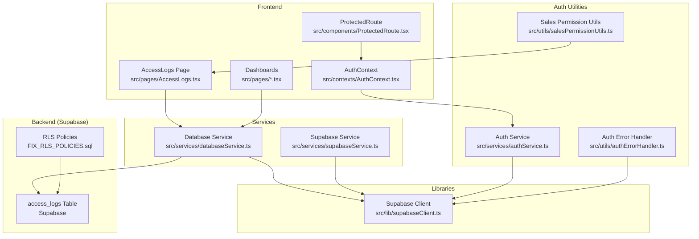
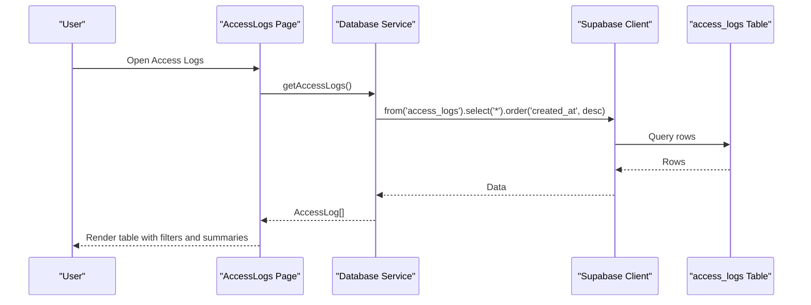
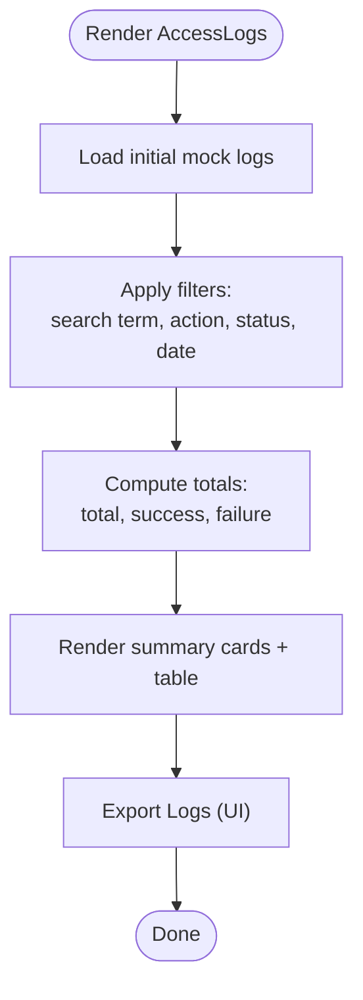
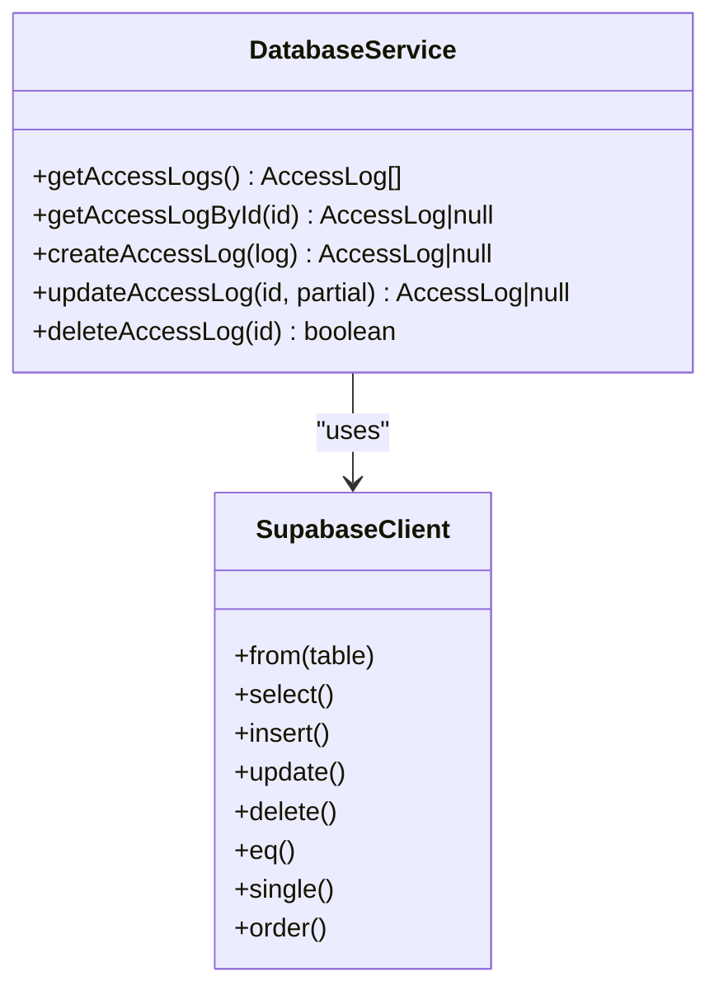
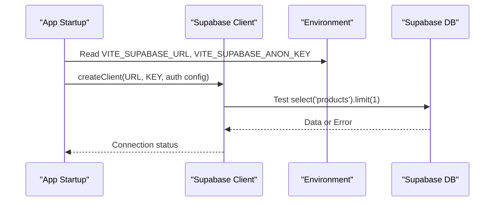
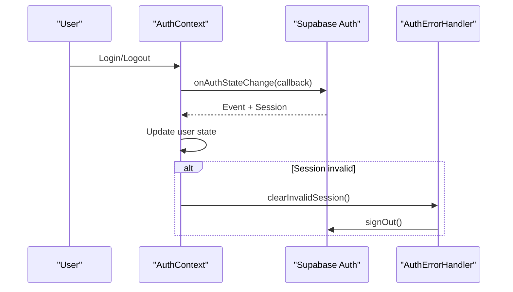
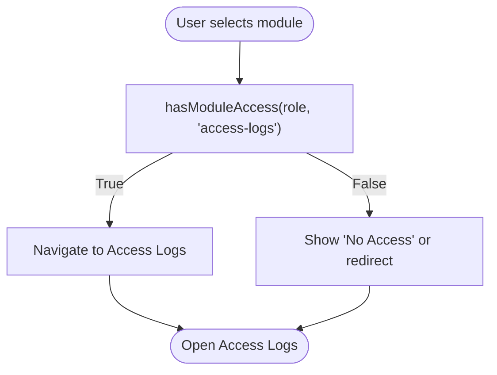
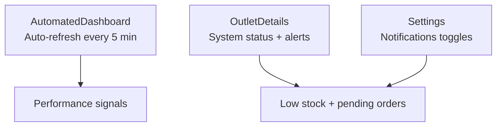
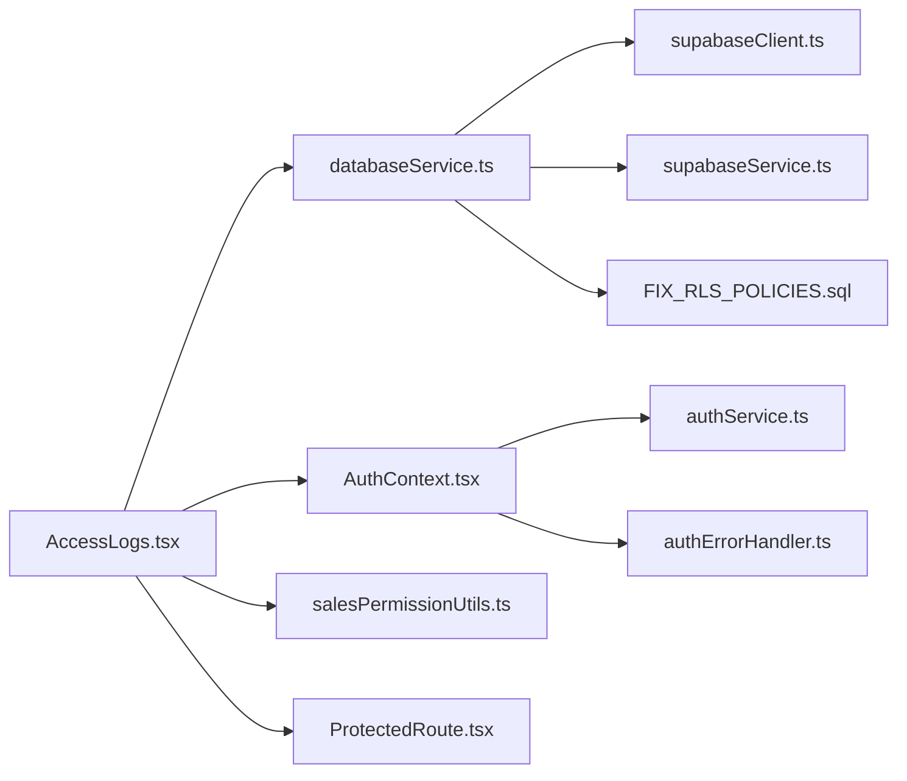

# Access Logs and Monitoring

<cite>
**Referenced Files in This Document**
- [AccessLogs.tsx](file://src/pages/AccessLogs.tsx)
- [databaseService.ts](file://src/services/databaseService.ts)
- [supabaseService.ts](file://src/services/supabaseService.ts)
- [supabaseClient.ts](file://src/lib/supabaseClient.ts)
- [authService.ts](file://src/services/authService.ts)
- [authErrorHandler.ts](file://src/utils/authErrorHandler.ts)
- [AuthContext.tsx](file://src/contexts/AuthContext.tsx)
- [ProtectedRoute.tsx](file://src/components/ProtectedRoute.tsx)
- [ComprehensiveDashboard.tsx](file://src/pages/ComprehensiveDashboard.tsx)
- [AutomatedDashboard.tsx](file://src/pages/AutomatedDashboard.tsx)
- [OutletDetails.tsx](file://src/pages/OutletDetails.tsx)
- [salesPermissionUtils.ts](file://src/utils/salesPermissionUtils.ts)
- [FIX_RLS_POLICIES.sql](file://FIX_RLS_POLICIES.sql)
- [Settings.tsx](file://src/pages/Settings.tsx)
</cite>

## Table of Contents
1. [Introduction](#introduction)
2. [Project Structure](#project-structure)
3. [Core Components](#core-components)
4. [Architecture Overview](#architecture-overview)
5. [Detailed Component Analysis](#detailed-component-analysis)
6. [Dependency Analysis](#dependency-analysis)
7. [Performance Considerations](#performance-considerations)
8. [Troubleshooting Guide](#troubleshooting-guide)
9. [Conclusion](#conclusion)
10. [Appendices](#appendices)

## Introduction
This document provides comprehensive access logs and monitoring documentation for the Royal POS Modern system. It explains how access logs are captured, stored, and viewed, how audit trails support compliance and internal monitoring, and how system health and performance indicators are surfaced. It also covers integration with Supabase for real-time logging and monitoring, outlines log retention considerations, and provides practical procedures for reviewing logs, setting up monitoring alerts, and troubleshooting using access logs.

## Project Structure
The access logs and monitoring functionality spans several frontend components and backend services:
- Frontend pages for viewing access logs and dashboards
- Supabase client and service utilities for connectivity and operations
- Authentication and authorization utilities for secure access
- Database service for CRUD operations against the access_logs table
- Role-based permissions and protected routes for access control

**Diagram sources**
- [AccessLogs.tsx:1-334](file://src/pages/AccessLogs.tsx#L1-L334)
- [databaseService.ts:2975-3053](file://src/services/databaseService.ts#L2975-L3053)
- [supabaseService.ts:1-60](file://src/services/supabaseService.ts#L1-L60)
- [supabaseClient.ts:1-33](file://src/lib/supabaseClient.ts#L1-L33)
- [authService.ts:47-127](file://src/services/authService.ts#L47-L127)
- [authErrorHandler.ts:1-92](file://src/utils/authErrorHandler.ts#L1-L92)
- [AuthContext.tsx:1-81](file://src/contexts/AuthContext.tsx#L1-L81)
- [ProtectedRoute.tsx:1-30](file://src/components/ProtectedRoute.tsx#L1-L30)
- [salesPermissionUtils.ts:1-171](file://src/utils/salesPermissionUtils.ts#L1-L171)
- [FIX_RLS_POLICIES.sql:213-222](file://FIX_RLS_POLICIES.sql#L213-L222)

**Section sources**
- [AccessLogs.tsx:1-334](file://src/pages/AccessLogs.tsx#L1-L334)
- [databaseService.ts:2975-3053](file://src/services/databaseService.ts#L2975-L3053)
- [supabaseService.ts:1-60](file://src/services/supabaseService.ts#L1-L60)
- [supabaseClient.ts:1-33](file://src/lib/supabaseClient.ts#L1-L33)
- [authService.ts:47-127](file://src/services/authService.ts#L47-L127)
- [authErrorHandler.ts:1-92](file://src/utils/authErrorHandler.ts#L1-L92)
- [AuthContext.tsx:1-81](file://src/contexts/AuthContext.tsx#L1-L81)
- [ProtectedRoute.tsx:1-30](file://src/components/ProtectedRoute.tsx#L1-L30)
- [salesPermissionUtils.ts:1-171](file://src/utils/salesPermissionUtils.ts#L1-L171)
- [FIX_RLS_POLICIES.sql:213-222](file://FIX_RLS_POLICIES.sql#L213-L222)

## Core Components
- Access Logs Page: Provides a searchable, filterable table of access events with summary cards and export capability.
- Database Service: Implements CRUD operations for the access_logs table, ordering by creation timestamp.
- Supabase Client and Service: Centralized client initialization and health checks; generic helpers for reads/writes.
- Authentication and Authorization: User sessions, role retrieval, and route protection.
- Permissions and Dashboards: Role-based module access and navigation to access logs.

Key responsibilities:
- Capture and persist access events (login/logout, CRUD, view, export, error).
- Retrieve and render logs with filters and summaries.
- Enforce access controls and protect sensitive areas.
- Surface system health and performance signals via dashboards.

**Section sources**
- [AccessLogs.tsx:12-138](file://src/pages/AccessLogs.tsx#L12-L138)
- [databaseService.ts:2975-3053](file://src/services/databaseService.ts#L2975-L3053)
- [supabaseClient.ts:19-31](file://src/lib/supabaseClient.ts#L19-L31)
- [supabaseService.ts:4-23](file://src/services/supabaseService.ts#L4-L23)
- [authService.ts:54-82](file://src/services/authService.ts#L54-L82)
- [salesPermissionUtils.ts:94-171](file://src/utils/salesPermissionUtils.ts#L94-L171)

## Architecture Overview
The access logging architecture integrates frontend components with Supabase for storage and retrieval, while authentication and permissions govern who can view logs and what modules they can access.

**Diagram sources**
- [AccessLogs.tsx:120-133](file://src/pages/AccessLogs.tsx#L120-L133)
- [databaseService.ts:2976-2988](file://src/services/databaseService.ts#L2976-L2988)

**Section sources**
- [AccessLogs.tsx:120-133](file://src/pages/AccessLogs.tsx#L120-L133)
- [databaseService.ts:2976-2988](file://src/services/databaseService.ts#L2976-L2988)

## Detailed Component Analysis

### Access Logs Page
The Access Logs page defines the log model, renders summary cards, and provides filtering/searching capabilities. It displays user identity, action type, module, timestamp, IP address, status, and optional details.

**Diagram sources**
- [AccessLogs.tsx:25-138](file://src/pages/AccessLogs.tsx#L25-L138)

Practical usage:
- Review recent login/logout activity and failed attempts.
- Filter by module (e.g., Authentication, Products) and action (create, update, delete).
- Export logs for external auditing.

**Section sources**
- [AccessLogs.tsx:12-138](file://src/pages/AccessLogs.tsx#L12-L138)

### Database Service: Access Logs CRUD
The database service encapsulates all access_logs operations:
- Fetch all logs ordered by creation timestamp.
- Fetch a single log by ID.
- Create a new log with timestamps.
- Update an existing log with updated timestamp.
- Delete a log by ID.

**Diagram sources**
- [databaseService.ts:2975-3053](file://src/services/databaseService.ts#L2975-L3053)
- [supabaseClient.ts:19-31](file://src/lib/supabaseClient.ts#L19-L31)

Operational notes:
- Creation and update operations attach ISO timestamps for audit trail completeness.
- Error handling returns safe defaults to prevent crashes.

**Section sources**
- [databaseService.ts:2975-3053](file://src/services/databaseService.ts#L2975-L3053)

### Supabase Client and Health Checks
The Supabase client initializes with environment variables and auto-refreshes sessions. A dedicated health-check function tests connectivity by querying a small dataset.

**Diagram sources**
- [supabaseClient.ts:4-31](file://src/lib/supabaseClient.ts#L4-L31)
- [supabaseService.ts:4-23](file://src/services/supabaseService.ts#L4-L23)

**Section sources**
- [supabaseClient.ts:4-31](file://src/lib/supabaseClient.ts#L4-L31)
- [supabaseService.ts:4-23](file://src/services/supabaseService.ts#L4-L23)

### Authentication and Authorization
Authentication state changes are observed and persisted, enabling secure access to logs and dashboards. The error handler manages refresh token failures and session cleanup.

**Diagram sources**
- [AuthContext.tsx:42-54](file://src/contexts/AuthContext.tsx#L42-L54)
- [authErrorHandler.ts:43-56](file://src/utils/authErrorHandler.ts#L43-L56)

**Section sources**
- [AuthContext.tsx:16-81](file://src/contexts/AuthContext.tsx#L16-L81)
- [authErrorHandler.ts:14-92](file://src/utils/authErrorHandler.ts#L14-L92)

### Role-Based Access to Logs
Role-based permissions determine which modules a user can access, including access logs. The dashboard exposes a direct link to access logs for authorized roles.

**Diagram sources**
- [salesPermissionUtils.ts:94-171](file://src/utils/salesPermissionUtils.ts#L94-L171)
- [ComprehensiveDashboard.tsx:292-295](file://src/pages/ComprehensiveDashboard.tsx#L292-L295)

**Section sources**
- [salesPermissionUtils.ts:94-171](file://src/utils/salesPermissionUtils.ts#L94-L171)
- [ComprehensiveDashboard.tsx:292-295](file://src/pages/ComprehensiveDashboard.tsx#L292-L295)

### System Health and Performance Indicators
While not dedicated to access logs, the system surfaces health and performance signals:
- Automated Dashboard refreshes metrics periodically and shows last-updated timestamps.
- Outlet Details dashboard displays system status and low stock alerts.
- Settings supports toggling notifications for low stock and daily reports.

**Diagram sources**
- [AutomatedDashboard.tsx:105-112](file://src/pages/AutomatedDashboard.tsx#L105-L112)
- [OutletDetails.tsx:521-548](file://src/pages/OutletDetails.tsx#L521-L548)
- [Settings.tsx:845-899](file://src/pages/Settings.tsx#L845-L899)

**Section sources**
- [AutomatedDashboard.tsx:105-112](file://src/pages/AutomatedDashboard.tsx#L105-L112)
- [OutletDetails.tsx:521-548](file://src/pages/OutletDetails.tsx#L521-L548)
- [Settings.tsx:845-899](file://src/pages/Settings.tsx#L845-L899)

## Dependency Analysis
The access logs feature depends on:
- Supabase client and environment configuration
- Database service for CRUD operations
- Authentication context and error handling
- Role-based permissions and protected routing

**Diagram sources**
- [AccessLogs.tsx:1-334](file://src/pages/AccessLogs.tsx#L1-L334)
- [databaseService.ts:2975-3053](file://src/services/databaseService.ts#L2975-L3053)
- [supabaseClient.ts:1-33](file://src/lib/supabaseClient.ts#L1-L33)
- [supabaseService.ts:1-60](file://src/services/supabaseService.ts#L1-L60)
- [AuthContext.tsx:1-81](file://src/contexts/AuthContext.tsx#L1-L81)
- [authService.ts:47-127](file://src/services/authService.ts#L47-L127)
- [authErrorHandler.ts:1-92](file://src/utils/authErrorHandler.ts#L1-L92)
- [salesPermissionUtils.ts:1-171](file://src/utils/salesPermissionUtils.ts#L1-L171)
- [ProtectedRoute.tsx:1-30](file://src/components/ProtectedRoute.tsx#L1-L30)
- [FIX_RLS_POLICIES.sql:213-222](file://FIX_RLS_POLICIES.sql#L213-L222)

**Section sources**
- [AccessLogs.tsx:1-334](file://src/pages/AccessLogs.tsx#L1-L334)
- [databaseService.ts:2975-3053](file://src/services/databaseService.ts#L2975-L3053)
- [supabaseClient.ts:1-33](file://src/lib/supabaseClient.ts#L1-L33)
- [supabaseService.ts:1-60](file://src/services/supabaseService.ts#L1-L60)
- [AuthContext.tsx:1-81](file://src/contexts/AuthContext.tsx#L1-L81)
- [authService.ts:47-127](file://src/services/authService.ts#L47-L127)
- [authErrorHandler.ts:1-92](file://src/utils/authErrorHandler.ts#L1-L92)
- [salesPermissionUtils.ts:1-171](file://src/utils/salesPermissionUtils.ts#L1-L171)
- [ProtectedRoute.tsx:1-30](file://src/components/ProtectedRoute.tsx#L1-L30)
- [FIX_RLS_POLICIES.sql:213-222](file://FIX_RLS_POLICIES.sql#L213-L222)

## Performance Considerations
- Pagination and indexing: For large datasets, add pagination and database indexes on frequently queried columns (e.g., created_at, user_id, module).
- Client-side filtering: The Access Logs page currently filters client-side; for heavy loads, offload filtering to the server.
- Batch exports: Implement server-side export to avoid large client-side rendering and memory pressure.
- Health checks: Use the Supabase health-check utility to proactively detect connectivity issues.

[No sources needed since this section provides general guidance]

## Troubleshooting Guide
Common scenarios and resolutions:
- Authentication failures and expired sessions:
  - Use the authentication error handler to detect refresh token issues and clear invalid sessions.
  - Trigger manual session refresh when needed.
- Supabase connectivity issues:
  - Run the health-check function to confirm database availability.
  - Verify environment variables for Supabase URL and anonymous key.
- Access logs not appearing:
  - Confirm RLS policies allow read access to the access_logs table.
  - Ensure the database service is successfully querying the table.
- Role-based access problems:
  - Verify the user’s role and module permissions.
  - Confirm protected routes enforce authentication.

**Section sources**
- [authErrorHandler.ts:14-92](file://src/utils/authErrorHandler.ts#L14-L92)
- [supabaseService.ts:4-23](file://src/services/supabaseService.ts#L4-L23)
- [supabaseClient.ts:10-17](file://src/lib/supabaseClient.ts#L10-L17)
- [FIX_RLS_POLICIES.sql:213-222](file://FIX_RLS_POLICIES.sql#L213-L222)
- [salesPermissionUtils.ts:94-171](file://src/utils/salesPermissionUtils.ts#L94-L171)
- [ProtectedRoute.tsx:14-29](file://src/components/ProtectedRoute.tsx#L14-L29)

## Conclusion
Royal POS Modern provides a robust foundation for access logging and monitoring through:
- A dedicated Access Logs page with filtering and summaries
- Supabase-backed persistence with CRUD operations
- Strong authentication and authorization controls
- Role-based dashboards and navigation
- Health and performance indicators across dashboards

To enhance compliance and monitoring, consider server-side filtering, batch exports, and stricter RLS policies aligned with your organization’s security posture.

[No sources needed since this section summarizes without analyzing specific files]

## Appendices

### Practical Examples

- Reviewing access logs:
  - Navigate to the Access Logs module from the dashboard.
  - Use the search box to filter by username, module, or details.
  - Apply action and status filters to narrow results.
  - Export logs for external review.

- Setting up monitoring alerts:
  - Enable low stock alerts and daily reports in Settings.
  - Monitor Automated Dashboard for periodic updates and last-updated timestamps.
  - Use Outlet Details for quick system status and low stock indicators.

- Analyzing system performance data:
  - Observe Automated Dashboard metrics and refresh intervals.
  - Track outlet performance bars and target progress indicators.

- Integrating with Supabase:
  - Ensure environment variables are configured correctly.
  - Use the Supabase client and service utilities for connectivity and operations.
  - Confirm RLS policies permit access to access_logs for authorized users.

**Section sources**
- [AccessLogs.tsx:190-253](file://src/pages/AccessLogs.tsx#L190-L253)
- [Settings.tsx:845-899](file://src/pages/Settings.tsx#L845-L899)
- [AutomatedDashboard.tsx:105-112](file://src/pages/AutomatedDashboard.tsx#L105-L112)
- [OutletDetails.tsx:521-548](file://src/pages/OutletDetails.tsx#L521-L548)
- [supabaseClient.ts:4-31](file://src/lib/supabaseClient.ts#L4-L31)
- [supabaseService.ts:4-23](file://src/services/supabaseService.ts#L4-L23)
- [FIX_RLS_POLICIES.sql:213-222](file://FIX_RLS_POLICIES.sql#L213-L222)