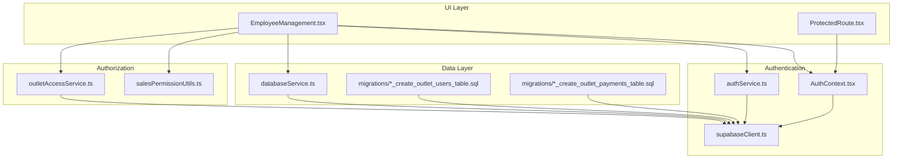
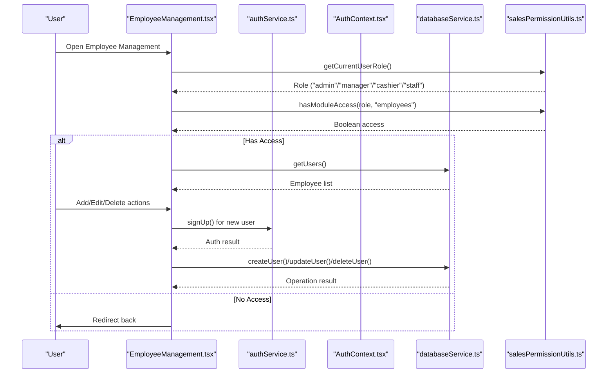
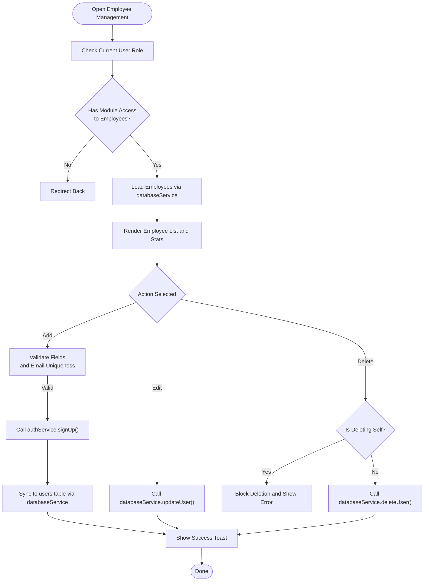
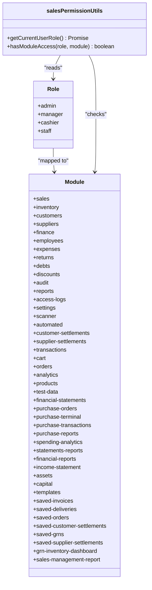
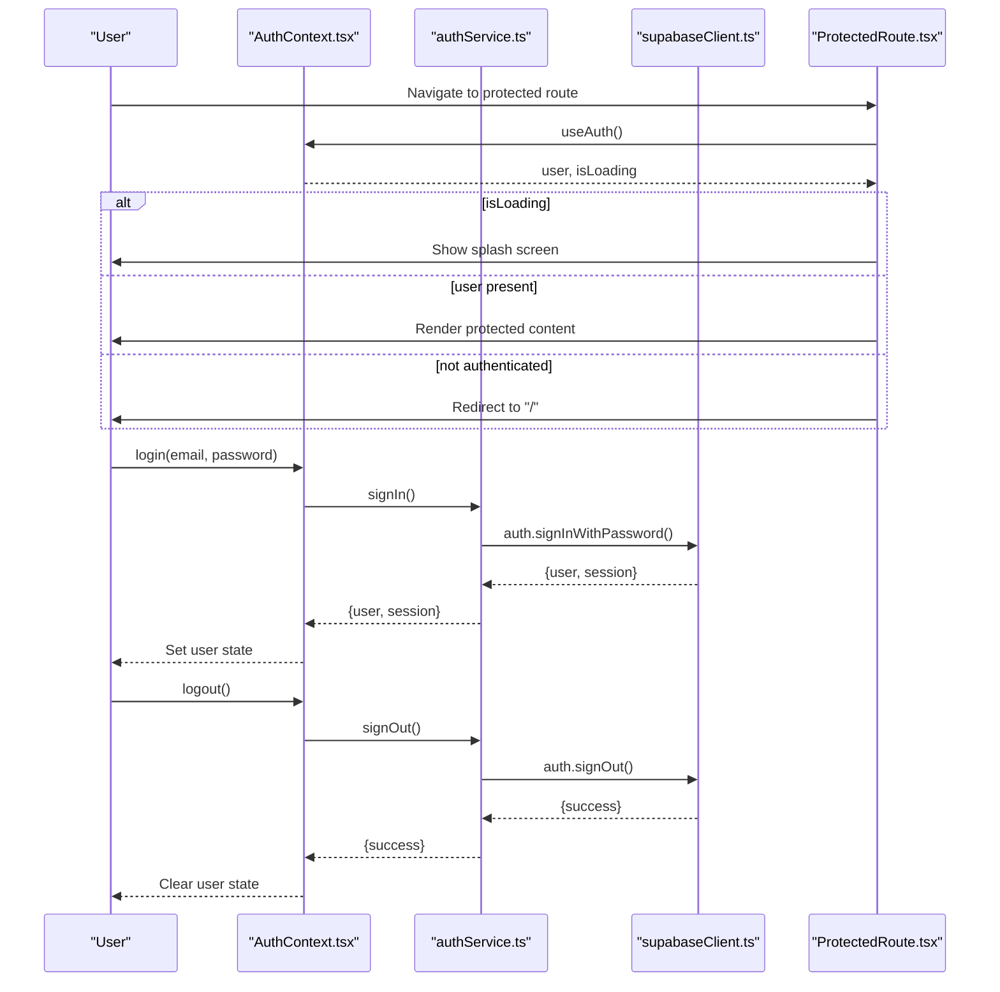
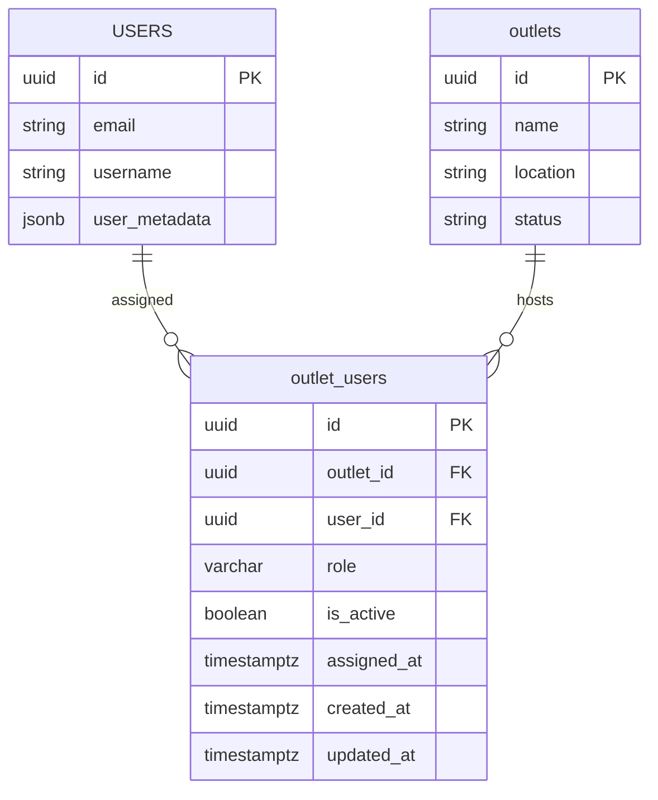
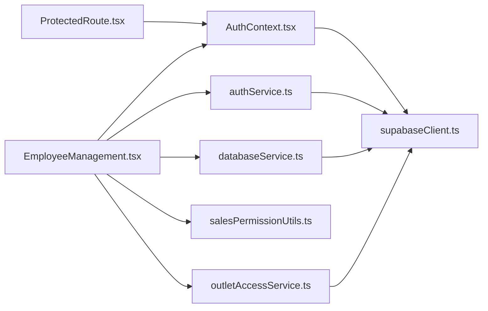

# Employee Management

<cite>
**Referenced Files in This Document**
- [EmployeeManagement.tsx](file://src/pages/EmployeeManagement.tsx)
- [AuthContext.tsx](file://src/contexts/AuthContext.tsx)
- [authService.ts](file://src/services/authService.ts)
- [salesPermissionUtils.ts](file://src/utils/salesPermissionUtils.ts)
- [databaseService.ts](file://src/services/databaseService.ts)
- [outletAccessService.ts](file://src/services/outletAccessService.ts)
- [supabaseClient.ts](file://src/lib/supabaseClient.ts)
- [ProtectedRoute.tsx](file://src/components/ProtectedRoute.tsx)
- [20260419_create_outlet_users_table.sql](file://migrations/20260419_create_outlet_users_table.sql)
- [20260426_create_outlet_payments_table.sql](file://migrations/20260426_create_outlet_payments_table.sql)
</cite>

## Table of Contents
1. [Introduction](#introduction)
2. [Project Structure](#project-structure)
3. [Core Components](#core-components)
4. [Architecture Overview](#architecture-overview)
5. [Detailed Component Analysis](#detailed-component-analysis)
6. [Dependency Analysis](#dependency-analysis)
7. [Performance Considerations](#performance-considerations)
8. [Troubleshooting Guide](#troubleshooting-guide)
9. [Conclusion](#conclusion)
10. [Appendices](#appendices)

## Introduction
This document provides comprehensive guidance for managing employees in the Royal POS Modern system. It covers user registration, role assignment, permission configuration, authentication workflows, session management, and access control. It also documents practical procedures for adding new employees, configuring access permissions, managing user accounts, integrating with authentication context, and handling password management and account deactivation.

## Project Structure
The employee management feature is implemented as a dedicated page that integrates with authentication, authorization utilities, and database services. It leverages Supabase for authentication and data persistence, and uses role-based access control (RBAC) to restrict module access.

**Diagram sources**
- [EmployeeManagement.tsx:1-601](file://src/pages/EmployeeManagement.tsx#L1-L601)
- [AuthContext.tsx:1-118](file://src/contexts/AuthContext.tsx#L1-L118)
- [authService.ts:1-127](file://src/services/authService.ts#L1-L127)
- [salesPermissionUtils.ts:1-171](file://src/utils/salesPermissionUtils.ts#L1-L171)
- [databaseService.ts:1-800](file://src/services/databaseService.ts#L1-L800)
- [outletAccessService.ts:1-98](file://src/services/outletAccessService.ts#L1-L98)
- [supabaseClient.ts:1-33](file://src/lib/supabaseClient.ts#L1-L33)
- [ProtectedRoute.tsx:1-30](file://src/components/ProtectedRoute.tsx#L1-L30)
- [20260419_create_outlet_users_table.sql:1-40](file://migrations/20260419_create_outlet_users_table.sql#L1-L40)
- [20260426_create_outlet_payments_table.sql:1-72](file://migrations/20260426_create_outlet_payments_table.sql#L1-L72)

**Section sources**
- [EmployeeManagement.tsx:1-601](file://src/pages/EmployeeManagement.tsx#L1-L601)
- [AuthContext.tsx:1-118](file://src/contexts/AuthContext.tsx#L1-L118)
- [authService.ts:1-127](file://src/services/authService.ts#L1-L127)
- [salesPermissionUtils.ts:1-171](file://src/utils/salesPermissionUtils.ts#L1-L171)
- [databaseService.ts:1-800](file://src/services/databaseService.ts#L1-L800)
- [outletAccessService.ts:1-98](file://src/services/outletAccessService.ts#L1-L98)
- [supabaseClient.ts:1-33](file://src/lib/supabaseClient.ts#L1-L33)
- [ProtectedRoute.tsx:1-30](file://src/components/ProtectedRoute.tsx#L1-L30)
- [20260419_create_outlet_users_table.sql:1-40](file://migrations/20260419_create_outlet_users_table.sql#L1-L40)
- [20260426_create_outlet_payments_table.sql:1-72](file://migrations/20260426_create_outlet_payments_table.sql#L1-L72)

## Core Components
- EmployeeManagement page: Provides UI for listing, adding, editing, and deleting employees; handles role-based access checks and user creation via authentication service.
- AuthContext and authService: Manage authentication state, login/logout, sign-up, and session persistence.
- salesPermissionUtils: Implements RBAC by role and module access checks.
- databaseService: Manages user CRUD operations against the Supabase users table.
- outletAccessService: Manages outlet-user assignments and access checks for multi-outlet deployments.
- ProtectedRoute: Guards routes to ensure only authenticated users can access protected views.
- Supabase client: Centralized configuration for Supabase authentication and session handling.

**Section sources**
- [EmployeeManagement.tsx:24-56](file://src/pages/EmployeeManagement.tsx#L24-L56)
- [AuthContext.tsx:6-12](file://src/contexts/AuthContext.tsx#L6-L12)
- [authService.ts:54-76](file://src/services/authService.ts#L54-L76)
- [salesPermissionUtils.ts:94-171](file://src/utils/salesPermissionUtils.ts#L94-L171)
- [databaseService.ts:416-494](file://src/services/databaseService.ts#L416-L494)
- [outletAccessService.ts:22-97](file://src/services/outletAccessService.ts#L22-L97)
- [ProtectedRoute.tsx:10-29](file://src/components/ProtectedRoute.tsx#L10-L29)
- [supabaseClient.ts:20-31](file://src/lib/supabaseClient.ts#L20-L31)

## Architecture Overview
The employee management system follows a layered architecture:
- UI layer: EmployeeManagement page renders forms and lists employees.
- Authorization layer: salesPermissionUtils enforces role-based module access.
- Authentication layer: AuthContext and authService manage sessions and user metadata.
- Data layer: databaseService and outletAccessService interact with Supabase tables.
- Infrastructure: Supabase client configures auto-refresh, persistence, and session detection.

**Diagram sources**
- [EmployeeManagement.tsx:76-90](file://src/pages/EmployeeManagement.tsx#L76-L90)
- [salesPermissionUtils.ts:26-86](file://src/utils/salesPermissionUtils.ts#L26-L86)
- [authService.ts:6-23](file://src/services/authService.ts#L6-L23)
- [databaseService.ts:416-494](file://src/services/databaseService.ts#L416-L494)

## Detailed Component Analysis

### Employee Profile Management
- Registration: New employees are created through the authentication service with user metadata (role, active status). The UI validates required fields and prevents duplicate emails.
- Role Assignment: Roles are selected from predefined options and persisted in user metadata. The system distinguishes between administrative roles and operational roles.
- Permission Configuration: While the UI exposes a permissions list, the RBAC model is role-driven. Permissions are enforced via module access checks.
- Account Management: Employees can be activated/deactivated by toggling the status field. Deletion is prevented for the currently logged-in user.

**Diagram sources**
- [EmployeeManagement.tsx:164-332](file://src/pages/EmployeeManagement.tsx#L164-L332)
- [authService.ts:6-23](file://src/services/authService.ts#L6-L23)
- [databaseService.ts:416-494](file://src/services/databaseService.ts#L416-L494)

**Section sources**
- [EmployeeManagement.tsx:58-332](file://src/pages/EmployeeManagement.tsx#L58-L332)
- [databaseService.ts:416-494](file://src/services/databaseService.ts#L416-L494)
- [authService.ts:6-23](file://src/services/authService.ts#L6-L23)

### Role-Based Access Control (RBAC)
- Roles: admin, manager, cashier, staff.
- Module Access: Module access is determined by role using a centralized mapping. Managers have broad access excluding the Employee Management module.
- Enforcement: Access checks occur on component mount and navigation guards ensure unauthorized users are redirected.

**Diagram sources**
- [salesPermissionUtils.ts:94-171](file://src/utils/salesPermissionUtils.ts#L94-L171)

**Section sources**
- [salesPermissionUtils.ts:94-171](file://src/utils/salesPermissionUtils.ts#L94-L171)

### Authentication Workflows and Session Management
- Login: Uses Supabase authentication with password-based sign-in. Handles email confirmation requirement and refresh token errors.
- Logout: Signs out the current session and clears local storage.
- Session Persistence: Supabase auto-refreshes tokens and persists sessions in local storage.
- Protected Routes: Ensures unauthenticated users are redirected to the login page.

**Diagram sources**
- [AuthContext.tsx:16-118](file://src/contexts/AuthContext.tsx#L16-L118)
- [authService.ts:26-51](file://src/services/authService.ts#L26-L51)
- [supabaseClient.ts:20-31](file://src/lib/supabaseClient.ts#L20-L31)
- [ProtectedRoute.tsx:10-29](file://src/components/ProtectedRoute.tsx#L10-L29)

**Section sources**
- [AuthContext.tsx:16-118](file://src/contexts/AuthContext.tsx#L16-L118)
- [authService.ts:26-51](file://src/services/authService.ts#L26-L51)
- [supabaseClient.ts:20-31](file://src/lib/supabaseClient.ts#L20-L31)
- [ProtectedRoute.tsx:10-29](file://src/components/ProtectedRoute.tsx#L10-L29)

### Multi-Outlet Access Control
- Outlet Users Table: Tracks user-to-outlet assignments with roles and active status.
- Access Checks: Functions verify whether a user has access to a specific outlet and can fetch the assigned outlet.
- Policies: Row-level security policies govern access to outlet assignments.

**Diagram sources**
- [20260419_create_outlet_users_table.sql:1-40](file://migrations/20260419_create_outlet_users_table.sql#L1-L40)
- [outletAccessService.ts:22-97](file://src/services/outletAccessService.ts#L22-L97)

**Section sources**
- [outletAccessService.ts:22-97](file://src/services/outletAccessService.ts#L22-L97)
- [20260419_create_outlet_users_table.sql:1-40](file://migrations/20260419_create_outlet_users_table.sql#L1-L40)

## Dependency Analysis
- EmployeeManagement depends on:
  - AuthContext and authService for authentication state and operations.
  - salesPermissionUtils for role-based access checks.
  - databaseService for user CRUD operations.
  - outletAccessService for multi-outlet scenarios.
- ProtectedRoute depends on AuthContext to enforce authentication.
- Supabase client configures session behavior and is used by all auth and data services.

**Diagram sources**
- [EmployeeManagement.tsx:14-22](file://src/pages/EmployeeManagement.tsx#L14-L22)
- [AuthContext.tsx:1-12](file://src/contexts/AuthContext.tsx#L1-L12)
- [authService.ts:1-3](file://src/services/authService.ts#L1-L3)
- [databaseService.ts:1](file://src/services/databaseService.ts#L1)
- [outletAccessService.ts:1](file://src/services/outletAccessService.ts#L1)
- [supabaseClient.ts:1](file://src/lib/supabaseClient.ts#L1)
- [ProtectedRoute.tsx:1-8](file://src/components/ProtectedRoute.tsx#L1-L8)

**Section sources**
- [EmployeeManagement.tsx:14-22](file://src/pages/EmployeeManagement.tsx#L14-L22)
- [AuthContext.tsx:1-12](file://src/contexts/AuthContext.tsx#L1-L12)
- [authService.ts:1-3](file://src/services/authService.ts#L1-L3)
- [databaseService.ts:1](file://src/services/databaseService.ts#L1)
- [outletAccessService.ts:1](file://src/services/outletAccessService.ts#L1)
- [supabaseClient.ts:1](file://src/lib/supabaseClient.ts#L1)
- [ProtectedRoute.tsx:1-8](file://src/components/ProtectedRoute.tsx#L1-L8)

## Performance Considerations
- Minimize repeated role checks by caching the current user’s role after initial retrieval.
- Batch UI updates to avoid unnecessary re-renders when loading employee lists.
- Use server-side filtering and pagination for large datasets when extending the employee list.
- Ensure Supabase queries leverage indexes (e.g., user email, outlet assignments) to reduce latency.

## Troubleshooting Guide
- Authentication Failures:
  - Refresh token errors: The system clears invalid sessions and prompts re-login.
  - Email confirmation: Users receive a confirmation email; login is blocked until confirmed.
- Session Issues:
  - Auto-refresh is enabled; if sessions expire unexpectedly, clear local storage entries and retry.
- Access Denied:
  - If the Employee Management module is unavailable, verify the user’s role and module access mapping.
- Duplicate Emails:
  - Prevent duplicate registrations by validating email uniqueness before creating a user.
- Self-Deletion:
  - Prevent accidental self-deletion by blocking deletion of the currently logged-in user.

**Section sources**
- [AuthContext.tsx:20-54](file://src/contexts/AuthContext.tsx#L20-L54)
- [authService.ts:85-97](file://src/services/authService.ts#L85-L97)
- [EmployeeManagement.tsx:164-332](file://src/pages/EmployeeManagement.tsx#L164-L332)
- [salesPermissionUtils.ts:94-171](file://src/utils/salesPermissionUtils.ts#L94-L171)

## Conclusion
The employee management system integrates authentication, authorization, and data services to provide a secure and flexible way to manage users. RBAC ensures appropriate access to modules, while Supabase handles authentication and session persistence. The design supports multi-outlet deployments and can be extended to include granular permissions and audit logging.

## Appendices

### Practical Procedures

- Adding a New Employee
  - Navigate to the Employee Management page.
  - Click Add Employee and fill in required fields: name, email, password, role, status.
  - Submit to create the user; if email confirmation is enabled, inform the user to confirm their email before logging in.

- Configuring Access Permissions
  - Assign roles (admin, manager, cashier, staff) based on job responsibilities.
  - Managers gain access to most modules except Employee Management.
  - For multi-outlet setups, assign outlet-specific roles via outlet access utilities.

- Managing User Accounts
  - Activate or deactivate users by toggling the status field.
  - Edit user details (name, email, role) using the edit dialog.
  - Deactivate or delete users; prevent self-deletion by blocking the current user.

- Password Management
  - Use the authentication service to reset or update passwords.
  - Enforce strong password policies and require email confirmation for new accounts.

- User Onboarding and Deactivation
  - Onboarding: Create user via sign-up, assign role, and notify user.
  - Deactivation: Set status to inactive; re-activation restores access.
  - Deletion: Remove user records; ensure no critical data is lost.

**Section sources**
- [EmployeeManagement.tsx:164-332](file://src/pages/EmployeeManagement.tsx#L164-L332)
- [authService.ts:85-127](file://src/services/authService.ts#L85-L127)
- [salesPermissionUtils.ts:94-171](file://src/utils/salesPermissionUtils.ts#L94-L171)
- [outletAccessService.ts:22-97](file://src/services/outletAccessService.ts#L22-L97)