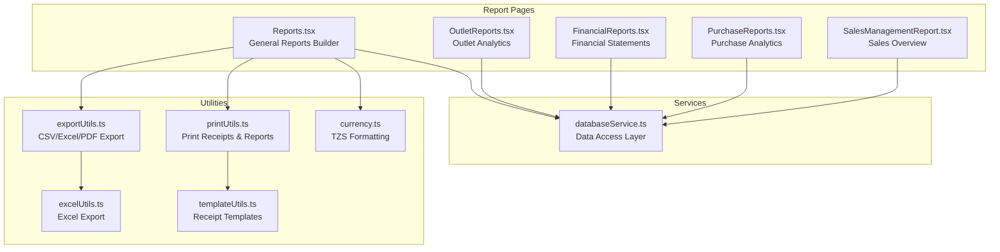
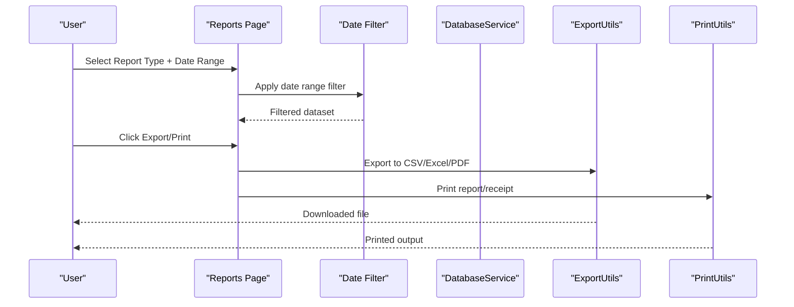
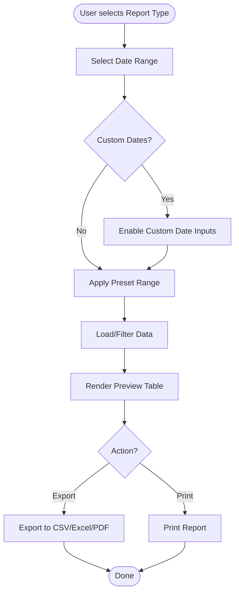
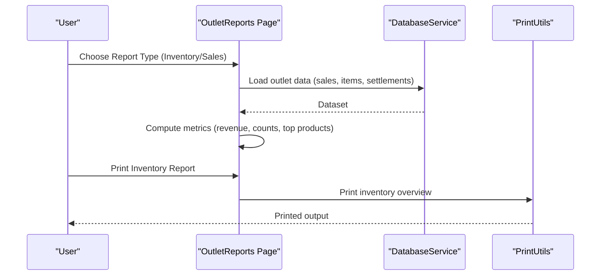
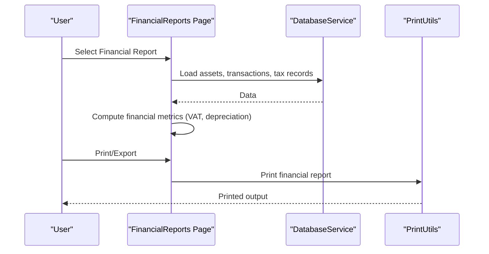
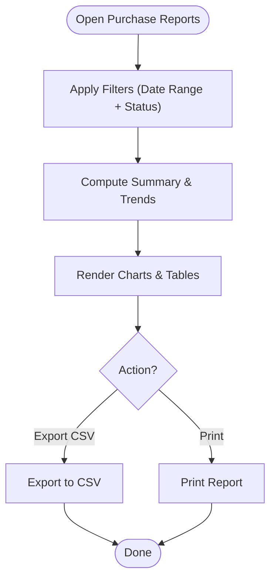
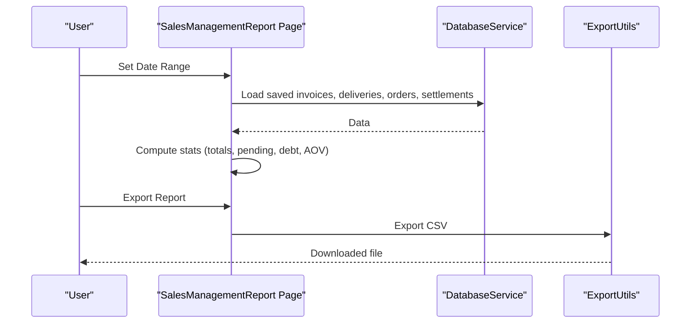
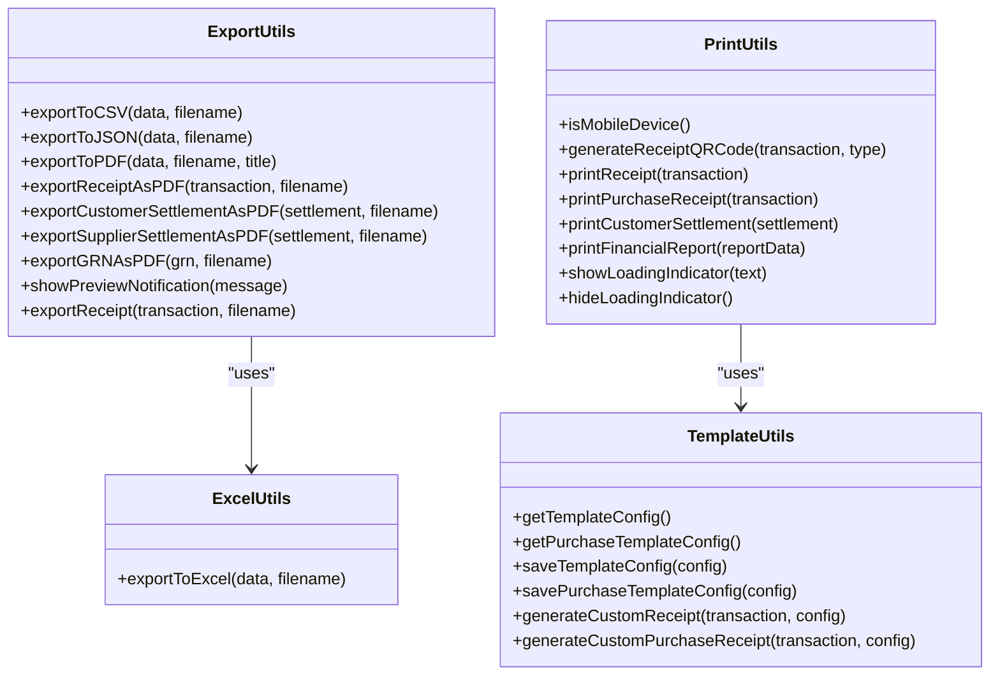
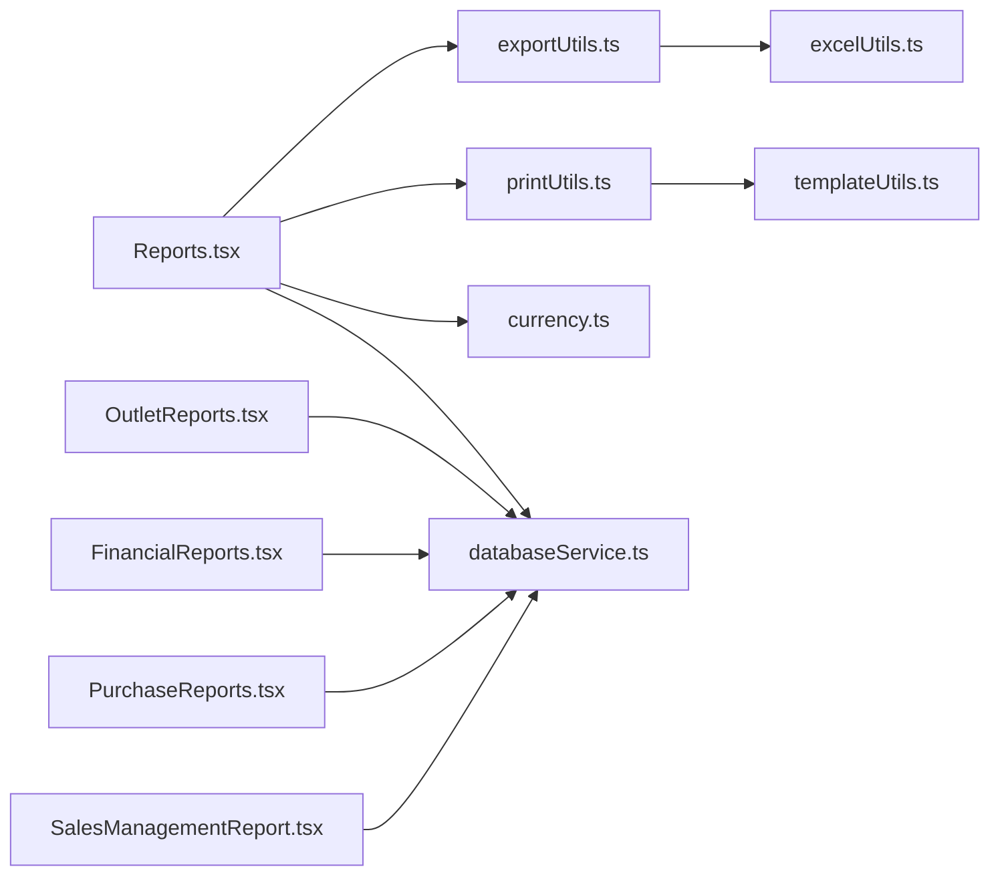

# Custom Report Generation

<cite>
**Referenced Files in This Document**
- [Reports.tsx](file://src/pages/Reports.tsx)
- [OutletReports.tsx](file://src/pages/OutletReports.tsx)
- [FinancialReports.tsx](file://src/pages/FinancialReports.tsx)
- [PurchaseReports.tsx](file://src/pages/PurchaseReports.tsx)
- [SalesManagementReport.tsx](file://src/pages/SalesManagementReport.tsx)
- [exportUtils.ts](file://src/utils/exportUtils.ts)
- [printUtils.ts](file://src/utils/printUtils.ts)
- [excelUtils.ts](file://src/utils/excelUtils.ts)
- [currency.ts](file://src/lib/currency.ts)
- [databaseService.ts](file://src/services/databaseService.ts)
- [templateUtils.ts](file://src/utils/templateUtils.ts)
</cite>

## Table of Contents
1. [Introduction](#introduction)
2. [Project Structure](#project-structure)
3. [Core Components](#core-components)
4. [Architecture Overview](#architecture-overview)
5. [Detailed Component Analysis](#detailed-component-analysis)
6. [Dependency Analysis](#dependency-analysis)
7. [Performance Considerations](#performance-considerations)
8. [Troubleshooting Guide](#troubleshooting-guide)
9. [Conclusion](#conclusion)

## Introduction
This document explains the custom report generation system in Royal POS Modern. It covers the report builder interface, date range filtering, report type selection, preview functionality, data filtering mechanisms, real-time updates, export/print capabilities, currency formatting, statistical calculations, and integration points with external systems. Practical examples demonstrate how to generate custom reports with specific date ranges, filtering criteria, and layouts.

## Project Structure
The report generation system spans several pages and utilities:
- Page-level report builders: general reports, outlet-specific reports, financial reports, purchase reports, and sales management reports
- Utilities for export, printing, and templating
- Currency formatting and database service abstractions
- Mock data and real data loading for report previews

**Diagram sources**
- [Reports.tsx:1164-1384](file://src/pages/Reports.tsx#L1164-L1384)
- [OutletReports.tsx:113-1081](file://src/pages/OutletReports.tsx#L113-L1081)
- [FinancialReports.tsx:70-769](file://src/pages/FinancialReports.tsx#L70-L769)
- [PurchaseReports.tsx:36-439](file://src/pages/PurchaseReports.tsx#L36-L439)
- [SalesManagementReport.tsx:34-665](file://src/pages/SalesManagementReport.tsx#L34-L665)
- [exportUtils.ts:12-109](file://src/utils/exportUtils.ts#L12-L109)
- [printUtils.ts:7-418](file://src/utils/printUtils.ts#L7-L418)
- [excelUtils.ts:2-36](file://src/utils/excelUtils.ts#L2-L36)
- [currency.ts:6-14](file://src/lib/currency.ts#L6-L14)
- [templateUtils.ts:60-97](file://src/utils/templateUtils.ts#L60-L97)
- [databaseService.ts:416-800](file://src/services/databaseService.ts#L416-L800)

**Section sources**
- [Reports.tsx:1164-1384](file://src/pages/Reports.tsx#L1164-L1384)
- [OutletReports.tsx:113-1081](file://src/pages/OutletReports.tsx#L113-L1081)
- [FinancialReports.tsx:70-769](file://src/pages/FinancialReports.tsx#L70-L769)
- [PurchaseReports.tsx:36-439](file://src/pages/PurchaseReports.tsx#L36-L439)
- [SalesManagementReport.tsx:34-665](file://src/pages/SalesManagementReport.tsx#L34-L665)

## Core Components
- Report Builder Interface: Provides report type selection, date range controls, and export/print actions
- Date Range Filtering: Supports preset ranges and custom date ranges with inclusive end dates
- Report Preview: Renders filtered datasets in tabular format with summaries and metrics
- Export/Print Pipeline: Converts filtered data to CSV, Excel, or PDF; prints receipts and reports
- Currency Formatting: Consistent TZS formatting across reports
- Statistical Calculations: Totals, averages, payment breakdowns, and performance metrics
- Real-time Updates: On-the-fly filtering and preview updates as users change selections

**Section sources**
- [Reports.tsx:67-1384](file://src/pages/Reports.tsx#L67-L1384)
- [OutletReports.tsx:113-1081](file://src/pages/OutletReports.tsx#L113-L1081)
- [exportUtils.ts:12-109](file://src/utils/exportUtils.ts#L12-L109)
- [printUtils.ts:7-418](file://src/utils/printUtils.ts#L7-L418)
- [currency.ts:6-14](file://src/lib/currency.ts#L6-L14)

## Architecture Overview
The system follows a layered pattern:
- Presentation layer: React pages render UI, collect filters, and display previews
- Data layer: Services abstract database access and provide typed models
- Utility layer: Export, print, and template utilities transform data into consumable formats
- Formatting layer: Currency utilities ensure consistent monetary representation

**Diagram sources**
- [Reports.tsx:1194-1384](file://src/pages/Reports.tsx#L1194-L1384)
- [exportUtils.ts:12-109](file://src/utils/exportUtils.ts#L12-L109)
- [printUtils.ts:7-418](file://src/utils/printUtils.ts#L7-L418)
- [databaseService.ts:416-800](file://src/services/databaseService.ts#L416-L800)

## Detailed Component Analysis

### General Reports Builder (Reports.tsx)
- Report Types: Sales, Inventory, Customers, Suppliers, Expenses, Saved Invoices, Saved Customer Settlements, Saved Deliveries
- Date Range Controls: Preset ranges (today, yesterday, this week/month/year/all-time/custom) with optional custom date picker
- Preview Rendering: Tabular views with computed summaries (e.g., totals, counts)
- Export/Print: CSV, Excel, PDF via unified handlers; currency formatting applied consistently
- Data Loading: Loads saved records (invoices, settlements, deliveries) when applicable; uses mock data for others

**Diagram sources**
- [Reports.tsx:1194-1384](file://src/pages/Reports.tsx#L1194-L1384)

**Section sources**
- [Reports.tsx:67-1384](file://src/pages/Reports.tsx#L67-L1384)

### Outlet Reports (OutletReports.tsx)
- Outlet-focused analytics: Inventory overview, sales performance, payment status breakdown, and top products
- Date range selector with daily aggregation for sales charts
- Real-time calculations: Revenue, transaction counts, payment mix, and growth comparisons
- Print capability for inventory overview with category breakdown and alerts

**Diagram sources**
- [OutletReports.tsx:113-1081](file://src/pages/OutletReports.tsx#L113-L1081)
- [databaseService.ts:416-800](file://src/services/databaseService.ts#L416-L800)
- [printUtils.ts:7-418](file://src/utils/printUtils.ts#L7-L418)

**Section sources**
- [OutletReports.tsx:113-1081](file://src/pages/OutletReports.tsx#L113-L1081)

### Financial Reports (FinancialReports.tsx)
- Financial statement views: Income Statement, Balance Sheet, Cash Flow, Fund Flow, Trial Balance, Expense Report, Tax Summary, Profitability Analysis
- Custom report creation: Title, description, date range, and save/print actions
- Tax summary: Period selection dialog, filtering tax records by selected period, and aggregated totals
- Printing and export: Unified handlers for printing and export notifications

**Diagram sources**
- [FinancialReports.tsx:70-769](file://src/pages/FinancialReports.tsx#L70-L769)
- [databaseService.ts:416-800](file://src/services/databaseService.ts#L416-L800)
- [printUtils.ts:7-418](file://src/utils/printUtils.ts#L7-L418)

**Section sources**
- [FinancialReports.tsx:70-769](file://src/pages/FinancialReports.tsx#L70-L769)

### Purchase Reports (PurchaseReports.tsx)
- Purchase analytics: Supplier summary, purchase trends, and supplier performance
- Filters: Date range (week/month/quarter/all-time) and status filter
- Export: CSV export; Excel export placeholder
- Refresh: Reloads data from database

**Diagram sources**
- [PurchaseReports.tsx:36-439](file://src/pages/PurchaseReports.tsx#L36-L439)

**Section sources**
- [PurchaseReports.tsx:36-439](file://src/pages/PurchaseReports.tsx#L36-L439)

### Sales Management Report (SalesManagementReport.tsx)
- Multi-entity overview: Invoices, orders, deliveries, and customer settlements
- Date range filtering and derived statistics: totals, pending counts, outstanding debt, average order value
- Export: CSV export of key metrics
- Navigation: Links to detailed sections

**Diagram sources**
- [SalesManagementReport.tsx:34-665](file://src/pages/SalesManagementReport.tsx#L34-L665)
- [databaseService.ts:416-800](file://src/services/databaseService.ts#L416-L800)
- [exportUtils.ts:12-109](file://src/utils/exportUtils.ts#L12-L109)

**Section sources**
- [SalesManagementReport.tsx:34-665](file://src/pages/SalesManagementReport.tsx#L34-L665)

### Export and Print Utilities
- ExportUtils: CSV, JSON, PDF exports; receipt and settlement exports; mobile-friendly PDF handling
- ExcelUtils: Excel export via CSV with BOM for proper encoding
- PrintUtils: Receipt printing (sales/purchase), QR code generation via CDN, mobile print support, template integration
- TemplateUtils: Configurable receipt templates with localStorage persistence

**Diagram sources**
- [exportUtils.ts:12-785](file://src/utils/exportUtils.ts#L12-L785)
- [excelUtils.ts:2-36](file://src/utils/excelUtils.ts#L2-L36)
- [printUtils.ts:7-418](file://src/utils/printUtils.ts#L7-L418)
- [templateUtils.ts:60-584](file://src/utils/templateUtils.ts#L60-L584)

**Section sources**
- [exportUtils.ts:12-785](file://src/utils/exportUtils.ts#L12-L785)
- [excelUtils.ts:2-36](file://src/utils/excelUtils.ts#L2-L36)
- [printUtils.ts:7-418](file://src/utils/printUtils.ts#L7-L418)
- [templateUtils.ts:60-584](file://src/utils/templateUtils.ts#L60-L584)

### Currency Formatting
- formatCurrency: Formats amounts as Tanzanian Shillings (TZS) with 2 decimals and grouping
- parseCurrency: Parses currency strings back to numbers

**Section sources**
- [currency.ts:6-25](file://src/lib/currency.ts#L6-L25)

### Database Service Abstractions
- Typed models for entities (users, products, customers, suppliers, outlets, sales, purchases, expenses, debts, discounts, returns, inventory audits, access logs, tax records, damaged products, discount categories/products, reports, customer settlements, supplier settlements)
- CRUD and specialized queries for report data loading

**Section sources**
- [databaseService.ts:4-398](file://src/services/databaseService.ts#L4-L398)

## Dependency Analysis
The report system exhibits clear separation of concerns:
- Pages depend on utilities for export/print and on database service for data
- Utilities are self-contained and reusable across pages
- Currency formatting is centralized
- Templates decouple presentation from logic

**Diagram sources**
- [Reports.tsx:1164-1384](file://src/pages/Reports.tsx#L1164-L1384)
- [OutletReports.tsx:113-1081](file://src/pages/OutletReports.tsx#L113-L1081)
- [FinancialReports.tsx:70-769](file://src/pages/FinancialReports.tsx#L70-L769)
- [PurchaseReports.tsx:36-439](file://src/pages/PurchaseReports.tsx#L36-L439)
- [SalesManagementReport.tsx:34-665](file://src/pages/SalesManagementReport.tsx#L34-L665)
- [exportUtils.ts:12-109](file://src/utils/exportUtils.ts#L12-L109)
- [printUtils.ts:7-418](file://src/utils/printUtils.ts#L7-L418)
- [excelUtils.ts:2-36](file://src/utils/excelUtils.ts#L2-L36)
- [currency.ts:6-14](file://src/lib/currency.ts#L6-L14)
- [templateUtils.ts:60-97](file://src/utils/templateUtils.ts#L60-L97)
- [databaseService.ts:416-800](file://src/services/databaseService.ts#L416-L800)

**Section sources**
- [Reports.tsx:1164-1384](file://src/pages/Reports.tsx#L1164-L1384)
- [OutletReports.tsx:113-1081](file://src/pages/OutletReports.tsx#L113-L1081)
- [FinancialReports.tsx:70-769](file://src/pages/FinancialReports.tsx#L70-L769)
- [PurchaseReports.tsx:36-439](file://src/pages/PurchaseReports.tsx#L36-L439)
- [SalesManagementReport.tsx:34-665](file://src/pages/SalesManagementReport.tsx#L34-L665)

## Performance Considerations
- Efficient filtering: Date range filtering is linear in dataset size; consider server-side filtering for very large datasets
- Memoization: Derived statistics (averages, totals) are computed on the fly; cache where appropriate
- Export/print: Large datasets may increase memory usage; batch or paginate where feasible
- Mobile printing: PDF generation and QR code fetching are optimized for mobile; network conditions may impact performance

## Troubleshooting Guide
- Date range issues: Ensure custom end dates include the entire day by setting time to end of day; verify date parsing logic
- Export failures: Confirm data arrays are non-empty; check MIME types and file extensions for exports
- Print problems: Verify print frame creation and onload events; ensure mobile print fallbacks are used
- Currency parsing: Use parseCurrency carefully; sanitize inputs before parsing
- Template customization: Persist template configs to localStorage; handle errors gracefully

**Section sources**
- [Reports.tsx:102-197](file://src/pages/Reports.tsx#L102-L197)
- [exportUtils.ts:12-109](file://src/utils/exportUtils.ts#L12-L109)
- [printUtils.ts:7-418](file://src/utils/printUtils.ts#L7-L418)
- [currency.ts:21-25](file://src/lib/currency.ts#L21-L25)
- [templateUtils.ts:60-97](file://src/utils/templateUtils.ts#L60-L97)

## Conclusion
Royal POS Modern’s custom report generation system provides a flexible, extensible framework for building, previewing, filtering, exporting, and printing reports across sales, inventory, customers, suppliers, expenses, and saved records. With robust date filtering, consistent currency formatting, and modular utilities, it supports both general and outlet-specific analytics, enabling informed business decisions and operational oversight.